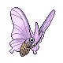
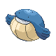
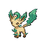
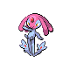
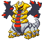
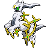

# Pokemon Changes

---

## General Changes

1. The Fairy-type has been added to the game, replacing the almost unused ???-type.
1. All Pokémon have had their base stats updated to match Ultra Sun and Ultra Moon.
1. All Pokémon have had their types updated to match Ultra Sun and Ultra Moon.
1. All Pokémon have had their wild held item updated to match Ultra Sun and Ultra Moon (with some exceptions).
1. All Pokémon now have an egg cycle of 0, i.e. they will hatch extremely quickly.
1. Wingull, Pelipper and Torkoal have gained their new abilities from Gen VII.

---

## Held Item Exceptions

1. Pokémon who may hold an item in Ultra Sun and Ultra Moon that doesn't exist in Platinum will not hold anything.
1. [Corsola](../pokemon/corsola.md) has a 5% chance to hold a Hard Stone.
1. [Pelipper](../pokemon/pelipper.md) has a 5% chance to hold a Lucky Egg.
1. [Absol](../pokemon/absol.md) has a 5% chance to hold a Life Orb.
1. [Spiritomb](../pokemon/spiritomb.md) has a 100% chance to hold a Smoke Ball.

---

## Other Changes

1. Some Pokémon have ability slots flipped (e.g. Scyther). This is because enemy Trainers always use the first ability.

---

## Custom Changes

1. From the bases as listed above, further changes to any Pokémon are listed below. These can include changes to base stats, abilities, types etcetera.
1. Any changes marked with (Complete) are only found in the Complete version. This includes all base stat and non-canon type changes (i.e. types that aren't accurate as of Gen 7), and any ability changes that give an ability to a Pokémon it has never had before (e.g. Weavile). Likewise, any changes marked with (Classic) are only in found in the Classic version. All other changes are in both versions.
1. Some Pokémon have had a Hidden Ability from a later generation added as a regular ability (e.g. Ninetales). These changes are in both the Complete and Classic versions.
1. Changes to movepools e.g. learning moves by level up or TM that were not possible before are also present in both the Complete and Classic versions.
1. TM compatibilty with any of the new TMs (Bug Buzz, Hurricane) is also listed here.
1. Any move previously unavailable to a Pokémon is listed with a (!!) besides it.
1. Level up moves have also been changed for every single Pokémon. These should include all moves they learn in Ultra Sun and Ultra Moon that are available in Renegade Platinum, as well as additional moves from move tutors, egg moves or entirely new techniques.
1. Each Pokémon is listed under its own section header below.

---

## Specific Changes

**[#001 - Bulbasaur](../pokemon/bulbasaur.md)**


Ability:

```
Old: Overgrow / None
New: Chlorophyll / Overgrow
```

Level Up:

```
1 - Tackle
1 - Growl
5 - Vine Whip
8 - Leech Seed
11 - Razor Leaf
14 - Poison Powder
14 - Sleep Powder
17 - Sludge
20 - Take Down
23 - Sweet Scent
26 - Sludge Bomb
29 - Growth
32 - Worry Seed
35 - Double-Edge
38 - Synthesis
41 - Seed Bomb
44 - Leaf Storm
```

**[#002 - Ivysaur](../pokemon/ivysaur.md)**


Ability:

```
Old: Overgrow / None
New: Chlorophyll / Overgrow
```

Level Up:

```
1 - Tackle
1 - Growl
5 - Vine Whip
8 - Leech Seed
11 - Razor Leaf
14 - Poison Powder
14 - Sleep Powder
16 - Magical Leaf
18 - Sludge
22 - Take Down
26 - Sweet Scent
30 - Sludge Bomb
34 - Growth
38 - Worry Seed
42 - Double-Edge
46 - Synthesis
50 - Solar Beam
54 - Leaf Storm
```

**[#003 - Venusaur](../pokemon/venusaur.md)**


Ability (Complete):

```
Old: Overgrow / None
New: Thick Fat / Overgrow
```

Ability (Classic):

```
Old: Overgrow / None
New: Chlorophyll / Overgrow
```

Base Stats (Complete):

```
Old: 80 HP / 82 Atk / 83 Def / 100 SAtk / 100 SDef / 80 Spd / 525 BST
New: 80 HP / 82 Atk / 83 Def / 110 SAtk / 100 SDef / 80 Spd / 535 BST
```

Level Up:

```
1 - Power Whip
1 - Earth Power (!!)
1 - Tackle
1 - Growl
5 - Vine Whip
8 - Leech Seed
11 - Razor Leaf
14 - Poison Powder
14 - Sleep Powder
16 - Magical Leaf
18 - Sludge
22 - Take Down
26 - Sweet Scent
30 - Sludge Bomb
32 - Petal Dance
35 - Growth
40 - Worry Seed
45 - Double-Edge
50 - Synthesis
55 - Solar Beam
60 - Leaf Storm
```

**[#004 - Charmander](../pokemon/charmander.md)**


Ability:

```
Old: Blaze / None
New: Solar Power / Blaze
```

Moves:

```
Now compatible with TM59, Dragon Pulse.
```

Level Up:

```
1 - Scratch
1 - Growl
5 - Ember
8 - Smokescreen
11 - Metal Claw
14 - Bite
17 - Dragon Rage
20 - Fire Fang
23 - Slash
26 - Flamethrower
29 - Scary Face
32 - Crunch
35 - Dragon Pulse
38 - Fire Spin
41 - Belly Drum
44 - Flare Blitz
```

**[#005 - Charmeleon](../pokemon/charmeleon.md)**


Ability:

```
Old: Blaze / None
New: Solar Power / Blaze
```

Moves:

```
Now compatible with TM59, Dragon Pulse.
```

Level Up:

```
1 - Scratch
1 - Growl
5 - Ember
8 - Smokescreen
11 - Metal Claw
14 - Bite
16 - Dragon Breath
18 - Dragon Rage
22 - Fire Fang
26 - Slash
30 - Flamethrower
34 - Scary Face
38 - Crunch
42 - Dragon Pulse
46 - Fire Spin
50 - Belly Drum
54 - Flare Blitz
```

**[#006 - Charizard](../pokemon/charizard.md)**


Ability (Complete):

```
Old: Blaze / None
New: Levitate / Blaze
```

Ability (Classic):

```
Old: Blaze / None
New: Solar Power / None
```

Base Stats (Complete):

```
Old: 78 HP / 84 Atk / 78 Def / 109 SAtk / 85 SDef / 100 Spd / 534 BST
New: 78 HP / 84 Atk / 78 Def / 110 SAtk / 85 SDef / 100 Spd / 535 BST
```

Moves:

```
Now compatible with TM88, Hurricane. (!!)
Now compatible with Draco Meteor from the Move Tutor. (!!) (Complete only)
```

Type (Complete):

```
Old: Fire / Flying
New: Fire / Dragon
```

Level Up:

```
1 - Dragon Claw
1 - Shadow Claw
1 - Wing Attack
1 - Scratch
1 - Growl
5 - Ember
8 - Smokescreen
11 - Metal Claw
14 - Bite
16 - Dragon Breath
18 - Dragon Rage
22 - Fire Fang
26 - Slash
30 - Flamethrower
34 - Scary Face
36 - Air Slash
39 - Crunch
44 - Dragon Pulse
49 - Fire Spin
54 - Belly Drum
59 - Flare Blitz
```

**[#007 - Squirtle](../pokemon/squirtle.md)**


Ability:

```
Old: Torrent / None
New: Rain Dish / Torrent
```

Level Up:

```
1 - Tackle
1 - Tail Whip
5 - Water Gun
8 - Withdraw
11 - Bubble
14 - Bite
17 - Rapid Spin
20 - Water Pulse
23 - Protect
26 - Muddy Water
29 - Iron Defense
32 - Skull Bash
35 - Aqua Tail
38 - Rain Dance
41 - Hydro Pump
44 - Water Spout
```

**[#008 - Wartortle](../pokemon/wartortle.md)**


Ability:

```
Old: Torrent / None
New: Rain Dish / Torrent
```

Level Up:

```
1 - Tackle
1 - Tail Whip
5 - Water Gun
8 - Withdraw
11 - Bubble
14 - Bite
16 - Yawn
18 - Rapid Spin
22 - Water Pulse
26 - Protect
30 - Muddy Water
34 - Iron Defense
38 - Skull Bash
42 - Aqua Tail
46 - Rain Dance
50 - Hydro Pump
54 - Water Spout
```

**[#009 - Blastoise](../pokemon/blastoise.md)**


Ability (Complete):

```
Old: Torrent / None
New: Drizzle / Torrent
```

Ability (Classic):

```
Old: Torrent / None
New: Rain Dish / Torrent
```

Base Stats (Complete):

```
Old: 79 HP / 83 Atk / 100 Def / 85 SAtk / 105 SDef / 78 Spd / 530 BST
New: 79 HP / 83 Atk / 100 Def / 90 SAtk / 105 SDef / 78 Spd / 535 BST
```

Moves:

```
Now compatible with TM59, Dragon Pulse.
Now compatible with TM79, Dark Pulse.
```

Level Up:

```
1 - Flash Cannon
1 - Dark Pulse
1 - Dragon Pulse
1 - Tackle
1 - Tail Whip
5 - Water Gun
8 - Withdraw
11 - Bubble
14 - Bite
16 - Yawn
18 - Rapid Spin
22 - Water Pulse
26 - Protect
30 - Muddy Water
34 - Iron Defense
36 - Aura Sphere
39 - Skull Bash
44 - Aqua Tail
49 - Rain Dance
54 - Hydro Pump
59 - Water Spout
```

**[#010 - Caterpie](../pokemon/caterpie.md)**


Ability:

```
Old: Shield Dust / None
New: Run Away / Shield Dust
```

Level Up:

```
1 - Tackle
1 - String Shot
1 - Bug Bite
```

**[#011 - Metapod](../pokemon/metapod.md)**


Ability:

```
Old: Shed Skin / None
New: Shed Skin / Shed Skin
```

Level Up:

```
1 - Harden
7 - Harden
7 - Iron Defense
```

**[#012 - Butterfree](../pokemon/butterfree.md)**


Ability:

```
Old: Compound Eyes / None
New: Tinted Lens / Compound Eyes
```

Base Stats (Complete):

```
Old: 60 HP / 45 Atk / 50 Def / 90 SAtk / 80 SDef / 70 Spd / 395 BST
New: 60 HP / 45 Atk / 45 Def / 110 SAtk / 100 SDef / 90 Spd / 450 BST
```

Moves:

```
Now compatible with TM62, Bug Buzz.
Now compatible with TM88, Hurricane. (!!)
Now compatible with HM02, Fly. (!!)
```

Level Up:

```
1 - Confusion
10 - Gust
11 - Confusion
13 - Poison Powder
13 - Stun Spore
13 - Sleep Powder
15 - Silver Wind
17 - Air Cutter
19 - Psybeam
21 - Supersonic
23 - Air Slash
25 - Safeguard
28 - Bug Buzz
31 - Captivate
34 - Psychic
37 - Whirlwind
40 - Tailwind
43 - Teleport
45 - Hurricane (!!)
```

**[#013 - Weedle](../pokemon/weedle.md)**


Ability:

```
Old: Shield Dust / None
New: Run Away / Shield Dust
```

Level Up:

```
1 - Poison Sting
1 - String Shot
1 - Bug Bite
```

**[#014 - Kakuna](../pokemon/kakuna.md)**


Ability:

```
Old: Shed Skin / None
New: Shed Skin / Shed Skin
```

Level Up:

```
1 - Harden
7 - Harden
7 - Iron Defense
```

**[#015 - Beedrill](../pokemon/beedrill.md)**


Ability (Complete):

```
Old: Swarm / None
New: Adaptability / Swarm
```

Ability (Classic):

```
Old: Swarm / None
New: Sniper / Swarm
```

Base Stats (Complete):

```
Old: 65 HP / 90 Atk / 40 Def / 45 SAtk / 80 SDef / 75 Spd / 395 BST
New: 65 HP / 115 Atk / 40 Def / 40 SAtk / 95 SDef / 95 Spd / 450 BST
```

Moves:

```
Now compatible with TM62, Bug Buzz. (!!)
Now compatible with HM02, Fly. (!!)
```

Level Up:

```
1 - Fury Attack
10 - Twineedle
11 - Fury Attack
13 - Rage
15 - Toxic Spikes
17 - Pin Missile
19 - Pursuit
21 - Focus Energy
23 - Poison Jab
25 - Assurance
28 - X-Scissor
31 - Cross Poison (!!)
34 - Drill Peck (!!)
34 - Drill Run
37 - Agility
40 - Endeavor
43 - Outrage
45 - Megahorn (!!)
```

**[#016 - Pidgey](../pokemon/pidgey.md)**


Base Stats (Complete):

```
Old: 40 HP / 45 Atk / 40 Def / 35 SAtk / 35 SDef / 56 Spd / 251 BST
New: 40 HP / 35 Atk / 35 Def / 50 SAtk / 35 SDef / 56 Spd / 251 BST
```

Moves:

```
Now compatible with TM83, Hyper Voice. (!!)
Now compatible with TM88, Hurricane.
```

Level Up:

```
1 - Tackle
1 - Sand Attack
1 - Gust
6 - Quick Attack
9 - Wing Attack
12 - Swift
15 - Air Cutter
18 - Feather Dance
21 - Uproar
24 - Air Slash
27 - Agility
30 - Roost
33 - Whirlwind
36 - Tailwind
39 - Mirror Move
42 - Hurricane
45 - Brave Bird
```

**[#017 - Pidgeotto](../pokemon/pidgeotto.md)**


Base Stats (Complete):

```
Old: 63 HP / 60 Atk / 55 Def / 50 SAtk / 50 SDef / 71 Spd / 349 BST
New: 63 HP / 50 Atk / 50 Def / 65 SAtk / 50 SDef / 71 Spd / 349 BST
```

Moves:

```
Now compatible with TM83, Hyper Voice. (!!)
Now compatible with TM88, Hurricane.
```

Level Up:

```
1 - Tackle
1 - Sand Attack
1 - Gust
6 - Quick Attack
9 - Wing Attack
12 - Swift
15 - Air Cutter
19 - Feather Dance
23 - Uproar
27 - Air Slash
31 - Agility
35 - Roost
39 - Whirlwind
43 - Tailwind
47 - Mirror Move
51 - Hurricane
55 - Brave Bird
```

**[#018 - Pidgeot](../pokemon/pidgeot.md)**


Ability (Complete):

```
Old: Keen Eye / Tangled Feet
New: No Guard / Tangled Feet
```

Base Stats (Complete):

```
Old: 83 HP / 80 Atk / 75 Def / 70 SAtk / 70 SDef / 101 Spd / 479 BST
New: 83 HP / 60 Atk / 70 Def / 115 SAtk / 70 SDef / 101 Spd / 499 BST
```

Moves:

```
Now compatible with TM83, Hyper Voice. (!!)
Now compatible with TM88, Hurricane.
```

Level Up:

```
1 - Brave Bird
1 - Double-Edge
1 - Heat Wave
1 - Ominous Wind
1 - Tackle
1 - Sand Attack
1 - Gust
6 - Quick Attack
9 - Wing Attack
12 - Swift
15 - Air Cutter
19 - Feather Dance
23 - Uproar
27 - Air Slash
31 - Agility
35 - Roost
40 - Whirlwind
45 - Tailwind
50 - Mirror Move
55 - Hurricane
60 - Brave Bird
```

**[#019 - Rattata](../pokemon/rattata.md)**


Ability:

```
Old: Run Away / Guts
New: Hustle / Guts
```

Level Up:

```
1 - Tackle
1 - Tail Whip
1 - Quick Attack
7 - Bite
10 - Focus Energy
13 - Pursuit
16 - Hyper Fang
19 - Assurance
22 - Super Fang
25 - Crunch
28 - Sucker Punch
31 - Flame Wheel
34 - Double-Edge
37 - Reversal
40 - Endeavor
43 - Last Resort
```

**[#020 - Raticate](../pokemon/raticate.md)**


Ability:

```
Old: Run Away / Guts
New: Hustle / Guts
```

Base Stats (Complete):

```
Old: 55 HP / 81 Atk / 60 Def / 50 SAtk / 70 SDef / 97 Spd / 413 BST
New: 55 HP / 97 Atk / 70 Def / 45 SAtk / 70 SDef / 113 Spd / 450 BST
```

Level Up:

```
1 - Swords Dance
1 - Counter
1 - Tackle
1 - Tail Whip
1 - Quick Attack
7 - Bite
10 - Focus Energy
13 - Pursuit
16 - Hyper Fang
19 - Assurance
20 - Scary Face
23 - Super Fang
27 - Crunch
31 - Sucker Punch
35 - Flame Wheel
39 - Double-Edge
43 - Reversal
47 - Endeavor
51 - Last Resort
```

**[#021 - Spearow](../pokemon/spearow.md)**


Ability:

```
Old: Keen Eye / None
New: Keen Eye / Sniper
```

Moves:

```
Now compatible with TM88, Hurricane. (!!)
```

Level Up:

```
1 - Peck
1 - Growl
1 - Leer
7 - Pursuit
10 - Fury Attack
13 - Aerial Ace
16 - Mirror Move
19 - Facade
22 - Assurance
25 - Drill Peck
28 - Agility
31 - Drill Run
34 - Focus Energy
37 - Roost
40 - Tailwind
43 - Double-Edge
46 - Brave Bird (!!)
```

**[#022 - Fearow](../pokemon/fearow.md)**


Ability:

```
Old: Keen Eye / None
New: Keen Eye / Sniper
```

Base Stats (Complete):

```
Old: 65 HP / 90 Atk / 65 Def / 61 SAtk / 61 SDef / 100 Spd / 442 BST
New: 65 HP / 110 Atk / 65 Def / 61 SAtk / 61 SDef / 100 Spd / 462 BST
```

Moves:

```
Now compatible with TM88, Hurricane. (!!)
```

Level Up:

```
1 - Brave Bird (!!)
1 - Double-Edge
1 - Pluck
1 - Peck
1 - Growl
1 - Leer
7 - Pursuit
10 - Fury Attack
13 - Aerial Ace
16 - Mirror Move
19 - Facade
23 - Assurance
27 - Drill Peck
31 - Agility
35 - Drill Run
39 - Focus Energy
43 - Roost
47 - Tailwind
51 - Double-Edge
55 - Brave Bird (!!)
```

**[#023 - Ekans](../pokemon/ekans.md)**


Level Up:

```
1 - Wrap
1 - Leer
4 - Poison Sting
7 - Bite
10 - Acid
13 - Glare
16 - Poison Fang
19 - Mud Bomb
22 - Screech
25 - Stockpile
25 - Swallow
25 - Spit Up
28 - Poison Tail
31 - Gastro Acid
34 - Haze
37 - Sucker Punch
40 - Gunk Shot
```

**[#024 - Arbok](../pokemon/arbok.md)**


Base Stats (Complete):

```
Old: 60 HP / 95 Atk / 69 Def / 65 SAtk / 79 SDef / 80 Spd / 448 BST
New: 60 HP / 110 Atk / 70 Def / 55 SAtk / 80 SDef / 80 Spd / 455 BST
```

Level Up:

```
1 - Ice Fang
1 - Fire Fang
1 - Thunder Fang
1 - Wrap
1 - Leer
4 - Poison Sting
7 - Bite
10 - Acid
13 - Glare
16 - Poison Fang
19 - Mud Bomb
22 - Crunch
23 - Screech
27 - Stockpile
27 - Swallow
27 - Spit Up
31 - Poison Tail
35 - Gastro Acid
39 - Haze
43 - Sucker Punch
47 - Gunk Shot
```

**[#025 - Pikachu](../pokemon/pikachu.md)**


Ability:

```
Old: Static / None
New: Static / Lightning Rod
```

Moves:

```
Now compatible with HM03, Surf.
```

Level Up:

```
1 - Thunder Shock
1 - Tail Whip
1 - Growl
4 - Quick Attack
7 - Thunder Wave
11 - Double Kick
13 - Shock Wave
16 - Feint
19 - Spark
21 - Double Team
23 - Slam
26 - Thunderbolt
29 - Agility
31 - Discharge
33 - Wild Charge
36 - Light Screen
39 - Thunder
```

**[#026 - Raichu](../pokemon/raichu.md)**


Ability:

```
Old: Static / None
New: Static / Lightning Rod
```

Base Stats (Complete):

```
Old: 60 HP / 90 Atk / 55 Def / 90 SAtk / 80 SDef / 110 Spd / 485 BST
New: 60 HP / 95 Atk / 55 Def / 95 SAtk / 80 SDef / 110 Spd / 495 BST
```

Moves:

```
Now compatible with TM29, Psychic. (!!)
Now compatible with HM03, Surf.
```

Level Up:

```
1 - Thunder Punch
1 - Encore
1 - Fake Out
1 - Teeter Dance
1 - Thunder Shock
1 - Tail Whip
1 - Quick Attack
1 - Thunderbolt
```

**[#027 - Sandshrew](../pokemon/sandshrew.md)**


Level Up:

```
1 - Scratch
1 - Defense Curl
1 - Sand Attack
1 - Poison Sting
7 - Rollout
9 - Bulldoze
11 - Rapid Spin
13 - Fury Cutter
15 - Swift
18 - Magnitude
21 - Fury Swipes
24 - Slash
24 - Night Slash
27 - Dig
30 - Gyro Ball
33 - Poison Jab
36 - Earthquake
39 - Swords Dance
42 - Sandstorm
45 - Fissure
```

**[#028 - Sandslash](../pokemon/sandslash.md)**


Level Up:

```
1 - Scratch
1 - Defense Curl
1 - Sand Attack
1 - Poison Sting
7 - Rollout
9 - Bulldoze
11 - Rapid Spin
13 - Fury Cutter
15 - Swift
18 - Magnitude
21 - Fury Swipes
22 - Crush Claw
25 - Slash
25 - Night Slash
29 - Dig
33 - Gyro Ball
37 - Poison Jab
41 - Earthquake
45 - Swords Dance
49 - Sandstorm
53 - Fissure
```

**[#029 - Nidoran F](../pokemon/nidoran-f.md)**


Level Up:

```
1 - Growl
1 - Scratch
1 - Tail Whip
1 - Poison Sting
6 - Fury Swipes
9 - Double Kick
12 - Poison Fang
15 - Bite
18 - Helping Hand
21 - Toxic Spikes
24 - Poison Jab
27 - Flatter
30 - Crunch
33 - Poison Tail
36 - Captivate
39 - Super Fang
```

**[#030 - Nidorina](../pokemon/nidorina.md)**


Level Up:

```
1 - Growl
1 - Scratch
1 - Tail Whip
1 - Poison Sting
6 - Fury Swipes
9 - Double Kick
12 - Poison Fang
15 - Bite
19 - Helping Hand
23 - Toxic Spikes
27 - Poison Jab
31 - Flatter
35 - Crunch
39 - Poison Tail
43 - Captivate
47 - Super Fang
```

**[#031 - Nidoqueen](../pokemon/nidoqueen.md)**


Level Up:

```
1 - Superpower
1 - Drill Run
1 - Scratch
1 - Tail Whip
1 - Double Kick
1 - Poison Sting
25 - Body Slam
35 - Earth Power
45 - Earthquake
55 - Superpower
```

**[#032 - Nidoran M](../pokemon/nidoran-m.md)**


Level Up:

```
1 - Leer
1 - Peck
1 - Focus Energy
1 - Poison Sting
6 - Fury Attack
9 - Double Kick
12 - Poison Fang
15 - Horn Attack
18 - Helping Hand
21 - Toxic Spikes
24 - Poison Jab
27 - Flatter
30 - Sucker Punch
33 - Poison Tail
36 - Captivate
39 - Head Smash
```

**[#033 - Nidorino](../pokemon/nidorino.md)**


Level Up:

```
1 - Leer
1 - Peck
1 - Focus Energy
1 - Poison Sting
6 - Fury Attack
9 - Double Kick
12 - Poison Fang
15 - Horn Attack
19 - Helping Hand
23 - Toxic Spikes
27 - Poison Jab
31 - Flatter
35 - Sucker Punch
39 - Poison Tail
43 - Captivate
47 - Head Smash
```

**[#034 - Nidoking](../pokemon/nidoking.md)**


Level Up:

```
1 - Megahorn
1 - Drill Run
1 - Peck
1 - Focus Energy
1 - Double Kick
1 - Poison Sting
25 - Thrash
35 - Earth Power
45 - Earthquake
55 - Megahorn
```

**[#035 - Clefairy](../pokemon/clefairy.md)**


Level Up:

```
1 - Pound
1 - Growl
1 - Double Slap
4 - Encore
7 - Sing
9 - Disarming Voice
11 - Defense Curl
13 - Follow Me
15 - Draining Kiss (!!)
17 - Wake-Up Slap
19 - Body Slam
21 - Minimize
23 - Metronome
25 - Cosmic Power
27 - Lucky Chant
29 - Moonblast
31 - Moonlight
33 - Wish
35 - Meteor Mash
37 - Gravity
39 - Healing Wish
```

**[#036 - Clefable](../pokemon/clefable.md)**


Level Up:

```
1 - Soft-Boiled
1 - Teleport
1 - Sing
1 - Double Slap
1 - Minimize
1 - Metronome
37 - Moonblast
```

**[#037 - Vulpix](../pokemon/vulpix.md)**


Ability:

```
Old: Flash Fire / None
New: Drought / Flash Fire
```

Moves:

```
Now compatible with TM53, Energy Ball.
```

Level Up:

```
1 - Ember
1 - Tail Whip
4 - Roar
7 - Quick Attack
11 - Confuse Ray
13 - Fire Spin
15 - Payback
17 - Will-O-Wisp
21 - Feint Attack
23 - Extrasensory
25 - Flamethrower
27 - Safeguard
31 - Dark Pulse
33 - Hypnosis
35 - Heat Wave
37 - Imprison
41 - Captivate
43 - Grudge
45 - Fire Blast
```

**[#038 - Ninetales](../pokemon/ninetales.md)**


Ability:

```
Old: Flash Fire / None
New: Drought / Flash Fire
```

Base Stats (Complete):

```
Old: 73 HP / 76 Atk / 75 Def / 81 SAtk / 100 SDef / 100 Spd / 505 BST
New: 73 HP / 67 Atk / 75 Def / 81 SAtk / 100 SDef / 109 Spd / 505 BST
```

Moves:

```
Now compatible with TM29, Psychic. (!!)
Now compatible with TM30, Shadow Ball. (!!)
Now compatible with TM53, Energy Ball.
Now compatible with TM85, Dazzling Gleam. (!!)
```

Type (Complete):

```
Old: Fire
New: Fire / Fairy
```

Level Up:

```
1 - Moonblast (!!)
1 - Imprison
1 - Nasty Plot
1 - Flamethrower
1 - Quick Attack
1 - Confuse Ray
1 - Safeguard
```

**[#039 - Jigglypuff](../pokemon/jigglypuff.md)**


Ability (Complete):

```
Old: Cute Charm / None
New: Cute Charm / Magic Guard
```

Base Stats (Complete):

```
Old: 115 HP / 45 Atk / 20 Def / 45 SAtk / 25 SDef / 20 Spd / 270 BST
New: 115 HP / 55 Atk / 30 Def / 55 SAtk / 35 SDef / 30 Spd / 320 BST
```

Level Up:

```
1 - Sing
1 - Defense Curl
4 - Pound
7 - Fake Tears
9 - Disarming Voice
11 - Double Slap
13 - Disable
15 - Draining Kiss (!!)
17 - Rollout
19 - Body Slam
21 - Stockpile
21 - Swallow
21 - Spit Up
23 - Wake-Up Slap
25 - Hyper Voice
27 - Rest
29 - Moonblast (!!)
31 - Gyro Ball
33 - Mimic
35 - Double-Edge
37 - Last Resort
```

**[#040 - Wigglytuff](../pokemon/wigglytuff.md)**


Ability (Complete):

```
Old: Cute Charm / None
New: Cute Charm / Magic Guard
```

Base Stats (Complete):

```
Old: 140 HP / 70 Atk / 45 Def / 85 SAtk / 50 SDef / 45 Spd / 435 BST
New: 140 HP / 80 Atk / 55 Def / 95 SAtk / 60 SDef / 55 Spd / 485 BST
```

Level Up:

```
1 - Play Rough
1 - Double-Edge
1 - Perish Song
1 - Sing
1 - Defense Curl
1 - Disable
1 - Double Slap
33 - Hyper Voice
43 - Moonblast (!!)
```

**[#041 - Zubat](../pokemon/zubat.md)**


Moves:

```
Now compatible with TM88, Hurricane. (!!)
```

Level Up:

```
1 - Absorb
1 - Supersonic
1 - Astonish
7 - Bite
10 - Wing Attack
13 - Poison Fang
15 - Confuse Ray
17 - Air Cutter
19 - Mean Look
22 - Leech Life
25 - Swift
28 - Hypnosis
31 - Air Slash
34 - Haze
37 - Zen Headbutt
40 - Nasty Plot
43 - Brave Bird
```

**[#042 - Golbat](../pokemon/golbat.md)**


Moves:

```
Now compatible with TM88, Hurricane. (!!)
```

Level Up:

```
1 - Screech
1 - Absorb
1 - Supersonic
1 - Astonish
7 - Bite
10 - Wing Attack
13 - Poison Fang
15 - Confuse Ray
17 - Air Cutter
19 - Mean Look
22 - Crunch
23 - Leech Life
27 - Swift
31 - Hypnosis
35 - Air Slash
39 - Haze
43 - Zen Headbutt
47 - Nasty Plot
51 - Brave Bird
```

**[#043 - Oddish](../pokemon/oddish.md)**


Ability:

```
Old: Chlorophyll / None
New: Chlorophyll / Run Away
```

Level Up:

```
1 - Absorb
1 - Growth
4 - Acid
7 - Sweet Scent
10 - Sleep Powder
10 - Poison Powder
10 - Stun Spore
13 - Mega Drain
16 - Lucky Chant
19 - Sludge (!!)
22 - Moonlight
25 - Giga Drain
28 - Toxic
31 - Moonblast
34 - Sludge Bomb
37 - Natural Gift
40 - Petal Dance
```

**[#044 - Gloom](../pokemon/gloom.md)**


Ability:

```
Old: Chlorophyll / None
New: Chlorophyll / Stench
```

Level Up:

```
1 - Absorb
1 - Growth
4 - Acid
7 - Sweet Scent
10 - Sleep Powder
10 - Poison Powder
10 - Stun Spore
13 - Mega Drain
16 - Lucky Chant
19 - Sludge (!!)
23 - Moonlight
27 - Giga Drain
31 - Toxic
35 - Moonblast
39 - Sludge Bomb
43 - Natural Gift
47 - Petal Dance
```

**[#045 - Vileplume](../pokemon/vileplume.md)**


Ability:

```
Old: Chlorophyll / None
New: Chlorophyll / Effect Spore
```

Level Up:

```
1 - Moonblast
1 - Mega Drain
1 - Aromatherapy
1 - Poison Powder
1 - Stun Spore
17 - Aromatherapy
27 - Earth Power (!!)
37 - Teeter Dance
47 - Petal Dance
57 - Solar Beam
```

**[#046 - Paras](../pokemon/paras.md)**


Moves:

```
Now compatible with TM62, Bug Buzz. (!!)
```

Level Up:

```
1 - Scratch
1 - Fury Cutter
7 - Absorb
10 - Stun Spore
10 - Poison Powder
13 - Bug Bite
16 - Bullet Seed
19 - Spore
22 - Slash
25 - Leech Life
28 - Growth
31 - Seed Bomb
34 - Cross Poison
37 - Knock Off
40 - Giga Drain
43 - Aromatherapy
46 - X-Scissor
```

**[#047 - Parasect](../pokemon/parasect.md)**


Base Stats (Complete):

```
Old: 60 HP / 95 Atk / 80 Def / 60 SAtk / 80 SDef / 30 Spd / 405 BST
New: 60 HP / 115 Atk / 100 Def / 55 SAtk / 90 SDef / 30 Spd / 450 BST
```

Moves:

```
Now compatible with TM62, Bug Buzz. (!!)
```

Level Up:

```
1 - Leech Seed
1 - Scratch
1 - Fury Cutter
7 - Absorb
10 - Stun Spore
10 - Poison Powder
13 - Bug Bite
16 - Bullet Seed
19 - Spore
22 - Slash
26 - Leech Life
30 - Growth
34 - Seed Bomb
38 - Cross Poison
42 - Knock Off
46 - Giga Drain
50 - Aromatherapy
54 - X-Scissor
```

**[#048 - Venonat](../pokemon/venonat.md)**


Ability:

```
Old: Compound Eyes / Tinted Lens
New: Tinted Lens / Compound Eyes
```

Moves:

```
Now compatible with TM62, Bug Buzz. (!!)
```

Level Up:

```
1 - Tackle
1 - Disable
1 - Foresight
7 - Supersonic
10 - Bug Bite
13 - Confusion
15 - Poison Powder
15 - Stun Spore
15 - Sleep Powder
17 - Psybeam
21 - Poison Fang
24 - Leech Life
27 - Zen Headbutt
30 - Signal Beam
33 - Baton Pass
36 - Psychic
39 - Morning Sun
```

**[#049 - Venomoth](../pokemon/venomoth.md)**



Ability:

```
Old: Shield Dust / Tinted Lens
New: Tinted Lens / Shield Dust
```

Base Stats (Complete):

```
Old: 70 HP / 65 Atk / 60 Def / 90 SAtk / 75 SDef / 90 Spd / 450 BST
New: 70 HP / 55 Atk / 60 Def / 100 SAtk / 75 SDef / 90 Spd / 450 BST
```

Moves:

```
Now compatible with TM62, Bug Buzz.
Now compatible with TM88, Hurricane. (!!)
Now compatible with HM02, Fly. (!!)
```

Level Up:

```
1 - Silver Wind
1 - Tackle
1 - Disable
1 - Foresight
7 - Supersonic
10 - Bug Bite
13 - Confusion
15 - Poison Powder
15 - Stun Spore
15 - Sleep Powder
17 - Psybeam
21 - Poison Fang
24 - Leech Life
27 - Zen Headbutt
30 - Signal Beam
31 - Gust
34 - Baton Pass
38 - Psychic
42 - Morning Sun
46 - Bug Buzz
```

**[#050 - Diglett](../pokemon/diglett.md)**


Level Up:

```
1 - Sand Attack
1 - Scratch
1 - Mud-Slap
4 - Growl
7 - Astonish
10 - Bulldoze
13 - Magnitude
16 - Feint Attack
19 - Dig
22 - Sucker Punch
25 - Mud Bomb
28 - Rock Slide
31 - Earth Power
34 - Slash
37 - Earthquake
40 - Memento
43 - Fissure
```

**[#051 - Dugtrio](../pokemon/dugtrio.md)**


Level Up:

```
1 - Sand Attack
1 - Scratch
1 - Mud-Slap
4 - Growl
7 - Astonish
10 - Bulldoze
13 - Magnitude
16 - Feint Attack
19 - Dig
22 - Sucker Punch
25 - Mud Bomb
26 - Tri Attack
29 - Rock Slide
33 - Earth Power
37 - Slash
37 - Night Slash
41 - Earthquake
45 - Memento
49 - Fissure
```

**[#052 - Meowth](../pokemon/meowth.md)**


Ability:

```
Old: Pickup / Technician
New: Technician / Pickup
```

Level Up:

```
1 - Scratch
1 - Growl
1 - Assist
6 - Bite
9 - Fake Out
12 - Fury Swipes
15 - Screech
18 - Pay Day
21 - Feint Attack
24 - Slash
24 - Night Slash
27 - Taunt
30 - Assurance
33 - Hypnosis
36 - Nasty Plot
39 - Play Rough
42 - Captivate
45 - Feint
48 - Double-Edge
```

**[#053 - Persian](../pokemon/persian.md)**


Ability:

```
Old: Limber / Technician
New: Technician / Limber
```

Base Stats (Complete):

```
Old: 65 HP / 70 Atk / 60 Def / 65 SAtk / 65 SDef / 115 Spd / 440 BST
New: 65 HP / 80 Atk / 60 Def / 80 SAtk / 65 SDef / 115 Spd / 465 BST
```

Level Up:

```
1 - Switcheroo
1 - Scratch
1 - Growl
1 - Assist
6 - Bite
9 - Fake Out
12 - Fury Swipes
15 - Screech
18 - Swift
21 - Feint Attack
24 - Slash
24 - Night Slash
27 - Taunt
28 - Power Gem
30 - Assurance
34 - Hypnosis
38 - Nasty Plot
42 - Play Rough
46 - Captivate
50 - Feint
54 - Double-Edge
```

**[#054 - Psyduck](../pokemon/psyduck.md)**


Level Up:

```
1 - Water Sport
1 - Scratch
1 - Tail Whip
6 - Water Gun
9 - Confusion
12 - Fury Swipes
15 - Water Pulse
18 - Disable
21 - Zen Headbutt
24 - Screech
27 - Hypnosis
30 - Aqua Tail
33 - Psychic
36 - Psych Up
39 - Future Sight
42 - Amnesia
45 - Cross Chop
48 - Hydro Pump
```

**[#055 - Golduck](../pokemon/golduck.md)**


Type (Complete):

```
Old: Water
New: Water / Psychic
```

Level Up:

```
1 - Me First
1 - Aqua Jet
1 - Water Sport
1 - Scratch
1 - Tail Whip
6 - Water Gun
9 - Confusion
12 - Fury Swipes
15 - Water Pulse
18 - Disable
21 - Zen Headbutt
24 - Screech
27 - Hypnosis
30 - Aqua Tail
33 - Power Gem (!!)
34 - Psychic
38 - Psych Up
42 - Future Sight
46 - Amnesia
50 - Cross Chop
54 - Hydro Pump
```

**[#056 - Mankey](../pokemon/mankey.md)**


Level Up:

```
1 - Scratch
1 - Low Kick
1 - Leer
1 - Focus Energy
5 - Fury Swipes
8 - Karate Chop
11 - Covet
14 - Pursuit
17 - Seismic Toss
20 - Swagger
23 - Cross Chop
26 - Assurance
29 - Punishment
32 - Night Slash
35 - Close Combat
38 - Thrash
41 - U-turn
44 - Screech
47 - Outrage
50 - Close Combat
```

**[#057 - Primeape](../pokemon/primeape.md)**


Level Up:

```
1 - Scratch
1 - Low Kick
1 - Leer
1 - Focus Energy
5 - Fury Swipes
8 - Karate Chop
11 - Fling
14 - Pursuit
17 - Seismic Toss
20 - Swagger
23 - Cross Chop
26 - Assurance
28 - Rage
30 - Punishment
34 - Night Slash
38 - Close Combat
42 - Thrash
46 - U-turn
50 - Screech
54 - Outrage
58 - Close Combat
```

**[#058 - Growlithe](../pokemon/growlithe.md)**


Level Up:

```
1 - Bite
1 - Leer
1 - Roar
1 - Howl
7 - Ember
11 - Odor Sleuth
13 - Helping Hand
15 - Fire Fang
18 - Reversal
21 - Take Down
23 - Flame Wheel
25 - Agility
28 - Flamethrower
31 - Crunch
33 - Outrage
35 - Heat Wave
38 - Play Rough
41 - Flare Blitz
```

**[#059 - Arcanine](../pokemon/arcanine.md)**


Level Up:

```
1 - Morning Sun
1 - Thunder Fang
1 - Play Rough
1 - Bite
1 - Roar
1 - Odor Sleuth
1 - Fire Fang
34 - Extreme Speed
44 - Close Combat
54 - Flare Blitz
```

**[#060 - Poliwag](../pokemon/poliwag.md)**


Level Up

1 - Pound

1 - Bubble

1 - Water Sport

6 - Hypnosis

9 - Water Gun

12 - Double Slap

15 - Rain Dance

18 - Bubble Beam

21 - Mud Shot

24 - Body Slam

27 - Low Kick

30 - Belly Drum

33 - Mud Bomb

36 - Wake-Up Slap

39 - Hydro Pump

**[#061 - Poliwhirl](../pokemon/poliwhirl.md)**


Evolution:

```
Now able to evolve into Politoed by using a King's Rock.
```

Level Up:

```
1 - Pound
1 - Bubble
1 - Water Sport
6 - Hypnosis
9 - Water Gun
12 - Double Slap
15 - Rain Dance
18 - Bubble Beam
21 - Mud Shot
24 - Body Slam
28 - Low Kick
32 - Belly Drum
36 - Mud Bomb
40 - Wake-Up Slap
44 - Hydro Pump
```

**[#062 - Poliwrath](../pokemon/poliwrath.md)**


Moves:

```
Now compatible with TM60, Drain Punch. (!!)
```

Level Up:

```
1 - Vacuum Wave
1 - Mist
1 - Haze
1 - Bulk Up
1 - Pound
1 - Bubble Beam
1 - Hypnosis
1 - Double Slap
1 - Brick Break
33 - Dynamic Punch
43 - Mind Reader
53 - Close Combat (!!)
```

**[#063 - Abra](../pokemon/abra.md)**


Ability:

```
Old: Synchronize / Inner Focus
New: Magic Guard / Synchronize
```

Level Up:

```
1 - Teleport
```

**[#064 - Kadabra](../pokemon/kadabra.md)**


Ability:

```
Old: Synchronize / Inner Focus
New: Magic Guard / Synchronize
```

Evolution:

```
Now able to evolve into Alakazam at Level 36.
```

Level Up:

```
1 - Flash
1 - Kinesis
1 - Teleport
1 - Confusion
16 - Psybeam
19 - Disable
22 - Night Shade
25 - Miracle Eye
28 - Reflect
28 - Light Screen
31 - Psycho Cut
34 - Recover
37 - Psychic
40 - Role Play
43 - Future Sight
46 - Substitute
49 - Trick
```

**[#065 - Alakazam](../pokemon/alakazam.md)**


Ability:

```
Old: Synchronize / Inner Focus
New: Magic Guard / Synchronize
```

Level Up:

```
1 - Encore
1 - Flash
1 - Barrier
1 - Kinesis
1 - Teleport
1 - Confusion
16 - Psybeam
19 - Disable
22 - Night Shade
25 - Miracle Eye
28 - Reflect
28 - Light Screen
31 - Psycho Cut
34 - Recover
37 - Psychic
40 - Calm Mind
43 - Future Sight
46 - Substitute
49 - Trick
52 - Aura Sphere (!!)
```

**[#066 - Machop](../pokemon/machop.md)**


Level Up:

```
1 - Low Kick
1 - Leer
1 - Focus Energy
7 - Karate Chop
10 - Foresight
13 - Brick Break
15 - Seismic Toss
17 - Revenge
20 - Knock Off
23 - Vital Throw
26 - Wake-Up Slap
29 - Payback
32 - Counter
35 - Bulk Up
38 - Cross Chop
41 - Scary Face
44 - Dynamic Punch
47 - Close Combat
50 - Superpower
```

**[#067 - Machoke](../pokemon/machoke.md)**


Evolution:

```
Now able to evolve into Machamp at Level 36.
```

Level Up:

```
1 - Low Kick
1 - Leer
1 - Focus Energy
7 - Karate Chop
10 - Foresight
13 - Brick Break
15 - Seismic Toss
17 - Revenge
20 - Knock Off
23 - Vital Throw
26 - Wake-Up Slap
30 - Payback
34 - Counter
38 - Bulk Up
42 - Cross Chop
46 - Scary Face
50 - Dynamic Punch
54 - Close Combat
58 - Superpower
```

**[#068 - Machamp](../pokemon/machamp.md)**


Level Up:

```
1 - Close Combat
1 - Bullet Punch
1 - Low Kick
1 - Leer
1 - Focus Energy
7 - Karate Chop
10 - Foresight
13 - Brick Break
15 - Seismic Toss
17 - Revenge
20 - Knock Off
23 - Vital Throw
26 - Wake-Up Slap
30 - Payback
34 - Counter
38 - Bulk Up
42 - Cross Chop
46 - Scary Face
50 - Dynamic Punch
54 - Close Combat
58 - Superpower
```

**[#069 - Bellsprout](../pokemon/bellsprout.md)**


Ability:

```
Old: Chlorophyll / None
New: Chlorophyll / Gluttony
```

Level Up:

```
1 - Vine Whip
1 - Growth
1 - Acid
7 - Wrap
10 - Sleep Powder
10 - Poison Powder
10 - Stun Spore
13 - Razor Leaf
16 - Sweet Scent
19 - Gastro Acid
22 - Leech Life
25 - Poison Jab
28 - Seed Bomb
31 - Knock Off
34 - Slam
37 - Wring Out
40 - Power Whip
```

**[#070 - Weepinbell](../pokemon/weepinbell.md)**


Ability:

```
Old: Chlorophyll / None
New: Chlorophyll / Gluttony
```

Level Up:

```
1 - Vine Whip
1 - Growth
1 - Acid
7 - Wrap
10 - Sleep Powder
10 - Poison Powder
10 - Stun Spore
13 - Razor Leaf
16 - Sweet Scent
19 - Gastro Acid
23 - Leech Life
27 - Poison Jab
31 - Seed Bomb
35 - Knock Off
39 - Slam
43 - Wring Out
47 - Power Whip
```

**[#071 - Victreebel](../pokemon/victreebel.md)**


Ability:

```
Old: Chlorophyll / None
New: Chlorophyll / Gluttony
```

Level Up:

```
1 - Weather Ball
1 - Sucker Punch
1 - Leech Life
1 - Stockpile
1 - Swallow
1 - Spit Up
1 - Vine Whip
1 - Sleep Powder
1 - Sweet Scent
1 - Razor Leaf
33 - Leaf Blade
43 - Power Whip
53 - Leaf Storm
```

**[#072 - Tentacool](../pokemon/tentacool.md)**


Level Up:

```
1 - Poison Sting
1 - Supersonic
7 - Acid
10 - Toxic Spikes
13 - Water Pulse
16 - Wrap
19 - Mega Drain
22 - Bubble Beam
25 - Barrier
28 - Poison Jab
31 - Muddy Water
34 - Sludge Bomb
37 - Screech
40 - Giga Drain
43 - Hydro Pump
46 - Wring Out
```

**[#073 - Tentacruel](../pokemon/tentacruel.md)**


Level Up:

```
1 - Poison Sting
1 - Supersonic
7 - Acid
10 - Toxic Spikes
13 - Water Pulse
16 - Wrap
19 - Mega Drain
22 - Bubble Beam
25 - Barrier
28 - Poison Jab
32 - Muddy Water
36 - Sludge Bomb
40 - Screech
44 - Giga Drain
48 - Hydro Pump
52 - Wring Out
```

**[#074 - Geodude](../pokemon/geodude.md)**


Level Up:

```
1 - Tackle
1 - Defense Curl
1 - Mud Sport
7 - Rock Polish
10 - Rock Throw
13 - Bulldoze
16 - Rollout
19 - Magnitude
22 - Self-Destruct
25 - Rock Slide
28 - Stealth Rock
31 - Earthquake
34 - Rock Blast
37 - Explosion
40 - Double-Edge
43 - Stone Edge
46 - Hammer Arm
```

**[#075 - Graveler](../pokemon/graveler.md)**


Evolution:

```
Now able to evolve into Golem at Level 36.
```

Level Up:

```
1 - Tackle
1 - Defense Curl
1 - Mud Sport
7 - Rock Polish
10 - Rock Throw
13 - Bulldoze
16 - Rollout
19 - Magnitude
22 - Self-Destruct
25 - Gyro Ball
26 - Rock Slide
30 - Stealth Rock
34 - Earthquake
38 - Rock Blast
42 - Explosion
46 - Double-Edge
50 - Stone Edge
54 - Hammer Arm
```

**[#076 - Golem](../pokemon/golem.md)**


Level Up:

```
1 - Fire Punch
1 - Thunder Punch
1 - Iron Head
1 - Tackle
1 - Defense Curl
1 - Mud Sport
7 - Rock Polish
10 - Rock Throw
13 - Bulldoze
16 - Rollout
19 - Magnitude
22 - Self-Destruct
25 - Gyro Ball
26 - Rock Slide
30 - Stealth Rock
34 - Earthquake
38 - Rock Blast
42 - Explosion
46 - Double-Edge
50 - Stone Edge
54 - Hammer Arm
```

**[#077 - Ponyta](../pokemon/ponyta.md)**


Ability:

```
Old: Run Away / Flash Fire
New: Flame Body / Flash Fire
```

Evolution:

```
Now evolves into Rapidash at Level 35.
```

Level Up:

```
1 - Tackle
1 - Growl
1 - Tail Whip
7 - Ember
10 - Stomp
13 - Double Kick
16 - Flame Wheel
19 - Take Down
22 - Fire Spin
25 - Agility
28 - Hypnosis
31 - Low Kick
34 - Flare Blitz
37 - Double-Edge
40 - Bounce
43 - Jump Kick (!!)
46 - Fire Blast
```

**[#078 - Rapidash](../pokemon/rapidash.md)**


Ability:

```
Old: Run Away / Flash Fire
New: Flame Body / Flash Fire
```

Level Up:

```
1 - Poison Jab
1 - Drill Run
1 - Megahorn
1 - Tackle
1 - Growl
1 - Tail Whip
7 - Ember
10 - Stomp
13 - Double Kick
16 - Flame Wheel
19 - Take Down
22 - Fire Spin
25 - Agility
28 - Hypnosis
31 - Low Kick
34 - Flare Blitz
35 - Fury Attack
38 - Double-Edge
42 - Bounce
46 - Jump Kick (!!)
50 - Fire Blast
```

**[#079 - Slowpoke](../pokemon/slowpoke.md)**


Evolution:

```
Now evolves into Slowbro at Level 33.
Now able to evolve into Slowking by using a King's Rock.
```

Moves:

```
Now compatible with HM07, Waterfall. (!!)
```

Level Up:

```
1 - Curse
1 - Yawn
1 - Tackle
4 - Growl
7 - Water Gun
10 - Confusion
13 - Disable
16 - Headbutt
19 - Water Pulse
22 - Zen Headbutt
25 - Aqua Tail
28 - Slack Off
31 - Amnesia
34 - Psychic
37 - Rain Dance
40 - Psych Up
43 - Future Sight
46 - Trick Room
```

**[#080 - Slowbro](../pokemon/slowbro.md)**


Moves:

```
Now compatible with HM07, Waterfall. (!!)
```

Level Up:

```
1 - Curse
1 - Yawn
1 - Tackle
4 - Growl
7 - Water Gun
10 - Confusion
13 - Disable
16 - Headbutt
19 - Water Pulse
22 - Zen Headbutt
25 - Aqua Tail
28 - Slack Off
31 - Amnesia
33 - Withdraw
35 - Psychic
39 - Rain Dance
43 - Psych Up
47 - Future Sight
51 - Trick Room
```

**[#081 - Magnemite](../pokemon/magnemite.md)**


Moves:

```
Now compatible with TM62, Bug Buzz. (!!)
```

Level Up:

```
1 - Tackle
1 - Supersonic
1 - Thunder Shock
4 - Thunder Wave
7 - Sonic Boom
10 - Spark
13 - Magnet Bomb
16 - Light Screen
19 - Charge Beam
22 - Mirror Shot
25 - Metal Sound
28 - Discharge
31 - Flash Cannon
34 - Screech
37 - Thunderbolt
40 - Lock-On
43 - Magnet Rise
46 - Gyro Ball
49 - Zap Cannon
```

**[#082 - Magneton](../pokemon/magneton.md)**


Moves:

```
Now compatible with TM62, Bug Buzz. (!!)
```

Level Up:

```
1 - Tackle
1 - Supersonic
1 - Thunder Shock
4 - Thunder Wave
7 - Sonic Boom
10 - Spark
13 - Magnet Bomb
16 - Light Screen
19 - Charge Beam
22 - Mirror Shot
25 - Metal Sound
28 - Discharge
30 - Tri Attack
33 - Flash Cannon
37 - Screech
41 - Thunderbolt
45 - Lock-On
49 - Magnet Rise
53 - Gyro Ball
57 - Zap Cannon
```

**[#083 - Farfetch'd](../pokemon/farfetchd.md)**


Ability (Complete):

```
Old: Keen Eye / Inner Focus
New: Super Luck / Keen Eye
```

Base Stats (Complete):

```
Old: 52 HP / 90 Atk / 55 Def / 58 SAtk / 62 SDef / 60 Spd / 377 BST
New: 55 HP / 110 Atk / 60 Def / 55 SAtk / 60 SDef / 110 Spd / 450 BST
```

EVs (Complete):

```
Old: 1 Atk
New: 2 Atk
```

Moves:

```
Now compatible with TM31, Brick Break. (!!)
Now compatible with TM52, Focus Blast. (!!)
Now compatible with TM88, Hurricane. (!!)
```

Type (Complete):

```
Old: Normal / Flying
New: Fighting / Flying
```

Level Up:

```
1 - Peck
1 - Sand Attack
1 - Leer
1 - Fury Cutter
7 - Fury Attack
10 - Aerial Ace
13 - Knock Off
16 - Swords Dance
16 - Agility
19 - Air Cutter
22 - Slash
22 - Night Slash
25 - Revenge
28 - Leaf Blade
31 - Poison Jab
34 - Air Slash
37 - False Swipe
40 - Feint
43 - Brave Bird
46 - Double-Edge
49 - Close Combat (!!)
```

**[#084 - Doduo](../pokemon/doduo.md)**


Ability:

```
Old: Run Away / Early Bird
New: Tangled Feet / Early Bird
```

Level Up:

```
1 - Peck
1 - Growl
1 - Quick Attack
6 - Rage
9 - Fury Attack
12 - Pursuit
15 - Pluck
18 - Double Hit
21 - Agility
24 - Jump Kick
27 - Uproar
30 - Drill Peck
33 - Acupressure
36 - Mirror Move
39 - Swords Dance
42 - Endeavor
45 - Thrash
48 - Brave Bird
```

**[#085 - Dodrio](../pokemon/dodrio.md)**


Ability:

```
Old: Run Away / Early Bird
New: Tangled Feet / Early Bird
```

Level Up:

```
1 - High Jump Kick (!!)
1 - Brave Bird
1 - Peck
1 - Growl
1 - Quick Attack
6 - Rage
9 - Fury Attack
12 - Pursuit
15 - Pluck
18 - Double Hit
21 - Agility
24 - Jump Kick
27 - Uproar
30 - Drill Peck
31 - Tri Attack
34 - Acupressure
38 - Mirror Move
42 - Swords Dance
46 - Endeavor
50 - Thrash
54 - Brave Bird
```

**[#086 - Seel](../pokemon/seel.md)**


Level Up:

```
1 - Headbutt
1 - Growl
1 - Fake Out
1 - Icicle Spear
6 - Water Sport
9 - Icy Wind
11 - Encore
13 - Aqua Jet
15 - Ice Shard
18 - Aurora Beam
21 - Rest
23 - Aqua Ring
25 - Aqua Tail
28 - Ice Beam
31 - Take Down
33 - Drill Run
35 - Safeguard
38 - Dive
41 - Hail
43 - Megahorn
```

**[#087 - Dewgong](../pokemon/dewgong.md)**


Base Stats (Complete):

```
Old: 90 HP / 70 Atk / 80 Def / 70 SAtk / 95 SDef / 70 Spd / 475 BST
New: 90 HP / 80 Atk / 80 Def / 80 SAtk / 95 SDef / 70 Spd / 495 BST
```

Level Up:

```
1 - Headbutt
1 - Growl
1 - Fake Out
1 - Icicle Spear
6 - Signal Beam
9 - Icy Wind
11 - Encore
13 - Aqua Jet
15 - Ice Shard
18 - Aurora Beam
21 - Rest
23 - Aqua Ring
25 - Aqua Tail
28 - Ice Beam
31 - Take Down
33 - Drill Run
34 - Sheer Cold
35 - Safeguard
41 - Dive
45 - Hail
49 - Megahorn
```

**[#088 - Grimer](../pokemon/grimer.md)**


Evolution:

```
Now evolves into Muk at Level 35.
```

Level Up:

```
1 - Curse
1 - Pound
1 - Poison Gas
4 - Harden
7 - Mud-Slap
10 - Disable
13 - Sludge
16 - Mud Bomb
19 - Minimize
22 - Shadow Sneak
25 - Fling
28 - Poison Jab
31 - Payback
34 - Screech
37 - Sludge Bomb
40 - Acid Armor
43 - Gunk Shot
46 - Memento
```

**[#089 - Muk](../pokemon/muk.md)**


Level Up:

```
1 - Moonblast
1 - Haze
1 - Curse
1 - Pound
1 - Poison Gas
4 - Harden
7 - Mud-Slap
10 - Disable
13 - Sludge
16 - Mud Bomb
19 - Minimize
22 - Shadow Sneak
25 - Fling
28 - Poison Jab
31 - Payback
34 - Screech
38 - Sludge Bomb
42 - Acid Armor
46 - Gunk Shot
50 - Memento
```

**[#090 - Shellder](../pokemon/shellder.md)**


Ability:

```
Old: Shell Armor / Skill Link
New: Skill Link / Shell Armor
```

Moves:

```
Now compatible with HM07, Waterfall. (!!)
```

Level Up:

```
1 - Tackle
1 - Withdraw
4 - Water Gun
7 - Supersonic
10 - Clamp
13 - Protect
15 - Icicle Spear
17 - Leer
19 - Bubble Beam
23 - Ice Shard
25 - Aurora Beam
27 - Whirlpool
29 - Iron Defense
33 - Ice Beam
35 - Aqua Ring
37 - Hydro Pump
```

**[#091 - Cloyster](../pokemon/cloyster.md)**


Ability:

```
Old: Shell Armor / Skill Link
New: Skill Link / Shell Armor
```

Moves:

```
Now compatible with HM07, Waterfall. (!!)
```

Level Up:

```
1 - Hydro Pump
1 - Toxic Spikes
1 - Withdraw
1 - Supersonic
1 - Protect
1 - Aurora Beam
19 - Spike Cannon
25 - Spikes
31 - Twineedle
37 - Rock Blast
43 - Icicle Crash
```

**[#092 - Gastly](../pokemon/gastly.md)**


Level Up:

```
1 - Poison Gas
1 - Mean Look
1 - Lick
1 - Spite
4 - Hypnosis
7 - Night Shade
10 - Smog
13 - Confuse Ray
16 - Ominous Wind
19 - Curse
22 - Sucker Punch
25 - Shadow Ball
28 - Payback
31 - Sludge Bomb
34 - Dream Eater
37 - Dark Pulse
40 - Nightmare
43 - Destiny Bond
```

**[#093 - Haunter](../pokemon/haunter.md)**


Evolution:

```
Now able to evolve into Gengar at Level 36.
```

Level Up:

```
1 - Poison Gas
1 - Mean Look
1 - Lick
1 - Spite
4 - Hypnosis
7 - Night Shade
10 - Smog
13 - Confuse Ray
16 - Ominous Wind
19 - Curse
22 - Sucker Punch
25 - Shadow Punch
26 - Shadow Ball
30 - Payback
34 - Sludge Bomb
38 - Dream Eater
42 - Dark Pulse
46 - Nightmare
50 - Destiny Bond
```

**[#094 - Gengar](../pokemon/gengar.md)**


Level Up:

```
1 - Poison Gas
1 - Mean Look
1 - Lick
1 - Spite
4 - Hypnosis
7 - Night Shade
10 - Smog
13 - Confuse Ray
16 - Ominous Wind
19 - Curse
22 - Sucker Punch
25 - Shadow Punch
26 - Shadow Ball
30 - Payback
34 - Sludge Bomb
38 - Dream Eater
42 - Dark Pulse
46 - Nightmare
50 - Destiny Bond
54 - Aura Sphere (!!)
```

**[#095 - Onix](../pokemon/onix.md)**


Base Stats (Complete):

```
Old: 35 HP / 45 Atk / 160 Def / 30 SAtk / 45 SDef / 70 Spd / 385 BST
New: 35 HP / 75 Atk / 160 Def / 30 SAtk / 45 SDef / 80 Spd / 425 BST
```

Evolution:

```
Now able to evolve into Steelix by using a Metal Coat.
```

Level Up:

```
1 - Mud Sport
1 - Tackle
1 - Harden
1 - Bind
4 - Curse
7 - Rock Throw
10 - Bulldoze
13 - Rock Tomb
16 - Rage
19 - Dragon Breath
22 - Dig
25 - Rock Slide
28 - Slam
31 - Screech
34 - Rock Polish
37 - Stone Edge
40 - Double-Edge
43 - Sandstorm
```

**[#096 - Drowzee](../pokemon/drowzee.md)**


Level Up:

```
1 - Dream Eater
1 - Pound
1 - Hypnosis
6 - Disable
9 - Confusion
12 - Headbutt
15 - Poison Gas
18 - Psybeam
21 - Meditate
24 - Psycho Cut
27 - Wake-Up Slap
30 - Psych Up
33 - Zen Headbutt
36 - Psychic
39 - Swagger
42 - Drain Punch
45 - Nasty Plot
48 - Guard Swap
51 - Future Sight
```

**[#097 - Hypno](../pokemon/hypno.md)**


Level Up:

```
1 - Nightmare
1 - Switcheroo
1 - Dream Eater
1 - Pound
1 - Hypnosis
6 - Disable
9 - Confusion
12 - Headbutt
15 - Poison Gas
18 - Psybeam
21 - Meditate
24 - Psycho Cut
27 - Wake-Up Slap
30 - Psych Up
33 - Zen Headbutt
36 - Psychic
39 - Swagger
42 - Drain Punch
45 - Nasty Plot
48 - Guard Swap
51 - Future Sight
```

**[#098 - Krabby](../pokemon/krabby.md)**


Moves:

```
Now compatible with TM65, Shadow Claw. (!!)
Now compatible with HM07, Waterfall. (!!)
```

Level Up:

```
1 - Bubble
1 - Mud Sport
1 - Harden
5 - Vice Grip
8 - Leer
11 - Mud Shot
14 - Bubble Beam
17 - Metal Claw
20 - Stomp
23 - Crabhammer
26 - Protect
29 - Knock Off
32 - Guillotine
35 - Slam
38 - X-Scissor
41 - Agility
44 - Flail
```

**[#099 - Kingler](../pokemon/kingler.md)**


Moves:

```
Now compatible with TM65, Shadow Claw. (!!)
Now compatible with HM07, Waterfall. (!!)
```

Level Up:

```
1 - Superpower
1 - Agility
1 - Amnesia
1 - Bubble
1 - Mud Sport
1 - Harden
5 - Vice Grip
8 - Leer
11 - Mud Shot
14 - Bubble Beam
17 - Metal Claw
20 - Stomp
23 - Crabhammer
26 - Protect
28 - Hammer Arm (!!)
30 - Knock Off
34 - Guillotine
38 - Slam
42 - X-Scissor
46 - Agility
50 - Flail
```

**[#100 - Voltorb](../pokemon/voltorb.md)**


Moves:

```
Now compatible with TM62, Bug Buzz. (!!)
```

Level Up:

```
1 - Charge
1 - Tackle
1 - Screech
6 - Sonic Boom
9 - Thunder Shock
12 - Rollout
15 - Spark
18 - Charge Beam
21 - Swift
24 - Self-Destruct
27 - Discharge
30 - Light Screen
33 - Magnet Rise
36 - Thunderbolt
39 - Explosion
42 - Gyro Ball
45 - Mirror Coat
48 - Thunder
```

**[#101 - Electrode](../pokemon/electrode.md)**


Moves:

```
Now compatible with TM53, Energy Ball. (!!)
Now compatible with TM62, Bug Buzz. (!!)
```

Level Up:

```
1 - Charge
1 - Tackle
1 - Screech
6 - Sonic Boom
9 - Thunder Shock
12 - Rollout
15 - Spark
18 - Charge Beam
21 - Swift
24 - Self-Destruct
27 - Discharge
31 - Light Screen
35 - Magnet Rise
39 - Thunderbolt
43 - Explosion
47 - Gyro Ball
51 - Mirror Coat
55 - Thunder
```

**[#102 - Exeggcute](../pokemon/exeggcute.md)**


Level Up:

```
1 - Egg Bomb
1 - Hypnosis
1 - Uproar
7 - Reflect
13 - Confusion
15 - Bullet Seed
17 - Leech Seed
19 - Stun Spore
19 - Poison Powder
19 - Sleep Powder
23 - Extrasensory
25 - Energy Ball
27 - Worry Seed
29 - Ancient Power
33 - Psychic
35 - Natural Gift
37 - Solar Beam
39 - Leaf Storm
```

**[#103 - Exeggutor](../pokemon/exeggutor.md)**


Level Up:

```
1 - Power Whip
1 - Seed Bomb
1 - Egg Bomb
1 - Hypnosis
1 - Confusion
23 - Stomp
33 - Synthesis
43 - Wood Hammer
53 - Leaf Storm
```

**[#104 - Cubone](../pokemon/cubone.md)**


Level Up:

```
1 - Growl
1 - Tail Whip
1 - Bone Club
1 - Sing
7 - Headbutt
10 - Leer
13 - Focus Energy
16 - Rage
19 - Bonemerang
22 - False Swipe
25 - Knock Off
28 - Bone Rush
31 - Thrash
34 - Fling
37 - Endeavor
40 - Iron Head
43 - Belly Drum
46 - Double-Edge
49 - Earthquake
```

**[#105 - Marowak](../pokemon/marowak.md)**


Level Up:

```
1 - Growl
1 - Tail Whip
1 - Bone Club
1 - Sing
7 - Headbutt
10 - Leer
13 - Focus Energy
16 - Rage
19 - Bonemerang
22 - False Swipe
25 - Knock Off
28 - Swords Dance
29 - Bone Rush
33 - Thrash
37 - Fling
41 - Endeavor
45 - Iron Head
49 - Belly Drum
53 - Double-Edge
57 - Earthquake
```

**[#106 - Hitmonlee](../pokemon/hitmonlee.md)**


Ability:

```
Old: Limber / Reckless
New: Reckless / Limber
```

Level Up:

```
1 - Revenge
1 - Low Kick
1 - Focus Energy
20 - Double Kick
21 - Meditate
23 - Rolling Kick
25 - Brick Break
27 - Jump Kick
29 - High Jump Kick
31 - Feint
33 - Endure
35 - Close Combat
37 - Foresight
39 - Mega Kick
41 - Mind Reader
43 - Blaze Kick
45 - Reversal
```

**[#107 - Hitmonchan](../pokemon/hitmonchan.md)**


Ability:

```
Old: Keen Eye / Iron Fist
New: Iron Fist / Keen Eye
```

Level Up:

```
1 - Revenge
1 - Mach Punch
20 - Comet Punch
21 - Agility
23 - Pursuit
25 - Brick Break
27 - Bullet Punch
29 - Thunder Punch
29 - Ice Punch
29 - Fire Punch
31 - Feint
33 - Detect
35 - Close Combat
37 - Counter
39 - Mega Punch
41 - Vacuum Wave
43 - Sky Uppercut
45 - Focus Punch
```

**[#108 - Lickitung](../pokemon/lickitung.md)**


Level Up:

```
1 - Lick
4 - Supersonic
7 - Defense Curl
10 - Wrap
13 - Disable
16 - Stomp
19 - Knock Off
22 - Amnesia
25 - Slam
28 - Magnitude
31 - Me First
33 - Rollout
34 - Zen Headbutt
37 - Body Slam
40 - Refresh
43 - Thrash
46 - Screech
49 - Hammer Arm
52 - Power Whip
55 - Wring Out
```

**[#109 - Koffing](../pokemon/koffing.md)**


Level Up:

```
1 - Tackle
1 - Poison Gas
4 - Smog
7 - Smokescreen
10 - Assurance
13 - Pain Split
16 - Sludge
19 - Self-Destruct
22 - Haze
25 - Gyro Ball
28 - Sludge Bomb
31 - Lava Plume (!!)
34 - Destiny Bond
37 - Dark Pulse
40 - Gunk Shot (!!)
43 - Explosion
46 - Memento
```

**[#110 - Weezing](../pokemon/weezing.md)**


Level Up:

```
1 - Psybeam
1 - Tackle
1 - Poison Gas
4 - Smog
7 - Smokescreen
10 - Assurance
13 - Pain Split
16 - Sludge
19 - Self-Destruct
22 - Haze
25 - Gyro Ball
28 - Sludge Bomb
31 - Lava Plume (!!)
34 - Destiny Bond
35 - Double Hit
38 - Dark Pulse
42 - Gunk Shot (!!)
46 - Explosion
50 - Memento
```

**[#111 - Rhyhorn](../pokemon/rhyhorn.md)**


Ability:

```
Old: Lightning Rod / Rock Head
New: Rock Head / Reckless
```

Evolution:

```
Now evolves into Rhydon at Level 36.
```

Level Up:

```
1 - Horn Attack
1 - Tail Whip
4 - Fury Attack
7 - Scary Face
10 - Bulldoze
13 - Stomp
16 - Rock Blast
19 - Magnitude
22 - Take Down
25 - Drill Run
28 - Crunch
31 - Rock Slide
34 - Poison Jab
37 - Megahorn
40 - Earthquake
43 - Stone Edge
46 - Dragon Rush
49 - Superpower
```

**[#112 - Rhydon](../pokemon/rhydon.md)**


Ability:

```
Old: Lightning Rod / Rock Head
New: Rock Head / Reckless
```

Evolution:

```
Now able to evolve into Rhyperior by using a Protector.
```

Level Up:

```
1 - Thunder Fang
1 - Horn Attack
1 - Tail Whip
4 - Fury Attack
7 - Scary Face
10 - Bulldoze
13 - Stomp
16 - Rock Blast
19 - Magnitude
22 - Take Down
25 - Drill Run
28 - Crunch
31 - Rock Slide
34 - Poison Jab
36 - Hammer Arm
38 - Megahorn
42 - Earthquake
46 - Stone Edge
50 - Dragon Rush
54 - Superpower
```

**[#113 - Chansey](../pokemon/chansey.md)**


Ability:

```
Old: Natural Cure / Serene Grace
New: Serene Grace / Natural Cure
```

Level Up:

```
1 - Double-Edge
1 - Counter
1 - Aromatherapy
1 - Defense Curl
1 - Pound
1 - Growl
4 - Tail Whip
7 - Refresh
10 - Double Slap
13 - Soft-Boiled
16 - Egg Bomb
19 - Minimize
22 - Hyper Voice
25 - Sing
28 - Fling
31 - Seismic Toss
34 - Take Down
37 - Light Screen
40 - Healing Wish
43 - Counter
46 - Double-Edge
```

**[#114 - Tangela](../pokemon/tangela.md)**


Level Up:

```
1 - Absorb
4 - Ingrain
7 - Vine Whip
10 - Bind
13 - Poison Powder
13 - Stun Spore
13 - Sleep Powder
16 - Mega Drain
19 - Natural Gift
22 - Knock Off
25 - Nature Power
28 - Giga Drain
31 - Wake-Up Slap
34 - Ancient Power
37 - Slam
40 - Tickle
43 - Wring Out
46 - Power Whip
49 - Leaf Storm
```

**[#115 - Kangaskhan](../pokemon/kangaskhan.md)**


Ability:

```
Old: Early Bird / Scrappy
New: Scrappy / Early Bird
```

Level Up:

```
1 - Comet Punch
1 - Leer
1 - Fake Out
7 - Tail Whip
10 - Bite
13 - Double Hit
16 - Rage
19 - Focus Energy
22 - Mega Punch
25 - Dizzy Punch
28 - Crunch
31 - Body Slam
34 - Endure
37 - Outrage
40 - Hammer Arm
43 - Sucker Punch
46 - Double-Edge
49 - Reversal
```

**[#116 - Horsea](../pokemon/horsea.md)**


Level Up:

```
1 - Bubble
1 - Leer
1 - Smokescreen
7 - Water Gun
10 - Focus Energy
13 - Dragon Breath
16 - Aurora Beam
19 - Bubble Beam
22 - Dragon Rage
25 - Octazooka
28 - Agility
31 - Muddy Water
34 - Dragon Pulse
37 - Signal Beam
40 - Dragon Dance
43 - Outrage
46 - Hydro Pump
```

**[#117 - Seadra](../pokemon/seadra.md)**


Evolution:

```
Now able to evolve into Kingdra by using a Dragon Scale.
```

Level Up:

```
1 - Disable
1 - Bubble
1 - Leer
1 - Smokescreen
7 - Water Gun
10 - Focus Energy
13 - Dragon Breath
16 - Aurora Beam
19 - Bubble Beam
22 - Dragon Rage
25 - Octazooka
28 - Agility
31 - Muddy Water
35 - Dragon Pulse
39 - Signal Beam
43 - Dragon Dance
47 - Outrage
51 - Hydro Pump
```

**[#118 - Goldeen](../pokemon/goldeen.md)**


Base Stats (Complete):

```
Old: 45 HP / 67 Atk / 60 Def / 35 SAtk / 50 SDef / 63 Spd / 320 BST
New: 45 HP / 77 Atk / 60 Def / 25 SAtk / 50 SDef / 73 Spd / 330 BST
```

Level Up:

```
1 - Peck
1 - Tail Whip
1 - Water Sport
1 - Quick Attack
4 - Supersonic
7 - Horn Attack
10 - Flail
13 - Water Pulse
16 - Aqua Ring
19 - Fury Attack
22 - Waterfall
25 - Agility
28 - Body Slam
31 - Aqua Tail
34 - Knock Off
37 - Drill Run
40 - Bounce
43 - Megahorn
46 - Hydro Pump
```

**[#119 - Seaking](../pokemon/seaking.md)**


Base Stats (Complete):

```
Old: 80 HP / 92 Atk / 65 Def / 65 SAtk / 80 SDef / 68 Spd / 450 BST
New: 80 HP / 122 Atk / 80 Def / 45 SAtk / 80 SDef / 78 Spd / 485 BST
```

Level Up:

```
1 - Poison Jab
1 - Peck
1 - Tail Whip
1 - Water Sport
1 - Quick Attack
4 - Supersonic
7 - Horn Attack
10 - Flail
13 - Water Pulse
16 - Aqua Ring
19 - Fury Attack
22 - Waterfall
25 - Agility
28 - Body Slam
31 - Aqua Tail
35 - Knock Off
39 - Drill Run
43 - Bounce
47 - Megahorn
51 - Hydro Pump
```

**[#120 - Staryu](../pokemon/staryu.md)**


Level Up:

```
1 - Tackle
1 - Harden
1 - Water Gun
4 - Rapid Spin
7 - Psywave
11 - Recover
13 - Swift
15 - Water Pulse
17 - Camouflage
21 - Bubble Beam
23 - Gyro Ball
25 - Minimize
27 - Power Gem
31 - Psychic
33 - Confuse Ray
35 - Light Screen
37 - Cosmic Power
41 - Hydro Pump
```

**[#121 - Starmie](../pokemon/starmie.md)**


Level Up:

```
1 - Hydro Pump
1 - Water Gun
1 - Rapid Spin
1 - Recover
1 - Swift
1 - Psywave
43 - Confuse Ray
```

**[#122 - Mr. Mime](../pokemon/mr-mime.md)**


Ability:

```
Old: Soundproof / Filter
New: Filter / Technician
```

Base Stats (Complete):

```
Old: 40 HP / 45 Atk / 65 Def / 100 SAtk / 120 SDef / 90 Spd / 460 BST
New: 40 HP / 35 Atk / 65 Def / 110 SAtk / 120 SDef / 95 Spd / 465 BST
```

Level Up:

```
1 - Magical Leaf
1 - Power Swap
1 - Guard Swap
1 - Barrier
1 - Confusion
6 - Copycat
9 - Meditate
12 - Double Slap
15 - Encore
18 - Mimic
21 - Psybeam
24 - Light Screen
24 - Reflect
27 - Dazzling Gleam
30 - Substitute
33 - Psychic
36 - Trick
39 - Nasty Plot
42 - Role Play
45 - Baton Pass
48 - Safeguard
```

**[#123 - Scyther](../pokemon/scyther.md)**


Ability:

```
Old: Swarm / Technician
New: Technician / Swarm
```

Evolution:

```
Now able to evolve into Scizor by using a Metal Coat.
```

Moves:

```
Now compatible with TM62, Bug Buzz.
```

Level Up:

```
1 - Vacuum Wave
1 - Quick Attack
1 - Leer
4 - Focus Energy
7 - Pursuit
10 - False Swipe
13 - Fury Cutter
16 - Agility
19 - Wing Attack
22 - Slash
22 - Night Slash
25 - Bug Bite
28 - Razor Wind
31 - Double Team
34 - X-Scissor
37 - Double Hit
40 - Air Slash
43 - Swords Dance
46 - Baton Pass
49 - Reversal
52 - Feint
```

**[#124 - Jynx](../pokemon/jynx.md)**


Base Stats (Complete):

```
Old: 65 HP / 50 Atk / 35 Def / 115 SAtk / 95 SDef / 95 Spd / 455 BST
New: 75 HP / 40 Atk / 35 Def / 125 SAtk / 95 SDef / 95 Spd / 465 BST
```

Ability:

```
Old: Oblivious / Forewarn
New: Dry Skin / Forewarn
```

Level Up:

```
1 - Draining Kiss
1 - Pound
1 - Lovely Kiss
1 - Lick
1 - Powder Snow
6 - Double Slap
9 - Ice Punch
12 - Fake Out
15 - Icy Wind
18 - Mean Look
21 - Extrasensory (!!)
24 - Fake Tears
27 - Wake-Up Slap
31 - Ice Beam
35 - Wring Out
39 - Body Slam
43 - Avalanche
47 - Perish Song
51 - Blizzard
55 - Nasty Plot
59 - Psycho Boost (!!)
```

**[#125 - Electabuzz](../pokemon/electabuzz.md)**


Ability:

```
Old: Static / None
New: Static / Vital Spirit
```

Evolution:

```
Now able to evolve into Electivire by using an Electirizer.
```

Level Up:

```
1 - Quick Attack
1 - Leer
1 - Thunder Shock
7 - Low Kick
10 - Swift
13 - Shock Wave
16 - Thunder Wave
19 - Thunder Punch
22 - Light Screen
25 - Brick Break
28 - Discharge
33 - Screech
37 - Cross Chop
41 - Thunderbolt
45 - Wild Charge
49 - Close Combat (!!)
53 - Thunder
```

**[#126 - Magmar](../pokemon/magmar.md)**


Ability:

```
Old: Flame Body / None
New: Flame Body / Vital Spirit
```

Evolution:

```
Now able to evolve into Magmortar by using a Magmarizer.
```

Level Up:

```
1 - Smog
1 - Leer
1 - Ember
7 - Smokescreen
10 - Feint Attack
13 - Fire Spin
16 - Will-O-Wisp
19 - Fire Punch
22 - Confuse Ray
25 - Brick Break
28 - Lava Plume
33 - Sunny Day
37 - Cross Chop
41 - Flamethrower
45 - Flare Blitz
49 - Aura Sphere (!!)
53 - Fire Blast
```

**[#127 - Pinsir](../pokemon/pinsir.md)**


Moves:

```
Now compatible with TM62, Bug Buzz. (!!)
```

Level Up:

```
1 - Vice Grip
1 - Focus Energy
1 - Bind
4 - Harden
7 - Seismic Toss
10 - Quick Attack
13 - Bug Bite
16 - Revenge
19 - Vital Throw
22 - Double Hit
25 - Brick Break
28 - X-Scissor
31 - Knock Off
34 - Swords Dance
37 - Close Combat
40 - Thrash
43 - Megahorn (!!)
46 - Superpower
49 - Guillotine
```

**[#128 - Tauros](../pokemon/tauros.md)**


Level Up:

```
1 - Tackle
1 - Tail Whip
1 - Rage
4 - Scary Face
7 - Horn Attack
10 - Pursuit
13 - Stomp
16 - Rest
19 - Bulldoze
22 - Payback
25 - Take Down
28 - Zen Headbutt
31 - Body Slam
34 - Swagger
37 - Thrash
40 - Iron Head
43 - Double-Edge
46 - Megahorn (!!)
49 - Outrage
52 - Giga Impact
```

**[#129 - Magikarp](../pokemon/magikarp.md)**


Level Up:

```
1 - Splash
1 - Tackle
1 - Flail
15 - Bounce
```

**[#130 - Gyarados](../pokemon/gyarados.md)**


Moves:

```
Now compatible with TM88, Hurricane.
```

Level Up:

```
1 - Thrash
1 - Leer
1 - Bind
1 - Rage
20 - Bite
23 - Dragon Rage
26 - Ice Fang
29 - Aqua Tail
32 - Scary Face
35 - Crunch
38 - Dragon Dance
41 - Outrage
44 - Hydro Pump
47 - Rain Dance
50 - Hurricane
53 - Hyper Beam
```

**[#131 - Lapras](../pokemon/lapras.md)**


Level Up:

```
1 - Sing
1 - Growl
1 - Water Gun
4 - Mist
7 - Confuse Ray
10 - Ice Shard
13 - Water Pulse
16 - Body Slam
19 - Rain Dance
22 - Perish Song
25 - Ice Beam
28 - Bubble Beam
31 - Safeguard
34 - Dragon Pulse
37 - Drill Run
40 - Future Sight
43 - Dragon Dance
46 - Avalanche
49 - Megahorn
52 - Hydro Pump
55 - Sheer Cold
```

**[#132 - Ditto](../pokemon/ditto.md)**


Level Up:

```
1 - Transform
```

**[#133 - Eevee](../pokemon/eevee.md)**


Evolution:

```
Now only evolves into Espeon with the Sun Stone.
Now only evolves into Umbreon with the Moon Stone.
Now only evolves into Leafeon with the Leaf Stone.
Now only evolves into Glaceon with the Ice Stone.
```

Moves:

```
Now compatible with TM86, Grass Knot. (!!)
```

Level Up:

```
1 - Helping Hand
1 - Growl
1 - Tackle
1 - Tail Whip
1 - Bite
1 - Covet
7 - Sand Attack
10 - Quick Attack
13 - Baton Pass
16 - Swift
19 - Refresh
22 - Wish
25 - Take Down
28 - Fake Tears
31 - Charm
34 - Double-Edge
37 - Heal Bell
40 - Last Resort
43 - Trump Card
```

**[#134 - Vaporeon](../pokemon/vaporeon.md)**


Moves:

```
Now compatible with TM86, Grass Knot. (!!)
```

Level Up:

```
1 - Helping Hand
1 - Growl
1 - Tackle
1 - Tail Whip
1 - Bite
1 - Water Gun
7 - Sand Attack
10 - Quick Attack
13 - Haze
16 - Water Pulse
19 - Aurora Beam
22 - Aqua Ring
25 - Scald
28 - Extrasensory (!!)
31 - Acid Armor
34 - Muddy Water
37 - Ice Beam
40 - Last Resort
43 - Hydro Pump
```

**[#135 - Jolteon](../pokemon/jolteon.md)**


Moves:

```
Now compatible with TM86, Grass Knot. (!!)
```

Level Up:

```
1 - Helping Hand
1 - Growl
1 - Tackle
1 - Tail Whip
1 - Bite
1 - Thunder Shock
7 - Sand Attack
10 - Quick Attack
13 - Thunder Wave
16 - Shock Wave
19 - Double Kick
22 - Thunder Fang
25 - Discharge
28 - Extrasensory (!!)
31 - Agility
34 - Thunderbolt
37 - Pin Missile
40 - Last Resort
43 - Thunder
```

**[#136 - Flareon](../pokemon/flareon.md)**


Base Stats (Complete):

```
Old: 65 HP / 130 Atk / 60 Def / 95 SAtk / 110 SDef / 65 Spd / 525 BST
New: 110 HP / 130 Atk / 60 Def / 65 SAtk / 65 SDef / 95 Spd / 525 BST
```

Moves:

```
Now compatible with TM57, Wild Charge. (!!)
Now compatible with TM80, Rock Slide. (!!)
Now compatible with TM86, Grass Knot. (!!)
```

Level Up:

```
1 - Helping Hand
1 - Growl
1 - Tackle
1 - Tail Whip
1 - Bite
1 - Ember
7 - Sand Attack
10 - Quick Attack
13 - Smog
16 - Fire Fang
19 - Fire Spin
22 - Flame Wheel (!!)
25 - Lava Plume
28 - Play Rough (!!)
31 - Scary Face
34 - Flamethrower
37 - Close Combat (!!)
40 - Last Resort
43 - Flare Blitz
```

**[#137 - Porygon](../pokemon/porygon.md)**


Evolution:

```
Now able to evolve into Porygon2 by using a Up-Grade.
```

Level Up:

```
1 - Conversion 2
1 - Conversion
1 - Magnet Rise
1 - Tackle
1 - Sharpen
7 - Psybeam
10 - Agility
13 - Recover
16 - Charge Beam
19 - Signal Beam
22 - Recycle
25 - Tri Attack
28 - Discharge
31 - Lock-On
34 - Magic Coat
37 - Thunderbolt
40 - Trick Room
43 - Psychic
46 - Zap Cannon
49 - Hyper Beam
```

**[#138 - Omanyte](../pokemon/omanyte.md)**


Evolution:

```
Now evolves into Omastar at Level 30.
```

Level Up:

```
1 - Water Gun
4 - Withdraw
7 - Leer
10 - Bite
13 - Rollout
16 - Mud Shot
19 - Aurora Beam
22 - Bubble Beam
25 - Ancient Power
28 - Protect
31 - Muddy Water
34 - Earth Power
37 - Tickle
40 - Power Gem (!!)
43 - Rock Blast
46 - Hydro Pump
49 - Wring Out
```

**[#139 - Omastar](../pokemon/omastar.md)**


Level Up:

```
1 - Spikes
1 - Toxic Spikes
1 - Water Gun
4 - Withdraw
7 - Leer
10 - Bite
13 - Rollout
16 - Mud Shot
19 - Aurora Beam
22 - Bubble Beam
25 - Ancient Power
28 - Protect
30 - Spike Cannon
32 - Muddy Water
36 - Earth Power
40 - Tickle
44 - Power Gem (!!)
48 - Rock Blast
52 - Hydro Pump
56 - Wring Out
```

**[#140 - Kabuto](../pokemon/kabuto.md)**


Evolution:

```
Now evolves into Kabutops at Level 30.
```

Level Up:

```
1 - Scratch
1 - Harden
1 - Leer
7 - Absorb
10 - Aqua Jet
13 - Rollout
16 - Mud Shot
19 - Rock Slide
22 - Sand Attack
25 - Ancient Power
28 - Endure
31 - Waterfall
34 - Knock Off
37 - Mega Drain
40 - Metal Sound
43 - Wring Out
46 - Leech Life
```

**[#141 - Kabutops](../pokemon/kabutops.md)**


Level Up:

```
1 - Feint
1 - Scratch
1 - Harden
1 - Leer
7 - Absorb
10 - Aqua Jet
13 - Rollout
16 - Mud Shot
19 - Rock Slide
22 - Sand Attack
25 - Ancient Power
28 - Endure
30 - Slash
30 - Night Slash
32 - Waterfall
36 - Knock Off
40 - Mega Drain
44 - Metal Sound
48 - Wring Out
52 - Leech Life
56 - Stone Edge
```

**[#142 - Aerodactyl](../pokemon/aerodactyl.md)**


Moves:

```
Now compatible with TM88, Hurricane. (!!)
```

Level Up:

```
1 - Ice Fang
1 - Fire Fang
1 - Thunder Fang
1 - Supersonic
1 - Bite
1 - Scary Face
9 - Roar
13 - Agility
17 - Wing Attack
21 - Ancient Power
25 - Crunch
29 - Rock Slide
33 - Take Down
37 - Dragon Claw
41 - Iron Head
45 - Earthquake
49 - Stone Edge
53 - Brave Bird (!!)
57 - Hyper Beam
61 - Giga Impact
65 - Sky Attack
```

**[#143 - Snorlax](../pokemon/snorlax.md)**


Ability:

```
Old: Immunity / Thick Fat
New: Thick Fat / Immunity
```

Level Up:

```
1 - Slack Off (!!)
1 - Superpower
1 - Tackle
1 - Defense Curl
9 - Amnesia
12 - Lick
15 - Recycle
18 - Yawn
21 - Body Slam
24 - Rest
24 - Snore
27 - Sleep Talk
30 - Rollout
33 - Zen Headbutt
36 - Crunch
39 - Block
42 - Belly Drum
45 - Double-Edge
48 - Snatch
51 - Giga Impact
```

**[#144 - Articuno](../pokemon/articuno.md)**


Ability:

```
Old: Pressure / None
New: Pressure / Snow Cloak
```

Moves:

```
Now compatible with TM88, Hurricane.
```

Level Up:

```
1 - Gust
1 - Powder Snow
1 - Mist
1 - Ice Shard
6 - Mind Reader
10 - Ancient Power
14 - Agility
18 - Icy Wind
22 - Reflect
26 - Hail
30 - Tailwind
34 - Ice Beam
38 - Blizzard
42 - Roost
46 - Hurricane
50 - Sheer Cold
```

**[#145 - Zapdos](../pokemon/zapdos.md)**


Ability:

```
Old: Pressure / None
New: Pressure / Static
```

Moves:

```
Now compatible with TM88, Hurricane. (!!)
```

Level Up:

```
1 - Peck
1 - Thunder Shock
1 - Thunder Wave
1 - Detect
6 - Pluck
10 - Ancient Power
14 - Charge
18 - Agility
22 - Discharge
26 - Rain Dance
30 - Tailwind
34 - Drill Peck
38 - Thunder
42 - Roost
46 - Light Screen
50 - Zap Cannon
```

**[#146 - Moltres](../pokemon/moltres.md)**


Ability:

```
Old: Pressure / None
New: Pressure / Flame Body
```

Moves:

```
Now compatible with TM88, Hurricane.
```

Level Up:

```
1 - Wing Attack
1 - Ember
1 - Fire Spin
1 - Agility
6 - Endure
10 - Ancient Power
14 - Flamethrower
18 - Safeguard
22 - Air Slash
26 - Sunny Day
30 - Heat Wave
34 - Solar Beam
38 - Sky Attack
42 - Roost
46 - Hurricane
50 - Overheat
```

**[#147 - Dratini](../pokemon/dratini.md)**


Ability:

```
Old: Shed Skin / None
New: Marvel Scale / Shed Skin
```

Level Up:

```
1 - Wrap
1 - Leer
7 - Thunder Wave
10 - Dragon Breath
13 - Aqua Jet
16 - Dragon Rage
19 - Slam
22 - Agility
25 - Dragon Pulse
28 - Aqua Tail
31 - Safeguard
34 - Dragon Rush
37 - Dragon Dance
40 - Extreme Speed
43 - Outrage
46 - Hyper Beam
```

**[#148 - Dragonair](../pokemon/dragonair.md)**


Ability:

```
Old: Shed Skin / None
New: Marvel Scale / Shed Skin
```

Moves:

```
Now compatible with HM02, Fly. (!!)
```

Level Up:

```
1 - Wrap
1 - Leer
7 - Thunder Wave
10 - Dragon Breath
13 - Aqua Jet
16 - Dragon Rage
19 - Slam
22 - Agility
25 - Dragon Pulse
28 - Aqua Tail
32 - Safeguard
36 - Dragon Rush
40 - Dragon Dance
44 - Extreme Speed
48 - Outrage
52 - Hyper Beam
```

**[#149 - Dragonite](../pokemon/dragonite.md)**


Ability (Complete):

```
Old: Inner Focus / None
New: Marvel Scale / Inner Focus
```

Ability (Classic):

```
Old: Inner Focus / None
New: Inner Focus / Inner Focus
```

Moves:

```
Now compatible with TM88, Hurricane.
```

Level Up:

```
1 - Fire Punch
1 - Thunder Punch
1 - Roost
1 - Wrap
1 - Leer
7 - Thunder Wave
10 - Dragon Breath
13 - Aqua Jet
16 - Dragon Rage
19 - Slam
22 - Agility
25 - Dragon Pulse
28 - Aqua Tail
32 - Safeguard
36 - Dragon Rush
40 - Dragon Dance
44 - Extreme Speed
48 - Outrage
52 - Hyper Beam
55 - Wing Attack
60 - Hurricane
```

**[#150 - Mewtwo](../pokemon/mewtwo.md)**


Level Up:

```
1 - Teleport
1 - Psywave
1 - Confusion
1 - Disable
1 - Safeguard
6 - Swift
10 - Future Sight
14 - Psych Up
18 - Miracle Eye
22 - Psycho Cut
26 - Power Swap
26 - Guard Swap
30 - Recover
34 - Barrier
34 - Amnesia
38 - Psychic
42 - Mist
46 - Me First
50 - Aura Sphere
```

**[#151 - Mew](../pokemon/mew.md)**


Moves:

```
Now compatible with TM62, Bug Buzz.
Now compatible with TM88, Hurricane.
```

Level Up:

```
1 - Pound
1 - Transform
6 - Mega Punch
10 - Metronome
14 - Fake Out
18 - Barrier
22 - Baton Pass
26 - Amnesia
30 - Me First
34 - Ancient Power
38 - Psychic
42 - Nasty Plot
46 - Hypnosis
50 - Aura Sphere
```

**[#152 - Chikorita](../pokemon/chikorita.md)**


Ability (Complete):

```
Old: Overgrow / None
New: Serene Grace / Overgrow
```

Ability (Classic):

```
Old: Overgrow / None
New: Overgrow / Leaf Guard
```

Moves:

```
Now compatible with TM85, Dazzling Gleam. (!!)
```

Level Up:

```
1 - Tackle
1 - Growl
5 - Razor Leaf
8 - Poison Powder
11 - Synthesis
14 - Magical Leaf
17 - Reflect
17 - Light Screen
20 - Draining Kiss (!!)
23 - Energy Ball
26 - Sweet Scent
29 - Body Slam
32 - Moonblast (!!)
35 - Safeguard
38 - Aromatherapy
41 - Solar Beam
44 - Leaf Storm
```

**[#153 - Bayleef](../pokemon/bayleef.md)**


Ability (Complete):

```
Old: Overgrow / None
New: Serene Grace / Overgrow
```

Ability (Classic):

```
Old: Overgrow / None
New: Overgrow / Leaf Guard
```

Moves:

```
Now compatible with TM85, Dazzling Gleam. (!!)
```

Level Up:

```
1 - Tackle
1 - Growl
5 - Razor Leaf
8 - Poison Powder
11 - Synthesis
14 - Magical Leaf
16 - Grass Whistle
18 - Reflect
18 - Light Screen
22 - Draining Kiss (!!)
26 - Energy Ball
30 - Sweet Scent
34 - Body Slam
38 - Moonblast (!!)
42 - Safeguard
46 - Aromatherapy
50 - Solar Beam
54 - Leaf Storm
```

**[#154 - Meganium](../pokemon/meganium.md)**


Ability (Complete):

```
Old: Overgrow / None
New: Serene Grace / Overgrow
```

Ability (Classic):

```
Old: Overgrow / None
New: Overgrow / Leaf Guard
```

Base Stats (Complete):

```
Old: 80 HP / 82 Atk / 100 Def / 83 SAtk / 100 SDef / 80 Spd / 525 BST
New: 80 HP / 82 Atk / 100 Def / 93 SAtk / 100 SDef / 80 Spd / 535 BST
```

Moves:

```
Now compatible with TM85, Dazzling Gleam. (!!)
```

Type (Complete):

```
Old: Grass
New: Grass / Fairy
```

Level Up:

```
1 - Earth Power (!!)
1 - Tackle
1 - Growl
1 - Natural Gift
5 - Razor Leaf
8 - Poison Powder
11 - Synthesis
14 - Magical Leaf
16 - Grass Whistle
18 - Reflect
18 - Light Screen
22 - Draining Kiss (!!)
26 - Energy Ball
30 - Sweet Scent
32 - Petal Dance
35 - Body Slam
40 - Moonblast (!!)
45 - Safeguard
50 - Aromatherapy
55 - Solar Beam
60 - Leaf Storm
```

**[#155 - Cyndaquil](../pokemon/cyndaquil.md)**


Ability (Complete):

```
Old: Blaze / None
New: Adaptability / Blaze
```

Ability:

```
Old: Blaze / None
New: Flash Fire / Blaze
```

Level Up:

```
1 - Tackle
1 - Leer
5 - Ember
8 - Smokescreen
11 - Quick Attack
14 - Flame Wheel
17 - Defense Curl
20 - Reversal
23 - Lava Plume
26 - Swift
29 - Extrasensory
32 - Flamethrower
35 - Rollout
38 - Double-Edge
41 - Flare Blitz
44 - Eruption
```

**[#156 - Quilava](../pokemon/quilava.md)**


Ability (Complete):

```
Old: Blaze / None
New: Adaptability / Blaze
```

Ability:

```
Old: Blaze / None
New: Flash Fire / Blaze
```

Level Up:

```
1 - Tackle
1 - Leer
5 - Ember
8 - Smokescreen
11 - Quick Attack
14 - Double Kick
15 - Flame Wheel
19 - Defense Curl
23 - Reversal
27 - Lava Plume
31 - Swift
35 - Extrasensory
39 - Flamethrower
43 - Rollout
47 - Double-Edge
51 - Flare Blitz
55 - Eruption
```

**[#157 - Typhlosion](../pokemon/typhlosion.md)**


Ability (Complete):

```
Old: Blaze / None
New: Adaptability / Blaze
```

Ability (Classic):

```
Old: Blaze / None
New: Flash Fire / Blaze
```

Base Stats (Complete):

```
Old: 78 HP / 84 Atk / 78 Def / 109 SAtk / 85 SDef / 100 Spd / 534 BST
New: 78 HP / 79 Atk / 73 Def / 124 SAtk / 80 SDef / 101 Spd / 535 BST
```

Level Up:

```
1 - Fire Punch
1 - Thunder Punch
1 - Earth Power (!!)
1 - Tackle
1 - Leer
5 - Ember
8 - Smokescreen
11 - Quick Attack
14 - Double Kick
15 - Flame Wheel
19 - Defense Curl
23 - Reversal
27 - Lava Plume
31 - Swift
35 - Extrasensory
36 - Gyro Ball
40 - Flamethrower
45 - Rollout
50 - Double-Edge
55 - Flare Blitz
60 - Eruption
```

**[#158 - Totodile](../pokemon/totodile.md)**


Ability (Complete):

```
Old: Torrent / None
New: Intimidate / Torrent
```

Moves:

```
Now compatible with TM02, Dragon Claw.
```

Level Up:

```
1 - Scratch
1 - Leer
5 - Water Gun
8 - Rage
11 - Bite
14 - Scary Face
17 - Ice Fang
20 - Flail
23 - Crunch
26 - Aqua Tail
29 - Slash
29 - Night Slash (!!)
32 - Screech
35 - Thrash
38 - Dragon Dance
41 - Superpower
44 - Hydro Pump
```

**[#159 - Croconaw](../pokemon/croconaw.md)**


Ability (Complete):

```
Old: Torrent / None
New: Intimidate / Torrent
```

Moves:

```
Now compatible with TM02, Dragon Claw.
```

Level Up:

```
1 - Scratch
1 - Leer
5 - Water Gun
8 - Rage
11 - Bite
14 - Scary Face
17 - Ice Fang
18 - Aqua Jet
21 - Flail
25 - Crunch
29 - Aqua Tail
33 - Slash
33 - Night Slash (!!)
37 - Screech
41 - Thrash
45 - Dragon Dance
49 - Superpower
53 - Hydro Pump
```

**[#160 - Feraligatr](../pokemon/feraligatr.md)**


Ability (Complete):

```
Old: Torrent / None
New: Intimidate / Torrent
```

Base Stats (Complete):

```
Old: 85 HP / 105 Atk / 100 Def / 79 SAtk / 83 SDef / 78 Spd / 530 BST
New: 85 HP / 110 Atk / 100 Def / 79 SAtk / 83 SDef / 78 Spd / 535 BST
```

Type (Complete):

```
Old: Water
New: Water / Dark
```

Level Up:

```
1 - Low Kick
1 - Ice Punch
1 - Scratch
1 - Leer
5 - Water Gun
8 - Rage
11 - Bite
14 - Scary Face
17 - Ice Fang
18 - Aqua Jet
21 - Flail
25 - Crunch
29 - Aqua Tail
30 - Agility
34 - Slash
34 - Night Slash (!!)
39 - Screech
44 - Thrash
49 - Dragon Dance
54 - Superpower
59 - Hydro Pump
```

**[#161 - Sentret](../pokemon/sentret.md)**


Base Stats (Complete):

```
Old: 35 HP / 46 Atk / 34 Def / 35 SAtk / 45 SDef / 20 Spd / 215 BST
New: 45 HP / 45 Atk / 35 Def / 35 SAtk / 45 SDef / 40 Spd / 245 BST
```

Level Up:

```
1 - Scratch
1 - Foresight
1 - Defense Curl
1 - Quick Attack
5 - Fury Swipes
8 - Helping Hand
11 - Slam
14 - Follow Me
17 - Rest
20 - Flame Wheel (!!)
23 - Zen Headbutt (!!)
26 - Amnesia
29 - Reversal
32 - Baton Pass
35 - Play Rough (!!)
38 - Me First
41 - Hyper Voice
44 - Double-Edge
```

**[#162 - Furret](../pokemon/furret.md)**


Ability (Complete):

```
Old: Run Away / Keen Eye
New: Scrappy / Keen Eye
```

Base Stats (Complete):

```
Old: 85 HP / 76 Atk / 64 Def / 45 SAtk / 55 SDef / 90 Spd / 415 BST
New: 95 HP / 85 Atk / 65 Def / 45 SAtk / 55 SDef / 105 Spd / 450 BST
```

Level Up:

```
1 - Extreme Speed
1 - Scratch
1 - Foresight
1 - Defense Curl
1 - Quick Attack
5 - Fury Swipes
8 - Helping Hand
11 - Slam
14 - Follow Me
15 - Agility
18 - Rest
22 - Flame Wheel (!!)
26 - Zen Headbutt (!!)
30 - Amnesia
34 - Reversal
38 - Baton Pass
42 - Play Rough (!!)
46 - Me First
50 - Hyper Voice
54 - Double-Edge
```

**[#163 - Hoothoot](../pokemon/hoothoot.md)**


Ability:

```
Old: Insomnia / Keen Eye
New: Tinted Lens / Insomnia
```

Moves:

```
Now compatible with TM70, Flash. (!!)
Now compatible with TM88, Hurricane.
```

Level Up:

```
1 - Tackle
1 - Growl
1 - Foresight
1 - Peck
6 - Hypnosis
9 - Confusion
12 - Air Cutter
15 - Uproar
18 - Extrasensory
21 - Psycho Shift
24 - Air Slash
27 - Reflect
30 - Psychic
33 - Zen Headbutt
36 - Moonblast
39 - Roost
42 - Dream Eater
45 - Hurricane
```

**[#164 - Noctowl](../pokemon/noctowl.md)**


Ability:

```
Old: Insomnia / Keen Eye
New: Tinted Lens / Insomnia
```

Base Stats (Complete):

```
Old: 100 HP / 50 Atk / 50 Def / 86 SAtk / 96 SDef / 70 Spd / 452 BST
New: 100 HP / 40 Atk / 40 Def / 106 SAtk / 116 SDef / 60 Spd / 462 BST
```

Moves:

```
Now compatible with TM70, Flash. (!!)
Now compatible with TM88, Hurricane.
```

Type (Complete):

```
Old: Normal / Flying
New: Psychic / Flying
```

Level Up:

```
1 - Sky Attack
1 - Mean Look
1 - Nasty Plot (!!)
1 - Tackle
1 - Growl
1 - Foresight
1 - Peck
6 - Hypnosis
9 - Confusion
12 - Air Cutter
15 - Uproar
18 - Extrasensory
22 - Psycho Shift
26 - Air Slash
30 - Reflect
34 - Psychic
38 - Zen Headbutt
42 - Moonblast
46 - Roost
50 - Dream Eater
54 - Hurricane
```

**[#165 - Ledyba](../pokemon/ledyba.md)**


Ability (Complete):

```
Old: Swarm / Early Bird
New: Technician / Iron Fist
```

Base Stats (Complete):

```
Old: 40 HP / 20 Atk / 30 Def / 40 SAtk / 80 SDef / 55 Spd / 265 BST
New: 40 HP / 50 Atk / 30 Def / 20 SAtk / 80 SDef / 55 Spd / 275 BST
```

Moves:

```
Now compatible with TM62, Bug Buzz.
```

Level Up:

```
1 - Tackle
1 - Supersonic
1 - Comet Punch
7 - Swift
9 - Bug Bite
11 - Light Screen
11 - Reflect
11 - Safeguard
13 - Mach Punch
15 - Aerial Ace
18 - Silver Wind
21 - U-turn
24 - Baton Pass
27 - Knock Off
30 - Agility
33 - Air Slash
36 - Bug Buzz
39 - Double-Edge
42 - Meteor Mash (!!)
```

**[#166 - Ledian](../pokemon/ledian.md)**


Ability (Complete):

```
Old: Swarm / Early Bird
New: Technician / Iron Fist
```

Base Stats (Complete):

```
Old: 55 HP / 35 Atk / 50 Def / 55 SAtk / 110 SDef / 85 Spd / 390 BST
New: 65 HP / 105 Atk / 50 Def / 35 SAtk / 110 SDef / 85 Spd / 450 BST
```

Moves:

```
Now compatible with TM62, Bug Buzz.
Now compatible with HM02, Fly. (!!)
```

Level Up:

```
1 - Ice Punch
1 - Thunder Punch
1 - Tackle
1 - Supersonic
1 - Comet Punch
7 - Swift
9 - Bug Bite
11 - Light Screen
11 - Reflect
11 - Safeguard
13 - Mach Punch
15 - Aerial Ace
19 - Silver Wind
23 - U-turn
27 - Baton Pass
31 - Knock Off
35 - Agility
39 - Air Slash
43 - Bug Buzz
47 - Double-Edge
51 - Meteor Mash (!!)
```

**[#167 - Spinarak](../pokemon/spinarak.md)**


Base Stats (Complete):

```
Old: 40 HP / 60 Atk / 40 Def / 40 SAtk / 40 SDef / 30 Spd / 250 BST
New: 40 HP / 70 Atk / 40 Def / 40 SAtk / 40 SDef / 45 Spd / 275 BST
```

Moves:

```
Now compatible with TM62, Bug Buzz. (!!)
```

Level Up:

```
1 - Poison Sting
1 - String Shot
1 - Absorb
9 - Bug Bite
11 - Scary Face
13 - Poison Fang (!!)
15 - Night Shade
18 - Shadow Sneak
20 - Leech Life
23 - Fury Swipes
25 - Night Slash
27 - Spider Web
29 - Poison Jab
32 - Sucker Punch
35 - Pin Missile
38 - Cross Poison
40 - Agility
43 - Psychic
45 - Megahorn
```

**[#168 - Ariados](../pokemon/ariados.md)**


Base Stats (Complete):

```
Old: 70 HP / 90 Atk / 70 Def / 60 SAtk / 70 SDef / 40 Spd / 400 BST
New: 70 HP / 110 Atk / 70 Def / 50 SAtk / 70 SDef / 80 Spd / 450 BST
```

Moves:

```
Now compatible with TM62, Bug Buzz. (!!)
```

Level Up:

```
1 - Focus Energy
1 - Poison Sting
1 - String Shot
1 - Absorb
9 - Bug Bite
11 - Scary Face
13 - Poison Fang (!!)
15 - Night Shade
18 - Shadow Sneak
20 - Leech Life
22 - Swords Dance
24 - Fury Swipes
27 - Night Slash
30 - Spider Web
33 - Poison Jab
37 - Sucker Punch
41 - Pin Missile
45 - Cross Poison
48 - Agility
52 - Psychic
55 - Megahorn
```

**[#169 - Crobat](../pokemon/crobat.md)**


Moves:

```
Now compatible with TM88, Hurricane. (!!)
```

Level Up:

```
1 - Cross Poison
1 - Screech
1 - Absorb
1 - Supersonic
1 - Astonish
7 - Bite
10 - Wing Attack
13 - Poison Fang
15 - Confuse Ray
17 - Air Cutter
19 - Mean Look
22 - Crunch
23 - Leech Life
27 - Swift
31 - Hypnosis
35 - Air Slash
39 - Haze
43 - Zen Headbutt
47 - Nasty Plot
51 - Brave Bird
```

**[#170 - Chinchou](../pokemon/chinchou.md)**


Ability:

```
Old: Volt Absorb / Illuminate
New: Volt Absorb / Water Absorb
```

Level Up:

```
1 - Bubble
1 - Supersonic
1 - Thunder Wave
6 - Shock Wave
9 - Water Gun
12 - Spark
15 - Confuse Ray
18 - Charge Beam
21 - Bubble Beam
24 - Signal Beam
27 - Discharge
30 - Flail
33 - Thunderbolt
36 - Take Down
39 - Aqua Ring
42 - Hydro Pump
45 - Charge
```

**[#171 - Lanturn](../pokemon/lanturn.md)**


Ability:

```
Old: Volt Absorb / Illuminate
New: Volt Absorb / Water Absorb
```

Level Up:

```
1 - Bubble
1 - Supersonic
1 - Thunder Wave
6 - Shock Wave
9 - Water Gun
12 - Spark
15 - Confuse Ray
18 - Charge Beam
21 - Bubble Beam
24 - Signal Beam
29 - Discharge
33 - Flail
37 - Thunderbolt
41 - Take Down
45 - Aqua Ring
49 - Hydro Pump
53 - Charge
```

**[#172 - Pichu](../pokemon/pichu.md)**


Ability:

```
Old: Static / None
New: Static / Lightning Rod
```

Base Happiness:

```
Old: 70
New: 180
```

Moves:

```
Now compatible with HM03, Surf.
```

Level Up:

```
1 - Thunder Shock
1 - Tail Whip
1 - Disarming Voice
4 - Charm
7 - Sweet Kiss
11 - Thunder Wave
13 - Nasty Plot
15 - Disarming Voice
```

**[#173 - Cleffa](../pokemon/cleffa.md)**


Base Happiness:

```
Old: 140
New: 180
```

Level Up:

```
1 - Pound
1 - Charm
1 - Disarming Voice (!!)
1 - Sweet Kiss
4 - Encore
7 - Sing
11 - Copycat
13 - Magical Leaf
15 - Draining Kiss (!!)
```

**[#174 - Igglybuff](../pokemon/igglybuff.md)**


Ability (Complete):

```
Old: Cute Charm / None
New: Cute Charm / Magic Guard
```

Base Happiness:

```
Old: 70
New: 180
```

Level Up:

```
1 - Sing
1 - Charm
1 - Disarming Voice (!!)
1 - Defense Curl
4 - Pound
7 - Sweet Kiss
11 - Copycat
15 - Draining Kiss (!!)
```

**[#175 - Togepi](../pokemon/togepi.md)**


Ability:

```
Old: Hustle / Serene Grace
New: Serene Grace / Super Luck
```

Base Happiness:

```
Old: 70
New: 180
```

Level Up:

```
1 - Growl
1 - Charm
1 - Extrasensory
1 - Disarming Voice (!!)
5 - Metronome
8 - Sweet Kiss
11 - Yawn
13 - Encore
15 - Draining Kiss (!!)
17 - Follow Me
19 - Wish
21 - Safeguard
23 - Ancient Power
25 - Soft-Boiled
27 - Baton Pass
29 - Moonblast (!!)
31 - Nasty Plot
33 - Double-Edge
35 - Last Resort
```

**[#176 - Togetic](../pokemon/togetic.md)**


Ability:

```
Old: Hustle / Serene Grace
New: Serene Grace / Super Luck
```

Moves:

```
Now compatible with TM88, Hurricane. (!!)
```

Level Up:

```
1 - Magical Leaf
1 - Growl
1 - Charm
1 - Extrasensory
1 - Disarming Voice (!!)
5 - Metronome
8 - Sweet Kiss
11 - Yawn
13 - Encore
15 - Draining Kiss (!!)
17 - Follow Me
19 - Wish
20 - Air Cutter
21 - Safeguard
23 - Ancient Power
25 - Soft-Boiled
27 - Baton Pass
29 - Moonblast (!!)
31 - Nasty Plot
33 - Double-Edge
35 - Last Resort
```

**[#177 - Natu](../pokemon/natu.md)**


Level Up:

```
1 - Peck
1 - Leer
6 - Night Shade
9 - Teleport
11 - Lucky Chant
14 - Confusion (!!)
17 - Air Cutter
19 - Ominous Wind
22 - Confuse Ray
25 - Wish
28 - Psychic
31 - Miracle Eye
34 - Psycho Shift
37 - Future Sight
40 - Power Swap
40 - Guard Swap
43 - Me First
```

**[#178 - Xatu](../pokemon/xatu.md)**


Moves:

```
Now compatible with TM88, Hurricane. (!!)
```

Level Up:

```
1 - Tailwind
1 - Peck
1 - Leer
6 - Night Shade
9 - Teleport
11 - Lucky Chant
14 - Confusion (!!)
17 - Air Cutter
19 - Ominous Wind
22 - Confuse Ray
25 - Air Slash
26 - Wish
30 - Psychic
34 - Miracle Eye
38 - Psycho Shift
42 - Future Sight
46 - Power Swap
46 - Guard Swap
50 - Me First
54 - Hurricane (!!)
```

**[#179 - Mareep](../pokemon/mareep.md)**


Level Up:

```
1 - Tackle
1 - Growl
4 - Thunder Wave
7 - Thunder Shock
10 - Cotton Spore
13 - Charge
16 - Charge Beam
19 - Confuse Ray
22 - Take Down
25 - Discharge
28 - Power Gem
31 - Signal Beam
34 - Thunderbolt
37 - Light Screen
40 - Heal Bell
43 - Thunder
```

**[#180 - Flaaffy](../pokemon/flaaffy.md)**


Level Up:

```
1 - Tackle
1 - Growl
4 - Thunder Wave
7 - Thunder Shock
10 - Cotton Spore
13 - Charge
17 - Charge Beam
21 - Confuse Ray
25 - Take Down
29 - Discharge
33 - Power Gem
37 - Signal Beam
41 - Thunderbolt
45 - Light Screen
49 - Heal Bell
53 - Thunder
```

**[#181 - Ampharos](../pokemon/ampharos.md)**


Moves:

```
Now compatible with TM59, Dragon Pulse.
Now compatible with TM85, Dazzling Gleam. (!!)
Now compatible with TM91, Flash Cannon. (!!)
Now compatible with Draco Meteor from the Move Tutor. (!!) (Complete only)
```

Type (Complete):

```
Old: Electric
New: Electric / Dragon
```

Level Up:

```
1 - Tail Glow (!!)
1 - Zap Cannon
1 - Thunder Punch
1 - Fire Punch
1 - Tackle
1 - Growl
4 - Thunder Wave
7 - Thunder Shock
10 - Cotton Spore
13 - Charge
17 - Charge Beam
21 - Confuse Ray
25 - Take Down
29 - Discharge
30 - Dragon Pulse
34 - Power Gem
39 - Signal Beam
44 - Thunderbolt
49 - Light Screen
54 - Heal Bell
59 - Thunder
```

**[#182 - Bellossom](../pokemon/bellossom.md)**


Ability (Complete):

```
Old: Chlorophyll / None
New: Chlorophyll / Own Tempo
```

Ability (Classic):

```
Old: Chlorophyll / None
New: Chlorophyll / Chlorophyll
```

Level Up:

```
1 - Moonblast
1 - Magical Leaf
1 - Leaf Storm
1 - Leaf Blade
1 - Mega Drain
1 - Sweet Scent
1 - Stun Spore
1 - Sunny Day
17 - Magical Leaf
27 - Earth Power (!!)
37 - Teeter Dance
47 - Petal Dance
57 - Leaf Storm
```

**[#183 - Marill](../pokemon/marill.md)**


Ability:

```
Old: Thick Fat / Huge Power
New: Huge Power / Thick Fat
```

Base Stats (Complete):

```
Old: 70 HP / 20 Atk / 50 Def / 20 SAtk / 50 SDef / 40 Spd / 250 BST
New: 70 HP / 20 Atk / 50 Def / 40 SAtk / 50 SDef / 40 Spd / 270 BST
```

Level Up:

```
1 - Tackle
1 - Water Gun
1 - Tail Whip
1 - Water Sport
6 - Bubble
9 - Defense Curl
9 - Rollout
12 - Bubble Beam
15 - Aqua Jet
18 - Helping Hand
21 - Aqua Tail
24 - Play Rough
27 - Aqua Ring
30 - Rain Dance
33 - Belly Drum
36 - Double-Edge
39 - Superpower
42 - Hydro Pump
```

**[#184 - Azumarill](../pokemon/azumarill.md)**


Ability:

```
Old: Thick Fat / Huge Power
New: Huge Power / Thick Fat
```

Base Stats (Complete):

```
Old: 100 HP / 50 Atk / 80 Def / 60 SAtk / 80 SDef / 50 Spd / 420 BST
New: 110 HP / 50 Atk / 80 Def / 80 SAtk / 80 SDef / 50 Spd / 450 BST
```

Moves:

```
Now compatible with TM60, Drain Punch. (!!)
```

Level Up:

```
1 - Hydro Pump
1 - Superpower
1 - Tackle
1 - Water Gun
1 - Tail Whip
1 - Water Sport
6 - Bubble
9 - Defense Curl
9 - Rollout
12 - Bubble Beam
15 - Aqua Jet
18 - Body Slam
19 - Helping Hand
23 - Aqua Tail
27 - Play Rough
31 - Aqua Ring
35 - Rain Dance
39 - Belly Drum
43 - Double-Edge
47 - Superpower
51 - Hydro Pump
```

**[#185 - Sudowoodo](../pokemon/sudowoodo.md)**


Ability:

```
Old: Sturdy / Rock Head
New: Rock Head / Sturdy
```

Base Stats (Complete):

```
Old: 70 HP / 100 Atk / 115 Def / 30 SAtk / 65 SDef / 30 Spd / 410 BST
New: 90 HP / 115 Atk / 125 Def / 30 SAtk / 75 SDef / 30 Spd / 465 BST
```

Level Up:

```
1 - Wood Hammer
1 - Copycat
1 - Defense Curl
1 - Rock Throw
6 - Flail
9 - Covet
12 - Low Kick
15 - Rock Tomb
18 - Mimic
18 - Slam
21 - Feint Attack
24 - Rollout
27 - Rock Slide
30 - Block
33 - Counter
36 - Sucker Punch
39 - Double-Edge
42 - Stone Edge
45 - Hammer Arm
48 - Head Smash
```

**[#186 - Politoed](../pokemon/politoed.md)**


Ability:

```
Old: Water Absorb / Damp
New: Drizzle / Damp
```

Level Up:

```
1 - Encore
1 - Pound
1 - Bubble Beam
1 - Hypnosis
1 - Double Slap
1 - Perish Song
33 - Swagger
43 - Bounce
53 - Hyper Voice
```

**[#187 - Hoppip](../pokemon/hoppip.md)**


Base Stats (Complete):

```
Old: 35 HP / 35 Atk / 40 Def / 35 SAtk / 55 SDef / 50 Spd / 250 BST
New: 35 HP / 35 Atk / 40 Def / 45 SAtk / 55 SDef / 50 Spd / 260 BST
```

Level Up:

```
1 - Splash
1 - Absorb
1 - Tackle
5 - Synthesis
7 - Tail Whip
9 - Bullet Seed
11 - Air Cutter (!!)
13 - Mega Drain
15 - Poison Powder
15 - Stun Spore
15 - Sleep Powder
17 - Leech Seed
19 - Cotton Spore
21 - Worry Seed
23 - Giga Drain
25 - Air Slash (!!)
27 - U-turn
29 - Worry Seed
31 - Energy Ball
33 - Aromatherapy
35 - Memento
```

**[#188 - Skiploom](../pokemon/skiploom.md)**


Base Stats (Complete):

```
Old: 55 HP / 45 Atk / 50 Def / 45 SAtk / 65 SDef / 80 Spd / 340 BST
New: 55 HP / 45 Atk / 50 Def / 65 SAtk / 65 SDef / 80 Spd / 360 BST
```

Level Up:

```
1 - Splash
1 - Absorb
1 - Tackle
5 - Synthesis
7 - Tail Whip
9 - Bullet Seed
11 - Air Cutter (!!)
13 - Mega Drain
15 - Poison Powder
15 - Stun Spore
15 - Sleep Powder
17 - Leech Seed
20 - Cotton Spore
23 - Worry Seed
26 - Giga Drain
29 - Air Slash (!!)
32 - U-turn
35 - Worry Seed
38 - Energy Ball
41 - Aromatherapy
44 - Memento
```

**[#189 - Jumpluff](../pokemon/jumpluff.md)**


Base Stats (Complete):

```
Old: 75 HP / 55 Atk / 70 Def / 55 SAtk / 95 SDef / 110 Spd / 460 BST
New: 75 HP / 55 Atk / 70 Def / 85 SAtk / 95 SDef / 110 Spd / 490 BST
```

Moves:

```
Now compatible with TM88, Hurricane. (!!)
Now compatible with HM02, Fly. (!!)
```

Level Up:

```
1 - Splash
1 - Absorb
1 - Tackle
5 - Synthesis
7 - Tail Whip
9 - Bullet Seed
11 - Air Cutter (!!)
13 - Mega Drain
15 - Poison Powder
15 - Stun Spore
15 - Sleep Powder
17 - Leech Seed
20 - Cotton Spore
23 - Worry Seed
26 - Giga Drain
30 - Air Slash (!!)
34 - U-turn
38 - Worry Seed
42 - Energy Ball
46 - Aromatherapy
50 - Memento
```

**[#190 - Aipom](../pokemon/aipom.md)**


Level Up:

```
1 - Scratch
1 - Tail Whip
1 - Sand Attack
5 - Astonish
8 - Tickle
11 - Baton Pass
14 - Pursuit
17 - Fury Swipes
20 - Covet
23 - Swift
26 - Screech
29 - Agility
32 - Double Hit
35 - Fake Out
38 - Fling
41 - Bounce
44 - Nasty Plot
47 - Switcheroo
50 - Last Resort
```

**[#191 - Sunkern](../pokemon/sunkern.md)**


Level Up:

```
1 - Absorb
1 - Growth
4 - Ingrain
7 - Grass Whistle
9 - Mega Drain
11 - Leech Seed
13 - Razor Leaf
15 - Worry Seed
18 - Nature Power
21 - Giga Drain
23 - Endeavor
25 - Morning Sun
28 - Energy Ball
30 - Natural Gift
32 - Synthesis
35 - Earth Power
38 - Double-Edge
41 - Sunny Day
43 - Solar Beam
45 - Seed Bomb
```

**[#192 - Sunflora](../pokemon/sunflora.md)**


Base Stats (Complete):

```
Old: 75 HP / 75 Atk / 55 Def / 105 SAtk / 85 SDef / 30 Spd / 425 BST
New: 85 HP / 55 Atk / 85 Def / 125 SAtk / 95 SDef / 30 Spd / 475 BST
```

Level Up:

```
1 - Absorb
1 - Pound
1 - Growth
4 - Ingrain
7 - Grass Whistle
9 - Mega Drain
11 - Leech Seed
13 - Razor Leaf
15 - Worry Seed
18 - Nature Power
21 - Giga Drain
23 - Bullet Seed
25 - Morning Sun
28 - Energy Ball
30 - Natural Gift
32 - Petal Dance
35 - Earth Power
38 - Double-Edge
41 - Sunny Day
43 - Solar Beam
45 - Leaf Storm
```

**[#193 - Yanma](../pokemon/yanma.md)**


Moves:

```
Now compatible with TM62, Bug Buzz.
Now compatible with TM88, Hurricane. (!!)
```

Level Up:

```
1 - Tackle
1 - Foresight
1 - Quick Attack
6 - Double Team
9 - Sonic Boom
13 - Wing Attack
15 - Silver Wind
17 - Detect
19 - Air Cutter
23 - Supersonic
25 - Signal Beam
27 - Uproar
29 - Air Slash
33 - Ancient Power
35 - Hypnosis
37 - Pursuit
39 - U-turn
43 - Screech
45 - Bug Buzz
```

**[#194 - Wooper](../pokemon/wooper.md)**


Ability:

```
Old: Damp / Water Absorb
New: Water Absorb / Unaware
```

Base Stats (Complete):

```
Old: 55 HP / 45 Atk / 45 Def / 25 SAtk / 25 SDef / 15 Spd / 210 BST
New: 55 HP / 55 Atk / 55 Def / 25 SAtk / 25 SDef / 15 Spd / 230 BST
```

Level Up:

```
1 - Water Gun
1 - Tail Whip
1 - Mud Sport
7 - Mud Shot
10 - Slam
13 - Double Kick
15 - Mud Bomb
17 - Curse
19 - Amnesia
22 - Aqua Tail
25 - Yawn
28 - Body Slam
31 - Earthquake
34 - Counter
37 - Rain Dance
40 - Muddy Water
43 - Mist
43 - Haze
46 - Recover
```

**[#195 - Quagsire](../pokemon/quagsire.md)**


Ability:

```
Old: Damp / Water Absorb
New: Water Absorb / Unaware
```

Base Stats (Complete):

```
Old: 95 HP / 85 Atk / 85 Def / 65 SAtk / 65 SDef / 35 Spd / 430 BST
New: 95 HP / 95 Atk / 95 Def / 65 SAtk / 65 SDef / 35 Spd / 450 BST
```

Level Up:

```
1 - Water Gun
1 - Tail Whip
1 - Mud Sport
7 - Mud Shot
10 - Slam
13 - Double Kick
15 - Mud Bomb
17 - Curse
19 - Amnesia
23 - Aqua Tail
27 - Yawn
31 - Body Slam
35 - Earthquake
39 - Counter
43 - Rain Dance
47 - Muddy Water
51 - Mist
51 - Haze
55 - Recover
```

**[#196 - Espeon](../pokemon/espeon.md)**


Level Up:

```
1 - Helping Hand
1 - Growl
1 - Tackle
1 - Tail Whip
1 - Bite
1 - Confusion
7 - Sand Attack
10 - Quick Attack
13 - Psych Up
16 - Psybeam
19 - Swift
22 - Future Sight
25 - Extrasensory (!!)
28 - Power Gem (!!)
31 - Morning Sun
34 - Psychic
37 - Aura Sphere (!!)
40 - Last Resort
43 - Power Swap
```

**[#197 - Umbreon](../pokemon/umbreon.md)**


Moves:

```
Now compatible with TM86, Grass Knot. (!!)
```

Level Up:

```
1 - Helping Hand
1 - Growl
1 - Tackle
1 - Tail Whip
1 - Bite
1 - Pursuit
7 - Sand Attack
10 - Quick Attack
13 - Mean Look
16 - Feint Attack
19 - Assurance
22 - Confuse Ray
25 - Crunch (!!)
28 - Play Rough (!!)
31 - Moonlight
34 - Sucker Punch
37 - Gunk Shot (!!)
40 - Last Resort
43 - Guard Swap
```

**[#198 - Murkrow](../pokemon/murkrow.md)**


Ability:

```
Old: Insomnia / Super Luck
New: Super Luck / Insomnia
```

Moves:

```
Now compatible with TM88, Hurricane. (!!)
```

Level Up:

```
1 - Peck
1 - Astonish
5 - Pursuit
9 - Haze
13 - Wing Attack
15 - Assurance
17 - Night Shade
19 - Taunt
23 - Feint Attack
25 - Drill Peck
27 - Mean Look
29 - Sucker Punch
33 - Tailwind
35 - Dark Pulse
37 - Torment
39 - Brave Bird
```

**[#199 - Slowking](../pokemon/slowking.md)**


Moves:

```
Now compatible with HM07, Waterfall. (!!)
```

Level Up:

```
1 - Power Gem
1 - Hidden Power
1 - Curse
1 - Yawn
1 - Tackle
4 - Growl
7 - Water Gun
10 - Confusion
13 - Disable
16 - Headbutt
19 - Water Pulse
22 - Zen Headbutt
25 - Aqua Tail
28 - Nasty Plot
31 - Swagger
34 - Psychic
37 - Trump Card
40 - Psych Up
43 - Future Sight
46 - Trick Room
49 - Aura Sphere (!!)
```

**[#200 - Misdreavus](../pokemon/misdreavus.md)**


Type (Complete):

```
Old: Ghost
New: Ghost / Fairy
```

Level Up:

```
1 - Psywave
1 - Growl
5 - Spite
9 - Astonish
11 - Shadow Sneak
13 - Disarming Voice
15 - Ominous Wind
17 - Psybeam
19 - Confuse Ray
21 - Draining Kiss (!!)
23 - Pain Split
25 - Shadow Ball
27 - Payback
29 - Mean Look
31 - Perish Song
33 - Power Gem
35 - Moonblast (!!)
37 - Hypnosis
39 - Grudge
41 - Destiny Bond
```

**[#201 - Unown](../pokemon/unown.md)**


Base Stats (Complete):

```
Old: 48 HP / 72 Atk / 48 Def / 72 SAtk / 48 SDef / 48 Spd / 336 BST
New: 54 HP / 108 Atk / 54 Def / 108 SAtk / 54 SDef / 54 Spd / 432 BST
```

Catch Rate

Old: 225

```
New: 255
```

Level Up:

```
1 - Secret Power (!!)
1 - Nature Power (!!)
1 - Hidden Power
1 - Cosmic Power (!!)
1 - Earth Power (!!)
1 - Ancient Power (!!)
```

**[#202 - Wobbuffet](../pokemon/wobbuffet.md)**


Level Up:

```
1 - Splash
1 - Charm
1 - Encore
1 - Counter
1 - Mirror Coat
1 - Safeguard
1 - Destiny Bond
```

**[#203 - Girafarig](../pokemon/girafarig.md)**


Level Up:

```
1 - Power Swap
1 - Guard Swap
1 - Astonish
1 - Tackle
1 - Growl
1 - Confusion
6 - Odor Sleuth
9 - Assurance
12 - Stomp
15 - Psybeam
18 - Double Hit
21 - Agility
24 - Uproar
27 - Zen Headbutt
30 - Magic Coat
33 - Crunch
36 - Psychic
39 - Baton Pass
42 - Hyper Voice
45 - Nasty Plot
```

**[#204 - Pineco](../pokemon/pineco.md)**


Moves:

```
Now compatible with TM62, Bug Buzz. (!!)
```

Level Up:

```
1 - Revenge
1 - Tackle
1 - Protect
6 - Bug Bite
9 - Self-Destruct
12 - Rapid Spin
15 - Pin Missile
18 - Take Down
21 - Bide
24 - Natural Gift
27 - Spikes
27 - Toxic Spikes
30 - Payback
33 - Gyro Ball
36 - Drill Run
39 - Explosion
42 - Iron Defense
45 - Double-Edge
```

**[#205 - Forretress](../pokemon/forretress.md)**


Moves:

```
Now compatible with TM62, Bug Buzz. (!!)
```

Level Up:

```
1 - Power Trick
1 - Tackle
1 - Protect
6 - Bug Bite
9 - Self-Destruct
12 - Rapid Spin
15 - Pin Missile
18 - Take Down
21 - Bide
24 - Natural Gift
27 - Spikes
27 - Toxic Spikes
30 - Payback
31 - Mirror Shot
34 - Gyro Ball
38 - Drill Run
42 - Explosion
46 - Iron Defense
50 - Double-Edge
54 - Magnet Rise
58 - Zap Cannon
```

**[#206 - Dunsparce](../pokemon/dunsparce.md)**


Base Stats (Complete):

```
Old: 100 HP / 70 Atk / 70 Def / 65 SAtk / 65 SDef / 45 Spd / 415 BST
New: 105 HP / 95 Atk / 95 Def / 55 SAtk / 55 SDef / 45 Spd / 450 BST
```

Level Up:

```
1 - Rage
1 - Defense Curl
4 - Rollout
7 - Spite
11 - Pursuit
13 - Screech
15 - Mud-Slap
17 - Yawn
19 - Ancient Power
21 - Body Slam
23 - Drill Run
25 - Roost
27 - Take Down
29 - Dig
31 - Glare
33 - Double-Edge
35 - Endeavor
37 - Air Slash
39 - Dragon Rush
41 - Endure
43 - Flail
```

**[#207 - Gligar](../pokemon/gligar.md)**


Ability:

```
Old: Hyper Cutter / Sand Veil
New: Immunity / Hyper Cutter
```

Moves:

```
Now compatible with TM62, Bug Buzz. (!!)
Now compatible with HM08, Rock Climb.
```

Level Up:

```
1 - Poison Sting
1 - Sand Attack
1 - Harden
4 - Quick Attack
7 - Fury Cutter
10 - Knock Off
13 - Wing Attack
16 - Bulldoze
19 - Feint Attack
22 - Slash
25 - U-turn
28 - Cross Poison
31 - Screech
34 - X-Scissor
37 - Earthquake
40 - Sky Uppercut
43 - Swords Dance
46 - Guillotine
```

**[#208 - Steelix](../pokemon/steelix.md)**


Base Stats (Complete):

```
Old: 75 HP / 85 Atk / 200 Def / 55 SAtk / 65 SDef / 30 Spd / 510 BST
New: 75 HP / 105 Atk / 200 Def / 45 SAtk / 65 SDef / 30 Spd / 520 BST
```

Level Up:

```
1 - Thunder Fang
1 - Ice Fang
1 - Fire Fang
1 - Mud Sport
1 - Tackle
1 - Harden
1 - Bind
4 - Curse
7 - Rock Throw
10 - Bulldoze
13 - Rock Tomb
16 - Rage
19 - Dragon Breath
22 - Dig
25 - Iron Tail
28 - Slam
31 - Screech
34 - Crunch
37 - Stone Edge
40 - Double-Edge
43 - Sandstorm
```

**[#209 - Snubbull](../pokemon/snubbull.md)**


Level Up:

```
1 - Lovely Kiss
1 - Ice Fang
1 - Fire Fang
1 - Thunder Fang
1 - Tackle
1 - Scary Face
4 - Tail Whip
7 - Charm
10 - Lick
13 - Bite
16 - Headbutt
19 - Roar
22 - Rage
25 - Play Rough
28 - Crunch
31 - Super Fang
34 - Payback
37 - Close Combat
40 - Heal Bell
43 - Double-Edge
```

**[#210 - Granbull](../pokemon/granbull.md)**


Level Up:

```
1 - Lovely Kiss
1 - Ice Fang
1 - Fire Fang
1 - Thunder Fang
1 - Tackle
1 - Scary Face
4 - Tail Whip
7 - Charm
10 - Lick
13 - Bite
16 - Headbutt
19 - Roar
22 - Rage
26 - Play Rough
30 - Crunch
34 - Super Fang
38 - Payback
42 - Close Combat
46 - Heal Bell
50 - Double-Edge
54 - Outrage
```

**[#211 - Qwilfish](../pokemon/qwilfish.md)**


Ability:

```
Old: Poison Point / Swift Swim
New: Intimidate / Swift Swim
```

Base Stats (Complete):

```
Old: 65 HP / 95 Atk / 85 Def / 55 SAtk / 55 SDef / 85 Spd / 440 BST
New: 65 HP / 95 Atk / 95 Def / 45 SAtk / 55 SDef / 95 Spd / 450 BST
```

Level Up:

```
1 - Water Gun
1 - Spikes
1 - Tackle
1 - Poison Sting
6 - Bubble
9 - Harden
12 - Minimize
15 - Aqua Jet
18 - Rollout
21 - Toxic Spikes
24 - Stockpile
24 - Spit Up
27 - Poison Jab
30 - Revenge
33 - Aqua Tail
36 - Pin Missile
39 - Take Down
42 - Destiny Bond
45 - Gunk Shot (!!)
48 - Hydro Pump
```

**[#212 - Scizor](../pokemon/scizor.md)**


Ability:

```
Old: Swarm / Technician
New: Technician / Swarm
```

Moves:

```
Now compatible with TM62, Bug Buzz.
```

Level Up:

```
1 - Bullet Punch
1 - Quick Attack
1 - Leer
4 - Focus Energy
7 - Pursuit
10 - False Swipe
13 - Fury Cutter
16 - Agility
19 - Metal Claw
22 - Slash
22 - Night Slash
25 - Bug Bite
28 - Razor Wind
31 - Iron Defense
34 - X-Scissor
37 - Double Hit
40 - Iron Head
43 - Swords Dance
46 - Baton Pass
49 - Reversal
52 - Feint
```

**[#213 - Shuckle](../pokemon/shuckle.md)**


Moves:

```
Now compatible with TM62, Bug Buzz. (!!)
```

Level Up:

```
1 - Bide
1 - Withdraw
1 - Rollout
6 - Encore
9 - Wrap
12 - Safeguard
15 - Rock Throw
18 - Rest
21 - Bug Bite
24 - Rock Slide
27 - Power Trick
30 - Gastro Acid
33 - Rock Blast
36 - Knock Off
39 - Sweet Scent
42 - Earth Power
45 - Stealth Rock
48 - Stone Edge
```

**[#214 - Heracross](../pokemon/heracross.md)**


Ability (Complete):

```
Old: Swarm / Guts
New: Guts / Skill Link
```

Ability (Classic):

```
Old: Swarm / Guts
New: Guts / Swarm
```

Moves:

```
Now compatible with TM09, Bullet Seed.
Now compatible with TM62, Bug Buzz. (!!)
```

Level Up:

```
1 - Arm Thrust
1 - Bullet Seed
1 - Night Slash
1 - Rock Blast
1 - Tackle
1 - Leer
1 - Horn Attack
1 - Endure
7 - Feint
11 - Aerial Ace
15 - Bug Bite
19 - Brick Break
23 - Fury Attack
27 - Pin Missile
31 - Knock Off
35 - Megahorn
39 - Take Down
43 - Close Combat
47 - Counter
51 - Reversal
```

**[#215 - Sneasel](../pokemon/sneasel.md)**


Ability (Complete):

```
Old: Inner Focus / Keen Eye
New: Technician / Inner Focus
```

Level Up:

```
1 - Scratch
1 - Leer
1 - Taunt
7 - Quick Attack
10 - Icy Wind
13 - Feint Attack
16 - Fury Swipes
19 - Ice Shard
22 - Metal Claw
25 - Agility
28 - Beat Up
31 - Slash
34 - Screech
37 - Crunch (!!)
40 - Snatch
43 - Punishment
46 - Dark Pulse
```

**[#216 - Teddiursa](../pokemon/teddiursa.md)**


Level Up:

```
1 - Scratch
1 - Lick
1 - Fake Tears
6 - Fury Swipes
9 - Feint Attack
12 - Covet
15 - Sweet Scent
18 - Metal Claw
21 - Charm
24 - Slash
24 - Night Slash
27 - Yawn
30 - Cross Chop
33 - Rest
33 - Snore
36 - Crunch
39 - Thrash
42 - Fling
45 - Play Rough
48 - Close Combat
51 - Double-Edge
```

**[#217 - Ursaring](../pokemon/ursaring.md)**


Level Up:

```
1 - Scratch
1 - Lick
1 - Fake Tears
6 - Fury Swipes
9 - Feint Attack
12 - Covet
15 - Sweet Scent
18 - Metal Claw
21 - Scary Face
24 - Slash
24 - Night Slash
27 - Yawn
31 - Cross Chop
35 - Rest
35 - Snore
39 - Crunch
43 - Thrash
47 - Hammer Arm
51 - Play Rough
55 - Close Combat
59 - Double-Edge
```

**[#218 - Slugma](../pokemon/slugma.md)**


Base Stats (Complete):

```
Old: 40 HP / 40 Atk / 40 Def / 70 SAtk / 40 SDef / 20 Spd / 250 BST
New: 50 HP / 50 Atk / 50 Def / 90 SAtk / 50 SDef / 20 Spd / 310 BST
```

Evolution:

```
Now evolves into Magcargo at Level 32.
```

Level Up:

```
1 - Yawn
1 - Smog
6 - Rock Throw
9 - Ember
12 - Harden
15 - Will-O-Wisp
18 - Ancient Power
21 - Lava Plume
24 - Rock Slide
27 - Amnesia
30 - Earth Power
33 - Flamethrower
36 - Power Gem (!!)
39 - Body Slam
42 - Recover
45 - Heat Wave
48 - Memento
51 - Overheat
```

**[#219 - Magcargo](../pokemon/magcargo.md)**


Ability (Complete):

```
Old: Magma Armor / Flame Body
New: Solid Rock / Flame Body
```

Base Stats (Complete):

```
Old: 60 HP / 50 Atk / 120 Def / 90 SAtk / 80 SDef / 30 Spd / 430 BST
New: 60 HP / 50 Atk / 150 Def / 110 SAtk / 100 SDef / 30 Spd / 500 BST
```

Level Up:

```
1 - Yawn
1 - Smog
6 - Rock Throw
9 - Ember
12 - Harden
15 - Will-O-Wisp
18 - Ancient Power
21 - Lava Plume
24 - Rock Slide
27 - Amnesia
30 - Earth Power
34 - Flamethrower
38 - Power Gem (!!)
42 - Body Slam
46 - Recover
50 - Heat Wave
54 - Memento
58 - Overheat
```

**[#220 - Swinub](../pokemon/swinub.md)**


Ability:

```
Old: Oblivious / Snow Cloak
New: Thick Fat / Snow Cloak
```

Level Up:

```
1 - Tackle
1 - Odor Sleuth
1 - Icy Wind
4 - Mud-Slap
7 - Mud Sport
10 - Powder Snow
13 - Ice Shard
16 - Bulldoze
19 - Endure
22 - Mud Bomb
25 - Avalanche
28 - Take Down
31 - Mist
34 - Earthquake
37 - Flail
40 - Icicle Crash
43 - Amnesia
46 - Blizzard
```

**[#221 - Piloswine](../pokemon/piloswine.md)**


Ability:

```
Old: Oblivious / Snow Cloak
New: Thick Fat / Snow Cloak
```

Level Up:

```
1 - Ancient Power
1 - Peck
1 - Odor Sleuth
1 - Icy Wind
4 - Mud-Slap
7 - Mud Sport
10 - Powder Snow
13 - Ice Fang
16 - Bulldoze
19 - Endure
22 - Mud Bomb
25 - Avalanche
28 - Take Down
31 - Mist
33 - Fury Attack
35 - Earthquake
39 - Thrash
43 - Icicle Crash
47 - Amnesia
51 - Blizzard
```

**[#222 - Corsola](../pokemon/corsola.md)**


Base Stats (Complete):

```
Old: 65 HP / 55 Atk / 95 Def / 65 SAtk / 95 SDef / 35 Spd / 410 BST
New: 65 HP / 45 Atk / 115 Def / 90 SAtk / 115 SDef / 35 Spd / 465 BST
```

Level Up:

```
1 - Tackle
1 - Harden
1 - Bubble
4 - Spike Cannon
7 - Recover
10 - Refresh
13 - Ancient Power
16 - Water Pulse
19 - Icicle Spear
22 - Lucky Chant
25 - Bubble Beam
28 - Iron Defense
28 - Amnesia
31 - Power Gem
34 - Earth Power
37 - Endure
40 - Rock Blast
43 - Aqua Ring
46 - Mirror Coat
49 - Flail
```

**[#223 - Remoraid](../pokemon/remoraid.md)**


Level Up:

```
1 - Water Gun
1 - Lock-On
6 - Bullet Seed
9 - Psybeam
12 - Aurora Beam
15 - Mud Shot
18 - Bubble Beam
21 - Focus Energy
24 - Water Pulse
27 - Signal Beam
30 - Ice Beam
33 - Seed Bomb
36 - Flamethrower
39 - Hydro Pump
42 - Gunk Shot
45 - Hyper Beam
48 - Water Spout
```

**[#224 - Octillery](../pokemon/octillery.md)**


Level Up:

```
1 - Rock Blast
1 - Flash Cannon
1 - Charge Beam
1 - Water Gun
1 - Lock-On
6 - Bullet Seed
9 - Psybeam
12 - Aurora Beam
15 - Mud Shot
18 - Bubble Beam
21 - Focus Energy
24 - Wring Out
25 - Octazooka
28 - Signal Beam
32 - Ice Beam
36 - Seed Bomb
40 - Flamethrower
44 - Hydro Pump
48 - Gunk Shot
52 - Hyper Beam
56 - Water Spout
```

**[#225 - Delibird](../pokemon/delibird.md)**


Ability (Complete):

```
Old: Vital Spirit / Hustle
New: Technician / Hustle
```

Base Stats (Complete):

```
Old: 45 HP / 55 Atk / 45 Def / 65 SAtk / 45 SDef / 75 Spd / 330 BST
New: 45 HP / 85 Atk / 50 Def / 110 SAtk / 50 SDef / 110 Spd / 450 BST
```

EVs (Complete):

```
Old: 1 Spd
New: 1 SAtk, 1 Spd
```

Moves:

```
Now compatible with TM89, U-turn. (!!)
```

Level Up:

```
1 - Fake Out
1 - Splash
1 - Present
1 - Rapid Spin
6 - Icy Wind
9 - Quick Attack
12 - Ice Shard
15 - Swift
18 - Air Cutter (!!)
21 - Aurora Beam
24 - Drill Peck
27 - Recycle
30 - Air Slash (!!)
33 - Hail
36 - Ice Beam
39 - Future Sight
42 - Blizzard
45 - Hurricane (!!)
48 - Destiny Bond
```

**[#226 - Mantine](../pokemon/mantine.md)**


Moves:

```
Now compatible with TM88, Hurricane. (!!)
Now compatible with HM02, Fly. (!!)
```

Level Up:

```
1 - Psybeam
1 - Bullet Seed
1 - Roost
1 - Tackle
1 - Bubble
1 - Air Cutter
4 - Supersonic
7 - Confuse Ray
10 - Water Pulse
13 - Wing Attack
16 - Headbutt
19 - Bubble Beam
22 - Signal Beam
25 - Take Down
28 - Agility
31 - Air Slash
34 - Aqua Ring
37 - Mirror Coat
40 - Bounce
43 - Tailwind
46 - Hydro Pump
```

**[#227 - Skarmory](../pokemon/skarmory.md)**


Moves:

```
Now compatible with TM88, Hurricane. (!!)
```

Level Up:

```
1 - Brave Bird
1 - Leer
1 - Peck
1 - Sand Attack
7 - Metal Claw
10 - Air Cutter
13 - Fury Attack
16 - Feint
19 - Swift
22 - Steel Wing
25 - Spikes
28 - Drill Peck
31 - Agility
34 - Slash
34 - Night Slash
37 - Iron Head
40 - Air Slash
43 - Drill Run (!!)
46 - Metal Sound
49 - Counter
52 - Brave Bird
```

**[#228 - Houndour](../pokemon/houndour.md)**


Ability (Complete):

```
Old: Early Bird / Flash Fire
New: Intimidate / Flash Fire
```

Level Up:

```
1 - Ember
1 - Leer
1 - Howl
7 - Bite
10 - Roar
13 - Smog
16 - Fire Fang
16 - Thunder Fang
19 - Odor Sleuth
22 - Beat Up
25 - Feint Attack
28 - Crunch
31 - Flamethrower
34 - Dark Pulse
37 - Embargo
40 - Nasty Plot
```

**[#229 - Houndoom](../pokemon/houndoom.md)**


Ability (Complete):

```
Old: Early Bird / Flash Fire
New: Intimidate / Flash Fire
```

Level Up:

```
1 - Nasty Plot
1 - Ember
1 - Leer
1 - Howl
7 - Bite
10 - Roar
13 - Smog
16 - Fire Fang
16 - Thunder Fang
19 - Odor Sleuth
22 - Beat Up
26 - Feint Attack
30 - Crunch
34 - Flamethrower
38 - Dark Pulse
42 - Embargo
46 - Nasty Plot
```

**[#230 - Kingdra](../pokemon/kingdra.md)**


Level Up:

```
1 - Yawn
1 - Disable
1 - Bubble
1 - Leer
1 - Smokescreen
7 - Water Gun
10 - Focus Energy
13 - Dragon Breath
16 - Aurora Beam
19 - Bubble Beam
22 - Dragon Rage
25 - Octazooka
28 - Agility
31 - Muddy Water
35 - Dragon Pulse
39 - Signal Beam
43 - Dragon Dance
47 - Outrage
51 - Hydro Pump
55 - Hyper Beam
```

**[#231 - Phanpy](../pokemon/phanpy.md)**


Ability:

```
Old: Pickup / None
New: Sand Veil / Pickup
```

Level Up:

```
1 - Odor Sleuth
1 - Tackle
1 - Growl
1 - Defense Curl
4 - Mud-Slap
7 - Headbutt
10 - Rollout
13 - Bulldoze
16 - Flail
19 - Natural Gift
22 - Slam
25 - Take Down
28 - Endure
31 - Charm
34 - Last Resort
37 - Ice Shard
40 - Double-Edge
43 - Play Rough
46 - Head Smash
```

**[#232 - Donphan](../pokemon/donphan.md)**


Ability:

```
Old: Sturdy / None
New: Sand Veil / Sturdy
```

Level Up:

```
1 - Fire Fang
1 - Thunder Fang
1 - Horn Attack
1 - Growl
1 - Defense Curl
4 - Mud-Slap
7 - Headbutt
10 - Rollout
13 - Bulldoze
16 - Rapid Spin
19 - Assurance
22 - Slam
25 - Fury Attack
26 - Magnitude
30 - Knock Off
34 - Scary Face
38 - Earthquake
42 - Ice Shard
46 - Giga Impact
50 - Play Rough
54 - Head Smash
```

**[#233 - Porygon2](../pokemon/porygon2.md)**


Evolution:

```
Now able to evolve into Porygon-Z by using a Dubious Disc.
```

Level Up:

```
1 - Conversion 2
1 - Conversion
1 - Magnet Rise
1 - Tackle
1 - Defense Curl
7 - Psybeam
10 - Agility
13 - Recover
16 - Charge Beam
19 - Signal Beam
22 - Recycle
25 - Tri Attack
28 - Discharge
31 - Lock-On
34 - Magic Coat
37 - Thunderbolt
40 - Trick Room
43 - Psychic
46 - Zap Cannon
49 - Hyper Beam
```

**[#234 - Stantler](../pokemon/stantler.md)**


Level Up:

```
1 - Me First
1 - Tackle
1 - Leer
7 - Astonish
10 - Hypnosis
13 - Stomp
16 - Sand Attack
18 - Confuse Ray
21 - Take Down
24 - Calm Mind
27 - Zen Headbutt
31 - Role Play
34 - Thrash
37 - Jump Kick
40 - Imprison
43 - Bounce
46 - Captivate
48 - Megahorn
51 - Double-Edge
54 - Me First
```

**[#235 - Smeargle](../pokemon/smeargle.md)**


Ability:

```
Old: Own Tempo / Technician
New: Technician / Own Tempo
```

Level Up:

```
1 - Sketch
6 - Sketch
11 - Sketch
16 - Sketch
21 - Sketch
26 - Sketch
31 - Sketch
36 - Sketch
41 - Sketch
46 - Sketch
51 - Sketch
56 - Sketch
61 - Sketch
66 - Sketch
71 - Sketch
76 - Sketch
81 - Sketch
86 - Sketch
91 - Sketch
96 - Sketch
```

**[#236 - Tyrogue](../pokemon/tyrogue.md)**


Ability:

```
Old: Guts / Steadfast
New: Steadfast / Guts
```

Level Up:

```
1 - Tackle
1 - Helping Hand
1 - Foresight
1 - Fake Out
1 - Low Kick
1 - Mach Punch
1 - Rapid Spin
```

**[#237 - Hitmontop](../pokemon/hitmontop.md)**


Ability:

```
Old: Intimidate / Technician
New: Technician / Intimidate
```

Level Up:

```
1 - Revenge
1 - Rapid Spin
1 - Focus Energy
20 - Rolling Kick
21 - Agility
23 - Pursuit
25 - Brick Break
27 - Quick Attack
29 - Triple Kick
31 - Feint
33 - Detect
35 - Close Combat
37 - Counter
39 - Drill Run
41 - Bullet Punch
43 - Endeavor
45 - High Jump Kick
```

**[#238 - Smoochum](../pokemon/smoochum.md)**


Ability:

```
Old: Oblivious / Forewarn
New: Hydration / Forewarn
```

Base Stats (Complete):

```
Old: 45 HP / 30 Atk / 15 Def / 85 SAtk / 65 SDef / 65 Spd / 305 BST
New: 45 HP / 30 Atk / 15 Def / 95 SAtk / 65 SDef / 65 Spd / 315 BST
```

Level Up:

```
1 - Pound
1 - Sweet Kiss
1 - Lick
1 - Powder Snow
6 - Confusion
9 - Sing
12 - Fake Out
15 - Icy Wind
18 - Mean Look
21 - Extrasensory (!!)
24 - Fake Tears
27 - Lucky Chant
30 - Ice Beam
33 - Copycat
36 - Psychic
39 - Avalanche
42 - Perish Song
45 - Blizzard
48 - Nasty Plot
```

**[#239 - Elekid](../pokemon/elekid.md)**


Ability:

```
Old: Static / None
New: Static / Vital Spirit
```

Level Up:

```
1 - Quick Attack
1 - Leer
1 - Thunder Shock
7 - Low Kick
10 - Swift
13 - Shock Wave
16 - Thunder Wave
19 - Thunder Punch
22 - Light Screen
25 - Brick Break
28 - Discharge
31 - Screech
34 - Cross Chop
37 - Thunderbolt
40 - Wild Charge
43 - Close Combat (!!)
46 - Thunder
```

**[#240 - Magby](../pokemon/magby.md)**


Ability:

```
Old: Flame Body / None
New: Flame Body / Vital Spirit
```

Level Up:

```
1 - Smog
1 - Leer
1 - Ember
7 - Smokescreen
10 - Feint Attack
13 - Fire Spin
16 - Will-O-Wisp
19 - Fire Punch
22 - Confuse Ray
25 - Brick Break
28 - Lava Plume
31 - Sunny Day
34 - Cross Chop
37 - Flamethrower
40 - Flare Blitz
43 - Aura Sphere (!!)
46 - Fire Blast
```

**[#241 - Miltank](../pokemon/miltank.md)**


Level Up:

```
1 - Tackle
1 - Growl
5 - Defense Curl
9 - Stomp
13 - Milk Drink
17 - Bide
21 - Rollout
25 - Body Slam
29 - Zen Headbutt
33 - Wake-Up Slap
37 - Captivate
41 - Gyro Ball
45 - Heal Bell
49 - Hammer Arm
53 - Double-Edge
```

**[#242 - Blissey](../pokemon/blissey.md)**


Ability:

```
Old: Natural Cure / Serene Grace
New: Serene Grace / Natural Cure
```

Level Up:

```
1 - Double-Edge
1 - Counter
1 - Aromatherapy
1 - Defense Curl
1 - Pound
1 - Growl
4 - Tail Whip
7 - Refresh
10 - Double Slap
13 - Soft-Boiled
16 - Egg Bomb
19 - Minimize
22 - Hyper Voice
25 - Sing
28 - Fling
31 - Seismic Toss
34 - Take Down
37 - Light Screen
40 - Healing Wish
43 - Counter
46 - Double-Edge
```

**[#243 - Raikou](../pokemon/raikou.md)**


Ability:

```
Old: Pressure / None
New: Pressure / Inner Focus
```

Level Up:

```
1 - Zap Cannon
1 - Extreme Speed
1 - Bite
1 - Leer
1 - Roar
6 - Thunder Shock
10 - Quick Attack
14 - Spark
18 - Reflect
22 - Crunch
26 - Thunder Fang
30 - Discharge
34 - Extrasensory
38 - Rain Dance
42 - Calm Mind
46 - Thunder
50 - Aura Sphere
```

**[#244 - Entei](../pokemon/entei.md)**


Ability:

```
Old: Pressure / None
New: Pressure / Inner Focus
```

Level Up:

```
1 - Sacred Fire
1 - Extreme Speed
1 - Bite
1 - Leer
1 - Roar
6 - Ember
10 - Fire Spin
14 - Stomp
18 - Flamethrower
22 - Swagger
26 - Fire Fang
30 - Lava Plume
34 - Extrasensory
38 - Fire Blast
42 - Calm Mind
46 - Eruption
50 - Flare Blitz
```

**[#245 - Suicune](../pokemon/suicune.md)**


Ability:

```
Old: Pressure / None
New: Pressure / Inner Focus
```

Moves:

```
Now compatible with TM88, Hurricane. (!!)
```

Level Up:

```
1 - Sheer Cold
1 - Extreme Speed
1 - Bite
1 - Leer
1 - Rain Dance
6 - Bubble Beam
10 - Gust
14 - Aurora Beam
18 - Mist
22 - Mirror Coat
26 - Ice Fang
30 - Tailwind
34 - Extrasensory
38 - Hydro Pump
42 - Calm Mind
46 - Blizzard
50 - Air Slash
```

**[#246 - Larvitar](../pokemon/larvitar.md)**


Level Up:

```
1 - Leer
1 - Bite
1 - Screech
4 - Sandstorm
7 - Pursuit
10 - Rock Tomb
13 - Bulldoze
16 - Scary Face
19 - Rock Slide
22 - Thrash
25 - Crunch
28 - Payback
31 - Dragon Dance
34 - Earthquake
37 - Outrage
40 - Stone Edge
43 - Hyper Beam
```

**[#247 - Pupitar](../pokemon/pupitar.md)**


Level Up:

```
1 - Leer
1 - Bite
1 - Screech
4 - Sandstorm
7 - Pursuit
10 - Rock Tomb
13 - Bulldoze
16 - Scary Face
19 - Rock Slide
22 - Thrash
25 - Crunch
28 - Payback
33 - Dragon Dance
38 - Earthquake
43 - Outrage
48 - Stone Edge
53 - Hyper Beam
```

**[#248 - Tyranitar](../pokemon/tyranitar.md)**


Level Up:

```
1 - Thunder Fang
1 - Ice Fang
1 - Fire Fang
1 - Leer
1 - Bite
1 - Screech
4 - Sandstorm
7 - Pursuit
10 - Rock Tomb
13 - Bulldoze
16 - Scary Face
19 - Rock Slide
22 - Thrash
25 - Crunch
28 - Payback
33 - Dragon Dance
38 - Earthquake
43 - Outrage
48 - Stone Edge
54 - Hyper Beam
60 - Giga Impact
```

**[#249 - Lugia](../pokemon/lugia.md)**


Moves:

```
Now compatible with TM88, Hurricane.
```

Level Up:

```
1 - Whirlwind
1 - Weather Ball
1 - Gust
1 - Rain Dance
6 - Calm Mind
10 - Extrasensory
14 - Natural Gift
18 - Punishment
22 - Ancient Power
26 - Safeguard
30 - Recover
34 - Future Sight
38 - Hydro Pump
42 - Dragon Rush
46 - Aeroblast
50 - Sky Attack
```

**[#250 - Ho-oh](../pokemon/ho-oh.md)**


Moves:

```
Now compatible with TM88, Hurricane.
```

Level Up:

```
1 - Whirlwind
1 - Weather Ball
1 - Gust
1 - Sunny Day
6 - Calm Mind
10 - Extrasensory
14 - Natural Gift
18 - Punishment
22 - Ancient Power
26 - Safeguard
30 - Recover
34 - Future Sight
38 - Fire Blast
42 - Brave Bird
46 - Sacred Fire
50 - Sky Attack
```

**[#251 - Celebi](../pokemon/celebi.md)**


Level Up:

```
1 - Leech Seed
1 - Confusion
1 - Recover
1 - Heal Bell
6 - Safeguard
10 - Magical Leaf
14 - Ancient Power
18 - Baton Pass
22 - Natural Gift
26 - Heal Block
30 - Psychic
34 - Future Sight
38 - Nasty Plot
42 - Healing Wish
46 - Perish Song
50 - Leaf Storm
```

**[#252 - Treecko](../pokemon/treecko.md)**


Ability:

```
Old: Overgrow / None
New: Unburden / Overgrow
```

Level Up:

```
1 - Pound
1 - Leer
5 - Absorb
8 - Quick Attack
11 - Mega Drain
14 - Pursuit
17 - Agility
20 - Giga Drain
23 - Slam
26 - Grass Whistle
29 - Detect
32 - Energy Ball
35 - Crunch
38 - Screech
41 - Endeavor
44 - Leaf Storm
```

**[#253 - Grovyle](../pokemon/grovyle.md)**


Ability:

```
Old: Overgrow / None
New: Unburden / Overgrow
```

Level Up:

```
1 - Pound
1 - Leer
5 - Absorb
8 - Quick Attack
11 - Mega Drain
14 - Pursuit
16 - Fury Cutter
18 - Agility
22 - Giga Drain
26 - Slam
30 - Leaf Blade
34 - Detect
38 - Energy Ball
42 - X-Scissor
46 - Screech
50 - Endeavor
54 - Leaf Storm
```

**[#254 - Sceptile](../pokemon/sceptile.md)**


Ability:

```
Old: Overgrow / None
New: Unburden / Overgrow
```

Base Stats (Complete):

```
Old: 70 HP / 85 Atk / 65 Def / 105 SAtk / 85 SDef / 120 Spd / 530 BST
New: 70 HP / 90 Atk / 65 Def / 110 SAtk / 80 SDef / 120 Spd / 535 BST
```

Moves:

```
Now compatible with Draco Meteor from the Move Tutor. (!!) (Complete only)
```

Type (Complete):

```
Old: Grass
New: Grass / Dragon
```

Level Up:

```
1 - Grass Whistle
1 - Night Slash
1 - Outrage
1 - Pound
1 - Leer
5 - Absorb
8 - Quick Attack
11 - Mega Drain
14 - Pursuit
16 - Fury Cutter
18 - Agility
22 - Giga Drain
26 - Slam
30 - Leaf Blade
34 - Detect
36 - Dragon Pulse
39 - Energy Ball
44 - X-Scissor
49 - Screech
54 - Endeavor
59 - Leaf Storm
```

**[#255 - Torchic](../pokemon/torchic.md)**


Ability:

```
Old: Blaze / None
New: Speed Boost / Blaze
```

Level Up:

```
1 - Scratch
1 - Growl
5 - Ember
8 - Sand Attack
11 - Peck
14 - Fire Spin
17 - Quick Attack
20 - Baton Pass
23 - Focus Energy
26 - Feather Dance
29 - Flamethrower
32 - Slash
32 - Night Slash
35 - Bounce
38 - Last Resort
41 - Mirror Move
44 - Fire Blast
```

**[#256 - Combusken](../pokemon/combusken.md)**


Ability:

```
Old: Blaze / None
New: Speed Boost / Blaze
```

Level Up:

```
1 - Scratch
1 - Growl
5 - Ember
8 - Sand Attack
11 - Peck
14 - Bulk Up
16 - Double Kick
18 - Quick Attack
22 - Fire Punch
26 - Focus Energy
30 - Sky Uppercut
34 - Flamethrower
38 - Slash
38 - Night Slash
42 - Bounce
46 - Superpower
50 - Mirror Move
54 - Flare Blitz
```

**[#257 - Blaziken](../pokemon/blaziken.md)**


Ability:

```
Old: Blaze / None
New: Speed Boost / Blaze
```

Base Stats (Complete):

```
Old: 80 HP / 120 Atk / 70 Def / 110 SAtk / 70 SDef / 80 Spd / 530 BST
New: 80 HP / 120 Atk / 75 Def / 110 SAtk / 70 SDef / 80 Spd / 535 BST
```

Level Up:

```
1 - High Jump Kick
1 - Thunder Punch
1 - Scratch
1 - Growl
5 - Ember
8 - Sand Attack
11 - Peck
14 - Bulk Up
16 - Double Kick
18 - Quick Attack
22 - Fire Punch
26 - Focus Energy
30 - Sky Uppercut
34 - Flamethrower
36 - Blaze Kick
39 - Slash
39 - Night Slash
44 - Bounce
49 - Superpower
54 - Brave Bird
59 - Flare Blitz
```

**[#258 - Mudkip](../pokemon/mudkip.md)**


Ability:

```
Old: Torrent / None
New: Torrent / Damp
```

Level Up:

```
1 - Tackle
1 - Growl
5 - Water Gun
8 - Mud-Slap
11 - Foresight
14 - Bide
17 - Mud Sport
20 - Rock Throw
23 - Aqua Tail
26 - Protect
29 - Take Down
32 - Earth Power
35 - Whirlpool
38 - Mirror Coat
41 - Hydro Pump
44 - Endeavor
```

**[#259 - Marshtomp](../pokemon/marshtomp.md)**


Ability:

```
Old: Torrent / None
New: Torrent / Damp
```

Level Up:

```
1 - Mud Shot
1 - Tackle
1 - Growl
5 - Water Gun
8 - Mud-Slap
11 - Foresight
14 - Bide
16 - Bulldoze
18 - Mud Bomb
22 - Rock Slide
26 - Aqua Tail
30 - Protect
34 - Take Down
38 - Earthquake
42 - Muddy Water
46 - Mirror Coat
50 - Hydro Pump
54 - Endeavor
```

**[#260 - Swampert](../pokemon/swampert.md)**


Ability:

```
Old: Torrent / None
New: Torrent / Damp
```

Level Up:

```
1 - Avalanche
1 - Curse
1 - Mud Shot
1 - Tackle
1 - Growl
5 - Water Gun
8 - Mud-Slap
11 - Foresight
14 - Bide
16 - Bulldoze
18 - Mud Bomb
22 - Rock Slide
26 - Aqua Tail
30 - Protect
34 - Take Down
36 - Hammer Arm
39 - Earthquake
44 - Muddy Water
49 - Mirror Coat
54 - Hydro Pump
59 - Endeavor
```

**[#261 - Poochyena](../pokemon/poochyena.md)**


Base Stats (Complete):

```
Old: 35 HP / 55 Atk / 35 Def / 30 SAtk / 30 SDef / 35 Spd / 220 BST
New: 35 HP / 75 Atk / 35 Def / 30 SAtk / 30 SDef / 65 Spd / 270 BST
```

Level Up:

```
1 - Tackle
1 - Howl
1 - Sand Attack
7 - Bite
10 - Odor Sleuth
13 - Assurance
16 - Roar
19 - Swagger
22 - Crunch
25 - Scary Face
28 - Embargo
31 - Taunt
34 - Yawn
37 - Take Down
40 - Play Rough
43 - Sucker Punch
```

**[#262 - Mightyena](../pokemon/mightyena.md)**


Base Stats (Complete):

```
Old: 70 HP / 90 Atk / 70 Def / 60 SAtk / 60 SDef / 70 Spd / 420 BST
New: 70 HP / 110 Atk / 70 Def / 60 SAtk / 60 SDef / 95 Spd / 465 BST
```

Level Up:

```
1 - Sucker Punch
1 - Fire Fang
1 - Thunder Fang
1 - Ice Fang
1 - Poison Fang
1 - Tackle
1 - Howl
1 - Sand Attack
7 - Bite
10 - Odor Sleuth
13 - Assurance
16 - Roar
19 - Swagger
23 - Crunch
27 - Scary Face
31 - Embargo
35 - Taunt
39 - Yawn
43 - Take Down
47 - Play Rough
51 - Sucker Punch
```

**[#263 - Zigzagoon](../pokemon/zigzagoon.md)**


Base Stats (Complete):

```
Old: 38 HP / 30 Atk / 41 Def / 30 SAtk / 41 SDef / 60 Spd / 240 BST
New: 38 HP / 40 Atk / 41 Def / 30 SAtk / 41 SDef / 60 Spd / 250 BST
```

Moves:

```
Now compatible with HM08, Rock Climb.
```

Level Up:

```
1 - Tackle
1 - Growl
1 - Tail Whip
1 - Sand Attack
7 - Covet
10 - Odor Sleuth
13 - Headbutt
16 - Pin Missile
19 - Mud Sport
22 - Flail
25 - Take Down
28 - Rest
31 - Double-Edge
34 - Belly Drum
37 - Fling
40 - Super Fang
```

**[#264 - Linoone](../pokemon/linoone.md)**


Base Stats (Complete):

```
Old: 78 HP / 70 Atk / 61 Def / 50 SAtk / 61 SDef / 100 Spd / 420 BST
New: 85 HP / 85 Atk / 60 Def / 50 SAtk / 60 SDef / 110 Spd / 450 BST
```

Moves:

```
Now compatible with HM08, Rock Climb.
```

Level Up:

```
1 - Extreme Speed
1 - Play Rough
1 - Switcheroo
1 - Tackle
1 - Growl
1 - Tail Whip
1 - Sand Attack
7 - Covet
10 - Odor Sleuth
13 - Headbutt
16 - Fury Swipes
19 - Mud Sport
23 - Slash
27 - Take Down
31 - Rest
35 - Double-Edge
39 - Belly Drum
43 - Fling
47 - Super Fang
51 - Extreme Speed
```

**[#265 - Wurmple](../pokemon/wurmple.md)**


Ability:

```
Old: Shield Dust / None
New: Shield Dust / Run Away
```

Level Up:

```
1 - Tackle
1 - String Shot
1 - Poison Sting
1 - Bug Bite
```

**[#266 - Silcoon](../pokemon/silcoon.md)**


Ability:

```
Old: Shed Skin / None
New: Shed Skin / Shed Skin
```

Level Up:

```
1 - Harden
7 - Harden
7 - Iron Defense
```

**[#267 - Beautifly](../pokemon/beautifly.md)**


Ability;

Old: Swarm / None

```
New: Swarm / Rivalry
```

Base Stats (Complete):

```
Old: 60 HP / 70 Atk / 50 Def / 100 SAtk / 50 SDef / 65 Spd / 395 BST
New: 60 HP / 70 Atk / 60 Def / 125 SAtk / 60 SDef / 75 Spd / 450 BST
```

Moves:

```
Now compatible with TM62, Bug Buzz.
Now compatible with TM88, Hurricane. (!!)
Now compatible with HM02, Fly. (!!)
```

Level Up:

```
1 - Absorb
10 - Gust
11 - Absorb
13 - Stun Spore
15 - Silver Wind
18 - Mega Drain
21 - Air Cutter
24 - Morning Sun
27 - Bug Buzz
30 - Attract
33 - Giga Drain
36 - Air Slash (!!)
39 - Rage
42 - Whirlwind
45 - Hurricane (!!)
```

**[#268 - Cascoon](../pokemon/cascoon.md)**


Ability:

```
Old: Shed Skin / None
New: Shed Skin / Shed Skin
```

Level Up:

```
1 - Harden
7 - Harden
7 - Iron Defense
```

**[#269 - Dustox](../pokemon/dustox.md)**


Ability;

Old: Shield Dust / None

```
New: Shield Dust / Compound Eyes
```

Base Stats (Complete):

```
Old: 60 HP / 50 Atk / 70 Def / 50 SAtk / 90 SDef / 65 Spd / 385 BST
New: 60 HP / 50 Atk / 75 Def / 75 SAtk / 115 SDef / 75 Spd / 450 BST
```

Moves:

```
Now compatible with TM62, Bug Buzz.
Now compatible with TM88, Hurricane. (!!)
Now compatible with HM02, Fly. (!!)
```

Level Up:

```
1 - Confusion
10 - Gust
11 - Confusion
13 - Poison Powder
15 - Silver Wind
18 - Psybeam
21 - Signal Beam
24 - Moonlight
27 - Bug Buzz
30 - Light Screen
33 - Toxic
36 - Tailwind
39 - Protect
42 - Whirlwind
45 - Hurricane (!!)
```

**[#270 - Lotad](../pokemon/lotad.md)**


Level Up:

```
1 - Astonish
1 - Growl
1 - Absorb
7 - Bubble
10 - Nature Power
13 - Mega Drain
16 - Natural Gift
19 - Bubble Beam
22 - Giga Drain
25 - Rain Dance
28 - Mist
31 - Zen Headbutt
34 - Energy Ball
```

**[#271 - Lombre](../pokemon/lombre.md)**


Level Up:

```
1 - Water Sport
1 - Astonish
1 - Growl
1 - Absorb
7 - Bubble
10 - Nature Power
13 - Mega Drain
14 - Fake Out
16 - Fury Swipes
20 - Bubble Beam
24 - Giga Drain
28 - Uproar
32 - Knock Off
36 - Zen Headbutt
40 - Energy Ball
44 - Hydro Pump
```

**[#272 - Ludicolo](../pokemon/ludicolo.md)**


Level Up:

```
1 - Astonish
1 - Growl
1 - Mega Drain
1 - Nature Power
32 - Teeter Dance
44 - Hydro Pump
```

**[#273 - Seedot](../pokemon/seedot.md)**


Level Up:

```
1 - Bide
1 - Harden
1 - Growth
1 - Bullet Seed
10 - Nature Power
15 - Synthesis
20 - Seed Bomb
25 - Sunny Day
30 - Explosion
```

**[#274 - Nuzleaf](../pokemon/nuzleaf.md)**


Level Up:

```
1 - Pound
1 - Harden
1 - Growth
1 - Bullet Seed
10 - Nature Power
14 - Razor Leaf
17 - Fake Out
20 - Torment
23 - Feint Attack
26 - Leaf Blade
29 - Razor Wind
32 - Swagger
35 - Extrasensory
```

**[#275 - Shiftry](../pokemon/shiftry.md)**


Moves:

```
Now compatible with TM88, Hurricane.
```

Level Up:

```
1 - Ominous Wind
1 - Icy Wind
1 - Razor Leaf
1 - Feint Attack
1 - Whirlwind
1 - Nasty Plot
32 - Hurricane
44 - Leaf Storm
```

**[#276 - Taillow](../pokemon/taillow.md)**


Ability:

```
Old: Guts / None
New: Guts / Scrappy
```

Moves:

```
Now compatible with TM88, Hurricane.
```

Level Up:

```
1 - Peck
1 - Growl
7 - Focus Energy
10 - Quick Attack
13 - Wing Attack
16 - Double Team
19 - Aerial Ace
22 - Reversal
25 - Agility
28 - U-turn
31 - Air Slash
34 - Endeavor
37 - Brave Bird
40 - Hurricane
```

**[#277 - Swellow](../pokemon/swellow.md)**


Ability:

```
Old: Guts / None
New: Guts / Scrappy
```

Base Stats (Complete):

```
Old: 60 HP / 85 Atk / 60 Def / 75 SAtk / 50 SDef / 125 Spd / 455 BST
New: 60 HP / 90 Atk / 60 Def / 80 SAtk / 50 SDef / 125 Spd / 465 BST
```

Moves:

```
Now compatible with TM88, Hurricane.
```

Level Up:

```
1 - Extreme Speed (!!)
1 - Pluck
1 - Peck
1 - Growl
7 - Focus Energy
10 - Quick Attack
13 - Wing Attack
16 - Double Team
19 - Aerial Ace
23 - Reversal
27 - Agility
31 - U-turn
35 - Air Slash
39 - Endeavor
43 - Brave Bird
47 - Hurricane
```

**[#278 - Wingull](../pokemon/wingull.md)**


Ability:

```
Old: Keen Eye / Hydration
New: Hydration / Keen Eye
```

Moves:

```
Now compatible with TM88, Hurricane.
```

Level Up:

```
1 - Water Gun
1 - Growl
1 - Quick Attack
7 - Supersonic
10 - Wing Attack
13 - Water Pulse
16 - Mist
19 - Air Cutter
22 - Pursuit
25 - Aerial Ace
28 - Roost
31 - Air Slash
34 - Tailwind
37 - Uproar
40 - Agility
43 - Hurricane
```

**[#279 - Pelipper](../pokemon/pelipper.md)**


Ability:

```
Old: Keen Eye / Hydration
New: Drizzle / Keen Eye
```

Base Stats (Complete):

```
Old: 60 HP / 50 Atk / 100 Def / 95 SAtk / 70 SDef / 65 Spd / 440 BST
New: 60 HP / 50 Atk / 110 Def / 95 SAtk / 80 SDef / 65 Spd / 460 BST
```

Moves:

```
Now compatible with TM88, Hurricane.
```

Level Up:

```
1 - Hurricane
1 - Hydro Pump
1 - Water Gun
1 - Growl
1 - Payback
7 - Supersonic
10 - Wing Attack
13 - Water Pulse
16 - Mist
19 - Air Cutter
22 - Fling
25 - Protect
26 - Stockpile
26 - Swallow
26 - Spit Up
30 - Roost
34 - Air Slash
38 - Tailwind
42 - Uproar
46 - Hydro Pump
50 - Hurricane
```

**[#280 - Ralts](../pokemon/ralts.md)**


Base Stats (Complete):

```
Old: 28 HP / 25 Atk / 25 Def / 45 SAtk / 35 SDef / 40 Spd / 198 BST
New: 28 HP / 25 Atk / 25 Def / 65 SAtk / 55 SDef / 40 Spd / 238 BST
```

Level Up:

```
1 - Teleport
1 - Growl
1 - Confusion
1 - Double Team
7 - Disarming Voice
10 - Lucky Chant
13 - Psybeam (!!)
16 - Draining Kiss
19 - Magical Leaf
22 - Hypnosis
25 - Psychic
28 - Calm Mind
31 - Moonblast (!!)
34 - Imprison
37 - Charm
40 - Dream Eater
43 - Future Sight
```

**[#281 - Kirlia](../pokemon/kirlia.md)**


Base Stats (Complete):

```
Old: 38 HP / 35 Atk / 35 Def / 65 SAtk / 55 SDef / 50 Spd / 278 BST
New: 38 HP / 35 Atk / 35 Def / 95 SAtk / 85 SDef / 50 Spd / 338 BST
```

Level Up:

```
1 - Teleport
1 - Growl
1 - Confusion
1 - Double Team
7 - Disarming Voice
10 - Lucky Chant
13 - Psybeam (!!)
16 - Draining Kiss
19 - Magical Leaf
23 - Hypnosis
27 - Psychic
31 - Calm Mind
35 - Moonblast (!!)
39 - Imprison
43 - Charm
47 - Dream Eater
51 - Future Sight
```

**[#282 - Gardevoir](../pokemon/gardevoir.md)**


Level Up:

```
1 - Aura Sphere
1 - Healing Wish
1 - Teleport
1 - Growl
1 - Confusion
1 - Double Team
7 - Disarming Voice
10 - Wish
13 - Psybeam (!!)
16 - Draining Kiss
19 - Magical Leaf
23 - Hypnosis
27 - Psychic
32 - Calm Mind
37 - Moonblast
42 - Imprison
47 - Captivate
52 - Future Sight
57 - Dream Eater
```

**[#283 - Surskit](../pokemon/surskit.md)**


Base Stats (Complete):

```
Old: 40 HP / 30 Atk / 32 Def / 50 SAtk / 52 SDef / 65 Spd / 269 BST
New: 40 HP / 30 Atk / 30 Def / 55 SAtk / 55 SDef / 65 Spd / 275 BST
```

Moves:

```
Now compatible with TM62, Bug Buzz. (!!)
Now compatible with HM03, Surf. (!!)
Now compatible with HM07, Waterfall. (!!)
```

Level Up:

```
1 - Bubble
1 - Sweet Scent
1 - Quick Attack
6 - Bug Bite
9 - Water Sport
12 - Mud Shot
15 - Bubble Beam
18 - Agility
21 - Signal Beam
24 - Psybeam
27 - Aqua Jet
30 - Mist
30 - Haze
33 - Baton Pass
36 - Hydro Pump
```

**[#284 - Masquerain](../pokemon/masquerain.md)**


Base Stats (Complete):

```
Old: 70 HP / 60 Atk / 62 Def / 100 SAtk / 82 SDef / 80 Spd / 454 BST
New: 70 HP / 50 Atk / 50 Def / 110 SAtk / 100 SDef / 100 Spd / 480 BST
```

Moves:

```
Now compatible with TM62, Bug Buzz.
Now compatible with TM88, Hurricane. (!!)
Now compatible with HM02, Fly. (!!)
Now compatible with HM03, Surf. (!!)
Now compatible with HM07, Waterfall. (!!)
```

Type (Complete):

```
Old: Bug / Flying
New: Bug / Water
```

Level Up:

```
1 - Bug Buzz
1 - Ominous Wind
1 - Bubble
1 - Sweet Scent
1 - Gust
1 - Quick Attack
6 - Bug Bite
9 - Water Sport
12 - Whirlwind
15 - Bubble Beam
18 - Agility
21 - Signal Beam
22 - Air Cutter
22 - Scary Face
25 - Psybeam
29 - Silver Wind
33 - Stun Spore
37 - Air Slash
41 - Hydro Pump
45 - Bug Buzz
```

**[#285 - Shroomish](../pokemon/shroomish.md)**


Ability:

```
Old: Effect Spore / Poison Heal
New: Technician / Poison Heal
```

Level Up:

```
1 - Absorb
4 - Tackle
7 - Mega Drain
10 - Leech Seed
13 - Bullet Seed
16 - Headbutt
19 - Poison Powder
19 - Stun Spore
19 - Spore
22 - Seed Bomb
25 - Giga Drain
28 - Growth
31 - Energy Ball
34 - Toxic
37 - Worry Seed
40 - Charm
43 - Solar Beam
```

**[#286 - Breloom](../pokemon/breloom.md)**


Ability:

```
Old: Effect Spore / Poison Heal
New: Technician / Poison Heal
```

Moves:

```
Now compatible with TM54, False Swipe.
```

Level Up:

```
1 - Feint
1 - Absorb
4 - Tackle
7 - Mega Drain
10 - Leech Seed
13 - Bullet Seed
16 - Headbutt
19 - Poison Powder
19 - Stun Spore
19 - Spore
22 - Seed Bomb
23 - Mach Punch
26 - Force Palm
30 - Drain Punch
34 - Mind Reader
38 - Sky Uppercut
42 - Counter
46 - Dynamic Punch
50 - Superpower
```

**[#287 - Slakoth](../pokemon/slakoth.md)**


Level Up:

```
1 - Scratch
1 - Yawn
7 - Encore
11 - Slack Off
15 - Crush Claw
19 - Feint Attack
23 - Covet
27 - Amnesia
31 - Body Slam
35 - Night Slash
39 - Counter
43 - Flail
47 - Play Rough
```

**[#288 - Vigoroth](../pokemon/vigoroth.md)**


Level Up:

```
1 - Scratch
1 - Focus Energy
7 - Encore
11 - Uproar
15 - Crush Claw
19 - Fury Swipes
23 - Slash
27 - Endure
31 - Facade
35 - Night Slash
39 - Counter
43 - Reversal
47 - Play Rough
51 - Focus Punch
```

**[#289 - Slaking](../pokemon/slaking.md)**


Level Up:

```
1 - Scratch
1 - Yawn
7 - Encore
11 - Slack Off
15 - Crush Claw
19 - Feint Attack
23 - Covet
27 - Amnesia
31 - Body Slam
35 - Night Slash
36 - Swagger
39 - Counter
43 - Flail
47 - Play Rough
51 - Fling
55 - Punishment
59 - Hammer Arm
```

**[#290 - Nincada](../pokemon/nincada.md)**


Moves:

```
Now compatible with TM62, Bug Buzz.
```

Level Up:

```
1 - Scratch
1 - Harden
1 - Absorb
1 - Bug Bite
4 - Sand Attack
7 - Fury Swipes
11 - Mud-Slap
15 - Leech Life
19 - Mind Reader
23 - Metal Claw
27 - Dig
31 - X-Scissor
35 - Bide
39 - False Swipe
```

**[#291 - Ninjask](../pokemon/ninjask.md)**


Moves:

```
Now compatible with TM62, Bug Buzz.
```

Level Up:

```
1 - Scratch
1 - Harden
1 - Absorb
1 - Bug Bite
4 - Sand Attack
7 - Fury Swipes
11 - Agility
15 - Leech Life
19 - Mind Reader
20 - Double Team
20 - Fury Cutter
20 - Screech
23 - Slash
23 - Night Slash
27 - Aerial Ace
31 - X-Scissor
35 - Baton Pass
39 - Swords Dance
43 - U-turn
47 - Bug Buzz
51 - Extreme Speed (!!)
```

**[#292 - Shedinja](../pokemon/shedinja.md)**


Moves:

```
Now compatible with TM62, Bug Buzz.
Now compatible with TM75, Swords Dance. (!!)
```

Level Up:

```
1 - Scratch
1 - Harden
1 - Absorb
1 - Bug Bite
4 - Sand Attack
7 - Fury Swipes
11 - Spite
15 - Leech Life
19 - Mind Reader
23 - Shadow Sneak
27 - X-Scissor
31 - Confuse Ray
35 - Shadow Ball
39 - Heal Block
43 - Grudge
```

**[#293 - Whismur](../pokemon/whismur.md)**


Ability (Complete):

```
Old: Soundproof / None
New: Soundproof / Scrappy
```

Moves:

```
Now compatible with TM62, Bug Buzz. (!!)
```

Level Up:

```
1 - Pound
1 - Howl
1 - Disarming Voice
7 - Astonish
10 - Uproar
13 - Screech
16 - Stomp
19 - Supersonic
22 - Extrasensory
25 - Fake Tears
28 - Hyper Voice
31 - Roar
34 - Rest
34 - Sleep Talk
37 - Hammer Arm
40 - Endeavor
```

**[#294 - Loudred](../pokemon/loudred.md)**


Ability:

```
Old: Soundproof / None
New: Soundproof / Scrappy
```

Moves:

```
Now compatible with TM62, Bug Buzz. (!!)
```

Level Up:

```
1 - Pound
1 - Howl
7 - Astonish
10 - Uproar
13 - Screech
16 - Stomp
19 - Supersonic
20 - Bite
23 - Extrasensory
27 - Fake Tears
31 - Hyper Voice
35 - Roar
39 - Rest
39 - Sleep Talk
43 - Hammer Arm
47 - Endeavor
```

**[#295 - Exploud](../pokemon/exploud.md)**


Ability:

```
Old: Soundproof / None
New: Soundproof / Scrappy
```

Moves:

```
Now compatible with TM62, Bug Buzz. (!!)
```

Level Up:

```
1 - Ice Fang
1 - Fire Fang
1 - Thunder Fang
1 - Pound
1 - Howl
7 - Astonish
10 - Uproar
13 - Screech
16 - Stomp
19 - Supersonic
20 - Bite
23 - Extrasensory
27 - Fake Tears
31 - Hyper Voice
35 - Roar
39 - Rest
39 - Sleep Talk
40 - Crunch
44 - Hammer Arm
49 - Endeavor
54 - Hyper Beam
```

**[#296 - Makuhita](../pokemon/makuhita.md)**


Level Up:

```
1 - Tackle
1 - Focus Energy
4 - Sand Attack
7 - Arm Thrust
9 - Fake Out
11 - Force Palm
13 - Whirlwind
15 - Knock Off
17 - Vital Throw
19 - Smelling Salts
21 - Belly Drum
24 - Wake-Up Slap
27 - Revenge
30 - Seismic Toss
33 - Cross Chop
36 - Endure
39 - Close Combat
42 - Reversal
45 - Counter
```

**[#297 - Hariyama](../pokemon/hariyama.md)**


Level Up:

```
1 - Bullet Punch
1 - Tackle
1 - Focus Energy
4 - Sand Attack
7 - Arm Thrust
9 - Fake Out
11 - Force Palm
13 - Whirlwind
15 - Knock Off
17 - Vital Throw
19 - Smelling Salts
21 - Belly Drum
25 - Wake-Up Slap
29 - Revenge
33 - Seismic Toss
37 - Cross Chop
41 - Endure
45 - Close Combat
49 - Reversal
53 - Counter
```

**[#298 - Azurill](../pokemon/azurill.md)**


Ability:

```
Old: Thick Fat / Huge Power
New: Huge Power / Thick Fat
```

Base Happiness:

```
Old: 70
New: 180
```

Base Stats (Complete):

```
Old: 50 HP / 20 Atk / 40 Def / 20 SAtk / 40 SDef / 20 Spd / 190 BST
New: 50 HP / 20 Atk / 40 Def / 40 SAtk / 40 SDef / 20 Spd / 210 BST
```

Level Up:

```
1 - Splash
1 - Water Gun
1 - Tail Whip
1 - Water Sport
6 - Bubble
8 - Charm
10 - Bubble Beam
12 - Sing
14 - Helping Hand
16 - Slam
18 - Bounce
```

**[#299 - Nosepass](../pokemon/nosepass.md)**


Base Stats (Complete):

```
Old: 30 HP / 45 Atk / 135 Def / 45 SAtk / 90 SDef / 30 Spd / 375 BST
New: 30 HP / 35 Atk / 135 Def / 55 SAtk / 90 SDef / 30 Spd / 375 BST
```

Level Up:

```
1 - Tackle
1 - Harden
4 - Block
7 - Rock Throw
10 - Thunder Wave
13 - Spark
16 - Rock Slide
19 - Rest
22 - Power Gem
25 - Discharge
28 - Rock Blast
31 - Sandstorm
34 - Thunderbolt
37 - Earth Power
40 - Stone Edge
43 - Lock-On
43 - Zap Cannon
46 - Head Smash (!!)
```

**[#300 - Skitty](../pokemon/skitty.md)**


Base Stats (Complete):

```
Old: 50 HP / 45 Atk / 45 Def / 35 SAtk / 35 SDef / 50 Spd / 260 BST
New: 50 HP / 50 Atk / 50 Def / 40 SAtk / 40 SDef / 60 Spd / 290 BST
```

Level Up:

```
1 - Tail Whip
1 - Growl
1 - Tackle
1 - Fake Out
1 - Assist
4 - Foresight
7 - Sing
11 - Double Slap
13 - Disarming Voice
15 - Attract
17 - Covet
19 - Copycat
21 - Feint Attack
23 - Wake-Up Slap
25 - Zen Headbutt
27 - Sucker Punch
29 - Charm
31 - Heal Bell
33 - Captivate
35 - Play Rough
37 - Double-Edge
```

**[#301 - Delcatty](../pokemon/delcatty.md)**


Base Stats (Complete):

```
Old: 70 HP / 65 Atk / 65 Def / 55 SAtk / 55 SDef / 90 Spd / 400 BST
New: 70 HP / 95 Atk / 65 Def / 85 SAtk / 55 SDef / 95 Spd / 465 BST
```

Level Up:

```
1 - Last Resort
1 - Double-Edge
1 - Hyper Voice
1 - Play Rough
1 - Fake Out
1 - Sing
1 - Attract
1 - Double Slap
```

**[#302 - Sableye](../pokemon/sableye.md)**


Ability (Complete):

```
Old: Keen Eye / Stall
New: Magic Guard / Stall
```

Base Stats (Complete):

```
Old: 50 HP / 75 Atk / 75 Def / 65 SAtk / 65 SDef / 50 Spd / 380 BST
New: 50 HP / 85 Atk / 95 Def / 85 SAtk / 85 SDef / 50 Spd / 450 BST
```

Level Up:

```
1 - Scratch
1 - Leer
1 - Foresight
4 - Night Shade
7 - Astonish
11 - Fury Swipes
13 - Detect
15 - Shadow Sneak
17 - Feint Attack
21 - Fake Out
23 - Punishment
25 - Shadow Claw
27 - Knock Off
31 - Confuse Ray
33 - Zen Headbutt
35 - Power Gem
37 - Sucker Punch
41 - Shadow Ball
43 - Mean Look
45 - Nasty Plot
47 - Recover
```

**[#303 - Mawile](../pokemon/mawile.md)**


Ability (Complete):

```
Old: Hyper Cutter / Intimidate
New: Huge Power / Intimidate
```

Ability (Classic):

```
Old: Hyper Cutter / Intimidate
New: Intimidate / Hyper Cutter
```

Base Stats (Complete):

```
Old: 50 HP / 85 Atk / 85 Def / 55 SAtk / 55 SDef / 50 Spd / 380 BST
New: 50 HP / 95 Atk / 115 Def / 55 SAtk / 85 SDef / 50 Spd / 450 BST
```

Level Up:

```
1 - Taunt
1 - Growl
1 - Astonish
4 - Fake Tears
7 - Bite
10 - Sweet Scent
13 - Vice Grip
16 - Feint Attack
19 - Baton Pass
22 - Ice Fang
22 - Thunder Fang
22 - Fire Fang
25 - Iron Head
28 - Crunch
31 - Play Rough
34 - Iron Defense
37 - Sucker Punch
40 - Stockpile
40 - Swallow
40 - Spit Up
43 - Metal Burst
```

**[#304 - Aron](../pokemon/aron.md)**


Ability:

```
Old: Sturdy / Rock Head
New: Rock Head / Sturdy
```

Evolution:

```
Now evolves into Lairon at Level 24.
```

Level Up:

```
1 - Tackle
1 - Harden
4 - Mud-Slap
7 - Headbutt
10 - Metal Claw
13 - Rock Tomb
16 - Protect
19 - Rock Slide
22 - Roar
25 - Iron Head
28 - Take Down
31 - Metal Sound
34 - Iron Tail
37 - Iron Defense
40 - Double-Edge
43 - Dragon Rush
46 - Head Smash
49 - Metal Burst
```

**[#305 - Lairon](../pokemon/lairon.md)**


Ability:

```
Old: Sturdy / Rock Head
New: Rock Head / Sturdy
```

Evolution:

```
Now evolves into Aggron at Level 40.
```

Level Up:

```
1 - Tackle
1 - Harden
4 - Mud-Slap
7 - Headbutt
10 - Metal Claw
13 - Rock Tomb
16 - Protect
19 - Rock Slide
22 - Roar
26 - Iron Head
30 - Take Down
34 - Metal Sound
38 - Iron Tail
42 - Iron Defense
46 - Double-Edge
50 - Dragon Rush
54 - Head Smash
58 - Metal Burst
```

**[#306 - Aggron](../pokemon/aggron.md)**


Ability:

```
Old: Sturdy / Rock Head
New: Rock Head / Sturdy
```

Level Up:

```
1 - Metal Burst
1 - Head Smash
1 - Superpower
1 - Tackle
1 - Harden
4 - Mud-Slap
7 - Headbutt
10 - Metal Claw
13 - Rock Tomb
16 - Protect
19 - Rock Slide
22 - Roar
26 - Iron Head
30 - Take Down
34 - Metal Sound
38 - Iron Tail
43 - Iron Defense
48 - Double-Edge
53 - Dragon Rush
58 - Head Smash
63 - Metal Burst
```

**[#307 - Meditite](../pokemon/meditite.md)**


Base Stats (Complete):

```
Old: 30 HP / 40 Atk / 55 Def / 40 SAtk / 55 SDef / 60 Spd / 280 BST
New: 30 HP / 40 Atk / 55 Def / 60 SAtk / 55 SDef / 60 Spd / 300 BST
```

Evolution:

```
Now evolves into Medicham at Level 33.
```

Level Up:

```
1 - Bide
1 - Meditate
1 - Detect
7 - Confusion
10 - Endure
13 - Feint
16 - Force Palm
19 - Hidden Power
22 - Psycho Cut
25 - Calm Mind
28 - Mind Reader
31 - High Jump Kick
34 - Psych Up
37 - Zen Headbutt
40 - Acupressure
43 - Power Trick
46 - Reversal
49 - Recover
```

**[#308 - Medicham](../pokemon/medicham.md)**


Base Stats (Complete):

```
Old: 60 HP / 60 Atk / 75 Def / 60 SAtk / 75 SDef / 80 Spd / 410 BST
New: 60 HP / 60 Atk / 80 Def / 80 SAtk / 80 SDef / 90 Spd / 450 BST
```

Level Up:

```
1 - Fire Punch
1 - Thunder Punch
1 - Ice Punch
1 - Bide
1 - Meditate
1 - Detect
7 - Confusion
10 - Endure
13 - Feint
16 - Force Palm
19 - Hidden Power
22 - Psycho Cut
25 - Calm Mind
28 - Mind Reader
31 - High Jump Kick
35 - Psych Up
39 - Zen Headbutt
43 - Acupressure
47 - Power Trick
51 - Reversal
55 - Recover
```

**[#309 - Electrike](../pokemon/electrike.md)**


Level Up:

```
1 - Tackle
1 - Thunder Wave
1 - Leer
4 - Howl
7 - Odor Sleuth
10 - Quick Attack
13 - Spark
16 - Bite
19 - Charge Beam
22 - Roar
25 - Thunder Fang
25 - Ice Fang
25 - Fire Fang
28 - Roar
31 - Discharge
34 - Crunch
37 - Wild Charge
40 - Charge
43 - Thunder
```

**[#310 - Manectric](../pokemon/manectric.md)**


Level Up:

```
1 - Tackle
1 - Thunder Wave
1 - Leer
4 - Howl
7 - Odor Sleuth
10 - Quick Attack
13 - Spark
16 - Bite
19 - Charge Beam
22 - Roar
25 - Thunder Fang
25 - Ice Fang
25 - Fire Fang
29 - Roar
33 - Discharge
37 - Crunch
41 - Wild Charge
45 - Charge
49 - Thunder
```

**[#311 - Plusle](../pokemon/plusle.md)**


Ability:

```
Old: Plus / None
New: Plus / Lightning Rod
```

Base Stats (Complete):

```
Old: 60 HP / 50 Atk / 40 Def / 85 SAtk / 75 SDef / 95 Spd / 405 BST
New: 60 HP / 50 Atk / 50 Def / 95 SAtk / 85 SDef / 110 Spd / 450 BST
```

Level Up:

```
1 - Growl
1 - Thunder Wave
1 - Quick Attack
4 - Helping Hand
7 - Spark
10 - Encore
13 - Charge Beam
16 - Wish
19 - Swift
22 - Charge
25 - Discharge
28 - Copycat
31 - Charm
34 - Thunderbolt
37 - Baton Pass
40 - Agility
43 - Last Resort
46 - Thunder
49 - Nasty Plot
```

**[#312 - Minun](../pokemon/minun.md)**


Ability:

```
Old:    Minus / None
New: Minus / Volt Absorb
```

Base Stats (Complete):

```
Old: 60 HP / 40 Atk / 50 Def / 75 SAtk / 85 SDef / 95 Spd / 405 BST
New: 60 HP / 50 Atk / 50 Def / 85 SAtk / 95 SDef / 110 Spd / 450 BST
```

Level Up:

```
1 - Growl
1 - Thunder Wave
1 - Quick Attack
4 - Helping Hand
7 - Spark
10 - Encore
13 - Charge Beam
16 - Switcheroo
19 - Swift
22 - Charge
25 - Discharge
28 - Copycat
31 - Fake Tears
34 - Thunderbolt
37 - Baton Pass
40 - Agility
43 - Trump Card
46 - Thunder
49 - Nasty Plot
```

**[#313 - Volbeat](../pokemon/volbeat.md)**


Ability:

```
Old: Illuminate / Swarm
New: Swarm / Illuminate
```

Base Stats (Complete):

```
Old: 65 HP / 73 Atk / 75 Def / 47 SAtk / 85 SDef / 85 Spd / 430 BST
Old: 65 HP / 33 Atk / 75 Def / 107 SAtk / 85 SDef / 100 Spd / 465 BST
```

Type (Complete):

```
Old: Bug
New: Bug / Electric
```

Moves:

```
Now compatible with TM62, Bug Buzz.
```

Level Up:

```
1 - Flash
1 - Tackle
6 - Double Team
9 - Confuse Ray
12 - Quick Attack
15 - Bug Bite
18 - Charge Beam
21 - Moonlight
24 - Signal Beam
27 - Tail Glow
30 - Protect
33 - Thunderbolt
36 - Bug Buzz
39 - Zen Headbutt
42 - Play Rough
45 - Helping Hand
48 - Double-Edge
51 - Baton Pass
54 - Thunder
```

**[#314 - Illumise](../pokemon/illumise.md)**


Ability:

```
Old: Oblivious / Tinted Lens
New: Tinted Lens / Oblivious
```

Base Stats (Complete):

```
Old: 65 HP / 47 Atk / 75 Def / 73 SAtk / 85 SDef / 85 Spd / 430 BST
Old: 65 HP / 33 Atk / 85 Def / 97 SAtk / 85 SDef / 100 Spd / 450 BST
```

Type (Complete):

```
Old: Bug
New: Bug / Fairy
```

Moves:

```
Now compatible with TM62, Bug Buzz.
```

Level Up:

```
1 - Trick
1 - Tackle
6 - Sweet Scent
9 - Charm
12 - Quick Attack
15 - Silver Wind
18 - Draining Kiss (!!)
21 - Moonlight
24 - Encore
27 - Wish
30 - Flatter
33 - Moonblast (!!)
36 - Bug Buzz
39 - Zen Headbutt
42 - Play Rough
45 - Helping Hand
48 - Covet
51 - Baton Pass
54 - Thunder
```

**[#315 - Roselia](../pokemon/roselia.md)**


Ability:

```
Old: Natural Cure / Poison Point
New: Poison Point / Natural Cure
```

Level Up:

```
1 - Absorb
1 - Growth
1 - Poison Sting
1 - Grass Whistle
9 - Mega Drain
12 - Stun Spore
12 - Sleep Powder
15 - Leech Seed
18 - Magical Leaf
21 - Sludge (!!)
24 - Spikes
24 - Toxic Spikes
27 - Giga Drain
30 - Sweet Scent
33 - Sludge Bomb
36 - Ingrain
39 - Petal Dance
42 - Toxic
45 - Aromatherapy
48 - Synthesis
51 - Power Whip
```

**[#316 - Gulpin](../pokemon/gulpin.md)**


Level Up:

```
1 - Pound
5 - Yawn
8 - Smog
11 - Poison Gas
14 - Amnesia
17 - Sludge
20 - Encore
23 - Pain Split
26 - Sludge Bomb
29 - Toxic
32 - Stockpile
32 - Spit Up
32 - Swallow
35 - Gastro Acid
38 - Destiny Bond
41 - Wring Out
44 - Gunk Shot
```

**[#317 - Swalot](../pokemon/swalot.md)**


Level Up:

```
1 - Gunk Shot
1 - Seed Bomb
1 - Pound
5 - Yawn
8 - Smog
11 - Poison Gas
14 - Amnesia
17 - Sludge
20 - Encore
23 - Pain Split
26 - Body Slam
27 - Sludge Bomb
31 - Toxic
35 - Stockpile
35 - Spit Up
35 - Swallow
39 - Gastro Acid
43 - Destiny Bond
47 - Wring Out
51 - Gunk Shot
```

**[#318 - Carvanha](../pokemon/carvanha.md)**


Ability:

```
Old: Rough Skin / None
New: Speed Boost / Rough Skin
```

Level Up:

```
1 - Leer
1 - Bite
4 - Rage
7 - Focus Energy
10 - Aqua Jet
13 - Assurance
16 - Screech
19 - Swagger
22 - Ice Fang
25 - Waterfall
28 - Scary Face
31 - Crunch
34 - Poison Fang
37 - Take Down
40 - Zen Headbutt
43 - Agility
46 - Hydro Pump
```

**[#319 - Sharpedo](../pokemon/sharpedo.md)**


Ability:

```
Old: Rough Skin / None
New: Speed Boost / Rough Skin
```

Level Up:

```
1 - Feint
1 - Taunt
1 - Leer
1 - Bite
4 - Rage
7 - Focus Energy
10 - Aqua Jet
13 - Assurance
16 - Screech
19 - Swagger
22 - Ice Fang
25 - Waterfall
28 - Scary Face
30 - Slash
30 - Night Slash
33 - Crunch
37 - Poison Fang
41 - Skull Bash
45 - Zen Headbutt
49 - Agility
53 - Hydro Pump
```

**[#320 - Wailmer](../pokemon/wailmer.md)**



Evolution:

```
Now evolves into Wailord at Level 36.
```

Level Up:

```
1 - Curse
1 - Splash
1 - Growl
4 - Defense Curl
7 - Water Gun
10 - Rollout
13 - Water Pulse
16 - Astonish
19 - Whirlpool
22 - Mist
25 - Dive
28 - Rest
31 - Water Spout
34 - Zen Headbutt
37 - Body Slam
40 - Aqua Ring
43 - Bounce
46 - Amnesia
49 - Hydro Pump
52 - Fissure
```

**[#321 - Wailord](../pokemon/wailord.md)**


Level Up:

```
1 - Curse
1 - Splash
1 - Growl
4 - Defense Curl
7 - Water Gun
10 - Rollout
13 - Water Pulse
16 - Astonish
19 - Whirlpool
22 - Mist
25 - Dive
28 - Rest
31 - Water Spout
34 - Zen Headbutt
38 - Body Slam
42 - Aqua Ring
46 - Bounce
50 - Amnesia
54 - Hydro Pump
58 - Fissure
```

**[#322 - Numel](../pokemon/numel.md)**


Ability:

```
Old: Oblivious / Simple
New: Simple / Oblivious
```

Level Up:

```
1 - Growl
1 - Tackle
7 - Ember
10 - Focus Energy
13 - Magnitude
16 - Ancient Power
19 - Amnesia
22 - Lava Plume
25 - Earth Power
28 - Curse
31 - Take Down
34 - Flamethrower
37 - Yawn
40 - Earthquake
43 - Double-Edge
```

**[#323 - Camerupt](../pokemon/camerupt.md)**


Ability:

```
Old: Magma Armor / Solid Rock
New: Solid Rock / Magma Armor
```

Level Up:

```
1 - Growl
1 - Tackle
7 - Ember
10 - Focus Energy
13 - Magnitude
16 - Ancient Power
19 - Amnesia
22 - Lava Plume
25 - Earth Power
28 - Curse
31 - Take Down
33 - Rock Slide
35 - Flamethrower
39 - Yawn
43 - Earthquake
47 - Double-Edge
51 - Eruption
55 - Fissure
```

**[#324 - Torkoal](../pokemon/torkoal.md)**


Ability

Old: White Smoke / Drought

```
New: Drought / White Smoke
```

Level Up:

```
1 - Ember
1 - Withdraw
1 - Smog
7 - Rapid Spin
10 - Fire Spin
13 - Smokescreen
16 - Flame Wheel
19 - Curse
22 - Body Slam
25 - Lava Plume
28 - Protect
31 - Earth Power
34 - Flamethrower
37 - Iron Defense
40 - Heat Wave
43 - Amnesia
46 - Flail
49 - Eruption
```

**[#325 - Spoink](../pokemon/spoink.md)**


Level Up:

```
1 - Splash
1 - Psywave
7 - Odor Sleuth
10 - Psybeam
13 - Psych Up
16 - Confuse Ray
19 - Zen Headbutt
22 - Mirror Coat
22 - Magic Coat
25 - Extrasensory
28 - Power Gem
31 - Rest
31 - Snore
31 - Sleep Talk
34 - Psychic
37 - Payback
40 - Bounce
43 - Future Sight
46 - Trick
```

**[#326 - Grumpig](../pokemon/grumpig.md)**


Level Up:

```
1 - Splash
1 - Psywave
7 - Odor Sleuth
10 - Psybeam
13 - Psych Up
16 - Confuse Ray
19 - Zen Headbutt
22 - Mirror Coat
22 - Magic Coat
25 - Extrasensory
28 - Power Gem
31 - Rest
31 - Snore
31 - Sleep Talk
32 - Teeter Dance
35 - Psychic
39 - Payback
43 - Bounce
47 - Future Sight
51 - Trick
```

**[#327 - Spinda](../pokemon/spinda.md)**


Base Stats (Complete):

```
Old: 60 HP / 60 Atk / 60 Def / 60 SAtk / 60 SDef / 60 Spd / 360 BST
New: 75 HP / 75 Atk / 75 Def / 75 SAtk / 75 SDef / 75 Spd / 450 BST
```

Level Up:

```
1 - Psycho Boost (!!)
1 - Superpower
1 - Tackle
1 - Copycat
4 - Disable
7 - Feint Attack
10 - Hypnosis
13 - Psybeam
16 - Dizzy Punch
19 - Sucker Punch
22 - Teeter Dance
25 - Uproar
28 - Fake Out
31 - Zen Headbutt
34 - Psych Up
37 - Double-Edge
40 - Flail
43 - Wish
46 - Thrash
49 - Trick Room
52 - Hyper Voice
```

**[#328 - Trapinch](../pokemon/trapinch.md)**


Ability:

```
Old: Hyper Cutter / Arena Trap
New: Hyper Cutter / Arena Trap
```

(No change here, but the ability slot is important for its evolutions in the Complete version.)

Base Stats (Complete):

```
Old: 45 HP / 100 Atk / 45 Def / 45 SAtk / 45 SDef / 10 Spd / 290 BST
New: 55 HP / 100 Atk / 45 Def / 45 SAtk / 45 SDef / 10 Spd / 300 BST
```

Evolution:

```
Now evolves into Vibrava at Level 30.
```

Type (Complete):

```
Old: Ground
New: Bug / Ground
```

Level Up:

```
1 - Bite
1 - Sand Attack
1 - Bug Bite
1 - Bide
1 - Feint Attack
7 - Mud-Slap
11 - Bulldoze
15 - Rock Slide
19 - Dig
23 - Crunch
27 - Signal Beam
31 - Earth Power
35 - Sandstorm
39 - Earthquake
43 - Feint
47 - Superpower
51 - Fissure
55 - Hyper Beam
```

**[#329 - Vibrava](../pokemon/vibrava.md)**


Ability (Complete):

```
Old: Levitate / Levitate
New: Compound Eyes / Levitate
```

Base Stats (Complete):

```
Old: 50 HP / 70 Atk / 50 Def / 50 SAtk / 50 SDef / 70 Spd / 340 BST
New: 60 HP / 80 Atk / 55 Def / 90 SAtk / 55 SDef / 70 Spd / 410 BST
```

EVs (Complete):

```
Old: 1 Atk, 1 Spd
New: 2 SAtk
```

Type (Complete):

```
Old: Ground / Dragon
New: Bug / Dragon
```

Moves:

```
Now compatible with TM62, Bug Buzz.
Now compatible with TM88, Hurricane. (!!)
```

Level Up:

```
1 - Sand Attack
1 - Sonic Boom
1 - Bide
1 - Feint Attack
7 - Mud-Slap
11 - Bulldoze
15 - Rock Slide
19 - Supersonic
23 - Screech
27 - Signal Beam
30 - Dragon Breath
31 - Earth Power
35 - Sandstorm
39 - Earthquake
43 - Bug Buzz
47 - Uproar
51 - Dragon Pulse
55 - Hyper Beam
```

**[#330 - Flygon](../pokemon/flygon.md)**


Ability (Complete):

```
Old: Levitate / Levitate
New: Compound Eyes / Levitate
```

Base Stats (Complete):

```
Old: 80 HP / 100 Atk / 80 Def / 80 SAtk / 80 SDef / 100 Spd / 520 BST
New: 90 HP / 110 Atk / 85 Def / 130 SAtk / 85 SDef / 100 Spd / 600 BST
```

EVs (Complete):

```
Old: 1 Atk, 2 Spd
New: 3 SAtk
```

Type (Complete):

```
Old: Ground / Dragon
New: Bug / Dragon
```

Moves:

```
Now compatible with TM62, Bug Buzz.
Now compatible with TM88, Hurricane. (!!)
```

Level Up:

```
1 - Dragon Dance
1 - Sand Attack
1 - Sonic Boom
1 - Bide
1 - Feint Attack
7 - Mud-Slap
11 - Bulldoze
15 - Rock Slide
19 - Supersonic
23 - Screech
27 - Signal Beam
30 - Dragon Breath
31 - Earth Power
35 - Sandstorm
39 - Earthquake
43 - Bug Buzz
45 - Dragon Claw
47 - Outrage
51 - Dragon Pulse
55 - Hyper Beam
59 - Dragon Rush
```

**[#331 - Cacnea](../pokemon/cacnea.md)**


Ability:

```
Old: Sand Veil / None
New: Water Absorb / Sand Veil
```

Level Up:

```
1 - Poison Sting
1 - Leer
4 - Absorb
7 - Growth
10 - Leech Seed
13 - Sand Attack
16 - Bullet Seed
19 - Feint Attack
22 - Ingrain
25 - Needle Arm
28 - Payback
31 - Spikes
34 - Sucker Punch
37 - Energy Ball
40 - Nasty Plot
43 - Pin Missile
46 - Cotton Spore
49 - Dark Pulse
52 - Sandstorm
55 - Destiny Bond
```

**[#332 - Cacturne](../pokemon/cacturne.md)**


Ability:

```
Old: Sand Veil / None
New: Water Absorb / Sand Veil
```

Level Up:

```
1 - Poison Sting
1 - Leer
4 - Absorb
7 - Growth
10 - Leech Seed
13 - Sand Attack
16 - Bullet Seed
19 - Feint Attack
22 - Ingrain
25 - Needle Arm
28 - Payback
31 - Spikes
32 - Revenge
35 - Sucker Punch
39 - Energy Ball
43 - Nasty Plot
47 - Pin Missile
51 - Cotton Spore
55 - Dark Pulse
59 - Sandstorm
63 - Destiny Bond
```

**[#333 - Swablu](../pokemon/swablu.md)**


Ability:

```
Old: Natural Cure / None
New: Cloud Nine / Natural Cure
```

Base Stats (Complete):

```
Old: 45 HP / 40 Atk / 60 Def / 40 SAtk / 75 SDef / 50 Spd / 310 BST
New: 45 HP / 60 Atk / 60 Def / 60 SAtk / 75 SDef / 50 Spd / 350 BST
```

Moves:

```
Now compatible with TM88, Hurricane. (!!)
```

Type (Complete):

```
Old: Normal / Flying
New: Fairy / Flying
```

Level Up:

```
1 - Peck
1 - Growl
4 - Astonish
7 - Sing
11 - Disarming Voice
13 - Fury Attack
15 - Safeguard
17 - Pluck
19 - Mist
22 - Uproar
25 - Natural Gift
28 - Take Down
31 - Moonblast
34 - Refresh
37 - Mirror Move
40 - Dragon Pulse
43 - Perish Song
46 - Brave Bird (!!)
```

**[#334 - Altaria](../pokemon/altaria.md)**


Ability:

```
Old: Natural Cure / None
New: Cloud Nine / Natural Cure
```

Base Stats (Complete):

```
Old: 75 HP / 70 Atk / 90 Def / 70 SAtk / 105 SDef / 80 Spd / 490 BST
New: 75 HP / 90 Atk / 90 Def / 90 SAtk / 105 SDef / 80 Spd / 530 BST
```

Moves:

```
Now compatible with TM88, Hurricane. (!!)
```

Type (Complete):

```
Old: Dragon / Flying
New: Dragon / Fairy
```

Level Up:

```
1 - Play Rough
1 - Peck
1 - Growl
4 - Astonish
7 - Sing
11 - Disarming Voice
13 - Fury Attack
15 - Safeguard
17 - Pluck
19 - Mist
22 - Uproar
25 - Natural Gift
28 - Take Down
31 - Moonblast
34 - Refresh
35 - Dragon Breath
38 - Dragon Dance
42 - Dragon Pulse
46 - Perish Song
50 - Brave Bird (!!)
54 - Sky Attack
```

**[#335 - Zangoose](../pokemon/zangoose.md)**


Base Stats (Complete):

```
Old: 73 HP / 115 Atk / 60 Def / 60 SAtk / 60 SDef / 90 Spd / 458 BST
New: 75 HP / 115 Atk / 60 Def / 60 SAtk / 60 SDef / 95 Spd / 465 BST
```

Level Up:

```
1 - Scratch
1 - Leer
4 - Quick Attack
7 - Fury Cutter
10 - Pursuit
13 - False Swipe
16 - Slash
16 - Night Slash
19 - Revenge
22 - Crush Claw
25 - Swords Dance
28 - Knock Off
31 - Detect
34 - X-Scissor
37 - Taunt
40 - Embargo
43 - Close Combat
46 - Belly Drum
49 - Double-Edge
```

**[#336 - Seviper](../pokemon/seviper.md)**


Base Stats (Complete):

```
Old: 73 HP / 100 Atk / 60 Def / 100 SAtk / 60 SDef / 65 Spd / 458 BST
New: 75 HP / 115 Atk / 60 Def / 80 SAtk / 60 SDef / 75 Spd / 465 BST
```

Type (Complete):

```
Old: Poison
New: Poison / Dark
```

Level Up:

```
1 - Wrap
1 - Swagger
4 - Bite
7 - Lick
10 - Poison Fang
13 - Feint
16 - Screech
19 - Glare
22 - Poison Tail
25 - Night Slash
28 - Gastro Acid
31 - Poison Jab
34 - Crunch
37 - Sludge Bomb
40 - Haze
43 - Swords Dance
46 - Gunk Shot (!!)
49 - Wring Out
```

**[#337 - Lunatone](../pokemon/lunatone.md)**


Base Stats (Complete):

```
Old: 90 HP / 55 Atk / 65 Def / 95 SAtk / 85 SDef / 70 Spd / 460 BST
New: 90 HP / 55 Atk / 65 Def / 100 SAtk / 85 SDef / 70 Spd / 465 BST
```

Level Up:

```
1 - Moonblast
1 - Tackle
1 - Harden
1 - Confusion
1 - Rock Throw
5 - Hypnosis
9 - Rock Polish
13 - Psywave
17 - Rock Slide
21 - Embargo
25 - Psychic
29 - Cosmic Power
33 - Heal Block
37 - Power Gem
41 - Earth Power
45 - Ice Beam
49 - Future Sight
53 - Explosion
```

**[#338 - Solrock](../pokemon/solrock.md)**


Base Stats (Complete):

```
Old: 90 HP / 95 Atk / 85 Def / 55 SAtk / 65 SDef / 70 Spd / 460 BST
New: 90 HP / 100 Atk / 85 Def / 55 SAtk / 65 SDef / 70 Spd / 465 BST
```

Level Up:

```
1 - Tackle
1 - Harden
1 - Confusion
1 - Rock Throw
5 - Fire Spin
9 - Rock Polish
13 - Psywave
17 - Rock Slide
21 - Embargo
25 - Zen Headbutt
29 - Cosmic Power
33 - Heal Block
37 - Stone Edge
41 - Iron Head
45 - Flare Blitz
49 - Solar Beam
53 - Explosion
```

**[#339 - Barboach](../pokemon/barboach.md)**


Level Up:

```
1 - Mud-Slap
1 - Mud Sport
1 - Water Sport
7 - Water Gun
10 - Mud Bomb
13 - Amnesia
16 - Water Pulse
19 - Magnitude
22 - Rest
22 - Snore
25 - Aqua Tail
28 - Earth Power
31 - Muddy Water
34 - Future Sight
37 - Earthquake
40 - Dragon Dance
43 - Hydro Pump
46 - Fissure
```

**[#340 - Whiscash](../pokemon/whiscash.md)**


Level Up:

```
1 - Zen Headbutt
1 - Tickle
1 - Mud-Slap
1 - Mud Sport
1 - Water Sport
7 - Water Gun
10 - Mud Bomb
13 - Amnesia
16 - Water Pulse
19 - Magnitude
22 - Rest
22 - Snore
25 - Aqua Tail
28 - Earth Power
30 - Thrash
33 - Muddy Water
37 - Future Sight
41 - Earthquake
45 - Dragon Dance
49 - Hydro Pump
53 - Fissure
```

**[#341 - Corphish](../pokemon/corphish.md)**


Ability:

```
Old: Hyper Cutter / Shell Armor
New: Adaptability / Hyper Cutter
```

Level Up:

```
1 - Bubble
1 - Harden
1 - Vice Grip
1 - Leer
8 - Aqua Jet
11 - Protect
14 - Bubble Beam
17 - Double Hit
20 - Crabhammer
23 - Taunt
26 - Night Slash
29 - Switcheroo
32 - Knock Off
35 - Swords Dance
38 - Crunch
41 - Payback
44 - Dragon Dance
47 - Superpower
50 - Guillotine
```

**[#342 - Crawdaunt](../pokemon/crawdaunt.md)**


Ability:

```
Old: Hyper Cutter / Shell Armor
New: Adaptability / Hyper Cutter
```

Level Up:

```
1 - Bubble
1 - Harden
1 - Vice Grip
1 - Leer
8 - Aqua Jet
11 - Protect
14 - Bubble Beam
17 - Double Hit
20 - Crabhammer
23 - Taunt
26 - Night Slash
29 - Switcheroo
30 - Swift
33 - Knock Off
37 - Swords Dance
41 - Crunch
45 - Payback
49 - Dragon Dance
53 - Superpower
57 - Guillotine
```

**[#343 - Baltoy](../pokemon/baltoy.md)**


Evolution:

```
Now evolves into Claydol at Level 32.
```

Level Up:

```
1 - Harden
1 - Confusion
4 - Rapid Spin
7 - Mud-Slap
10 - Heal Block
13 - Rock Tomb
16 - Psybeam
19 - Ancient Power
22 - Extrasensory
25 - Cosmic Power
28 - Earth Power
31 - Self-Destruct
34 - Power Trick
37 - Psychic
40 - Sandstorm
43 - Imprison
46 - Trick Room
49 - Explosion
```

**[#344 - Claydol](../pokemon/claydol.md)**


Moves:

```
Now compatible with HM02, Fly. (!!)
```

Level Up:

```
1 - Teleport
1 - Gravity
1 - Harden
1 - Confusion
4 - Rapid Spin
7 - Mud-Slap
10 - Heal Block
13 - Rock Tomb
16 - Psybeam
19 - Ancient Power
22 - Extrasensory
25 - Cosmic Power
28 - Earth Power
31 - Self-Destruct
32 - Hyper Beam
35 - Power Trick
39 - Psychic
43 - Sandstorm
47 - Imprison
51 - Trick Room
55 - Explosion
```

**[#345 - Lileep](../pokemon/lileep.md)**


Ability:

```
Old: Suction Cups / None
New: Suction Cups / Storm Drain
```

Evolution:

```
Now evolves into Cradily at Level 30.
```

Level Up:

```
1 - Astonish
6 - Acid
9 - Ingrain
12 - Confuse Ray
15 - Ancient Power
18 - Barrier
21 - Rock Slide
24 - Giga Drain
27 - Gastro Acid
30 - Amnesia
33 - Earth Power
36 - Recover
39 - Energy Ball
42 - Mirror Coat
45 - Stockpile
45 - Spit Up
45 - Swallow
48 - Wring Out
```

**[#346 - Cradily](../pokemon/cradily.md)**


Ability:

```
Old: Suction Cups / None
New: Suction Cups / Storm Drain
```

Level Up:

```
1 - Power Whip (!!)
1 - Astonish
6 - Acid
9 - Ingrain
12 - Confuse Ray
15 - Ancient Power
18 - Barrier
21 - Rock Slide
24 - Giga Drain
27 - Gastro Acid
31 - Amnesia
35 - Earth Power
39 - Recover
43 - Energy Ball
47 - Mirror Coat
51 - Stockpile
51 - Spit Up
51 - Swallow
55 - Wring Out
```

**[#347 - Anorith](../pokemon/anorith.md)**


Ability:

```
Old: Battle Armor / None
New: Battle Armor / Swift Swim
```

Evolution:

```
Now evolves into Armaldo at Level 30.
```

Moves:

```
Now compatible with TM62, Bug Buzz. (!!)
```

Level Up:

```
1 - Scratch
1 - Harden
1 - Water Gun
6 - Mud Sport
9 - Aqua Jet
12 - Fury Cutter
15 - Ancient Power
18 - Bug Bite
21 - Rock Slide
24 - Metal Claw
27 - Water Pulse
30 - X-Scissor
33 - Slash
36 - Crush Claw
39 - Knock Off
42 - Protect
45 - Rock Blast
```

**[#348 - Armaldo](../pokemon/armaldo.md)**


Ability:

```
Old: Battle Armor / None
New: Battle Armor / Swift Swim
```

Moves:

```
Now compatible with TM62, Bug Buzz. (!!)
```

Level Up:

```
1 - Cross Poison
1 - Scratch
1 - Harden
1 - Water Gun
6 - Mud Sport
9 - Aqua Jet
12 - Fury Cutter
15 - Ancient Power
18 - Bug Bite
21 - Rock Slide
24 - Metal Claw
27 - Water Pulse
31 - X-Scissor
35 - Slash
39 - Crush Claw
43 - Knock Off
47 - Protect
51 - Rock Blast
55 - Stone Edge
```

**[#349 - Feebas](../pokemon/feebas.md)**


Ability:

```
Old: Swift Swim / None
New: Swift Swim / Adaptability
```

Evolution:

```
Now able to evolve into Milotic by using a Prism Scale.
```

Level Up:

```
1 - Splash
1 - Tackle
1 - Flail
15 - Water Pulse
```

**[#350 - Milotic](../pokemon/milotic.md)**


Ability:

```
Old: Marvel Scale / None
New: Marvel Scale / Cute Charm
```

Moves:

```
Now compatible with TM85, Dazzling Gleam. (!!)
```

Type (Complete):

```
Old: Water
New: Water / Fairy
```

Level Up:

```
1 - Wrap
1 - Water Gun
1 - Water Sport
5 - Refresh
7 - Tickle
9 - Disarming Voice
11 - Captivate
13 - Water Pulse
15 - Aqua Ring
18 - Confuse Ray
21 - Dragon Breath
24 - Aqua Tail
27 - Recover
30 - Hypnosis
33 - Attract
36 - Moonblast (!!)
39 - Dragon Pulse
42 - Rain Dance
45 - Safeguard
48 - Mirror Coat
51 - Hydro Pump
```

**[#351 - Castform](../pokemon/castform.md)**


Base Stats (Complete):

```
Old: 70 HP / 70 Atk / 70 Def / 70 SAtk / 70 SDef / 70 Spd / 420 BST
New: 60 HP / 60 Atk / 60 Def / 105 SAtk / 70 SDef / 95 Spd / 450 BST
```

Moves:

```
Now compatible with TM88, Hurricane.
```

Level Up:

```
1 - Tackle
10 - Water Gun
10 - Ember
10 - Powder Snow
15 - Headbutt
20 - Rain Dance
20 - Sunny Day
20 - Hail
25 - Weather Ball
35 - Hydro Pump
35 - Fire Blast
35 - Blizzard
45 - Hurricane
```

**[#352 - Kecleon](../pokemon/kecleon.md)**


Base Stats (Complete):

```
Old: 60 HP / 90 Atk / 70 Def / 60 SAtk / 120 SDef / 40 Spd / 440 BST
New: 60 HP / 100 Atk / 70 Def / 60 SAtk / 120 SDef / 40 Spd / 450 BST
```

Level Up:

```
1 - Thief
1 - Tail Whip
1 - Astonish
1 - Lick
1 - Scratch
4 - Bind
7 - Shadow Sneak
10 - Feint
13 - Fury Swipes
16 - Feint Attack
19 - Psybeam
22 - Slash
25 - Ancient Power
28 - Fake Out
31 - Camouflage
34 - Shadow Claw
37 - Screech
40 - Sucker Punch
43 - Recover
46 - Substitute
49 - Double-Edge
```

**[#353 - Shuppet](../pokemon/shuppet.md)**


Evolution:

```
Now evolves into Banette at Level 32.
```

Level Up:

```
1 - Knock Off
1 - Screech
1 - Spite
7 - Night Shade
10 - Disable
13 - Shadow Sneak
16 - Will-O-Wisp
19 - Feint Attack
22 - Ominous Wind
25 - Curse
28 - Shadow Ball
31 - Embargo
34 - Sucker Punch
37 - Snatch
40 - Trick
43 - Gunk Shot
46 - Grudge
49 - Destiny Bond
```

**[#354 - Banette](../pokemon/banette.md)**


Base Stats (Complete):

```
Old: 64 HP / 115 Atk / 65 Def / 83 SAtk / 63 SDef / 65 Spd / 455 BST
New: 64 HP / 125 Atk / 65 Def / 93 SAtk / 63 SDef / 65 Spd / 475 BST
```

Level Up:

```
1 - Knock Off
1 - Screech
1 - Spite
7 - Night Shade
10 - Disable
13 - Shadow Sneak
16 - Will-O-Wisp
19 - Feint Attack
22 - Ominous Wind
25 - Curse
28 - Shadow Ball
31 - Embargo
32 - Shadow Claw
35 - Sucker Punch
39 - Snatch
43 - Trick
47 - Gunk Shot
51 - Grudge
55 - Destiny Bond
```

**[#355 - Duskull](../pokemon/duskull.md)**


Ability (Complete):

```
Old: Levitate / None
New: Levitate / Frisk
```

Ability (Classic):

```
Old: Levitate / None
New: Frisk / Levitate
```

Evolution:

```
Now evolves into Dusclops at Level 32.
```

Level Up:

```
1 - Leer
1 - Night Shade
7 - Disable
10 - Astonish
13 - Foresight
16 - Shadow Sneak
19 - Pursuit
22 - Will-O-Wisp
25 - Payback
28 - Curse
31 - Shadow Ball
34 - Confuse Ray
37 - Mean Look
40 - Future Sight
43 - Destiny Bond
```

**[#356 - Dusclops](../pokemon/dusclops.md)**


Ability (Complete):

```
Old: Pressure / None
New: Frisk / Pressure
```

Ability (Classic):

```
Old: Pressure / None
New: Pressure / Frisk
```

Evolution:

```
Now able to evolve into Dusknoir by using a Reaper Cloth.
```

Level Up:

```
1 - Fire Punch
1 - Ice Punch
1 - Thunder Punch
1 - Gravity
1 - Bind
1 - Leer
1 - Night Shade
7 - Disable
10 - Astonish
13 - Foresight
16 - Shadow Sneak
19 - Pursuit
22 - Will-O-Wisp
25 - Payback
28 - Curse
31 - Shadow Ball
32 - Shadow Punch
35 - Confuse Ray
39 - Mean Look
43 - Future Sight
47 - Destiny Bond
```

**[#357 - Tropius](../pokemon/tropius.md)**


Base Experience (Complete):

```
Old: 169
New: 219
```

Base Stats (Complete):

```
Old: 99 HP / 68 Atk / 83 Def / 72 SAtk / 87 SDef / 51 Spd / 460 BST
New: 110 HP / 95 Atk / 95 Def / 95 SAtk / 95 SDef / 45 Spd / 535 BST
```

Moves:

```
Now compatible with TM59, Dragon Pulse.
Now compatible with TM88, Hurricane. (!!)
```

Level Up:

```
1 - Leer
1 - Gust
1 - Growth
1 - Razor Leaf
6 - Sweet Scent
9 - Stomp
12 - Magical Leaf
15 - Whirlwind
18 - Natural Gift
21 - Synthesis
24 - Nature Power
27 - Body Slam
30 - Air Slash
33 - Energy Ball
36 - Leaf Blade
38 - Dragon Pulse
42 - Dragon Dance
45 - Outrage
48 - Hurricane (!!)
51 - Solar Beam
54 - Leaf Storm
```

**[#358 - Chimecho](../pokemon/chimecho.md)**


Base Stats (Complete):

```
Old: 75 HP / 50 Atk / 80 Def / 95 SAtk / 90 SDef / 65 Spd / 455 BST
New: 75 HP / 40 Atk / 80 Def / 110 SAtk / 100 SDef / 65 Spd / 470 BST
```

Level Up:

```
1 - Healing Wish
1 - Hyper Voice
1 - Wrap
4 - Growl
7 - Astonish
10 - Confusion
13 - Yawn
16 - Psywave
19 - Take Down
22 - Uproar
25 - Extrasensory
28 - Heal Bell
31 - Safeguard
34 - Psychic
37 - Hypnosis
40 - Double-Edge
43 - Recover
46 - Hyper Voice
49 - Healing Wish
```

**[#359 - Absol](../pokemon/absol.md)**


Ability:

```
Old: Pressure / Super Luck
New: Super Luck / Pressure
```

Base Stats (Complete):

```
Old: 65 HP / 130 Atk / 60 Def / 75 SAtk / 60 SDef / 75 Spd / 465 BST
New: 65 HP / 130 Atk / 60 Def / 85 SAtk / 60 SDef / 85 Spd / 485 BST
```

Level Up:

```
1 - Knock Off
1 - Scratch
1 - Feint
4 - Leer
7 - Quick Attack
10 - Pursuit
13 - Taunt
16 - Bite
19 - Double Team
22 - Slash
22 - Night Slash
25 - Swords Dance
28 - Psycho Cut
31 - Detect
34 - Me First
37 - Sucker Punch
40 - Razor Wind
43 - Megahorn
46 - Play Rough
49 - Future Sight
52 - Perish Song
```

**[#360 - Wynaut](../pokemon/wynaut.md)**


Level Up:

```
1 - Splash
1 - Charm
1 - Encore
1 - Counter
1 - Mirror Coat
15 - Safeguard
15 - Destiny Bond
```

**[#361 - Snorunt](../pokemon/snorunt.md)**


Evolution:

```
Now evolves into Glalie at Level 32.
```

Level Up:

```
1 - Powder Snow
1 - Leer
6 - Double Team
9 - Ice Shard
12 - Icy Wind
15 - Bite
18 - Disable
21 - Ice Fang
24 - Headbutt
27 - Avalanche
30 - Crunch
33 - Ice Beam
36 - Protect
39 - Switcheroo
42 - Hail
45 - Blizzard
```

**[#362 - Glalie](../pokemon/glalie.md)**


Ability (Complete):

```
Old: Inner Focus / Ice Body
New: Levitate / Ice Body
```

Base Stats (Complete):

```
Old: 80 HP / 80 Atk / 80 Def / 80 SAtk / 80 SDef / 80 Spd / 480 BST
New: 80 HP / 110 Atk / 110 Def / 60 SAtk / 60 SDef / 80 Spd / 500 BST
```

Moves:

```
Now compatible with TM39, Rock Tomb. (!!)
Now compatible with TM69, Rock Polish. (!!)
Now compatible with TM71, Stone Edge. (!!)
Now compatible with TM80, Rock Slide. (!!)
Now compatible with HM06, Rock Smash. (!!)
Now compatible with HM08, Rock Climb. (!!)
```

Type (Complete):

```
Old: Ice
New: Ice / Rock
```

Level Up:

```
1 - Explosion
1 - Head Smash (!!)
1 - Weather Ball
1 - Powder Snow
1 - Leer
6 - Double Team
9 - Ice Shard
12 - Icy Wind
15 - Bite
18 - Disable
21 - Ice Fang
24 - Headbutt
27 - Avalanche
30 - Crunch
32 - Rock Slide (!!)
34 - Icicle Crash (!!)
38 - Protect
42 - Switcheroo
46 - Hail
50 - Blizzard
54 - Sheer Cold
```

**[#363 - Spheal](../pokemon/spheal.md)**


Evolution:

```
Now evolves into Sealeo at Level 24.
```

Level Up:

```
1 - Defense Curl
1 - Powder Snow
1 - Growl
1 - Water Gun
7 - Rollout
10 - Encore
13 - Ice Ball
16 - Water Pulse
19 - Aurora Beam
22 - Body Slam
25 - Rest
25 - Snore
28 - Hail
31 - Ice Beam
34 - Aqua Tail
37 - Belly Drum
40 - Blizzard
43 - Sheer Cold
```

**[#364 - Sealeo](../pokemon/sealeo.md)**


Evolution:

```
Now evolves into Walrein at Level 40.
```

Level Up:

```
1 - Defense Curl
1 - Powder Snow
1 - Growl
1 - Water Gun
7 - Rollout
10 - Encore
13 - Ice Ball
16 - Water Pulse
19 - Aurora Beam
22 - Body Slam
24 - Swagger
26 - Rest
26 - Snore
30 - Hail
34 - Ice Beam
38 - Aqua Tail
42 - Belly Drum
46 - Blizzard
50 - Sheer Cold
```

**[#365 - Walrein](../pokemon/walrein.md)**


Level Up:

```
1 - Ice Fang
1 - Defense Curl
1 - Powder Snow
1 - Growl
1 - Water Gun
7 - Rollout
10 - Encore
13 - Ice Ball
16 - Water Pulse
19 - Aurora Beam
22 - Body Slam
24 - Swagger
26 - Rest
26 - Snore
30 - Hail
34 - Ice Beam
38 - Aqua Tail
40 - Crunch
44 - Belly Drum
50 - Blizzard
56 - Sheer Cold
```

**[#366 - Clamperl](../pokemon/clamperl.md)**


Ability (Complete):

```
Old: Shell Armor / None
New: Shell Armor / Battle Armor
```

Ability (Classic):

```
Old: Shell Armor / None
New: Shell Armor / Shell Armor
```

Evolution:

```
Now able to evolve into Huntail by using a Deep Sea Tooth.
Now able to evolve into Gorebyss by using a Deep Sea Scale.
```

Level Up:

```
1 - Clamp
1 - Water Gun
1 - Whirlpool
1 - Iron Defense
15 - Water Pulse
25 - Muddy Water
```

**[#367 - Huntail](../pokemon/huntail.md)**


Ability:

```
Old: Swift Swim / None
New: Swift Swim / Water Veil
```

Level Up:

```
1 - Whirlpool
1 - Bite
1 - Screech
1 - Scary Face
7 - Feint Attack
11 - Water Pulse
15 - Ice Fang
19 - Aqua Ring
23 - Dive
27 - Sucker Punch
31 - Aqua Tail
35 - Crunch
39 - Baton Pass
43 - Confuse Ray
47 - Super Fang
51 - Hydro Pump
```

**[#368 - Gorebyss](../pokemon/gorebyss.md)**


Ability:

```
Old: Swift Swim / None
New: Swift Swim / Hydration
```

Level Up:

```
1 - Whirlpool
1 - Confusion
1 - Water Sport
1 - Agility
7 - Draining Kiss
11 - Water Pulse
15 - Amnesia
19 - Aqua Ring
23 - Dive
27 - Captivate
31 - Muddy Water
35 - Psychic
39 - Baton Pass
43 - Confuse Ray
47 - Barrier
51 - Hydro Pump
```

**[#369 - Relicanth](../pokemon/relicanth.md)**


Ability:

```
Old: Swift Swim / Rock Head
New: Rock Head / Swift Swim
```

Level Up:

```
1 - Tackle
1 - Harden
1 - Mud Sport
1 - Water Gun
7 - Rock Tomb
10 - Ancient Power
13 - Dive
16 - Take Down
19 - Yawn
22 - Rock Slide
25 - Magnitude
28 - Aqua Tail
31 - Rest
34 - Zen Headbutt
37 - Flail
40 - Stone Edge
43 - Amnesia
46 - Earthquake
49 - Double-Edge
52 - Hydro Pump
55 - Head Smash
```

**[#370 - Luvdisc](../pokemon/luvdisc.md)**


Ability:

```
Old: Swift Swim / None
New: Swift Swim / Hydration
```

Base Stats (Complete):

```
Old: 43 HP / 30 Atk / 55 Def / 40 SAtk / 65 SDef / 97 Spd / 330 BST
New: 50 HP / 30 Atk / 75 Def / 95 SAtk / 75 SDef / 125 Spd / 450 BST
```

Moves:

```
Now compatible with TM85, Dazzling Gleam. (!!)
```

Type (Complete):

```
Old: Water
New: Water / Fairy
```

Level Up:

```
1 - Tackle
1 - Charm
4 - Water Gun
7 - Agility
10 - Aqua Jet
13 - Lucky Chant
16 - Water Pulse
19 - Draining Kiss
22 - Attract
25 - Flail
28 - Sweet Kiss
31 - Take Down
34 - Captivate
37 - Moonblast (!!)
40 - Aqua Ring
43 - Bounce
46 - Safeguard
49 - Hydro Pump
```

**[#371 - Bagon](../pokemon/bagon.md)**


Level Up:

```
1 - Dragon Breath
1 - Rage
1 - Leer
7 - Ember
10 - Bite
13 - Dragon Breath
16 - Headbutt
19 - Focus Energy
22 - Dragon Claw
25 - Crunch
28 - Zen Headbutt
31 - Scary Face
34 - Dragon Dance
37 - Flamethrower
40 - Dragon Rush
43 - Double-Edge
46 - Hydro Pump
49 - Outrage
```

**[#372 - Shelgon](../pokemon/shelgon.md)**


Level Up:

```
1 - Rage
1 - Leer
7 - Ember
10 - Bite
13 - Dragon Breath
16 - Headbutt
19 - Focus Energy
22 - Dragon Claw
25 - Crunch
28 - Zen Headbutt
30 - Protect
32 - Scary Face
36 - Dragon Dance
40 - Flamethrower
44 - Dragon Rush
48 - Double-Edge
52 - Hydro Pump
56 - Outrage
```

**[#373 - Salamence](../pokemon/salamence.md)**


Moves:

```
Now compatible with TM88, Hurricane. (!!)
```

Level Up:

```
1 - Fire Fang
1 - Thunder Fang
1 - Rage
1 - Leer
7 - Ember
10 - Bite
13 - Dragon Breath
16 - Headbutt
19 - Focus Energy
22 - Dragon Claw
25 - Crunch
28 - Zen Headbutt
30 - Protect
32 - Scary Face
36 - Dragon Dance
40 - Flamethrower
44 - Dragon Rush
48 - Double-Edge
50 - Fly
54 - Hydro Pump
60 - Outrage
```

**[#374 - Beldum](../pokemon/beldum.md)**


Ability (Complete):

```
Old: Clear Body / None
New: Rock Head / Clear Body
```

Catch Rate

Old: 3

```
New: 45
```

Level Up:

```
1 - Take Down
1 - Zen Headbutt
1 - Iron Head
1 - Iron Defense
```

**[#375 - Metang](../pokemon/metang.md)**


Ability (Complete):

```
Old: Clear Body / None
New: Iron Fist / Clear Body
```

Catch Rate

Old: 3

```
New: 45
```

Moves:

```
Now compatible with HM02, Fly. (!!)
```

Level Up:

```
1 - Magnet Rise
1 - Take Down
1 - Zen Headbutt
1 - Iron Head
1 - Iron Defense
1 - Metal Claw
1 - Confusion
23 - Pursuit
26 - Bullet Punch
29 - Miracle Eye
32 - Flash Cannon
35 - Scary Face
38 - Psychic
41 - Agility
44 - Meteor Mash
47 - Iron Defense
50 - Hyper Beam
```

**[#376 - Metagross](../pokemon/metagross.md)**


Ability (Complete):

```
Old: Clear Body / None
New: Iron Fist / Clear Body
```

Catch Rate

Old: 3

```
New: 45
```

Moves:

```
Now compatible with HM02, Fly. (!!)
```

Level Up:

```
1 - Magnet Rise
1 - Ice Punch
1 - Thunder Punch
1 - Take Down
1 - Zen Headbutt
1 - Iron Head
1 - Iron Defense
1 - Metal Claw
1 - Confusion
23 - Pursuit
26 - Bullet Punch
29 - Miracle Eye
32 - Flash Cannon
35 - Scary Face
38 - Psychic
41 - Agility
44 - Meteor Mash
45 - Hammer Arm
51 - Iron Defense
59 - Hyper Beam
```

**[#377 - Regirock](../pokemon/regirock.md)**


Level Up:

```
1 - Explosion
1 - Stomp
1 - Bulldoze
6 - Rock Throw
10 - Charge Beam
14 - Block
18 - Curse
22 - Ancient Power
26 - Iron Defense
30 - Hammer Arm
34 - Lock-On
34 - Zap Cannon
38 - Sandstorm
42 - Stone Edge
46 - Superpower
50 - Hyper Beam
```

**[#378 - Regice](../pokemon/regice.md)**


Level Up:

```
1 - Explosion
1 - Stomp
1 - Bulldoze
6 - Icy Wind
10 - Charge Beam
14 - Block
18 - Curse
22 - Ancient Power
26 - Amnesia
30 - Hammer Arm
34 - Lock-On
34 - Zap Cannon
38 - Hail
42 - Ice Beam
46 - Superpower
50 - Hyper Beam
```

**[#379 - Registeel](../pokemon/registeel.md)**


Level Up:

```
1 - Explosion
1 - Stomp
1 - Bulldoze
6 - Metal Claw
10 - Charge Beam
14 - Block
18 - Curse
22 - Ancient Power
26 - Iron Defense
26 - Amnesia
30 - Hammer Arm
34 - Lock-On
34 - Zap Cannon
38 - Gravity
42 - Iron Head
42 - Flash Cannon
46 - Superpower
50 - Hyper Beam
```

**[#380 - Latias](../pokemon/latias.md)**


Level Up:

```
1 - Healing Wish
1 - Wish
1 - Psywave
1 - Safeguard
6 - Water Sport
10 - Charm
14 - Refresh
18 - Dragon Breath
22 - Magic Coat
26 - Psycho Shift
30 - Helping Hand
34 - Zen Headbutt
38 - Recover
42 - Psychic
46 - Dragon Pulse
50 - Last Resort
```

**[#381 - Latios](../pokemon/latios.md)**


Level Up:

```
1 - Memento
1 - Heal Block
1 - Psywave
1 - Safeguard
6 - Protect
10 - Dragon Dance
14 - Refresh
18 - Dragon Breath
22 - Magic Coat
26 - Psycho Shift
30 - Helping Hand
34 - Zen Headbutt
38 - Recover
42 - Psychic
46 - Dragon Pulse
50 - Last Resort
```

**[#382 - Kyogre](../pokemon/kyogre.md)**


Level Up:

```
1 - Ancient Power
1 - Water Pulse
6 - Scary Face
10 - Aqua Tail
14 - Body Slam
18 - Aqua Ring
22 - Ice Beam
26 - Calm Mind
30 - Muddy Water
34 - Sheer Cold
38 - Hydro Pump
42 - Thunder
46 - Double-Edge
50 - Water Spout
```

**[#383 - Groudon](../pokemon/groudon.md)**


Level Up:

```
1 - Ancient Power
1 - Mud Shot
6 - Scary Face
10 - Earth Power
14 - Lava Plume
18 - Rest
22 - Hammer Arm
26 - Bulk Up
30 - Earth Power
34 - Fissure
38 - Fire Blast
42 - Solar Beam
46 - Earthquake
50 - Eruption
```

**[#384 - Rayquaza](../pokemon/rayquaza.md)**


Level Up:

```
1 - Dragon Breath (!!)
6 - Scary Face
10 - Ancient Power
14 - Crunch
18 - Air Slash
22 - Rest
26 - Extreme Speed
30 - Dragon Pulse
34 - Dragon Dance
38 - Fly
42 - Hyper Voice
46 - Outrage
50 - Hyper Beam
```

**[#385 - Jirachi](../pokemon/jirachi.md)**


Level Up:

```
1 - Draco Meteor
1 - Healing Wish
1 - Wish
1 - Confusion
1 - Rest
1 - Swift
6 - Helping Hand
10 - Psychic
14 - Refresh
18 - Lucky Chant
22 - Zen Headbutt
26 - Cosmic Power
30 - Gravity
34 - Iron Head
38 - Future Sight
42 - Double-Edge
46 - Last Resort
50 - Doom Desire
```

**[#386 - Deoxys](../pokemon/deoxys-normal.md)**


Level Up (Normal Forme):

```
1 - Leer
1 - Wrap
6 - Night Shade
10 - Teleport
14 - Knock Off
18 - Pursuit
22 - Psychic
26 - Snatch
30 - Psycho Shift
34 - Zen Headbutt
38 - Cosmic Power
42 - Recover
46 - Psycho Boost
50 - Hyper Beam
```

Level Up (Attack Forme):

```
1 - Leer
1 - Wrap
6 - Night Shade
10 - Teleport
14 - Taunt
18 - Pursuit
22 - Psychic
26 - Superpower
30 - Psycho Shift
34 - Zen Headbutt
38 - Cosmic Power
42 - Zap Cannon
46 - Psycho Boost
50 - Hyper Beam
```

Level Up (Defense Forme):

```
1 - Leer
1 - Wrap
6 - Night Shade
10 - Teleport
14 - Knock Off
18 - Spikes
22 - Psychic
26 - Snatch
30 - Psycho Shift
34 - Zen Headbutt
38 - Iron Defense
38 - Amnesia
42 - Recover
46 - Psycho Boost
50 - Counter
50 - Mirror Coat
```

Level Up (Speed Forme):

```
1 - Leer
1 - Wrap
6 - Night Shade
10 - Double Team
14 - Knock Off
18 - Pursuit
22 - Psychic
26 - Swift
30 - Psycho Shift
34 - Zen Headbutt
38 - Agility
42 - Recover
46 - Psycho Boost
50 - Extreme Speed
```

**[#387 - Turtwig](../pokemon/turtwig.md)**


Ability:

```
Old: Overgrow / None
New: Overgrow / Shell Armor
```

Level Up:

```
1 - Tackle
1 - Withdraw
5 - Absorb
8 - Razor Leaf
11 - Curse
14 - Bullet Seed
17 - Bite
20 - Mega Drain
23 - Seed Bomb
26 - Leech Seed
29 - Crunch
32 - Body Slam
35 - Synthesis
38 - Giga Drain
41 - Leaf Storm
```

**[#388 - Grotle](../pokemon/grotle.md)**


Ability:

```
Old: Overgrow / None
New: Overgrow / Shell Armor
```

Level Up:

```
1 - Tackle
1 - Withdraw
5 - Absorb
8 - Razor Leaf
11 - Curse
14 - Bullet Seed
17 - Bite
18 - Bulldoze (!!)
21 - Mega Drain
25 - Seed Bomb
29 - Leech Seed
33 - Crunch
37 - Body Slam
41 - Synthesis
45 - Giga Drain
49 - Leaf Storm
```

**[#389 - Torterra](../pokemon/torterra.md)**


Ability:

```
Old: Overgrow / None
New: Overgrow / Shell Armor
```

Base Stats (Complete):

```
Old: 95 HP / 109 Atk / 105 Def / 75 SAtk / 85 SDef / 56 Spd / 525 BST
New: 95 HP / 114 Atk / 110 Def / 75 SAtk / 85 SDef / 56 Spd / 535 BST
```

Level Up:

```
1 - Wood Hammer
1 - Iron Head
1 - Superpower
1 - Tackle
1 - Withdraw
5 - Absorb
8 - Razor Leaf
11 - Curse
14 - Bullet Seed
17 - Bite
18 - Bulldoze
21 - Mega Drain
25 - Seed Bomb
29 - Leech Seed
32 - Earthquake
34 - Crunch
39 - Body Slam
44 - Synthesis
49 - Giga Drain
54 - Leaf Storm
```

**[#390 - Chimchar](../pokemon/chimchar.md)**


Ability:

```
Old: Blaze / None
New: Iron Fist / Blaze
```

Level Up:

```
1 - Scratch
1 - Leer
5 - Ember
8 - Taunt
11 - Fury Swipes
14 - Flame Wheel
17 - Focus Energy
20 - Fake Out
23 - Nasty Plot
26 - Torment
29 - Facade
32 - Flamethrower
35 - Slack Off
38 - Fire Spin
41 - Fire Blast
```

**[#391 - Monferno](../pokemon/monferno.md)**


Ability:

```
Old: Blaze / None
New: Iron Fist / Blaze
```

Moves:

```
Now compatible with TM60, Drain Punch. (!!)
```

Level Up:

```
1 - Scratch
1 - Leer
5 - Ember
8 - Taunt
11 - Fury Swipes
14 - Mach Punch
15 - Flame Wheel
19 - Low Kick
23 - Fake Out
27 - Flamethrower
31 - Feint
35 - Close Combat
39 - Torment
43 - Fire Spin
47 - Slack Off
51 - Flare Blitz
```

**[#392 - Infernape](../pokemon/infernape.md)**


Ability:

```
Old: Blaze / None
New: Iron Fist / Blaze
```

Base Stats (Complete):

```
Old: 76 HP / 104 Atk / 71 Def / 104 SAtk / 71 SDef / 108 Spd / 534 BST
New: 76 HP / 104 Atk / 71 Def / 104 SAtk / 71 SDef / 109 Spd / 535 BST
```

Moves:

```
Now compatible with TM60, Drain Punch. (!!)
```

Level Up:

```
1 - Fire Punch
1 - Thunder Punch
1 - Scratch
1 - Leer
5 - Ember
8 - Taunt
11 - Fury Swipes
14 - Mach Punch
15 - Flame Wheel
19 - Low Kick
23 - Fake Out
27 - Flamethrower
31 - Feint
35 - Close Combat
36 - Vacuum Wave
41 - Torment
46 - Fire Spin
51 - Slack Off
56 - Flare Blitz
```

**[#393 - Piplup](../pokemon/piplup.md)**


Ability (Complete):

```
Old: Torrent / None
New: Torrent / Vital Spirit
```

Level Up:

```
1 - Pound
1 - Growl
5 - Bubble
8 - Water Sport
11 - Peck
14 - Bide
17 - Bubble Beam
20 - Icy Wind
23 - Scald
26 - Fury Attack
29 - Mist
32 - Whirlpool
35 - Yawn
38 - Drill Peck
41 - Hydro Pump
```

**[#394 - Prinplup](../pokemon/prinplup.md)**


Ability (Complete):

```
Old: Torrent / None
New: Torrent / Vital Spirit
```

Level Up:

```
1 - Tackle
1 - Growl
5 - Bubble
8 - Water Sport
11 - Peck
14 - Bide
16 - Metal Claw
18 - Bubble Beam
22 - Icy Wind
26 - Scald
30 - Fury Attack
34 - Mist
38 - Whirlpool
42 - Yawn
46 - Drill Peck
50 - Hydro Pump
```

**[#395 - Empoleon](../pokemon/empoleon.md)**


Ability (Complete):

```
Old: Torrent / None
New: Torrent / Vital Spirit
```

Base Stats (Complete):

```
Old: 84 HP / 86 Atk / 88 Def / 111 SAtk / 101 SDef / 60 Spd / 530 BST
New: 84 HP / 86 Atk / 88 Def / 116 SAtk / 101 SDef / 60 Spd / 535 BST
```

Level Up:

```
1 - Feather Dance
1 - Agility
1 - Aqua Jet
1 - Tackle
1 - Growl
5 - Bubble
8 - Swords Dance
11 - Peck
14 - Swagger
16 - Metal Claw
18 - Bubble Beam
22 - Icy Wind
26 - Scald
30 - Fury Attack
34 - Mist
36 - Flash Cannon
39 - Whirlpool
44 - Yawn
49 - Drill Peck
54 - Hydro Pump
```

**[#396 - Starly](../pokemon/starly.md)**


Ability:

```
Old: Keen Eye / None
New: Reckless / Keen Eye
```

Moves:

```
Now compatible with TM88, Hurricane. (!!)
```

Level Up:

```
1 - Tackle
1 - Growl
5 - Quick Attack
8 - Wing Attack
11 - Double Team
14 - Foresight
17 - Aerial Ace
20 - Facade
23 - Endeavor
26 - Whirlwind
29 - Take Down
32 - Roost
35 - Agility
38 - Brave Bird
41 - Double-Edge
```

**[#397 - Staravia](../pokemon/staravia.md)**


Ability:

```
Old: Intimdate / None
New: Reckless / Intimidate
```

Moves:

```
Now compatible with TM88, Hurricane. (!!)
```

Level Up:

```
1 - Tackle
1 - Growl
5 - Quick Attack
8 - Wing Attack
11 - Double Team
14 - Foresight
18 - Aerial Ace
22 - Facade
26 - Endeavor
30 - Whirlwind
34 - Take Down
38 - Roost
42 - Agility
46 - Brave Bird
50 - Double-Edge
```

**[#398 - Staraptor](../pokemon/staraptor.md)**


Ability:

```
Old: Intimdate / None
New: Reckless / Intimidate
```

Moves:

```
Now compatible with TM88, Hurricane. (!!)
```

Level Up:

```
1 - Double-Edge
1 - Brave Bird
1 - Tackle
1 - Growl
5 - Quick Attack
8 - Wing Attack
11 - Double Team
14 - Foresight
18 - Aerial Ace
22 - Facade
26 - Endeavor
30 - Whirlwind
34 - Close Combat
35 - Take Down
40 - Roost
45 - Agility
50 - Brave Bird
55 - Double-Edge
```

**[#399 - Bidoof](../pokemon/bidoof.md)**


Moves:

```
Now compatible with TM75, Swords Dance.
```

Level Up:

```
1 - Tackle
1 - Growl
5 - Defense Curl
8 - Headbutt
11 - Rollout
14 - Hyper Fang
17 - Yawn
20 - Crunch
23 - Aqua Tail
26 - Take Down
29 - Super Fang
32 - Swords Dance
32 - Amnesia
35 - Superpower
38 - Curse
41 - Double-Edge
```

**[#400 - Bibarel](../pokemon/bibarel.md)**


Base Stats (Complete):

```
Old: 79 HP / 85 Atk / 60 Def / 55 SAtk / 60 SDef / 71 Spd / 410 BST
New: 94 HP / 100 Atk / 65 Def / 55 SAtk / 65 SDef / 71 Spd / 450 BST
```

Moves:

```
Now compatible with TM75, Swords Dance.
```

Level Up:

```
1 - Water Gun
1 - Tackle
1 - Growl
5 - Defense Curl
8 - Headbutt
11 - Rollout
14 - Hyper Fang
15 - Aqua Jet
18 - Yawn
22 - Crunch
26 - Aqua Tail
30 - Take Down
34 - Super Fang
38 - Swords Dance
38 - Amnesia
42 - Superpower
46 - Curse
50 - Double-Edge
```

**[#401 - Kricketot](../pokemon/kricketot.md)**


Ability:

```
Old: Shed Skin / None
New: Run Away / Shed Skin
```

Base Stats (Complete):

```
Old: 37 HP / 25 Atk / 41 Def / 25 SAtk / 41 SDef / 25 Spd / 194 BST
New: 37 HP / 35 Atk / 41 Def / 35 SAtk / 41 SDef / 25 Spd / 214 BST
```

Level Up:

```
1 - Growl
1 - Bide
1 - Bug Bite
1 - String Shot
```

**[#402 - Kricketune](../pokemon/kricketune.md)**


Ability:

```
Old: Swarm / None
New: Technician / Swarm
```

Base Stats (Complete):

```
Old: 77 HP / 85 Atk / 51 Def / 55 SAtk / 51 SDef / 65 Spd / 384 BST
New: 80 HP / 115 Atk / 70 Def / 50 SAtk / 70 SDef / 65 Spd / 450 BST
```

Moves:

```
Now compatible with TM62, Bug Buzz.
```

Level Up:

```
1 - Perish Song
1 - Fury Cutter
1 - Growl
1 - Bide
1 - Bug Bite
1 - String Shot
10 - Fury Cutter
13 - Absorb
16 - Sing
19 - Leech Life
22 - Focus Energy
25 - Slash
25 - Night Slash
28 - X-Scissor
31 - Screech
34 - Knock Off
37 - Taunt
40 - Heal Bell
43 - Bug Buzz
46 - Hyper Voice
49 - Perish Song
```

**[#403 - Shinx](../pokemon/shinx.md)**


Ability:

```
Old: Rivalry / Intimidate
New: Intimidate / Guts
```

Level Up:

```
1 - Tackle
1 - Leer
1 - Howl
6 - Quick Attack
9 - Spark
12 - Bite
15 - Charge
18 - Double Kick
21 - Thunder Fang
21 - Ice Fang
21 - Fire Fang
24 - Roar
27 - Crunch
30 - Swagger
33 - Wild Charge
36 - Scary Face
39 - Discharge
42 - Sucker Punch (!!)
```

**[#404 - Luxio](../pokemon/luxio.md)**


Ability:

```
Old: Rivalry / Intimidate
New: Intimidate / Guts
```

Level Up:

```
1 - Tackle
1 - Leer
1 - Howl
6 - Quick Attack
9 - Spark
12 - Bite
16 - Charge
20 - Double Kick
24 - Thunder Fang
24 - Ice Fang
24 - Fire Fang
28 - Roar
32 - Crunch
36 - Swagger
40 - Wild Charge
44 - Scary Face
48 - Discharge
52 - Sucker Punch (!!)
```

**[#405 - Luxray](../pokemon/luxray.md)**


Ability:

```
Old: Rivalry / Intimidate
New: Intimidate / Guts
```

Moves:

```
Now compatible with TM79, Dark Pulse. (!!)
```

Type (Complete):

```
Old: Electric
New: Electric / Dark
```

Level Up:

```
1 - Superpower
1 - Tackle
1 - Leer
1 - Howl
6 - Quick Attack
9 - Spark
12 - Bite
16 - Charge
20 - Double Kick
24 - Thunder Fang
24 - Ice Fang
24 - Fire Fang
28 - Roar
33 - Crunch
38 - Swagger
43 - Wild Charge
48 - Scary Face
53 - Discharge
58 - Sucker Punch (!!)
```

**[#406 - Budew](../pokemon/budew.md)**


Ability:

```
Old: Natural Cure / Poison Point
New: Poison Point / Natural Cure
```

Base Happiness:

```
Old: 70
New: 180
```

Evolution:

```
Now evolves into Roselia when happy regardless of the time.
```

Level Up:

```
1 - Absorb
1 - Growth
1 - Water Sport
9 - Mega Drain
12 - Stun Spore
12 - Sleep Powder
15 - Worry Seed
18 - Extrasensory
```

**[#407 - Roserade](../pokemon/roserade.md)**


Ability:

```
Old: Natural Cure / Poison Point
New: Technician / Natural Cure
```

Level Up:

```
1 - Weather Ball
1 - Poison Sting
1 - Mega Drain
1 - Magical Leaf
1 - Sweet Scent
53 - Leaf Storm
```

**[#408 - Cranidos](../pokemon/cranidos.md)**


Ability (Complete):

```
Old: Mold Breaker / None
New: Rock Head / Mold Breaker
```

Level Up:

```
1 - Headbutt
1 - Leer
6 - Focus Energy
9 - Pursuit
12 - Take Down
15 - Scary Face
18 - Rock Slide
21 - Assurance
24 - Ancient Power
27 - Zen Headbutt
30 - Screech
33 - Crunch
36 - Rock Polish
39 - Iron Head
42 - Stone Edge
45 - Hammer Arm
48 - Head Smash
```

**[#409 - Rampardos](../pokemon/rampardos.md)**


Ability (Complete):

```
Old: Mold Breaker / None
New: Rock Head / Mold Breaker
```

Level Up:

```
1 - Superpower
1 - Headbutt
1 - Leer
6 - Focus Energy
9 - Pursuit
12 - Take Down
15 - Scary Face
18 - Rock Slide
21 - Assurance
24 - Ancient Power
27 - Zen Headbutt
30 - Endeavor
31 - Screech
35 - Crunch
39 - Rock Polish
43 - Iron Head
47 - Stone Edge
51 - Hammer Arm
55 - Head Smash
```

**[#410 - Shieldon](../pokemon/shieldon.md)**


Ability:

```
Old: Sturdy / None
New: Soundproof / Sturdy
```

Base Stats (Complete):

```
Old: 30 HP / 42 Atk / 118 Def / 42 SAtk / 88 SDef / 30 Spd / 350 BST
New: 30 HP / 62 Atk / 118 Def / 22 SAtk / 88 SDef / 30 Spd / 350 BST
```

Level Up:

```
1 - Tackle
1 - Protect
6 - Taunt
9 - Metal Sound
12 - Take Down
15 - Iron Defense
18 - Rock Slide
21 - Swagger
24 - Ancient Power
27 - Iron Head
30 - Endure
33 - Stealth Rock
36 - Metal Burst
39 - Iron Tail
42 - Stone Edge
45 - Magnet Rise
48 - Head Smash (!!)
```

**[#411 - Bastiodon](../pokemon/bastiodon.md)**


Ability:

```
Old: Sturdy / None
New: Soundproof / Sturdy
```

Base Stats (Complete):

```
Old: 60 HP / 52 Atk / 168 Def / 47 SAtk / 138 SDef / 30 Spd / 495 BST
New: 60 HP / 72 Atk / 168 Def / 27 SAtk / 138 SDef / 30 Spd / 495 BST
```

Level Up:

```
1 - Fissure
1 - Tackle
1 - Protect
6 - Taunt
9 - Metal Sound
12 - Take Down
15 - Iron Defense
18 - Rock Slide
21 - Swagger
24 - Ancient Power
27 - Iron Head
30 - Block
31 - Endure
35 - Stealth Rock
39 - Metal Burst
43 - Iron Tail
47 - Stone Edge
51 - Magnet Rise
55 - Head Smash (!!)
```

**[#412 - Burmy](../pokemon/burmy.md)**


Ability (Complete):

```
Old: Shed Skin / None
New: Battle Armor / Shed Skin
```

Ability (Classic):

```
Old: Shed Skin / None
New: Shed Skin / Shed Skin
```

Base Stats:

```
Old: 40 HP / 29 Atk / 45 Def / 29 SAtk / 45 SDef / 36 Spd / 224 BST
New: 40 HP / 20 Atk / 45 Def / 45 SAtk / 45 SDef / 30 Spd / 225 BST
```

Level Up:

```
1 - Protect
1 - Tackle
1 - Bug Bite
1 - Hidden Power
```

**[#413 - Wormadam](../pokemon/wormadam-plant.md)**


Ability (Complete):

```
Old: Anticipation / None
New: Battle Armor / Anticipation
```

Ability (Classic):

```
Old: Anticipation / None
New: Anticipation / Anticipation
```

Base Stats (Plant Cloak) (Complete):

```
Old: 60 HP / 59 Atk / 85 Def / 79 SAtk / 105 SDef / 36 Spd / 424 BST
New: 60 HP / 50 Atk / 90 Def / 110 SAtk / 110 SDef / 30 Spd / 450 BST
```

Base Stats (Sandy Cloak) (Complete):

```
Old: 60 HP / 79 Atk / 105 Def / 59 SAtk / 85 SDef / 36 Spd / 424 BST
New: 60 HP / 50 Atk / 110 Def / 110 SAtk / 90 SDef / 30 Spd / 450 BST
```

Base Stats (Trash Cloak) (Complete):

```
Old: 60 HP / 69 Atk / 95 Def / 69 SAtk / 95 SDef / 36 Spd / 424 BST
New: 60 HP / 50 Atk / 100 Def / 110 SAtk / 100 SDef / 30 Spd / 450 BST
```

Moves:

```
Now compatible with TM62, Bug Buzz.
```

Level Up (Plant Cloak):

```
1 - Leaf Storm
1 - Sucker Punch
1 - Protect
1 - Tackle
1 - Bug Bite
1 - Hidden Power
20 - Razor Leaf
23 - Confusion
26 - Bug Buzz
29 - Growth
32 - Energy Ball
35 - Psybeam
38 - Attract
41 - Psychic
44 - Flail
47 - Captivate
50 - Leaf Storm
```

Level Up (Sandy Cloak):

```
1 - Fissure
1 - Sucker Punch
1 - Protect
1 - Tackle
1 - Bug Bite
1 - Hidden Power
20 - Rock Blast
23 - Confusion
26 - Bug Buzz
29 - Harden
32 - Earth Power
35 - Psybeam
38 - Attract
41 - Psychic
44 - Flail
47 - Captivate
50 - Fissure
```

Level Up (Trash Cloak):

```
1 - Iron Head
1 - Metal Burst
1 - Sucker Punch
1 - Protect
1 - Tackle
1 - Bug Bite
1 - Hidden Power
20 - Mirror Shot
23 - Confusion
26 - Bug Buzz
29 - Metal Sound
32 - Flash Cannon
35 - Psybeam
38 - Attract
41 - Psychic
44 - Flail
47 - Captivate
50 - Iron Head
```

**[#414 - Mothim](../pokemon/mothim.md)**


Ability:

```
Old: Swarm / None
New: Tinted Lens / Swarm
```

Base Stats (Complete):

```
Old: 70 HP / 94 Atk / 50 Def / 94 SAtk / 50 SDef / 66 Spd / 424 BST
New: 70 HP / 70 Atk / 50 Def / 110 SAtk / 50 SDef / 100 Spd / 450 BST
```

Moves:

```
Now compatible with TM62, Bug Buzz.
Now compatible with TM88, Hurricane. (!!)
```

Level Up:

```
1 - Hurricane (!!)
1 - Protect
1 - Tackle
1 - Bug Bite
1 - Hidden Power
20 - Gust
23 - Confusion
26 - Bug Buzz
29 - Poison Powder
32 - Air Cutter
35 - Psybeam
38 - Air Slash
41 - Psychic
44 - Flail
47 - Camouflage
50 - Hurricane (!!)
```

**[#415 - Combee](../pokemon/combee.md)**


Ability:

```
Old: Honey Gather / None
New: Hustle / Honey Gather
```

Moves:

```
Now compatible with TM62, Bug Buzz.
```

Level Up:

```
1 - Sweet Scent
1 - Gust
1 - Bug Bite
1 - Bug Buzz
```

**[#416 - Vespiquen](../pokemon/vespiquen.md)**


Ability (Complete):

```
Old: Pressure / None
New: Intimidate / Pressure
```

Moves (Complete):

```
Now compatible with TM62, Bug Buzz.
Now compatible with TM88, Hurricane. (!!)
Now compatible with HM02, Fly. (!!)
```

Level Up:

```
1 - Sweet Scent
1 - Gust
1 - Bug Bite
1 - Bug Buzz
1 - Poison Sting
1 - Confuse Ray
5 - Fury Cutter
9 - Pursuit
13 - Fury Swipes
17 - Slash
21 - Defend Order
21 - Heal Order
21 - Attack Order
25 - Air Slash
29 - Toxic
33 - Power Gem
37 - Captivate
41 - Swagger
45 - Tailwind
49 - Destiny Bond
```

**[#417 - Pachirisu](../pokemon/pachirisu.md)**


Ability:

```
Old: Run Away / Pickup
New: Volt Absorb / Pickup
```

Base Stats (Complete):

```
Old: 60 HP / 45 Atk / 70 Def / 45 SAtk / 90 SDef / 95 Spd / 405 BST
New: 60 HP / 45 Atk / 80 Def / 80 SAtk / 90 SDef / 95 Spd / 450 BST
```

Level Up:

```
1 - Growl
1 - Bide
5 - Quick Attack
9 - Charm
13 - Spark
15 - Endure
17 - Charge Beam
19 - Hyper Fang
23 - Swift
25 - Discharge
27 - Uproar
29 - Sweet Kiss
33 - Thunder Wave
35 - Thunderbolt
37 - Fake Tears
39 - Super Fang
43 - Thunder
45 - Last Resort
```

**[#418 - Buizel](../pokemon/buizel.md)**


Ability:

```
Old: Swift Swim / None
New: Swift Swim / Water Veil
```

Level Up:

```
1 - Sonic Boom
4 - Growl
7 - Water Gun
10 - Quick Attack
13 - Water Sport
16 - Aqua Jet
19 - Pursuit
22 - Swift
25 - Aqua Tail
28 - Double Hit
31 - Whirlpool
34 - Razor Wind
37 - Agility
40 - Me First
43 - Hydro Pump
```

**[#419 - Floatzel](../pokemon/floatzel.md)**


Ability:

```
Old: Swift Swim / None
New: Swift Swim / Water Veil
```

Level Up:

```
1 - Sonic Boom
4 - Growl
7 - Water Gun
10 - Quick Attack
13 - Water Sport
16 - Aqua Jet
19 - Pursuit
22 - Swift
25 - Aqua Tail
26 - Crunch
29 - Double Hit
33 - Ice Fang
37 - Razor Wind
41 - Agility
45 - Me First
49 - Hydro Pump
```

**[#420 - Cherubi](../pokemon/cherubi.md)**


Level Up:

```
1 - Morning Sun
1 - Tackle
7 - Growth
10 - Leech Seed
13 - Helping Hand
16 - Magical Leaf
19 - Worry Seed
22 - Sunny Day
25 - Giga Drain
28 - Take Down
31 - Grass Whistle
34 - Energy Ball
37 - Lucky Chant
40 - Healing Wish
43 - Solar Beam
```

**[#421 - Cherrim](../pokemon/cherrim.md)**


Base Stats (Complete):

```
Old: 70 HP / 60 Atk / 70 Def / 87 SAtk / 78 SDef / 85 Spd / 450 BST
New: 70 HP / 45 Atk / 70 Def / 107 SAtk / 83 SDef / 90 Spd / 465 BST
```

Level Up:

```
1 - Morning Sun
1 - Weather Ball
1 - Tackle
7 - Growth
10 - Leech Seed
13 - Helping Hand
16 - Magical Leaf
19 - Worry Seed
22 - Sunny Day
25 - Petal Dance
26 - Giga Drain
30 - Take Down
34 - Grass Whistle
38 - Energy Ball
42 - Lucky Chant
46 - Healing Wish
50 - Solar Beam
```

**[#422 - Shellos](../pokemon/shellos.md)**


Level Up:

```
1 - Mud-Slap
1 - Mud Sport
7 - Harden
10 - Water Pulse
13 - Mud Bomb
16 - Hidden Power
19 - Sludge
22 - Whirlpool
25 - Rain Dance
28 - Earth Power
31 - Muddy Water
34 - Body Slam
37 - Counter
37 - Mirror Coat
40 - Acid Armor
40 - Amnesia
43 - Recover
```

**[#423 - Gastrodon](../pokemon/gastrodon.md)**


Level Up:

```
1 - Mud-Slap
1 - Mud Sport
7 - Harden
10 - Water Pulse
13 - Mud Bomb
16 - Hidden Power
19 - Sludge
22 - Whirlpool
25 - Rain Dance
28 - Earth Power
30 - Sludge Bomb
32 - Muddy Water
36 - Body Slam
40 - Counter
40 - Mirror Coat
44 - Acid Armor
44 - Amnesia
48 - Recover
```

**[#424 - Ambipom](../pokemon/ambipom.md)**


Level Up:

```
1 - Scratch
1 - Tail Whip
1 - Sand Attack
5 - Astonish
8 - Tickle
11 - Baton Pass
14 - Pursuit
17 - Fury Swipes
20 - Covet
23 - Swift
26 - Screech
29 - Agility
32 - Double Hit
35 - Fake Out
38 - Fling
41 - Bounce
44 - Nasty Plot
47 - Switcheroo
50 - Last Resort
```

**[#425 - Drifloon](../pokemon/drifloon.md)**


Ability:

```
Old: Aftermath / Unburden
New: Unburden / Aftermath
```

Moves:

```
Now compatible with TM88, Hurricane. (!!)
```

Level Up:

```
1 - Astonish
4 - Minimize
7 - Gust
10 - Focus Energy
13 - Payback
16 - Ominous Wind
19 - Air Cutter
22 - Stockpile
22 - Swallow
22 - Spit Up
25 - Shadow Ball
28 - Amnesia
31 - Air Slash (!!)
34 - Hypnosis
37 - Baton Pass
40 - Weather Ball
43 - Hurricane (!!)
46 - Explosion
```

**[#426 - Drifblim](../pokemon/drifblim.md)**


Ability:

```
Old: Aftermath / Unburden
New: Unburden / Aftermath
```

Moves:

```
Now compatible with TM35, Flamethrower. (!!)
Now compatible with TM88, Hurricane. (!!)
```

Level Up:

```
1 - Destiny Bond
1 - Astonish
4 - Minimize
7 - Gust
10 - Focus Energy
13 - Payback
16 - Ominous Wind
19 - Air Cutter
22 - Stockpile
22 - Swallow
22 - Spit Up
25 - Shadow Ball
29 - Amnesia
33 - Air Slash (!!)
37 - Hypnosis
41 - Baton Pass
45 - Weather Ball
49 - Hurricane (!!)
53 - Explosion
```

**[#427 - Buneary](../pokemon/buneary.md)**


Ability:

```
Old: Run Away / Klutz
New: Limber / Run Away
```

Level Up:

```
1 - Splash
1 - Pound
1 - Defense Curl
1 - Foresight
7 - Endure
10 - Quick Attack
13 - Frustration
16 - Jump Kick
19 - Fake Out
22 - Baton Pass
25 - Dizzy Punch
28 - Agility
31 - Switcheroo
34 - Charm
37 - Flail
40 - Bounce
43 - Focus Punch
46 - Healing Wish
```

**[#428 - Lopunny](../pokemon/lopunny.md)**


Ability (Complete):

```
Old: Cute Charm / Klutz
New: Scrappy / Cute Charm
```

Ability (Classic):

```
Old: Cute Charm / Klutz
New: Limber / Cute Charm
```

Base Stats (Complete):

```
Old: 65 HP / 76 Atk / 84 Def / 54 SAtk / 96 SDef / 105 Spd / 480 BST
New: 65 HP / 106 Atk / 84 Def / 44 SAtk / 96 SDef / 105 Spd / 500 BST
```

Type (Complete):

```
Old: Normal
New: Normal / Fighting
```

Level Up:

```
1 - Mega Kick (!!)
1 - Blaze Kick (!!)
1 - Splash
1 - Pound
1 - Defense Curl
1 - Foresight
7 - Endure
10 - Quick Attack
13 - Return
16 - Jump Kick
19 - Fake Out
22 - Baton Pass
25 - Dizzy Punch
28 - Agility
31 - Switcheroo
34 - Charm
37 - Flail
40 - Bounce
43 - Focus Punch
46 - Healing Wish
49 - High Jump Kick
```

**[#429 - Mismagius](../pokemon/mismagius.md)**


Type (Complete):

```
Old: Ghost
New: Ghost / Fairy
```

Level Up:

```
1 - Nasty Plot
1 - Hyper Voice
1 - Power Gem
1 - Lucky Chant
1 - Magical Leaf
1 - Growl
1 - Psywave
1 - Spite
1 - Astonish
43 - Moonblast (!!)
```

**[#430 - Honchkrow](../pokemon/honchkrow.md)**


Ability:

```
Old: Insomnia / Super Luck
New: Super Luck / Insomnia
```

Moves:

```
Now compatible with TM88, Hurricane. (!!)
```

Level Up:

```
1 - Sucker Punch
1 - Astonish
1 - Pursuit
1 - Haze
1 - Wing Attack
29 - Swagger
35 - Dark Pulse
41 - Night Slash
49 - Nasty Plot
55 - Brave Bird
```

**[#431 - Glameow](../pokemon/glameow.md)**


Base Stats (Complete):

```
Old: 49 HP / 55 Atk / 42 Def / 42 SAtk / 37 SDef / 85 Spd / 310 BST
New: 50 HP / 65 Atk / 45 Def / 45 SAtk / 40 SDef / 90 Spd / 335 BST
```

Evolution:

```
Now evolves into Purugly at Level 32.
```

Level Up:

```
1 - Fake Out
1 - Scratch
1 - Growl
1 - Quick Attack
7 - Fury Swipes
10 - Hypnosis
13 - Covet
16 - Feint Attack
19 - Charm
22 - Slash
25 - Assist
28 - Knock Off
31 - Captivate
34 - Wake-Up Slap
37 - Play Rough
40 - Attract
43 - Sucker Punch
46 - Flail
49 - Last Resort
```

**[#432 - Purugly](../pokemon/purugly.md)**


Base Stats (Complete):

```
Old: 71 HP / 82 Atk / 64 Def / 64 SAtk / 59 SDef / 112 Spd / 452 BST
New: 90 HP / 95 Atk / 70 Def / 65 SAtk / 60 SDef / 115 Spd / 495 BST
```

Level Up:

```
1 - Fake Out
1 - Scratch
1 - Growl
1 - Quick Attack
7 - Fury Swipes
10 - Hypnosis
13 - Covet
16 - Feint Attack
19 - Charm
22 - Slash
25 - Assist
28 - Knock Off
31 - Captivate
32 - Swagger
35 - Wake-Up Slap
39 - Play Rough
43 - Attract
47 - Body Slam
51 - Flail
55 - Last Resort
```

**[#433 - Chingling](../pokemon/chingling.md)**


Base Stats (Complete):

```
Old: 45 HP / 30 Atk / 50 Def / 65 SAtk / 50 SDef / 45 Spd / 285 BST
New: 45 HP / 30 Atk / 50 Def / 80 SAtk / 60 SDef / 45 Spd / 310 BST
```

Base Happiness:

```
Old: 70
New: 180
```

Evolution:

```
Now evolves into Chimecho when happy regardless of the time.
```

Level Up:

```
1 - Confusion
1 - Wrap
4 - Growl
7 - Astonish
10 - Psywave
13 - Yawn
16 - Extrasensory (!!)
19 - Take Down
22 - Uproar
```

**[#434 - Stunky](../pokemon/stunky.md)**


Ability:

```
Old: Stench / Aftermath
New: Aftermath / Stench
```

Evolution:

```
Now evolves into Skuntank at Level 32.
```

Base Stats (Complete):

```
Old: 63 HP / 63 Atk / 47 Def / 41 SAtk / 41 SDef / 74 Spd / 329 BST
New: 65 HP / 65 Atk / 50 Def / 40 SAtk / 40 SDef / 75 Spd / 335 BST
```

Level Up:

```
1 - Scratch
1 - Focus Energy
4 - Poison Gas
7 - Screech
10 - Bite
13 - Fury Swipes
16 - Smog
19 - Smokescreen
22 - Slash
22 - Night Slash
25 - Feint
28 - Toxic
31 - Poison Jab (!!)
34 - Memento
37 - Crunch
40 - Sludge Bomb
43 - Play Rough
46 - Sucker Punch
49 - Gunk Shot (!!)
52 - Explosion
```

**[#435 - Skuntank](../pokemon/skuntank.md)**


Ability:

```
Old: Stench / Aftermath
New: Aftermath / Stench
```

Base Stats (Complete):

```
Old: 103 HP / 93 Atk / 67 Def / 71 SAtk / 61 SDef / 84 Spd / 479 BST
New: 115 HP / 95 Atk / 70 Def / 70 SAtk / 60 SDef / 85 Spd / 495 BST
```

Level Up:

```
1 - Scratch
1 - Focus Energy
4 - Poison Gas
7 - Screech
10 - Bite
13 - Fury Swipes
16 - Smog
19 - Smokescreen
22 - Slash
22 - Night Slash
25 - Feint
28 - Toxic
31 - Poison Jab
32 - Flamethrower
35 - Memento
39 - Crunch
43 - Sludge Bomb
47 - Play Rough
51 - Sucker Punch
55 - Gunk Shot (!!)
59 - Explosion
```

**[#436 - Bronzor](../pokemon/bronzor.md)**


Level Up:

```
1 - Tackle
1 - Confusion
5 - Imprison
9 - Confuse Ray
13 - Psywave
15 - Hypnosis
17 - Extrasensory
19 - Feint Attack
23 - Gyro Ball
25 - Iron Defense
27 - Zen Headbutt
30 - Safeguard
33 - Flash Cannon
36 - Future Sight
39 - Metal Sound
42 - Payback
45 - Heal Block
```

**[#437 - Bronzong](../pokemon/bronzong.md)**


Moves:

```
Now compatible with HM02, Fly. (!!)
```

Level Up:

```
1 - Sunny Day
1 - Rain Dance
1 - Tackle
1 - Confusion
5 - Imprison
9 - Confuse Ray
13 - Psywave
15 - Hypnosis
17 - Extrasensory
19 - Feint Attack
23 - Gyro Ball
25 - Iron Defense
27 - Zen Headbutt
30 - Safeguard
33 - Block
34 - Flash Cannon
38 - Future Sight
42 - Metal Sound
46 - Payback
50 - Heal Block
```

**[#438 - Bonsly](../pokemon/bonsly.md)**


Ability:

```
Old: Sturdy / Rock Head
New: Rock Head / Sturdy
```

Base Stats (Complete):

```
Old: 50 HP / 80 Atk / 95 Def / 10 SAtk / 45 SDef / 10 Spd / 290 BST
New: 60 HP / 85 Atk / 95 Def / 10 SAtk / 55 SDef / 10 Spd / 315 BST
```

Level Up:

```
1 - Fake Tears
1 - Copycat
1 - Defense Curl
1 - Rock Throw
6 - Flail
9 - Covet
12 - Low Kick
15 - Rock Tomb
18 - Mimic
21 - Feint Attack
24 - Rollout
27 - Rock Slide
30 - Block
33 - Counter
36 - Sucker Punch
39 - Double-Edge
```

**[#439 - Mime Jr.](../pokemon/mime-jr.md)**


Ability:

```
Old: Soundproof / Filter
New: Filter / Technician
```

Base Stats (Complete):

```
Old: 20 HP / 25 Atk / 45 Def / 70 SAtk / 90 SDef / 60 Spd / 310 BST
New: 20 HP / 15 Atk / 45 Def / 80 SAtk / 90 SDef / 65 Spd / 315 BST
```

Level Up:

```
1 - Tickle
1 - Barrier
1 - Pound
1 - Confusion
6 - Copycat
9 - Meditate
12 - Double Slap
15 - Encore
18 - Mimic
21 - Psybeam
24 - Light Screen
24 - Reflect
27 - Dazzling Gleam
30 - Substitute
33 - Psychic
36 - Trick
39 - Nasty Plot
42 - Role Play
45 - Baton Pass
48 - Safeguard
```

**[#440 - Happiny](../pokemon/happiny.md)**


Ability:

```
Old: Natural Cure / Serene Grace
New: Serene Grace / Natural Cure
```

Base Happiness:

```
Old: 140
New: 180
```

Level Up:

```
1 - Pound
1 - Charm
1 - Uproar
4 - Copycat
7 - Refresh
10 - Sweet Kiss
```

**[#441 - Chatot](../pokemon/chatot.md)**


Ability (Complete):

```
Old: Keen Eye / Tangled Feet
New: Soundproof / Tangled Feet
```

Base Stats (Complete):

```
Old: 76 HP / 65 Atk / 45 Def / 92 SAtk / 42 SDef / 91 Spd / 411 BST
New: 75 HP / 45 Atk / 55 Def / 110 SAtk / 55 SDef / 110 Spd / 450 BST
```

Moves:

```
Now compatible with TM62, Bug Buzz. (!!)
Now compatible with TM88, Hurricane. (!!)
```

Level Up:

```
1 - Taunt
1 - Supersonic
1 - Peck
6 - Growl
9 - Fury Attack
12 - Mirror Move
15 - Air Cutter
18 - Sing
21 - Taunt
24 - Uproar
27 - Mimic
30 - Chatter
33 - Roost
36 - Agility
39 - Hyper Voice
42 - Feather Dance
45 - Nasty Plot
48 - Hurricane (!!)
```

**[#442 - Spiritomb](../pokemon/spiritomb.md)**


Level Up:

```
1 - Pursuit
1 - Confuse Ray
1 - Spite
1 - Shadow Sneak
7 - Feint Attack
10 - Hypnosis
13 - Dream Eater
16 - Will-O-Wisp
19 - Ominous Wind
22 - Disable
25 - Curse
28 - Shadow Ball
31 - Dark Pulse
34 - Sucker Punch
37 - Nasty Plot
40 - Memento
43 - Pain Split
46 - Destiny Bond
```

**[#443 - Gible](../pokemon/gible.md)**


Ability:

```
Old: Sand Veil / None
New: Rough Skin / Sand Veil
```

Level Up:

```
1 - Dragon Breath
1 - Tackle
1 - Sand Attack
7 - Dragon Breath
10 - Bulldoze
13 - Take Down
16 - Dragon Rage
19 - Sandstorm
22 - Dig
25 - Slash
28 - Dragon Claw
31 - Scary Face
34 - Rock Slide
37 - Earthquake
40 - Dragon Rush
43 - Iron Head
46 - Stone Edge
49 - Outrage
```

**[#444 - Gabite](../pokemon/gabite.md)**


Ability:

```
Old: Sand Veil / None
New: Rough Skin / Sand Veil
```

Level Up:

```
1 - Tackle
1 - Sand Attack
7 - Dragon Breath
10 - Bulldoze
13 - Take Down
16 - Dragon Rage
19 - Sandstorm
22 - Dig
26 - Slash
30 - Dragon Claw
34 - Scary Face
38 - Rock Slide
42 - Earthquake
46 - Dragon Rush
50 - Iron Head
54 - Stone Edge
58 - Outrage
```

**[#445 - Garchomp](../pokemon/garchomp.md)**


Ability:

```
Old: Sand Veil / None
New: Rough Skin / Sand Veil
```

Moves:

```
Now compatible with HM02, Fly. (!!)
```

Level Up:

```
1 - Fire Fang
1 - Tackle
1 - Sand Attack
7 - Dragon Breath
10 - Bulldoze
13 - Take Down
16 - Dragon Rage
19 - Sandstorm
22 - Dig
26 - Slash
30 - Dragon Claw
34 - Scary Face
38 - Rock Slide
42 - Earthquake
46 - Dragon Rush
48 - Crunch
52 - Iron Head
58 - Stone Edge
64 - Outrage
70 - Extreme Speed (!!)
```

**[#446 - Munchlax](../pokemon/munchlax.md)**


Ability:

```
Old: Pickup / Thick Fat
New: Thick Fat / Pickup
```

Level Up:

```
1 - Metronome
1 - Odor Sleuth
1 - Tackle
1 - Defense Curl
9 - Amnesia
12 - Lick
15 - Recycle
18 - Screech
21 - Body Slam
24 - Stockpile
27 - Swallow
30 - Rollout
33 - Zen Headbutt
36 - Natural Gift
39 - Fling
42 - Belly Drum
45 - Double-Edge
48 - Snatch
51 - Last Resort
```

**[#447 - Riolu](../pokemon/riolu.md)**


Evolution:

```
Now evolves into Lucario when happy regardless of the time.
```

Level Up:

```
1 - Quick Attack
1 - Foresight
1 - Endure
1 - Low Kick
4 - Bite
7 - Counter
10 - Force Palm
13 - Feint
16 - Copycat
19 - Screech
22 - Reversal
25 - Crunch
28 - Nasty Plot
31 - Cross Chop
```

**[#448 - Lucario](../pokemon/lucario.md)**


Ability (Complete):

```
Old: Steadfast / Inner Focus
New: Adaptability / Inner Focus
```

Level Up:

```
1 - Bullet Punch
1 - Quick Attack
1 - Foresight
1 - Detect
4 - Metal Claw
7 - Counter
10 - Force Palm
13 - Feint
16 - Swords Dance
19 - Metal Sound
22 - Bone Rush
25 - Crunch
28 - Calm Mind
31 - Aura Sphere
34 - Me First
37 - Dragon Pulse
41 - Blaze Kick
45 - Close Combat
49 - Meteor Mash
53 - High Jump Kick
57 - Extreme Speed
```

**[#449 - Hippopotas](../pokemon/hippopotas.md)**


Level Up:

```
1 - Curse
1 - Tackle
1 - Sand Attack
7 - Bite
11 - Yawn
15 - Bulldoze
19 - Take Down
23 - Dig
27 - Crunch
31 - Body Slam
35 - Slack Off
39 - Earthquake
43 - Stealth Rock
47 - Double-Edge
51 - Fissure
55 - Superpower
```

**[#450 - Hippowdon](../pokemon/hippowdon.md)**


Level Up:

```
1 - Ice Fang
1 - Fire Fang
1 - Thunder Fang
1 - Curse
1 - Tackle
1 - Sand Attack
7 - Bite
11 - Yawn
15 - Bulldoze
19 - Take Down
23 - Dig
27 - Crunch
31 - Body Slam
36 - Slack Off
41 - Earthquake
46 - Stealth Rock
51 - Double-Edge
56 - Fissure
61 - Superpower
```

**[#451 - Skorupi](../pokemon/skorupi.md)**


Ability:

```
Old: Battle Armor / Sniper
New: Sniper / Battle Armor
```

Evolution:

```
Now evolves into Drapion at Level 30.
```

Moves:

```
Now compatible with TM62, Bug Buzz. (!!)
```

Level Up:

```
1 - Bite
1 - Poison Sting
1 - Leer
6 - Knock Off
9 - Pin Missile
12 - Acupressure
15 - Bug Bite
18 - Poison Fang
21 - Pursuit
24 - Toxic Spikes
27 - X-Scissor
30 - Swords Dance
33 - Poison Jab
36 - Night Slash
39 - Scary Face
42 - Crunch
45 - Cross Poison
```

**[#452 - Drapion](../pokemon/drapion.md)**


Ability:

```
Old: Battle Armor / Sniper
New: Sniper / Battle Armor
```

Moves:

```
Now compatible with TM62, Bug Buzz. (!!)
```

Level Up:

```
1 - Thunder Fang
1 - Ice Fang
1 - Fire Fang
1 - Bite
1 - Poison Sting
1 - Leer
6 - Knock Off
9 - Pin Missile
12 - Acupressure
15 - Bug Bite
18 - Poison Fang
21 - Pursuit
24 - Toxic Spikes
27 - X-Scissor
31 - Swords Dance
35 - Poison Jab
39 - Night Slash
43 - Scary Face
47 - Crunch
51 - Cross Poison
```

**[#453 - Croagunk](../pokemon/croagunk.md)**


Ability:

```
Old: Anticipation / Dry Skin
New: Dry Skin / Anticipation
```

Evolution:

```
Now evolves into Toxicroak at Level 33.
```

Moves:

```
Now compatible with TM60, Drain Punch.
```

Level Up:

```
1 - Astonish
1 - Taunt
1 - Fake Out
4 - Mud-Slap
7 - Poison Sting
10 - Torment
13 - Pursuit
16 - Feint Attack
19 - Revenge
22 - Swagger
25 - Mud Bomb
28 - Poison Jab
31 - Drain Punch
34 - Nasty Plot
37 - Sucker Punch
40 - Cross Chop
43 - Sludge Bomb
46 - Flatter
49 - Gunk Shot
```

**[#454 - Toxicroak](../pokemon/toxicroak.md)**


Ability:

```
Old: Anticipation / Dry Skin
New: Dry Skin / Anticipation
```

Moves:

```
Now compatible with TM60, Drain Punch.
```

Level Up:

```
1 - Vacuum Wave
1 - Astonish
1 - Taunt
1 - Fake Out
4 - Mud-Slap
7 - Poison Sting
10 - Torment
13 - Pursuit
16 - Feint Attack
19 - Revenge
22 - Swagger
25 - Mud Bomb
28 - Poison Jab
31 - Drain Punch
35 - Nasty Plot
39 - Sucker Punch
43 - Cross Chop
47 - Sludge Bomb
51 - Flatter
55 - Gunk Shot
```

**[#455 - Carnivine](../pokemon/carnivine.md)**


Base Stats (Complete):

```
Old: 74 HP / 100 Atk / 72 Def / 90 SAtk / 72 SDef / 46 Spd / 454 BST
New: 74 HP / 110 Atk / 72 Def / 100 SAtk / 72 SDef / 36 Spd / 464 BST
```

Moves:

```
Now compatible with TM79, Dark Pulse. (!!)
```

Level Up:

```
1 - Bind
1 - Growth
1 - Bite
6 - Vine Whip
9 - Bug Bite
12 - Sweet Scent
15 - Razor Leaf
18 - Ingrain
21 - Feint Attack
24 - Sleep Powder
24 - Stun Spore
27 - Knock Off
30 - Seed Bomb
33 - Stockpile
33 - Spit Up
33 - Swallow
36 - Crunch
39 - Energy Ball
42 - Wring Out
45 - Power Whip
```

**[#456 - Finneon](../pokemon/finneon.md)**


Base Stats (Complete):

```
Old: 49 HP / 49 Atk / 56 Def / 49 SAtk / 61 SDef / 66 Spd / 330 BST
New: 50 HP / 30 Atk / 60 Def / 60 SAtk / 60 SDef / 70 Spd / 330 BST
```

Moves:

```
Now compatible with TM88, Hurricane. (!!)
```

Level Up:

```
1 - Pound
1 - Charm
6 - Water Gun
9 - Attract
12 - Rain Dance
15 - Gust
18 - Water Pulse
21 - Psybeam
24 - Captivate
27 - Safeguard
30 - Aqua Tail
33 - Silver Wind
36 - Aqua Ring
39 - Whirlpool
42 - U-turn
45 - Bounce
48 - Hydro Pump (!!)
```

**[#457 - Lumineon](../pokemon/lumineon.md)**


Base Stats (Complete):

```
Old: 69 HP / 69 Atk / 76 Def / 69 SAtk / 86 SDef / 91 Spd / 460 BST
New: 70 HP / 40 Atk / 75 Def / 105 SAtk / 90 SDef / 105 Spd / 485 BST
```

Moves:

```
Now compatible with TM88, Hurricane. (!!)
```

Level Up:

```
1 - Hydro Pump (!!)
1 - Icy Wind
1 - Ominous Wind
1 - Pound
1 - Charm
6 - Water Gun
9 - Attract
12 - Rain Dance
15 - Gust
18 - Water Pulse
21 - Psybeam
24 - Captivate
27 - Safeguard
30 - Aqua Tail
34 - Silver Wind
38 - Aqua Ring
42 - Whirlpool
46 - U-turn
50 - Bounce
54 - Hydro Pump (!!)
```

**[#458 - Mantyke](../pokemon/mantyke.md)**


Level Up:

```
1 - Tackle
1 - Bubble
1 - Air Cutter
4 - Supersonic
7 - Confuse Ray
10 - Water Pulse
13 - Wing Attack
16 - Headbutt
19 - Bubble Beam
22 - Signal Beam
25 - Take Down
28 - Agility
31 - Air Slash
34 - Aqua Ring
37 - Mirror Coat
40 - Bounce
43 - Tailwind
46 - Hydro Pump
```

**[#459 - Snover](../pokemon/snover.md)**


Ability:

```
Old: Snow Warning / None
New: Snow Warning / Soundproof
```

Level Up:

```
1 - Powder Snow
1 - Leer
1 - Razor Leaf
7 - Icy Wind
10 - Grass Whistle
13 - Swagger
16 - Bullet Seed
19 - Ice Shard
22 - Leech Seed
25 - Avalanche
28 - Seed Bomb
31 - Ingrain
34 - Wood Hammer
37 - Mist
40 - Icicle Crash (!!)
43 - Blizzard
46 - Sheer Cold
```

**[#460 - Abomasnow](../pokemon/abomasnow.md)**


Ability:

```
Old: Snow Warning / None
New: Snow Warning / Soundproof
```

Level Up:

```
1 - Ice Punch
1 - Powder Snow
1 - Leer
1 - Razor Leaf
7 - Icy Wind
10 - Grass Whistle
13 - Swagger
16 - Bullet Seed
19 - Ice Shard
22 - Leech Seed
25 - Avalanche
28 - Seed Bomb
31 - Ingrain
34 - Wood Hammer
37 - Mist
41 - Icicle Crash (!!)
45 - Blizzard
49 - Sheer Cold
```

**[#461 - Weavile](../pokemon/weavile.md)**


Ability (Complete):

```
Old: Pressure / None
New: Technician / Pressure
```

Level Up:

```
1 - Embargo
1 - Revenge
1 - Assurance
1 - Low Kick
1 - Scratch
1 - Leer
1 - Taunt
7 - Quick Attack
10 - Icy Wind
13 - Feint Attack
16 - Fury Swipes
19 - Ice Shard
22 - Metal Claw
25 - Nasty Plot
28 - Fling
31 - Night Slash
34 - Screech
37 - Icicle Crash
40 - Snatch
43 - Punishment
46 - Dark Pulse
```

**[#462 - Magnezone](../pokemon/magnezone.md)**


Moves:

```
Now compatible with TM62, Bug Buzz. (!!)
```

Level Up:

```
1 - Mirror Coat
1 - Barrier
1 - Tackle
1 - Supersonic
1 - Thunder Shock
4 - Thunder Wave
7 - Sonic Boom
10 - Spark
13 - Magnet Bomb
16 - Light Screen
19 - Charge Beam
22 - Mirror Shot
25 - Metal Sound
28 - Discharge
33 - Flash Cannon
37 - Screech
41 - Thunderbolt
45 - Lock-On
49 - Magnet Rise
53 - Gyro Ball
57 - Zap Cannon
```

**[#463 - Lickilicky](../pokemon/lickilicky.md)**


Level Up:

```
1 - Lick
4 - Supersonic
7 - Defense Curl
10 - Wrap
13 - Disable
16 - Stomp
19 - Knock Off
22 - Amnesia
25 - Slam
28 - Magnitude
31 - Me First
33 - Rollout
34 - Zen Headbutt
37 - Body Slam
40 - Refresh
43 - Thrash
46 - Screech
49 - Hammer Arm
52 - Power Whip
55 - Wring Out
58 - Gyro Ball
```

**[#464 - Rhyperior](../pokemon/rhyperior.md)**


Ability:

```
Old: Lightning Rod / Rock Head
New: Solid Rock / Reckless
```

Level Up:

```
1 - Thunder Fang
1 - Horn Attack
1 - Tail Whip
4 - Fury Attack
7 - Scary Face
10 - Bulldoze
13 - Stomp
16 - Rock Blast
19 - Magnitude
22 - Take Down
25 - Drill Run
28 - Crunch
31 - Rock Slide
34 - Poison Jab
36 - Hammer Arm
38 - Megahorn
42 - Earthquake
46 - Stone Edge
50 - Dragon Rush
54 - Superpower
58 - Rock Wrecker
```

**[#465 - Tangrowth](../pokemon/tangrowth.md)**


Level Up:

```
1 - Block
1 - Absorb
4 - Ingrain
7 - Vine Whip
10 - Bind
13 - Poison Powder
13 - Stun Spore
13 - Sleep Powder
16 - Mega Drain
19 - Natural Gift
22 - Knock Off
25 - Nature Power
28 - Giga Drain
31 - Wake-Up Slap
34 - Ancient Power
37 - Slam
40 - Tickle
43 - Wring Out
46 - Power Whip
49 - Leaf Storm
```

**[#466 - Electivire](../pokemon/electivire.md)**


Ability:

```
Old: Motor Drive / None
New: Motor Drive / Vital Spirit
```

Moves:

```
Now compatible with TM60, Drain Punch. (!!)
```

Type (Complete):

```
Old: Electric
New: Electric / Fighting
```

Level Up:

```
1 - Hammer Arm
1 - Fire Punch
1 - Ice Punch
1 - Quick Attack
1 - Leer
1 - Thunder Shock
7 - Low Kick
10 - Swift
13 - Shock Wave
16 - Thunder Wave
19 - Thunder Punch
22 - Light Screen
25 - Brick Break
28 - Discharge
33 - Screech
37 - Cross Chop
41 - Thunderbolt
45 - Wild Charge
49 - Close Combat (!!)
53 - Thunder
57 - Giga Impact
```

**[#467 - Magmortar](../pokemon/magmortar.md)**


Ability:

```
Old: Flame Body / None
New: Flame Body / Vital Spirit
```

Level Up:

```
1 - Thunder Punch
1 - Smog
1 - Leer
1 - Ember
7 - Smokescreen
10 - Feint Attack
13 - Fire Spin
16 - Will-O-Wisp
19 - Fire Punch
22 - Confuse Ray
25 - Brick Break
28 - Lava Plume
33 - Sunny Day
37 - Cross Chop
41 - Flamethrower
45 - Flare Blitz
49 - Aura Sphere (!!)
53 - Fire Blast
57 - Hyper Beam
61 - Magma Storm (!!)
```

**[#468 - Togekiss](../pokemon/togekiss.md)**


Ability:

```
Old: Hustle / Serene Grace
New: Serene Grace / Super Luck
```

Moves:

```
Now compatible with TM88, Hurricane. (!!)
```

Level Up:

```
1 - Heat Wave
1 - Magical Leaf
1 - Sky Attack
1 - Extreme Speed
1 - Aura Sphere
1 - Air Slash
```

**[#469 - Yanmega](../pokemon/yanmega.md)**


Moves:

```
Now compatible with TM62, Bug Buzz.
Now compatible with TM88, Hurricane. (!!)
Now compatible with HM02, Fly. (!!)
```

Level Up:

```
1 - Night Slash
1 - Bug Bite
1 - Tackle
1 - Foresight
1 - Quick Attack
6 - Double Team
9 - Sonic Boom
13 - Slash
15 - Silver Wind
17 - Detect
19 - Air Cutter
23 - Supersonic
25 - Signal Beam
27 - Uproar
29 - Air Slash
33 - Ancient Power
35 - Feint
37 - Pursuit
39 - U-turn
43 - Screech
45 - Bug Buzz
```

**[#470 - Leafeon](../pokemon/leafeon.md)**



Moves:

```
Now compatible with HM01, Cut. (!!)
```

Level Up:

```
1 - Sunny Day
1 - Helping Hand
1 - Growl
1 - Tackle
1 - Tail Whip
1 - Bite
1 - Vine Whip (!!)
7 - Sand Attack
10 - Quick Attack
13 - Synthesis
16 - Razor Leaf
19 - Magical Leaf
22 - Grass Whistle
25 - Seed Bomb
28 - Night Slash (!!)
31 - Swords Dance
34 - Leaf Blade
37 - Psycho Cut (!!)
40 - Last Resort
43 - Power Whip (!!)
```

**[#471 - Glaceon](../pokemon/glaceon.md)**


Base Stats (Complete):

```
Old: 65 HP / 60 Atk / 110 Def / 130 SAtk / 95 SDef / 65 Spd / 525 BST
New: 65 HP / 60 Atk / 110 Def / 130 SAtk / 65 SDef / 95 Spd / 525 BST
```

Moves:

```
Now compatible with TM85, Dazzling Gleam. (!!)
Now compatible with TM86, Grass Knot. (!!)
```

Level Up:

```
1 - Hail
1 - Helping Hand
1 - Growl
1 - Tackle
1 - Tail Whip
1 - Bite
1 - Powder Snow (!!)
7 - Sand Attack
10 - Quick Attack
13 - Mirror Coat
16 - Icy Wind
19 - Ice Shard
22 - Ice Fang
25 - Aurora Beam (!!)
28 - Extrasensory (!!)
31 - Barrier
34 - Ice Beam
37 - Earth Power (!!)
40 - Last Resort
43 - Blizzard
```

**[#472 - Gliscor](../pokemon/gliscor.md)**


Ability:

```
Old: Hyper Cutter / Sand Veil
New: Poison Heal / Hyper Cutter
```

Moves:

```
Now compatible with TM62, Bug Buzz. (!!)
Now compatible with HM02, Fly. (!!)
Now compatible with HM08, Rock Climb.
```

Level Up:

```
1 - Thunder Fang
1 - Ice Fang
1 - Fire Fang
1 - Poison Jab
1 - Sand Attack
1 - Harden
4 - Quick Attack
7 - Fury Cutter
10 - Knock Off
13 - Wing Attack
16 - Bulldoze
19 - Feint Attack
22 - Night Slash
25 - U-turn
28 - Cross Poison
31 - Screech
34 - X-Scissor
37 - Earthquake
40 - Sky Uppercut
43 - Swords Dance
46 - Guillotine
```

**[#473 - Mamoswine](../pokemon/mamoswine.md)**


Ability:

```
Old: Oblivious / Snow Cloak
New: Thick Fat / Snow Cloak
```

Level Up:

```
1 - Fury Attack
1 - Ancient Power
1 - Peck
1 - Odor Sleuth
1 - Hail
4 - Mud-Slap
7 - Mud Sport
10 - Powder Snow
13 - Ice Fang
16 - Bulldoze
19 - Endure
22 - Mud Bomb
25 - Avalanche
28 - Take Down
31 - Mist
33 - Double Hit
35 - Earthquake
39 - Thrash
43 - Icicle Crash
47 - Scary Face
51 - Blizzard
```

**[#474 - Porygon-Z](../pokemon/porygon-z.md)**


Level Up:

```
1 - Conversion 2
1 - Conversion
1 - Magnet Rise
1 - Tackle
1 - Nasty Plot
1 - Uproar
7 - Psybeam
10 - Agility
13 - Recover
16 - Charge Beam
19 - Signal Beam
22 - Embargo
25 - Tri Attack
28 - Discharge
31 - Lock-On
34 - Magic Coat
37 - Thunderbolt
40 - Trick Room
43 - Psychic
46 - Zap Cannon
49 - Hyper Beam
```

**[#475 - Gallade](../pokemon/gallade.md)**


Level Up:

```
1 - Leaf Blade
1 - Teleport
1 - Leer
1 - Confusion
1 - Double Team
7 - Slash
10 - Fury Cutter
13 - Psycho Cut
16 - Night Slash
19 - Aerial Ace
23 - Protect
27 - Zen Headbutt
32 - Swords Dance
37 - Close Combat
42 - Helping Hand
47 - False Swipe
52 - Feint
57 - Memento
```

**[#476 - Probopass](../pokemon/probopass.md)**


Base Stats (Complete):

```
Old: 60 HP / 55 Atk / 145 Def / 75 SAtk / 150 SDef / 40 Spd / 525 BST
New: 60 HP / 45 Atk / 145 Def / 85 SAtk / 150 SDef / 40 Spd / 525 BST
```

Level Up:

```
1 - Tri Attack
1 - Magnet Rise
1 - Gravity
1 - Tackle
1 - Harden
4 - Block
7 - Rock Throw
10 - Thunder Wave
13 - Spark
16 - Rock Slide
19 - Rest
22 - Power Gem
25 - Discharge
28 - Rock Blast
31 - Sandstorm
34 - Thunderbolt
37 - Earth Power
40 - Stone Edge
43 - Lock-On
43 - Zap Cannon
46 - Head Smash (!!)
```

**[#477 - Dusknoir](../pokemon/dusknoir.md)**


Ability (Complete):

```
Old: Pressure / None
New: Iron Fist / Pressure
```

Ability (Classic):

```
Old: Pressure / None
New: Pressure / Frisk
```

Moves:

```
Now compatible with TM60, Drain Punch. (!!)
```

Level Up:

```
1 - Fire Punch
1 - Ice Punch
1 - Thunder Punch
1 - Gravity
1 - Bind
1 - Leer
1 - Night Shade
7 - Disable
10 - Astonish
13 - Foresight
16 - Shadow Sneak
19 - Pursuit
22 - Will-O-Wisp
25 - Payback
28 - Curse
31 - Shadow Ball
32 - Shadow Punch
35 - Confuse Ray
39 - Mean Look
43 - Future Sight
47 - Destiny Bond
```

**[#478 - Froslass](../pokemon/froslass.md)**


Ability (Complete):

```
Old: Snow Cloak / None
New: Levitate / Snow Cloak
```

Base Stats:

```
Old: 70 HP / 80 Atk / 70 Def / 80 SAtk / 70 SDef / 110 Spd / 480 BST
New: 70 HP / 70 Atk / 70 Def / 110 SAtk / 70 SDef / 110 Spd / 500 BST
```

Level Up:

```
1 - Weather Ball
1 - Ominous Wind
1 - Powder Snow
1 - Leer
6 - Double Team
9 - Ice Shard
12 - Icy Wind
15 - Astonish
18 - Draining Kiss
21 - Wake-Up Slap
24 - Will-O-Wisp
27 - Avalanche
30 - Captivate
32 - Shadow Ball
34 - Ice Beam
38 - Confuse Ray
42 - Switcheroo
46 - Hail
50 - Blizzard
54 - Destiny Bond
```

**[#479 - Rotom](../pokemon/rotom.md)**


Ability (Fan Rotom) (Complete):

```
Old: Levitate / None
New: Motor Drive / None
```

Base Stats (Regular Form) (Complete):

```
Old: 50 HP / 50 Atk / 77 Def / 95 SAtk / 77 SDef / 91 Spd / 440 BST
New: 50 HP / 50 Atk / 77 Def / 95 SAtk / 77 SDef / 101 Spd / 450 BST
```

Type:

```
All of Rotom's formes match their types as of Gen V.
```

Level Up:

```
1 - Trick
1 - Snatch
1 - Astonish
1 - Thunder Wave
4 - Thunder Shock
7 - Confuse Ray
10 - Shock Wave
13 - Double Team
16 - Ominous Wind
19 - Uproar
22 - Substitute
25 - Charge Beam
28 - Will-O-Wisp
31 - Discharge
34 - Shadow Ball
37 - Charge
40 - Thunderbolt
43 - Dark Pulse
46 - Pain Split
49 - Thunder
```

**[#480 - Uxie](../pokemon/uxie.md)**


Type (Complete):

```
Old: Psychic
New: Psychic / Fairy
```

Level Up:

```
1 - Moonblast (!!)
1 - Memento
1 - Confusion
6 - Imprison
10 - Endure
14 - Swift
18 - Yawn
22 - Future Sight
26 - Zen Headbutt
30 - Natural Gift
34 - Flail
38 - Extrasensory
42 - Amnesia
46 - Rest
50 - Psychic
```

**[#481 - Mesprit](../pokemon/mesprit.md)**



Type (Complete):

```
Old: Psychic
New: Psychic / Fairy
```

Level Up:

```
1 - Moonblast (!!)
1 - Healing Wish
1 - Confusion
6 - Imprison
10 - Protect
14 - Swift
18 - Lucky Chant
22 - Future Sight
26 - Zen Headbutt
30 - Natural Gift
34 - Copycat
38 - Extrasensory
42 - Charm
46 - Rest
50 - Psychic
```

**[#482 - Azelf](../pokemon/azelf.md)**


Type (Complete):

```
Old: Psychic
New: Psychic / Fairy
```

Level Up:

```
1 - Moonblast (!!)
1 - Explosion
1 - Confusion
6 - Imprison
10 - Detect
14 - Swift
18 - Uproar
22 - Future Sight
26 - Zen Headbutt
30 - Natural Gift
34 - Last Resort
38 - Extrasensory
42 - Nasty Plot
46 - Rest
50 - Psychic
```

**[#483 - Dialga](../pokemon/dialga.md)**


Level Up:

```
1 - Dragon Breath
1 - Scary Face
6 - Metal Claw
10 - Ancient Power
14 - Slash
18 - Power Gem
22 - Metal Burst
26 - Dragon Claw
30 - Dragon Pulse
34 - Iron Tail
38 - Aura Sphere
42 - Earth Power
46 - Flash Cannon
50 - Roar of Time
```

**[#484 - Palkia](../pokemon/palkia.md)**


Level Up:

```
1 - Dragon Breath
1 - Scary Face
6 - Water Pulse
10 - Ancient Power
14 - Slash
18 - Power Gem
22 - Aqua Ring
26 - Dragon Claw
30 - Dragon Pulse
34 - Aqua Tail
38 - Aura Sphere
42 - Earth Power
46 - Hydro Pump
50 - Spacial Rend
```

**[#485 - Heatran](../pokemon/heatran.md)**


Ability:

```
Old: Flash Fire / None
New: Flash Fire / Flame Body
```

Level Up:

```
1 - Eruption
1 - Ancient Power
6 - Leer
10 - Fire Fang
14 - Metal Sound
18 - Crunch
22 - Scary Face
26 - Lava Plume
30 - Fire Spin
34 - Iron Head
38 - Earth Power
42 - Heat Wave
46 - Stone Edge
50 - Magma Storm
```

**[#486 - Regigigas](../pokemon/regigigas.md)**


Level Up:

```
1 - Fire Punch
1 - Ice Punch
1 - Thunder Punch
1 - Dizzy Punch
6 - Knock Off
10 - Confuse Ray
14 - Foresight
18 - Drain Punch
22 - Revenge
26 - Zen Headbutt
30 - Payback
34 - Block
38 - Nature Power
42 - Crush Grip
46 - Superpower
50 - Giga Impact
```

**[#487 - Giratina](../pokemon/giratina-altered.md)**



Held Item:

```
Now holds a Griseous Orb with a 100% rate.
```

Level Up:

```
1 - Dragon Breath
1 - Scary Face
6 - Ominous Wind
10 - Ancient Power
14 - Slash
18 - Shadow Sneak
22 - Destiny Bond
26 - Dragon Claw
30 - Shadow Ball
34 - Shadow Claw
38 - Aura Sphere
42 - Earth Power
46 - Dragon Pulse
50 - Shadow Force
```

**[#488 - Cresselia](../pokemon/cresselia.md)**


Level Up:

```
1 - Confusion
1 - Double Team
6 - Safeguard
10 - Mist
14 - Aurora Beam
18 - Future Sight
22 - Slash
26 - Reflect
26 - Light Screen
30 - Psycho Shift
34 - Psycho Cut
38 - Moonlight
42 - Ice Beam
46 - Psychic
50 - Moonblast
```

**[#489 - Phione](../pokemon/phione.md)**


Level Up:

```
1 - Bubble
1 - Water Sport
6 - Charm
10 - Supersonic
14 - Bubble Beam
18 - Acid Armor
22 - Water Pulse
26 - Whirlpool
30 - Uproar
34 - Aqua Ring
38 - Signal Beam
42 - Dive
46 - Rain Dance
50 - Hydro Pump (!!)
```

**[#490 - Manaphy](../pokemon/manaphy.md)**


Level Up:

```
1 - Heart Swap
1 - Tail Glow
1 - Bubble
1 - Water Sport
6 - Charm
10 - Supersonic
14 - Bubble Beam
18 - Acid Armor
22 - Water Pulse
26 - Whirlpool
30 - Uproar
34 - Aqua Ring
38 - Signal Beam
42 - Dive
46 - Rain Dance
50 - Hydro Pump (!!)
```

**[#491 - Darkrai](../pokemon/darkrai.md)**


Level Up:

```
1 - Roar of Time
1 - Spacial Rend
1 - Ominous Wind
1 - Disable
1 - Knock Off
6 - Quick Attack
10 - Hypnosis
14 - Feint Attack
18 - Nightmare
22 - Double Team
26 - Haze
30 - Night Shade
34 - Sucker Punch
38 - Dark Void
42 - Nasty Plot
46 - Dream Eater
50 - Dark Pulse
```

**[#492 - Shaymin](../pokemon/shaymin-land.md)**


Level Up (Land Forme):

```
1 - Healing Wish
1 - Growth
6 - Magical Leaf
10 - Leech Seed
14 - Synthesis
18 - Sweet Scent
22 - Natural Gift
26 - Worry Seed
30 - Aromatherapy
34 - Energy Ball
38 - Earth Power
42 - Sweet Kiss
46 - Leaf Storm
50 - Seed Flare
```

Level Up (Sky Forme):

```
1 - Healing Wish
1 - Growth
6 - Magical Leaf
10 - Leech Seed
14 - Quick Attack
18 - Sweet Scent
22 - Natural Gift
26 - Worry Seed
30 - Aromatherapy
34 - Energy Ball
38 - Air Slash
42 - Sweet Kiss
46 - Leaf Storm
50 - Seed Flare
```

**[#493 - Arceus](../pokemon/arceus.md)**



Moves:

```
Now compatible with TM88, Hurricane. (!!)
```

Level Up:

```
1 - Roar of Time
1 - Spacial Rend
1 - Shadow Force
1 - Seismic Toss
1 - Cosmic Power
1 - Natural Gift
1 - Punishment
6 - Gravity
10 - Earth Power
14 - Hyper Voice
18 - Extreme Speed
22 - Refresh
26 - Future Sight
30 - Hyper Beam
34 - Perish Song
38 - Outrage
42 - Recover
46 - Blast Burn
46 - Hydro Cannon
50 - Judgment
```

