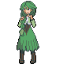
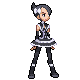

# Trainer Pokémon

!!! tip

	For a more comprehensive list of trainers, please refer to the [Wild Encounters](../wild_encounters/route_201/important_trainers.md) page.

1. Trainer rosters in every area has been modified. They are all listed below with species and levels.
1. Important trainers have their entire roster listed including species, levels, items, moves and natures.
1. Natures have not been set for all Trainers - if a nature is not listed then it hasn't been specifically set.
1. Some postgame Trainers have a * next to their name. This signals that you need to beat them to advance into Stark Mountain.
1. Some trainers have a (!) next to their name. This means that they have further rosters via the Vs. Seeker.
1. Some trainers have a (3) or other number next to their name. This means they should start using these teams once you have that number of badges.
1. Instead of a number, you may see a (C) for Champion or (S) for Stark Mountain, which means after completing these they'll gain those teams.
1. Please note that the number of badges may not always be correct. Feel free to report any incorrect information!

---

## Route 201

<h3>Important Trainers</h3>

**PKMN Trainer Barry**

=== "Turtwig"

	<pre><code><b><a href='/renegade-platinum-wiki/pokemon/chimchar/'>Chimchar</a></b> @ No Item
	<b>Ability:</b> Blaze
	<b>Level:</b> 5
	<b>Moves:</b>
	1. Scratch
	2. Leer
	3. —
	4. —</code></pre>

=== "Chimchar"

	<pre><code><b><a href='/renegade-platinum-wiki/pokemon/piplup/'>Piplup</a></b> @ No Item
	<b>Ability:</b> Torrent
	<b>Level:</b> 5
	<b>Moves:</b>
	1. Pound
	2. Growl
	3. —
	4. —</code></pre>

=== "Piplup"

	<pre><code><b><a href='/renegade-platinum-wiki/pokemon/turtwig/'>Turtwig</a></b> @ No Item
	<b>Ability:</b> Overgrow
	<b>Level:</b> 5
	<b>Moves:</b>
	1. Tackle
	2. Withdraw
	3. —
	4. —</code></pre>

---

## Route 202

<h3>Generic Trainers</h3>

1. Lass Natalie
	1. Lv. 7 [Sentret](../pokemon/sentret.md/)
	2. Lv. 7 [Bidoof](../pokemon/bidoof.md/)
1. Youngster Tristan (!)
	1. Lv. 7 [Hoothoot](../pokemon/hoothoot.md/)
	2. Lv. 7 [Starly](../pokemon/starly.md/)
1. Youngster Logan
	1. Lv. 7 [Growlithe](../pokemon/growlithe.md/)
	2. Lv. 7 [Burmy](../pokemon/burmy.md/)
	3. Lv. 7 [Zigzagoon](../pokemon/zigzagoon.md/)

<h3>Rematches</h3>

1. Youngster Tristan (3)
	1. Lv. 27 [Noctowl](../pokemon/noctowl.md/)
	2. Lv. 27 [Staravia](../pokemon/staravia.md/)
1. Youngster Tristan (5)
	1. Lv. 39 [Noctowl](../pokemon/noctowl.md/)
	2. Lv. 39 [Staraptor](../pokemon/staraptor.md/)
1. Youngster Tristan (8)
	1. Lv. 59 [Noctowl](../pokemon/noctowl.md/)
	2. Lv. 59 [Staraptor](../pokemon/staraptor.md/)
	3. Lv. 59 [Pidgeot](../pokemon/pidgeot.md/)

<h3>Important Trainers</h3>

**PKMN Trainer Dawn**

=== "Turtwig"

	<pre><code><b><a href='/renegade-platinum-wiki/pokemon/chimchar/'>Chimchar</a></b> @ No Item
	<b>Ability:</b> Blaze
	<b>Level:</b> 9
	<b>Moves:</b>
	1. Scratch
	2. Leer
	3. Ember
	4. —</code></pre>

=== "Chimchar"

	<pre><code><b><a href='/renegade-platinum-wiki/pokemon/piplup/'>Piplup</a></b> @ No Item
	<b>Ability:</b> Torrent
	<b>Level:</b> 9
	<b>Moves:</b>
	1. Pound
	2. Growl
	3. Bubble
	4. —</code></pre>

=== "Piplup"

	<pre><code><b><a href='/renegade-platinum-wiki/pokemon/turtwig/'>Turtwig</a></b> @ No Item
	<b>Ability:</b> Overgrow
	<b>Level:</b> 9
	<b>Moves:</b>
	1. Tackle
	2. Withdraw
	3. Absorb
	4. —</code></pre>

**PKMN Trainer Lucas**

=== "Turtwig"

	<pre><code><b><a href='/renegade-platinum-wiki/pokemon/chimchar/'>Chimchar</a></b> @ No Item
	<b>Ability:</b> Blaze
	<b>Level:</b> 9
	<b>Moves:</b>
	1. Scratch
	2. Leer
	3. Ember
	4. —</code></pre>

=== "Chimchar"

	<pre><code><b><a href='/renegade-platinum-wiki/pokemon/piplup/'>Piplup</a></b> @ No Item
	<b>Ability:</b> Torrent
	<b>Level:</b> 9
	<b>Moves:</b>
	1. Pound
	2. Growl
	3. Bubble
	4. —</code></pre>

=== "Piplup"

	<pre><code><b><a href='/renegade-platinum-wiki/pokemon/turtwig/'>Turtwig</a></b> @ No Item
	<b>Ability:</b> Overgrow
	<b>Level:</b> 9
	<b>Moves:</b>
	1. Tackle
	2. Withdraw
	3. Absorb
	4. —</code></pre>

---

## Jubilife City Trainer School

<h3>Generic Trainers</h3>

1. School Kid Harrison
	1. Lv. 8 [Abra](../pokemon/abra.md/)
	2. Lv. 8 [Psyduck](../pokemon/psyduck.md/)
1. School Kid Christine
	1. Lv. 8 [Ralts](../pokemon/ralts.md/)
	2. Lv. 8 [Staryu](../pokemon/staryu.md/)

---

## Route 204 (South)

<h3>Generic Trainers</h3>

1. Lass Sarah
	1. Lv. 8 [Shinx](../pokemon/shinx.md/)
	2. Lv. 8 [Nidoran F](../pokemon/nidoran-f.md/)
	3. Lv. 8 [Pidgey](../pokemon/pidgey.md/)
1. Lass Samantha (!)
	1. Lv. 8 [Oddish](../pokemon/oddish.md/)
	2. Lv. 8 [Budew](../pokemon/budew.md/)
	3. Lv. 8 [Bellsprout](../pokemon/bellsprout.md/)
1. Youngster Tyler
	1. Lv. 11 [Magikarp](../pokemon/magikarp.md/)

<h3>Rematches</h3>

1. Lass Samantha (3)
	1. Lv. 26 [Luxio](../pokemon/luxio.md/)
	2. Lv. 26 [Roselia](../pokemon/roselia.md/)
	3. Lv. 26 [Weepinbell](../pokemon/weepinbell.md/)
1. Lass Samantha (5)
	1. Lv. 38 [Luxio](../pokemon/luxio.md/)
	2. Lv. 38 [Roselia](../pokemon/roselia.md/)
	3. Lv. 38 [Weepinbell](../pokemon/weepinbell.md/)
1. Lass Samantha (C)
	1. Lv. 70 [Luxray](../pokemon/luxray.md/)
	2. Lv. 70 [Roserade](../pokemon/roserade.md/)
	3. Lv. 70 [Victreebel](../pokemon/victreebel.md/)

---

## Route 203

<h3>Generic Trainers</h3>

1. Youngster Michael
	1. Lv. 9 [Kricketot](../pokemon/kricketot.md/)
	2. Lv. 9 [Zubat](../pokemon/zubat.md/)
	3. Lv. 9 [Rattata](../pokemon/rattata.md/)
1. Youngster Dallas (!)
	1. Lv. 10 [Shinx](../pokemon/shinx.md/)
	2. Lv. 10 [Sandshrew](../pokemon/sandshrew.md/)
1. Youngster Sebastian
	1. Lv. 10 [Makuhita](../pokemon/makuhita.md/)
	2. Lv. 10 [Machop](../pokemon/machop.md/)
1. Lass Kaitlin
	1. Lv. 9 [Spearow](../pokemon/spearow.md/)
	2. Lv. 9 [Cubone](../pokemon/cubone.md/)
	3. Lv. 9 [Azurill](../pokemon/azurill.md/)
1. Lass Madeline (!)
	1. Lv. 10 [Psyduck](../pokemon/psyduck.md/)
	2. Lv. 10 [Sunkern](../pokemon/sunkern.md/)

<h3>Rematches</h3>

1. Youngster Dallas (3)
	1. Lv. 27 [Luxio](../pokemon/luxio.md/)
	2. Lv. 27 [Sandslash](../pokemon/sandslash.md/)
1. Youngster Dallas (5)
	1. Lv. 38 [Luxio](../pokemon/luxio.md/)
	2. Lv. 38 [Sandslash](../pokemon/sandslash.md/)
	3. Lv. 38 [Bibarel](../pokemon/bibarel.md/)
1. Youngster Dallas (C)
	1. Lv. 69 [Luxray](../pokemon/luxray.md/)
	2. Lv. 69 [Sandslash](../pokemon/sandslash.md/)
	3. Lv. 69 [Bibarel](../pokemon/bibarel.md/)
	4. Lv. 69 [Golem](../pokemon/golem.md/)
1. Lass Madeline (3)
	1. Lv. 26 [Psyduck](../pokemon/psyduck.md/)
	2. Lv. 26 [Sunkern](../pokemon/sunkern.md/)
	3. Lv. 26 [Buneary](../pokemon/buneary.md/)
1. Lass Madeline (5)
	1. Lv. 38 [Golduck](../pokemon/golduck.md/)
	2. Lv. 38 [Sunflora](../pokemon/sunflora.md/)
	3. Lv. 38 [Lopunny](../pokemon/lopunny.md/)
1. Lass Madeline (8)
	1. Lv. 59 [Golduck](../pokemon/golduck.md/)
	2. Lv. 59 [Sunflora](../pokemon/sunflora.md/)
	3. Lv. 59 [Lopunny](../pokemon/lopunny.md/)

<h3>Important Trainers</h3>

**PKMN Trainer Barry**

=== "Turtwig"

	<pre><code><b><a href='/renegade-platinum-wiki/pokemon/chimchar/'>Chimchar</a></b> @ Oran Berry
	<b>Ability:</b> Iron Fist
	<b>Level:</b> 11
	<b>Moves:</b>
	1. Ember
	2. Fury Swipes
	3. Taunt
	4. —  <b><a href='/renegade-platinum-wiki/pokemon/starly/'>Starly</a></b> @ No Item
	<b>Ability:</b> Reckless
	<b>Level:</b> 10
	<b>Moves:</b>
	1. Wing Attack
	2. Tackle
	3. Growl
	4. —  <b><a href='/renegade-platinum-wiki/pokemon/munchlax/'>Munchlax</a></b> @ No Item
	<b>Ability:</b> Thick Fat
	<b>Level:</b> 10
	<b>Moves:</b>
	1. Tackle
	2. Metronome
	3. Amnesia
	4. Rock Tomb</code></pre>

=== "Chimchar"

	<pre><code><b><a href='/renegade-platinum-wiki/pokemon/piplup/'>Piplup</a></b> @ Oran Berry
	<b>Ability:</b> Torrent
	<b>Level:</b> 11
	<b>Moves:</b>
	1. Water Pulse
	2. Pound
	3. Peck
	4. —  <b><a href='/renegade-platinum-wiki/pokemon/starly/'>Starly</a></b> @ No Item
	<b>Ability:</b> Reckless
	<b>Level:</b> 10
	<b>Moves:</b>
	1. Wing Attack
	2. Tackle
	3. Growl
	4. —  <b><a href='/renegade-platinum-wiki/pokemon/munchlax/'>Munchlax</a></b> @ No Item
	<b>Ability:</b> Thick Fat
	<b>Level:</b> 10
	<b>Moves:</b>
	1. Tackle
	2. Metronome
	3. Amnesia
	4. Rock Tomb</code></pre>

=== "Piplup"

	<pre><code><b><a href='/renegade-platinum-wiki/pokemon/turtwig/'>Turtwig</a></b> @ Oran Berry
	<b>Ability:</b> Overgrow
	<b>Level:</b> 11
	<b>Moves:</b>
	1. Razor Leaf
	2. Tackle
	3. Curse
	4. —  <b><a href='/renegade-platinum-wiki/pokemon/starly/'>Starly</a></b> @ No Item
	<b>Ability:</b> Reckless
	<b>Level:</b> 10
	<b>Moves:</b>
	1. Wing Attack
	2. Tackle
	3. Growl
	4. —  <b><a href='/renegade-platinum-wiki/pokemon/munchlax/'>Munchlax</a></b> @ No Item
	<b>Ability:</b> Thick Fat
	<b>Level:</b> 10
	<b>Moves:</b>
	1. Tackle
	2. Metronome
	3. Amnesia
	4. Rock Tomb</code></pre>

---

## Oreburgh Gate

<h3>Generic Trainers</h3>

1. Camper Curtis
	1. Lv. 10 [Seedot](../pokemon/seedot.md/)
	2. Lv. 10 [Diglett](../pokemon/diglett.md/)
1. Picnicker Diana
	1. Lv. 10 [Whismur](../pokemon/whismur.md/)
	2. Lv. 10 [Wooper](../pokemon/wooper.md/)
1. Veteran Grant
	1. Lv. 45 [Lucario](../pokemon/lucario.md/)
	2. Lv. 45 [Golem](../pokemon/golem.md/)
	3. Lv. 45 [Staraptor](../pokemon/staraptor.md/)

---

## Oreburgh City (City)

<h3>Generic Trainers</h3>

1. Reporter Helen
	1. Lv. 10 [Treecko](../pokemon/treecko.md/)
	2. Lv. 10 [Torchic](../pokemon/torchic.md/)
	3. Lv. 10 [Mudkip](../pokemon/mudkip.md/)

<h3>Important Trainers</h3>

**PKMN Trainer Steven**

<pre><code><b><a href='/renegade-platinum-wiki/pokemon/skarmory/'>Skarmory</a></b> @ Occa Berry
<b>Ability:</b> Keen Eye
<b>Level:</b> 88
<b>Moves:</b>
1. Brave Bird
2. Iron Head
3. Drill Run
4. Stealth Rock  <b><a href='/renegade-platinum-wiki/pokemon/aggron/'>Aggron</a></b> @ Focus Sash
<b>Ability:</b> Rock Head
<b>Level:</b> 88
<b>Moves:</b>
1. Head Smash
2. Aqua Tail
3. Iron Tail
4. Thunder Wave  <b><a href='/renegade-platinum-wiki/pokemon/aerodactyl/'>Aerodactyl</a></b> @ Muscle Band
<b>Ability:</b> Rock Head
<b>Level:</b> 88
<b>Moves:</b>
1. Brave Bird
2. Stone Edge
3. Crunch
4. Fire Fang  <b><a href='/renegade-platinum-wiki/pokemon/cradily/'>Cradily</a></b> @ Leftovers
<b>Ability:</b> Suction Cups
<b>Level:</b> 88
<b>Moves:</b>
1. Power Whip
2. Rock Slide
3. Toxic
4. Recover  <b><a href='/renegade-platinum-wiki/pokemon/armaldo/'>Armaldo</a></b> @ Passho Berry
<b>Ability:</b> Battle Armor
<b>Level:</b> 88
<b>Moves:</b>
1. Stone Edge
2. X-Scissor
3. Swords Dance
4. Aqua Jet  <b><a href='/renegade-platinum-wiki/pokemon/metagross/'>Metagross</a></b> @ Life Orb
<b>Ability:</b> Iron Fist
<b>Level:</b> 89
<b>Moves:</b>
1. Meteor Mash
2. Zen Headbutt
3. Earthquake
4. Ice Punch</code></pre>

---

## Oreburgh Mine

<h3>Generic Trainers</h3>

1. Worker Mason
	1. Lv. 12 [Aron](../pokemon/aron.md/)
	2. Lv. 12 [Phanpy](../pokemon/phanpy.md/)
	3. Lv. 12 [Riolu](../pokemon/riolu.md/)
1. Worker Colin
	1. Lv. 12 [Geodude](../pokemon/geodude.md/)
	2. Lv. 12 [Whismur](../pokemon/whismur.md/)
	3. Lv. 12 [Machop](../pokemon/machop.md/)

---

## Oreburgh City (Gym)

<h3>Generic Trainers</h3>

1. Youngster Jonathon
	1. Lv. 13 [Rhyhorn](../pokemon/rhyhorn.md/)
	2. Lv. 13 [Omanyte](../pokemon/omanyte.md/)
	3. Lv. 13 [Kabuto](../pokemon/kabuto.md/)
1. Youngster Darius
	1. Lv. 13 [Aron](../pokemon/aron.md/)
	2. Lv. 13 [Anorith](../pokemon/anorith.md/)
	3. Lv. 13 [Lileep](../pokemon/lileep.md/)

<h3>Important Trainers</h3>

**Leader Roark**

<pre><code><b><a href='/renegade-platinum-wiki/pokemon/nosepass/'>Nosepass</a></b> @ Smooth Rock
<b>Ability:</b> Sturdy
<b>Level:</b> 15
<b>Nature:</b> Modest
<b>Moves:</b>
1. Stealth Rock
2. Sandstorm
3. Thunder Wave
4. Shock Wave  <b><a href='/renegade-platinum-wiki/pokemon/bonsly/'>Bonsly</a></b> @ Rindo Berry
<b>Ability:</b> Rock Head
<b>Level:</b> 15
<b>Nature:</b> Impish
<b>Moves:</b>
1. Stealth Rock
2. Brick Break
3. Rollout
4. Defense Curl  <b><a href='/renegade-platinum-wiki/pokemon/geodude/'>Geodude</a></b> @ Expert Belt
<b>Ability:</b> Rock Head
<b>Level:</b> 15
<b>Nature:</b> Adamant
<b>Moves:</b>
1. Bulldoze
2. Rock Tomb
3. Fire Punch
4. Thunder Punch  <b><a href='/renegade-platinum-wiki/pokemon/onix/'>Onix</a></b> @ Muscle Band
<b>Ability:</b> Rock Head
<b>Level:</b> 15
<b>Nature:</b> Jolly
<b>Moves:</b>
1. Stealth Rock
2. Rock Tomb
3. Bulldoze
4. Sandstorm  <b><a href='/renegade-platinum-wiki/pokemon/larvitar/'>Larvitar</a></b> @ Flame Orb
<b>Ability:</b> Guts
<b>Level:</b> 15
<b>Nature:</b> Jolly
<b>Moves:</b>
1. Rock Tomb
2. Bulldoze
3. Bite
4. Protect  <b><a href='/renegade-platinum-wiki/pokemon/cranidos/'>Cranidos</a></b> @ Sitrus Berry
<b>Ability:</b> Rock Head (!)
<b>Level:</b> 16
<b>Nature:</b> Hasty
<b>Moves:</b>
1. Zen Headbutt
2. Rock Tomb
3. Thunder Punch
4. Scary Face</code></pre>

---

## Jubilife City

<h3>Generic Trainers</h3>

1. Reporter Kayla
	1. Lv. 5 [Bulbasaur](../pokemon/bulbasaur.md/)
	2. Lv. 5 [Charmander](../pokemon/charmander.md/)
	3. Lv. 5 [Squirtle](../pokemon/squirtle.md/)
1. Galactic Grunt
	1. Lv. 13 [Stunky](../pokemon/stunky.md/)
	2. Lv. 13 [Silcoon](../pokemon/silcoon.md/)
1. Galactic Grunt
	1. Lv. 13 [Glameow](../pokemon/glameow.md/)
	2. Lv. 13 [Cascoon](../pokemon/cascoon.md/)

<h3>Important Trainers</h3>

**PKMN Trainer Dawn**

=== "Turtwig"

	<pre><code><b><a href='/renegade-platinum-wiki/pokemon/chimchar/'>Chimchar</a></b> @ No Item
	<b>Ability:</b> Blaze
	<b>Level:</b> 14
	<b>Moves:</b>
	1. Scratch
	2. Ember
	3. Taunt
	4. Fury Swipes  <b><a href='/renegade-platinum-wiki/pokemon/clefairy/'>Clefairy</a></b> @ No Item
	<b>Ability:</b> Cute Charm
	<b>Level:</b> 13
	<b>Moves:</b>
	1. Double Slap
	2. Encore
	3. Sing
	4. Disarming Voice</code></pre>

=== "Chimchar"

	<pre><code><b><a href='/renegade-platinum-wiki/pokemon/piplup/'>Piplup</a></b> @ No Item
	<b>Ability:</b> Torrent
	<b>Level:</b> 14
	<b>Moves:</b>
	1. Pound
	2. Bubble
	3. Water Sport
	4. Peck  <b><a href='/renegade-platinum-wiki/pokemon/clefairy/'>Clefairy</a></b> @ No Item
	<b>Ability:</b> Cute Charm
	<b>Level:</b> 13
	<b>Moves:</b>
	1. Double Slap
	2. Encore
	3. Sing
	4. Disarming Voice</code></pre>

=== "Piplup"

	<pre><code><b><a href='/renegade-platinum-wiki/pokemon/turtwig/'>Turtwig</a></b> @ No Item
	<b>Ability:</b> Overgrow
	<b>Level:</b> 14
	<b>Moves:</b>
	1. Tackle
	2. Absorb
	3. Razor Leaf
	4. Curse  <b><a href='/renegade-platinum-wiki/pokemon/clefairy/'>Clefairy</a></b> @ No Item
	<b>Ability:</b> Cute Charm
	<b>Level:</b> 13
	<b>Moves:</b>
	1. Double Slap
	2. Encore
	3. Sing
	4. Disarming Voice</code></pre>

**PKMN Trainer Lucas**

=== "Turtwig"

	<pre><code><b><a href='/renegade-platinum-wiki/pokemon/chimchar/'>Chimchar</a></b> @ No Item
	<b>Ability:</b> Blaze
	<b>Level:</b> 14
	<b>Moves:</b>
	1. Scratch
	2. Ember
	3. Taunt
	4. Fury Swipes  <b><a href='/renegade-platinum-wiki/pokemon/snubbull/'>Snubbull</a></b> @ No Item
	<b>Ability:</b> Intimidate
	<b>Level:</b> 13
	<b>Moves:</b>
	1. Tackle
	2. Charm
	3. Lick
	4. Bite</code></pre>

=== "Chimchar"

	<pre><code><b><a href='/renegade-platinum-wiki/pokemon/piplup/'>Piplup</a></b> @ No Item
	<b>Ability:</b> Torrent
	<b>Level:</b> 14
	<b>Moves:</b>
	1. Pound
	2. Bubble
	3. Water Sport
	4. Peck  <b><a href='/renegade-platinum-wiki/pokemon/snubbull/'>Snubbull</a></b> @ No Item
	<b>Ability:</b> Intimidate
	<b>Level:</b> 13
	<b>Moves:</b>
	1. Tackle
	2. Charm
	3. Lick
	4. Bite</code></pre>

=== "Piplup"

	<pre><code><b><a href='/renegade-platinum-wiki/pokemon/turtwig/'>Turtwig</a></b> @ No Item
	<b>Ability:</b> Overgrow
	<b>Level:</b> 14
	<b>Moves:</b>
	1. Tackle
	2. Absorb
	3. Razor Leaf
	4. Curse  <b><a href='/renegade-platinum-wiki/pokemon/snubbull/'>Snubbull</a></b> @ No Item
	<b>Ability:</b> Intimidate
	<b>Level:</b> 13
	<b>Moves:</b>
	1. Tackle
	2. Charm
	3. Lick
	4. Bite</code></pre>

---

## Route 204 (North)

<h3>Generic Trainers</h3>

1. Aroma Lady Taylor
	1. Lv. 13 [Cherubi](../pokemon/cherubi.md/)
	2. Lv. 13 [Hoppip](../pokemon/hoppip.md/)
	3. Lv. 13 [Shroomish](../pokemon/shroomish.md/)
1. Bug Catcher Brandon (!)
	1. Lv. 14 [Wurmple](../pokemon/wurmple.md/)
	2. Lv. 14 [Kricketune](../pokemon/kricketune.md/)
1. Twins Liv & Liz
	1. Lv. 15 [Plusle](../pokemon/plusle.md/)
	2. Lv. 15 [Minun](../pokemon/minun.md/)

<h3>Rematches</h3>

1. Bug Catcher Brandon (3)
	1. Lv. 27 [Dustox](../pokemon/dustox.md/)
	2. Lv. 27 [Kricketune](../pokemon/kricketune.md/)
1. Bug Catcher Brandon (5)
	1. Lv. 38 [Dustox](../pokemon/dustox.md/)
	2. Lv. 38 [Kricketune](../pokemon/kricketune.md/)
	3. Lv. 38 [Scyther](../pokemon/scyther.md/)
1. Bug Catcher Brandon (C)
	1. Lv. 70 [Dustox](../pokemon/dustox.md/)
	2. Lv. 70 [Kricketune](../pokemon/kricketune.md/)
	3. Lv. 70 [Scizor](../pokemon/scizor.md/)

---

## Floaroma Town

<h3>Generic Trainers</h3>

1. Reporter Jenny
	1. Lv. 15 [Chikorita](../pokemon/chikorita.md/)
	2. Lv. 15 [Cyndaquil](../pokemon/cyndaquil.md/)
	3. Lv. 15 [Totodile](../pokemon/totodile.md/)

---

## Floaroma Meadow

<h3>Generic Trainers</h3>

1. Galactic Grunt
	1. Lv. 15 [Zubat](../pokemon/zubat.md/)
	2. Lv. 15 [Spinarak](../pokemon/spinarak.md/)
1. Galactic Grunt
	1. Lv. 15 [Croagunk](../pokemon/croagunk.md/)
	2. Lv. 15 [Ledyba](../pokemon/ledyba.md/)

---

## Valley Windworks

<h3>Generic Trainers</h3>

1. Galactic Grunt
	1. Lv. 14 [Poochyena](../pokemon/poochyena.md/)
	2. Lv. 14 [Gulpin](../pokemon/gulpin.md/)
	3. Lv. 14 [Houndour](../pokemon/houndour.md/)
1. Galactic Grunt
	1. Lv. 15 [Grimer](../pokemon/grimer.md/)
	2. Lv. 15 [Koffing](../pokemon/koffing.md/)
1. Galactic Grunt
	1. Lv. 14 [Kakuna](../pokemon/kakuna.md/)
	2. Lv. 14 [Pineco](../pokemon/pineco.md/)
	3. Lv. 14 [Metapod](../pokemon/metapod.md/)

<h3>Important Trainers</h3>

**Commander Mars**

<pre><code><b><a href='/renegade-platinum-wiki/pokemon/zubat/'>Zubat</a></b> @ No Item
<b>Ability:</b> Inner Focus
<b>Level:</b> 18
<b>Nature:</b> Naive
<b>Moves:</b>
1. Poison Fang
2. Wing Attack
3. Toxic
4. Confuse Ray  <b><a href='/renegade-platinum-wiki/pokemon/bronzor/'>Bronzor</a></b> @ Sitrus Berry
<b>Ability:</b> Levitate
<b>Level:</b> 18
<b>Nature:</b> Brave
<b>Moves:</b>
1. Hypnosis
2. Extrasensory
3. Gyro Ball
4. Confuse Ray  <b><a href='/renegade-platinum-wiki/pokemon/yanma/'>Yanma</a></b> @ No Item
<b>Ability:</b> Speed Boost
<b>Level:</b> 18
<b>Nature:</b> Timid
<b>Moves:</b>
1. Silver Wind
2. Air Cutter
3. Detect
4. Sonic Boom  <b><a href='/renegade-platinum-wiki/pokemon/purugly/'>Purugly</a></b> @ Sitrus Berry
<b>Ability:</b> Thick Fat
<b>Level:</b> 19
<b>Nature:</b> Jolly
<b>Moves:</b>
1. Fake Out
2. Hypnosis
3. Facade
4. Feint Attack</code></pre>

---

## Route 205 (South)

<h3>Generic Trainers</h3>

1. Hiker Daniel
	1. Lv. 15 [Diglett](../pokemon/diglett.md/)
	2. Lv. 15 [Shieldon](../pokemon/shieldon.md/)
	3. Lv. 15 [Numel](../pokemon/numel.md/)
1. Aroma Lady Elizabeth (!)
	1. Lv. 16 [Chikorita](../pokemon/chikorita.md/)
	2. Lv. 16 [Bulbasaur](../pokemon/bulbasaur.md/)
1. Camper Jacob
	1. Lv. 15 [Ponyta](../pokemon/ponyta.md/)
	2. Lv. 15 [Mareep](../pokemon/mareep.md/)
	3. Lv. 15 [Buizel](../pokemon/buizel.md/)
1. Picnicker Siena
	1. Lv. 17 [Pachirisu](../pokemon/pachirisu.md/)
1. Hiker Nicholas
	1. Lv. 16 [Shellos](../pokemon/shellos.md/)
	2. Lv. 16 [Onix](../pokemon/onix.md/)
1. Battle Girl Kelsey
	1. Lv. 16 [Machop](../pokemon/machop.md/)
	2. Lv. 16 [Mankey](../pokemon/mankey.md/)
	3. Lv. 16 [Meditite](../pokemon/meditite.md/)
1. Picnicker Karina (!)
	1. Lv. 16 [Piplup](../pokemon/piplup.md/)
	2. Lv. 16 [Chimchar](../pokemon/chimchar.md/)
1. Camper Zackary (!)
	1. Lv. 15 [Aipom](../pokemon/aipom.md/)
	2. Lv. 15 [Slakoth](../pokemon/slakoth.md/)
	3. Lv. 15 [Taillow](../pokemon/taillow.md/)

<h3>Rematches</h3>

1. Aroma Lady Elizabeth (3)
	1. Lv. 27 [Bayleef](../pokemon/bayleef.md/)
	2. Lv. 27 [Ivysaur](../pokemon/ivysaur.md/)
1. Aroma Lady Elizabeth (5)
	1. Lv. 39 [Meganium](../pokemon/meganium.md/)
	2. Lv. 39 [Venusaur](../pokemon/venusaur.md/)
1. Aroma Lady Elizabeth (C)
	1. Lv. 71 [Meganium](../pokemon/meganium.md/)
	2. Lv. 71 [Venusaur](../pokemon/venusaur.md/)
1. Camper Zackary (3)
	1. Lv. 26 [Aipom](../pokemon/aipom.md/)
	2. Lv. 26 [Vigoroth](../pokemon/vigoroth.md/)
	3. Lv. 26 [Swellow](../pokemon/swellow.md/)
1. Camper Zackary (5)
	1. Lv. 38 [Ambipom](../pokemon/ambipom.md/)
	2. Lv. 38 [Vigoroth](../pokemon/vigoroth.md/)
	3. Lv. 38 [Swellow](../pokemon/swellow.md/)
1. Camper Zackary (C)
	1. Lv. 70 [Ambipom](../pokemon/ambipom.md/)
	2. Lv. 70 [Slaking](../pokemon/slaking.md/)
	3. Lv. 70 [Swellow](../pokemon/swellow.md/)
1. Picnicker Karina (3)
	1. Lv. 27 [Prinplup](../pokemon/prinplup.md/)
	2. Lv. 27 [Monferno](../pokemon/monferno.md/)
1. Picnicker Karina (5)
	1. Lv. 39 [Empoleon](../pokemon/empoleon.md/)
	2. Lv. 39 [Infernape](../pokemon/infernape.md/)
1. Picnicker Karina (C)
	1. Lv. 71 [Empoleon](../pokemon/empoleon.md/)
	2. Lv. 71 [Infernape](../pokemon/infernape.md/)

---

## Eterna Forest

<h3>Generic Trainers</h3>

1. Bug Catcher Jack
	1. Lv. 16 [Surskit](../pokemon/surskit.md/)
	2. Lv. 16 [Paras](../pokemon/paras.md/)
	3. Lv. 16 [Venonat](../pokemon/venonat.md/)
1. Lass Briana
	1. Lv. 17 [Buneary](../pokemon/buneary.md/)
	2. Lv. 17 [Marill](../pokemon/marill.md/)
1. Psychic Lindsey
	1. Lv. 17 [Slowpoke](../pokemon/slowpoke.md/)
	2. Lv. 17 [Exeggcute](../pokemon/exeggcute.md/)
	3. Lv. 17 [Natu](../pokemon/natu.md/)
1. Psychic Elijah
	1. Lv. 17 [Spoink](../pokemon/spoink.md/)
	2. Lv. 17 [Drowzee](../pokemon/drowzee.md/)
	3. Lv. 17 [Baltoy](../pokemon/baltoy.md/)
1. Bug Catcher Philip
	1. Lv. 17 [Combee](../pokemon/combee.md/)
	2. Lv. 19 [Beedrill](../pokemon/beedrill.md/)
1. Bug Catcher Donald
	1. Lv. 17 [Nincada](../pokemon/nincada.md/)
	2. Lv. 19 [Dustox](../pokemon/dustox.md/)
1. Psychic Kody
	1. Lv. 18 [Mime Jr.](../pokemon/mime-jr.md/)
	2. Lv. 20 [Mr. Mime](../pokemon/mr-mime.md/)
1. Psychic Rachael
	1. Lv. 18 [Chingling](../pokemon/chingling.md/)
	2. Lv. 20 [Chimecho](../pokemon/chimecho.md/)

<h3>Important Trainers</h3>

**PKMN Trainer Cheryl**

<pre><code><b><a href='/renegade-platinum-wiki/pokemon/drifloon/'>Drifloon</a></b> @ Sitrus Berry
<b>Ability:</b> Unburden
<b>Level:</b> 19
<b>Nature:</b> Modest
<b>Moves:</b>
1. Ominous Wind
2. Air Cutter
3. Shock Wave
4. Swift  <b><a href='/renegade-platinum-wiki/pokemon/makuhita/'>Makuhita</a></b> @ No Item
<b>Ability:</b> Thick Fat
<b>Level:</b> 19
<b>Nature:</b> Relaxed
<b>Moves:</b>
1. Knock Off
2. Fake Out
3. Brick Break
4. Bullet Punch  <b><a href='/renegade-platinum-wiki/pokemon/wailmer/'>Wailmer</a></b> @ No Item
<b>Ability:</b> Water Veil
<b>Level:</b> 19
<b>Nature:</b> Relaxed
<b>Moves:</b>
1. Water Pulse
2. Rock Tomb
3. Mist
4. Rollout  <b><a href='/renegade-platinum-wiki/pokemon/chansey/'>Chansey</a></b> @ Sitrus Berry
<b>Ability:</b> Serene Grace
<b>Level:</b> 20
<b>Nature:</b> Quiet
<b>Moves:</b>
1. Hyper Voice
2. Soft-Boiled
3. Ice Beam
4. Thunderbolt</code></pre>

---

## Route 205 (North)

<h3>Generic Trainers</h3>

1. Fisherman Joseph (!)
	1. Lv. 18 [Goldeen](../pokemon/goldeen.md/)
	2. Lv. 18 [Poliwag](../pokemon/poliwag.md/)
	3. Lv. 18 [Corphish](../pokemon/corphish.md/)
1. Fisherman Andrew
	1. Lv. 18 [Magikarp](../pokemon/magikarp.md/)
	2. Lv. 18 [Feebas](../pokemon/feebas.md/)
	3. Lv. 18 [Magikarp](../pokemon/magikarp.md/)
1. Fisherman Zachary
	1. Lv. 19 [Krabby](../pokemon/krabby.md/)
	2. Lv. 19 [Finneon](../pokemon/finneon.md/)

<h3>Rematches</h3>

1. Fisherman Joseph (5)
	1. Lv. 38 [Seaking](../pokemon/seaking.md/)
	2. Lv. 38 [Poliwhirl](../pokemon/poliwhirl.md/)
	3. Lv. 38 [Crawdaunt](../pokemon/crawdaunt.md/)
1. Fisherman Joseph (C)
	1. Lv. 70 [Seaking](../pokemon/seaking.md/)
	2. Lv. 70 [Politoed](../pokemon/politoed.md/)
	3. Lv. 70 [Crawdaunt](../pokemon/crawdaunt.md/)

---

## Route 211 (West)

<h3>Generic Trainers</h3>

1. Ninja Boy Zach (!)
	1. Lv. 19 [Zubat](../pokemon/zubat.md/)
	2. Lv. 19 [Skorupi](../pokemon/skorupi.md/)
	3. Lv. 19 [Zubat](../pokemon/zubat.md/)
1. Hiker Louis
	1. Lv. 19 [Geodude](../pokemon/geodude.md/)
	2. Lv. 19 [Slugma](../pokemon/slugma.md/)
	3. Lv. 19 [Beldum](../pokemon/beldum.md/)
1. Bird Keeper Alexandra
	1. Lv. 20 [Natu](../pokemon/natu.md/)
	2. Lv. 20 [Swablu](../pokemon/swablu.md/)
	3. Lv. 20 [Staravia](../pokemon/staravia.md/)

<h3>Rematches</h3>

1. Ninja Boy Zach (5)
	1. Lv. 38 [Golbat](../pokemon/golbat.md/)
	2. Lv. 38 [Skorupi](../pokemon/skorupi.md/)
	3. Lv. 38 [Golbat](../pokemon/golbat.md/)
1. Ninja Boy Zach (8)
	1. Lv. 59 [Crobat](../pokemon/crobat.md/)
	2. Lv. 59 [Drapion](../pokemon/drapion.md/)
	3. Lv. 59 [Crobat](../pokemon/crobat.md/)
1. Ninja Boy Zach (C)
	1. Lv. 70 [Crobat](../pokemon/crobat.md/)
	2. Lv. 70 [Drapion](../pokemon/drapion.md/)
	3. Lv. 70 [Crobat](../pokemon/crobat.md/)

---

## Route 211 (East)

<h3>Generic Trainers</h3>

1. Bird Keeper Katherine
	1. Lv. 22 [Noctowl](../pokemon/noctowl.md/)
1. Ninja Boy Nick
	1. Lv. 20 [Ninjask](../pokemon/ninjask.md/)
1. Black Belt Sean
	1. Lv. 22 [Heracross](../pokemon/heracross.md/)
1. Ruin Maniac Harry (!)
	1. Lv. 21 [Aerodactyl](../pokemon/aerodactyl.md/)

<h3>Rematches</h3>

1. Ruin Maniac Harry (8)
	1. Lv. 61 [Aerodactyl](../pokemon/aerodactyl.md/)
1. Ruin Maniac Harry (C)
	1. Lv. 72 [Aerodactyl](../pokemon/aerodactyl.md/)

---

## Route 216

<h3>Generic Trainers</h3>

1. Ace Trainer Blake
	1. Lv. 23 [Porygon](../pokemon/porygon.md/)
	2. Lv. 23 [Vigoroth](../pokemon/vigoroth.md/)
1. Ace Trainer Maria
	1. Lv. 22 [Quagsire](../pokemon/quagsire.md/)
	2. Lv. 22 [Quilava](../pokemon/quilava.md/)
	3. Lv. 22 [Sudowoodo](../pokemon/sudowoodo.md/)
1. Ace Trainer Laura
	1. Lv. 23 [Togetic](../pokemon/togetic.md/)
	2. Lv. 23 [Swellow](../pokemon/swellow.md/)
1. Skier Edward (!)
	1. Lv. 20 [Snover](../pokemon/snover.md/)
	2. Lv. 20 [Snorunt](../pokemon/snorunt.md/)
	3. Lv. 20 [Swinub](../pokemon/swinub.md/)
1. Ace Trainer Garrett
	1. Lv. 22 [Mr. Mime](../pokemon/mr-mime.md/)
	2. Lv. 22 [Nuzleaf](../pokemon/nuzleaf.md/)
	3. Lv. 22 [Scyther](../pokemon/scyther.md/)
1. Black Belt Philip (!)
	1. Lv. 56 [Hariyama](../pokemon/hariyama.md/)
	2. Lv. 56 [Machamp](../pokemon/machamp.md/)
1. Skier Bradley
	1. Lv. 54 [Piloswine](../pokemon/piloswine.md/)
	2. Lv. 54 [Glalie](../pokemon/glalie.md/)
1. Skier Kaitlyn
	1. Lv. 55 [Lapras](../pokemon/lapras.md/)
1. Skier Andrea (!)
	1. Lv. 55 [Abomasnow](../pokemon/abomasnow.md/)

<h3>Rematches</h3>

1. Skier Edward (8)
	1. Lv. 59 [Abomasnow](../pokemon/abomasnow.md/)
	2. Lv. 59 [Glalie](../pokemon/glalie.md/)
	3. Lv. 59 [Piloswine](../pokemon/piloswine.md/)
1. Skier Edward (C)
	1. Lv. 70 [Abomasnow](../pokemon/abomasnow.md/)
	2. Lv. 70 [Glalie](../pokemon/glalie.md/)
	3. Lv. 70 [Mamoswine](../pokemon/mamoswine.md/)
1. Black Belt Philip (C)
	1. Lv. 70 [Hariyama](../pokemon/hariyama.md/)
	2. Lv. 70 [Machamp](../pokemon/machamp.md/)
	3. Lv. 70 [Poliwrath](../pokemon/poliwrath.md/)
1. Skier Andrea (8)
	1. Lv. 61 [Abomasnow](../pokemon/abomasnow.md/)
1. Skier Andrea (C)
	1. Lv. 72 [Abomasnow](../pokemon/abomasnow.md/)

---

## Route 206

<h3>Generic Trainers</h3>

1. Cyclist Axel
	1. Lv. 19 [Pichu](../pokemon/pichu.md/)
	2. Lv. 19 [Pichu](../pokemon/pichu.md/)
	3. Lv. 19 [Pikachu](../pokemon/pikachu.md/)
1. Cyclist Megan
	1. Lv. 21 [Pidgeotto](../pokemon/pidgeotto.md/)
1. Cyclist James
	1. Lv. 20 [Ponyta](../pokemon/ponyta.md/)
	2. Lv. 20 [Flaaffy](../pokemon/flaaffy.md/)
1. Cyclist Nicole
	1. Lv. 19 [Taillow](../pokemon/taillow.md/)
	2. Lv. 19 [Doduo](../pokemon/doduo.md/)
	3. Lv. 19 [Wingull](../pokemon/wingull.md/)
1. Cyclist John (!)
	1. Lv. 21 [Farfetch'd](../pokemon/farfetchd.md/)
1. Cyclist Kayla (!)
	1. Lv. 19 [Voltorb](../pokemon/voltorb.md/)
	2. Lv. 19 [Magnemite](../pokemon/magnemite.md/)
	3. Lv. 19 [Electrike](../pokemon/electrike.md/)
1. Cyclist Ryan
	1. Lv. 21 [Luxio](../pokemon/luxio.md/)
1. Cyclist Rachel
	1. Lv. 21 [Jolteon](../pokemon/jolteon.md/)
1. Hiker Theodore
	1. Lv. 26 [Torkoal](../pokemon/torkoal.md/)

<h3>Rematches</h3>

1. Cyclist John (5)
	1. Lv. 40 [Farfetch'd](../pokemon/farfetchd.md/)
1. Cyclist John (8)
	1. Lv. 61 [Farfetch'd](../pokemon/farfetchd.md/)
1. Cyclist John (C)
	1. Lv. 72 [Farfetch'd](../pokemon/farfetchd.md/)
1. Cyclist Kayla (5)
	1. Lv. 38 [Electrode](../pokemon/electrode.md/)
	2. Lv. 38 [Magneton](../pokemon/magneton.md/)
	3. Lv. 38 [Manectric](../pokemon/manectric.md/)
1. Cyclist Kayla (8)
	1. Lv. 59 [Electrode](../pokemon/electrode.md/)
	2. Lv. 59 [Magneton](../pokemon/magneton.md/)
	3. Lv. 59 [Manectric](../pokemon/manectric.md/)
1. Cyclist Kayla (C)
	1. Lv. 70 [Electrode](../pokemon/electrode.md/)
	2. Lv. 70 [Magnezone](../pokemon/magnezone.md/)
	3. Lv. 70 [Manectric](../pokemon/manectric.md/)

---

## Eterna City (Gym)

<h3>Generic Trainers</h3>

1. Lass Caroline
	1. Lv. 22 [Lotad](../pokemon/lotad.md/)
	2. Lv. 22 [Cacnea](../pokemon/cacnea.md/)
	3. Lv. 22 [Exeggcute](../pokemon/exeggcute.md/)
	4. Lv. 22 [Shroomish](../pokemon/shroomish.md/)
1. Aroma Lady Jenna
	1. Lv. 23 [Weepinbell](../pokemon/weepinbell.md/)
	2. Lv. 23 [Ivysaur](../pokemon/ivysaur.md/)
	3. Lv. 23 [Gloom](../pokemon/gloom.md/)
1. Aroma Lady Angela
	1. Lv. 23 [Roselia](../pokemon/roselia.md/)
	2. Lv. 23 [Bayleef](../pokemon/bayleef.md/)
	3. Lv. 23 [Skiploom](../pokemon/skiploom.md/)

<h3>Important Trainers</h3>

**Leader Gardenia**

<pre><code><b><a href='/renegade-platinum-wiki/pokemon/bellossom/'>Bellossom</a></b> @ Wide Lens
<b>Ability:</b> Chlorophyll
<b>Level:</b> 25
<b>Nature:</b> Relaxed
<b>Moves:</b>
1. Grass Knot
2. Teeter Dance
3. Dazzling Gleam
4. Stun Spore  <b><a href='/renegade-platinum-wiki/pokemon/tangela/'>Tangela</a></b> @ Coba Berry
<b>Ability:</b> Chlorophyll
<b>Level:</b> 25
<b>Nature:</b> Rash
<b>Moves:</b>
1. Grass Knot
2. Shock Wave
3. Ancient Power
4. Stun Spore  <b><a href='/renegade-platinum-wiki/pokemon/cherrim/'>Cherrim</a></b> @ Focus Sash
<b>Ability:</b> Flower Gift
<b>Level:</b> 25
<b>Nature:</b> Hasty
<b>Moves:</b>
1. Grass Knot
2. Sunny Day
3. Weather Ball
4. Morning Sun  <b><a href='/renegade-platinum-wiki/pokemon/grotle/'>Grotle</a></b> @ Leftovers
<b>Ability:</b> Overgrow
<b>Level:</b> 25
<b>Nature:</b> Adamant
<b>Moves:</b>
1. Seed Bomb
2. Protect
3. Leech Seed
4. Bulldoze  <b><a href='/renegade-platinum-wiki/pokemon/breloom/'>Breloom</a></b> @ Muscle Band
<b>Ability:</b> Technician
<b>Level:</b> 25
<b>Nature:</b> Naughty
<b>Moves:</b>
1. Bullet Seed
2. Mach Punch
3. Thunder Punch
4. Spore  <b><a href='/renegade-platinum-wiki/pokemon/roserade/'>Roserade</a></b> @ Sitrus Berry
<b>Ability:</b> Technician
<b>Level:</b> 26
<b>Nature:</b> Timid
<b>Moves:</b>
1. Magical Leaf
2. Sludge
3. Dazzling Gleam
4. Extrasensory</code></pre>

---

## Eterna City (Team Galactic Building)

<h3>Generic Trainers</h3>

1. Galactic Grunt
	1. Lv. 24 [Ledian](../pokemon/ledian.md/)
	2. Lv. 24 [Ariados](../pokemon/ariados.md/)
1. Galactic Grunt
	1. Lv. 23 [Ekans](../pokemon/ekans.md/)
	2. Lv. 23 [Glameow](../pokemon/glameow.md/)
	3. Lv. 23 [Nidoran F](../pokemon/nidoran-f.md/)
1. Galactic Grunt
	1. Lv. 23 [Koffing](../pokemon/koffing.md/)
	2. Lv. 23 [Stunky](../pokemon/stunky.md/)
	3. Lv. 23 [Nidoran M](../pokemon/nidoran-m.md/)
1. Galactic Grunt
	1. Lv. 24 [Croagunk](../pokemon/croagunk.md/)
	2. Lv. 24 [Golbat](../pokemon/golbat.md/)
1. Galactic Grunt
	1. Lv. 23 [Cleffa](../pokemon/cleffa.md/)
1. Galactic Grunt
	1. Lv. 23 [Houndour](../pokemon/houndour.md/)
	2. Lv. 23 [Skorupi](../pokemon/skorupi.md/)
	3. Lv. 23 [Beautifly](../pokemon/beautifly.md/)
1. Scientist Travon
	1. Lv. 24 [Drowzee](../pokemon/drowzee.md/)
	2. Lv. 24 [Metang](../pokemon/metang.md/)
	3. Lv. 24 [Kadabra](../pokemon/kadabra.md/)

<h3>Important Trainers</h3>

**Commander Jupiter**

<pre><code><b><a href='/renegade-platinum-wiki/pokemon/golbat/'>Golbat</a></b> @ No Item
<b>Ability:</b> Inner Focus
<b>Level:</b> 26
<b>Nature:</b> Jolly
<b>Moves:</b>
1. Wing Attack
2. Giga Drain
3. Leech Life
4. Confuse Ray  <b><a href='/renegade-platinum-wiki/pokemon/sableye/'>Sableye</a></b> @ Sitrus Berry
<b>Ability:</b> Magic Guard (!)
<b>Level:</b> 26
<b>Nature:</b> Adamant
<b>Moves:</b>
1. Fake Out
2. Shadow Claw
3. Knock Off
4. Shadow Sneak  <b><a href='/renegade-platinum-wiki/pokemon/tangela/'>Tangela</a></b> @ No Item
<b>Ability:</b> Chlorophyll
<b>Level:</b> 26
<b>Nature:</b> Modest
<b>Moves:</b>
1. Giga Drain
2. Shock Wave
3. Leech Seed
4. Sleep Powder  <b><a href='/renegade-platinum-wiki/pokemon/skuntank/'>Skuntank</a></b> @ Sitrus Berry
<b>Ability:</b> Aftermath
<b>Level:</b> 27
<b>Nature:</b> Adamant
<b>Moves:</b>
1. Poison Jab
2. Night Slash
3. Focus Energy
4. Torment</code></pre>

---

## Route 207

<h3>Generic Trainers</h3>

1. Camper Anthony
	1. Lv. 24 [Magby](../pokemon/magby.md/)
	2. Lv. 24 [Trapinch](../pokemon/trapinch.md/)
	3. Lv. 24 [Charmander](../pokemon/charmander.md/)
1. Picnicker Lauren
	1. Lv. 24 [Smoochum](../pokemon/smoochum.md/)
	2. Lv. 24 [Snubbull](../pokemon/snubbull.md/)
	3. Lv. 24 [Treecko](../pokemon/treecko.md/)
1. Youngster Austin
	1. Lv. 25 [Lombre](../pokemon/lombre.md/)
	2. Lv. 25 [Gligar](../pokemon/gligar.md/)
1. Hiker Justin
	1. Lv. 25 [Graveler](../pokemon/graveler.md/)
	2. Lv. 25 [Sandslash](../pokemon/sandslash.md/)
1. Hiker Kevin
	1. Lv. 25 [Dunsparce](../pokemon/dunsparce.md/)
	2. Lv. 25 [Dunsparce](../pokemon/dunsparce.md/)
1. Battle Girl Helen (!)
	1. Lv. 26 [Tyrogue](../pokemon/tyrogue.md/)
	2. Lv. 26 [Meditite](../pokemon/meditite.md/)
	3. Lv. 26 [Hariyama](../pokemon/hariyama.md/)

<h3>Rematches</h3>

1. Battle Girl Helen (3)
	1. Lv. 28 [Tyrogue](../pokemon/tyrogue.md/)
	2. Lv. 28 [Meditite](../pokemon/meditite.md/)
	3. Lv. 28 [Hariyama](../pokemon/hariyama.md/)
1. Battle Girl Helen (7)
	1. Lv. 54 [Hitmontop](../pokemon/hitmontop.md/)
	2. Lv. 54 [Medicham](../pokemon/medicham.md/)
	3. Lv. 54 [Hariyama](../pokemon/hariyama.md/)
1. Battle Girl Helen (C)
	1. Lv. 72 [Hitmontop](../pokemon/hitmontop.md/)
	2. Lv. 72 [Medicham](../pokemon/medicham.md/)
	3. Lv. 72 [Hariyama](../pokemon/hariyama.md/)

<h3>Important Trainers</h3>

**PKMN Trainer Dawn**

=== "Turtwig"

	<pre><code><b><a href='/renegade-platinum-wiki/pokemon/grotle/'>Grotle</a></b> @ Sitrus Berry
	<b>Ability:</b> Overgrow
	<b>Level:</b> 30
	<b>Moves:</b>
	1. Seed Bomb
	2. Body Slam
	3. Leech Seed
	4. Sand Tomb  <b><a href='/renegade-platinum-wiki/pokemon/piloswine/'>Piloswine</a></b> @ Focus Sash
	<b>Ability:</b> Thick Fat
	<b>Level:</b> 29
	<b>Moves:</b>
	1. Avalanche
	2. Take Down
	3. Rock Slide
	4. Ice Shard  <b><a href='/renegade-platinum-wiki/pokemon/clefable/'>Clefable</a></b> @ Leftovers
	<b>Ability:</b> Cute Charm
	<b>Level:</b> 29
	<b>Moves:</b>
	1. Moonblast
	2. Moonlight
	3. Encore
	4. Thunder Wave  <b><a href='/renegade-platinum-wiki/pokemon/lopunny/'>Lopunny</a></b> @ Muscle Band
	<b>Ability:</b> Scrappy (!)
	<b>Level:</b> 29
	<b>Moves:</b>
	1. Dizzy Punch
	2. Fake Out
	3. Jump Kick
	4. Quick Attack</code></pre>

=== "Chimchar"

	<pre><code><b><a href='/renegade-platinum-wiki/pokemon/monferno/'>Monferno</a></b> @ Sitrus Berry
	<b>Ability:</b> Iron Fist
	<b>Level:</b> 30
	<b>Moves:</b>
	1. Flamethrower
	2. Fake Out
	3. Mach Punch
	4. Grass Knot  <b><a href='/renegade-platinum-wiki/pokemon/piloswine/'>Piloswine</a></b> @ Focus Sash
	<b>Ability:</b> Thick Fat
	<b>Level:</b> 29
	<b>Moves:</b>
	1. Avalanche
	2. Take Down
	3. Rock Slide
	4. Ice Shard  <b><a href='/renegade-platinum-wiki/pokemon/clefable/'>Clefable</a></b> @ Leftovers
	<b>Ability:</b> Cute Charm
	<b>Level:</b> 29
	<b>Moves:</b>
	1. Moonblast
	2. Moonlight
	3. Encore
	4. Thunder Wave  <b><a href='/renegade-platinum-wiki/pokemon/lopunny/'>Lopunny</a></b> @ Muscle Band
	<b>Ability:</b> Scrappy (!)
	<b>Level:</b> 29
	<b>Moves:</b>
	1. Dizzy Punch
	2. Fake Out
	3. Jump Kick
	4. Quick Attack</code></pre>

=== "Piplup"

	<pre><code><b><a href='/renegade-platinum-wiki/pokemon/prinplup/'>Prinplup</a></b> @ Sitrus Berry
	<b>Ability:</b> Torrent
	<b>Level:</b> 30
	<b>Moves:</b>
	1. Bubble Beam
	2. Icy Wind
	3. Brick Break
	4. Shadow Claw  <b><a href='/renegade-platinum-wiki/pokemon/piloswine/'>Piloswine</a></b> @ Focus Sash
	<b>Ability:</b> Thick Fat
	<b>Level:</b> 29
	<b>Moves:</b>
	1. Avalanche
	2. Take Down
	3. Rock Slide
	4. Ice Shard  <b><a href='/renegade-platinum-wiki/pokemon/clefable/'>Clefable</a></b> @ Leftovers
	<b>Ability:</b> Cute Charm
	<b>Level:</b> 29
	<b>Moves:</b>
	1. Moonblast
	2. Moonlight
	3. Encore
	4. Thunder Wave  <b><a href='/renegade-platinum-wiki/pokemon/lopunny/'>Lopunny</a></b> @ Muscle Band
	<b>Ability:</b> Scrappy (!)
	<b>Level:</b> 29
	<b>Moves:</b>
	1. Dizzy Punch
	2. Fake Out
	3. Jump Kick
	4. Quick Attack</code></pre>

**PKMN Trainer Lucas**

=== "Turtwig"

	<pre><code><b><a href='/renegade-platinum-wiki/pokemon/grotle/'>Grotle</a></b> @ Sitrus Berry
	<b>Ability:</b> Overgrow
	<b>Level:</b> 30
	<b>Moves:</b>
	1. Seed Bomb
	2. Body Slam
	3. Leech Seed
	4. Sand Tomb  <b><a href='/renegade-platinum-wiki/pokemon/piloswine/'>Piloswine</a></b> @ Focus Sash
	<b>Ability:</b> Thick Fat
	<b>Level:</b> 29
	<b>Moves:</b>
	1. Avalanche
	2. Take Down
	3. Rock Slide
	4. Ice Shard  <b><a href='/renegade-platinum-wiki/pokemon/granbull/'>Granbull</a></b> @ Muscle Band
	<b>Ability:</b> Intimidate
	<b>Level:</b> 29
	<b>Moves:</b>
	1. Play Rough
	2. Fire Fang
	3. Thunder Fang
	4. Ice Fang  <b><a href='/renegade-platinum-wiki/pokemon/lickilicky/'>Lickilicky</a></b> @ Leftovers
	<b>Ability:</b> Own Tempo
	<b>Level:</b> 29
	<b>Moves:</b>
	1. Slam
	2. Magnitude
	3. Knock Off
	4. Protect</code></pre>

=== "Chimchar"

	<pre><code><b><a href='/renegade-platinum-wiki/pokemon/monferno/'>Monferno</a></b> @ Sitrus Berry
	<b>Ability:</b> Iron Fist
	<b>Level:</b> 30
	<b>Moves:</b>
	1. Flamethrower
	2. Fake Out
	3. Mach Punch
	4. Grass Knot  <b><a href='/renegade-platinum-wiki/pokemon/piloswine/'>Piloswine</a></b> @ Focus Sash
	<b>Ability:</b> Thick Fat
	<b>Level:</b> 29
	<b>Moves:</b>
	1. Avalanche
	2. Take Down
	3. Rock Slide
	4. Ice Shard  <b><a href='/renegade-platinum-wiki/pokemon/granbull/'>Granbull</a></b> @ Muscle Band
	<b>Ability:</b> Intimidate
	<b>Level:</b> 29
	<b>Moves:</b>
	1. Play Rough
	2. Fire Fang
	3. Thunder Fang
	4. Ice Fang  <b><a href='/renegade-platinum-wiki/pokemon/lickilicky/'>Lickilicky</a></b> @ Leftovers
	<b>Ability:</b> Own Tempo
	<b>Level:</b> 29
	<b>Moves:</b>
	1. Slam
	2. Magnitude
	3. Knock Off
	4. Protect</code></pre>

=== "Piplup"

	<pre><code><b><a href='/renegade-platinum-wiki/pokemon/prinplup/'>Prinplup</a></b> @ Sitrus Berry
	<b>Ability:</b> Torrent
	<b>Level:</b> 30
	<b>Moves:</b>
	1. Bubble Beam
	2. Icy Wind
	3. Brick Break
	4. Shadow Claw  <b><a href='/renegade-platinum-wiki/pokemon/piloswine/'>Piloswine</a></b> @ Focus Sash
	<b>Ability:</b> Thick Fat
	<b>Level:</b> 29
	<b>Moves:</b>
	1. Avalanche
	2. Take Down
	3. Rock Slide
	4. Ice Shard  <b><a href='/renegade-platinum-wiki/pokemon/granbull/'>Granbull</a></b> @ Muscle Band
	<b>Ability:</b> Intimidate
	<b>Level:</b> 29
	<b>Moves:</b>
	1. Play Rough
	2. Fire Fang
	3. Thunder Fang
	4. Ice Fang  <b><a href='/renegade-platinum-wiki/pokemon/lickilicky/'>Lickilicky</a></b> @ Leftovers
	<b>Ability:</b> Own Tempo
	<b>Level:</b> 29
	<b>Moves:</b>
	1. Slam
	2. Magnitude
	3. Knock Off
	4. Protect</code></pre>

---

## Wayward Cave

<h3>Generic Trainers</h3>

1. Hiker Reginald
	1. Lv. 26 [Dugtrio](../pokemon/dugtrio.md/)
1. Hiker Lorenzo
	1. Lv. 25 [Rhyhorn](../pokemon/rhyhorn.md/)
	2. Lv. 25 [Sudowoodo](../pokemon/sudowoodo.md/)
1. Lass Cassidy
	1. Lv. 24 [Skitty](../pokemon/skitty.md/)
	2. Lv. 24 [Meowth](../pokemon/meowth.md/)
	3. Lv. 24 [Eevee](../pokemon/eevee.md/)
1. Youngster Wayne
	1. Lv. 25 [Loudred](../pokemon/loudred.md/)
	2. Lv. 25 [Raticate](../pokemon/raticate.md/)
1. Picnicker Tori
	1. Lv. 25 [Psyduck](../pokemon/psyduck.md/)
	2. Lv. 25 [Nidorina](../pokemon/nidorina.md/)
1. Camper Diego
	1. Lv. 25 [Aipom](../pokemon/aipom.md/)
	2. Lv. 25 [Nidorino](../pokemon/nidorino.md/)
1. Picnicker Ana
	1. Lv. 25 [Illumise](../pokemon/illumise.md/)
	2. Lv. 25 [Furret](../pokemon/furret.md/)
1. Camper Parker
	1. Lv. 25 [Volbeat](../pokemon/volbeat.md/)
	2. Lv. 25 [Linoone](../pokemon/linoone.md/)
1. Collector Terry
	1. Lv. 24 [Gible](../pokemon/gible.md/)
	2. Lv. 24 [Bagon](../pokemon/bagon.md/)
	3. Lv. 24 [Gabite](../pokemon/gabite.md/)
1. Ruin Maniac Gerald
	1. Lv. 25 [Cubone](../pokemon/cubone.md/)
	2. Lv. 25 [Probopass](../pokemon/probopass.md/)

<h3>Important Trainers</h3>

**PKMN Trainer Mira**

<pre><code><b><a href='/renegade-platinum-wiki/pokemon/togetic/'>Togetic</a></b> @ Sitrus Berry
<b>Ability:</b> Serene Grace
<b>Level:</b> 27
<b>Nature:</b> Modest
<b>Moves:</b>
1. Dazzling Gleam
2. Air Cutter
3. Soft-Boiled
4. Sweet Kiss  <b><a href='/renegade-platinum-wiki/pokemon/haunter/'>Haunter</a></b> @ Spell Tag
<b>Ability:</b> Levitate
<b>Level:</b> 27
<b>Nature:</b> Hasty
<b>Moves:</b>
1. Shadow Ball
2. Double Team
3. Hypnosis
4. Curse  <b><a href='/renegade-platinum-wiki/pokemon/porygon2/'>Porygon2</a></b> @ Expert Belt
<b>Ability:</b> Trace
<b>Level:</b> 27
<b>Nature:</b> Calm
<b>Moves:</b>
1. Tri Attack
2. Charge Beam
3. Signal Beam
4. Recover  <b><a href='/renegade-platinum-wiki/pokemon/kadabra/'>Kadabra</a></b> @ Life Orb
<b>Ability:</b> Magic Guard
<b>Level:</b> 28
<b>Nature:</b> Modest
<b>Moves:</b>
1. Psybeam
2. Grass Knot
3. Dazzling Gleam
4. Recover</code></pre>

---

## Route 208

<h3>Generic Trainers</h3>

1. Hiker Robert
	1. Lv. 28 [Marowak](../pokemon/marowak.md/)
1. Hiker Jonathan
	1. Lv. 26 [Hippopotas](../pokemon/hippopotas.md/)
	2. Lv. 26 [Shuckle](../pokemon/shuckle.md/)
	3. Lv. 26 [Bronzor](../pokemon/bronzor.md/)
1. Black Belt Kyle
	1. Lv. 29 [Machoke](../pokemon/machoke.md/)
1. Aroma Lady Hannah
	1. Lv. 27 [Roselia](../pokemon/roselia.md/)
	2. Lv. 27 [Sunflora](../pokemon/sunflora.md/)
1. Artist William (!)
	1. Lv. 26 [Smeargle](../pokemon/smeargle.md/)
	2. Lv. 26 [Smeargle](../pokemon/smeargle.md/)
	3. Lv. 26 [Smeargle](../pokemon/smeargle.md/)
1. Fisherman Cody
	1. Lv. 44 [Whiscash](../pokemon/whiscash.md/)
	2. Lv. 44 [Gyarados](../pokemon/gyarados.md/)
1. Hiker Alexander
	1. Lv. 28 [Graveler](../pokemon/graveler.md/)

<h3>Rematches</h3>

1. Artist William (5)
	1. Lv. 38 [Smeargle](../pokemon/smeargle.md/)
	2. Lv. 38 [Smeargle](../pokemon/smeargle.md/)
	3. Lv. 38 [Smeargle](../pokemon/smeargle.md/)
1. Artist William (8)
	1. Lv. 53 [Smeargle](../pokemon/smeargle.md/)
	2. Lv. 53 [Smeargle](../pokemon/smeargle.md/)
	3. Lv. 53 [Smeargle](../pokemon/smeargle.md/)
1. Artist William (C)
	1. Lv. 70 [Smeargle](../pokemon/smeargle.md/)
	2. Lv. 70 [Smeargle](../pokemon/smeargle.md/)
	3. Lv. 70 [Smeargle](../pokemon/smeargle.md/)

<h3>Important Trainers</h3>

**Elite Four Aaron**

<pre><code><b><a href='/renegade-platinum-wiki/pokemon/dustox/'>Dustox</a></b> @ Leftovers
<b>Ability:</b> Shield Dust
<b>Level:</b> 31
<b>Nature:</b> Calm
<b>Moves:</b>
1. Bug Buzz
2. Toxic
3. Protect
4. Moonlight  <b><a href='/renegade-platinum-wiki/pokemon/beautifly/'>Beautifly</a></b> @ Focus Sash
<b>Ability:</b> Swarm
<b>Level:</b> 31
<b>Nature:</b> Mild
<b>Moves:</b>
1. Bug Buzz
2. Air Slash
3. Energy Ball
4. Psychic  <b><a href='/renegade-platinum-wiki/pokemon/venomoth/'>Venomoth</a></b> @ Wise Glasses
<b>Ability:</b> Tinted Lens
<b>Level:</b> 31
<b>Nature:</b> Naive
<b>Moves:</b>
1. Bug Buzz
2. Psychic
3. Sludge Bomb
4. Sleep Powder  <b><a href='/renegade-platinum-wiki/pokemon/scizor/'>Scizor</a></b> @ Muscle Band
<b>Ability:</b> Technician
<b>Level:</b> 31
<b>Nature:</b> Adamant
<b>Moves:</b>
1. X-Scissor
2. Bullet Punch
3. Iron Head
4. Swords Dance  <b><a href='/renegade-platinum-wiki/pokemon/drapion/'>Drapion</a></b> @ Scope Lens
<b>Ability:</b> Sniper
<b>Level:</b> 32
<b>Nature:</b> Jolly
<b>Moves:</b>
1. Cross Poison
2. X-Scissor
3. Night Slash
4. Swords Dance</code></pre>

---

## Hearthome City (Gym)

<h3>Generic Trainers</h3>

1. Youngster Donny
	1. Lv. 27 [Gastly](../pokemon/gastly.md/)
	2. Lv. 27 [Gastly](../pokemon/gastly.md/)
	3. Lv. 27 [Gastly](../pokemon/gastly.md/)
1. Lass Molly
	1. Lv. 29 [Misdreavus](../pokemon/misdreavus.md/)
1. School Kid Chance
	1. Lv. 26 [Duskull](../pokemon/duskull.md/)
	2. Lv. 26 [Shuppet](../pokemon/shuppet.md/)
	3. Lv. 26 [Duskull](../pokemon/duskull.md/)
1. School Kid Mackenzie
	1. Lv. 26 [Shuppet](../pokemon/shuppet.md/)
	2. Lv. 26 [Duskull](../pokemon/duskull.md/)
	3. Lv. 26 [Shuppet](../pokemon/shuppet.md/)
1. Ace Trainer Allen
	1. Lv. 29 [Haunter](../pokemon/haunter.md/)
	2. Lv. 29 [Shedinja](../pokemon/shedinja.md/)
	3. Lv. 29 [Sableye](../pokemon/sableye.md/)
1. Ace Trainer Catherine
	1. Lv. 29 [Haunter](../pokemon/haunter.md/)
	2. Lv. 29 [Rotom](../pokemon/rotom.md/)
	3. Lv. 29 [Froslass](../pokemon/froslass.md/)

<h3>Important Trainers</h3>

**Leader Fantina**

<pre><code><b><a href='/renegade-platinum-wiki/pokemon/drifblim/'>Drifblim</a></b> @ Starf Berry
<b>Ability:</b> Unburden
<b>Level:</b> 32
<b>Nature:</b> Naive
<b>Moves:</b>
1. Shadow Ball
2. Air Slash
3. Baton Pass
4. Calm Mind  <b><a href='/renegade-platinum-wiki/pokemon/dusclops/'>Dusclops</a></b> @ Leftovers
<b>Ability:</b> Pressure
<b>Level:</b> 32
<b>Nature:</b> Impish
<b>Moves:</b>
1. Shadow Punch
2. Will-O-Wisp
3. Protect
4. Pain Split  <b><a href='/renegade-platinum-wiki/pokemon/banette/'>Banette</a></b> @ Muscle Band
<b>Ability:</b> Insomnia
<b>Level:</b> 32
<b>Nature:</b> Adamant
<b>Moves:</b>
1. Shadow Claw
2. Will-O-Wisp
3. Sucker Punch
4. Disable  <b><a href='/renegade-platinum-wiki/pokemon/spiritomb/'>Spiritomb</a></b> @ Zoom Lens
<b>Ability:</b> Pressure
<b>Level:</b> 32
<b>Nature:</b> Relaxed
<b>Moves:</b>
1. Shadow Ball
2. Will-O-Wisp
3. Dark Pulse
4. Disable  <b><a href='/renegade-platinum-wiki/pokemon/gengar/'>Gengar</a></b> @ Wise Glasses
<b>Ability:</b> Levitate
<b>Level:</b> 32
<b>Nature:</b> Naive
<b>Moves:</b>
1. Shadow Ball
2. Will-O-Wisp
3. Sludge Bomb
4. Dazzling Gleam  <b><a href='/renegade-platinum-wiki/pokemon/mismagius/'>Mismagius</a></b> @ Sitrus Berry
<b>Ability:</b> Levitate
<b>Level:</b> 33
<b>Nature:</b> Naive
<b>Moves:</b>
1. Shadow Ball
2. Power Gem
3. Calm Mind
4. Dazzling Gleam</code></pre>

**PKMN Trainer Barry**

=== "Turtwig"

	<pre><code><b><a href='/renegade-platinum-wiki/pokemon/grotle/'>Grotle</a></b> @ Sitrus Berry
	<b>Ability:</b> Overgrow
	<b>Level:</b> 33
	<b>Moves:</b>
	1. Seed Bomb
	2. Crunch
	3. Leech Seed
	4. Protect  <b><a href='/renegade-platinum-wiki/pokemon/staravia/'>Staravia</a></b> @ Muscle Band
	<b>Ability:</b> Reckless
	<b>Level:</b> 32
	<b>Moves:</b>
	1. Facade
	2. Aerial Ace
	3. Double Team
	4. Endeavor  <b><a href='/renegade-platinum-wiki/pokemon/heracross/'>Heracross</a></b> @ Coba Berry
	<b>Ability:</b> Guts
	<b>Level:</b> 32
	<b>Moves:</b>
	1. Bug Bite
	2. Brick Break
	3. Aerial Ace
	4. Knock Off  <b><a href='/renegade-platinum-wiki/pokemon/snorlax/'>Snorlax</a></b> @ Leftovers
	<b>Ability:</b> Thick Fat
	<b>Level:</b> 32
	<b>Moves:</b>
	1. Body Slam
	2. Yawn
	3. Amnesia
	4. Rock Slide</code></pre>

=== "Chimchar"

	<pre><code><b><a href='/renegade-platinum-wiki/pokemon/monferno/'>Monferno</a></b> @ Sitrus Berry
	<b>Ability:</b> Iron Fist
	<b>Level:</b> 33
	<b>Moves:</b>
	1. Flamethrower
	2. Low Kick
	3. Grass Knot
	4. Fake Out  <b><a href='/renegade-platinum-wiki/pokemon/staravia/'>Staravia</a></b> @ Muscle Band
	<b>Ability:</b> Reckless
	<b>Level:</b> 32
	<b>Moves:</b>
	1. Facade
	2. Aerial Ace
	3. Double Team
	4. Endeavor  <b><a href='/renegade-platinum-wiki/pokemon/heracross/'>Heracross</a></b> @ Coba Berry
	<b>Ability:</b> Guts
	<b>Level:</b> 32
	<b>Moves:</b>
	1. Bug Bite
	2. Brick Break
	3. Aerial Ace
	4. Knock Off  <b><a href='/renegade-platinum-wiki/pokemon/snorlax/'>Snorlax</a></b> @ Leftovers
	<b>Ability:</b> Thick Fat
	<b>Level:</b> 32
	<b>Moves:</b>
	1. Body Slam
	2. Yawn
	3. Amnesia
	4. Rock Slide</code></pre>

=== "Piplup"

	<pre><code><b><a href='/renegade-platinum-wiki/pokemon/prinplup/'>Prinplup</a></b> @ Sitrus Berry
	<b>Ability:</b> Torrent
	<b>Level:</b> 33
	<b>Moves:</b>
	1. Scald
	2. Icy Wind
	3. Grass Knot
	4. Aerial Ace  <b><a href='/renegade-platinum-wiki/pokemon/staravia/'>Staravia</a></b> @ Muscle Band
	<b>Ability:</b> Reckless
	<b>Level:</b> 32
	<b>Moves:</b>
	1. Facade
	2. Aerial Ace
	3. Double Team
	4. Endeavor  <b><a href='/renegade-platinum-wiki/pokemon/heracross/'>Heracross</a></b> @ Coba Berry
	<b>Ability:</b> Guts
	<b>Level:</b> 32
	<b>Moves:</b>
	1. Bug Bite
	2. Brick Break
	3. Aerial Ace
	4. Knock Off  <b><a href='/renegade-platinum-wiki/pokemon/snorlax/'>Snorlax</a></b> @ Leftovers
	<b>Ability:</b> Thick Fat
	<b>Level:</b> 32
	<b>Moves:</b>
	1. Body Slam
	2. Yawn
	3. Amnesia
	4. Rock Slide</code></pre>

---

## Route 212 (North)

<h3>Generic Trainers</h3>

1. Galactic Grunt
	1. Lv. 29 [Mightyena](../pokemon/mightyena.md/)
	2. Lv. 29 [Arbok](../pokemon/arbok.md/)
1. Galactic Grunt
	1. Lv. 30 [Kricketune](../pokemon/kricketune.md/)
1. Galactic Grunt
	1. Lv. 28 [Glameow](../pokemon/glameow.md/)
	2. Lv. 28 [Koffing](../pokemon/koffing.md/)
	3. Lv. 28 [Dustox](../pokemon/dustox.md/)
1. Galactic Grunt
	1. Lv. 29 [Lunatone](../pokemon/lunatone.md/)
	2. Lv. 29 [Solrock](../pokemon/solrock.md/)
1. Galactic Grunt
	1. Lv. 29 [Solrock](../pokemon/solrock.md/)
	2. Lv. 29 [Lunatone](../pokemon/lunatone.md/)
1. Galactic Grunt
	1. Lv. 30 [Nincada](../pokemon/nincada.md/)
1. Galactic Grunt
	1. Lv. 30 [Ninjask](../pokemon/ninjask.md/)
1. Galactic Grunt
	1. Lv. 30 [Shedinja](../pokemon/shedinja.md/)
1. Galactic Grunt
	1. Lv. 29 [Beedrill](../pokemon/beedrill.md/)
	2. Lv. 29 [Golbat](../pokemon/golbat.md/)
1. Galactic Grunt
	1. Lv. 28 [Croagunk](../pokemon/croagunk.md/)
	2. Lv. 28 [Seviper](../pokemon/seviper.md/)
	3. Lv. 28 [Butterfree](../pokemon/butterfree.md/)
1. Galactic Grunt
	1. Lv. 30 [Murkrow](../pokemon/murkrow.md/)
1. Galactic Grunt
	1. Lv. 28 [Stunky](../pokemon/stunky.md/)
	2. Lv. 28 [Venonat](../pokemon/venonat.md/)
	3. Lv. 28 [Arbok](../pokemon/arbok.md/)
1. Rich Boy Jason
	1. Lv. 30 [Prinplup](../pokemon/prinplup.md/)
	2. Lv. 30 [Azumarill](../pokemon/azumarill.md/)
1. Lady Melissa (!)
	1. Lv. 30 [Cherrim](../pokemon/cherrim.md/)
	2. Lv. 30 [Jumpluff](../pokemon/jumpluff.md/)
1. Gentleman Jeremy (!)
	1. Lv. 31 [Chatot](../pokemon/chatot.md/)
1. Socialite Reina (!)
	1. Lv. 31 [Delcatty](../pokemon/delcatty.md/)
1. Policeman Bobby
	1. Lv. 31 [Noctowl](../pokemon/noctowl.md/)
1. Policeman Alex
	1. Lv. 31 [Machamp](../pokemon/machamp.md/)
1. Policeman Dylan
	1. Lv. 31 [Arcanine](../pokemon/arcanine.md/)
1. Policeman Caleb
	1. Lv. 31 [Granbull](../pokemon/granbull.md/)

<h3>Rematches</h3>

1. Lady Melissa (5)
	1. Lv. 38 [Gloom](../pokemon/gloom.md/)
	2. Lv. 38 [Cherrim](../pokemon/cherrim.md/)
	3. Lv. 38 [Jumpluff](../pokemon/jumpluff.md/)
1. Lady Melissa (8)
	1. Lv. 59 [Bellossom](../pokemon/bellossom.md/)
	2. Lv. 59 [Cherrim](../pokemon/cherrim.md/)
	3. Lv. 59 [Jumpluff](../pokemon/jumpluff.md/)
1. Lady Melissa (C)
	1. Lv. 70 [Bellossom](../pokemon/bellossom.md/)
	2. Lv. 70 [Cherrim](../pokemon/cherrim.md/)
	3. Lv. 70 [Jumpluff](../pokemon/jumpluff.md/)
1. Gentleman Jeremy (5)
	1. Lv. 41 [Chatot](../pokemon/chatot.md/)
1. Gentleman Jeremy (8)
	1. Lv. 62 [Chatot](../pokemon/chatot.md/)
1. Gentleman Jeremy (C)
	1. Lv. 73 [Chatot](../pokemon/chatot.md/)
1. Socialite Reina (8)
	1. Lv. 62 [Delcatty](../pokemon/delcatty.md/)
1. Socialite Reina (C)
	1. Lv. 73 [Delcatty](../pokemon/delcatty.md/)

<h3>Important Trainers</h3>

**Commander Saturn**

<pre><code><b><a href='/renegade-platinum-wiki/pokemon/bronzong/'>Bronzong</a></b> @ Leftovers
<b>Ability:</b> Levitate
<b>Level:</b> 33
<b>Moves:</b>
1. Hypnosis
2. Gyro Ball
3. Zen Headbutt
4. Confuse Ray  <b><a href='/renegade-platinum-wiki/pokemon/octillery/'>Octillery</a></b> @ Wise Glasses
<b>Ability:</b> Suction Cups
<b>Level:</b> 33
<b>Moves:</b>
1. Octazooka
2. Signal Beam
3. Ice Beam
4. Flamethrower  <b><a href='/renegade-platinum-wiki/pokemon/toxicroak/'>Toxicroak</a></b> @ Muscle Band
<b>Ability:</b> Dry Skin
<b>Level:</b> 34
<b>Moves:</b>
1. Drain Punch
2. Poison Jab
3. Fake Out
4. Vacuum Wave</code></pre>

**Gentleman Backlot**

<pre><code><b><a href='/renegade-platinum-wiki/pokemon/wigglytuff/'>Wigglytuff</a></b> @ Zoom Lens
<b>Ability:</b> Cute Charm
<b>Level:</b> 33
<b>Moves:</b>
1. Moonblast
2. Hyper Voice
3. Sing
4. Thunderbolt  <b><a href='/renegade-platinum-wiki/pokemon/raichu/'>Raichu</a></b> @ Wise Glasses
<b>Ability:</b> Static
<b>Level:</b> 33
<b>Moves:</b>
1. Fake Out
2. Thunderbolt
3. Grass Knot
4. Teeter Dance  <b><a href='/renegade-platinum-wiki/pokemon/espeon/'>Espeon</a></b> @ Sitrus Berry
<b>Ability:</b> Synchronize
<b>Level:</b> 33
<b>Moves:</b>
1. Psychic
2. Power Gem
3. Dazzling Gleam
4. Protect</code></pre>

---

## Route 209

<h3>Generic Trainers</h3>

1. PKMN Breeder Albert (!)
	1. Lv. 26 [Tyrogue](../pokemon/tyrogue.md/)
	2. Lv. 26 [Chingling](../pokemon/chingling.md/)
	3. Lv. 26 [Bonsly](../pokemon/bonsly.md/)
	4. Lv. 26 [Magby](../pokemon/magby.md/)
	5. Lv. 26 [Elekid](../pokemon/elekid.md/)
	6. Lv. 26 [Mime Jr.](../pokemon/mime-jr.md/)
1. Twins Emma & Lil
	1. Lv. 30 [Vaporeon](../pokemon/vaporeon.md/)
	2. Lv. 30 [Flareon](../pokemon/flareon.md/)
1. Poke Kid Danielle (!)
	1. Lv. 28 [Pichu](../pokemon/pichu.md/)
	2. Lv. 29 [Pikachu](../pokemon/pikachu.md/)
	3. Lv. 30 [Raichu](../pokemon/raichu.md/)
1. PKMN Breeder Jennifer (!)
	1. Lv. 26 [Azurill](../pokemon/azurill.md/)
	2. Lv. 26 [Togepi](../pokemon/togepi.md/)
	3. Lv. 26 [Cleffa](../pokemon/cleffa.md/)
	4. Lv. 26 [Igglybuff](../pokemon/igglybuff.md/)
	5. Lv. 26 [Smoochum](../pokemon/smoochum.md/)
	6. Lv. 26 [Budew](../pokemon/budew.md/)
1. Cowgirl Shelley
	1. Lv. 30 [Ponyta](../pokemon/ponyta.md/)
	2. Lv. 30 [Bibarel](../pokemon/bibarel.md/)
1. Jogger Richard
	1. Lv. 31 [Dodrio](../pokemon/dodrio.md/)
1. Jogger Raul
	1. Lv. 31 [Fearow](../pokemon/fearow.md/)
1. Young Couple Ty & Sue
	1. Lv. 31 [Illumise](../pokemon/illumise.md/)
	2. Lv. 31 [Volbeat](../pokemon/volbeat.md/)

<h3>Rematches</h3>

1. PKMN Breeder Albert (5)
	1. Lv. 37 [Hitmontop](../pokemon/hitmontop.md/)
	2. Lv. 37 [Chimecho](../pokemon/chimecho.md/)
	3. Lv. 37 [Sudowoodo](../pokemon/sudowoodo.md/)
	4. Lv. 37 [Magmar](../pokemon/magmar.md/)
	5. Lv. 37 [Electabuzz](../pokemon/electabuzz.md/)
	6. Lv. 37 [Mr. Mime](../pokemon/mr-mime.md/)
1. PKMN Breeder Albert (8)
	1. Lv. 57 [Hitmontop](../pokemon/hitmontop.md/)
	2. Lv. 57 [Chimecho](../pokemon/chimecho.md/)
	3. Lv. 57 [Sudowoodo](../pokemon/sudowoodo.md/)
	4. Lv. 57 [Magmar](../pokemon/magmar.md/)
	5. Lv. 57 [Electabuzz](../pokemon/electabuzz.md/)
	6. Lv. 57 [Mr. Mime](../pokemon/mr-mime.md/)
1. PKMN Breeder Albert (C)
	1. Lv. 68 [Hitmontop](../pokemon/hitmontop.md/)
	2. Lv. 68 [Chimecho](../pokemon/chimecho.md/)
	3. Lv. 68 [Sudowoodo](../pokemon/sudowoodo.md/)
	4. Lv. 68 [Magmar](../pokemon/magmar.md/)
	5. Lv. 68 [Electabuzz](../pokemon/electabuzz.md/)
	6. Lv. 68 [Mr. Mime](../pokemon/mr-mime.md/)
1. Poke Kid Danielle (5)
	1. Lv. 37 [Pikachu](../pokemon/pikachu.md/)
	2. Lv. 37 [Pikachu](../pokemon/pikachu.md/)
	3. Lv. 38 [Raichu](../pokemon/raichu.md/)
1. Poke Kid Danielle (8)
	1. Lv. 57 [Pikachu](../pokemon/pikachu.md/)
	2. Lv. 58 [Raichu](../pokemon/raichu.md/)
	3. Lv. 58 [Raichu](../pokemon/raichu.md/)
1. Poke Kid Danielle (C)
	1. Lv. 69 [Raichu](../pokemon/raichu.md/)
	2. Lv. 69 [Raichu](../pokemon/raichu.md/)
	3. Lv. 69 [Raichu](../pokemon/raichu.md/)
1. PKMN Breeder Jennifer (5)
	1. Lv. 37 [Marill](../pokemon/marill.md/)
	2. Lv. 37 [Togetic](../pokemon/togetic.md/)
	3. Lv. 37 [Clefairy](../pokemon/clefairy.md/)
	4. Lv. 37 [Jigglypuff](../pokemon/jigglypuff.md/)
	5. Lv. 37 [Jynx](../pokemon/jynx.md/)
	6. Lv. 37 [Roselia](../pokemon/roselia.md/)
1. PKMN Breeder Jennifer (8)
	1. Lv. 57 [Azumarill](../pokemon/azumarill.md/)
	2. Lv. 57 [Togekiss](../pokemon/togekiss.md/)
	3. Lv. 57 [Clefable](../pokemon/clefable.md/)
	4. Lv. 57 [Wigglytuff](../pokemon/wigglytuff.md/)
	5. Lv. 57 [Jynx](../pokemon/jynx.md/)
	6. Lv. 57 [Roserade](../pokemon/roserade.md/)
1. PKMN Breeder Jennifer (C)
	1. Lv. 68 [Azumarill](../pokemon/azumarill.md/)
	2. Lv. 68 [Togekiss](../pokemon/togekiss.md/)
	3. Lv. 68 [Clefable](../pokemon/clefable.md/)
	4. Lv. 68 [Wigglytuff](../pokemon/wigglytuff.md/)
	5. Lv. 68 [Jynx](../pokemon/jynx.md/)
	6. Lv. 68 [Roserade](../pokemon/roserade.md/)

---

## Lost Tower

<h3>Generic Trainers</h3>

1. Youngster Oliver
	1. Lv. 31 [Shellos](../pokemon/shellos.md/)
	2. Lv. 31 [Barboach](../pokemon/barboach.md/)
	3. Lv. 31 [Mothim](../pokemon/mothim.md/)
1. Pokefan Leonard
	1. Lv. 31 [Plusle](../pokemon/plusle.md/)
	2. Lv. 31 [Minun](../pokemon/minun.md/)
	3. Lv. 31 [Pachirisu](../pokemon/pachirisu.md/)
1. Roughneck Kirby
	1. Lv. 33 [Cleffa](../pokemon/cleffa.md/)
1. Pokefan Rebekah
	1. Lv. 30 [Clefairy](../pokemon/clefairy.md/)
	2. Lv. 30 [Wailmer](../pokemon/wailmer.md/)
	3. Lv. 30 [Bonsly](../pokemon/bonsly.md/)
	4. Lv. 30 [Skitty](../pokemon/skitty.md/)
1. Young Couple Mike & Nat
	1. Lv. 33 [Murkrow](../pokemon/murkrow.md/)
	2. Lv. 33 [Misdreavus](../pokemon/misdreavus.md/)
1. Belle & Pa Beth & Bob
	1. Lv. 33 [Ponyta](../pokemon/ponyta.md/)
	2. Lv. 33 [Flaaffy](../pokemon/flaaffy.md/)

---

## Solaceon Ruins

<h3>Generic Trainers</h3>

1. Ruin Maniac Karl
	1. Lv. 31 [Bronzor](../pokemon/bronzor.md/)
	2. Lv. 31 [Graveler](../pokemon/graveler.md/)
	3. Lv. 31 [Sandslash](../pokemon/sandslash.md/)

---

## Route 210 (South)

<h3>Generic Trainers</h3>

1. Twins Teri & Tia
	1. Lv. 32 [Furret](../pokemon/furret.md/)
	2. Lv. 32 [Linoone](../pokemon/linoone.md/)
1. Jogger Wyatt
	1. Lv. 33 [Electrode](../pokemon/electrode.md/)
1. PKMN Breeder Kahlil
	1. Lv. 31 [Riolu](../pokemon/riolu.md/)
	2. Lv. 31 [Chingling](../pokemon/chingling.md/)
	3. Lv. 31 [Munchlax](../pokemon/munchlax.md/)
1. PKMN Breeder Amber
	1. Lv. 31 [Mantyke](../pokemon/mantyke.md/)
	2. Lv. 31 [Happiny](../pokemon/happiny.md/)
	3. Lv. 31 [Wynaut](../pokemon/wynaut.md/)
1. Belle & Pa Ava & Matt
	1. Lv. 33 [Tauros](../pokemon/tauros.md/)
	2. Lv. 33 [Miltank](../pokemon/miltank.md/)
1. Rancher Marco (!)
	1. Lv. 33 [Rapidash](../pokemon/rapidash.md/)
1. Collector Fernando
	1. Lv. 31 [Dratini](../pokemon/dratini.md/)
	2. Lv. 33 [Dragonair](../pokemon/dragonair.md/)
1. Collector Edwin
	1. Lv. 31 [Bagon](../pokemon/bagon.md/)
	2. Lv. 33 [Shelgon](../pokemon/shelgon.md/)
1. Waitress Kati
	1. Lv. 33 [Clefable](../pokemon/clefable.md/)

<h3>Rematches</h3>

1. Rancher Marco (8)
	1. Lv. 59 [Rapidash](../pokemon/rapidash.md/)
	2. Lv. 59 [Tauros](../pokemon/tauros.md/)
	3. Lv. 59 [Miltank](../pokemon/miltank.md/)
1. Rancher Marco (C)
	1. Lv. 70 [Rapidash](../pokemon/rapidash.md/)
	2. Lv. 70 [Tauros](../pokemon/tauros.md/)
	3. Lv. 70 [Miltank](../pokemon/miltank.md/)

---

## Route 215

<h3>Generic Trainers</h3>

1. Black Belt Derek
	1. Lv. 34 [Combusken](../pokemon/combusken.md/)
	2. Lv. 34 [Hitmonlee](../pokemon/hitmonlee.md/)
1. Black Belt Gregory
	1. Lv. 34 [Primeape](../pokemon/primeape.md/)
	2. Lv. 34 [Hitmonchan](../pokemon/hitmonchan.md/)
1. Black Belt Nathaniel
	1. Lv. 34 [Machoke](../pokemon/machoke.md/)
	2. Lv. 34 [Hitmontop](../pokemon/hitmontop.md/)
1. Jogger Scott
	1. Lv. 34 [Staraptor](../pokemon/staraptor.md/)
1. Ruin Maniac Calvin
	1. Lv. 33 [Marowak](../pokemon/marowak.md/)
	2. Lv. 33 [Rampardos](../pokemon/rampardos.md/)
1. Jogger Craig (!)
	1. Lv. 34 [Luxray](../pokemon/luxray.md/)
1. Ace Trainer Dennis (!)
	1. Lv. 35 [Gligar](../pokemon/gligar.md/)
	2. Lv. 35 [Gyarados](../pokemon/gyarados.md/)
	3. Lv. 35 [Drifblim](../pokemon/drifblim.md/)
1. Ace Trainer Maya (!)
	1. Lv. 35 [Lickitung](../pokemon/lickitung.md/)
	2. Lv. 35 [Gardevoir](../pokemon/gardevoir.md/)
	3. Lv. 35 [Roserade](../pokemon/roserade.md/)

<h3>Rematches</h3>

1. Jogger Craig (8)
	1. Lv. 60 [Luxray](../pokemon/luxray.md/)
	2. Lv. 60 [Luxray](../pokemon/luxray.md/)
1. Jogger Craig (C)
	1. Lv. 72 [Luxray](../pokemon/luxray.md/)
	2. Lv. 72 [Luxray](../pokemon/luxray.md/)
1. Ace Trainer Dennis (7)
	1. Lv. 62 [Gliscor](../pokemon/gliscor.md/)
	2. Lv. 62 [Gyarados](../pokemon/gyarados.md/)
	3. Lv. 62 [Drifblim](../pokemon/drifblim.md/)
1. Ace Trainer Dennis (S)
	1. Lv. 77 [Gliscor](../pokemon/gliscor.md/)
	2. Lv. 77 [Gyarados](../pokemon/gyarados.md/)
	3. Lv. 77 [Drifblim](../pokemon/drifblim.md/)
1. Ace Trainer Maya (7)
	1. Lv. 62 [Lickilicky](../pokemon/lickilicky.md/)
	2. Lv. 62 [Gardevoir](../pokemon/gardevoir.md/)
	3. Lv. 62 [Roserade](../pokemon/roserade.md/)
1. Ace Trainer Maya (S)
	1. Lv. 77 [Lickilicky](../pokemon/lickilicky.md/)
	2. Lv. 77 [Gardevoir](../pokemon/gardevoir.md/)
	3. Lv. 77 [Roserade](../pokemon/roserade.md/)

---

## Veilstone City (City)

<h3>Generic Trainers</h3>

1. Dragon Tamer Nils
	1. Lv. 35 [Dragonair](../pokemon/dragonair.md/)
	2. Lv. 35 [Shelgon](../pokemon/shelgon.md/)
	3. Lv. 35 [Vibrava](../pokemon/vibrava.md/)
	4. Lv. 36 [Kingdra](../pokemon/kingdra.md/)
1. Team Galactic Grunt
	1. Lv. 35 [Weezing](../pokemon/weezing.md/)
	2. Lv. 35 [Golbat](../pokemon/golbat.md/)
	3. Lv. 35 [Venomoth](../pokemon/venomoth.md/)
1. Team Galactic Grunt
	1. Lv. 35 [Skuntank](../pokemon/skuntank.md/)
	2. Lv. 35 [Dustox](../pokemon/dustox.md/)
	3. Lv. 35 [Wormadam](../pokemon/wormadam-plant.md/)

---

## Veilstone City (Gym)

<h3>Generic Trainers</h3>

1. Black Belt Colby
	1. Lv. 33 [Machop](../pokemon/machop.md/)
	2. Lv. 33 [Meditite](../pokemon/meditite.md/)
	3. Lv. 33 [Croagunk](../pokemon/croagunk.md/)
	4. Lv. 33 [Mankey](../pokemon/mankey.md/)
	5. Lv. 33 [Makuhita](../pokemon/makuhita.md/)
1. Black Belt Darren
	1. Lv. 35 [Primeape](../pokemon/primeape.md/)
	2. Lv. 35 [Hariyama](../pokemon/hariyama.md/)
	3. Lv. 35 [Breloom](../pokemon/breloom.md/)
1. Black Belt Jeffery
	1. Lv. 36 [Heracross](../pokemon/heracross.md/)
	2. Lv. 36 [Poliwrath](../pokemon/poliwrath.md/)
1. Black Belt Rafael
	1. Lv. 35 [Hitmonchan](../pokemon/hitmonchan.md/)
	2. Lv. 35 [Hitmonlee](../pokemon/hitmonlee.md/)
	3. Lv. 35 [Hitmontop](../pokemon/hitmontop.md/)

<h3>Important Trainers</h3>

**Leader Maylene**

<pre><code><b><a href='/renegade-platinum-wiki/pokemon/medicham/'>Medicham</a></b> @ Sitrus Berry
<b>Ability:</b> Pure Power
<b>Level:</b> 38
<b>Nature:</b> Naive
<b>Moves:</b>
1. High Jump Kick
2. Zen Headbutt
3. Ice Punch
4. Fake Out  <b><a href='/renegade-platinum-wiki/pokemon/machamp/'>Machamp</a></b> @ Toxic Orb
<b>Ability:</b> Guts
<b>Level:</b> 38
<b>Nature:</b> Relaxed
<b>Moves:</b>
1. Close Combat
2. Payback
3. Thunder Punch
4. Protect  <b><a href='/renegade-platinum-wiki/pokemon/infernape/'>Infernape</a></b> @ Life Orb
<b>Ability:</b> Iron Fist
<b>Level:</b> 38
<b>Nature:</b> Hasty
<b>Moves:</b>
1. Close Combat
2. Rock Slide
3. Fire Punch
4. Mach Punch  <b><a href='/renegade-platinum-wiki/pokemon/toxicroak/'>Toxicroak</a></b> @ Big Root
<b>Ability:</b> Dry Skin
<b>Level:</b> 38
<b>Nature:</b> Lonely
<b>Moves:</b>
1. Drain Punch
2. Poison Jab
3. Ice Punch
4. Sucker Punch  <b><a href='/renegade-platinum-wiki/pokemon/gallade/'>Gallade</a></b> @ Light Clay
<b>Ability:</b> Steadfast
<b>Level:</b> 38
<b>Nature:</b> Brave
<b>Moves:</b>
1. Drain Punch
2. Zen Headbutt
3. Light Screen
4. Reflect  <b><a href='/renegade-platinum-wiki/pokemon/lucario/'>Lucario</a></b> @ Focus Sash
<b>Ability:</b> Adaptability (!)
<b>Level:</b> 39
<b>Nature:</b> Timid
<b>Moves:</b>
1. Aura Sphere
2. Flash Cannon
3. Dark Pulse
4. Agility</code></pre>

---

## Route 214

<h3>Generic Trainers</h3>

1. PI Carlos (!)
	1. Lv. 36 [Dugtrio](../pokemon/dugtrio.md/)
1. Collector Douglas
	1. Lv. 33 [Jolteon](../pokemon/jolteon.md/)
	2. Lv. 33 [Vaporeon](../pokemon/vaporeon.md/)
	3. Lv. 33 [Flareon](../pokemon/flareon.md/)
1. Collector Brady
	1. Lv. 33 [Kangaskhan](../pokemon/kangaskhan.md/)
	2. Lv. 33 [Tropius](../pokemon/tropius.md/)
	3. Lv. 33 [Swalot](../pokemon/swalot.md/)
1. Ruin Maniac Bryan
	1. Lv. 33 [Anorith](../pokemon/anorith.md/)
	2. Lv. 33 [Lileep](../pokemon/lileep.md/)
	3. Lv. 33 [Aerodactyl](../pokemon/aerodactyl.md/)
1. Ruin Maniac Ronald
	1. Lv. 35 [Relicanth](../pokemon/relicanth.md/)
1. Collector Jamal
	1. Lv. 35 [Lapras](../pokemon/lapras.md/)
1. Beauty Devon
	1. Lv. 33 [Wormadam](../pokemon/wormadam-plant.md/)
	2. Lv. 33 [Wormadam](../pokemon/wormadam-plant.md/)
	3. Lv. 33 [Wormadam](../pokemon/wormadam-plant.md/)
1. Psychic Mitchell (!)
	1. Lv. 34 [Kadabra](../pokemon/kadabra.md/)
	2. Lv. 34 [Grumpig](../pokemon/grumpig.md/)
	3. Lv. 34 [Hypno](../pokemon/hypno.md/)
1. Psychic Abigail (!)
	1. Lv. 34 [Kirlia](../pokemon/kirlia.md/)
	2. Lv. 34 [Chimecho](../pokemon/chimecho.md/)
	3. Lv. 34 [Girafarig](../pokemon/girafarig.md/)

<h3>Rematches</h3>

1. PI Carlos (8)
	1. Lv. 62 [Dugtrio](../pokemon/dugtrio.md/)
1. PI Carlos (C)
	1. Lv. 70 [Dugtrio](../pokemon/dugtrio.md/)
	2. Lv. 70 [Lapras](../pokemon/lapras.md/)
	3. Lv. 70 [Kingler](../pokemon/kingler.md/)
1. Psychic Mitchell (8)
	1. Lv. 60 [Alakazam](../pokemon/alakazam.md/)
	2. Lv. 60 [Grumpig](../pokemon/grumpig.md/)
	3. Lv. 60 [Hypno](../pokemon/hypno.md/)
1. Psychic Mitchell (C)
	1. Lv. 72 [Alakazam](../pokemon/alakazam.md/)
	2. Lv. 72 [Grumpig](../pokemon/grumpig.md/)
	3. Lv. 72 [Hypno](../pokemon/hypno.md/)
1. Psychic Abigail (8)
	1. Lv. 60 [Gardevoir](../pokemon/gardevoir.md/)
	2. Lv. 60 [Chimecho](../pokemon/chimecho.md/)
	3. Lv. 60 [Girafarig](../pokemon/girafarig.md/)
1. Psychic Abigail (C)
	1. Lv. 72 [Gardevoir](../pokemon/gardevoir.md/)
	2. Lv. 72 [Chimecho](../pokemon/chimecho.md/)
	3. Lv. 72 [Girafarig](../pokemon/girafarig.md/)

---

## Seven Stars Restaurant

<h3>Generic Trainers</h3>

1. Artist Ismael
	1. Lv. 37 [Smeargle](../pokemon/smeargle.md/)
1. Beauty Harley
	1. Lv. 37 [Golduck](../pokemon/golduck.md/)
1. Rich Boy Roman
	1. Lv. 37 [Arcanine](../pokemon/arcanine.md/)
1. Lady Kylie
	1. Lv. 37 [Vileplume](../pokemon/vileplume.md/)
1. Gentleman Leonardo
	1. Lv. 37 [Chatot](../pokemon/chatot.md/)
1. Socialite Rebecca
	1. Lv. 37 [Persian](../pokemon/persian.md/)
1. Collector Eugene
	1. Lv. 37 [Milotic](../pokemon/milotic.md/)
1. Aroma Lady Alison
	1. Lv. 37 [Meganium](../pokemon/meganium.md/)
1. School Kid Esteban
	1. Lv. 37 [Quagsire](../pokemon/quagsire.md/)
1. Pokefan Meredith
	1. Lv. 37 [Pachirisu](../pokemon/pachirisu.md/)
1. Veteran Emanuel
	1. Lv. 37 [Blaziken](../pokemon/blaziken.md/)
1. Lass Blythe
	1. Lv. 37 [Lopunny](../pokemon/lopunny.md/)
1. Cameraman Darryl
	1. Lv. 37 [Magneton](../pokemon/magneton.md/)
1. Reporter Valerie
	1. Lv. 37 [Loudred](../pokemon/loudred.md/)
1. PI Kendrick
	1. Lv. 37 [Rhydon](../pokemon/rhydon.md/)
1. Beauty Gabriella
	1. Lv. 37 [Lumineon](../pokemon/lumineon.md/)
1. Scientist Emilio
	1. Lv. 37 [Alakazam](../pokemon/alakazam.md/)
1. PKMN Breeder Kaylee
	1. Lv. 37 [Azumarill](../pokemon/azumarill.md/)

---

## Route 213

<h3>Generic Trainers</h3>

1. Beauty Cyndy (!)
	1. Lv. 37 [Delcatty](../pokemon/delcatty.md/)
	2. Lv. 37 [Persian](../pokemon/persian.md/)
1. Fisherman Kenneth
	1. Lv. 36 [Carvanha](../pokemon/carvanha.md/)
	2. Lv. 36 [Remoraid](../pokemon/remoraid.md/)
	3. Lv. 36 [Horsea](../pokemon/horsea.md/)
1. Tuber Jared (!)
	1. Lv. 37 [Gastrodon](../pokemon/gastrodon.md/)
1. Tuber Chelsea (!)
	1. Lv. 37 [Azumarill](../pokemon/azumarill.md/)
1. Swimmer Haley
	1. Lv. 43 [Golduck](../pokemon/golduck.md/)
	2. Lv. 43 [Mantine](../pokemon/mantine.md/)
	3. Lv. 43 [Corsola](../pokemon/corsola.md/)
1. Swimmer Sheltin
	1. Lv. 43 [Gyarados](../pokemon/gyarados.md/)
	2. Lv. 43 [Gyarados](../pokemon/gyarados.md/)
	3. Lv. 43 [Gyarados](../pokemon/gyarados.md/)
1. Sailor Paul
	1. Lv. 45 [Politoed](../pokemon/politoed.md/)
1. Swimmer Evan
	1. Lv. 44 [Quagsire](../pokemon/quagsire.md/)
	2. Lv. 44 [Sharpedo](../pokemon/sharpedo.md/)
1. Swimmer Mary
	1. Lv. 44 [Pelipper](../pokemon/pelipper.md/)
	2. Lv. 44 [Lumineon](../pokemon/lumineon.md/)
1. Galactic Grunt
	1. Lv. 41 [Toxicroak](../pokemon/toxicroak.md/)

<h3>Rematches</h3>

1. Beauty Cyndy (8)
	1. Lv. 59 [Delcatty](../pokemon/delcatty.md/)
	2. Lv. 59 [Persian](../pokemon/persian.md/)
	3. Lv. 59 [Purugly](../pokemon/purugly.md/)
1. Beauty Cyndy (C)
	1. Lv. 70 [Delcatty](../pokemon/delcatty.md/)
	2. Lv. 70 [Persian](../pokemon/persian.md/)
	3. Lv. 70 [Purugly](../pokemon/purugly.md/)
1. Tuber Jared (5)
	1. Lv. 39 [Gastrodon](../pokemon/gastrodon.md/)
1. Tuber Jared (C)
	1. Lv. 69 [Gastrodon](../pokemon/gastrodon.md/)
1. Tuber Chelsea (8)
	1. Lv. 59 [Azumarill](../pokemon/azumarill.md/)
1. Tuber Chelsea (C)
	1. Lv. 69 [Azumarill](../pokemon/azumarill.md/)

---

## Route 212 (South)

<h3>Generic Trainers</h3>

1. Parasol Lady Sabrina
	1. Lv. 39 [Castform](../pokemon/castform.md/)
1. Scientist Shaun (!)
	1. Lv. 37 [Magneton](../pokemon/magneton.md/)
	2. Lv. 37 [Electrode](../pokemon/electrode.md/)
	3. Lv. 37 [Porygon2](../pokemon/porygon2.md/)
1. PKMN Ranger Taylor (!)
	1. Lv. 39 [Carnivine](../pokemon/carnivine.md/)
	2. Lv. 39 [Kecleon](../pokemon/kecleon.md/)
	3. Lv. 39 [Electabuzz](../pokemon/electabuzz.md/)
1. Parasol Lady Alexa (!)
	1. Lv. 38 [Seadra](../pokemon/seadra.md/)
	2. Lv. 38 [Golduck](../pokemon/golduck.md/)
1. Fisherman Juan
	1. Lv. 36 [Shellder](../pokemon/shellder.md/)
	2. Lv. 36 [Clamperl](../pokemon/clamperl.md/)
	3. Lv. 39 [Cloyster](../pokemon/cloyster.md/)
1. Fisherman Josh
	1. Lv. 36 [Remoraid](../pokemon/remoraid.md/)
	2. Lv. 36 [Goldeen](../pokemon/goldeen.md/)
	3. Lv. 39 [Octillery](../pokemon/octillery.md/)
1. Fisherman Travis
	1. Lv. 38 [Barboach](../pokemon/barboach.md/)
	2. Lv. 38 [Qwilfish](../pokemon/qwilfish.md/)
1. Collector Dean
	1. Lv. 37 [Espeon](../pokemon/espeon.md/)
	2. Lv. 37 [Umbreon](../pokemon/umbreon.md/)
	3. Lv. 37 [Glaceon](../pokemon/glaceon.md/)
1. Policeman Danny
	1. Lv. 37 [Growlithe](../pokemon/growlithe.md/)
	2. Lv. 37 [Machoke](../pokemon/machoke.md/)
	3. Lv. 37 [Noctowl](../pokemon/noctowl.md/)
1. Scientist Stefano
	1. Lv. 38 [Weezing](../pokemon/weezing.md/)
	2. Lv. 38 [Muk](../pokemon/muk.md/)
1. PKMN Ranger Allison (!)
	1. Lv. 39 [Milotic](../pokemon/milotic.md/)
	2. Lv. 39 [Leafeon](../pokemon/leafeon.md/)
	3. Lv. 39 [Jynx](../pokemon/jynx.md/)
1. PKMN Ranger Jeffrey
	1. Lv. 39 [Magmar](../pokemon/magmar.md/)
	2. Lv. 39 [Manectric](../pokemon/manectric.md/)
	3. Lv. 39 [Nidoking](../pokemon/nidoking.md/)

<h3>Rematches</h3>

1. Scientist Shaun (5)
	1. Lv. 38 [Magneton](../pokemon/magneton.md/)
	2. Lv. 38 [Electrode](../pokemon/electrode.md/)
	3. Lv. 38 [Porygon2](../pokemon/porygon2.md/)
1. Scientist Shaun (8)
	1. Lv. 59 [Magneton](../pokemon/magneton.md/)
	2. Lv. 59 [Electrode](../pokemon/electrode.md/)
	3. Lv. 59 [Porygon2](../pokemon/porygon2.md/)
1. Scientist Shaun (C)
	1. Lv. 70 [Magnezone](../pokemon/magnezone.md/)
	2. Lv. 70 [Electrode](../pokemon/electrode.md/)
	3. Lv. 70 [Porygon-Z](../pokemon/porygon-z.md/)
1. PKMN Ranger Taylor (5)
	1. Lv. 40 [Carnivine](../pokemon/carnivine.md/)
	2. Lv. 40 [Kecleon](../pokemon/kecleon.md/)
	3. Lv. 40 [Electabuzz](../pokemon/electabuzz.md/)
1. PKMN Ranger Taylor (8)
	1. Lv. 60 [Carnivine](../pokemon/carnivine.md/)
	2. Lv. 60 [Kecleon](../pokemon/kecleon.md/)
	3. Lv. 60 [Electivire](../pokemon/electivire.md/)
1. PKMN Ranger Taylor (C)
	1. Lv. 71 [Carnivine](../pokemon/carnivine.md/)
	2. Lv. 71 [Kecleon](../pokemon/kecleon.md/)
	3. Lv. 71 [Electivire](../pokemon/electivire.md/)
1. PKMN Ranger Allison (5)
	1. Lv. 40 [Milotic](../pokemon/milotic.md/)
	2. Lv. 40 [Leafeon](../pokemon/leafeon.md/)
	3. Lv. 40 [Jynx](../pokemon/jynx.md/)
1. PKMN Ranger Allison (8)
	1. Lv. 60 [Milotic](../pokemon/milotic.md/)
	2. Lv. 60 [Leafeon](../pokemon/leafeon.md/)
	3. Lv. 60 [Jynx](../pokemon/jynx.md/)
1. PKMN Ranger Allison (C)
	1. Lv. 71 [Milotic](../pokemon/milotic.md/)
	2. Lv. 71 [Leafeon](../pokemon/leafeon.md/)
	3. Lv. 71 [Jynx](../pokemon/jynx.md/)
1. Parasol Lady Alexa (5)
	1. Lv. 39 [Seadra](../pokemon/seadra.md/)
	2. Lv. 39 [Golduck](../pokemon/golduck.md/)
1. Parasol Lady Alexa (8)
	1. Lv. 60 [Kingdra](../pokemon/kingdra.md/)
	2. Lv. 60 [Golduck](../pokemon/golduck.md/)
1. Parasol Lady Alexa (C)
	1. Lv. 71 [Kingdra](../pokemon/kingdra.md/)
	2. Lv. 71 [Golduck](../pokemon/golduck.md/)

---

## Pastoria City (City)

<h3>Important Trainers</h3>

**PKMN Trainer Barry**

=== "Turtwig"

	<pre><code><b><a href='/renegade-platinum-wiki/pokemon/azumarill/'>Azumarill</a></b> @ Life Orb
	<b>Ability:</b> Huge Power
	<b>Level:</b> 41
	<b>Moves:</b>
	1. Aqua Tail
	2. Play Rough
	3. Body Slam
	4. Aqua Jet  <b><a href='/renegade-platinum-wiki/pokemon/torterra/'>Torterra</a></b> @ Sitrus Berry
	<b>Ability:</b> Overgrow
	<b>Level:</b> 42
	<b>Moves:</b>
	1. Seed Bomb
	2. Earthquake
	3. Crunch
	4. Iron Head  <b><a href='/renegade-platinum-wiki/pokemon/staraptor/'>Staraptor</a></b> @ Muscle Band
	<b>Ability:</b> Reckless
	<b>Level:</b> 41
	<b>Moves:</b>
	1. Double-Edge
	2. Close Combat
	3. Aerial Ace
	4. Roost  <b><a href='/renegade-platinum-wiki/pokemon/heracross/'>Heracross</a></b> @ Coba Berry
	<b>Ability:</b> Guts
	<b>Level:</b> 41
	<b>Moves:</b>
	1. Megahorn
	2. Brick Break
	3. Bullet Seed
	4. Night Slash  <b><a href='/renegade-platinum-wiki/pokemon/snorlax/'>Snorlax</a></b> @ Leftovers
	<b>Ability:</b> Thick Fat
	<b>Level:</b> 41
	<b>Moves:</b>
	1. Body Slam
	2. Crunch
	3. Rest
	4. Sleep Talk</code></pre>

=== "Chimchar"

	<pre><code><b><a href='/renegade-platinum-wiki/pokemon/arcanine/'>Arcanine</a></b> @ Expert Belt
	<b>Ability:</b> Intimidate
	<b>Level:</b> 41
	<b>Moves:</b>
	1. Heat Wave
	2. Thunder Fang
	3. Outrage
	4. Crunch  <b><a href='/renegade-platinum-wiki/pokemon/infernape/'>Infernape</a></b> @ Sitrus Berry
	<b>Ability:</b> Iron Fist
	<b>Level:</b> 42
	<b>Moves:</b>
	1. Flamethrower
	2. Close Combat
	3. Fake Out
	4. Thunder Punch  <b><a href='/renegade-platinum-wiki/pokemon/staraptor/'>Staraptor</a></b> @ Muscle Band
	<b>Ability:</b> Reckless
	<b>Level:</b> 41
	<b>Moves:</b>
	1. Double-Edge
	2. Close Combat
	3. Aerial Ace
	4. Roost  <b><a href='/renegade-platinum-wiki/pokemon/heracross/'>Heracross</a></b> @ Coba Berry
	<b>Ability:</b> Guts
	<b>Level:</b> 41
	<b>Moves:</b>
	1. Megahorn
	2. Brick Break
	3. Bullet Seed
	4. Night Slash  <b><a href='/renegade-platinum-wiki/pokemon/snorlax/'>Snorlax</a></b> @ Leftovers
	<b>Ability:</b> Thick Fat
	<b>Level:</b> 41
	<b>Moves:</b>
	1. Body Slam
	2. Crunch
	3. Rest
	4. Sleep Talk</code></pre>

=== "Piplup"

	<pre><code><b><a href='/renegade-platinum-wiki/pokemon/breloom/'>Breloom</a></b> @ Focus Sash
	<b>Ability:</b> Technician
	<b>Level:</b> 41
	<b>Moves:</b>
	1. Bullet Seed
	2. Force Palm
	3. Spore
	4. Rock Tomb  <b><a href='/renegade-platinum-wiki/pokemon/empoleon/'>Empoleon</a></b> @ Sitrus Berry
	<b>Ability:</b> Torrent
	<b>Level:</b> 42
	<b>Moves:</b>
	1. Scald
	2. Flash Cannon
	3. Agility
	4. Swagger  <b><a href='/renegade-platinum-wiki/pokemon/staraptor/'>Staraptor</a></b> @ Muscle Band
	<b>Ability:</b> Reckless
	<b>Level:</b> 41
	<b>Moves:</b>
	1. Double-Edge
	2. Close Combat
	3. Aerial Ace
	4. Roost  <b><a href='/renegade-platinum-wiki/pokemon/heracross/'>Heracross</a></b> @ Coba Berry
	<b>Ability:</b> Guts
	<b>Level:</b> 41
	<b>Moves:</b>
	1. Megahorn
	2. Brick Break
	3. Bullet Seed
	4. Night Slash  <b><a href='/renegade-platinum-wiki/pokemon/snorlax/'>Snorlax</a></b> @ Leftovers
	<b>Ability:</b> Thick Fat
	<b>Level:</b> 41
	<b>Moves:</b>
	1. Body Slam
	2. Crunch
	3. Rest
	4. Sleep Talk</code></pre>

---

## Pastoria City (Gym)

<h3>Generic Trainers</h3>

1. Tuber Jacky
	1. Lv. 39 [Bibarel](../pokemon/bibarel.md/)
	2. Lv. 39 [Wartortle](../pokemon/wartortle.md/)
	3. Lv. 39 [Sealeo](../pokemon/sealeo.md/)
1. Fisherman Walter
	1. Lv. 39 [Whiscash](../pokemon/whiscash.md/)
	2. Lv. 39 [Lanturn](../pokemon/lanturn.md/)
	3. Lv. 39 [Seaking](../pokemon/seaking.md/)
1. Sailor Damian
	1. Lv. 39 [Pelipper](../pokemon/pelipper.md/)
	2. Lv. 39 [Croconaw](../pokemon/croconaw.md/)
	3. Lv. 39 [Golduck](../pokemon/golduck.md/)
1. Tuber Caitlyn
	1. Lv. 39 [Azumarill](../pokemon/azumarill.md/)
	2. Lv. 39 [Marshtomp](../pokemon/marshtomp.md/)
	3. Lv. 39 [Dewgong](../pokemon/dewgong.md/)
1. Fisherman Erick
	1. Lv. 39 [Lumineon](../pokemon/lumineon.md/)
	2. Lv. 39 [Tentacruel](../pokemon/tentacruel.md/)
	3. Lv. 39 [Kingler](../pokemon/kingler.md/)
1. Sailor Samson
	1. Lv. 39 [Slowbro](../pokemon/slowbro.md/)
	2. Lv. 39 [Gastrodon](../pokemon/gastrodon.md/)
	3. Lv. 39 [Mantine](../pokemon/mantine.md/)

<h3>Important Trainers</h3>

**Leader Wake**

<pre><code><b><a href='/renegade-platinum-wiki/pokemon/quagsire/'>Quagsire</a></b> @ Rindo Berry
<b>Ability:</b> Water Absorb
<b>Level:</b> 43
<b>Nature:</b> Adamant
<b>Moves:</b>
1. Aqua Tail
2. Earthquake
3. Recover
4. Ice Punch  <b><a href='/renegade-platinum-wiki/pokemon/gyarados/'>Gyarados</a></b> @ Wacan Berry
<b>Ability:</b> Intimidate
<b>Level:</b> 43
<b>Nature:</b> Jolly
<b>Moves:</b>
1. Aqua Tail
2. Ice Fang
3. Crunch
4. Dragon Dance  <b><a href='/renegade-platinum-wiki/pokemon/poliwrath/'>Poliwrath</a></b> @ Sitrus Berry
<b>Ability:</b> Water Absorb
<b>Level:</b> 43
<b>Nature:</b> Careful
<b>Moves:</b>
1. Waterfall
2. Drain Punch
3. Ice Punch
4. Hypnosis  <b><a href='/renegade-platinum-wiki/pokemon/ludicolo/'>Ludicolo</a></b> @ Life Orb
<b>Ability:</b> Swift Swim
<b>Level:</b> 43
<b>Nature:</b> Modest
<b>Moves:</b>
1. Hydro Pump
2. Ice Beam
3. Energy Ball
4. Fake Out  <b><a href='/renegade-platinum-wiki/pokemon/sharpedo/'>Sharpedo</a></b> @ Focus Sash
<b>Ability:</b> Speed Boost
<b>Level:</b> 43
<b>Nature:</b> Naive
<b>Moves:</b>
1. Waterfall
2. Crunch
3. Ice Fang
4. Zen Headbutt  <b><a href='/renegade-platinum-wiki/pokemon/floatzel/'>Floatzel</a></b> @ Life Orb
<b>Ability:</b> Swift Swim
<b>Level:</b> 44
<b>Nature:</b> Naive
<b>Moves:</b>
1. Aqua Tail
2. Crunch
3. Ice Punch
4. Aqua Jet</code></pre>

---

## Route 210 (North)

<h3>Generic Trainers</h3>

1. Ninja Boy Fabian
	1. Lv. 41 [Toxicroak](../pokemon/toxicroak.md/)
1. Ninja Boy Brennan
	1. Lv. 41 [Ninjask](../pokemon/ninjask.md/)
1. Ninja Boy Bruce
	1. Lv. 41 [Skuntank](../pokemon/skuntank.md/)
1. Ninja Boy Joel
	1. Lv. 39 [Scyther](../pokemon/scyther.md/)
	2. Lv. 39 [Spinda](../pokemon/spinda.md/)
	3. Lv. 39 [Golbat](../pokemon/golbat.md/)
1. Ace Trainer Alyssa
	1. Lv. 42 [Ambipom](../pokemon/ambipom.md/)
	2. Lv. 42 [Starmie](../pokemon/starmie.md/)
	3. Lv. 42 [Torterra](../pokemon/torterra.md/)
1. Double Team Zac & Jen
	1. Lv. 42 [Gyarados](../pokemon/gyarados.md/)
	2. Lv. 42 [Gliscor](../pokemon/gliscor.md/)
	3. Lv. 42 [Victreebel](../pokemon/victreebel.md/)
	4. Lv. 42 [Typhlosion](../pokemon/typhlosion.md/)
	5. Lv. 42 [Ursaring](../pokemon/ursaring.md/)
	6. Lv. 42 [Ampharos](../pokemon/ampharos.md/)
1. Ace Trainer Ernest
	1. Lv. 41 [Politoed](../pokemon/politoed.md/)
	2. Lv. 41 [Pinsir](../pokemon/pinsir.md/)
	3. Lv. 41 [Probopass](../pokemon/probopass.md/)
	4. Lv. 41 [Xatu](../pokemon/xatu.md/)
1. Ninja Boy Davido
	1. Lv. 41 [Ninetales](../pokemon/ninetales.md/)
1. Black Belt Adam
	1. Lv. 42 [Machamp](../pokemon/machamp.md/)
	2. Lv. 42 [Blaziken](../pokemon/blaziken.md/)
	3. Lv. 42 [Heracross](../pokemon/heracross.md/)
1. Ninja Boy Nathan
	1. Lv. 39 [Swalot](../pokemon/swalot.md/)
	2. Lv. 39 [Dustox](../pokemon/dustox.md/)
	3. Lv. 39 [Mothim](../pokemon/mothim.md/)
1. Bird Keeper Brianna (!)
	1. Lv. 42 [Dodrio](../pokemon/dodrio.md/)
	2. Lv. 42 [Pidgeot](../pokemon/pidgeot.md/)
	3. Lv. 42 [Skarmory](../pokemon/skarmory.md/)
1. Veteran Brian (!)
	1. Lv. 43 [Tangrowth](../pokemon/tangrowth.md/)
	2. Lv. 43 [Rapidash](../pokemon/rapidash.md/)
	3. Lv. 43 [Feraligatr](../pokemon/feraligatr.md/)
1. Dragon Tamer Patrick (!)
	1. Lv. 41 [Gabite](../pokemon/gabite.md/)
	2. Lv. 41 [Shelgon](../pokemon/shelgon.md/)
	3. Lv. 41 [Vibrava](../pokemon/vibrava.md/)
	4. Lv. 41 [Dragonair](../pokemon/dragonair.md/)

<h3>Rematches</h3>

1. Bird Keeper Brianna (8)
	1. Lv. 60 [Dodrio](../pokemon/dodrio.md/)
	2. Lv. 60 [Pidgeot](../pokemon/pidgeot.md/)
	3. Lv. 60 [Skarmory](../pokemon/skarmory.md/)
1. Bird Keeper Brianna (C)
	1. Lv. 71 [Dodrio](../pokemon/dodrio.md/)
	2. Lv. 71 [Pidgeot](../pokemon/pidgeot.md/)
	3. Lv. 71 [Skarmory](../pokemon/skarmory.md/)
1. Veteran Brian (8)
	1. Lv. 61 [Tangrowth](../pokemon/tangrowth.md/)
	2. Lv. 61 [Rapidash](../pokemon/rapidash.md/)
	3. Lv. 61 [Feraligatr](../pokemon/feraligatr.md/)
1. Veteran Brian (C)
	1. Lv. 75 [Tangrowth](../pokemon/tangrowth.md/)
	2. Lv. 75 [Rapidash](../pokemon/rapidash.md/)
	3. Lv. 75 [Feraligatr](../pokemon/feraligatr.md/)
1. Dragon Tamer Patrick (8)
	1. Lv. 58 [Gabite](../pokemon/gabite.md/)
	2. Lv. 58 [Shelgon](../pokemon/shelgon.md/)
	3. Lv. 58 [Vibrava](../pokemon/vibrava.md/)
	4. Lv. 58 [Dragonair](../pokemon/dragonair.md/)
1. Dragon Tamer Patrick (C)
	1. Lv. 70 [Garchomp](../pokemon/garchomp.md/)
	2. Lv. 70 [Salamence](../pokemon/salamence.md/)
	3. Lv. 70 [Flygon](../pokemon/flygon.md/)
	4. Lv. 70 [Dragonite](../pokemon/dragonite.md/)

<h3>Important Trainers</h3>

**PKMN Trainer Dawn**

=== "Turtwig"

	<pre><code><b><a href='/renegade-platinum-wiki/pokemon/vaporeon/'>Vaporeon</a></b> @ Wise Glasses
	<b>Ability:</b> Water Absorb
	<b>Level:</b> 44
	<b>Moves:</b>
	1. Hydro Pump
	2. Ice Beam
	3. Extrasensory
	4. Aqua Ring  <b><a href='/renegade-platinum-wiki/pokemon/torterra/'>Torterra</a></b> @ Sitrus Berry
	<b>Ability:</b> Overgrow
	<b>Level:</b> 45
	<b>Moves:</b>
	1. Wood Hammer
	2. Earthquake
	3. Iron Head
	4. Rock Slide  <b><a href='/renegade-platinum-wiki/pokemon/alakazam/'>Alakazam</a></b> @ Life Orb
	<b>Ability:</b> Magic Guard
	<b>Level:</b> 44
	<b>Moves:</b>
	1. Psychic
	2. Shadow Ball
	3. Energy Ball
	4. Dazzling Gleam  <b><a href='/renegade-platinum-wiki/pokemon/mamoswine/'>Mamoswine</a></b> @ Passho Berry
	<b>Ability:</b> Thick Fat
	<b>Level:</b> 44
	<b>Moves:</b>
	1. Earthquake
	2. Avalanche
	3. Stone Edge
	4. Ice Shard  <b><a href='/renegade-platinum-wiki/pokemon/clefable/'>Clefable</a></b> @ Leftovers
	<b>Ability:</b> Cute Charm
	<b>Level:</b> 44
	<b>Moves:</b>
	1. Moonblast
	2. Moonlight
	3. Psychic
	4. Thunder Wave  <b><a href='/renegade-platinum-wiki/pokemon/lopunny/'>Lopunny</a></b> @ Choice Band
	<b>Ability:</b> Scrappy (!)
	<b>Level:</b> 44
	<b>Moves:</b>
	1. Strength
	2. Jump Kick
	3. Fire Punch
	4. Ice Punch</code></pre>

=== "Chimchar"

	<pre><code><b><a href='/renegade-platinum-wiki/pokemon/jolteon/'>Jolteon</a></b> @ Wise Glasses
	<b>Ability:</b> Volt Absorb
	<b>Level:</b> 44
	<b>Moves:</b>
	1. Thunder
	2. Shadow Ball
	3. Extrasensory
	4. Thunder Wave  <b><a href='/renegade-platinum-wiki/pokemon/infernape/'>Infernape</a></b> @ Sitrus Berry
	<b>Ability:</b> Iron Fist
	<b>Level:</b> 45
	<b>Moves:</b>
	1. Fire Blast
	2. Close Combat
	3. Thunder Punch
	4. Rock Slide  <b><a href='/renegade-platinum-wiki/pokemon/alakazam/'>Alakazam</a></b> @ Life Orb
	<b>Ability:</b> Magic Guard
	<b>Level:</b> 44
	<b>Moves:</b>
	1. Psychic
	2. Shadow Ball
	3. Energy Ball
	4. Dazzling Gleam  <b><a href='/renegade-platinum-wiki/pokemon/mamoswine/'>Mamoswine</a></b> @ Passho Berry
	<b>Ability:</b> Thick Fat
	<b>Level:</b> 44
	<b>Moves:</b>
	1. Earthquake
	2. Avalanche
	3. Stone Edge
	4. Ice Shard  <b><a href='/renegade-platinum-wiki/pokemon/clefable/'>Clefable</a></b> @ Leftovers
	<b>Ability:</b> Cute Charm
	<b>Level:</b> 44
	<b>Moves:</b>
	1. Moonblast
	2. Moonlight
	3. Psychic
	4. Thunder Wave  <b><a href='/renegade-platinum-wiki/pokemon/lopunny/'>Lopunny</a></b> @ Choice Band
	<b>Ability:</b> Scrappy (!)
	<b>Level:</b> 44
	<b>Moves:</b>
	1. Strength
	2. Jump Kick
	3. Fire Punch
	4. Ice Punch</code></pre>

=== "Piplup"

	<pre><code><b><a href='/renegade-platinum-wiki/pokemon/flareon/'>Flareon</a></b> @ Muscle Band
	<b>Ability:</b> Flash Fire
	<b>Level:</b> 44
	<b>Moves:</b>
	1. Flare Blitz
	2. Play Rough
	3. Close Combat
	4. Will-O-Wisp  <b><a href='/renegade-platinum-wiki/pokemon/empoleon/'>Empoleon</a></b> @ Sitrus Berry
	<b>Ability:</b> Torrent
	<b>Level:</b> 45
	<b>Moves:</b>
	1. Surf
	2. Flash Cannon
	3. Grass Knot
	4. Feather Dance  <b><a href='/renegade-platinum-wiki/pokemon/alakazam/'>Alakazam</a></b> @ Life Orb
	<b>Ability:</b> Magic Guard
	<b>Level:</b> 44
	<b>Moves:</b>
	1. Psychic
	2. Shadow Ball
	3. Energy Ball
	4. Dazzling Gleam  <b><a href='/renegade-platinum-wiki/pokemon/mamoswine/'>Mamoswine</a></b> @ Passho Berry
	<b>Ability:</b> Thick Fat
	<b>Level:</b> 44
	<b>Moves:</b>
	1. Earthquake
	2. Avalanche
	3. Stone Edge
	4. Ice Shard  <b><a href='/renegade-platinum-wiki/pokemon/clefable/'>Clefable</a></b> @ Leftovers
	<b>Ability:</b> Cute Charm
	<b>Level:</b> 44
	<b>Moves:</b>
	1. Moonblast
	2. Moonlight
	3. Psychic
	4. Thunder Wave  <b><a href='/renegade-platinum-wiki/pokemon/lopunny/'>Lopunny</a></b> @ Choice Band
	<b>Ability:</b> Scrappy (!)
	<b>Level:</b> 44
	<b>Moves:</b>
	1. Strength
	2. Jump Kick
	3. Fire Punch
	4. Ice Punch</code></pre>

**PKMN Trainer Lucas**

=== "Turtwig"

	<pre><code><b><a href='/renegade-platinum-wiki/pokemon/vaporeon/'>Vaporeon</a></b> @ Wise Glasses
	<b>Ability:</b> Water Absorb
	<b>Level:</b> 44
	<b>Moves:</b>
	1. Hydro Pump
	2. Ice Beam
	3. Extrasensory
	4. Aqua Ring  <b><a href='/renegade-platinum-wiki/pokemon/torterra/'>Torterra</a></b> @ Sitrus Berry
	<b>Ability:</b> Overgrow
	<b>Level:</b> 45
	<b>Moves:</b>
	1. Wood Hammer
	2. Earthquake
	3. Iron Head
	4. Rock Slide  <b><a href='/renegade-platinum-wiki/pokemon/alakazam/'>Alakazam</a></b> @ Life Orb
	<b>Ability:</b> Magic Guard
	<b>Level:</b> 44
	<b>Moves:</b>
	1. Psychic
	2. Shadow Ball
	3. Energy Ball
	4. Dazzling Gleam  <b><a href='/renegade-platinum-wiki/pokemon/mamoswine/'>Mamoswine</a></b> @ Passho Berry
	<b>Ability:</b> Thick Fat
	<b>Level:</b> 44
	<b>Moves:</b>
	1. Earthquake
	2. Avalanche
	3. Stone Edge
	4. Ice Shard  <b><a href='/renegade-platinum-wiki/pokemon/granbull/'>Granbull</a></b> @ Choice Band
	<b>Ability:</b> Intimidate
	<b>Level:</b> 44
	<b>Moves:</b>
	1. Play Rough
	2. Close Combat
	3. Crunch
	4. Earthquake  <b><a href='/renegade-platinum-wiki/pokemon/lickilicky/'>Lickilicky</a></b> @ Leftovers
	<b>Ability:</b> Own Tempo
	<b>Level:</b> 44
	<b>Moves:</b>
	1. Body Slam
	2. Zen Headbutt
	3. Earthquake
	4. Amnesia</code></pre>

=== "Chimchar"

	<pre><code><b><a href='/renegade-platinum-wiki/pokemon/jolteon/'>Jolteon</a></b> @ Wise Glasses
	<b>Ability:</b> Volt Absorb
	<b>Level:</b> 44
	<b>Moves:</b>
	1. Thunder
	2. Shadow Ball
	3. Extrasensory
	4. Thunder Wave  <b><a href='/renegade-platinum-wiki/pokemon/infernape/'>Infernape</a></b> @ Sitrus Berry
	<b>Ability:</b> Iron Fist
	<b>Level:</b> 45
	<b>Moves:</b>
	1. Fire Blast
	2. Close Combat
	3. Thunder Punch
	4. Rock Slide  <b><a href='/renegade-platinum-wiki/pokemon/alakazam/'>Alakazam</a></b> @ Life Orb
	<b>Ability:</b> Magic Guard
	<b>Level:</b> 44
	<b>Moves:</b>
	1. Psychic
	2. Shadow Ball
	3. Energy Ball
	4. Dazzling Gleam  <b><a href='/renegade-platinum-wiki/pokemon/mamoswine/'>Mamoswine</a></b> @ Passho Berry
	<b>Ability:</b> Thick Fat
	<b>Level:</b> 44
	<b>Moves:</b>
	1. Earthquake
	2. Avalanche
	3. Stone Edge
	4. Ice Shard  <b><a href='/renegade-platinum-wiki/pokemon/granbull/'>Granbull</a></b> @ Choice Band
	<b>Ability:</b> Intimidate
	<b>Level:</b> 44
	<b>Moves:</b>
	1. Play Rough
	2. Close Combat
	3. Crunch
	4. Earthquake  <b><a href='/renegade-platinum-wiki/pokemon/lickilicky/'>Lickilicky</a></b> @ Leftovers
	<b>Ability:</b> Own Tempo
	<b>Level:</b> 44
	<b>Moves:</b>
	1. Body Slam
	2. Zen Headbutt
	3. Earthquake
	4. Amnesia</code></pre>

=== "Piplup"

	<pre><code><b><a href='/renegade-platinum-wiki/pokemon/flareon/'>Flareon</a></b> @ Muscle Band
	<b>Ability:</b> Flash Fire
	<b>Level:</b> 44
	<b>Moves:</b>
	1. Flare Blitz
	2. Play Rough
	3. Close Combat
	4. Will-O-Wisp  <b><a href='/renegade-platinum-wiki/pokemon/empoleon/'>Empoleon</a></b> @ Sitrus Berry
	<b>Ability:</b> Torrent
	<b>Level:</b> 45
	<b>Moves:</b>
	1. Surf
	2. Flash Cannon
	3. Grass Knot
	4. Feather Dance  <b><a href='/renegade-platinum-wiki/pokemon/alakazam/'>Alakazam</a></b> @ Life Orb
	<b>Ability:</b> Magic Guard
	<b>Level:</b> 44
	<b>Moves:</b>
	1. Psychic
	2. Shadow Ball
	3. Energy Ball
	4. Dazzling Gleam  <b><a href='/renegade-platinum-wiki/pokemon/mamoswine/'>Mamoswine</a></b> @ Passho Berry
	<b>Ability:</b> Thick Fat
	<b>Level:</b> 44
	<b>Moves:</b>
	1. Earthquake
	2. Avalanche
	3. Stone Edge
	4. Ice Shard  <b><a href='/renegade-platinum-wiki/pokemon/granbull/'>Granbull</a></b> @ Choice Band
	<b>Ability:</b> Intimidate
	<b>Level:</b> 44
	<b>Moves:</b>
	1. Play Rough
	2. Close Combat
	3. Crunch
	4. Earthquake  <b><a href='/renegade-platinum-wiki/pokemon/lickilicky/'>Lickilicky</a></b> @ Leftovers
	<b>Ability:</b> Own Tempo
	<b>Level:</b> 44
	<b>Moves:</b>
	1. Body Slam
	2. Zen Headbutt
	3. Earthquake
	4. Amnesia</code></pre>

---

## Celestic Town

<h3>Generic Trainers</h3>

1. Galactic Grunt
	1. Lv. 43 [Houndoom](../pokemon/houndoom.md/)
	2. Lv. 43 [Golbat](../pokemon/golbat.md/)
	3. Lv. 43 [Beedrill](../pokemon/beedrill.md/)

<h3>Important Trainers</h3>

**Galactic Boss Cyrus**

<pre><code><b><a href='/renegade-platinum-wiki/pokemon/crobat/'>Crobat</a></b> @ Wise Glasses
<b>Ability:</b> Inner Focus
<b>Level:</b> 45
<b>Moves:</b>
1. Sludge Bomb
2. Air Slash
3. Giga Drain
4. Hypnosis  <b><a href='/renegade-platinum-wiki/pokemon/honchkrow/'>Honchkrow</a></b> @ Scope Lens
<b>Ability:</b> Super Luck
<b>Level:</b> 45
<b>Moves:</b>
1. Brave Bird
2. Night Slash
3. Swagger
4. Torment  <b><a href='/renegade-platinum-wiki/pokemon/magnezone/'>Magnezone</a></b> @ Life Orb
<b>Ability:</b> Magnet Pull
<b>Level:</b> 45
<b>Moves:</b>
1. Thunderbolt
2. Flash Cannon
3. Thunder Wave
4. Mirror Coat  <b><a href='/renegade-platinum-wiki/pokemon/weavile/'>Weavile</a></b> @ Expert Belt
<b>Ability:</b> Technician (!)
<b>Level:</b> 46
<b>Moves:</b>
1. Feint Attack
2. Icicle Crash
3. Ice Shard
4. Swords Dance</code></pre>

---

## Route 218

<h3>Generic Trainers</h3>

1. Fisherman Miguel (!)
	1. Lv. 44 [Huntail](../pokemon/huntail.md/)
	2. Lv. 44 [Gorebyss](../pokemon/gorebyss.md/)
1. Fisherman Luc
	1. Lv. 45 [Crawdaunt](../pokemon/crawdaunt.md/)
1. Sailor Skyler
	1. Lv. 43 [Omastar](../pokemon/omastar.md/)
	2. Lv. 43 [Kabutops](../pokemon/kabutops.md/)
	3. Lv. 43 [Relicanth](../pokemon/relicanth.md/)
1. Guitarist Tony (!)
	1. Lv. 44 [Kricketune](../pokemon/kricketune.md/)
	2. Lv. 44 [Exploud](../pokemon/exploud.md/)

<h3>Rematches</h3>

1. Fisherman Miguel (C)
	1. Lv. 70 [Clamperl](../pokemon/clamperl.md/)
	2. Lv. 70 [Huntail](../pokemon/huntail.md/)
	3. Lv. 70 [Gorebyss](../pokemon/gorebyss.md/)
1. Guitarist Tony (C)
	1. Lv. 71 [Kricketune](../pokemon/kricketune.md/)
	2. Lv. 71 [Exploud](../pokemon/exploud.md/)

---

## Fuego Ironworks

<h3>Generic Trainers</h3>

1. Worker Dillan
	1. Lv. 42 [Machop](../pokemon/machop.md/)
	2. Lv. 43 [Machoke](../pokemon/machoke.md/)
	3. Lv. 44 [Machamp](../pokemon/machamp.md/)
1. Worker Holden
	1. Lv. 42 [Magnemite](../pokemon/magnemite.md/)
	2. Lv. 42 [Magnemite](../pokemon/magnemite.md/)
	3. Lv. 45 [Steelix](../pokemon/steelix.md/)
1. Worker Conrad
	1. Lv. 43 [Magmar](../pokemon/magmar.md/)
	2. Lv. 43 [Magcargo](../pokemon/magcargo.md/)
	3. Lv. 43 [Rapidash](../pokemon/rapidash.md/)

---

## Route 219

<h3>Generic Trainers</h3>

1. Tuber Mariel
	1. Lv. 43 [Azumarill](../pokemon/azumarill.md/)
	2. Lv. 43 [Vaporeon](../pokemon/vaporeon.md/)
1. Tuber Trenton
	1. Lv. 42 [Poliwhirl](../pokemon/poliwhirl.md/)
	2. Lv. 42 [Gastrodon](../pokemon/gastrodon.md/)
	3. Lv. 42 [Bibarel](../pokemon/bibarel.md/)

---

## Route 220

<h3>Generic Trainers</h3>

1. Swimmer Jessica
	1. Lv. 43 [Seadra](../pokemon/seadra.md/)
	2. Lv. 43 [Luvdisc](../pokemon/luvdisc.md/)
	3. Lv. 43 [Seaking](../pokemon/seaking.md/)
1. Swimmer Erica
	1. Lv. 44 [Lumineon](../pokemon/lumineon.md/)
	2. Lv. 44 [Corsola](../pokemon/corsola.md/)
1. Swimmer Adrian
	1. Lv. 43 [Octillery](../pokemon/octillery.md/)
	2. Lv. 43 [Tentacruel](../pokemon/tentacruel.md/)
	3. Lv. 43 [Slowking](../pokemon/slowking.md/)
1. Swimmer Vincent
	1. Lv. 45 [Wailord](../pokemon/wailord.md/)
1. Swimmer Claire
	1. Lv. 44 [Starmie](../pokemon/starmie.md/)
	2. Lv. 44 [Blastoise](../pokemon/blastoise.md/)
1. Swimmer Erik
	1. Lv. 44 [Politoed](../pokemon/politoed.md/)
	2. Lv. 44 [Lanturn](../pokemon/lanturn.md/)
1. Swimmer Katelyn
	1. Lv. 43 [Floatzel](../pokemon/floatzel.md/)
	2. Lv. 43 [Medicham](../pokemon/medicham.md/)
	3. Lv. 43 [Seaking](../pokemon/seaking.md/)

---

## Route 221

<h3>Generic Trainers</h3>

1. Swimmer Dillon
	1. Lv. 46 [Swampert](../pokemon/swampert.md/)
1. Swimmer Vanessa
	1. Lv. 46 [Milotic](../pokemon/milotic.md/)
1. Fisherman Cory
	1. Lv. 44 [Whiscash](../pokemon/whiscash.md/)
	2. Lv. 44 [Kingler](../pokemon/kingler.md/)
	3. Lv. 44 [Gyarados](../pokemon/gyarados.md/)
1. Ace Trainer Shannon (!)
	1. Lv. 45 [Vileplume](../pokemon/vileplume.md/)
	2. Lv. 45 [Gardevoir](../pokemon/gardevoir.md/)
	3. Lv. 45 [Lopunny](../pokemon/lopunny.md/)
	4. Lv. 45 [Nidoqueen](../pokemon/nidoqueen.md/)
1. Ace Trainer Jake (!)
	1. Lv. 45 [Claydol](../pokemon/claydol.md/)
	2. Lv. 45 [Charizard](../pokemon/charizard.md/)
	3. Lv. 45 [Exeggutor](../pokemon/exeggutor.md/)
	4. Lv. 45 [Absol](../pokemon/absol.md/)
1. Collector Ivan (!)
	1. Lv. 45 [Togekiss](../pokemon/togekiss.md/)
	2. Lv. 45 [Blissey](../pokemon/blissey.md/)

<h3>Rematches</h3>

1. Ace Trainer Shannon (C)
	1. Lv. 72 [Vileplume](../pokemon/vileplume.md/)
	2. Lv. 72 [Gardevoir](../pokemon/gardevoir.md/)
	3. Lv. 72 [Lopunny](../pokemon/lopunny.md/)
	4. Lv. 72 [Nidoqueen](../pokemon/nidoqueen.md/)
1. Ace Trainer Jake (C)
	1. Lv. 72 [Claydol](../pokemon/claydol.md/)
	2. Lv. 72 [Charizard](../pokemon/charizard.md/)
	3. Lv. 72 [Exeggutor](../pokemon/exeggutor.md/)
	4. Lv. 72 [Absol](../pokemon/absol.md/)
1. Collector Ivan (C)
	1. Lv. 72 [Togekiss](../pokemon/togekiss.md/)
	2. Lv. 72 [Blissey](../pokemon/blissey.md/)

---

## Pal Park

<h3>Important Trainers</h3>

**Castle Valet Darach**

<pre><code><b><a href='/renegade-platinum-wiki/pokemon/gallade/'>Gallade</a></b> @ Scope Lens
<b>Ability:</b> Steadfast
<b>Level:</b> 48
<b>Moves:</b>
1. Psycho Cut
2. Night Slash
3. Close Combat
4. Leaf Blade  <b><a href='/renegade-platinum-wiki/pokemon/empoleon/'>Empoleon</a></b> @ Sitrus Berry
<b>Ability:</b> Torrent
<b>Level:</b> 48
<b>Moves:</b>
1. Hydro Pump
2. Flash Cannon
3. Ice Beam
4. Aqua Jet  <b><a href='/renegade-platinum-wiki/pokemon/alakazam/'>Alakazam</a></b> @ Expert Belt
<b>Ability:</b> Magic Guard
<b>Level:</b> 48
<b>Moves:</b>
1. Psychic
2. Dazzling Gleam
3. Focus Blast
4. Energy Ball  <b><a href='/renegade-platinum-wiki/pokemon/metagross/'>Metagross</a></b> @ Life Orb
<b>Ability:</b> Iron Fist (!)
<b>Level:</b> 48
<b>Moves:</b>
1. Meteor Mash
2. Zen Headbutt
3. Earthquake
4. Hammer Arm  <b><a href='/renegade-platinum-wiki/pokemon/staraptor/'>Staraptor</a></b> @ King's Rock
<b>Ability:</b> Reckless
<b>Level:</b> 48
<b>Moves:</b>
1. Return
2. Brave Bird
3. Close Combat
4. Roost  <b><a href='/renegade-platinum-wiki/pokemon/entei/'>Entei</a></b> @ Shuca Berry
<b>Ability:</b> Pressure
<b>Level:</b> 48
<b>Moves:</b>
1. Sacred Fire
2. Stone Edge
3. Extreme Speed
4. Iron Head</code></pre>

---

## Canalave City (City)

<h3>Important Trainers</h3>

**PKMN Trainer Barry**

=== "Turtwig"

	<pre><code><b><a href='/renegade-platinum-wiki/pokemon/azumarill/'>Azumarill</a></b> @ Life Orb
	<b>Ability:</b> Huge Power
	<b>Level:</b> 48
	<b>Moves:</b>
	1. Aqua Tail
	2. Play Rough
	3. Ice Punch
	4. Aqua Jet  <b><a href='/renegade-platinum-wiki/pokemon/torterra/'>Torterra</a></b> @ Sitrus Berry
	<b>Ability:</b> Overgrow
	<b>Level:</b> 49
	<b>Moves:</b>
	1. Wood Hammer
	2. Earthquake
	3. Crunch
	4. Iron Head  <b><a href='/renegade-platinum-wiki/pokemon/staraptor/'>Staraptor</a></b> @ Choice Band
	<b>Ability:</b> Reckless
	<b>Level:</b> 48
	<b>Moves:</b>
	1. Double-Edge
	2. Brave Bird
	3. Close Combat
	4. U-turn  <b><a href='/renegade-platinum-wiki/pokemon/heracross/'>Heracross</a></b> @ Muscle Band
	<b>Ability:</b> Guts
	<b>Level:</b> 48
	<b>Moves:</b>
	1. Megahorn
	2. Close Combat
	3. Rock Slide
	4. Night Slash  <b><a href='/renegade-platinum-wiki/pokemon/snorlax/'>Snorlax</a></b> @ Leftovers
	<b>Ability:</b> Thick Fat
	<b>Level:</b> 48
	<b>Moves:</b>
	1. Curse
	2. Body Slam
	3. Crunch
	4. Slack Off</code></pre>

=== "Chimchar"

	<pre><code><b><a href='/renegade-platinum-wiki/pokemon/arcanine/'>Arcanine</a></b> @ Expert Belt
	<b>Ability:</b> Intimidate
	<b>Level:</b> 48
	<b>Moves:</b>
	1. Flare Blitz
	2. Extreme Speed
	3. Crunch
	4. Close Combat  <b><a href='/renegade-platinum-wiki/pokemon/infernape/'>Infernape</a></b> @ Sitrus Berry
	<b>Ability:</b> Iron Fist
	<b>Level:</b> 49
	<b>Moves:</b>
	1. Fire Blast
	2. Close Combat
	3. Fake Out
	4. Thunder Punch  <b><a href='/renegade-platinum-wiki/pokemon/staraptor/'>Staraptor</a></b> @ Choice Band
	<b>Ability:</b> Reckless
	<b>Level:</b> 48
	<b>Moves:</b>
	1. Double-Edge
	2. Brave Bird
	3. Close Combat
	4. U-turn  <b><a href='/renegade-platinum-wiki/pokemon/heracross/'>Heracross</a></b> @ Muscle Band
	<b>Ability:</b> Guts
	<b>Level:</b> 48
	<b>Moves:</b>
	1. Megahorn
	2. Close Combat
	3. Rock Slide
	4. Night Slash  <b><a href='/renegade-platinum-wiki/pokemon/snorlax/'>Snorlax</a></b> @ Leftovers
	<b>Ability:</b> Thick Fat
	<b>Level:</b> 48
	<b>Moves:</b>
	1. Curse
	2. Body Slam
	3. Crunch
	4. Slack Off</code></pre>

=== "Piplup"

	<pre><code><b><a href='/renegade-platinum-wiki/pokemon/breloom/'>Breloom</a></b> @ Focus Sash
	<b>Ability:</b> Technician
	<b>Level:</b> 48
	<b>Moves:</b>
	1. Bullet Seed
	2. Force Palm
	3. Spore
	4. Stone Edge  <b><a href='/renegade-platinum-wiki/pokemon/empoleon/'>Empoleon</a></b> @ Sitrus Berry
	<b>Ability:</b> Torrent
	<b>Level:</b> 49
	<b>Moves:</b>
	1. Surf
	2. Flash Cannon
	3. Grass Knot
	4. Agility  <b><a href='/renegade-platinum-wiki/pokemon/staraptor/'>Staraptor</a></b> @ Choice Band
	<b>Ability:</b> Reckless
	<b>Level:</b> 48
	<b>Moves:</b>
	1. Double-Edge
	2. Brave Bird
	3. Close Combat
	4. U-turn  <b><a href='/renegade-platinum-wiki/pokemon/heracross/'>Heracross</a></b> @ Muscle Band
	<b>Ability:</b> Guts
	<b>Level:</b> 48
	<b>Moves:</b>
	1. Megahorn
	2. Close Combat
	3. Rock Slide
	4. Night Slash  <b><a href='/renegade-platinum-wiki/pokemon/snorlax/'>Snorlax</a></b> @ Leftovers
	<b>Ability:</b> Thick Fat
	<b>Level:</b> 48
	<b>Moves:</b>
	1. Curse
	2. Body Slam
	3. Crunch
	4. Slack Off</code></pre>

---

## Iron Island

<h3>Generic Trainers</h3>

1. Camper Lawrence
	1. Lv. 46 [Charmeleon](../pokemon/charmeleon.md/)
	2. Lv. 46 [Ambipom](../pokemon/ambipom.md/)
	3. Lv. 46 [Floatzel](../pokemon/floatzel.md/)
1. Picnicker Summer
	1. Lv. 46 [Grovyle](../pokemon/grovyle.md/)
	2. Lv. 46 [Fearow](../pokemon/fearow.md/)
	3. Lv. 46 [Raichu](../pokemon/raichu.md/)
1. Worker Noel
	1. Lv. 48 [Donphan](../pokemon/donphan.md/)
1. Worker Braden
	1. Lv. 48 [Camerupt](../pokemon/camerupt.md/)
1. Hiker Damon
	1. Lv. 46 [Pupitar](../pokemon/pupitar.md/)
	2. Lv. 46 [Probopass](../pokemon/probopass.md/)
	3. Lv. 46 [Steelix](../pokemon/steelix.md/)
1. Hiker Maurice
	1. Lv. 47 [Rhydon](../pokemon/rhydon.md/)
	2. Lv. 47 [Golem](../pokemon/golem.md/)
1. Black Belt Kendal
	1. Lv. 48 [Poliwrath](../pokemon/poliwrath.md/)
	2. Lv. 48 [Hariyama](../pokemon/hariyama.md/)
1. Battle Girl Tyler
	1. Lv. 48 [Hitmontop](../pokemon/hitmontop.md/)
	2. Lv. 48 [Primeape](../pokemon/primeape.md/)
1. Worker Brendon
	1. Lv. 47 [Magneton](../pokemon/magneton.md/)
	2. Lv. 47 [Machoke](../pokemon/machoke.md/)
1. Worker Quentin
	1. Lv. 47 [Lairon](../pokemon/lairon.md/)
	2. Lv. 47 [Graveler](../pokemon/graveler.md/)
1. Ace Trainer Jonah
	1. Lv. 48 [Masquerain](../pokemon/masquerain.md/)
	2. Lv. 48 [Cradily](../pokemon/cradily.md/)
	3. Lv. 48 [Hippowdon](../pokemon/hippowdon.md/)
1. Ace Trainer Brenda
	1. Lv. 48 [Gardevoir](../pokemon/gardevoir.md/)
	2. Lv. 48 [Lopunny](../pokemon/lopunny.md/)
	3. Lv. 48 [Medicham](../pokemon/medicham.md/)
1. Galactic Grunt
	1. Lv. 46 [Golbat](../pokemon/golbat.md/)
	2. Lv. 46 [Houndoom](../pokemon/houndoom.md/)
	3. Lv. 46 [Muk](../pokemon/muk.md/)
1. Galactic Grunt
	1. Lv. 46 [Purugly](../pokemon/purugly.md/)
	2. Lv. 46 [Toxicroak](../pokemon/toxicroak.md/)
	3. Lv. 46 [Skuntank](../pokemon/skuntank.md/)

<h3>Important Trainers</h3>

**PKMN Trainer Riley**

<pre><code><b><a href='/renegade-platinum-wiki/pokemon/absol/'>Absol</a></b> @ Scope Lens
<b>Ability:</b> Super Luck
<b>Level:</b> 49
<b>Moves:</b>
1. Night Slash
2. Psycho Cut
3. Megahorn
4. Play Rough  <b><a href='/renegade-platinum-wiki/pokemon/ursaring/'>Ursaring</a></b> @ Flame Orb
<b>Ability:</b> Guts
<b>Level:</b> 49
<b>Moves:</b>
1. Strength
2. Close Combat
3. Play Rough
4. Protect  <b><a href='/renegade-platinum-wiki/pokemon/metagross/'>Metagross</a></b> @ Liechi Berry
<b>Ability:</b> Clear Body
<b>Level:</b> 49
<b>Moves:</b>
1. Meteor Mash
2. Earthquake
3. Zen Headbutt
4. Agility  <b><a href='/renegade-platinum-wiki/pokemon/salamence/'>Salamence</a></b> @ Power Herb
<b>Ability:</b> Intimidate
<b>Level:</b> 49
<b>Moves:</b>
1. Dragon Rush
2. Fly
3. Crunch
4. Dragon Dance  <b><a href='/renegade-platinum-wiki/pokemon/slaking/'>Slaking</a></b> @ Sitrus Berry
<b>Ability:</b> Truant
<b>Level:</b> 49
<b>Moves:</b>
1. Body Slam
2. Hammer Arm
3. Play Rough
4. Slack Off  <b><a href='/renegade-platinum-wiki/pokemon/lucario/'>Lucario</a></b> @ Life Orb
<b>Ability:</b> Adaptability
<b>Level:</b> 50
<b>Moves:</b>
1. High Jump Kick
2. Meteor Mash
3. Blaze Kick
4. Bullet Punch</code></pre>

---

## Canalave City (Gym)

<h3>Generic Trainers</h3>

1. Black Belt Ricky
	1. Lv. 51 [Steelix](../pokemon/steelix.md/)
1. Worker Gary
	1. Lv. 46 [Magnemite](../pokemon/magnemite.md/)
	2. Lv. 46 [Aron](../pokemon/aron.md/)
	3. Lv. 46 [Bronzor](../pokemon/bronzor.md/)
	4. Lv. 46 [Beldum](../pokemon/beldum.md/)
	5. Lv. 46 [Shieldon](../pokemon/shieldon.md/)
1. Worker Jackson
	1. Lv. 48 [Magneton](../pokemon/magneton.md/)
	2. Lv. 48 [Lairon](../pokemon/lairon.md/)
	3. Lv. 48 [Metang](../pokemon/metang.md/)
1. Ace Trainer Cesar
	1. Lv. 50 [Empoleon](../pokemon/empoleon.md/)
	2. Lv. 50 [Scizor](../pokemon/scizor.md/)
	3. Lv. 50 [Metagross](../pokemon/metagross.md/)
1. Worker Gerardo
	1. Lv. 49 [Probopass](../pokemon/probopass.md/)
	2. Lv. 49 [Forretress](../pokemon/forretress.md/)
1. Black Belt David
	1. Lv. 51 [Lucario](../pokemon/lucario.md/)
1. Ace Trainer Breanna
	1. Lv. 50 [Skarmory](../pokemon/skarmory.md/)
	2. Lv. 50 [Mawile](../pokemon/mawile.md/)
	3. Lv. 50 [Wormadam](../pokemon/wormadam-plant.md/)

<h3>Important Trainers</h3>

**Leader Byron**

<pre><code><b><a href='/renegade-platinum-wiki/pokemon/bronzong/'>Bronzong</a></b> @ Light Clay
<b>Ability:</b> Levitate
<b>Level:</b> 52
<b>Nature:</b> Impish
<b>Moves:</b>
1. Gyro Ball
2. Stealth Rock
3. Reflect
4. Light Screen  <b><a href='/renegade-platinum-wiki/pokemon/magnezone/'>Magnezone</a></b> @ Wise Glasses
<b>Ability:</b> Magnet Pull
<b>Level:</b> 52
<b>Nature:</b> Quiet
<b>Moves:</b>
1. Thunderbolt
2. Flash Cannon
3. Signal Beam
4. Thunder Wave  <b><a href='/renegade-platinum-wiki/pokemon/steelix/'>Steelix</a></b> @ Muscle Band
<b>Ability:</b> Rock Head
<b>Level:</b> 52
<b>Nature:</b> Adamant
<b>Moves:</b>
1. Gyro Ball
2. Earthquake
3. Stone Edge
4. Explosion  <b><a href='/renegade-platinum-wiki/pokemon/forretress/'>Forretress</a></b> @ Sitrus Berry
<b>Ability:</b> Sturdy
<b>Level:</b> 52
<b>Nature:</b> Impish
<b>Moves:</b>
1. Gyro Ball
2. Spikes
3. Toxic Spikes
4. Explosion  <b><a href='/renegade-platinum-wiki/pokemon/aggron/'>Aggron</a></b> @ Focus Sash
<b>Ability:</b> Rock Head
<b>Level:</b> 52
<b>Nature:</b> Naughty
<b>Moves:</b>
1. Head Smash
2. Iron Head
3. Aqua Tail
4. Low Kick  <b><a href='/renegade-platinum-wiki/pokemon/bastiodon/'>Bastiodon</a></b> @ Leftovers
<b>Ability:</b> Soundproof
<b>Level:</b> 53
<b>Nature:</b> Sassy
<b>Moves:</b>
1. Iron Head
2. Toxic
3. Protect
4. Metal Burst</code></pre>

---

## Lake Valor

<h3>Generic Trainers</h3>

1. Galactic Grunt
	1. Lv. 50 [Purugly](../pokemon/purugly.md/)
1. Galactic Grunt
	1. Lv. 50 [Houndoom](../pokemon/houndoom.md/)
1. Galactic Grunt
	1. Lv. 50 [Skuntank](../pokemon/skuntank.md/)

<h3>Important Trainers</h3>

**Commander Saturn**

<pre><code><b><a href='/renegade-platinum-wiki/pokemon/alakazam/'>Alakazam</a></b> @ Wise Glasses
<b>Ability:</b> Magic Guard
<b>Level:</b> 52
<b>Moves:</b>
1. Psychic
2. Calm Mind
3. Recover
4. Focus Blast  <b><a href='/renegade-platinum-wiki/pokemon/octillery/'>Octillery</a></b> @ Expert Belt
<b>Ability:</b> Suction Cups
<b>Level:</b> 52
<b>Moves:</b>
1. Hydro Pump
2. Seed Bomb
3. Flamethrower
4. Flash Cannon  <b><a href='/renegade-platinum-wiki/pokemon/bronzong/'>Bronzong</a></b> @ Bright Powder
<b>Ability:</b> Levitate
<b>Level:</b> 52
<b>Moves:</b>
1. Iron Head
2. Zen Headbutt
3. Shadow Ball
4. Explosion  <b><a href='/renegade-platinum-wiki/pokemon/rhydon/'>Rhydon</a></b> @ Muscle Band
<b>Ability:</b> Rock Head
<b>Level:</b> 52
<b>Moves:</b>
1. Stone Edge
2. Earthquake
3. Hammer Arm
4. Megahorn  <b><a href='/renegade-platinum-wiki/pokemon/toxicroak/'>Toxicroak</a></b> @ Life Orb
<b>Ability:</b> Dry Skin
<b>Level:</b> 53
<b>Moves:</b>
1. Gunk Shot
2. Cross Chop
3. Fake Out
4. Sucker Punch</code></pre>

---

## Lake Verity

<h3>Generic Trainers</h3>

1. Galactic Grunt
	1. Lv. 50 [Beautifly](../pokemon/beautifly.md/)
	2. Lv. 50 [Butterfree](../pokemon/butterfree.md/)
1. Galactic Grunt
	1. Lv. 50 [Dustox](../pokemon/dustox.md/)
	2. Lv. 50 [Beedrill](../pokemon/beedrill.md/)
1. Galactic Grunt
	1. Lv. 49 [Nidorino](../pokemon/nidorino.md/)
	2. Lv. 49 [Golbat](../pokemon/golbat.md/)
	3. Lv. 49 [Wormadam](../pokemon/wormadam-plant.md/)
1. Galactic Grunt
	1. Lv. 49 [Nidorina](../pokemon/nidorina.md/)
	2. Lv. 49 [Golbat](../pokemon/golbat.md/)
	3. Lv. 49 [Mothim](../pokemon/mothim.md/)

<h3>Important Trainers</h3>

**Commander Mars**

<pre><code><b><a href='/renegade-platinum-wiki/pokemon/crobat/'>Crobat</a></b> @ Bright Powder
<b>Ability:</b> Inner Focus
<b>Level:</b> 52
<b>Moves:</b>
1. Brave Bird
2. Hypnosis
3. Double Team
4. Giga Drain  <b><a href='/renegade-platinum-wiki/pokemon/yanmega/'>Yanmega</a></b> @ Wise Glasses
<b>Ability:</b> Speed Boost
<b>Level:</b> 52
<b>Moves:</b>
1. Bug Buzz
2. Air Slash
3. Psychic
4. Detect  <b><a href='/renegade-platinum-wiki/pokemon/bronzong/'>Bronzong</a></b> @ Leftovers
<b>Ability:</b> Levitate
<b>Level:</b> 52
<b>Moves:</b>
1. Stealth Rock
2. Gyro Ball
3. Payback
4. Explosion  <b><a href='/renegade-platinum-wiki/pokemon/kangaskhan/'>Kangaskhan</a></b> @ Muscle Band
<b>Ability:</b> Scrappy
<b>Level:</b> 52
<b>Moves:</b>
1. Double-Edge
2. Hammer Arm
3. Crunch
4. Fake Out  <b><a href='/renegade-platinum-wiki/pokemon/purugly/'>Purugly</a></b> @ Sitrus Berry
<b>Ability:</b> Thick Fat
<b>Level:</b> 53
<b>Moves:</b>
1. Body Slam
2. Play Rough
3. Hypnosis
4. Fake Out</code></pre>

---

## Route 217

<h3>Generic Trainers</h3>

1. Ace Trainer Dalton (!)
	1. Lv. 52 [Magmortar](../pokemon/magmortar.md/)
	2. Lv. 52 [Venusaur](../pokemon/venusaur.md/)
	3. Lv. 52 [Kingdra](../pokemon/kingdra.md/)
1. Skier Shawn
	1. Lv. 49 [Snover](../pokemon/snover.md/)
	2. Lv. 49 [Snover](../pokemon/snover.md/)
	3. Lv. 52 [Abomasnow](../pokemon/abomasnow.md/)
1. Ninja Boy Matthew
	1. Lv. 51 [Crobat](../pokemon/crobat.md/)
1. Skier Madison (!)
	1. Lv. 49 [Smoochum](../pokemon/smoochum.md/)
	2. Lv. 49 [Snorunt](../pokemon/snorunt.md/)
	3. Lv. 52 [Jynx](../pokemon/jynx.md/)
1. Ninja Boy Ethan
	1. Lv. 51 [Drapion](../pokemon/drapion.md/)
1. Skier Bjorn (!)
	1. Lv. 49 [Swinub](../pokemon/swinub.md/)
	2. Lv. 49 [Swinub](../pokemon/swinub.md/)
	3. Lv. 52 [Piloswine](../pokemon/piloswine.md/)
1. Skier Lexie
	1. Lv. 51 [Dewgong](../pokemon/dewgong.md/)
	2. Lv. 51 [Glaceon](../pokemon/glaceon.md/)
1. Black Belt Luke
	1. Lv. 51 [Machamp](../pokemon/machamp.md/)
	2. Lv. 51 [Toxicroak](../pokemon/toxicroak.md/)
	3. Lv. 51 [Lucario](../pokemon/lucario.md/)
1. Ace Trainer Olivia (!)
	1. Lv. 52 [Shiftry](../pokemon/shiftry.md/)
	2. Lv. 52 [Altaria](../pokemon/altaria.md/)
	3. Lv. 52 [Blissey](../pokemon/blissey.md/)

<h3>Rematches</h3>

1. Ace Trainer Dalton (C)
	1. Lv. 72 [Magmortar](../pokemon/magmortar.md/)
	2. Lv. 72 [Venusaur](../pokemon/venusaur.md/)
	3. Lv. 72 [Kingdra](../pokemon/kingdra.md/)
1. Skier Madison (8)
	1. Lv. 59 [Jynx](../pokemon/jynx.md/)
	2. Lv. 59 [Froslass](../pokemon/froslass.md/)
	3. Lv. 59 [Jynx](../pokemon/jynx.md/)
1. Skier Madison (C)
	1. Lv. 70 [Jynx](../pokemon/jynx.md/)
	2. Lv. 70 [Froslass](../pokemon/froslass.md/)
	3. Lv. 70 [Jynx](../pokemon/jynx.md/)
1. Skier Bjorn (8)
	1. Lv. 59 [Piloswine](../pokemon/piloswine.md/)
	2. Lv. 59 [Piloswine](../pokemon/piloswine.md/)
	3. Lv. 59 [Mamoswine](../pokemon/mamoswine.md/)
1. Skier Bjorn (C)
	1. Lv. 72 [Mamoswine](../pokemon/mamoswine.md/)
	2. Lv. 72 [Mamoswine](../pokemon/mamoswine.md/)
	3. Lv. 72 [Mamoswine](../pokemon/mamoswine.md/)
1. Ace Trainer Olivia (C)
	1. Lv. 72 [Shiftry](../pokemon/shiftry.md/)
	2. Lv. 72 [Altaria](../pokemon/altaria.md/)
	3. Lv. 72 [Blissey](../pokemon/blissey.md/)

---

## Snowpoint City (City)

<h3>Generic Trainers</h3>

1. Ace Trainer Aran
	1. Lv. 54 [Heracross](../pokemon/heracross.md/)
	2. Lv. 54 [Typhlosion](../pokemon/typhlosion.md/)
	3. Lv. 54 [Tyranitar](../pokemon/tyranitar.md/)
1. Ace Trainer Nephenee
	1. Lv. 54 [Blissey](../pokemon/blissey.md/)
	2. Lv. 54 [Meganium](../pokemon/meganium.md/)
	3. Lv. 54 [Feraligatr](../pokemon/feraligatr.md/)

---

## Snowpoint City (Gym)

<h3>Generic Trainers</h3>

1. Ace Trainer Anton
	1. Lv. 51 [Snorunt](../pokemon/snorunt.md/)
	2. Lv. 54 [Glalie](../pokemon/glalie.md/)
	3. Lv. 54 [Glalie](../pokemon/glalie.md/)
1. Ace Trainer Savannah
	1. Lv. 51 [Seel](../pokemon/seel.md/)
	2. Lv. 54 [Jynx](../pokemon/jynx.md/)
	3. Lv. 54 [Dewgong](../pokemon/dewgong.md/)
1. Ace Trainer Alicia
	1. Lv. 51 [Spheal](../pokemon/spheal.md/)
	2. Lv. 53 [Sealeo](../pokemon/sealeo.md/)
	3. Lv. 55 [Walrein](../pokemon/walrein.md/)
1. Ace Trainer Isaiah
	1. Lv. 54 [Abomasnow](../pokemon/abomasnow.md/)
	2. Lv. 54 [Delibird](../pokemon/delibird.md/)
1. Ace Trainer Brenna
	1. Lv. 53 [Dewgong](../pokemon/dewgong.md/)
	2. Lv. 53 [Cloyster](../pokemon/cloyster.md/)
	3. Lv. 53 [Lapras](../pokemon/lapras.md/)
1. Ace Trainer Sergio
	1. Lv. 51 [Swinub](../pokemon/swinub.md/)
	2. Lv. 53 [Piloswine](../pokemon/piloswine.md/)
	3. Lv. 55 [Mamoswine](../pokemon/mamoswine.md/)

<h3>Important Trainers</h3>

**Leader Candice**

<pre><code><b><a href='/renegade-platinum-wiki/pokemon/abomasnow/'>Abomasnow</a></b> @ Expert Belt
<b>Ability:</b> Snow Warning
<b>Level:</b> 55
<b>Nature:</b> Brave
<b>Moves:</b>
1. Wood Hammer
2. Earthquake
3. Blizzard
4. Ice Shard  <b><a href='/renegade-platinum-wiki/pokemon/weavile/'>Weavile</a></b> @ Focus Sash
<b>Ability:</b> Technician (!)
<b>Level:</b> 55
<b>Nature:</b> Naughty
<b>Moves:</b>
1. Crunch
2. Icicle Crash
3. Aerial Ace
4. Swords Dance  <b><a href='/renegade-platinum-wiki/pokemon/glaceon/'>Glaceon</a></b> @ Bright Powder
<b>Ability:</b> Snow Cloak
<b>Level:</b> 55
<b>Nature:</b> Bold
<b>Moves:</b>
1. Blizzard
2. Shadow Ball
3. Earth Power
4. Double Team  <b><a href='/renegade-platinum-wiki/pokemon/walrein/'>Walrein</a></b> @ Chople Berry
<b>Ability:</b> Thick Fat
<b>Level:</b> 55
<b>Nature:</b> Quiet
<b>Moves:</b>
1. Blizzard
2. Surf
3. Yawn
4. Aqua Ring  <b><a href='/renegade-platinum-wiki/pokemon/mamoswine/'>Mamoswine</a></b> @ Passho Berry
<b>Ability:</b> Thick Fat
<b>Level:</b> 55
<b>Nature:</b> Naive
<b>Moves:</b>
1. Earthquake
2. Avalanche
3. Stone Edge
4. Ice Shard  <b><a href='/renegade-platinum-wiki/pokemon/froslass/'>Froslass</a></b> @ Life Orb
<b>Ability:</b> Levitate (!)
<b>Level:</b> 56
<b>Nature:</b> Modest
<b>Moves:</b>
1. Blizzard
2. Shadow Ball
3. Thunderbolt
4. Attract</code></pre>

---

## Galactic HQ

<h3>Generic Trainers</h3>

1. Galactic Grunt
	1. Lv. 53 [Golbat](../pokemon/golbat.md/)
	2. Lv. 53 [Dustox](../pokemon/dustox.md/)
	3. Lv. 53 [Parasect](../pokemon/parasect.md/)
1. Galactic Grunt
	1. Lv. 54 [Murkrow](../pokemon/murkrow.md/)
	2. Lv. 54 [Houndoom](../pokemon/houndoom.md/)
1. Galactic Grunt
	1. Lv. 53 [Beautifly](../pokemon/beautifly.md/)
	2. Lv. 53 [Purugly](../pokemon/purugly.md/)
	3. Lv. 53 [Vespiquen](../pokemon/vespiquen.md/)
1. Galactic Grunt
	1. Lv. 54 [Toxicroak](../pokemon/toxicroak.md/)
	2. Lv. 54 [Skuntank](../pokemon/skuntank.md/)
1. Scientist Fredrick
	1. Lv. 53 [Kirlia](../pokemon/kirlia.md/)
	2. Lv. 53 [Kadabra](../pokemon/kadabra.md/)
	3. Lv. 53 [Magneton](../pokemon/magneton.md/)
1. Galactic Grunt
	1. Lv. 54 [Scyther](../pokemon/scyther.md/)
	2. Lv. 54 [Skuntank](../pokemon/skuntank.md/)
1. Galactic Grunt
	1. Lv. 54 [Pinsir](../pokemon/pinsir.md/)
	2. Lv. 54 [Toxicroak](../pokemon/toxicroak.md/)
1. Galactic Grunt
	1. Lv. 53 [Golbat](../pokemon/golbat.md/)
	2. Lv. 53 [Mightyena](../pokemon/mightyena.md/)
	3. Lv. 53 [Ariados](../pokemon/ariados.md/)
1. Galactic Grunt
	1. Lv. 53 [Golbat](../pokemon/golbat.md/)
	2. Lv. 53 [Venomoth](../pokemon/venomoth.md/)
	3. Lv. 53 [Cacturne](../pokemon/cacturne.md/)
1. Scientist Darrius
	1. Lv. 55 [Porygon-Z](../pokemon/porygon-z.md/)
1. Galactic Grunt
	1. Lv. 54 [Muk](../pokemon/muk.md/)
	2. Lv. 54 [Arbok](../pokemon/arbok.md/)
1. Galactic Grunt
	1. Lv. 53 [Forretress](../pokemon/forretress.md/)
	2. Lv. 53 [Seviper](../pokemon/seviper.md/)
	3. Lv. 53 [Yanmega](../pokemon/yanmega.md/)

<h3>Important Trainers</h3>

**Galactic Boss Cyrus**

<pre><code><b><a href='/renegade-platinum-wiki/pokemon/crobat/'>Crobat</a></b> @ Choice Band
<b>Ability:</b> Inner Focus
<b>Level:</b> 57
<b>Moves:</b>
1. Brave Bird
2. U-turn
3. Cross Poison
4. Zen Headbutt  <b><a href='/renegade-platinum-wiki/pokemon/honchkrow/'>Honchkrow</a></b> @ Scope Lens
<b>Ability:</b> Super Luck
<b>Level:</b> 57
<b>Moves:</b>
1. Brave Bird
2. Night Slash
3. Thunder Wave
4. Heat Wave  <b><a href='/renegade-platinum-wiki/pokemon/houndoom/'>Houndoom</a></b> @ Life Orb
<b>Ability:</b> Intimidate (!)
<b>Level:</b> 57
<b>Moves:</b>
1. Dark Pulse
2. Flamethrower
3. Sludge Bomb
4. Nasty Plot  <b><a href='/renegade-platinum-wiki/pokemon/magnezone/'>Magnezone</a></b> @ Wise Glasses
<b>Ability:</b> Magnet Pull
<b>Level:</b> 57
<b>Moves:</b>
1. Thunderbolt
2. Flash Cannon
3. Signal Beam
4. Mirror Coat  <b><a href='/renegade-platinum-wiki/pokemon/weavile/'>Weavile</a></b> @ Expert Belt
<b>Ability:</b> Technician (!)
<b>Level:</b> 58
<b>Moves:</b>
1. Crunch
2. Icicle Crash
3. Aerial Ace
4. X-Scissor</code></pre>

**Commander Saturn**

<pre><code><b><a href='/renegade-platinum-wiki/pokemon/bronzong/'>Bronzong</a></b> @ Light Clay
<b>Ability:</b> Levitate
<b>Level:</b> 56
<b>Moves:</b>
1. Zen Headbutt
2. Gyro Ball
3. Reflect
4. Light Screen  <b><a href='/renegade-platinum-wiki/pokemon/octillery/'>Octillery</a></b> @ Expert Belt
<b>Ability:</b> Suction Cups
<b>Level:</b> 56
<b>Moves:</b>
1. Hydro Pump
2. Blizzard
3. Fire Blast
4. Energy Ball  <b><a href='/renegade-platinum-wiki/pokemon/alakazam/'>Alakazam</a></b> @ Life Orb
<b>Ability:</b> Magic Guard
<b>Level:</b> 56
<b>Moves:</b>
1. Psychic
2. Shadow Ball
3. Dazzling Gleam
4. Focus Blast  <b><a href='/renegade-platinum-wiki/pokemon/rhyperior/'>Rhyperior</a></b> @ Choice Band
<b>Ability:</b> Solid Rock
<b>Level:</b> 56
<b>Moves:</b>
1. Stone Edge
2. Earthquake
3. Megahorn
4. —  <b><a href='/renegade-platinum-wiki/pokemon/magmortar/'>Magmortar</a></b> @ Choice Specs
<b>Ability:</b> Flame Body
<b>Level:</b> 56
<b>Moves:</b>
1. Fire Blast
2. Thunderbolt
3. Aura Sphere
4. Psychic  <b><a href='/renegade-platinum-wiki/pokemon/toxicroak/'>Toxicroak</a></b> @ Focus Sash
<b>Ability:</b> Dry Skin
<b>Level:</b> 57
<b>Moves:</b>
1. Cross Chop
2. Gunk Shot
3. Ice Punch
4. Fake Out</code></pre>

---

## Mt. Coronet (3F)

<h3>Generic Trainers</h3>

1. Galactic Grunt
	1. Lv. 54 [Nidorina](../pokemon/nidorina.md/)
	2. Lv. 54 [Swalot](../pokemon/swalot.md/)
	3. Lv. 54 [Persian](../pokemon/persian.md/)
1. Galactic Grunt
	1. Lv. 54 [Nidorino](../pokemon/nidorino.md/)
	2. Lv. 54 [Drapion](../pokemon/drapion.md/)
	3. Lv. 54 [Kricketune](../pokemon/kricketune.md/)

---

## Mt. Coronet (4F)

<h3>Generic Trainers</h3>

1. Galactic Grunt
	1. Lv. 54 [Houndoom](../pokemon/houndoom.md/)
	2. Lv. 54 [Golbat](../pokemon/golbat.md/)
	3. Lv. 54 [Beedrill](../pokemon/beedrill.md/)
1. Galactic Grunt
	1. Lv. 55 [Ledian](../pokemon/ledian.md/)
	2. Lv. 55 [Weezing](../pokemon/weezing.md/)

---

## Mt. Coronet (Route 211 Entrance)

<h3>Generic Trainers</h3>

1. Galactic Grunt
	1. Lv. 56 [Golbat](../pokemon/golbat.md/)
1. Galactic Grunt
	1. Lv. 54 [Murkrow](../pokemon/murkrow.md/)
	2. Lv. 54 [Mightyena](../pokemon/mightyena.md/)
	3. Lv. 54 [Sneasel](../pokemon/sneasel.md/)
1. Galactic Grunt
	1. Lv. 55 [Masquerain](../pokemon/masquerain.md/)
	2. Lv. 55 [Muk](../pokemon/muk.md/)

---

## Mt. Coronet (6F)

<h3>Generic Trainers</h3>

1. Galactic Grunt
	1. Lv. 55 [Golbat](../pokemon/golbat.md/)
	2. Lv. 55 [Houndoom](../pokemon/houndoom.md/)
	3. Lv. 55 [Yanmega](../pokemon/yanmega.md/)
1. Galactic Grunt
	1. Lv. 55 [Ariados](../pokemon/ariados.md/)
	2. Lv. 55 [Persian](../pokemon/persian.md/)
	3. Lv. 55 [Forretress](../pokemon/forretress.md/)

---

## Mt. Coronet (7F)

<h3>Generic Trainers</h3>

1. Galactic Grunt
	1. Lv. 55 [Murkrow](../pokemon/murkrow.md/)
	2. Lv. 55 [Golbat](../pokemon/golbat.md/)
	3. Lv. 55 [Toxicroak](../pokemon/toxicroak.md/)
	4. Lv. 55 [Pinsir](../pokemon/pinsir.md/)

---

## Spear Pillar

<h3>Generic Trainers</h3>

1. Galactic Grunt
	1. Lv. 56 [Toxicroak](../pokemon/toxicroak.md/)
	2. Lv. 56 [Venomoth](../pokemon/venomoth.md/)
	3. Lv. 56 [Golbat](../pokemon/golbat.md/)
1. Galactic Grunt
	1. Lv. 56 [Persian](../pokemon/persian.md/)
	2. Lv. 56 [Beautifly](../pokemon/beautifly.md/)
	3. Lv. 56 [Hypno](../pokemon/hypno.md/)

<h3>Important Trainers</h3>

**Commander Mars**

<pre><code><b><a href='/renegade-platinum-wiki/pokemon/crobat/'>Crobat</a></b> @ Life Orb
<b>Ability:</b> Inner Focus
<b>Level:</b> 57
<b>Moves:</b>
1. Brave Bird
2. Sludge Bomb
3. Confuse Ray
4. Torment  <b><a href='/renegade-platinum-wiki/pokemon/yanmega/'>Yanmega</a></b> @ Wise Glasses
<b>Ability:</b> Speed Boost
<b>Level:</b> 57
<b>Moves:</b>
1. Bug Buzz
2. Hurricane
3. Shadow Ball
4. Detect  <b><a href='/renegade-platinum-wiki/pokemon/bronzong/'>Bronzong</a></b> @ Leftovers
<b>Ability:</b> Levitate
<b>Level:</b> 57
<b>Moves:</b>
1. Stealth Rock
2. Zen Headbutt
3. Gyro Ball
4. Earthquake  <b><a href='/renegade-platinum-wiki/pokemon/electivire/'>Electivire</a></b> @ Expert Belt
<b>Ability:</b> Motor Drive
<b>Level:</b> 57
<b>Moves:</b>
1. Thunder Punch
2. Ice Punch
3. Cross Chop
4. Fire Punch  <b><a href='/renegade-platinum-wiki/pokemon/kangaskhan/'>Kangaskhan</a></b> @ Muscle Band
<b>Ability:</b> Scrappy
<b>Level:</b> 57
<b>Moves:</b>
1. Body Slam
2. Crunch
3. Hammer Arm
4. Fake Out  <b><a href='/renegade-platinum-wiki/pokemon/purugly/'>Purugly</a></b> @ Sitrus Berry
<b>Ability:</b> Thick Fat
<b>Level:</b> 58
<b>Moves:</b>
1. Body Slam
2. Play Rough
3. Fake Out
4. Hypnosis</code></pre>

**Commander Jupiter**

<pre><code><b><a href='/renegade-platinum-wiki/pokemon/crobat/'>Crobat</a></b> @ Bright Powder
<b>Ability:</b> Inner Focus
<b>Level:</b> 57
<b>Moves:</b>
1. Brave Bird
2. Sludge Bomb
3. Double Team
4. Hypnosis  <b><a href='/renegade-platinum-wiki/pokemon/sableye/'>Sableye</a></b> @ Muscle Band
<b>Ability:</b> Magic Guard (!)
<b>Level:</b> 57
<b>Moves:</b>
1. Shadow Claw
2. Sucker Punch
3. Zen Headbutt
4. Fake Out  <b><a href='/renegade-platinum-wiki/pokemon/bronzong/'>Bronzong</a></b> @ Leftovers
<b>Ability:</b> Levitate
<b>Level:</b> 57
<b>Moves:</b>
1. Swagger
2. Psychic
3. Flash Cannon
4. Grass Knot  <b><a href='/renegade-platinum-wiki/pokemon/tangrowth/'>Tangrowth</a></b> @ Big Root
<b>Ability:</b> Chlorophyll
<b>Level:</b> 57
<b>Moves:</b>
1. Giga Drain
2. Leech Seed
3. Focus Blast
4. Sludge Bomb  <b><a href='/renegade-platinum-wiki/pokemon/gastrodon/'>Gastrodon</a></b> @ Wise Glasses
<b>Ability:</b> Sticky Hold
<b>Level:</b> 57
<b>Moves:</b>
1. Muddy Water
2. Earth Power
3. Ice Beam
4. Recover  <b><a href='/renegade-platinum-wiki/pokemon/skuntank/'>Skuntank</a></b> @ Sitrus Berry
<b>Ability:</b> Aftermath
<b>Level:</b> 58
<b>Moves:</b>
1. Gunk Shot
2. Crunch
3. Play Rough
4. Toxic</code></pre>

---

## Distortion World

<h3>Important Trainers</h3>

**Galactic Boss Cyrus**

<pre><code><b><a href='/renegade-platinum-wiki/pokemon/crobat/'>Crobat</a></b> @ Choice Band
<b>Ability:</b> Inner Focus
<b>Level:</b> 59
<b>Nature:</b> Jolly
<b>Moves:</b>
1. Brave Bird
2. U-turn
3. Cross Poison
4. Zen Headbutt  <b><a href='/renegade-platinum-wiki/pokemon/honchkrow/'>Honchkrow</a></b> @ White Herb
<b>Ability:</b> Super Luck
<b>Level:</b> 59
<b>Nature:</b> Naughty
<b>Moves:</b>
1. Brave Bird
2. Sucker Punch
3. Thunder Wave
4. Superpower  <b><a href='/renegade-platinum-wiki/pokemon/houndoom/'>Houndoom</a></b> @ Life Orb
<b>Ability:</b> Intimidate (!)
<b>Level:</b> 59
<b>Nature:</b> Hasty
<b>Moves:</b>
1. Dark Pulse
2. Flamethrower
3. Sludge Bomb
4. Nasty Plot  <b><a href='/renegade-platinum-wiki/pokemon/gyarados/'>Gyarados</a></b> @ Muscle Band
<b>Ability:</b> Intimidate
<b>Level:</b> 59
<b>Nature:</b> Jolly
<b>Moves:</b>
1. Aqua Tail
2. Stone Edge
3. Ice Fang
4. Dragon Dance  <b><a href='/renegade-platinum-wiki/pokemon/magnezone/'>Magnezone</a></b> @ Wise Glasses
<b>Ability:</b> Magnet Pull
<b>Level:</b> 59
<b>Nature:</b> Modest
<b>Moves:</b>
1. Thunderbolt
2. Flash Cannon
3. Signal Beam
4. Mirror Coat  <b><a href='/renegade-platinum-wiki/pokemon/weavile/'>Weavile</a></b> @ Focus Sash
<b>Ability:</b> Technician (!)
<b>Level:</b> 60
<b>Nature:</b> Jolly
<b>Moves:</b>
1. Feint Attack
2. Icicle Crash
3. Aerial Ace
4. Swords Dance</code></pre>

---

## Route 222

<h3>Generic Trainers</h3>

1. Rich Boy Trey (!)
	1. Lv. 57 [Luxray](../pokemon/luxray.md/)
	2. Lv. 57 [Sceptile](../pokemon/sceptile.md/)
	3. Lv. 57 [Linoone](../pokemon/linoone.md/)
1. Beauty Nicola
	1. Lv. 57 [Lopunny](../pokemon/lopunny.md/)
	2. Lv. 57 [Flareon](../pokemon/flareon.md/)
	3. Lv. 57 [Meganium](../pokemon/meganium.md/)
1. Policeman Thomas
	1. Lv. 59 [Noctowl](../pokemon/noctowl.md/)
1. Sailor Marc (!)
	1. Lv. 57 [Lanturn](../pokemon/lanturn.md/)
	2. Lv. 57 [Machamp](../pokemon/machamp.md/)
	3. Lv. 57 [Mantine](../pokemon/mantine.md/)
1. Tuber Conner
	1. Lv. 57 [Remoraid](../pokemon/remoraid.md/)
	2. Lv. 57 [Remoraid](../pokemon/remoraid.md/)
1. Sailor Luther
	1. Lv. 56 [Pelipper](../pokemon/pelipper.md/)
	2. Lv. 56 [Gastrodon](../pokemon/gastrodon.md/)
	3. Lv. 56 [Poliwrath](../pokemon/poliwrath.md/)
	4. Lv. 56 [Kingler](../pokemon/kingler.md/)
1. Fisherman Alec (!)
	1. Lv. 57 [Gyarados](../pokemon/gyarados.md/)
	2. Lv. 57 [Gyarados](../pokemon/gyarados.md/)
	3. Lv. 57 [Gyarados](../pokemon/gyarados.md/)
1. Fisherman George
	1. Lv. 58 [Octillery](../pokemon/octillery.md/)
	2. Lv. 58 [Lumineon](../pokemon/lumineon.md/)
1. Fisherman Brett
	1. Lv. 59 [Qwilfish](../pokemon/qwilfish.md/)
1. Fisherman Cole
	1. Lv. 57 [Seaking](../pokemon/seaking.md/)
	2. Lv. 57 [Sharpedo](../pokemon/sharpedo.md/)
	3. Lv. 57 [Kingdra](../pokemon/kingdra.md/)
1. Tuber Holly
	1. Lv. 58 [Azumarill](../pokemon/azumarill.md/)
1. Poke Kid Janet
	1. Lv. 57 [Pikachu](../pokemon/pikachu.md/)
	2. Lv. 57 [Pikachu](../pokemon/pikachu.md/)

<h3>Rematches</h3>

1. Rich Boy Trey (C)
	1. Lv. 70 [Luxray](../pokemon/luxray.md/)
	2. Lv. 70 [Sceptile](../pokemon/sceptile.md/)
	3. Lv. 70 [Linoone](../pokemon/linoone.md/)
1. Rich Boy Trey (S)
	1. Lv. 75 [Luxray](../pokemon/luxray.md/)
	2. Lv. 75 [Sceptile](../pokemon/sceptile.md/)
	3. Lv. 75 [Linoone](../pokemon/linoone.md/)
1. Sailor Marc (C)
	1. Lv. 70 [Lanturn](../pokemon/lanturn.md/)
	2. Lv. 70 [Machamp](../pokemon/machamp.md/)
	3. Lv. 70 [Mantine](../pokemon/mantine.md/)
1. Sailor Marc (S)
	1. Lv. 75 [Lanturn](../pokemon/lanturn.md/)
	2. Lv. 75 [Machamp](../pokemon/machamp.md/)
	3. Lv. 75 [Mantine](../pokemon/mantine.md/)
1. Fisherman Alec (C)
	1. Lv. 70 [Gyarados](../pokemon/gyarados.md/)
	2. Lv. 70 [Gyarados](../pokemon/gyarados.md/)
	3. Lv. 70 [Gyarados](../pokemon/gyarados.md/)

---

## Sunyshore City (City)

<h3>Important Trainers</h3>

**Arcade Star Dahlia**

<pre><code><b><a href='/renegade-platinum-wiki/pokemon/blaziken/'>Blaziken</a></b> @ Focus Sash
<b>Ability:</b> Speed Boost
<b>Level:</b> 63
<b>Moves:</b>
1. Swords Dance
2. Baton Pass
3. High Jump Kick
4. Blaze Kick  <b><a href='/renegade-platinum-wiki/pokemon/dusknoir/'>Dusknoir</a></b> @ Lum Berry
<b>Ability:</b> Iron Fist (!)
<b>Level:</b> 63
<b>Moves:</b>
1. Shadow Punch
2. Thunder Punch
3. Ice Punch
4. Drain Punch  <b><a href='/renegade-platinum-wiki/pokemon/medicham/'>Medicham</a></b> @ Choice Scarf
<b>Ability:</b> Pure Power
<b>Level:</b> 63
<b>Moves:</b>
1. High Jump Kick
2. Zen Headbutt
3. Ice Punch
4. Fire Punch  <b><a href='/renegade-platinum-wiki/pokemon/togekiss/'>Togekiss</a></b> @ Wise Glasses
<b>Ability:</b> Serene Grace
<b>Level:</b> 63
<b>Moves:</b>
1. Hurricane
2. Moonblast
3. Aura Sphere
4. Flamethrower  <b><a href='/renegade-platinum-wiki/pokemon/ludicolo/'>Ludicolo</a></b> @ Life Orb
<b>Ability:</b> Swift Swim
<b>Level:</b> 63
<b>Moves:</b>
1. Hydro Pump
2. Giga Drain
3. Ice Beam
4. Fake Out  <b><a href='/renegade-platinum-wiki/pokemon/zapdos/'>Zapdos</a></b> @ Sitrus Berry
<b>Ability:</b> Pressure
<b>Level:</b> 63
<b>Moves:</b>
1. Thunderbolt
2. Heat Wave
3. Drill Peck
4. Light Screen</code></pre>

---

## Sunyshore City (Gym)

<h3>Generic Trainers</h3>

1. School Kid Tiera
	1. Lv. 56 [Plusle](../pokemon/plusle.md/)
	2. Lv. 56 [Minun](../pokemon/minun.md/)
	3. Lv. 59 [Pachirisu](../pokemon/pachirisu.md/)
1. School Kid Forrest
	1. Lv. 56 [Elekid](../pokemon/elekid.md/)
	2. Lv. 56 [Elekid](../pokemon/elekid.md/)
	3. Lv. 59 [Electabuzz](../pokemon/electabuzz.md/)
1. Guitarist Jerry
	1. Lv. 60 [Electabuzz](../pokemon/electabuzz.md/)
	2. Lv. 60 [Luxray](../pokemon/luxray.md/)
1. Poke Kid Meghan
	1. Lv. 56 [Pichu](../pokemon/pichu.md/)
	2. Lv. 56 [Pichu](../pokemon/pichu.md/)
	3. Lv. 59 [Pikachu](../pokemon/pikachu.md/)
1. Ace Trainer Destiny
	1. Lv. 60 [Raichu](../pokemon/raichu.md/)
	2. Lv. 60 [Lanturn](../pokemon/lanturn.md/)
	3. Lv. 60 [Jolteon](../pokemon/jolteon.md/)
	4. Lv. 60 [Luxray](../pokemon/luxray.md/)
1. Guitarist Preston
	1. Lv. 60 [Electabuzz](../pokemon/electabuzz.md/)
	2. Lv. 60 [Magnezone](../pokemon/magnezone.md/)
1. Guitarist Lonnie
	1. Lv. 60 [Electabuzz](../pokemon/electabuzz.md/)
	2. Lv. 60 [Electrode](../pokemon/electrode.md/)
1. Ace Trainer Zachery
	1. Lv. 60 [Ampharos](../pokemon/ampharos.md/)
	2. Lv. 60 [Magnezone](../pokemon/magnezone.md/)
	3. Lv. 60 [Manectric](../pokemon/manectric.md/)
	4. Lv. 60 [Electrode](../pokemon/electrode.md/)

<h3>Important Trainers</h3>

**Leader Volkner**

<pre><code><b><a href='/renegade-platinum-wiki/pokemon/jolteon/'>Jolteon</a></b> @ Focus Sash
<b>Ability:</b> Static
<b>Level:</b> 61
<b>Nature:</b> Naive
<b>Moves:</b>
1. Thunderbolt
2. Shadow Ball
3. Grass Knot
4. Thunder Wave  <b><a href='/renegade-platinum-wiki/pokemon/raichu/'>Raichu</a></b> @ Expert Belt
<b>Ability:</b> Static
<b>Level:</b> 61
<b>Nature:</b> Timid
<b>Moves:</b>
1. Thunderbolt
2. Grass Knot
3. Focus Blast
4. Surf  <b><a href='/renegade-platinum-wiki/pokemon/rotom/'>Rotom</a></b> @ Sitrus Berry
<b>Ability:</b> Levitate
<b>Level:</b> 61
<b>Nature:</b> Modest
<b>Moves:</b>
1. Thunderbolt
2. Hydro Pump
3. Shadow Ball
4. Thunder Wave  <b><a href='/renegade-platinum-wiki/pokemon/rotom/'>Rotom</a></b> @ White Herb
<b>Ability:</b> Levitate
<b>Level:</b> 61
<b>Nature:</b> Modest
<b>Moves:</b>
1. Thunderbolt
2. Overheat
3. Shadow Ball
4. Will-O-Wisp  <b><a href='/renegade-platinum-wiki/pokemon/luxray/'>Luxray</a></b> @ Choice Band
<b>Ability:</b> Intimidate
<b>Level:</b> 61
<b>Nature:</b> Naughty
<b>Moves:</b>
1. Wild Charge
2. Crunch
3. Ice Fang
4. Fire Fang  <b><a href='/renegade-platinum-wiki/pokemon/electivire/'>Electivire</a></b> @ Life Orb
<b>Ability:</b> Motor Drive
<b>Level:</b> 62
<b>Nature:</b> Jolly
<b>Moves:</b>
1. Wild Charge
2. Close Combat
3. Ice Punch
4. Earthquake</code></pre>

---

## Route 223

<h3>Generic Trainers</h3>

1. Swimmer Wesley (!)
	1. Lv. 59 [Floatzel](../pokemon/floatzel.md/)
	2. Lv. 59 [Sharpedo](../pokemon/sharpedo.md/)
	3. Lv. 59 [Qwilfish](../pokemon/qwilfish.md/)
1. Swimmer Ricardo
	1. Lv. 61 [Tentacruel](../pokemon/tentacruel.md/)
1. Swimmer Francisco (!)
	1. Lv. 59 [Ludicolo](../pokemon/ludicolo.md/)
	2. Lv. 59 [Relicanth](../pokemon/relicanth.md/)
	3. Lv. 59 [Poliwrath](../pokemon/poliwrath.md/)
1. Swimmer Colton
	1. Lv. 59 [Pelipper](../pokemon/pelipper.md/)
	2. Lv. 59 [Octillery](../pokemon/octillery.md/)
	3. Lv. 59 [Feraligatr](../pokemon/feraligatr.md/)
1. Swimmer Troy
	1. Lv. 61 [Gyarados](../pokemon/gyarados.md/)
1. Swimmer Oscar
	1. Lv. 59 [Mantine](../pokemon/mantine.md/)
	2. Lv. 59 [Blastoise](../pokemon/blastoise.md/)
	3. Lv. 59 [Whiscash](../pokemon/whiscash.md/)
1. Swimmer Miranda (!)
	1. Lv. 60 [Cloyster](../pokemon/cloyster.md/)
	2. Lv. 60 [Lumineon](../pokemon/lumineon.md/)
1. Swimmer Aubree
	1. Lv. 60 [Bibarel](../pokemon/bibarel.md/)
	2. Lv. 60 [Quagsire](../pokemon/quagsire.md/)
1. Swimmer Paige
	1. Lv. 59 [Azumarill](../pokemon/azumarill.md/)
	2. Lv. 59 [Slowbro](../pokemon/slowbro.md/)
	3. Lv. 59 [Gorebyss](../pokemon/gorebyss.md/)
1. Swimmer Crystal (!)
	1. Lv. 59 [Wailord](../pokemon/wailord.md/)
	2. Lv. 59 [Seaking](../pokemon/seaking.md/)
	3. Lv. 59 [Corsola](../pokemon/corsola.md/)
1. Swimmer Cassandra
	1. Lv. 61 [Vaporeon](../pokemon/vaporeon.md/)
1. Swimmer Gabrielle
	1. Lv. 59 [Golduck](../pokemon/golduck.md/)
	2. Lv. 59 [Lapras](../pokemon/lapras.md/)
	3. Lv. 59 [Starmie](../pokemon/starmie.md/)
1. Sailor Zachariah (!)
	1. Lv. 58 [Kingler](../pokemon/kingler.md/)
	2. Lv. 58 [Machamp](../pokemon/machamp.md/)
	3. Lv. 58 [Gastrodon](../pokemon/gastrodon.md/)
	4. Lv. 58 [Slowking](../pokemon/slowking.md/)

<h3>Rematches</h3>

1. Swimmer Wesley (S)
	1. Lv. 75 [Floatzel](../pokemon/floatzel.md/)
	2. Lv. 75 [Sharpedo](../pokemon/sharpedo.md/)
	3. Lv. 75 [Qwilfish](../pokemon/qwilfish.md/)
1. Swimmer Francisco (S)
	1. Lv. 75 [Ludicolo](../pokemon/ludicolo.md/)
	2. Lv. 75 [Relicanth](../pokemon/relicanth.md/)
	3. Lv. 75 [Poliwrath](../pokemon/poliwrath.md/)
1. Swimmer Miranda (S)
	1. Lv. 75 [Cloyster](../pokemon/cloyster.md/)
	2. Lv. 75 [Lumineon](../pokemon/lumineon.md/)
	3. Lv. 75 [Starmie](../pokemon/starmie.md/)
1. Swimmer Crystal (S)
	1. Lv. 75 [Wailord](../pokemon/wailord.md/)
	2. Lv. 75 [Seaking](../pokemon/seaking.md/)
	3. Lv. 75 [Corsola](../pokemon/corsola.md/)
1. Sailor Zachariah (S)
	1. Lv. 74 [Kingler](../pokemon/kingler.md/)
	2. Lv. 74 [Machamp](../pokemon/machamp.md/)
	3. Lv. 74 [Gastrodon](../pokemon/gastrodon.md/)
	4. Lv. 74 [Slowking](../pokemon/slowking.md/)

---

## Victory Road

<h3>Generic Trainers</h3>

1. Psychic Bryce
	1. Lv. 63 [Gengar](../pokemon/gengar.md/)
	2. Lv. 63 [Gardevoir](../pokemon/gardevoir.md/)
	3. Lv. 63 [Exeggutor](../pokemon/exeggutor.md/)
	4. Lv. 63 [Espeon](../pokemon/espeon.md/)
1. Bird Keeper Hana
	1. Lv. 63 [Noctowl](../pokemon/noctowl.md/)
	2. Lv. 63 [Dodrio](../pokemon/dodrio.md/)
	3. Lv. 63 [Farfetch'd](../pokemon/farfetchd.md/)
	4. Lv. 63 [Pidgeot](../pokemon/pidgeot.md/)
1. Ace Trainer Mariah
	1. Lv. 63 [Blissey](../pokemon/blissey.md/)
	2. Lv. 63 [Walrein](../pokemon/walrein.md/)
	3. Lv. 63 [Aggron](../pokemon/aggron.md/)
	4. Lv. 63 [Jumpluff](../pokemon/jumpluff.md/)
	5. Lv. 63 [Mismagius](../pokemon/mismagius.md/)
1. Ace Trainer Omar
	1. Lv. 63 [Rapidash](../pokemon/rapidash.md/)
	2. Lv. 63 [Tropius](../pokemon/tropius.md/)
	3. Lv. 63 [Rampardos](../pokemon/rampardos.md/)
	4. Lv. 63 [Heracross](../pokemon/heracross.md/)
	5. Lv. 63 [Mamoswine](../pokemon/mamoswine.md/)
1. Ace Trainer Sydney
	1. Lv. 63 [Clefable](../pokemon/clefable.md/)
	2. Lv. 63 [Torterra](../pokemon/torterra.md/)
	3. Lv. 63 [Starmie](../pokemon/starmie.md/)
	4. Lv. 63 [Magcargo](../pokemon/magcargo.md/)
	5. Lv. 63 [Tauros](../pokemon/tauros.md/)
1. Veteran Clayton
	1. Lv. 64 [Lickilicky](../pokemon/lickilicky.md/)
	2. Lv. 64 [Hippowdon](../pokemon/hippowdon.md/)
	3. Lv. 64 [Staraptor](../pokemon/staraptor.md/)
	4. Lv. 64 [Pinsir](../pokemon/pinsir.md/)
	5. Lv. 64 [Electivire](../pokemon/electivire.md/)
1. Double Team Al & Kay
	1. Lv. 64 [Whiscash](../pokemon/whiscash.md/)
	2. Lv. 64 [Ambipom](../pokemon/ambipom.md/)
	3. Lv. 64 [Umbreon](../pokemon/umbreon.md/)
	4. Lv. 64 [Venusaur](../pokemon/venusaur.md/)
1. Black Belt Miles
	1. Lv. 63 [Machamp](../pokemon/machamp.md/)
	2. Lv. 63 [Poliwrath](../pokemon/poliwrath.md/)
	3. Lv. 63 [Hitmonchan](../pokemon/hitmonchan.md/)
	4. Lv. 63 [Hitmonlee](../pokemon/hitmonlee.md/)
1. Psychic Valencia
	1. Lv. 63 [Chimecho](../pokemon/chimecho.md/)
	2. Lv. 63 [Dusknoir](../pokemon/dusknoir.md/)
	3. Lv. 63 [Absol](../pokemon/absol.md/)
	4. Lv. 63 [Grumpig](../pokemon/grumpig.md/)
1. Double Team Jo & Pat
	1. Lv. 64 [Medicham](../pokemon/medicham.md/)
	2. Lv. 64 [Milotic](../pokemon/milotic.md/)
	3. Lv. 64 [Ninetales](../pokemon/ninetales.md/)
	4. Lv. 64 [Victreebel](../pokemon/victreebel.md/)
1. Ace Trainer Henry
	1. Lv. 63 [Honchkrow](../pokemon/honchkrow.md/)
	2. Lv. 63 [Marowak](../pokemon/marowak.md/)
	3. Lv. 63 [Carnivine](../pokemon/carnivine.md/)
	4. Lv. 63 [Manectric](../pokemon/manectric.md/)
	5. Lv. 63 [Slowking](../pokemon/slowking.md/)
1. Dragon Tamer Ondrej
	1. Lv. 64 [Kingdra](../pokemon/kingdra.md/)
	2. Lv. 64 [Altaria](../pokemon/altaria.md/)
	3. Lv. 64 [Salamence](../pokemon/salamence.md/)
	4. Lv. 64 [Charizard](../pokemon/charizard.md/)
1. Veteran Edgar
	1. Lv. 64 [Porygon-Z](../pokemon/porygon-z.md/)
	2. Lv. 64 [Tangrowth](../pokemon/tangrowth.md/)
	3. Lv. 64 [Empoleon](../pokemon/empoleon.md/)
	4. Lv. 64 [Golem](../pokemon/golem.md/)
	5. Lv. 64 [Typhlosion](../pokemon/typhlosion.md/)
1. Dragon Tamer Clinton
	1. Lv. 64 [Flygon](../pokemon/flygon.md/)
	2. Lv. 64 [Gyarados](../pokemon/gyarados.md/)
	3. Lv. 64 [Dragonite](../pokemon/dragonite.md/)
	4. Lv. 64 [Aerodactyl](../pokemon/aerodactyl.md/)

---

## Victory Road (East)

<h3>Generic Trainers</h3>

1. Ace Trainer Micah
	1. Lv. 65 [Metagross](../pokemon/metagross.md/)
	2. Lv. 65 [Ludicolo](../pokemon/ludicolo.md/)
	3. Lv. 65 [Blaziken](../pokemon/blaziken.md/)
1. Ace Trainer Brandi
	1. Lv. 65 [Nidoqueen](../pokemon/nidoqueen.md/)
	2. Lv. 65 [Kangaskhan](../pokemon/kangaskhan.md/)
	3. Lv. 65 [Jynx](../pokemon/jynx.md/)
1. Psychic Desiree
	1. Lv. 64 [Mr. Mime](../pokemon/mr-mime.md/)
	2. Lv. 64 [Drifblim](../pokemon/drifblim.md/)
	3. Lv. 64 [Hypno](../pokemon/hypno.md/)
1. Psychic Landon
	1. Lv. 64 [Banette](../pokemon/banette.md/)
	2. Lv. 64 [Alakazam](../pokemon/alakazam.md/)
	3. Lv. 64 [Girafarig](../pokemon/girafarig.md/)
1. Black Belt Eddie
	1. Lv. 64 [Primeape](../pokemon/primeape.md/)
	2. Lv. 64 [Breloom](../pokemon/breloom.md/)
	3. Lv. 64 [Infernape](../pokemon/infernape.md/)
1. Veteran Terrell
	1. Lv. 66 [Parasect](../pokemon/parasect.md/)
	2. Lv. 66 [Quagsire](../pokemon/quagsire.md/)
	3. Lv. 66 [Houndoom](../pokemon/houndoom.md/)
1. Dragon Tamer Joe
	1. Lv. 65 [Dragonair](../pokemon/dragonair.md/)
	2. Lv. 65 [Salamence](../pokemon/salamence.md/)
	3. Lv. 65 [Kingdra](../pokemon/kingdra.md/)
1. Bird Keeper Autumn
	1. Lv. 64 [Xatu](../pokemon/xatu.md/)
	2. Lv. 64 [Pelipper](../pokemon/pelipper.md/)
	3. Lv. 64 [Delibird](../pokemon/delibird.md/)
1. Psychic Deandre
	1. Lv. 64 [Dusclops](../pokemon/dusclops.md/)
	2. Lv. 64 [Sableye](../pokemon/sableye.md/)
	3. Lv. 64 [Dusknoir](../pokemon/dusknoir.md/)
1. Psychic Kendra
	1. Lv. 64 [Chimecho](../pokemon/chimecho.md/)
	2. Lv. 64 [Froslass](../pokemon/froslass.md/)
	3. Lv. 64 [Wobbuffet](../pokemon/wobbuffet.md/)
1. Black Belt Willie
	1. Lv. 64 [Heracross](../pokemon/heracross.md/)
	2. Lv. 64 [Machamp](../pokemon/machamp.md/)
	3. Lv. 64 [Toxicroak](../pokemon/toxicroak.md/)
1. Veteran Brenden
	1. Lv. 66 [Forretress](../pokemon/forretress.md/)
	2. Lv. 66 [Kabutops](../pokemon/kabutops.md/)
	3. Lv. 66 [Donphan](../pokemon/donphan.md/)
1. Ace Trainer Arthur
	1. Lv. 64 [Gastrodon](../pokemon/gastrodon.md/)
	2. Lv. 64 [Beedrill](../pokemon/beedrill.md/)
	3. Lv. 64 [Ampharos](../pokemon/ampharos.md/)
1. Ace Trainer Clarice
	1. Lv. 64 [Swalot](../pokemon/swalot.md/)
	2. Lv. 64 [Ninetales](../pokemon/ninetales.md/)
	3. Lv. 64 [Scizor](../pokemon/scizor.md/)

<h3>Important Trainers</h3>

**PKMN Trainer Marley**

<pre><code><b><a href='/renegade-platinum-wiki/pokemon/starmie/'>Starmie</a></b> @ Expert Belt
<b>Ability:</b> Illuminate
<b>Level:</b> 65
<b>Moves:</b>
1. Hydro Pump
2. Blizzard
3. Thunder
4. Psychic  <b><a href='/renegade-platinum-wiki/pokemon/electrode/'>Electrode</a></b> @ Light Clay
<b>Ability:</b> Soundproof
<b>Level:</b> 65
<b>Moves:</b>
1. Thunderbolt
2. Thunder Wave
3. Light Screen
4. Explosion  <b><a href='/renegade-platinum-wiki/pokemon/sceptile/'>Sceptile</a></b> @ Petaya Berry
<b>Ability:</b> Unburden
<b>Level:</b> 65
<b>Moves:</b>
1. Energy Ball
2. Dragon Pulse
3. Focus Blast
4. Endure  <b><a href='/renegade-platinum-wiki/pokemon/crobat/'>Crobat</a></b> @ Bright Powder
<b>Ability:</b> Inner Focus
<b>Level:</b> 65
<b>Moves:</b>
1. Brave Bird
2. Cross Poison
3. Hypnosis
4. Roost  <b><a href='/renegade-platinum-wiki/pokemon/weavile/'>Weavile</a></b> @ Life Orb
<b>Ability:</b> Technician
<b>Level:</b> 65
<b>Moves:</b>
1. Crunch
2. Icicle Crash
3. Aerial Ace
4. Low Kick  <b><a href='/renegade-platinum-wiki/pokemon/arcanine/'>Arcanine</a></b> @ Sitrus Berry
<b>Ability:</b> Intimidate
<b>Level:</b> 66
<b>Moves:</b>
1. Flare Blitz
2. Close Combat
3. Crunch
4. Extreme Speed</code></pre>

---

## Route 224

<h3>Generic Trainers</h3>

1. Ace Trainer Ruben
	1. Lv. 67 [Shiftry](../pokemon/shiftry.md/)
	2. Lv. 67 [Gyarados](../pokemon/gyarados.md/)
	3. Lv. 67 [Politoed](../pokemon/politoed.md/)
	4. Lv. 67 [Leafeon](../pokemon/leafeon.md/)
1. Psychic Brittney
	1. Lv. 66 [Hypno](../pokemon/hypno.md/)
	2. Lv. 66 [Alakazam](../pokemon/alakazam.md/)
	3. Lv. 66 [Medicham](../pokemon/medicham.md/)
	4. Lv. 66 [Lunatone](../pokemon/lunatone.md/)
1. Psychic Maxwell
	1. Lv. 66 [Mismagius](../pokemon/mismagius.md/)
	2. Lv. 66 [Gengar](../pokemon/gengar.md/)
	3. Lv. 66 [Slowbro](../pokemon/slowbro.md/)
	4. Lv. 66 [Solrock](../pokemon/solrock.md/)
1. Veteran Armando (!)
	1. Lv. 68 [Muk](../pokemon/muk.md/)
	2. Lv. 68 [Mightyena](../pokemon/mightyena.md/)
	3. Lv. 68 [Lickilicky](../pokemon/lickilicky.md/)
	4. Lv. 68 [Pelipper](../pokemon/pelipper.md/)
1. Black Belt Carl
	1. Lv. 66 [Hariyama](../pokemon/hariyama.md/)
	2. Lv. 66 [Hitmonlee](../pokemon/hitmonlee.md/)
	3. Lv. 66 [Hitmonchan](../pokemon/hitmonchan.md/)
	4. Lv. 66 [Hitmontop](../pokemon/hitmontop.md/)
1. Ruin Maniac Larry
	1. Lv. 66 [Aerodactyl](../pokemon/aerodactyl.md/)
	2. Lv. 66 [Armaldo](../pokemon/armaldo.md/)
	3. Lv. 66 [Cradily](../pokemon/cradily.md/)
	4. Lv. 66 [Relicanth](../pokemon/relicanth.md/)
1. Ace Trainer Jamie
	1. Lv. 67 [Vaporeon](../pokemon/vaporeon.md/)
	2. Lv. 67 [Metagross](../pokemon/metagross.md/)
	3. Lv. 67 [Roserade](../pokemon/roserade.md/)
	4. Lv. 67 [Dugtrio](../pokemon/dugtrio.md/)
1. Dragon Tamer Hayden (!)
	1. Lv. 67 [Altaria](../pokemon/altaria.md/)
	2. Lv. 67 [Salamence](../pokemon/salamence.md/)
	3. Lv. 67 [Kingdra](../pokemon/kingdra.md/)
	4. Lv. 67 [Dragonite](../pokemon/dragonite.md/)

<h3>Rematches</h3>

1. Veteran Armando (S)
	1. Lv. 77 [Muk](../pokemon/muk.md/)
	2. Lv. 77 [Mightyena](../pokemon/mightyena.md/)
	3. Lv. 77 [Lickilicky](../pokemon/lickilicky.md/)
	4. Lv. 77 [Pelipper](../pokemon/pelipper.md/)
1. Dragon Tamer Hayden (S)
	1. Lv. 77 [Altaria](../pokemon/altaria.md/)
	2. Lv. 77 [Salamence](../pokemon/salamence.md/)
	3. Lv. 77 [Kingdra](../pokemon/kingdra.md/)
	4. Lv. 77 [Dragonite](../pokemon/dragonite.md/)

<h3>Important Trainers</h3>

**PKMN Trainer Dawn**

=== "Turtwig"

	<pre><code><b><a href='/renegade-platinum-wiki/pokemon/vaporeon/'>Vaporeon</a></b> @ Wacan Berry
	<b>Ability:</b> Water Absorb
	<b>Level:</b> 69
	<b>Moves:</b>
	1. Muddy Water
	2. Ice Beam
	3. Rest
	4. Sleep Talk  <b><a href='/renegade-platinum-wiki/pokemon/torterra/'>Torterra</a></b> @ Sitrus Berry
	<b>Ability:</b> Overgrow
	<b>Level:</b> 70
	<b>Moves:</b>
	1. Frenzy Plant
	2. Earthquake
	3. Stone Edge
	4. Iron Head  <b><a href='/renegade-platinum-wiki/pokemon/alakazam/'>Alakazam</a></b> @ Life Orb
	<b>Ability:</b> Magic Guard
	<b>Level:</b> 69
	<b>Moves:</b>
	1. Psychic
	2. Shadow Ball
	3. Aura Sphere
	4. Dazzling Gleam  <b><a href='/renegade-platinum-wiki/pokemon/mamoswine/'>Mamoswine</a></b> @ Choice Band
	<b>Ability:</b> Thick Fat
	<b>Level:</b> 69
	<b>Moves:</b>
	1. Earthquake
	2. Icicle Crash
	3. Stone Edge
	4. Superpower  <b><a href='/renegade-platinum-wiki/pokemon/clefable/'>Clefable</a></b> @ Leftovers
	<b>Ability:</b> Cute Charm
	<b>Level:</b> 69
	<b>Moves:</b>
	1. Moonblast
	2. Soft-Boiled
	3. Calm Mind
	4. Flamethrower  <b><a href='/renegade-platinum-wiki/pokemon/lopunny/'>Lopunny</a></b> @ Focus Sash
	<b>Ability:</b> Scrappy
	<b>Level:</b> 69
	<b>Moves:</b>
	1. Mega Kick
	2. High Jump Kick
	3. Fake Out
	4. Agility</code></pre>

=== "Chimchar"

	<pre><code><b><a href='/renegade-platinum-wiki/pokemon/jolteon/'>Jolteon</a></b> @ Shuca Berry
	<b>Ability:</b> Volt Absorb
	<b>Level:</b> 69
	<b>Moves:</b>
	1. Thunderbolt
	2. Grass Knot
	3. Shadow Ball
	4. Thunder Wave  <b><a href='/renegade-platinum-wiki/pokemon/infernape/'>Infernape</a></b> @ Sitrus Berry
	<b>Ability:</b> Iron Fist
	<b>Level:</b> 70
	<b>Moves:</b>
	1. Blast Burn
	2. Close Combat
	3. Stone Edge
	4. Thunder Punch  <b><a href='/renegade-platinum-wiki/pokemon/alakazam/'>Alakazam</a></b> @ Life Orb
	<b>Ability:</b> Magic Guard
	<b>Level:</b> 69
	<b>Moves:</b>
	1. Psychic
	2. Shadow Ball
	3. Aura Sphere
	4. Dazzling Gleam  <b><a href='/renegade-platinum-wiki/pokemon/mamoswine/'>Mamoswine</a></b> @ Choice Band
	<b>Ability:</b> Thick Fat
	<b>Level:</b> 69
	<b>Moves:</b>
	1. Earthquake
	2. Icicle Crash
	3. Stone Edge
	4. Superpower  <b><a href='/renegade-platinum-wiki/pokemon/clefable/'>Clefable</a></b> @ Leftovers
	<b>Ability:</b> Cute Charm
	<b>Level:</b> 69
	<b>Moves:</b>
	1. Moonblast
	2. Soft-Boiled
	3. Calm Mind
	4. Flamethrower  <b><a href='/renegade-platinum-wiki/pokemon/lopunny/'>Lopunny</a></b> @ Focus Sash
	<b>Ability:</b> Scrappy
	<b>Level:</b> 69
	<b>Moves:</b>
	1. Mega Kick
	2. High Jump Kick
	3. Fake Out
	4. Agility</code></pre>

=== "Piplup"

	<pre><code><b><a href='/renegade-platinum-wiki/pokemon/flareon/'>Flareon</a></b> @ Passho Berry
	<b>Ability:</b> Flash Fire
	<b>Level:</b> 69
	<b>Moves:</b>
	1. Flare Blitz
	2. Play Rough
	3. Close Combat
	4. Wild Charge  <b><a href='/renegade-platinum-wiki/pokemon/empoleon/'>Empoleon</a></b> @ Sitrus Berry
	<b>Ability:</b> Torrent
	<b>Level:</b> 70
	<b>Moves:</b>
	1. Hydro Cannon
	2. Flash Cannon
	3. Grass Knot
	4. Ice Beam  <b><a href='/renegade-platinum-wiki/pokemon/alakazam/'>Alakazam</a></b> @ Life Orb
	<b>Ability:</b> Magic Guard
	<b>Level:</b> 69
	<b>Moves:</b>
	1. Psychic
	2. Shadow Ball
	3. Aura Sphere
	4. Dazzling Gleam  <b><a href='/renegade-platinum-wiki/pokemon/mamoswine/'>Mamoswine</a></b> @ Choice Band
	<b>Ability:</b> Thick Fat
	<b>Level:</b> 69
	<b>Moves:</b>
	1. Earthquake
	2. Icicle Crash
	3. Stone Edge
	4. Superpower  <b><a href='/renegade-platinum-wiki/pokemon/clefable/'>Clefable</a></b> @ Leftovers
	<b>Ability:</b> Cute Charm
	<b>Level:</b> 69
	<b>Moves:</b>
	1. Moonblast
	2. Soft-Boiled
	3. Calm Mind
	4. Flamethrower  <b><a href='/renegade-platinum-wiki/pokemon/lopunny/'>Lopunny</a></b> @ Focus Sash
	<b>Ability:</b> Scrappy
	<b>Level:</b> 69
	<b>Moves:</b>
	1. Mega Kick
	2. High Jump Kick
	3. Fake Out
	4. Agility</code></pre>

**PKMN Trainer Lucas**

=== "Turtwig"

	<pre><code><b><a href='/renegade-platinum-wiki/pokemon/vaporeon/'>Vaporeon</a></b> @ Wacan Berry
	<b>Ability:</b> Water Absorb
	<b>Level:</b> 69
	<b>Moves:</b>
	1. Muddy Water
	2. Ice Beam
	3. Rest
	4. Sleep Talk  <b><a href='/renegade-platinum-wiki/pokemon/torterra/'>Torterra</a></b> @ Sitrus Berry
	<b>Ability:</b> Overgrow
	<b>Level:</b> 70
	<b>Moves:</b>
	1. Frenzy Plant
	2. Earthquake
	3. Stone Edge
	4. Iron Head  <b><a href='/renegade-platinum-wiki/pokemon/alakazam/'>Alakazam</a></b> @ Life Orb
	<b>Ability:</b> Magic Guard
	<b>Level:</b> 69
	<b>Moves:</b>
	1. Psychic
	2. Shadow Ball
	3. Aura Sphere
	4. Dazzling Gleam  <b><a href='/renegade-platinum-wiki/pokemon/mamoswine/'>Mamoswine</a></b> @ Choice Band
	<b>Ability:</b> Thick Fat
	<b>Level:</b> 69
	<b>Moves:</b>
	1. Earthquake
	2. Icicle Crash
	3. Stone Edge
	4. Superpower  <b><a href='/renegade-platinum-wiki/pokemon/granbull/'>Granbull</a></b> @ Muscle Band
	<b>Ability:</b> Intimidate
	<b>Level:</b> 69
	<b>Moves:</b>
	1. Play Rough
	2. Close Combat
	3. Crunch
	4. Earthquake  <b><a href='/renegade-platinum-wiki/pokemon/lickilicky/'>Lickilicky</a></b> @ Leftovers
	<b>Ability:</b> Own Tempo
	<b>Level:</b> 69
	<b>Moves:</b>
	1. Double-Edge
	2. Earthquake
	3. Hammer Arm
	4. Swords Dance</code></pre>

=== "Chimchar"

	<pre><code><b><a href='/renegade-platinum-wiki/pokemon/jolteon/'>Jolteon</a></b> @ Shuca Berry
	<b>Ability:</b> Volt Absorb
	<b>Level:</b> 69
	<b>Moves:</b>
	1. Thunderbolt
	2. Grass Knot
	3. Shadow Ball
	4. Thunder Wave  <b><a href='/renegade-platinum-wiki/pokemon/infernape/'>Infernape</a></b> @ Sitrus Berry
	<b>Ability:</b> Iron Fist
	<b>Level:</b> 70
	<b>Moves:</b>
	1. Blast Burn
	2. Close Combat
	3. Stone Edge
	4. Thunder Punch  <b><a href='/renegade-platinum-wiki/pokemon/alakazam/'>Alakazam</a></b> @ Life Orb
	<b>Ability:</b> Magic Guard
	<b>Level:</b> 69
	<b>Moves:</b>
	1. Psychic
	2. Shadow Ball
	3. Aura Sphere
	4. Dazzling Gleam  <b><a href='/renegade-platinum-wiki/pokemon/mamoswine/'>Mamoswine</a></b> @ Choice Band
	<b>Ability:</b> Thick Fat
	<b>Level:</b> 69
	<b>Moves:</b>
	1. Earthquake
	2. Icicle Crash
	3. Stone Edge
	4. Superpower  <b><a href='/renegade-platinum-wiki/pokemon/granbull/'>Granbull</a></b> @ Muscle Band
	<b>Ability:</b> Intimidate
	<b>Level:</b> 69
	<b>Moves:</b>
	1. Play Rough
	2. Close Combat
	3. Crunch
	4. Earthquake  <b><a href='/renegade-platinum-wiki/pokemon/lickilicky/'>Lickilicky</a></b> @ Leftovers
	<b>Ability:</b> Own Tempo
	<b>Level:</b> 69
	<b>Moves:</b>
	1. Double-Edge
	2. Earthquake
	3. Hammer Arm
	4. Swords Dance</code></pre>

=== "Piplup"

	<pre><code><b><a href='/renegade-platinum-wiki/pokemon/flareon/'>Flareon</a></b> @ Passho Berry
	<b>Ability:</b> Flash Fire
	<b>Level:</b> 69
	<b>Moves:</b>
	1. Flare Blitz
	2. Play Rough
	3. Close Combat
	4. Wild Charge  <b><a href='/renegade-platinum-wiki/pokemon/empoleon/'>Empoleon</a></b> @ Sitrus Berry
	<b>Ability:</b> Torrent
	<b>Level:</b> 70
	<b>Moves:</b>
	1. Hydro Cannon
	2. Flash Cannon
	3. Grass Knot
	4. Ice Beam  <b><a href='/renegade-platinum-wiki/pokemon/alakazam/'>Alakazam</a></b> @ Life Orb
	<b>Ability:</b> Magic Guard
	<b>Level:</b> 69
	<b>Moves:</b>
	1. Psychic
	2. Shadow Ball
	3. Aura Sphere
	4. Dazzling Gleam  <b><a href='/renegade-platinum-wiki/pokemon/mamoswine/'>Mamoswine</a></b> @ Choice Band
	<b>Ability:</b> Thick Fat
	<b>Level:</b> 69
	<b>Moves:</b>
	1. Earthquake
	2. Icicle Crash
	3. Stone Edge
	4. Superpower  <b><a href='/renegade-platinum-wiki/pokemon/granbull/'>Granbull</a></b> @ Muscle Band
	<b>Ability:</b> Intimidate
	<b>Level:</b> 69
	<b>Moves:</b>
	1. Play Rough
	2. Close Combat
	3. Crunch
	4. Earthquake  <b><a href='/renegade-platinum-wiki/pokemon/lickilicky/'>Lickilicky</a></b> @ Leftovers
	<b>Ability:</b> Own Tempo
	<b>Level:</b> 69
	<b>Moves:</b>
	1. Double-Edge
	2. Earthquake
	3. Hammer Arm
	4. Swords Dance</code></pre>

---

## Pokémon League

!!! note

	In the first round, each Elite Four member will use a random team out of the four listed when challenged.

<h3>Important Trainers</h3>

**PKMN Trainer Barry**

=== "Turtwig"

	<pre><code><b><a href='/renegade-platinum-wiki/pokemon/azumarill/'>Azumarill</a></b> @ Life Orb
	<b>Ability:</b> Huge Power
	<b>Level:</b> 70
	<b>Moves:</b>
	1. Aqua Tail
	2. Play Rough
	3. Ice Punch
	4. Aqua Jet  <b><a href='/renegade-platinum-wiki/pokemon/torterra/'>Torterra</a></b> @ Sitrus Berry
	<b>Ability:</b> Overgrow
	<b>Level:</b> 71
	<b>Moves:</b>
	1. Wood Hammer
	2. Earthquake
	3. Stone Edge
	4. Crunch  <b><a href='/renegade-platinum-wiki/pokemon/staraptor/'>Staraptor</a></b> @ Choice Scarf
	<b>Ability:</b> Intimidate
	<b>Level:</b> 70
	<b>Moves:</b>
	1. Double-Edge
	2. Brave Bird
	3. Close Combat
	4. U-turn  <b><a href='/renegade-platinum-wiki/pokemon/heracross/'>Heracross</a></b> @ Toxic Orb
	<b>Ability:</b> Guts
	<b>Level:</b> 70
	<b>Moves:</b>
	1. Megahorn
	2. Close Combat
	3. Stone Edge
	4. Protect  <b><a href='/renegade-platinum-wiki/pokemon/snorlax/'>Snorlax</a></b> @ Leftovers
	<b>Ability:</b> Thick Fat
	<b>Level:</b> 70
	<b>Moves:</b>
	1. Body Slam
	2. Earthquake
	3. Curse
	4. Slack Off</code></pre>

=== "Chimchar"

	<pre><code><b><a href='/renegade-platinum-wiki/pokemon/arcanine/'>Arcanine</a></b> @ Life Orb
	<b>Ability:</b> Intimidate
	<b>Level:</b> 70
	<b>Moves:</b>
	1. Flare Blitz
	2. Close Combat
	3. Wild Charge
	4. Crunch  <b><a href='/renegade-platinum-wiki/pokemon/infernape/'>Infernape</a></b> @ Sitrus Berry
	<b>Ability:</b> Iron Fist
	<b>Level:</b> 71
	<b>Moves:</b>
	1. Flare Blitz
	2. Close Combat
	3. Stone Edge
	4. Grass Knot  <b><a href='/renegade-platinum-wiki/pokemon/staraptor/'>Staraptor</a></b> @ Choice Scarf
	<b>Ability:</b> Intimidate
	<b>Level:</b> 70
	<b>Moves:</b>
	1. Double-Edge
	2. Brave Bird
	3. Close Combat
	4. U-turn  <b><a href='/renegade-platinum-wiki/pokemon/heracross/'>Heracross</a></b> @ Toxic Orb
	<b>Ability:</b> Guts
	<b>Level:</b> 70
	<b>Moves:</b>
	1. Megahorn
	2. Close Combat
	3. Stone Edge
	4. Protect  <b><a href='/renegade-platinum-wiki/pokemon/snorlax/'>Snorlax</a></b> @ Leftovers
	<b>Ability:</b> Thick Fat
	<b>Level:</b> 70
	<b>Moves:</b>
	1. Body Slam
	2. Earthquake
	3. Curse
	4. Slack Off</code></pre>

=== "Piplup"

	<pre><code><b><a href='/renegade-platinum-wiki/pokemon/breloom/'>Breloom</a></b> @ Life Orb
	<b>Ability:</b> Technician
	<b>Level:</b> 70
	<b>Moves:</b>
	1. Bullet Seed
	2. Force Palm
	3. Stone Edge
	4. Spore  <b><a href='/renegade-platinum-wiki/pokemon/empoleon/'>Empoleon</a></b> @ Sitrus Berry
	<b>Ability:</b> Torrent
	<b>Level:</b> 71
	<b>Moves:</b>
	1. Hydro Pump
	2. Flash Cannon
	3. Grass Knot
	4. Blizzard  <b><a href='/renegade-platinum-wiki/pokemon/staraptor/'>Staraptor</a></b> @ Choice Scarf
	<b>Ability:</b> Intimidate
	<b>Level:</b> 70
	<b>Moves:</b>
	1. Double-Edge
	2. Brave Bird
	3. Close Combat
	4. U-turn  <b><a href='/renegade-platinum-wiki/pokemon/heracross/'>Heracross</a></b> @ Toxic Orb
	<b>Ability:</b> Guts
	<b>Level:</b> 70
	<b>Moves:</b>
	1. Megahorn
	2. Close Combat
	3. Stone Edge
	4. Protect  <b><a href='/renegade-platinum-wiki/pokemon/snorlax/'>Snorlax</a></b> @ Leftovers
	<b>Ability:</b> Thick Fat
	<b>Level:</b> 70
	<b>Moves:</b>
	1. Body Slam
	2. Earthquake
	3. Curse
	4. Slack Off</code></pre>

**(R1) Elite Four Aaron**

 Elite Four Aaron")

=== "1"

	<pre><code><b><a href='/renegade-platinum-wiki/pokemon/yanmega/'>Yanmega</a></b> @ Wise Glasses
	<b>Ability:</b> Speed Boost
	<b>Level:</b> 71
	<b>Nature:</b> Timid
	<b>Moves:</b>
	1. Bug Buzz
	2. Hurricane
	3. Giga Drain
	4. Protect  <b><a href='/renegade-platinum-wiki/pokemon/scizor/'>Scizor</a></b> @ Life Orb
	<b>Ability:</b> Technician
	<b>Level:</b> 71
	<b>Nature:</b> Adamant
	<b>Moves:</b>
	1. Bug Bite
	2. Iron Head
	3. Bullet Punch
	4. U-turn  <b><a href='/renegade-platinum-wiki/pokemon/heracross/'>Heracross</a></b> @ Choice Scarf
	<b>Ability:</b> Guts
	<b>Level:</b> 71
	<b>Nature:</b> Adamant
	<b>Moves:</b>
	1. Megahorn
	2. Close Combat
	3. Stone Edge
	4. Night Slash  <b><a href='/renegade-platinum-wiki/pokemon/vespiquen/'>Vespiquen</a></b> @ Leftovers
	<b>Ability:</b> Intimidate (!)
	<b>Level:</b> 71
	<b>Nature:</b> Brave
	<b>Moves:</b>
	1. Attack Order
	2. Defend Order
	3. Heal Order
	4. Hurricane  <b><a href='/renegade-platinum-wiki/pokemon/armaldo/'>Armaldo</a></b> @ Choice Band
	<b>Ability:</b> Battle Armor
	<b>Level:</b> 71
	<b>Nature:</b> Naughty
	<b>Moves:</b>
	1. X-Scissor
	2. Stone Edge
	3. Earthquake
	4. Aqua Tail  <b><a href='/renegade-platinum-wiki/pokemon/drapion/'>Drapion</a></b> @ Scope Lens
	<b>Ability:</b> Sniper
	<b>Level:</b> 72
	<b>Nature:</b> Jolly
	<b>Moves:</b>
	1. Cross Poison
	2. Night Slash
	3. X-Scissor
	4. Earthquake</code></pre>

=== "2"

	<pre><code><b><a href='/renegade-platinum-wiki/pokemon/venomoth/'>Venomoth</a></b> @ Wide Lens
	<b>Ability:</b> Tinted Lens
	<b>Level:</b> 71
	<b>Nature:</b> Timid
	<b>Moves:</b>
	1. Bug Buzz
	2. Sludge Bomb
	3. Double Team
	4. Psychic  <b><a href='/renegade-platinum-wiki/pokemon/scyther/'>Scyther</a></b> @ Life Orb
	<b>Ability:</b> Technician
	<b>Level:</b> 71
	<b>Nature:</b> Naive
	<b>Moves:</b>
	1. Bug Bite
	2. Aerial Ace
	3. Quick Attack
	4. U-turn  <b><a href='/renegade-platinum-wiki/pokemon/pinsir/'>Pinsir</a></b> @ Expert Belt
	<b>Ability:</b> Hyper Cutter
	<b>Level:</b> 71
	<b>Nature:</b> Adamant
	<b>Moves:</b>
	1. Megahorn
	2. Close Combat
	3. Stone Edge
	4. Earthquake  <b><a href='/renegade-platinum-wiki/pokemon/forretress/'>Forretress</a></b> @ Leftovers
	<b>Ability:</b> Sturdy
	<b>Level:</b> 71
	<b>Nature:</b> Adamant
	<b>Moves:</b>
	1. Gyro Ball
	2. Bug Bite
	3. Drill Run
	4. Toxic Spikes  <b><a href='/renegade-platinum-wiki/pokemon/armaldo/'>Armaldo</a></b> @ Choice Band
	<b>Ability:</b> Battle Armor
	<b>Level:</b> 71
	<b>Nature:</b> Adamant
	<b>Moves:</b>
	1. X-Scissor
	2. Stone Edge
	3. Earthquake
	4. Aqua Tail  <b><a href='/renegade-platinum-wiki/pokemon/drapion/'>Drapion</a></b> @ Scope Lens
	<b>Ability:</b> Sniper
	<b>Level:</b> 72
	<b>Nature:</b> Naive
	<b>Moves:</b>
	1. Cross Poison
	2. Night Slash
	3. Aqua Tail
	4. Earthquake</code></pre>

=== "3"

	<pre><code><b><a href='/renegade-platinum-wiki/pokemon/masquerain/'>Masquerain</a></b> @ Wise Glasses
	<b>Ability:</b> Intimidate
	<b>Level:</b> 71
	<b>Nature:</b> Hasty
	<b>Moves:</b>
	1. Hydro Pump
	2. Bug Buzz
	3. Hurricane
	4. Blizzard  <b><a href='/renegade-platinum-wiki/pokemon/beautifly/'>Beautifly</a></b> @ Focus Sash
	<b>Ability:</b> Swarm
	<b>Level:</b> 71
	<b>Nature:</b> Mild
	<b>Moves:</b>
	1. Bug Buzz
	2. Hurricane
	3. Energy Ball
	4. Shadow Ball  <b><a href='/renegade-platinum-wiki/pokemon/heracross/'>Heracross</a></b> @ Toxic Orb
	<b>Ability:</b> Guts
	<b>Level:</b> 71
	<b>Nature:</b> Adamant
	<b>Moves:</b>
	1. Megahorn
	2. Close Combat
	3. Stone Edge
	4. Protect  <b><a href='/renegade-platinum-wiki/pokemon/scizor/'>Scizor</a></b> @ Life Orb
	<b>Ability:</b> Technician
	<b>Level:</b> 71
	<b>Nature:</b> Adamant
	<b>Moves:</b>
	1. Bug Bite
	2. Iron Head
	3. Bullet Punch
	4. U-turn  <b><a href='/renegade-platinum-wiki/pokemon/dustox/'>Dustox</a></b> @ Light Clay
	<b>Ability:</b> Shield Dust
	<b>Level:</b> 71
	<b>Nature:</b> Bold
	<b>Moves:</b>
	1. Bug Buzz
	2. Sludge Bomb
	3. Light Screen
	4. Moonlight  <b><a href='/renegade-platinum-wiki/pokemon/drapion/'>Drapion</a></b> @ Scope Lens
	<b>Ability:</b> Sniper
	<b>Level:</b> 72
	<b>Nature:</b> Naive
	<b>Moves:</b>
	1. Cross Poison
	2. Night Slash
	3. X-Scissor
	4. Earthquake</code></pre>

=== "4"

	<pre><code><b><a href='/renegade-platinum-wiki/pokemon/scyther/'>Scyther</a></b> @ Life Orb
	<b>Ability:</b> Technician
	<b>Level:</b> 71
	<b>Nature:</b> Naive
	<b>Moves:</b>
	1. Bug Bite
	2. Aerial Ace
	3. Quick Attack
	4. U-turn  <b><a href='/renegade-platinum-wiki/pokemon/yanmega/'>Yanmega</a></b> @ Wise Glasses
	<b>Ability:</b> Speed Boost
	<b>Level:</b> 71
	<b>Nature:</b> Timid
	<b>Moves:</b>
	1. Bug Buzz
	2. Hurricane
	3. Psychic
	4. Detect  <b><a href='/renegade-platinum-wiki/pokemon/pinsir/'>Pinsir</a></b> @ Expert Belt
	<b>Ability:</b> Hyper Cutter
	<b>Level:</b> 71
	<b>Nature:</b> Adamant
	<b>Moves:</b>
	1. Megahorn
	2. Close Combat
	3. Stone Edge
	4. Earthquake  <b><a href='/renegade-platinum-wiki/pokemon/scizor/'>Scizor</a></b> @ Life Orb
	<b>Ability:</b> Technician
	<b>Level:</b> 71
	<b>Nature:</b> Adamant
	<b>Moves:</b>
	1. Bug Bite
	2. Iron Head
	3. Bullet Punch
	4. U-turn  <b><a href='/renegade-platinum-wiki/pokemon/flygon/'>Flygon</a></b> @ White Herb
	<b>Ability:</b> Compound Eyes (!)
	<b>Level:</b> 71
	<b>Nature:</b> Timid
	<b>Moves:</b>
	1. Bug Buzz
	2. Draco Meteor
	3. Fire Blast
	4. Earth Power  <b><a href='/renegade-platinum-wiki/pokemon/drapion/'>Drapion</a></b> @ Scope Lens
	<b>Ability:</b> Sniper
	<b>Level:</b> 72
	<b>Nature:</b> Naive
	<b>Moves:</b>
	1. Cross Poison
	2. Night Slash
	3. Aqua Tail
	4. Earthquake</code></pre>

**(R1) Elite Four Bertha**

 Elite Four Bertha")

=== "1"

	<pre><code><b><a href='/renegade-platinum-wiki/pokemon/hippowdon/'>Hippowdon</a></b> @ Leftovers
	<b>Ability:</b> Sand Stream
	<b>Level:</b> 72
	<b>Nature:</b> Adamant
	<b>Moves:</b>
	1. Earthquake
	2. Crunch
	3. Stealth Rock
	4. Slack Off  <b><a href='/renegade-platinum-wiki/pokemon/whiscash/'>Whiscash</a></b> @ Life Orb
	<b>Ability:</b> Oblivious
	<b>Level:</b> 72
	<b>Nature:</b> Careful
	<b>Moves:</b>
	1. Aqua Tail
	2. Earthquake
	3. Bounce
	4. Dragon Dance  <b><a href='/renegade-platinum-wiki/pokemon/gliscor/'>Gliscor</a></b> @ Toxic Orb
	<b>Ability:</b> Poison Heal
	<b>Level:</b> 72
	<b>Nature:</b> Naive
	<b>Moves:</b>
	1. Earthquake
	2. Wing Attack
	3. Protect
	4. Roost  <b><a href='/renegade-platinum-wiki/pokemon/golem/'>Golem</a></b> @ Focus Sash
	<b>Ability:</b> Rock Head
	<b>Level:</b> 72
	<b>Nature:</b> Naughty
	<b>Moves:</b>
	1. Earthquake
	2. Stone Edge
	3. Thunder Punch
	4. Explosion  <b><a href='/renegade-platinum-wiki/pokemon/donphan/'>Donphan</a></b> @ Rindo Berry
	<b>Ability:</b> Sand Veil
	<b>Level:</b> 72
	<b>Nature:</b> Impish
	<b>Moves:</b>
	1. Earthquake
	2. Play Rough
	3. Head Smash
	4. Superpower  <b><a href='/renegade-platinum-wiki/pokemon/rhyperior/'>Rhyperior</a></b> @ Choice Band
	<b>Ability:</b> Solid Rock
	<b>Level:</b> 73
	<b>Nature:</b> Brave
	<b>Moves:</b>
	1. Earthquake
	2. Stone Edge
	3. Megahorn
	4. Ice Punch</code></pre>

=== "2"

	<pre><code><b><a href='/renegade-platinum-wiki/pokemon/hippowdon/'>Hippowdon</a></b> @ Sitrus Berry
	<b>Ability:</b> Sand Stream
	<b>Level:</b> 72
	<b>Nature:</b> Naughty
	<b>Moves:</b>
	1. Earthquake
	2. Crunch
	3. Stealth Rock
	4. Slack Off  <b><a href='/renegade-platinum-wiki/pokemon/sudowoodo/'>Sudowoodo</a></b> @ Passho Berry
	<b>Ability:</b> Rock Head
	<b>Level:</b> 72
	<b>Nature:</b> Relaxed
	<b>Moves:</b>
	1. Head Smash
	2. Wood Hammer
	3. Sucker Punch
	4. Hammer Arm  <b><a href='/renegade-platinum-wiki/pokemon/gliscor/'>Gliscor</a></b> @ Toxic Orb
	<b>Ability:</b> Poison Heal
	<b>Level:</b> 72
	<b>Nature:</b> Impish
	<b>Moves:</b>
	1. Earthquake
	2. X-Scissor
	3. Protect
	4. Roost  <b><a href='/renegade-platinum-wiki/pokemon/torterra/'>Torterra</a></b> @ Leftovers
	<b>Ability:</b> Overgrow
	<b>Level:</b> 72
	<b>Nature:</b> Adamant
	<b>Moves:</b>
	1. Earthquake
	2. Wood Hammer
	3. Stone Edge
	4. Leech Seed  <b><a href='/renegade-platinum-wiki/pokemon/camerupt/'>Camerupt</a></b> @ Focus Sash
	<b>Ability:</b> Solid Rock
	<b>Level:</b> 72
	<b>Nature:</b> Quiet
	<b>Moves:</b>
	1. Overheat
	2. Earth Power
	3. Yawn
	4. Explosion  <b><a href='/renegade-platinum-wiki/pokemon/rhyperior/'>Rhyperior</a></b> @ Choice Band
	<b>Ability:</b> Solid Rock
	<b>Level:</b> 73
	<b>Nature:</b> Naughty
	<b>Moves:</b>
	1. Earthquake
	2. Stone Edge
	3. Megahorn
	4. Thunder Punch</code></pre>

=== "3"

	<pre><code><b><a href='/renegade-platinum-wiki/pokemon/tyranitar/'>Tyranitar</a></b> @ Choice Scarf
	<b>Ability:</b> Sand Stream
	<b>Level:</b> 72
	<b>Nature:</b> Naughty
	<b>Moves:</b>
	1. Stone Edge
	2. Crunch
	3. Earthquake
	4. Thunder Punch  <b><a href='/renegade-platinum-wiki/pokemon/swampert/'>Swampert</a></b> @ Lum Berry
	<b>Ability:</b> Torrent
	<b>Level:</b> 72
	<b>Nature:</b> Adamant
	<b>Moves:</b>
	1. Earthquake
	2. Aqua Tail
	3. Rest
	4. Sleep Talk  <b><a href='/renegade-platinum-wiki/pokemon/dugtrio/'>Dugtrio</a></b> @ Choice Band
	<b>Ability:</b> Arena Trap
	<b>Level:</b> 72
	<b>Nature:</b> Naughty
	<b>Moves:</b>
	1. Earthquake
	2. Stone Edge
	3. Night Slash
	4. Aerial Ace  <b><a href='/renegade-platinum-wiki/pokemon/mamoswine/'>Mamoswine</a></b> @ Passho Berry
	<b>Ability:</b> Thick Fat
	<b>Level:</b> 72
	<b>Nature:</b> Jolly
	<b>Moves:</b>
	1. Earthquake
	2. Icicle Crash
	3. Stone Edge
	4. Ice Shard  <b><a href='/renegade-platinum-wiki/pokemon/claydol/'>Claydol</a></b> @ Light Clay
	<b>Ability:</b> Levitate
	<b>Level:</b> 72
	<b>Nature:</b> Sassy
	<b>Moves:</b>
	1. Earthquake
	2. Psychic
	3. Reflect
	4. Light Screen  <b><a href='/renegade-platinum-wiki/pokemon/rhyperior/'>Rhyperior</a></b> @ Choice Band
	<b>Ability:</b> Solid Rock
	<b>Level:</b> 73
	<b>Nature:</b> Naughty
	<b>Moves:</b>
	1. Earthquake
	2. Stone Edge
	3. Megahorn
	4. Fire Punch</code></pre>

=== "4"

	<pre><code><b><a href='/renegade-platinum-wiki/pokemon/tyranitar/'>Tyranitar</a></b> @ Choice Scarf
	<b>Ability:</b> Sand Stream
	<b>Level:</b> 72
	<b>Nature:</b> Jolly
	<b>Moves:</b>
	1. Stone Edge
	2. Crunch
	3. Earthquake
	4. Fire Punch  <b><a href='/renegade-platinum-wiki/pokemon/quagsire/'>Quagsire</a></b> @ Sitrus Berry
	<b>Ability:</b> Water Absorb
	<b>Level:</b> 72
	<b>Nature:</b> Careful
	<b>Moves:</b>
	1. Earthquake
	2. Aqua Tail
	3. Yawn
	4. Recover  <b><a href='/renegade-platinum-wiki/pokemon/mamoswine/'>Mamoswine</a></b> @ Passho Berry
	<b>Ability:</b> Thick Fat
	<b>Level:</b> 72
	<b>Nature:</b> Jolly
	<b>Moves:</b>
	1. Earthquake
	2. Icicle Crash
	3. Stone Edge
	4. Ice Shard  <b><a href='/renegade-platinum-wiki/pokemon/dugtrio/'>Dugtrio</a></b> @ Choice Band
	<b>Ability:</b> Arena Trap
	<b>Level:</b> 72
	<b>Nature:</b> Naughty
	<b>Moves:</b>
	1. Earthquake
	2. Stone Edge
	3. Night Slash
	4. Aerial Ace  <b><a href='/renegade-platinum-wiki/pokemon/torterra/'>Torterra</a></b> @ Leftovers
	<b>Ability:</b> Overgrow
	<b>Level:</b> 72
	<b>Nature:</b> Brave
	<b>Moves:</b>
	1. Earthquake
	2. Wood Hammer
	3. Stone Edge
	4. Leech Seed  <b><a href='/renegade-platinum-wiki/pokemon/rhyperior/'>Rhyperior</a></b> @ Choice Band
	<b>Ability:</b> Solid Rock
	<b>Level:</b> 73
	<b>Nature:</b> Naughty
	<b>Moves:</b>
	1. Earthquake
	2. Stone Edge
	3. Megahorn
	4. Ice Punch</code></pre>

**(R1) Elite Four Flint**

 Elite Four Flint")

=== "1"

	<pre><code><b><a href='/renegade-platinum-wiki/pokemon/ninetales/'>Ninetales</a></b> @ White Herb
	<b>Ability:</b> Drought
	<b>Level:</b> 73
	<b>Nature:</b> Timid
	<b>Moves:</b>
	1. Overheat
	2. Solar Beam
	3. Moonblast
	4. Confuse Ray  <b><a href='/renegade-platinum-wiki/pokemon/houndoom/'>Houndoom</a></b> @ Choice Scarf
	<b>Ability:</b> Intimidate (!)
	<b>Level:</b> 73
	<b>Nature:</b> Hasty
	<b>Moves:</b>
	1. Fire Blast
	2. Dark Pulse
	3. Solar Beam
	4. Sludge Bomb  <b><a href='/renegade-platinum-wiki/pokemon/flareon/'>Flareon</a></b> @ Choice Band
	<b>Ability:</b> Flash Fire
	<b>Level:</b> 73
	<b>Nature:</b> Lonely
	<b>Moves:</b>
	1. Flare Blitz
	2. Play Rough
	3. Wild Charge
	4. Close Combat  <b><a href='/renegade-platinum-wiki/pokemon/rapidash/'>Rapidash</a></b> @ Power Herb
	<b>Ability:</b> Flame Body
	<b>Level:</b> 73
	<b>Nature:</b> Hasty
	<b>Moves:</b>
	1. Flare Blitz
	2. Wild Charge
	3. Megahorn
	4. Drill Run  <b><a href='/renegade-platinum-wiki/pokemon/infernape/'>Infernape</a></b> @ Expert Belt
	<b>Ability:</b> Iron Fist
	<b>Level:</b> 73
	<b>Nature:</b> Hasty
	<b>Moves:</b>
	1. Flare Blitz
	2. Close Combat
	3. Thunder Punch
	4. Grass Knot  <b><a href='/renegade-platinum-wiki/pokemon/magmortar/'>Magmortar</a></b> @ Life Orb
	<b>Ability:</b> Flame Body
	<b>Level:</b> 74
	<b>Nature:</b> Timid
	<b>Moves:</b>
	1. Fire Blast
	2. Thunderbolt
	3. Aura Sphere
	4. Solar Beam</code></pre>

=== "2"

	<pre><code><b><a href='/renegade-platinum-wiki/pokemon/rapidash/'>Rapidash</a></b> @ Heat Rock
	<b>Ability:</b> Flame Body
	<b>Level:</b> 73
	<b>Nature:</b> Naive
	<b>Moves:</b>
	1. Flare Blitz
	2. Wild Charge
	3. Megahorn
	4. Sunny Day  <b><a href='/renegade-platinum-wiki/pokemon/lopunny/'>Lopunny</a></b> @ Focus Sash
	<b>Ability:</b> Scrappy (!)
	<b>Level:</b> 73
	<b>Nature:</b> Hasty
	<b>Moves:</b>
	1. High Jump Kick
	2. Mega Kick
	3. Blaze Kick
	4. Sunny Day  <b><a href='/renegade-platinum-wiki/pokemon/drifblim/'>Drifblim</a></b> @ Wacan Berry
	<b>Ability:</b> Unburden
	<b>Level:</b> 73
	<b>Nature:</b> Modest
	<b>Moves:</b>
	1. Shadow Ball
	2. Hurricane
	3. Flamethrower
	4. Will-O-Wisp  <b><a href='/renegade-platinum-wiki/pokemon/steelix/'>Steelix</a></b> @ Muscle Band
	<b>Ability:</b> Rock Head
	<b>Level:</b> 73
	<b>Nature:</b> Sassy
	<b>Moves:</b>
	1. Iron Tail
	2. Earthquake
	3. Fire Fang
	4. Crunch  <b><a href='/renegade-platinum-wiki/pokemon/infernape/'>Infernape</a></b> @ Expert Belt
	<b>Ability:</b> Iron Fist
	<b>Level:</b> 73
	<b>Nature:</b> Adamant
	<b>Moves:</b>
	1. Flare Blitz
	2. Close Combat
	3. Thunder Punch
	4. Gunk Shot  <b><a href='/renegade-platinum-wiki/pokemon/magmortar/'>Magmortar</a></b> @ Life Orb
	<b>Ability:</b> Flame Body
	<b>Level:</b> 74
	<b>Nature:</b> Modest
	<b>Moves:</b>
	1. Fire Blast
	2. Thunderbolt
	3. Aura Sphere
	4. Solar Beam</code></pre>

=== "3"

	<pre><code><b><a href='/renegade-platinum-wiki/pokemon/ninetales/'>Ninetales</a></b> @ White Herb
	<b>Ability:</b> Drought
	<b>Level:</b> 73
	<b>Nature:</b> Modest
	<b>Moves:</b>
	1. Overheat
	2. Solar Beam
	3. Moonblast
	4. Hypnosis  <b><a href='/renegade-platinum-wiki/pokemon/arcanine/'>Arcanine</a></b> @ Expert Belt
	<b>Ability:</b> Intimidate
	<b>Level:</b> 73
	<b>Nature:</b> Hasty
	<b>Moves:</b>
	1. Flare Blitz
	2. Wild Charge
	3. Crunch
	4. Extreme Speed  <b><a href='/renegade-platinum-wiki/pokemon/magcargo/'>Magcargo</a></b> @ Focus Sash
	<b>Ability:</b> Solid Rock (!)
	<b>Level:</b> 73
	<b>Nature:</b> Quiet
	<b>Moves:</b>
	1. Fire Blast
	2. Earth Power
	3. Power Gem
	4. Solar Beam  <b><a href='/renegade-platinum-wiki/pokemon/lopunny/'>Lopunny</a></b> @ Muscle Band
	<b>Ability:</b> Scrappy (!)
	<b>Level:</b> 73
	<b>Nature:</b> Hasty
	<b>Moves:</b>
	1. High Jump Kick
	2. Mega Kick
	3. Blaze Kick
	4. Fake Out  <b><a href='/renegade-platinum-wiki/pokemon/charizard/'>Charizard</a></b> @ Choice Specs
	<b>Ability:</b> Drought (!)
	<b>Level:</b> 73
	<b>Nature:</b> Modest
	<b>Moves:</b>
	1. Fire Blast
	2. Dragon Pulse
	3. Hurricane
	4. Solar Beam  <b><a href='/renegade-platinum-wiki/pokemon/magmortar/'>Magmortar</a></b> @ Life Orb
	<b>Ability:</b> Flame Body
	<b>Level:</b> 74
	<b>Nature:</b> Modest
	<b>Moves:</b>
	1. Fire Blast
	2. Thunderbolt
	3. Aura Sphere
	4. Solar Beam</code></pre>

=== "4"

	<pre><code><b><a href='/renegade-platinum-wiki/pokemon/torkoal/'>Torkoal</a></b> @ Focus Sash
	<b>Ability:</b> Drought
	<b>Level:</b> 73
	<b>Nature:</b> Calm
	<b>Moves:</b>
	1. Fire Blast
	2. Earth Power
	3. Stealth Rock
	4. Solar Beam  <b><a href='/renegade-platinum-wiki/pokemon/houndoom/'>Houndoom</a></b> @ Choice Specs
	<b>Ability:</b> Intimidate (!)
	<b>Level:</b> 73
	<b>Nature:</b> Hasty
	<b>Moves:</b>
	1. Fire Blast
	2. Dark Pulse
	3. Solar Beam
	4. Sludge Bomb  <b><a href='/renegade-platinum-wiki/pokemon/arcanine/'>Arcanine</a></b> @ Expert Belt
	<b>Ability:</b> Intimidate
	<b>Level:</b> 73
	<b>Nature:</b> Hasty
	<b>Moves:</b>
	1. Flare Blitz
	2. Wild Charge
	3. Crunch
	4. Extreme Speed  <b><a href='/renegade-platinum-wiki/pokemon/drifblim/'>Drifblim</a></b> @ Wacan Berry
	<b>Ability:</b> Unburden
	<b>Level:</b> 73
	<b>Nature:</b> Rash
	<b>Moves:</b>
	1. Shadow Ball
	2. Hurricane
	3. Flamethrower
	4. Will-O-Wisp  <b><a href='/renegade-platinum-wiki/pokemon/typhlosion/'>Typhlosion</a></b> @ Choice Scarf
	<b>Ability:</b> Flash Fire
	<b>Level:</b> 73
	<b>Nature:</b> Timid
	<b>Moves:</b>
	1. Eruption
	2. Extrasensory
	3. Earth Power
	4. Solar Beam  <b><a href='/renegade-platinum-wiki/pokemon/magmortar/'>Magmortar</a></b> @ Life Orb
	<b>Ability:</b> Flame Body
	<b>Level:</b> 74
	<b>Nature:</b> Rash
	<b>Moves:</b>
	1. Fire Blast
	2. Thunderbolt
	3. Aura Sphere
	4. Solar Beam</code></pre>

**(R1) Elite Four Lucian**

 Elite Four Lucian")

=== "1"

	<pre><code><b><a href='/renegade-platinum-wiki/pokemon/mr-mime/'>Mr. Mime</a></b> @ Light Clay
	<b>Ability:</b> Filter
	<b>Level:</b> 74
	<b>Nature:</b> Naive
	<b>Moves:</b>
	1. Psychic
	2. Dazzling Gleam
	3. Reflect
	4. Light Screen  <b><a href='/renegade-platinum-wiki/pokemon/espeon/'>Espeon</a></b> @ Wise Glasses
	<b>Ability:</b> Synchronize
	<b>Level:</b> 74
	<b>Nature:</b> Naive
	<b>Moves:</b>
	1. Psychic
	2. Dazzling Gleam
	3. Aura Sphere
	4. Power Gem  <b><a href='/renegade-platinum-wiki/pokemon/bronzong/'>Bronzong</a></b> @ Leftovers
	<b>Ability:</b> Levitate
	<b>Level:</b> 74
	<b>Nature:</b> Impish
	<b>Moves:</b>
	1. Zen Headbutt
	2. Gyro Ball
	3. Reflect
	4. Light Screen  <b><a href='/renegade-platinum-wiki/pokemon/alakazam/'>Alakazam</a></b> @ Life Orb
	<b>Ability:</b> Magic Guard
	<b>Level:</b> 74
	<b>Nature:</b> Timid
	<b>Moves:</b>
	1. Psychic
	2. Shadow Ball
	3. Energy Ball
	4. Aura Sphere  <b><a href='/renegade-platinum-wiki/pokemon/metagross/'>Metagross</a></b> @ Muscle Band
	<b>Ability:</b> Iron Fist (!)
	<b>Level:</b> 74
	<b>Nature:</b> Naughty
	<b>Moves:</b>
	1. Zen Headbutt
	2. Meteor Mash
	3. Earthquake
	4. Explosion  <b><a href='/renegade-platinum-wiki/pokemon/gallade/'>Gallade</a></b> @ Scope Lens
	<b>Ability:</b> Steadfast
	<b>Level:</b> 75
	<b>Nature:</b> Lonely
	<b>Moves:</b>
	1. Psycho Cut
	2. Close Combat
	3. Leaf Blade
	4. Night Slash</code></pre>

=== "2"

	<pre><code><b><a href='/renegade-platinum-wiki/pokemon/espeon/'>Espeon</a></b> @ Light Clay
	<b>Ability:</b> Synchronize
	<b>Level:</b> 74
	<b>Nature:</b> Hasty
	<b>Moves:</b>
	1. Psychic
	2. Aura Sphere
	3. Reflect
	4. Light Screen  <b><a href='/renegade-platinum-wiki/pokemon/girafarig/'>Girafarig</a></b> @ Colbur Berry
	<b>Ability:</b> Inner Focus
	<b>Level:</b> 74
	<b>Nature:</b> Hasty
	<b>Moves:</b>
	1. Psychic
	2. Thunderbolt
	3. Shadow Ball
	4. Earthquake  <b><a href='/renegade-platinum-wiki/pokemon/medicham/'>Medicham</a></b> @ Choice Scarf
	<b>Ability:</b> Pure Power
	<b>Level:</b> 74
	<b>Nature:</b> Naive
	<b>Moves:</b>
	1. Zen Headbutt
	2. High Jump Kick
	3. Thunder Punch
	4. Ice Punch  <b><a href='/renegade-platinum-wiki/pokemon/starmie/'>Starmie</a></b> @ Life Orb
	<b>Ability:</b> Illuminate
	<b>Level:</b> 74
	<b>Nature:</b> Modest
	<b>Moves:</b>
	1. Psychic
	2. Hydro Pump
	3. Ice Beam
	4. Thunderbolt  <b><a href='/renegade-platinum-wiki/pokemon/exeggutor/'>Exeggutor</a></b> @ Occa Berry
	<b>Ability:</b> Chlorophyll
	<b>Level:</b> 74
	<b>Nature:</b> Quiet
	<b>Moves:</b>
	1. Psychic
	2. Giga Drain
	3. Sleep Powder
	4. Leech Seed  <b><a href='/renegade-platinum-wiki/pokemon/gallade/'>Gallade</a></b> @ Scope Lens
	<b>Ability:</b> Steadfast
	<b>Level:</b> 75
	<b>Nature:</b> Jolly
	<b>Moves:</b>
	1. Psycho Cut
	2. Close Combat
	3. Leaf Blade
	4. Night Slash</code></pre>

=== "3"

	<pre><code><b><a href='/renegade-platinum-wiki/pokemon/hypno/'>Hypno</a></b> @ Light Clay
	<b>Ability:</b> Insomnia
	<b>Level:</b> 74
	<b>Nature:</b> Relaxed
	<b>Moves:</b>
	1. Psychic
	2. Hypnosis
	3. Reflect
	4. Light Screen  <b><a href='/renegade-platinum-wiki/pokemon/slowbro/'>Slowbro</a></b> @ Leftovers
	<b>Ability:</b> Oblivious
	<b>Level:</b> 74
	<b>Nature:</b> Bold
	<b>Moves:</b>
	1. Psychic
	2. Scald
	3. Flamethrower
	4. Slack Off  <b><a href='/renegade-platinum-wiki/pokemon/gardevoir/'>Gardevoir</a></b> @ Wise Glasses
	<b>Ability:</b> Synchronize
	<b>Level:</b> 74
	<b>Nature:</b> Timid
	<b>Moves:</b>
	1. Psychic
	2. Moonblast
	3. Thunderbolt
	4. Aura Sphere  <b><a href='/renegade-platinum-wiki/pokemon/jynx/'>Jynx</a></b> @ White Herb
	<b>Ability:</b> Dry Skin
	<b>Level:</b> 74
	<b>Nature:</b> Naive
	<b>Moves:</b>
	1. Psycho Boost
	2. Blizzard
	3. Petal Dance
	4. Fake Out  <b><a href='/renegade-platinum-wiki/pokemon/bronzong/'>Bronzong</a></b> @ Occa Berry
	<b>Ability:</b> Levitate
	<b>Level:</b> 74
	<b>Nature:</b> Relaxed
	<b>Moves:</b>
	1. Psychic
	2. Flash Cannon
	3. Earthquake
	4. Hypnosis  <b><a href='/renegade-platinum-wiki/pokemon/gallade/'>Gallade</a></b> @ Scope Lens
	<b>Ability:</b> Steadfast
	<b>Level:</b> 75
	<b>Nature:</b> Jolly
	<b>Moves:</b>
	1. Psycho Cut
	2. Close Combat
	3. Leaf Blade
	4. Night Slash</code></pre>

=== "4"

	<pre><code><b><a href='/renegade-platinum-wiki/pokemon/alakazam/'>Alakazam</a></b> @ Focus Sash
	<b>Ability:</b> Magic Guard
	<b>Level:</b> 74
	<b>Nature:</b> Timid
	<b>Moves:</b>
	1. Psychic
	2. Aura Sphere
	3. Thunder Wave
	4. Counter  <b><a href='/renegade-platinum-wiki/pokemon/gardevoir/'>Gardevoir</a></b> @ Wise Glasses
	<b>Ability:</b> Synchronize
	<b>Level:</b> 74
	<b>Nature:</b> Timid
	<b>Moves:</b>
	1. Psychic
	2. Moonblast
	3. Thunderbolt
	4. Aura Sphere  <b><a href='/renegade-platinum-wiki/pokemon/exeggutor/'>Exeggutor</a></b> @ Occa Berry
	<b>Ability:</b> Chlorophyll
	<b>Level:</b> 74
	<b>Nature:</b> Rash
	<b>Moves:</b>
	1. Psychic
	2. Giga Drain
	3. Sleep Powder
	4. Leech Seed  <b><a href='/renegade-platinum-wiki/pokemon/starmie/'>Starmie</a></b> @ Life Orb
	<b>Ability:</b> Illuminate
	<b>Level:</b> 74
	<b>Nature:</b> Modest
	<b>Moves:</b>
	1. Psychic
	2. Hydro Pump
	3. Ice Beam
	4. Thunderbolt  <b><a href='/renegade-platinum-wiki/pokemon/metagross/'>Metagross</a></b> @ Muscle Band
	<b>Ability:</b> Iron Fist (!)
	<b>Level:</b> 74
	<b>Nature:</b> Naughty
	<b>Moves:</b>
	1. Zen Headbutt
	2. Meteor Mash
	3. Earthquake
	4. Explosion  <b><a href='/renegade-platinum-wiki/pokemon/gallade/'>Gallade</a></b> @ Scope Lens
	<b>Ability:</b> Steadfast
	<b>Level:</b> 75
	<b>Nature:</b> Jolly
	<b>Moves:</b>
	1. Psycho Cut
	2. Close Combat
	3. Leaf Blade
	4. Night Slash</code></pre>

**(R1) Champion Cynthia**

 Champion Cynthia")

=== "1"

	<pre><code><b><a href='/renegade-platinum-wiki/pokemon/spiritomb/'>Spiritomb</a></b> @ Lum Berry
	<b>Ability:</b> Pressure
	<b>Level:</b> 77
	<b>Nature:</b> Sassy
	<b>Moves:</b>
	1. Dark Pulse
	2. Will-O-Wisp
	3. Confuse Ray
	4. Rest  <b><a href='/renegade-platinum-wiki/pokemon/roserade/'>Roserade</a></b> @ White Herb
	<b>Ability:</b> Technician
	<b>Level:</b> 77
	<b>Nature:</b> Timid
	<b>Moves:</b>
	1. Leaf Storm
	2. Sludge Bomb
	3. Dazzling Gleam
	4. Sleep Powder  <b><a href='/renegade-platinum-wiki/pokemon/togekiss/'>Togekiss</a></b> @ Sitrus Berry
	<b>Ability:</b> Serene Grace
	<b>Level:</b> 77
	<b>Nature:</b> Bold
	<b>Moves:</b>
	1. Air Slash
	2. Thunder Wave
	3. Roost
	4. Moonblast  <b><a href='/renegade-platinum-wiki/pokemon/lucario/'>Lucario</a></b> @ Life Orb
	<b>Ability:</b> Adaptability (!)
	<b>Level:</b> 77
	<b>Nature:</b> Jolly
	<b>Moves:</b>
	1. High Jump Kick
	2. Meteor Mash
	3. Extreme Speed
	4. Ice Punch  <b><a href='/renegade-platinum-wiki/pokemon/milotic/'>Milotic</a></b> @ Leftovers
	<b>Ability:</b> Marvel Scale
	<b>Level:</b> 77
	<b>Nature:</b> Calm
	<b>Moves:</b>
	1. Surf
	2. Ice Beam
	3. Recover
	4. Hypnosis  <b><a href='/renegade-platinum-wiki/pokemon/garchomp/'>Garchomp</a></b> @ Yache Berry
	<b>Ability:</b> Rough Skin
	<b>Level:</b> 78
	<b>Nature:</b> Jolly
	<b>Moves:</b>
	1. Earthquake
	2. Outrage
	3. Stone Edge
	4. Swords Dance</code></pre>

=== "2"

	<pre><code><b><a href='/renegade-platinum-wiki/pokemon/milotic/'>Milotic</a></b> @ Leftovers
	<b>Ability:</b> Marvel Scale
	<b>Level:</b> 77
	<b>Nature:</b> Bold
	<b>Moves:</b>
	1. Scald
	2. Ice Beam
	3. Light Screen
	4. Recover  <b><a href='/renegade-platinum-wiki/pokemon/spiritomb/'>Spiritomb</a></b> @ Wise Glasses
	<b>Ability:</b> Pressure
	<b>Level:</b> 77
	<b>Nature:</b> Relaxed
	<b>Moves:</b>
	1. Dark Pulse
	2. Shadow Ball
	3. Psychic
	4. Hypnosis  <b><a href='/renegade-platinum-wiki/pokemon/ampharos/'>Ampharos</a></b> @ Shuca Berry
	<b>Ability:</b> Static
	<b>Level:</b> 77
	<b>Nature:</b> Quiet
	<b>Moves:</b>
	1. Thunderbolt
	2. Dragon Pulse
	3. Focus Blast
	4. Flash Cannon  <b><a href='/renegade-platinum-wiki/pokemon/staraptor/'>Staraptor</a></b> @ Choice Scarf
	<b>Ability:</b> Reckless
	<b>Level:</b> 77
	<b>Nature:</b> Naughty
	<b>Moves:</b>
	1. Brave Bird
	2. Double-Edge
	3. Close Combat
	4. U-turn  <b><a href='/renegade-platinum-wiki/pokemon/lucario/'>Lucario</a></b> @ Life Orb
	<b>Ability:</b> Adaptability (!)
	<b>Level:</b> 77
	<b>Nature:</b> Timid
	<b>Moves:</b>
	1. Aura Sphere
	2. Flash Cannon
	3. Dark Pulse
	4. Vacuum Wave  <b><a href='/renegade-platinum-wiki/pokemon/garchomp/'>Garchomp</a></b> @ Yache Berry
	<b>Ability:</b> Rough Skin
	<b>Level:</b> 78
	<b>Nature:</b> Hasty
	<b>Moves:</b>
	1. Earthquake
	2. Outrage
	3. Stone Edge
	4. Swords Dance</code></pre>

=== "3"

	<pre><code><b><a href='/renegade-platinum-wiki/pokemon/togekiss/'>Togekiss</a></b> @ Light Clay
	<b>Ability:</b> Serene Grace
	<b>Level:</b> 77
	<b>Nature:</b> Quiet
	<b>Moves:</b>
	1. Moonblast
	2. Light Screen
	3. Reflect
	4. Tailwind  <b><a href='/renegade-platinum-wiki/pokemon/milotic/'>Milotic</a></b> @ Leftovers
	<b>Ability:</b> Marvel Scale
	<b>Level:</b> 77
	<b>Nature:</b> Calm
	<b>Moves:</b>
	1. Scald
	2. Ice Beam
	3. Recover
	4. Protect  <b><a href='/renegade-platinum-wiki/pokemon/spiritomb/'>Spiritomb</a></b> @ Sitrus Berry
	<b>Ability:</b> Pressure
	<b>Level:</b> 77
	<b>Nature:</b> Relaxed
	<b>Moves:</b>
	1. Dark Pulse
	2. Calm Mind
	3. Rest
	4. Sleep Talk  <b><a href='/renegade-platinum-wiki/pokemon/lucario/'>Lucario</a></b> @ Life Orb
	<b>Ability:</b> Adaptability (!)
	<b>Level:</b> 77
	<b>Nature:</b> Hasty
	<b>Moves:</b>
	1. High Jump Kick
	2. Meteor Mash
	3. Bullet Punch
	4. Stone Edge  <b><a href='/renegade-platinum-wiki/pokemon/glaceon/'>Glaceon</a></b> @ Choice Specs
	<b>Ability:</b> Snow Cloak
	<b>Level:</b> 77
	<b>Nature:</b> Modest
	<b>Moves:</b>
	1. Blizzard
	2. Earth Power
	3. Extrasensory
	4. Shadow Ball  <b><a href='/renegade-platinum-wiki/pokemon/garchomp/'>Garchomp</a></b> @ Yache Berry
	<b>Ability:</b> Rough Skin
	<b>Level:</b> 78
	<b>Nature:</b> Hasty
	<b>Moves:</b>
	1. Earthquake
	2. Outrage
	3. Stone Edge
	4. Swords Dance</code></pre>

=== "4"

	<pre><code><b><a href='/renegade-platinum-wiki/pokemon/clefable/'>Clefable</a></b> @ Light Clay
	<b>Ability:</b> Cute Charm
	<b>Level:</b> 77
	<b>Nature:</b> Calm
	<b>Moves:</b>
	1. Moonblast
	2. Soft-Boiled
	3. Reflect
	4. Light Screen  <b><a href='/renegade-platinum-wiki/pokemon/roserade/'>Roserade</a></b> @ Choice Scarf
	<b>Ability:</b> Technician
	<b>Level:</b> 77
	<b>Nature:</b> Modest
	<b>Moves:</b>
	1. Energy Ball
	2. Sludge Bomb
	3. Shadow Ball
	4. Dazzling Gleam  <b><a href='/renegade-platinum-wiki/pokemon/mismagius/'>Mismagius</a></b> @ Wise Glasses
	<b>Ability:</b> Levitate
	<b>Level:</b> 77
	<b>Nature:</b> Timid
	<b>Moves:</b>
	1. Shadow Ball
	2. Moonblast
	3. Thunderbolt
	4. Thunder Wave  <b><a href='/renegade-platinum-wiki/pokemon/lopunny/'>Lopunny</a></b> @ Life Orb
	<b>Ability:</b> Scrappy (!)
	<b>Level:</b> 77
	<b>Nature:</b> Hasty
	<b>Moves:</b>
	1. High Jump Kick
	2. Mega Kick
	3. Ice Punch
	4. Fake Out  <b><a href='/renegade-platinum-wiki/pokemon/milotic/'>Milotic</a></b> @ Leftovers
	<b>Ability:</b> Marvel Scale
	<b>Level:</b> 77
	<b>Nature:</b> Calm
	<b>Moves:</b>
	1. Hydro Pump
	2. Ice Beam
	3. Rest
	4. Sleep Talk  <b><a href='/renegade-platinum-wiki/pokemon/garchomp/'>Garchomp</a></b> @ Yache Berry
	<b>Ability:</b> Rough Skin
	<b>Level:</b> 78
	<b>Nature:</b> Hasty
	<b>Moves:</b>
	1. Earthquake
	2. Outrage
	3. Stone Edge
	4. Swords Dance</code></pre>

**(R2) Elite Four Aaron**

 Elite Four Aaron")

<pre><code><b><a href='/renegade-platinum-wiki/pokemon/yanmega/'>Yanmega</a></b> @ Wise Glasses
<b>Ability:</b> Speed Boost
<b>Level:</b> 83
<b>Moves:</b>
1. Bug Buzz
2. Air Slash
3. Giga Drain
4. Protect  <b><a href='/renegade-platinum-wiki/pokemon/scizor/'>Scizor</a></b> @ Muscle Band
<b>Ability:</b> Technician
<b>Level:</b> 83
<b>Moves:</b>
1. Bug Bite
2. Aerial Ace
3. Superpower
4. Bullet Punch  <b><a href='/renegade-platinum-wiki/pokemon/heracross/'>Heracross</a></b> @ Toxic Orb
<b>Ability:</b> Guts
<b>Level:</b> 83
<b>Moves:</b>
1. Megahorn
2. Close Combat
3. Stone Edge
4. Protect  <b><a href='/renegade-platinum-wiki/pokemon/scyther/'>Scyther</a></b> @ Life Orb
<b>Ability:</b> Technician
<b>Level:</b> 83
<b>Moves:</b>
1. Bug Bite
2. Aerial Ace
3. Brick Break
4. Quick Attack  <b><a href='/renegade-platinum-wiki/pokemon/armaldo/'>Armaldo</a></b> @ Passho Berry
<b>Ability:</b> Battle Armor
<b>Level:</b> 83
<b>Moves:</b>
1. X-Scissor
2. Stone Edge
3. Earthquake
4. Aqua Jet  <b><a href='/renegade-platinum-wiki/pokemon/drapion/'>Drapion</a></b> @ Scope Lens
<b>Ability:</b> Sniper
<b>Level:</b> 84
<b>Moves:</b>
1. Cross Poison
2. Night Slash
3. X-Scissor
4. Earthquake</code></pre>

**(R2) Elite Four Bertha**

 Elite Four Bertha")

<pre><code><b><a href='/renegade-platinum-wiki/pokemon/hippowdon/'>Hippowdon</a></b> @ Leftovers
<b>Ability:</b> Sand Stream
<b>Level:</b> 84
<b>Moves:</b>
1. Earthquake
2. Stone Edge
3. Stealth Rock
4. Slack Off  <b><a href='/renegade-platinum-wiki/pokemon/swampert/'>Swampert</a></b> @ Rindo Berry
<b>Ability:</b> Torrent
<b>Level:</b> 84
<b>Moves:</b>
1. Earthquake
2. Aqua Tail
3. Avalanche
4. Mirror Coat  <b><a href='/renegade-platinum-wiki/pokemon/gliscor/'>Gliscor</a></b> @ Toxic Orb
<b>Ability:</b> Poison Heal
<b>Level:</b> 84
<b>Moves:</b>
1. Earthquake
2. Protect
3. Double Team
4. Guillotine  <b><a href='/renegade-platinum-wiki/pokemon/tyranitar/'>Tyranitar</a></b> @ Expert Belt
<b>Ability:</b> Sand Stream
<b>Level:</b> 84
<b>Moves:</b>
1. Stone Edge
2. Crunch
3. Fire Punch
4. Thunder Punch  <b><a href='/renegade-platinum-wiki/pokemon/dugtrio/'>Dugtrio</a></b> @ Choice Band
<b>Ability:</b> Arena Trap
<b>Level:</b> 84
<b>Moves:</b>
1. Earthquake
2. Stone Edge
3. Night Slash
4. Aerial Ace  <b><a href='/renegade-platinum-wiki/pokemon/rhyperior/'>Rhyperior</a></b> @ Focus Sash
<b>Ability:</b> Rock Head
<b>Level:</b> 85
<b>Moves:</b>
1. Earthquake
2. Rock Wrecker
3. Megahorn
4. Hammer Arm</code></pre>

**(R2) Elite Four Flint**

 Elite Four Flint")

<pre><code><b><a href='/renegade-platinum-wiki/pokemon/ninetales/'>Ninetales</a></b> @ Wide Lens
<b>Ability:</b> Drought
<b>Level:</b> 85
<b>Moves:</b>
1. Fire Blast
2. Solar Beam
3. Moonblast
4. Hypnosis  <b><a href='/renegade-platinum-wiki/pokemon/houndoom/'>Houndoom</a></b> @ White Herb
<b>Ability:</b> Intimidate (!)
<b>Level:</b> 85
<b>Moves:</b>
1. Overheat
2. Solar Beam
3. Dark Pulse
4. Sludge Bomb  <b><a href='/renegade-platinum-wiki/pokemon/magmortar/'>Magmortar</a></b> @ Expert Belt
<b>Ability:</b> Flame Body
<b>Level:</b> 85
<b>Moves:</b>
1. Fire Blast
2. Thunderbolt
3. Focus Blast
4. Psychic  <b><a href='/renegade-platinum-wiki/pokemon/infernape/'>Infernape</a></b> @ Life Orb
<b>Ability:</b> Iron Fist
<b>Level:</b> 85
<b>Moves:</b>
1. Flare Blitz
2. Close Combat
3. Thunder Punch
4. Mach Punch  <b><a href='/renegade-platinum-wiki/pokemon/rapidash/'>Rapidash</a></b> @ Power Herb
<b>Ability:</b> Flame Body
<b>Level:</b> 85
<b>Moves:</b>
1. Flare Blitz
2. Drill Run
3. Megahorn
4. Bounce  <b><a href='/renegade-platinum-wiki/pokemon/moltres/'>Moltres</a></b> @ Choice Scarf
<b>Ability:</b> Pressure
<b>Level:</b> 86
<b>Moves:</b>
1. Fire Blast
2. Hurricane
3. Solar Beam
4. U-turn</code></pre>

**(R2) Elite Four Lucian**

 Elite Four Lucian")

<pre><code><b><a href='/renegade-platinum-wiki/pokemon/mr-mime/'>Mr. Mime</a></b> @ Light Clay
<b>Ability:</b> Filter
<b>Level:</b> 86
<b>Moves:</b>
1. Psychic
2. Dazzling Gleam
3. Reflect
4. Light Screen  <b><a href='/renegade-platinum-wiki/pokemon/espeon/'>Espeon</a></b> @ Salac Berry
<b>Ability:</b> Synchronize
<b>Level:</b> 86
<b>Moves:</b>
1. Psychic
2. Aura Sphere
3. Calm Mind
4. Baton Pass  <b><a href='/renegade-platinum-wiki/pokemon/gallade/'>Gallade</a></b> @ Muscle Band
<b>Ability:</b> Steadfast
<b>Level:</b> 86
<b>Moves:</b>
1. Zen Headbutt
2. Close Combat
3. Ice Punch
4. Swords Dance  <b><a href='/renegade-platinum-wiki/pokemon/metagross/'>Metagross</a></b> @ Occa Berry
<b>Ability:</b> Iron Fist (!)
<b>Level:</b> 86
<b>Moves:</b>
1. Meteor Mash
2. Earthquake
3. Ice Punch
4. Explosion  <b><a href='/renegade-platinum-wiki/pokemon/alakazam/'>Alakazam</a></b> @ Life Orb
<b>Ability:</b> Magic Guard
<b>Level:</b> 86
<b>Moves:</b>
1. Psychic
2. Aura Sphere
3. Shadow Ball
4. Grass Knot  <b><a href='/renegade-platinum-wiki/pokemon/latios/'>Latios</a></b> @ Choice Specs
<b>Ability:</b> Levitate
<b>Level:</b> 87
<b>Moves:</b>
1. Psychic
2. Draco Meteor
3. Ice Beam
4. Thunderbolt</code></pre>

**(R2) Champion Cynthia**

 Champion Cynthia")

<pre><code><b><a href='/renegade-platinum-wiki/pokemon/spiritomb/'>Spiritomb</a></b> @ Lum Berry
<b>Ability:</b> Pressure
<b>Level:</b> 88
<b>Moves:</b>
1. Dark Pulse
2. Rest
3. Sleep Talk
4. Calm Mind  <b><a href='/renegade-platinum-wiki/pokemon/togekiss/'>Togekiss</a></b> @ Leftovers
<b>Ability:</b> Serene Grace
<b>Level:</b> 88
<b>Moves:</b>
1. Air Slash
2. Thunder Wave
3. Roost
4. Aura Sphere  <b><a href='/renegade-platinum-wiki/pokemon/lucario/'>Lucario</a></b> @ Life Orb
<b>Ability:</b> Adaptability
<b>Level:</b> 88
<b>Moves:</b>
1. Meteor Mash
2. High Jump Kick
3. Crunch
4. Bullet Punch  <b><a href='/renegade-platinum-wiki/pokemon/garchomp/'>Garchomp</a></b> @ Choice Scarf
<b>Ability:</b> Rough Skin
<b>Level:</b> 88
<b>Moves:</b>
1. Outrage
2. Earthquake
3. Stone Edge
4. Extreme Speed  <b><a href='/renegade-platinum-wiki/pokemon/milotic/'>Milotic</a></b> @ Flame Orb
<b>Ability:</b> Marvel Scale
<b>Level:</b> 88
<b>Moves:</b>
1. Scald
2. Ice Beam
3. Attract
4. Recover  <b><a href='/renegade-platinum-wiki/pokemon/rayquaza/'>Rayquaza</a></b> @ Focus Sash
<b>Ability:</b> Air Lock
<b>Level:</b> 89
<b>Moves:</b>
1. Outrage
2. Earthquake
3. Overheat
4. Dragon Dance</code></pre>

---

## Fight Area

<h3>Generic Trainers</h3>

1. Leader Volkner
	1. Lv. 74 [Raichu](../pokemon/raichu.md/)
	2. Lv. 74 [Jolteon](../pokemon/jolteon.md/)
	3. Lv. 75 [Electivire](../pokemon/electivire.md/)
1. Elite Four Flint
	1. Lv. 74 [Arcanine](../pokemon/arcanine.md/)
	2. Lv. 74 [Flareon](../pokemon/flareon.md/)
	3. Lv. 75 [Magmortar](../pokemon/magmortar.md/)
1. PKMN Trainer Barry
	1. Lv. 74 [Staraptor](../pokemon/staraptor.md/)
	2. Lv. 74 [Heracross](../pokemon/heracross.md/)
	3. Lv. 74 [Snorlax](../pokemon/snorlax.md/)
	4. Lv. 74 [Azumarill](../pokemon/azumarill.md/)
	5. Lv. 74 [Arcanine](../pokemon/arcanine.md/)
	6. Lv. 75 [Torterra](../pokemon/torterra.md/)
1. PKMN Trainer Barry
	1. Lv. 74 [Staraptor](../pokemon/staraptor.md/)
	2. Lv. 74 [Heracross](../pokemon/heracross.md/)
	3. Lv. 74 [Snorlax](../pokemon/snorlax.md/)
	4. Lv. 74 [Azumarill](../pokemon/azumarill.md/)
	5. Lv. 74 [Breloom](../pokemon/breloom.md/)
	6. Lv. 75 [Infernape](../pokemon/infernape.md/)
1. PKMN Trainer Barry
	1. Lv. 74 [Staraptor](../pokemon/staraptor.md/)
	2. Lv. 74 [Heracross](../pokemon/heracross.md/)
	3. Lv. 74 [Snorlax](../pokemon/snorlax.md/)
	4. Lv. 74 [Breloom](../pokemon/breloom.md/)
	5. Lv. 74 [Arcanine](../pokemon/arcanine.md/)
	6. Lv. 75 [Empoleon](../pokemon/empoleon.md/)

---

## Route 225

<h3>Generic Trainers</h3>

1. Ace Trainer Rodolfo (!)
	1. Lv. 73 [Starmie](../pokemon/starmie.md/)
	2. Lv. 73 [Scizor](../pokemon/scizor.md/)
	3. Lv. 73 [Sceptile](../pokemon/sceptile.md/)
	4. Lv. 73 [Ninetales](../pokemon/ninetales.md/)
1. PKMN Ranger Ashlee (!)
	1. Lv. 73 [Linoone](../pokemon/linoone.md/)
	2. Lv. 73 [Arbok](../pokemon/arbok.md/)
	3. Lv. 73 [Butterfree](../pokemon/butterfree.md/)
1. Bird Keeper Audrey (!)
	1. Lv. 73 [Farfetch'd](../pokemon/farfetchd.md/)
	2. Lv. 73 [Swellow](../pokemon/swellow.md/)
	3. Lv. 73 [Pidgeot](../pokemon/pidgeot.md/)
1. Psychic Daisy (!)
	1. Lv. 74 [Slowbro](../pokemon/slowbro.md/)
	2. Lv. 74 [Slowking](../pokemon/slowking.md/)
1. Dragon Tamer Geoffrey (!)
	1. Lv. 75 [Altaria](../pokemon/altaria.md/)
1. Ace Trainer Deanna (!)
	1. Lv. 73 [Ampharos](../pokemon/ampharos.md/)
	2. Lv. 73 [Tropius](../pokemon/tropius.md/)
	3. Lv. 73 [Lapras](../pokemon/lapras.md/)
	4. Lv. 73 [Miltank](../pokemon/miltank.md/)
1. PKMN Ranger Dwayne
	1. Lv. 73 [Skarmory](../pokemon/skarmory.md/)
	2. Lv. 73 [Golduck](../pokemon/golduck.md/)
	3. Lv. 73 [Donphan](../pokemon/donphan.md/)
1. Ace Trainer Quinn
	1. Lv. 73 [Pinsir](../pokemon/pinsir.md/)
	2. Lv. 73 [Lanturn](../pokemon/lanturn.md/)
	3. Lv. 73 [Golem](../pokemon/golem.md/)
	4. Lv. 73 [Exploud](../pokemon/exploud.md/)
1. Ace Trainer Heather *
	1. Lv. 76 [Pelipper](../pokemon/pelipper.md/)
	2. Lv. 76 [Togekiss](../pokemon/togekiss.md/)
	3. Lv. 76 [Aerodactyl](../pokemon/aerodactyl.md/)
	4. Lv. 76 [Pidgeot](../pokemon/pidgeot.md/)
	5. Lv. 76 [Tropius](../pokemon/tropius.md/)
	6. Lv. 77 [Dragonite](../pokemon/dragonite.md/)

<h3>Rematches</h3>

1. Ace Trainer Rodolfo (S)
	1. Lv. 79 [Starmie](../pokemon/starmie.md/)
	2. Lv. 79 [Scizor](../pokemon/scizor.md/)
	3. Lv. 79 [Sceptile](../pokemon/sceptile.md/)
	4. Lv. 79 [Ninetales](../pokemon/ninetales.md/)
1. PKMN Ranger Ashlee (S)
	1. Lv. 78 [Linoone](../pokemon/linoone.md/)
	2. Lv. 78 [Arbok](../pokemon/arbok.md/)
	3. Lv. 78 [Butterfree](../pokemon/butterfree.md/)
1. Bird Keeper Audrey (S)
	1. Lv. 78 [Farfetch'd](../pokemon/farfetchd.md/)
	2. Lv. 78 [Swellow](../pokemon/swellow.md/)
	3. Lv. 78 [Pidgeot](../pokemon/pidgeot.md/)
1. Psychic Daisy (S)
	1. Lv. 79 [Slowbro](../pokemon/slowbro.md/)
	2. Lv. 79 [Slowking](../pokemon/slowking.md/)
1. Dragon Tamer Geoffrey (S)
	1. Lv. 79 [Altaria](../pokemon/altaria.md/)
	2. Lv. 79 [Garchomp](../pokemon/garchomp.md/)
1. Ace Trainer Deanna (S)
	1. Lv. 79 [Ampharos](../pokemon/ampharos.md/)
	2. Lv. 79 [Tropius](../pokemon/tropius.md/)
	3. Lv. 79 [Lapras](../pokemon/lapras.md/)
	4. Lv. 79 [Miltank](../pokemon/miltank.md/)

<h3>Important Trainers</h3>

**Ace Trainer Heather**

<pre><code><b><a href='/renegade-platinum-wiki/pokemon/pelipper/'>Pelipper</a></b> @ Focus Sash
<b>Ability:</b> Drizzle
<b>Level:</b> 76
<b>Moves:</b>
1. Hydro Pump
2. Hurricane
3. Ice Beam
4. Tailwind  <b><a href='/renegade-platinum-wiki/pokemon/togekiss/'>Togekiss</a></b> @ Expert Belt
<b>Ability:</b> Serene Grace
<b>Level:</b> 76
<b>Moves:</b>
1. Hurricane
2. Moonblast
3. Shadow Ball
4. Roost  <b><a href='/renegade-platinum-wiki/pokemon/aerodactyl/'>Aerodactyl</a></b> @ Life Orb
<b>Ability:</b> Rock Head
<b>Level:</b> 76
<b>Moves:</b>
1. Brave Bird
2. Stone Edge
3. Crunch
4. Earthquake  <b><a href='/renegade-platinum-wiki/pokemon/pidgeot/'>Pidgeot</a></b> @ Wise Glasses
<b>Ability:</b> No Guard (!)
<b>Level:</b> 76
<b>Moves:</b>
1. Hurricane
2. Hyper Beam
3. Heat Wave
4. Tailwind  <b><a href='/renegade-platinum-wiki/pokemon/tropius/'>Tropius</a></b> @ Leftovers
<b>Ability:</b> Chlorophyll
<b>Level:</b> 76
<b>Moves:</b>
1. Hurricane
2. Energy Ball
3. Dragon Pulse
4. Roost  <b><a href='/renegade-platinum-wiki/pokemon/dragonite/'>Dragonite</a></b> @ White Herb
<b>Ability:</b> Marvel Scale (!)
<b>Level:</b> 77
<b>Moves:</b>
1. Hurricane
2. Draco Meteor
3. Thunder
4. Ice Beam</code></pre>

---

## Route 226

<h3>Generic Trainers</h3>

1. Swimmer Lydia
	1. Lv. 73 [Azumarill](../pokemon/azumarill.md/)
	2. Lv. 73 [Dewgong](../pokemon/dewgong.md/)
	3. Lv. 73 [Wailord](../pokemon/wailord.md/)
1. Ace Trainer Graham
	1. Lv. 74 [Tyrogue](../pokemon/tyrogue.md/)
	2. Lv. 74 [Hitmonchan](../pokemon/hitmonchan.md/)
	3. Lv. 74 [Hitmonlee](../pokemon/hitmonlee.md/)
	4. Lv. 74 [Hitmontop](../pokemon/hitmontop.md/)
1. Bird Keeper Geneva
	1. Lv. 74 [Fearow](../pokemon/fearow.md/)
	2. Lv. 74 [Xatu](../pokemon/xatu.md/)
	3. Lv. 74 [Swellow](../pokemon/swellow.md/)
1. Dragon Tamer Stanley
	1. Lv. 76 [Kingdra](../pokemon/kingdra.md/)
1. Swimmer Wade
	1. Lv. 74 [Sharpedo](../pokemon/sharpedo.md/)
	2. Lv. 74 [Whiscash](../pokemon/whiscash.md/)
1. Ace Trainer Wyver *
	1. Lv. 76 [Kingdra](../pokemon/kingdra.md/)
	2. Lv. 76 [Flygon](../pokemon/flygon.md/)
	3. Lv. 76 [Altaria](../pokemon/altaria.md/)
	4. Lv. 76 [Dragonite](../pokemon/dragonite.md/)
	5. Lv. 76 [Garchomp](../pokemon/garchomp.md/)
	6. Lv. 77 [Salamence](../pokemon/salamence.md/)

<h3>Important Trainers</h3>

**Ace Trainer Wyver**

<pre><code><b><a href='/renegade-platinum-wiki/pokemon/kingdra/'>Kingdra</a></b> @ Haban Berry
<b>Ability:</b> Swift Swim
<b>Level:</b> 76
<b>Moves:</b>
1. Waterfall
2. Outrage
3. Yawn
4. Dragon Dance  <b><a href='/renegade-platinum-wiki/pokemon/flygon/'>Flygon</a></b> @ White Herb
<b>Ability:</b> Compound Eyes (!)
<b>Level:</b> 76
<b>Moves:</b>
1. Draco Meteor
2. Earth Power
3. Bug Buzz
4. Fire Blast  <b><a href='/renegade-platinum-wiki/pokemon/altaria/'>Altaria</a></b> @ Leftovers
<b>Ability:</b> Cloud Nine
<b>Level:</b> 76
<b>Moves:</b>
1. Dragon Claw
2. Toxic
3. Rest
4. Sleep Talk  <b><a href='/renegade-platinum-wiki/pokemon/dragonite/'>Dragonite</a></b> @ Sitrus Berry
<b>Ability:</b> Marvel Scale (!)
<b>Level:</b> 76
<b>Moves:</b>
1. Outrage
2. Earthquake
3. Extreme Speed
4. Iron Tail  <b><a href='/renegade-platinum-wiki/pokemon/garchomp/'>Garchomp</a></b> @ Choice Scarf
<b>Ability:</b> Rough Skin
<b>Level:</b> 76
<b>Moves:</b>
1. Outrage
2. Earthquake
3. Poison Jab
4. Fire Fang  <b><a href='/renegade-platinum-wiki/pokemon/salamence/'>Salamence</a></b> @ Focus Sash
<b>Ability:</b> Intimidate
<b>Level:</b> 77
<b>Moves:</b>
1. Outrage
2. Aerial Ace
3. Dragon Dance
4. Earthquake</code></pre>

---

## Route 227

<h3>Generic Trainers</h3>

1. Ace Trainer Saul (!)
	1. Lv. 78 [Tauros](../pokemon/tauros.md/)
1. PKMN Ranger Felicia
	1. Lv. 76 [Jumpluff](../pokemon/jumpluff.md/)
	2. Lv. 76 [Lopunny](../pokemon/lopunny.md/)
1. Black Belt Griffin
	1. Lv. 75 [Breloom](../pokemon/breloom.md/)
	2. Lv. 75 [Medicham](../pokemon/medicham.md/)
	3. Lv. 75 [Lucario](../pokemon/lucario.md/)
1. Ace Trainer Mikayla
	1. Lv. 76 [Seviper](../pokemon/seviper.md/)
	2. Lv. 76 [Persian](../pokemon/persian.md/)
	3. Lv. 76 [Absol](../pokemon/absol.md/)
1. Ace Trainer Slythe *
	1. Lv. 76 [Gengar](../pokemon/gengar.md/)
	2. Lv. 76 [Tentacruel](../pokemon/tentacruel.md/)
	3. Lv. 76 [Nidoqueen](../pokemon/nidoqueen.md/)
	4. Lv. 76 [Crobat](../pokemon/crobat.md/)
	5. Lv. 76 [Toxicroak](../pokemon/toxicroak.md/)
	6. Lv. 77 [Vileplume](../pokemon/vileplume.md/)

<h3>Rematches</h3>

1. Ace Trainer Saul (S)
	1. Lv. 80 [Tauros](../pokemon/tauros.md/)

<h3>Important Trainers</h3>

**Ace Trainer Slythe**

<pre><code><b><a href='/renegade-platinum-wiki/pokemon/gengar/'>Gengar</a></b> @ Wide Lens
<b>Ability:</b> Levitate
<b>Level:</b> 76
<b>Moves:</b>
1. Sludge Bomb
2. Shadow Ball
3. Focus Blast
4. Thunder  <b><a href='/renegade-platinum-wiki/pokemon/tentacruel/'>Tentacruel</a></b> @ Black Sludge
<b>Ability:</b> Clear Body
<b>Level:</b> 76
<b>Moves:</b>
1. Sludge Bomb
2. Muddy Water
3. Ice Beam
4. Toxic Spikes  <b><a href='/renegade-platinum-wiki/pokemon/nidoqueen/'>Nidoqueen</a></b> @ Life Orb
<b>Ability:</b> Poison Point
<b>Level:</b> 76
<b>Moves:</b>
1. Poison Jab
2. Earthquake
3. Fire Blast
4. Stone Edge  <b><a href='/renegade-platinum-wiki/pokemon/crobat/'>Crobat</a></b> @ Shell Bell
<b>Ability:</b> Inner Focus
<b>Level:</b> 76
<b>Moves:</b>
1. Cross Poison
2. Brave Bird
3. Hypnosis
4. Leech Life  <b><a href='/renegade-platinum-wiki/pokemon/toxicroak/'>Toxicroak</a></b> @ Expert Belt
<b>Ability:</b> Dry Skin
<b>Level:</b> 76
<b>Moves:</b>
1. Gunk Shot
2. Drain Punch
3. Sucker Punch
4. Fake Out  <b><a href='/renegade-platinum-wiki/pokemon/vileplume/'>Vileplume</a></b> @ Sitrus Berry
<b>Ability:</b> Chlorophyll
<b>Level:</b> 77
<b>Moves:</b>
1. Sludge Bomb
2. Petal Dance
3. Moonblast
4. Sleep Powder</code></pre>

**PKMN Trainer Buck**

<pre><code><b><a href='/renegade-platinum-wiki/pokemon/torkoal/'>Torkoal</a></b> @ Shuca Berry
<b>Ability:</b> Drought
<b>Level:</b> 77
<b>Moves:</b>
1. Fire Blast
2. Earth Power
3. Solar Beam
4. Stealth Rock  <b><a href='/renegade-platinum-wiki/pokemon/shuckle/'>Shuckle</a></b> @ Lum Berry
<b>Ability:</b> Sturdy
<b>Level:</b> 77
<b>Moves:</b>
1. Toxic
2. Encore
3. Rest
4. Protect  <b><a href='/renegade-platinum-wiki/pokemon/umbreon/'>Umbreon</a></b> @ Chople Berry
<b>Ability:</b> Synchronize
<b>Level:</b> 77
<b>Moves:</b>
1. Payback
2. Confuse Ray
3. Toxic
4. Moonlight  <b><a href='/renegade-platinum-wiki/pokemon/dusknoir/'>Dusknoir</a></b> @ Sitrus Berry
<b>Ability:</b> Iron Fist (!)
<b>Level:</b> 77
<b>Moves:</b>
1. Shadow Punch
2. Confuse Ray
3. Protect
4. Drain Punch  <b><a href='/renegade-platinum-wiki/pokemon/cloyster/'>Cloyster</a></b> @ Expert Belt
<b>Ability:</b> Skill Link
<b>Level:</b> 77
<b>Moves:</b>
1. Icicle Spear
2. Hydro Pump
3. Spikes
4. Toxic Spikes  <b><a href='/renegade-platinum-wiki/pokemon/claydol/'>Claydol</a></b> @ Leftovers
<b>Ability:</b> Levitate
<b>Level:</b> 78
<b>Moves:</b>
1. Earth Power
2. Psychic
3. Ice Beam
4. Calm Mind</code></pre>

---

## Route 228

<h3>Generic Trainers</h3>

1. Ace Trainer Jose
	1. Lv. 76 [Floatzel](../pokemon/floatzel.md/)
	2. Lv. 76 [Sandslash](../pokemon/sandslash.md/)
	3. Lv. 76 [Manectric](../pokemon/manectric.md/)
1. Ace Trainer Moira (!)
	1. Lv. 76 [Cacturne](../pokemon/cacturne.md/)
	2. Lv. 76 [Gastrodon](../pokemon/gastrodon.md/)
	3. Lv. 76 [Claydol](../pokemon/claydol.md/)
1. PKMN Ranger Kyler (!)
	1. Lv. 75 [Exeggutor](../pokemon/exeggutor.md/)
	2. Lv. 75 [Zangoose](../pokemon/zangoose.md/)
	3. Lv. 75 [Empoleon](../pokemon/empoleon.md/)
1. PKMN Ranger Krista
	1. Lv. 76 [Marowak](../pokemon/marowak.md/)
	2. Lv. 76 [Aggron](../pokemon/aggron.md/)
1. Dragon Tamer Keegan
	1. Lv. 76 [Flygon](../pokemon/flygon.md/)
1. Psychic Corbin (!)
	1. Lv. 76 [Hypno](../pokemon/hypno.md/)
	2. Lv. 76 [Gallade](../pokemon/gallade.md/)
1. Ace Trainer Meagan
	1. Lv. 77 [Delcatty](../pokemon/delcatty.md/)
	2. Lv. 77 [Abomasnow](../pokemon/abomasnow.md/)
1. Black Belt Davon (!)
	1. Lv. 75 [Hariyama](../pokemon/hariyama.md/)
	2. Lv. 75 [Machamp](../pokemon/machamp.md/)
	3. Lv. 75 [Primeape](../pokemon/primeape.md/)
1. Ace Trainer Shade *
	1. Lv. 76 [Houndoom](../pokemon/houndoom.md/)
	2. Lv. 76 [Weavile](../pokemon/weavile.md/)
	3. Lv. 76 [Shiftry](../pokemon/shiftry.md/)
	4. Lv. 76 [Sharpedo](../pokemon/sharpedo.md/)
	5. Lv. 76 [Spiritomb](../pokemon/spiritomb.md/)
	6. Lv. 77 [Tyranitar](../pokemon/tyranitar.md/)

<h3>Rematches</h3>

1. Ace Trainer Moira (S)
	1. Lv. 79 [Cacturne](../pokemon/cacturne.md/)
	2. Lv. 79 [Gastrodon](../pokemon/gastrodon.md/)
	3. Lv. 79 [Claydol](../pokemon/claydol.md/)
1. PKMN Ranger Kyler (S)
	1. Lv. 78 [Exeggutor](../pokemon/exeggutor.md/)
	2. Lv. 78 [Zangoose](../pokemon/zangoose.md/)
	3. Lv. 78 [Empoleon](../pokemon/empoleon.md/)
1. Psychic Corbin (S)
	1. Lv. 78 [Hypno](../pokemon/hypno.md/)
	2. Lv. 78 [Gallade](../pokemon/gallade.md/)
	3. Lv. 78 [Xatu](../pokemon/xatu.md/)
1. Black Belt Davon (S)
	1. Lv. 78 [Hariyama](../pokemon/hariyama.md/)
	2. Lv. 78 [Machamp](../pokemon/machamp.md/)
	3. Lv. 78 [Primeape](../pokemon/primeape.md/)

<h3>Important Trainers</h3>

**Ace Trainer Shade**

<pre><code><b><a href='/renegade-platinum-wiki/pokemon/houndoom/'>Houndoom</a></b> @ White Herb
<b>Ability:</b> Intimidate (!)
<b>Level:</b> 76
<b>Moves:</b>
1. Dark Pulse
2. Overheat
3. Sludge Bomb
4. Thunder Fang  <b><a href='/renegade-platinum-wiki/pokemon/weavile/'>Weavile</a></b> @ Muscle Band
<b>Ability:</b> Technician (!)
<b>Level:</b> 76
<b>Moves:</b>
1. Icicle Crash
2. Feint Attack
3. Aerial Ace
4. Low Kick  <b><a href='/renegade-platinum-wiki/pokemon/shiftry/'>Shiftry</a></b> @ Wise Glasses
<b>Ability:</b> Chlorophyll
<b>Level:</b> 76
<b>Moves:</b>
1. Energy Ball
2. Dark Pulse
3. Hurricane
4. Focus Blast  <b><a href='/renegade-platinum-wiki/pokemon/sharpedo/'>Sharpedo</a></b> @ Expert Belt
<b>Ability:</b> Speed Boost
<b>Level:</b> 76
<b>Moves:</b>
1. Waterfall
2. Crunch
3. Ice Fang
4. Zen Headbutt  <b><a href='/renegade-platinum-wiki/pokemon/spiritomb/'>Spiritomb</a></b> @ Leftovers
<b>Ability:</b> Pressure
<b>Level:</b> 76
<b>Moves:</b>
1. Dark Pulse
2. Psychic
3. Hypnosis
4. Double Team  <b><a href='/renegade-platinum-wiki/pokemon/tyranitar/'>Tyranitar</a></b> @ Chople Berry
<b>Ability:</b> Sand Stream
<b>Level:</b> 77
<b>Moves:</b>
1. Crunch
2. Stone Edge
3. Iron Tail
4. Fire Punch</code></pre>

---

## Route 229

<h3>Generic Trainers</h3>

1. PKMN Ranger Deshawn
	1. Lv. 74 [Spinda](../pokemon/spinda.md/)
	2. Lv. 74 [Kecleon](../pokemon/kecleon.md/)
	3. Lv. 74 [Granbull](../pokemon/granbull.md/)
1. Ace Trainer Felix
	1. Lv. 76 [Dusknoir](../pokemon/dusknoir.md/)
	2. Lv. 76 [Salamence](../pokemon/salamence.md/)
1. Ace Trainer Dana
	1. Lv. 75 [Mightyena](../pokemon/mightyena.md/)
	2. Lv. 75 [Gardevoir](../pokemon/gardevoir.md/)
	3. Lv. 75 [Butterfree](../pokemon/butterfree.md/)
1. Ace Trainer Sandra
	1. Lv. 74 [Dugtrio](../pokemon/dugtrio.md/)
	2. Lv. 74 [Raichu](../pokemon/raichu.md/)
	3. Lv. 74 [Arcanine](../pokemon/arcanine.md/)
	4. Lv. 74 [Vileplume](../pokemon/vileplume.md/)
1. Ace Trainer Gene *
	1. Lv. 76 [Stantler](../pokemon/stantler.md/)
	2. Lv. 76 [Dodrio](../pokemon/dodrio.md/)
	3. Lv. 76 [Girafarig](../pokemon/girafarig.md/)
	4. Lv. 76 [Bibarel](../pokemon/bibarel.md/)
	5. Lv. 76 [Porygon-Z](../pokemon/porygon-z.md/)
	6. Lv. 77 [Snorlax](../pokemon/snorlax.md/)

<h3>Important Trainers</h3>

**Ace Trainer Gene**

<pre><code><b><a href='/renegade-platinum-wiki/pokemon/stantler/'>Stantler</a></b> @ Choice Scarf
<b>Ability:</b> Intimidate
<b>Level:</b> 76
<b>Moves:</b>
1. Double-Edge
2. Jump Kick
3. Megahorn
4. Zen Headbutt  <b><a href='/renegade-platinum-wiki/pokemon/dodrio/'>Dodrio</a></b> @ Muscle Band
<b>Ability:</b> Tangled Feet
<b>Level:</b> 76
<b>Moves:</b>
1. Double-Edge
2. Brave Bird
3. High Jump Kick
4. Drill Run  <b><a href='/renegade-platinum-wiki/pokemon/girafarig/'>Girafarig</a></b> @ Wise Glasses
<b>Ability:</b> Inner Focus
<b>Level:</b> 76
<b>Moves:</b>
1. Hyper Voice
2. Psychic
3. Thunderbolt
4. Dazzling Gleam  <b><a href='/renegade-platinum-wiki/pokemon/bibarel/'>Bibarel</a></b> @ Chople Berry
<b>Ability:</b> Simple
<b>Level:</b> 76
<b>Moves:</b>
1. Double-Edge
2. Aqua Tail
3. Crunch
4. Curse  <b><a href='/renegade-platinum-wiki/pokemon/porygon-z/'>Porygon-Z</a></b> @ Life Orb
<b>Ability:</b> Adaptability
<b>Level:</b> 76
<b>Moves:</b>
1. Hyper Beam
2. Thunderbolt
3. Ice Beam
4. Psychic  <b><a href='/renegade-platinum-wiki/pokemon/snorlax/'>Snorlax</a></b> @ Leftovers
<b>Ability:</b> Thick Fat
<b>Level:</b> 77
<b>Moves:</b>
1. Body Slam
2. Earthquake
3. Curse
4. Slack Off</code></pre>

---

## Route 230

<h3>Generic Trainers</h3>

1. Swimmer Glenn (!)
	1. Lv. 73 [Octillery](../pokemon/octillery.md/)
	2. Lv. 73 [Politoed](../pokemon/politoed.md/)
1. Swimmer Joanna (!)
	1. Lv. 72 [Luvdisc](../pokemon/luvdisc.md/)
	2. Lv. 72 [Corsola](../pokemon/corsola.md/)
	3. Lv. 72 [Vaporeon](../pokemon/vaporeon.md/)
1. Swimmer Kurt
	1. Lv. 70 [Krabby](../pokemon/krabby.md/)
	2. Lv. 70 [Corphish](../pokemon/corphish.md/)
	3. Lv. 72 [Kingler](../pokemon/kingler.md/)
	4. Lv. 72 [Crawdaunt](../pokemon/crawdaunt.md/)
1. Swimmer Sophia
	1. Lv. 73 [Delibird](../pokemon/delibird.md/)
	2. Lv. 73 [Mantine](../pokemon/mantine.md/)
1. Swimmer Sam
	1. Lv. 72 [Walrein](../pokemon/walrein.md/)
	2. Lv. 72 [Gastrodon](../pokemon/gastrodon.md/)
	3. Lv. 72 [Seaking](../pokemon/seaking.md/)
1. Swimmer Mallory
	1. Lv. 73 [Masquerain](../pokemon/masquerain.md/)
	2. Lv. 73 [Ludicolo](../pokemon/ludicolo.md/)
1. Ace Trainer Luna *
	1. Lv. 76 [Wigglytuff](../pokemon/wigglytuff.md/)
	2. Lv. 76 [Clefable](../pokemon/clefable.md/)
	3. Lv. 76 [Azumarill](../pokemon/azumarill.md/)
	4. Lv. 76 [Granbull](../pokemon/granbull.md/)
	5. Lv. 76 [Mawile](../pokemon/mawile.md/)
	6. Lv. 77 [Gardevoir](../pokemon/gardevoir.md/)

<h3>Rematches</h3>

1. Swimmer Glenn (S)
	1. Lv. 76 [Octillery](../pokemon/octillery.md/)
	2. Lv. 76 [Politoed](../pokemon/politoed.md/)
1. Swimmer Joanna (S)
	1. Lv. 75 [Luvdisc](../pokemon/luvdisc.md/)
	2. Lv. 75 [Corsola](../pokemon/corsola.md/)
	3. Lv. 75 [Vaporeon](../pokemon/vaporeon.md/)

<h3>Important Trainers</h3>

**Ace Trainer Luna**

<pre><code><b><a href='/renegade-platinum-wiki/pokemon/wigglytuff/'>Wigglytuff</a></b> @ Expert Belt
<b>Ability:</b> Cute Charm
<b>Level:</b> 76
<b>Moves:</b>
1. Moonblast
2. Thunderbolt
3. Ice Beam
4. Flamethrower  <b><a href='/renegade-platinum-wiki/pokemon/clefable/'>Clefable</a></b> @ Leftovers
<b>Ability:</b> Cute Charm
<b>Level:</b> 76
<b>Moves:</b>
1. Moonblast
2. Soft-Boiled
3. Focus Blast
4. Reflect  <b><a href='/renegade-platinum-wiki/pokemon/azumarill/'>Azumarill</a></b> @ White Herb
<b>Ability:</b> Huge Power
<b>Level:</b> 76
<b>Moves:</b>
1. Play Rough
2. Aqua Tail
3. Superpower
4. Aqua Jet  <b><a href='/renegade-platinum-wiki/pokemon/granbull/'>Granbull</a></b> @ Muscle Band
<b>Ability:</b> Intimidate
<b>Level:</b> 76
<b>Moves:</b>
1. Play Rough
2. Close Combat
3. Crunch
4. Lovely Kiss  <b><a href='/renegade-platinum-wiki/pokemon/mawile/'>Mawile</a></b> @ Focus Sash
<b>Ability:</b> Huge Power (!)
<b>Level:</b> 76
<b>Moves:</b>
1. Play Rough
2. Iron Head
3. Sucker Punch
4. Swords Dance  <b><a href='/renegade-platinum-wiki/pokemon/gardevoir/'>Gardevoir</a></b> @ Life Orb
<b>Ability:</b> Synchronize
<b>Level:</b> 77
<b>Moves:</b>
1. Moonblast
2. Psychic
3. Thunderbolt
4. Aura Sphere</code></pre>

---

## Stark Mountain (Outside)

<h3>Generic Trainers</h3>

1. Dragon Tamer Darien
	1. Lv. 78 [Dragonite](../pokemon/dragonite.md/)

---

## Stark Mountain (Entrance)

<h3>Important Trainers</h3>

**Commander Mars**

<pre><code><b><a href='/renegade-platinum-wiki/pokemon/crobat/'>Crobat</a></b> @ Life Orb
<b>Ability:</b> Inner Focus
<b>Level:</b> 77
<b>Moves:</b>
1. Brave Bird
2. Sludge Bomb
3. Giga Drain
4. Hypnosis  <b><a href='/renegade-platinum-wiki/pokemon/yanmega/'>Yanmega</a></b> @ Wise Glasses
<b>Ability:</b> Speed Boost
<b>Level:</b> 77
<b>Moves:</b>
1. Bug Buzz
2. Air Slash
3. Psychic
4. Detect  <b><a href='/renegade-platinum-wiki/pokemon/bronzong/'>Bronzong</a></b> @ Leftovers
<b>Ability:</b> Levitate
<b>Level:</b> 77
<b>Moves:</b>
1. Gyro Ball
2. Zen Headbutt
3. Earthquake
4. Rock Slide  <b><a href='/renegade-platinum-wiki/pokemon/electivire/'>Electivire</a></b> @ Expert Belt
<b>Ability:</b> Motor Drive
<b>Level:</b> 77
<b>Moves:</b>
1. Wild Charge
2. Ice Punch
3. Cross Chop
4. Fire Punch  <b><a href='/renegade-platinum-wiki/pokemon/kangaskhan/'>Kangaskhan</a></b> @ Muscle Band
<b>Ability:</b> Scrappy
<b>Level:</b> 77
<b>Moves:</b>
1. Body Slam
2. Crunch
3. Hammer Arm
4. Fake Out  <b><a href='/renegade-platinum-wiki/pokemon/purugly/'>Purugly</a></b> @ Sitrus Berry
<b>Ability:</b> Thick Fat
<b>Level:</b> 78
<b>Moves:</b>
1. Body Slam
2. Play Rough
3. Fake Out
4. Hypnosis</code></pre>

**Commander Jupiter**

<pre><code><b><a href='/renegade-platinum-wiki/pokemon/bronzong/'>Bronzong</a></b> @ Leftovers
<b>Ability:</b> Levitate
<b>Level:</b> 77
<b>Moves:</b>
1. Swagger
2. Psychic
3. Flash Cannon
4. Grass Knot  <b><a href='/renegade-platinum-wiki/pokemon/sableye/'>Sableye</a></b> @ Muscle Band
<b>Ability:</b> Magic Guard (!)
<b>Level:</b> 77
<b>Moves:</b>
1. Shadow Claw
2. Sucker Punch
3. Zen Headbutt
4. Fake Out  <b><a href='/renegade-platinum-wiki/pokemon/crobat/'>Crobat</a></b> @ Bright Powder
<b>Ability:</b> Inner Focus
<b>Level:</b> 77
<b>Moves:</b>
1. Hurricane
2. Sludge Bomb
3. Double Team
4. Hypnosis  <b><a href='/renegade-platinum-wiki/pokemon/tangrowth/'>Tangrowth</a></b> @ White Herb
<b>Ability:</b> Chlorophyll
<b>Level:</b> 77
<b>Moves:</b>
1. Leaf Storm
2. Earthquake
3. Focus Blast
4. Sludge Bomb  <b><a href='/renegade-platinum-wiki/pokemon/gastrodon/'>Gastrodon</a></b> @ Wise Glasses
<b>Ability:</b> Sticky Hold
<b>Level:</b> 77
<b>Moves:</b>
1. Muddy Water
2. Earth Power
3. Ice Beam
4. Recover  <b><a href='/renegade-platinum-wiki/pokemon/skuntank/'>Skuntank</a></b> @ Sitrus Berry
<b>Ability:</b> Aftermath
<b>Level:</b> 78
<b>Moves:</b>
1. Gunk Shot
2. Crunch
3. Play Rough
4. Toxic</code></pre>

---

## Stark Mountain (Interior)

<h3>Generic Trainers</h3>

1. Ace Trainer Keenan
	1. Lv. 78 [Primeape](../pokemon/primeape.md/)
	2. Lv. 78 [Banette](../pokemon/banette.md/)
	3. Lv. 78 [Electivire](../pokemon/electivire.md/)
1. Ace Trainer Kassandra
	1. Lv. 78 [Jumpluff](../pokemon/jumpluff.md/)
	2. Lv. 78 [Ampharos](../pokemon/ampharos.md/)
	3. Lv. 78 [Steelix](../pokemon/steelix.md/)
1. Ace Trainer Stefan
	1. Lv. 78 [Tyranitar](../pokemon/tyranitar.md/)
	2. Lv. 78 [Torterra](../pokemon/torterra.md/)
	3. Lv. 78 [Aggron](../pokemon/aggron.md/)
1. Ace Trainer Jasmin
	1. Lv. 78 [Drapion](../pokemon/drapion.md/)
	2. Lv. 78 [Hippowdon](../pokemon/hippowdon.md/)
	3. Lv. 78 [Magmortar](../pokemon/magmortar.md/)
1. Bird Keeper Krystal
	1. Lv. 78 [Staraptor](../pokemon/staraptor.md/)
	2. Lv. 78 [Fearow](../pokemon/fearow.md/)
	3. Lv. 78 [Noctowl](../pokemon/noctowl.md/)
1. Black Belt Ray
	1. Lv. 78 [Breloom](../pokemon/breloom.md/)
	2. Lv. 78 [Toxicroak](../pokemon/toxicroak.md/)
	3. Lv. 78 [Hariyama](../pokemon/hariyama.md/)
1. Ace Trainer Abel
	1. Lv. 78 [Glalie](../pokemon/glalie.md/)
	2. Lv. 78 [Crobat](../pokemon/crobat.md/)
	3. Lv. 78 [Ninetales](../pokemon/ninetales.md/)
1. Ace Trainer Monique
	1. Lv. 78 [Luxray](../pokemon/luxray.md/)
	2. Lv. 78 [Ursaring](../pokemon/ursaring.md/)
	3. Lv. 78 [Gliscor](../pokemon/gliscor.md/)
1. Psychic Chelsey
	1. Lv. 78 [Lunatone](../pokemon/lunatone.md/)
	2. Lv. 78 [Gardevoir](../pokemon/gardevoir.md/)
	3. Lv. 78 [Xatu](../pokemon/xatu.md/)
1. Psychic Sterling
	1. Lv. 78 [Solrock](../pokemon/solrock.md/)
	2. Lv. 78 [Gallade](../pokemon/gallade.md/)
	3. Lv. 78 [Claydol](../pokemon/claydol.md/)
1. Veteran Harlan
	1. Lv. 78 [Raticate](../pokemon/raticate.md/)
	2. Lv. 78 [Drifblim](../pokemon/drifblim.md/)
	3. Lv. 78 [Shiftry](../pokemon/shiftry.md/)
1. Dragon Tamer Kenny
	1. Lv. 78 [Salamence](../pokemon/salamence.md/)
	2. Lv. 78 [Flygon](../pokemon/flygon.md/)
	3. Lv. 78 [Altaria](../pokemon/altaria.md/)
1. Ace Trainer Skylar
	1. Lv. 78 [Exploud](../pokemon/exploud.md/)
	2. Lv. 78 [Rampardos](../pokemon/rampardos.md/)
	3. Lv. 78 [Pelipper](../pokemon/pelipper.md/)
1. Ace Trainer Natasha
	1. Lv. 78 [Wigglytuff](../pokemon/wigglytuff.md/)
	2. Lv. 78 [Alakazam](../pokemon/alakazam.md/)
	3. Lv. 78 [Medicham](../pokemon/medicham.md/)
1. Dragon Tamer Drake
	1. Lv. 78 [Garchomp](../pokemon/garchomp.md/)
	2. Lv. 78 [Dragonite](../pokemon/dragonite.md/)
	3. Lv. 78 [Kingdra](../pokemon/kingdra.md/)
1. Black Belt Jarrett
	1. Lv. 78 [Machamp](../pokemon/machamp.md/)
	2. Lv. 78 [Blaziken](../pokemon/blaziken.md/)
	3. Lv. 78 [Poliwrath](../pokemon/poliwrath.md/)

---

## Battleground

<h3>Generic Trainers</h3>

1. Leader Roark
	1. Lv. 81 [Sudowoodo](../pokemon/sudowoodo.md/)
	2. Lv. 81 [Probopass](../pokemon/probopass.md/)
	3. Lv. 81 [Golem](../pokemon/golem.md/)
	4. Lv. 81 [Aerodactyl](../pokemon/aerodactyl.md/)
	5. Lv. 81 [Tyranitar](../pokemon/tyranitar.md/)
	6. Lv. 82 [Rampardos](../pokemon/rampardos.md/)
1. Leader Gardenia
	1. Lv. 81 [Cherrim](../pokemon/cherrim.md/)
	2. Lv. 81 [Tangrowth](../pokemon/tangrowth.md/)
	3. Lv. 81 [Bellossom](../pokemon/bellossom.md/)
	4. Lv. 81 [Torterra](../pokemon/torterra.md/)
	5. Lv. 81 [Breloom](../pokemon/breloom.md/)
	6. Lv. 82 [Roserade](../pokemon/roserade.md/)
1. Leader Fantina
	1. Lv. 81 [Drifblim](../pokemon/drifblim.md/)
	2. Lv. 81 [Dusknoir](../pokemon/dusknoir.md/)
	3. Lv. 81 [Banette](../pokemon/banette.md/)
	4. Lv. 81 [Spiritomb](../pokemon/spiritomb.md/)
	5. Lv. 81 [Gengar](../pokemon/gengar.md/)
	6. Lv. 82 [Mismagius](../pokemon/mismagius.md/)
1. Leader Maylene
	1. Lv. 82 [Medicham](../pokemon/medicham.md/)
	2. Lv. 82 [Machamp](../pokemon/machamp.md/)
	3. Lv. 82 [Infernape](../pokemon/infernape.md/)
	4. Lv. 82 [Toxicroak](../pokemon/toxicroak.md/)
	5. Lv. 82 [Gallade](../pokemon/gallade.md/)
	6. Lv. 83 [Lucario](../pokemon/lucario.md/)
1. Leader Wake
	1. Lv. 81 [Quagsire](../pokemon/quagsire.md/)
	2. Lv. 81 [Gyarados](../pokemon/gyarados.md/)
	3. Lv. 81 [Poliwrath](../pokemon/poliwrath.md/)
	4. Lv. 81 [Ludicolo](../pokemon/ludicolo.md/)
	5. Lv. 81 [Sharpedo](../pokemon/sharpedo.md/)
	6. Lv. 82 [Floatzel](../pokemon/floatzel.md/)
1. Leader Byron
	1. Lv. 81 [Bronzong](../pokemon/bronzong.md/)
	2. Lv. 81 [Magnezone](../pokemon/magnezone.md/)
	3. Lv. 81 [Steelix](../pokemon/steelix.md/)
	4. Lv. 81 [Forretress](../pokemon/forretress.md/)
	5. Lv. 81 [Aggron](../pokemon/aggron.md/)
	6. Lv. 82 [Bastiodon](../pokemon/bastiodon.md/)
1. Leader Candice
	1. Lv. 81 [Abomasnow](../pokemon/abomasnow.md/)
	2. Lv. 81 [Weavile](../pokemon/weavile.md/)
	3. Lv. 81 [Glaceon](../pokemon/glaceon.md/)
	4. Lv. 81 [Walrein](../pokemon/walrein.md/)
	5. Lv. 81 [Mamoswine](../pokemon/mamoswine.md/)
	6. Lv. 82 [Froslass](../pokemon/froslass.md/)
1. Leader Volkner
	1. Lv. 81 [Jolteon](../pokemon/jolteon.md/)
	2. Lv. 81 [Raichu](../pokemon/raichu.md/)
	3. Lv. 81 [Rotom](../pokemon/rotom.md/)
	4. Lv. 81 [Rotom](../pokemon/rotom.md/)
	5. Lv. 81 [Luxray](../pokemon/luxray.md/)
	6. Lv. 82 [Electivire](../pokemon/electivire.md/)
1. PKMN Trainer Cheryl
	1. Lv. 81 [Wobbuffet](../pokemon/wobbuffet.md/)
	2. Lv. 81 [Snorlax](../pokemon/snorlax.md/)
	3. Lv. 81 [Drifblim](../pokemon/drifblim.md/)
	4. Lv. 81 [Hariyama](../pokemon/hariyama.md/)
	5. Lv. 81 [Wailord](../pokemon/wailord.md/)
	6. Lv. 82 [Blissey](../pokemon/blissey.md/)
1. PKMN Trainer Mira
	1. Lv. 81 [Togekiss](../pokemon/togekiss.md/)
	2. Lv. 81 [Gengar](../pokemon/gengar.md/)
	3. Lv. 81 [Exeggutor](../pokemon/exeggutor.md/)
	4. Lv. 81 [Magnezone](../pokemon/magnezone.md/)
	5. Lv. 81 [Porygon-Z](../pokemon/porygon-z.md/)
	6. Lv. 82 [Alakazam](../pokemon/alakazam.md/)
1. PKMN Trainer Riley
	1. Lv. 81 [Absol](../pokemon/absol.md/)
	2. Lv. 81 [Ursaring](../pokemon/ursaring.md/)
	3. Lv. 81 [Metagross](../pokemon/metagross.md/)
	4. Lv. 81 [Salamence](../pokemon/salamence.md/)
	5. Lv. 81 [Slaking](../pokemon/slaking.md/)
	6. Lv. 82 [Lucario](../pokemon/lucario.md/)
1. PKMN Trainer Marley
	1. Lv. 81 [Starmie](../pokemon/starmie.md/)
	2. Lv. 81 [Electrode](../pokemon/electrode.md/)
	3. Lv. 81 [Sceptile](../pokemon/sceptile.md/)
	4. Lv. 81 [Crobat](../pokemon/crobat.md/)
	5. Lv. 81 [Weavile](../pokemon/weavile.md/)
	6. Lv. 82 [Arcanine](../pokemon/arcanine.md/)
1. PKMN Trainer Buck
	1. Lv. 81 [Torkoal](../pokemon/torkoal.md/)
	2. Lv. 81 [Shuckle](../pokemon/shuckle.md/)
	3. Lv. 81 [Umbreon](../pokemon/umbreon.md/)
	4. Lv. 81 [Dusknoir](../pokemon/dusknoir.md/)
	5. Lv. 81 [Cloyster](../pokemon/cloyster.md/)
	6. Lv. 82 [Claydol](../pokemon/claydol.md/)
1. PKMN Trainer Barry
	1. Lv. 84 [Staraptor](../pokemon/staraptor.md/)
	2. Lv. 84 [Heracross](../pokemon/heracross.md/)
	3. Lv. 84 [Snorlax](../pokemon/snorlax.md/)
	4. Lv. 84 [Azumarill](../pokemon/azumarill.md/)
	5. Lv. 84 [Arcanine](../pokemon/arcanine.md/)
	6. Lv. 85 [Torterra](../pokemon/torterra.md/)
1. PKMN Trainer Barry
	1. Lv. 84 [Staraptor](../pokemon/staraptor.md/)
	2. Lv. 84 [Heracross](../pokemon/heracross.md/)
	3. Lv. 84 [Snorlax](../pokemon/snorlax.md/)
	4. Lv. 84 [Azumarill](../pokemon/azumarill.md/)
	5. Lv. 84 [Breloom](../pokemon/breloom.md/)
	6. Lv. 85 [Infernape](../pokemon/infernape.md/)
1. PKMN Trainer Barry
	1. Lv. 84 [Staraptor](../pokemon/staraptor.md/)
	2. Lv. 84 [Heracross](../pokemon/heracross.md/)
	3. Lv. 84 [Snorlax](../pokemon/snorlax.md/)
	4. Lv. 84 [Breloom](../pokemon/breloom.md/)
	5. Lv. 84 [Arcanine](../pokemon/arcanine.md/)
	6. Lv. 85 [Empoleon](../pokemon/empoleon.md/)
1. PKMN Trainer Dawn
	1. Lv. 83 [Alakazam](../pokemon/alakazam.md/)
	2. Lv. 83 [Mamoswine](../pokemon/mamoswine.md/)
	3. Lv. 83 [Clefable](../pokemon/clefable.md/)
	4. Lv. 83 [Lopunny](../pokemon/lopunny.md/)
	5. Lv. 83 [Vaporeon](../pokemon/vaporeon.md/)
	6. Lv. 84 [Torterra](../pokemon/torterra.md/)
1. PKMN Trainer Dawn
	1. Lv. 83 [Alakazam](../pokemon/alakazam.md/)
	2. Lv. 83 [Mamoswine](../pokemon/mamoswine.md/)
	3. Lv. 83 [Clefable](../pokemon/clefable.md/)
	4. Lv. 83 [Lopunny](../pokemon/lopunny.md/)
	5. Lv. 83 [Jolteon](../pokemon/jolteon.md/)
	6. Lv. 84 [Infernape](../pokemon/infernape.md/)
1. PKMN Trainer Dawn
	1. Lv. 83 [Alakazam](../pokemon/alakazam.md/)
	2. Lv. 83 [Mamoswine](../pokemon/mamoswine.md/)
	3. Lv. 83 [Clefable](../pokemon/clefable.md/)
	4. Lv. 83 [Lopunny](../pokemon/lopunny.md/)
	5. Lv. 83 [Flareon](../pokemon/flareon.md/)
	6. Lv. 84 [Empoleon](../pokemon/empoleon.md/)
1. PKMN Trainer Lucas
	1. Lv. 83 [Alakazam](../pokemon/alakazam.md/)
	2. Lv. 83 [Mamoswine](../pokemon/mamoswine.md/)
	3. Lv. 83 [Granbull](../pokemon/granbull.md/)
	4. Lv. 83 [Lickilicky](../pokemon/lickilicky.md/)
	5. Lv. 83 [Vaporeon](../pokemon/vaporeon.md/)
	6. Lv. 84 [Torterra](../pokemon/torterra.md/)
1. PKMN Trainer Lucas
	1. Lv. 83 [Alakazam](../pokemon/alakazam.md/)
	2. Lv. 83 [Mamoswine](../pokemon/mamoswine.md/)
	3. Lv. 83 [Granbull](../pokemon/granbull.md/)
	4. Lv. 83 [Lickilicky](../pokemon/lickilicky.md/)
	5. Lv. 83 [Jolteon](../pokemon/jolteon.md/)
	6. Lv. 84 [Infernape](../pokemon/infernape.md/)
1. PKMN Trainer Lucas
	1. Lv. 83 [Alakazam](../pokemon/alakazam.md/)
	2. Lv. 83 [Mamoswine](../pokemon/mamoswine.md/)
	3. Lv. 83 [Granbull](../pokemon/granbull.md/)
	4. Lv. 83 [Lickilicky](../pokemon/lickilicky.md/)
	5. Lv. 83 [Flareon](../pokemon/flareon.md/)
	6. Lv. 84 [Empoleon](../pokemon/empoleon.md/)
1. Commander Mars
	1. Lv. 81 [Crobat](../pokemon/crobat.md/)
	2. Lv. 81 [Yanmega](../pokemon/yanmega.md/)
	3. Lv. 81 [Bronzong](../pokemon/bronzong.md/)
	4. Lv. 81 [Electivire](../pokemon/electivire.md/)
	5. Lv. 81 [Kangaskhan](../pokemon/kangaskhan.md/)
	6. Lv. 82 [Purugly](../pokemon/purugly.md/)
1. Commander Jupiter
	1. Lv. 81 [Bronzong](../pokemon/bronzong.md/)
	2. Lv. 81 [Sableye](../pokemon/sableye.md/)
	3. Lv. 81 [Crobat](../pokemon/crobat.md/)
	4. Lv. 81 [Tangrowth](../pokemon/tangrowth.md/)
	5. Lv. 81 [Gastrodon](../pokemon/gastrodon.md/)
	6. Lv. 82 [Skuntank](../pokemon/skuntank.md/)
1. Commander Saturn
	1. Lv. 81 [Bronzong](../pokemon/bronzong.md/)
	2. Lv. 81 [Octillery](../pokemon/octillery.md/)
	3. Lv. 81 [Alakazam](../pokemon/alakazam.md/)
	4. Lv. 81 [Rhyperior](../pokemon/rhyperior.md/)
	5. Lv. 81 [Magmortar](../pokemon/magmortar.md/)
	6. Lv. 82 [Toxicroak](../pokemon/toxicroak.md/)
1. Galactic Boss Cyrus
	1. Lv. 83 [Crobat](../pokemon/crobat.md/)
	2. Lv. 83 [Honchkrow](../pokemon/honchkrow.md/)
	3. Lv. 83 [Houndoom](../pokemon/houndoom.md/)
	4. Lv. 83 [Gyarados](../pokemon/gyarados.md/)
	5. Lv. 83 [Magnezone](../pokemon/magnezone.md/)
	6. Lv. 84 [Weavile](../pokemon/weavile.md/)

---

## Pokémon Center

<h3>Generic Trainers</h3>

1. Reporter Kinsey
	1. Lv. 10 [Drifloon](../pokemon/drifloon.md/)
	2. Lv. 10 [Shinx](../pokemon/shinx.md/)
1. Reporter Kinsey (3)
	1. Lv. 30 [Drifloon](../pokemon/drifloon.md/)
	2. Lv. 30 [Luxio](../pokemon/luxio.md/)
1. Reporter Kinsey (5)
	1. Lv. 40 [Drifblim](../pokemon/drifblim.md/)
	2. Lv. 40 [Luxray](../pokemon/luxray.md/)
1. Reporter Kinsey (8)
	1. Lv. 60 [Drifblim](../pokemon/drifblim.md/)
	2. Lv. 60 [Luxray](../pokemon/luxray.md/)
1. Reporter Kinsey (C)
	1. Lv. 70 [Drifblim](../pokemon/drifblim.md/)
	2. Lv. 70 [Luxray](../pokemon/luxray.md/)
1. Reporter Kinsey (S)
	1. Lv. 80 [Drifblim](../pokemon/drifblim.md/)
	2. Lv. 80 [Luxray](../pokemon/luxray.md/)
1. Cameraman Tevin
	1. Lv. 10 [Mime Jr.](../pokemon/mime-jr.md/)
	2. Lv. 10 [Machop](../pokemon/machop.md/)
1. Cameraman Tevin (3)
	1. Lv. 30 [Mime Jr.](../pokemon/mime-jr.md/)
	2. Lv. 30 [Machoke](../pokemon/machoke.md/)
1. Cameraman Tevin (5)
	1. Lv. 40 [Mr. Mime](../pokemon/mr-mime.md/)
	2. Lv. 40 [Machamp](../pokemon/machamp.md/)
1. Cameraman Tevin (8)
	1. Lv. 60 [Mr. Mime](../pokemon/mr-mime.md/)
	2. Lv. 60 [Machamp](../pokemon/machamp.md/)
1. Cameraman Tevin (C)
	1. Lv. 70 [Mr. Mime](../pokemon/mr-mime.md/)
	2. Lv. 70 [Machamp](../pokemon/machamp.md/)
1. Cameraman Tevin (S)
	1. Lv. 80 [Mr. Mime](../pokemon/mr-mime.md/)
	2. Lv. 80 [Machamp](../pokemon/machamp.md/)
1. Interviewers Roxy & Oli
	1. Lv. 10 [Magnemite](../pokemon/magnemite.md/)
	2. Lv. 10 [Ralts](../pokemon/ralts.md/)
1. Interviewers Roxy & Oli (3)
	1. Lv. 30 [Magneton](../pokemon/magneton.md/)
	2. Lv. 30 [Kirlia](../pokemon/kirlia.md/)
1. Interviewers Roxy & Oli (5)
	1. Lv. 40 [Magnezone](../pokemon/magnezone.md/)
	2. Lv. 40 [Gardevoir](../pokemon/gardevoir.md/)
1. Interviewers Roxy & Oli (8)
	1. Lv. 60 [Magnezone](../pokemon/magnezone.md/)
	2. Lv. 60 [Gardevoir](../pokemon/gardevoir.md/)
1. Interviewers Roxy & Oli (C)
	1. Lv. 70 [Magnezone](../pokemon/magnezone.md/)
	2. Lv. 70 [Gardevoir](../pokemon/gardevoir.md/)
1. Interviewers Roxy & Oli (S)
	1. Lv. 80 [Magnezone](../pokemon/magnezone.md/)
	2. Lv. 80 [Gardevoir](../pokemon/gardevoir.md/)
1. Idol Grace
	1. Lv. 10 [Igglybuff](../pokemon/igglybuff.md/)
	2. Lv. 10 [Cleffa](../pokemon/cleffa.md/)
1. Idol Grace (3)
	1. Lv. 30 [Jigglypuff](../pokemon/jigglypuff.md/)
	2. Lv. 30 [Clefairy](../pokemon/clefairy.md/)
1. Idol Grace (5)
	1. Lv. 40 [Wigglytuff](../pokemon/wigglytuff.md/)
	2. Lv. 40 [Clefable](../pokemon/clefable.md/)
1. Idol Grace (8)
	1. Lv. 60 [Wigglytuff](../pokemon/wigglytuff.md/)
	2. Lv. 60 [Clefable](../pokemon/clefable.md/)
1. Idol Grace (C)
	1. Lv. 70 [Wigglytuff](../pokemon/wigglytuff.md/)
	2. Lv. 70 [Clefable](../pokemon/clefable.md/)
1. Idol Grace (S)
	1. Lv. 80 [Wigglytuff](../pokemon/wigglytuff.md/)
	2. Lv. 80 [Clefable](../pokemon/clefable.md/)
1. Guitarist Arturo
	1. Lv. 10 [Kricketot](../pokemon/kricketot.md/)
	2. Lv. 10 [Voltorb](../pokemon/voltorb.md/)
1. Guitarist Arturo (3)
	1. Lv. 30 [Kricketune](../pokemon/kricketune.md/)
	2. Lv. 30 [Electrode](../pokemon/electrode.md/)
1. Guitarist Arturo (5)
	1. Lv. 40 [Kricketune](../pokemon/kricketune.md/)
	2. Lv. 40 [Electrode](../pokemon/electrode.md/)
1. Guitarist Arturo (8)
	1. Lv. 60 [Kricketune](../pokemon/kricketune.md/)
	2. Lv. 60 [Electrode](../pokemon/electrode.md/)
1. Guitarist Arturo (C)
	1. Lv. 70 [Kricketune](../pokemon/kricketune.md/)
	2. Lv. 70 [Electrode](../pokemon/electrode.md/)
1. Guitarist Arturo (S)
	1. Lv. 80 [Kricketune](../pokemon/kricketune.md/)
	2. Lv. 80 [Electrode](../pokemon/electrode.md/)
1. Poke Kid Ariel
	1. Lv. 10 [Pichu](../pokemon/pichu.md/)
	2. Lv. 10 [Pichu](../pokemon/pichu.md/)
	3. Lv. 10 [Pichu](../pokemon/pichu.md/)
1. Poke Kid Ariel (3)
	1. Lv. 30 [Pichu](../pokemon/pichu.md/)
	2. Lv. 30 [Pikachu](../pokemon/pikachu.md/)
	3. Lv. 30 [Pikachu](../pokemon/pikachu.md/)
1. Poke Kid Ariel (5)
	1. Lv. 40 [Pichu](../pokemon/pichu.md/)
	2. Lv. 40 [Pikachu](../pokemon/pikachu.md/)
	3. Lv. 40 [Raichu](../pokemon/raichu.md/)
1. Poke Kid Ariel (8)
	1. Lv. 60 [Pichu](../pokemon/pichu.md/)
	2. Lv. 60 [Pikachu](../pokemon/pikachu.md/)
	3. Lv. 60 [Raichu](../pokemon/raichu.md/)
1. Poke Kid Ariel (C)
	1. Lv. 70 [Pichu](../pokemon/pichu.md/)
	2. Lv. 70 [Pikachu](../pokemon/pikachu.md/)
	3. Lv. 70 [Raichu](../pokemon/raichu.md/)
1. Poke Kid Ariel (S)
	1. Lv. 80 [Pichu](../pokemon/pichu.md/)
	2. Lv. 80 [Pikachu](../pokemon/pikachu.md/)
	3. Lv. 80 [Raichu](../pokemon/raichu.md/)
1. Clown Lee
	1. Lv. 10 [Aipom](../pokemon/aipom.md/)
	2. Lv. 10 [Abra](../pokemon/abra.md/)
1. Clown Lee (3)
	1. Lv. 30 [Aipom](../pokemon/aipom.md/)
	2. Lv. 30 [Kadabra](../pokemon/kadabra.md/)
1. Clown Lee (5)
	1. Lv. 40 [Ambipom](../pokemon/ambipom.md/)
	2. Lv. 40 [Alakazam](../pokemon/alakazam.md/)
1. Clown Lee (8)
	1. Lv. 60 [Ambipom](../pokemon/ambipom.md/)
	2. Lv. 60 [Alakazam](../pokemon/alakazam.md/)
1. Clown Lee (C)
	1. Lv. 70 [Ambipom](../pokemon/ambipom.md/)
	2. Lv. 70 [Alakazam](../pokemon/alakazam.md/)
1. Clown Lee (S)
	1. Lv. 80 [Ambipom](../pokemon/ambipom.md/)
	2. Lv. 80 [Alakazam](../pokemon/alakazam.md/)

