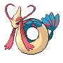
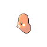
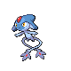

# Type Changes

---

## General Changes

1. Fairy-type is now in the game, replacing what was previously the ??? type.
1. All Pokémon that are Fairy-type in Gen VI onwards are also Fairy-type in Renegade Platinum. This is true for the Complete and the Classic versions.
1. Rotom's five alternate forms take the secondary type that they have in the Gen V games and onward (i.e. they are not Ghost-type like the normal Platinum).
1. For other type changes, they are only present in the Complete version of the hack. If you don't like these changes, use the Classic version patch instead.

---

## Pokémon Type Changes (Complete version only)

| Pokémon | ID | Old Type | New Type | Justification |
| --- | --- | --- | --- | --- |
|  | #006 [Charizard](../pokemon/charizard.md) | Fire Flying | Fire Dragon | Inherited from Mega form Draconic appearance |
|  | #038 [Ninetales](../pokemon/ninetales.md) | Fire | Fire Fairy | Inherited from Alola form Generally quite 'mystical' in appearance |
|  | #055 [Golduck](../pokemon/golduck.md) | Water | Water Psychic | Canonically uses Psychic-type moves Commonly mistaken as a Psychic type |
|  | #083 [Farfetch'd](../pokemon/farfetchd.md) | Normal Flying | Fighting Flying | Able to attack using leek as a weapon Gives it a niche over Normal/Flying Pokémon |
|  | #154 [Meganium](../pokemon/meganium.md) | Grass | Grass Fairy | Heavy on the flower aesthetic Heavily voted for by community |
|  | #160 [Feraligatr](../pokemon/feraligatr.md) | Water | Water Dark | Looks intimidating Pokédex claims it to be savage Voted for by the community |
|  | #164 [Noctowl](../pokemon/noctowl.md) | Normal Flying | Psychic Flying | Canonically uses Psychic-type moves Commonly thought that it should be a Psychic type |
|  | #181 [Ampharos](../pokemon/ampharos.md) | Electric | Electric Dragon | Inherited from Mega form Japanese name means "Electric dragon" Was Dragon in early G/S development |
|  | #200 [Misdreavus](../pokemon/misdreavus.md) | Ghost | Ghost Fairy | Design inspiration from mythological creatures Mischevious nature Evolved form has a witch aesthetic |
|  | #254 [Sceptile](../pokemon/sceptile.md) | Grass | Grass Dragon | Inherited from Mega form Commonly requested |
|  | #284 [Masquerain](../pokemon/masquerain.md) | Bug Flying | Bug Water | Pre-evolution has Water type Bug/Water is a fairly unique type combo Still looks a lot like Surskit |
|  | #313 [Volbeat](../pokemon/volbeat.md) | Bug | Bug Electric | Learns a lot of Electric attacks Has illumination powers Design looks fitting for Electric |
|  | #314 [Illumise](../pokemon/illumise.md) | Bug | Bug Fairy | Firefly lights look similar to how other games display the Fairy-type Counterpart to Volbeat |
|  | #328 [Trapinch](../pokemon/trapinch.md) | Ground | Bug Ground | Based on an insect Is in the Bug Egg group Evolved forms also look very Bug-like |
|  | #329 [Vibrava](../pokemon/vibrava.md) | Ground Dragon | Bug Dragon | Based on an insect In Bug Egg group Aesthetic is very Bug-like Learns Bug-type moves Unique type combo |
|  | #330 [Flygon](../pokemon/flygon.md) | Ground Dragon | Bug Dragon | Based on an insect In Bug Egg group Has Bug-like features Learns Bug-type moves Unique type combo |
|  | #333 [Swablu](../pokemon/swablu.md) | Normal Flying | Fairy Flying | Inherited from Altaria's Mega form Fluffy cloud appearance fits with Fairy |
|  | #334 [Altaria](../pokemon/altaria.md) | Dragon Flying | Dragon Fairy | Inherited from Mega form Fluffy cloud appearance fits with Fairy Common request by community |
|  | #336 [Seviper](../pokemon/seviper.md) | Poison | Poison Dark | Evil and intimidating looking Gives it more of a niche Common request by community |
|  | #350 [Milotic](../pokemon/milotic.md) | Water | Water Fairy | Elegant aesthetic and mythological mermaid inspiration fit with Fairy-type Heavily voted for by community |
|  | #362 [Glalie](../pokemon/glalie.md) | Ice | Ice Rock | Pokédex entries state Glalie has a body made of rock with ice on top Unique type combo |
|  | #370 [Luvdisc](../pokemon/luvdisc.md) | Water | Water Fairy | Heart and love aesthetic fits with Fairy-type Makes it just a little more noticeable |
|  | #405 [Luxray](../pokemon/luxray.md) | Electric | Electric Dark | Intimidating look and general dark coloured aesthetic fit with Dark-type Unique type combo |
|  | #428 [Lopunny](../pokemon/lopunny.md) | Normal | Normal Fighting | Inherited from Mega form Has a humanoid appearance and learns lots of Fighting-type moves naturally |
|  | #429 [Mismagius](../pokemon/mismagius.md) | Ghost | Ghost Fairy | Inspired by witches and mages from fairy tales Unique type combo Gives it a specific niche |
|  | #466 [Electivire](../pokemon/electivire.md) | Electric | Electric Fighting | Stats are physically focused Learns lots of Fighting moves naturally Pokédex states it uses fists |
|  | #480 [Uxie](../pokemon/uxie.md) | Psychic | Psychic Fairy | Likely inspired by a pixie, a mythlogical creature |
|  | #481 [Mesprit](../pokemon/mesprit.md) | Psychic | Psychic Fairy | Likely inspired by a sprite, a mythological creature |
|  | #482 [Azelf](../pokemon/azelf.md) | Psychic | Psychic Fairy | Likely inspired by a pixie (possibly a gnome..?), a mythlogical creature |
