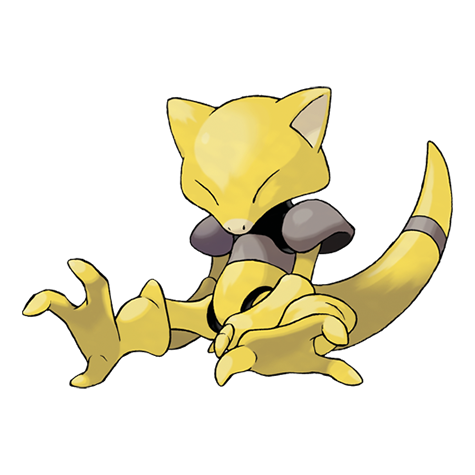
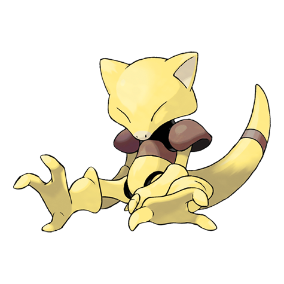

# Abra (Psi Pokémon)

| Official Artwork | Shiny Artwork |
| --- | --- |
|  |  |

Using its psychic power is such a strain on its brain that it needs to sleep for 18 hours a day.

---

## Media

### Cries

No cries available.

---

## Pokédex Data

| National № | Type(s) | Height | Weight | Abilities | Local № |
|------------|---------|--------|--------|-----------|---------|
| #63 | {: width='48'} | 0.9 m | 19.5 kg | 1. Magic-Guard 2. Synchronize | #20 |

---

## Base Stats
|   | HP | Attack | Defense | Sp. Atk | Sp. Def | Speed |
|---|----|--------|---------|---------|---------|-------|
| **Base** | 25 | 20 | 15 | 105 | 55 | 90 |
| **Min** | 160 | 40 | 31 | 193 | 103 | 166 |
| **Max** | 254 | 152 | 141 | 339 | 229 | 306 |

The ranges shown above are for a level 100 Pokémon. Maximum values are based on a beneficial nature, 252 EVs, 31 IVs; minimum values are based on a hindering nature, 0 EVs, 0 IVs.

---

## Forms & Evolutions

!!! warning "WARNING"

    Information on evolutions may not be 100% accurate; differences between evolution methods across generations are not accounted for.

### Forms

Abra has no alternate forms.

### Evolution Line

1. [Abra](abra.md/)
    1. Level Up: [Kadabra](kadabra.md/)
        1. Trade: [Alakazam](alakazam.md/)

---

## Training

| EV Yield | Catch Rate | Base Friendship | Base Exp. | Growth Rate | Held Items |
|----------|------------|-----------------|-----------|-------------|------------|
| 1 Special Attack | 200 | 50 | 62 | Medium-Slow | twisted-spoon (5%) |

---

## Breeding

| Egg Groups | Egg Cycles | Gender | Dimorphic | Color | Shape |
|------------|------------|--------|-----------|-------|-------|
| 1. Humanshape | 20 | 75.0% Male 25.0% Female | False | Brown | Upright |

---

## Moves

!!! warning "WARNING"

    Specific move information may be incorrect. However, the general movepool should be accurate; this includes changes made in Renegade Platinum.

### Level Up Moves

| Lv. | Move | Type | Cat. | Power | Acc. | PP |
| --- | --- | --- | --- | --- | --- | --- |
| 1 | Teleport | {: width='48'} | {: width='36'} | — | — | 20 |

### TM Moves

| TM | Move | Type | Cat. | Power | Acc. | PP |
| --- | --- | --- | --- | --- | --- | --- |
| TM01 | Focus Punch | {: width='48'} | {: width='36'} | 150 | 100 | 20 |
| TM04 | Calm Mind | {: width='48'} | {: width='36'} | — | — | 20 |
| TM06 | Toxic | {: width='48'} | {: width='36'} | — | 90 | 10 |
| TM10 | Hidden Power | {: width='48'} | {: width='36'} | 60 | 100 | 15 |
| TM11 | Sunny Day | {: width='48'} | {: width='36'} | — | — | 5 |
| TM12 | Taunt | {: width='48'} | {: width='36'} | — | 100 | 20 |
| TM16 | Light Screen | {: width='48'} | {: width='36'} | — | — | 30 |
| TM17 | Protect | {: width='48'} | {: width='36'} | — | — | 10 |
| TM18 | Rain Dance | {: width='48'} | {: width='36'} | — | — | 5 |
| TM20 | Safeguard | {: width='48'} | {: width='36'} | — | — | 25 |
| TM21 | Frustration | {: width='48'} | {: width='36'} | — | 100 | 20 |
| TM23 | Iron Tail | {: width='48'} | {: width='36'} | 100 | 75 | 15 |
| TM27 | Return | {: width='48'} | {: width='36'} | — | 100 | 20 |
| TM29 | Psychic | {: width='48'} | {: width='36'} | 90 | 100 | 10 |
| TM30 | Shadow Ball | {: width='48'} | {: width='36'} | 80 | 100 | 15 |
| TM32 | Double Team | {: width='48'} | {: width='36'} | — | — | 15 |
| TM33 | Reflect | {: width='48'} | {: width='36'} | — | — | 20 |
| TM34 | Shock Wave | {: width='48'} | {: width='36'} | 60 | — | 20 |
| TM41 | Torment | {: width='48'} | {: width='36'} | — | 100 | 15 |
| TM42 | Facade | {: width='48'} | {: width='36'} | 70 | 100 | 20 |
| TM43 | Secret Power | {: width='48'} | {: width='36'} | 70 | 100 | 20 |
| TM44 | Rest | {: width='48'} | {: width='36'} | — | — | 5 |
| TM45 | Attract | {: width='48'} | {: width='36'} | — | 100 | 15 |
| TM46 | Thief | {: width='48'} | {: width='36'} | 60 | 100 | 25 |
| TM48 | Skill Swap | {: width='48'} | {: width='36'} | — | — | 10 |
| TM49 | Snatch | {: width='48'} | {: width='36'} | — | — | 10 |
| TM53 | Energy Ball | {: width='48'} | {: width='36'} | 90 | 100 | 10 |
| TM56 | Fling | {: width='48'} | {: width='36'} | — | 100 | 10 |
| TM57 | Charge Beam | {: width='48'} | {: width='36'} | 50 | 90 | 10 |
| TM58 | Endure | {: width='48'} | {: width='36'} | — | — | 10 |
| TM60 | Drain Punch | {: width='48'} | {: width='36'} | 75 | 100 | 10 |
| TM63 | Embargo | {: width='48'} | {: width='36'} | — | 100 | 15 |
| TM67 | Recycle | {: width='48'} | {: width='36'} | — | — | 10 |
| TM70 | Flash | {: width='48'} | {: width='36'} | — | 100 | 20 |
| TM73 | Thunder Wave | {: width='48'} | {: width='36'} | — | 90 | 20 |
| TM77 | Psych Up | {: width='48'} | {: width='36'} | — | — | 10 |
| TM78 | Captivate | {: width='48'} | {: width='36'} | — | 100 | 20 |
| TM82 | Sleep Talk | {: width='48'} | {: width='36'} | — | — | 10 |
| TM83 | Natural Gift | {: width='48'} | {: width='36'} | — | 100 | 15 |
| TM85 | Dream Eater | {: width='48'} | {: width='36'} | 100 | 100 | 15 |
| TM86 | Grass Knot | {: width='48'} | {: width='36'} | — | 100 | 20 |
| TM87 | Swagger | {: width='48'} | {: width='36'} | — | 85 | 15 |
| TM90 | Substitute | {: width='48'} | {: width='36'} | — | — | 10 |
| TM92 | Trick Room | {: width='48'} | {: width='36'} | — | — | 5 |

### Egg Moves

| Move | Type | Cat. | Power | Acc. | PP |
| --- | --- | --- | --- | --- | --- |
| Fire Punch | {: width='48'} | {: width='36'} | 75 | 100 | 15 |
| Ice Punch | {: width='48'} | {: width='36'} | 75 | 100 | 15 |
| Thunder Punch | {: width='48'} | {: width='36'} | 75 | 100 | 15 |
| Barrier | {: width='48'} | {: width='36'} | — | — | 20 |
| Encore | {: width='48'} | {: width='36'} | — | 100 | 5 |
| Knock Off | {: width='48'} | {: width='36'} | 65 | 100 | 20 |
| Power Trick | {: width='48'} | {: width='36'} | — | — | 10 |
| Guard Swap | {: width='48'} | {: width='36'} | — | — | 10 |

### Tutor Moves

| Move | Type | Cat. | Power | Acc. | PP |
| --- | --- | --- | --- | --- | --- |
| Fire Punch | {: width='48'} | {: width='36'} | 75 | 100 | 15 |
| Ice Punch | {: width='48'} | {: width='36'} | 75 | 100 | 15 |
| Thunder Punch | {: width='48'} | {: width='36'} | 75 | 100 | 15 |
| Snore | {: width='48'} | {: width='36'} | 50 | 100 | 15 |
| Trick | {: width='48'} | {: width='36'} | — | 100 | 10 |
| Knock Off | {: width='48'} | {: width='36'} | 65 | 100 | 20 |
| Signal Beam | {: width='48'} | {: width='36'} | 75 | 100 | 15 |
| Zen Headbutt | {: width='48'} | {: width='36'} | 80 | 90 | 15 |

