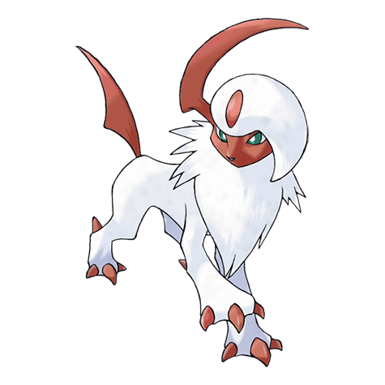

# Absol (Disaster Pokémon)

| Official Artwork | Shiny Artwork |
| --- | --- |
|  |  |

Rumored to sense disasters with its horn, it became a target. It fled deep into the mountains.

---

## Media

### Cries

No cries available.

---

## Pokédex Data

| National № | Type(s) | Height | Weight | Abilities | Local № |
|------------|---------|--------|--------|-----------|---------|
| #359 | {: width='48'} | 1.2 m | 47.0 kg | 1. Super-Luck 2. Pressure | N/A |

---

## Base Stats
|   | HP | Attack | Defense | Sp. Atk | Sp. Def | Speed |
|---|----|--------|---------|---------|---------|-------|
| **Base** | 65 | 130 | 60 | 85 | 60 | 85 |
| **Min** | 240 | 238 | 112 | 157 | 112 | 157 |
| **Max** | 334 | 394 | 240 | 295 | 240 | 295 |

The ranges shown above are for a level 100 Pokémon. Maximum values are based on a beneficial nature, 252 EVs, 31 IVs; minimum values are based on a hindering nature, 0 EVs, 0 IVs.

---

## Forms & Evolutions

!!! warning "WARNING"

    Information on evolutions may not be 100% accurate; differences between evolution methods across generations are not accounted for.

### Forms

Absol has no alternate forms.

### Evolution Line

1. [Absol](absol.md/)

---

## Training

| EV Yield | Catch Rate | Base Friendship | Base Exp. | Growth Rate | Held Items |
|----------|------------|-----------------|-----------|-------------|------------|
| 2 Attack | 30 | 35 | 163 | Medium-Slow |  |

---

## Breeding

| Egg Groups | Egg Cycles | Gender | Dimorphic | Color | Shape |
|------------|------------|--------|-----------|-------|-------|
| 1. Ground | 25 | 50.0% Male 50.0% Female | False | White | Quadruped |

---

## Moves

!!! warning "WARNING"

    Specific move information may be incorrect. However, the general movepool should be accurate; this includes changes made in Renegade Platinum.

### Level Up Moves

| Lv. | Move | Type | Cat. | Power | Acc. | PP |
| --- | --- | --- | --- | --- | --- | --- |
| 1 | Feint | {: width='48'} | {: width='36'} | 30 | 100 | 10 |
| 1 | Knock Off | {: width='48'} | {: width='36'} | 65 | 100 | 20 |
| 1 | Scratch | {: width='48'} | {: width='36'} | 40 | 100 | 35 |
| 4 | Leer | {: width='48'} | {: width='36'} | — | 100 | 30 |
| 7 | Quick Attack | {: width='48'} | {: width='36'} | 40 | 100 | 30 |
| 10 | Pursuit | {: width='48'} | {: width='36'} | 40 | 100 | 20 |
| 13 | Taunt | {: width='48'} | {: width='36'} | — | 100 | 20 |
| 16 | Bite | {: width='48'} | {: width='36'} | 60 | 100 | 25 |
| 19 | Double Team | {: width='48'} | {: width='36'} | — | — | 15 |
| 22 | Night Slash | {: width='48'} | {: width='36'} | 70 | 100 | 15 |
| 22 | Slash | {: width='48'} | {: width='36'} | 70 | 100 | 20 |
| 25 | Swords Dance | {: width='48'} | {: width='36'} | — | — | 20 |
| 28 | Psycho Cut | {: width='48'} | {: width='36'} | 70 | 100 | 20 |
| 31 | Detect | {: width='48'} | {: width='36'} | — | — | 5 |
| 34 | Me First | {: width='48'} | {: width='36'} | — | — | 20 |
| 37 | Sucker Punch | {: width='48'} | {: width='36'} | 70 | 100 | 5 |
| 40 | Razor Wind | {: width='48'} | {: width='36'} | 80 | 100 | 10 |
| 43 | Megahorn | {: width='48'} | {: width='36'} | 120 | 85 | 10 |
| 46 | Play Rough | {: width='48'} | {: width='36'} | 90 | 90 | 10 |
| 49 | Future Sight | {: width='48'} | {: width='36'} | 120 | 100 | 10 |
| 52 | Perish Song | {: width='48'} | {: width='36'} | — | — | 5 |

### TM Moves

| TM | Move | Type | Cat. | Power | Acc. | PP |
| --- | --- | --- | --- | --- | --- | --- |
| HM01 | Cut | {: width='48'} | {: width='36'} | 60 | 100% | 25 |
| HM04 | Strength | {: width='48'} | {: width='36'} | 100 | 100 | 15 |
| HM06 | Rock Smash | {: width='48'} | {: width='36'} | 60 | 100 | 15 |
| TM03 | Water Pulse | {: width='48'} | {: width='36'} | 60 | 100 | 20 |
| TM04 | Calm Mind | {: width='48'} | {: width='36'} | — | — | 20 |
| TM06 | Toxic | {: width='48'} | {: width='36'} | — | 90 | 10 |
| TM07 | Hail | {: width='48'} | {: width='36'} | — | — | 10 |
| TM10 | Hidden Power | {: width='48'} | {: width='36'} | 60 | 100 | 15 |
| TM11 | Sunny Day | {: width='48'} | {: width='36'} | — | — | 5 |
| TM12 | Taunt | {: width='48'} | {: width='36'} | — | 100 | 20 |
| TM13 | Ice Beam | {: width='48'} | {: width='36'} | 90 | 100 | 10 |
| TM14 | Blizzard | {: width='48'} | {: width='36'} | 110 | 70 | 5 |
| TM15 | Hyper Beam | {: width='48'} | {: width='36'} | 150 | 90 | 5 |
| TM17 | Protect | {: width='48'} | {: width='36'} | — | — | 10 |
| TM18 | Rain Dance | {: width='48'} | {: width='36'} | — | — | 5 |
| TM21 | Frustration | {: width='48'} | {: width='36'} | — | 100 | 20 |
| TM23 | Iron Tail | {: width='48'} | {: width='36'} | 100 | 75 | 15 |
| TM24 | Thunderbolt | {: width='48'} | {: width='36'} | 90 | 100 | 15 |
| TM25 | Thunder | {: width='48'} | {: width='36'} | 110 | 70 | 10 |
| TM27 | Return | {: width='48'} | {: width='36'} | — | 100 | 20 |
| TM30 | Shadow Ball | {: width='48'} | {: width='36'} | 80 | 100 | 15 |
| TM32 | Double Team | {: width='48'} | {: width='36'} | — | — | 15 |
| TM34 | Shock Wave | {: width='48'} | {: width='36'} | 60 | — | 20 |
| TM35 | Flamethrower | {: width='48'} | {: width='36'} | 90 | 100 | 15 |
| TM37 | Sandstorm | {: width='48'} | {: width='36'} | — | — | 10 |
| TM38 | Fire Blast | {: width='48'} | {: width='36'} | 110 | 85 | 5 |
| TM39 | Rock Tomb | {: width='48'} | {: width='36'} | 60 | 95 | 15 |
| TM40 | Aerial Ace | {: width='48'} | {: width='36'} | 60 | — | 20 |
| TM41 | Torment | {: width='48'} | {: width='36'} | — | 100 | 15 |
| TM42 | Facade | {: width='48'} | {: width='36'} | 70 | 100 | 20 |
| TM43 | Secret Power | {: width='48'} | {: width='36'} | 70 | 100 | 20 |
| TM44 | Rest | {: width='48'} | {: width='36'} | — | — | 5 |
| TM45 | Attract | {: width='48'} | {: width='36'} | — | 100 | 15 |
| TM46 | Thief | {: width='48'} | {: width='36'} | 60 | 100 | 25 |
| TM49 | Snatch | {: width='48'} | {: width='36'} | — | — | 10 |
| TM54 | False Swipe | {: width='48'} | {: width='36'} | 40 | 100 | 40 |
| TM57 | Charge Beam | {: width='48'} | {: width='36'} | 50 | 90 | 10 |
| TM58 | Endure | {: width='48'} | {: width='36'} | — | — | 10 |
| TM61 | Will O Wisp | {: width='48'} | {: width='36'} | — | 85 | 15 |
| TM65 | Shadow Claw | {: width='48'} | {: width='36'} | 80 | 100 | 15 |
| TM66 | Payback | {: width='48'} | {: width='36'} | 50 | 100 | 10 |
| TM68 | Giga Impact | {: width='48'} | {: width='36'} | 150 | 90 | 5 |
| TM70 | Flash | {: width='48'} | {: width='36'} | — | 100 | 20 |
| TM71 | Stone Edge | {: width='48'} | {: width='36'} | 100 | 80 | 5 |
| TM73 | Thunder Wave | {: width='48'} | {: width='36'} | — | 90 | 20 |
| TM75 | Swords Dance | {: width='48'} | {: width='36'} | — | — | 20 |
| TM77 | Psych Up | {: width='48'} | {: width='36'} | — | — | 10 |
| TM78 | Captivate | {: width='48'} | {: width='36'} | — | 100 | 20 |
| TM79 | Dark Pulse | {: width='48'} | {: width='36'} | 80 | 100 | 15 |
| TM80 | Rock Slide | {: width='48'} | {: width='36'} | 75 | 90 | 10 |
| TM81 | X Scissor | {: width='48'} | {: width='36'} | 80 | 100 | 15 |
| TM82 | Sleep Talk | {: width='48'} | {: width='36'} | — | — | 10 |
| TM83 | Natural Gift | {: width='48'} | {: width='36'} | — | 100 | 15 |
| TM85 | Dream Eater | {: width='48'} | {: width='36'} | 100 | 100 | 15 |
| TM87 | Swagger | {: width='48'} | {: width='36'} | — | 85 | 15 |
| TM90 | Substitute | {: width='48'} | {: width='36'} | — | — | 10 |

### Egg Moves

| Move | Type | Cat. | Power | Acc. | PP |
| --- | --- | --- | --- | --- | --- |
| Double Edge | {: width='48'} | {: width='36'} | 120 | 100 | 15 |
| Substitute | {: width='48'} | {: width='36'} | — | — | 10 |
| Curse | {: width='48'} | {: width='36'} | — | — | 10 |
| Feint Attack | {: width='48'} | {: width='36'} | 60 | — | 20 |
| Mean Look | {: width='48'} | {: width='36'} | — | — | 5 |
| Baton Pass | {: width='48'} | {: width='36'} | — | — | 40 |
| Magic Coat | {: width='48'} | {: width='36'} | — | — | 15 |
| Assurance | {: width='48'} | {: width='36'} | 60 | 100 | 10 |
| Me First | {: width='48'} | {: width='36'} | — | — | 20 |
| Punishment | {: width='48'} | {: width='36'} | — | 100 | 5 |
| Sucker Punch | {: width='48'} | {: width='36'} | 70 | 100 | 5 |
| Zen Headbutt | {: width='48'} | {: width='36'} | 80 | 90 | 15 |

### Tutor Moves

| Move | Type | Cat. | Power | Acc. | PP |
| --- | --- | --- | --- | --- | --- |
| Swift | {: width='48'} | {: width='36'} | 60 | — | 20 |
| Snore | {: width='48'} | {: width='36'} | 50 | 100 | 15 |
| Spite | {: width='48'} | {: width='36'} | — | 100 | 10 |
| Mud Slap | {: width='48'} | {: width='36'} | 20 | 100 | 10 |
| Icy Wind | {: width='48'} | {: width='36'} | 55 | 95 | 15 |
| Fury Cutter | {: width='48'} | {: width='36'} | 40 | 95 | 20 |
| Superpower | {: width='48'} | {: width='36'} | 120 | 100 | 5 |
| Knock Off | {: width='48'} | {: width='36'} | 65 | 100 | 20 |
| Bounce | {: width='48'} | {: width='36'} | 85 | 85 | 5 |
| Sucker Punch | {: width='48'} | {: width='36'} | 70 | 100 | 5 |
| Zen Headbutt | {: width='48'} | {: width='36'} | 80 | 90 | 15 |

