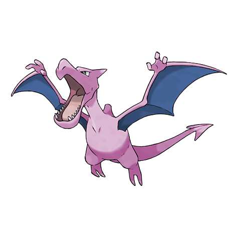

# Aerodactyl (Fossil Pokémon)

| Official Artwork | Shiny Artwork |
| --- | --- |
|  |  |

A Pokémon that roamed the skies in the dinosaur era. Its teeth are like saw blades.

---

## Media

### Cries

Latest (Gen VI+):

<audio controls>
<source src='../../assets/cries/aerodactyl/latest.ogg' type='audio/ogg'>
  Your browser does not support the audio element.
</audio>

Legacy:

<audio controls>
<source src='../../assets/cries/aerodactyl/legacy.ogg' type='audio/ogg'>
  Your browser does not support the audio element.
</audio>

---

## Pokédex Data

| National № | Type(s) | Height | Weight | Abilities | Local № |
|------------|---------|--------|--------|-----------|---------|
| #142 | {: width='48'} {: width='48'} | 1.8 m | 59.0 kg | 1. Rock-Head 2. Pressure 3. Unnerve | N/A |

---

## Base Stats
|   | HP | Attack | Defense | Sp. Atk | Sp. Def | Speed |
|---|----|--------|---------|---------|---------|-------|
| **Base** | 80 | 105 | 65 | 60 | 75 | 130 |
| **Min** | 270 | 193 | 121 | 112 | 139 | 238 |
| **Max** | 364 | 339 | 251 | 240 | 273 | 394 |

The ranges shown above are for a level 100 Pokémon. Maximum values are based on a beneficial nature, 252 EVs, 31 IVs; minimum values are based on a hindering nature, 0 EVs, 0 IVs.

---

## Forms & Evolutions

!!! warning "WARNING"

    Information on evolutions may not be 100% accurate; differences between evolution methods across generations are not accounted for.

### Forms

Aerodactyl has no alternate forms.

### Evolution Line

1. [Aerodactyl](aerodactyl.md/)

---

## Training

| EV Yield | Catch Rate | Base Friendship | Base Exp. | Growth Rate | Held Items |
|----------|------------|-----------------|-----------|-------------|------------|
| 2 Speed | 45 | 50 | 180 | Slow | N/A |

---

## Breeding

| Egg Groups | Egg Cycles | Gender | Dimorphic | Color | Shape |
|------------|------------|--------|-----------|-------|-------|
| 1. Flying | 35 | 87.5% Male 12.5% Female | False | Purple | Wings |

---

## Moves

!!! warning "WARNING"

    Specific move information may be incorrect. However, the general movepool should be accurate; this includes changes made in Renegade Platinum.

### Level Up Moves

| Lv. | Move | Type | Cat. | Power | Acc. | PP |
| --- | --- | --- | --- | --- | --- | --- |
| 1 | Bite | {: width='48'} | {: width='36'} | 60 | 100 | 25 |
| 1 | Fire Fang | {: width='48'} | {: width='36'} | 65 | 95 | 15 |
| 1 | Ice Fang | {: width='48'} | {: width='36'} | 65 | 95 | 15 |
| 1 | Scary Face | {: width='48'} | {: width='36'} | — | 100 | 10 |
| 1 | Supersonic | {: width='48'} | {: width='36'} | — | 55 | 20 |
| 1 | Thunder Fang | {: width='48'} | {: width='36'} | 65 | 95 | 15 |
| 9 | Roar | {: width='48'} | {: width='36'} | — | — | 20 |
| 13 | Agility | {: width='48'} | {: width='36'} | — | — | 30 |
| 17 | Wing Attack | {: width='48'} | {: width='36'} | 60 | 100 | 35 |
| 21 | Ancient Power | {: width='48'} | {: width='36'} | 60 | 100 | 5 |
| 25 | Crunch | {: width='48'} | {: width='36'} | 80 | 100 | 15 |
| 29 | Rock Slide | {: width='48'} | {: width='36'} | 75 | 90 | 10 |
| 33 | Take Down | {: width='48'} | {: width='36'} | 90 | 85 | 20 |
| 37 | Dragon Claw | {: width='48'} | {: width='36'} | 80 | 100 | 15 |
| 41 | Iron Head | {: width='48'} | {: width='36'} | 80 | 100 | 15 |
| 45 | Earthquake | {: width='48'} | {: width='36'} | 100 | 100 | 10 |
| 49 | Stone Edge | {: width='48'} | {: width='36'} | 100 | 80 | 5 |
| 53 | Brave Bird | {: width='48'} | {: width='36'} | 120 | 100 | 15 |
| 57 | Hyper Beam | {: width='48'} | {: width='36'} | 150 | 90 | 5 |
| 61 | Giga Impact | {: width='48'} | {: width='36'} | 150 | 90 | 5 |
| 65 | Sky Attack | {: width='48'} | {: width='36'} | 140 | 90 | 5 |

### TM Moves

| TM | Move | Type | Cat. | Power | Acc. | PP |
| --- | --- | --- | --- | --- | --- | --- |
| TBD | Hurricane | {: width='48'} | {: width='36'} | 110 | 70 | 10 |
| HM02 | Fly | {: width='48'} | {: width='36'} | 100 | 100% | 15 |
| HM04 | Strength | {: width='48'} | {: width='36'} | 100 | 100 | 15 |
| HM05 | Defog | {: width='48'} | {: width='36'} | — | — | 15 |
| HM06 | Rock Smash | {: width='48'} | {: width='36'} | 60 | 100 | 15 |
| TM02 | Dragon Claw | {: width='48'} | {: width='36'} | 80 | 100 | 15 |
| TM05 | Roar | {: width='48'} | {: width='36'} | — | — | 20 |
| TM06 | Toxic | {: width='48'} | {: width='36'} | — | 90 | 10 |
| TM10 | Hidden Power | {: width='48'} | {: width='36'} | 60 | 100 | 15 |
| TM11 | Sunny Day | {: width='48'} | {: width='36'} | — | — | 5 |
| TM12 | Taunt | {: width='48'} | {: width='36'} | — | 100 | 20 |
| TM15 | Hyper Beam | {: width='48'} | {: width='36'} | 150 | 90 | 5 |
| TM17 | Protect | {: width='48'} | {: width='36'} | — | — | 10 |
| TM18 | Rain Dance | {: width='48'} | {: width='36'} | — | — | 5 |
| TM21 | Frustration | {: width='48'} | {: width='36'} | — | 100 | 20 |
| TM23 | Iron Tail | {: width='48'} | {: width='36'} | 100 | 75 | 15 |
| TM26 | Earthquake | {: width='48'} | {: width='36'} | 100 | 100 | 10 |
| TM27 | Return | {: width='48'} | {: width='36'} | — | 100 | 20 |
| TM32 | Double Team | {: width='48'} | {: width='36'} | — | — | 15 |
| TM35 | Flamethrower | {: width='48'} | {: width='36'} | 90 | 100 | 15 |
| TM37 | Sandstorm | {: width='48'} | {: width='36'} | — | — | 10 |
| TM38 | Fire Blast | {: width='48'} | {: width='36'} | 110 | 85 | 5 |
| TM39 | Rock Tomb | {: width='48'} | {: width='36'} | 60 | 95 | 15 |
| TM40 | Aerial Ace | {: width='48'} | {: width='36'} | 60 | — | 20 |
| TM41 | Torment | {: width='48'} | {: width='36'} | — | 100 | 15 |
| TM42 | Facade | {: width='48'} | {: width='36'} | 70 | 100 | 20 |
| TM43 | Secret Power | {: width='48'} | {: width='36'} | 70 | 100 | 20 |
| TM44 | Rest | {: width='48'} | {: width='36'} | — | — | 5 |
| TM45 | Attract | {: width='48'} | {: width='36'} | — | 100 | 15 |
| TM46 | Thief | {: width='48'} | {: width='36'} | 60 | 100 | 25 |
| TM47 | Steel Wing | {: width='48'} | {: width='36'} | 70 | 90 | 25 |
| TM51 | Roost | {: width='48'} | {: width='36'} | — | — | 5 |
| TM58 | Endure | {: width='48'} | {: width='36'} | — | — | 10 |
| TM59 | Dragon Pulse | {: width='48'} | {: width='36'} | 85 | 100 | 10 |
| TM66 | Payback | {: width='48'} | {: width='36'} | 50 | 100 | 10 |
| TM68 | Giga Impact | {: width='48'} | {: width='36'} | 150 | 90 | 5 |
| TM69 | Rock Polish | {: width='48'} | {: width='36'} | — | — | 20 |
| TM71 | Stone Edge | {: width='48'} | {: width='36'} | 100 | 80 | 5 |
| TM76 | Stealth Rock | {: width='48'} | {: width='36'} | — | — | 20 |
| TM78 | Captivate | {: width='48'} | {: width='36'} | — | 100 | 20 |
| TM80 | Rock Slide | {: width='48'} | {: width='36'} | 75 | 90 | 10 |
| TM82 | Sleep Talk | {: width='48'} | {: width='36'} | — | — | 10 |
| TM83 | Natural Gift | {: width='48'} | {: width='36'} | — | 100 | 15 |
| TM87 | Swagger | {: width='48'} | {: width='36'} | — | 85 | 15 |
| TM90 | Substitute | {: width='48'} | {: width='36'} | — | — | 10 |

### Egg Moves

| Move | Type | Cat. | Power | Acc. | PP |
| --- | --- | --- | --- | --- | --- |
| Whirlwind | {: width='48'} | {: width='36'} | — | — | 20 |
| Curse | {: width='48'} | {: width='36'} | — | — | 10 |
| Foresight | {: width='48'} | {: width='36'} | — | — | 40 |
| Steel Wing | {: width='48'} | {: width='36'} | 70 | 90 | 25 |
| Dragon Breath | {: width='48'} | {: width='36'} | 60 | 100 | 20 |
| Pursuit | {: width='48'} | {: width='36'} | 40 | 100 | 20 |
| Assurance | {: width='48'} | {: width='36'} | 60 | 100 | 10 |

### Tutor Moves

| Move | Type | Cat. | Power | Acc. | PP |
| --- | --- | --- | --- | --- | --- |
| Swift | {: width='48'} | {: width='36'} | 60 | — | 20 |
| Snore | {: width='48'} | {: width='36'} | 50 | 100 | 15 |
| Twister | {: width='48'} | {: width='36'} | 40 | 100 | 20 |
| Ancient Power | {: width='48'} | {: width='36'} | 60 | 100 | 5 |
| Heat Wave | {: width='48'} | {: width='36'} | 95 | 90 | 10 |
| Air Cutter | {: width='48'} | {: width='36'} | 60 | 95 | 25 |
| Aqua Tail | {: width='48'} | {: width='36'} | 90 | 90 | 10 |
| Earth Power | {: width='48'} | {: width='36'} | 90 | 100 | 10 |
| Iron Head | {: width='48'} | {: width='36'} | 80 | 100 | 15 |
| Ominous Wind | {: width='48'} | {: width='36'} | 60 | 100 | 5 |

