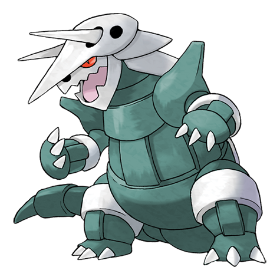

# Aggron (Iron Armor Pokémon)

| Official Artwork | Shiny Artwork |
| --- | --- |
|  |  |

While seeking iron for food, it digs tunnels by breaking through bedrock with its steel horns.

---

## Media

### Cries

No cries available.

---

## Pokédex Data

| National № | Type(s) | Height | Weight | Abilities | Local № |
|------------|---------|--------|--------|-----------|---------|
| #306 | {: width='48'} {: width='48'} | 2.1 m | 360.0 kg | 1. Rock-Head 2. Sturdy | N/A |

---

## Base Stats
|   | HP | Attack | Defense | Sp. Atk | Sp. Def | Speed |
|---|----|--------|---------|---------|---------|-------|
| **Base** | 70 | 110 | 180 | 60 | 60 | 50 |
| **Min** | 250 | 202 | 328 | 112 | 112 | 94 |
| **Max** | 344 | 350 | 504 | 240 | 240 | 218 |

The ranges shown above are for a level 100 Pokémon. Maximum values are based on a beneficial nature, 252 EVs, 31 IVs; minimum values are based on a hindering nature, 0 EVs, 0 IVs.

---

## Forms & Evolutions

!!! warning "WARNING"

    Information on evolutions may not be 100% accurate; differences between evolution methods across generations are not accounted for.

### Forms

Aggron has no alternate forms.

### Evolution Line

1. [Aron](aron.md/)
    1. Level Up: [Lairon](lairon.md/)
        1. Level Up: [Aggron](aggron.md/)

---

## Training

| EV Yield | Catch Rate | Base Friendship | Base Exp. | Growth Rate | Held Items |
|----------|------------|-----------------|-----------|-------------|------------|
| 3 Defense | 45 | 35 | 265 | Slow | hard-stone (5%) |

---

## Breeding

| Egg Groups | Egg Cycles | Gender | Dimorphic | Color | Shape |
|------------|------------|--------|-----------|-------|-------|
| 1. Monster | 35 | 50.0% Male 50.0% Female | False | Gray | Upright |

---

## Moves

!!! warning "WARNING"

    Specific move information may be incorrect. However, the general movepool should be accurate; this includes changes made in Renegade Platinum.

### Level Up Moves

| Lv. | Move | Type | Cat. | Power | Acc. | PP |
| --- | --- | --- | --- | --- | --- | --- |
| 1 | Harden | {: width='48'} | {: width='36'} | — | — | 30 |
| 1 | Head Smash | {: width='48'} | {: width='36'} | 150 | 80 | 5 |
| 1 | Metal Burst | {: width='48'} | {: width='36'} | — | 100 | 10 |
| 1 | Superpower | {: width='48'} | {: width='36'} | 120 | 100 | 5 |
| 1 | Tackle | {: width='48'} | {: width='36'} | 40 | 100 | 35 |
| 4 | Mud Slap | {: width='48'} | {: width='36'} | 20 | 100 | 10 |
| 7 | Headbutt | {: width='48'} | {: width='36'} | 70 | 100 | 15 |
| 10 | Metal Claw | {: width='48'} | {: width='36'} | 50 | 95 | 35 |
| 13 | Rock Tomb | {: width='48'} | {: width='36'} | 60 | 95 | 15 |
| 16 | Protect | {: width='48'} | {: width='36'} | — | — | 10 |
| 19 | Rock Slide | {: width='48'} | {: width='36'} | 75 | 90 | 10 |
| 22 | Roar | {: width='48'} | {: width='36'} | — | — | 20 |
| 26 | Iron Head | {: width='48'} | {: width='36'} | 80 | 100 | 15 |
| 30 | Take Down | {: width='48'} | {: width='36'} | 90 | 85 | 20 |
| 34 | Metal Sound | {: width='48'} | {: width='36'} | — | 85 | 40 |
| 38 | Iron Tail | {: width='48'} | {: width='36'} | 100 | 75 | 15 |
| 43 | Iron Defense | {: width='48'} | {: width='36'} | — | — | 15 |
| 48 | Double Edge | {: width='48'} | {: width='36'} | 120 | 100 | 15 |
| 53 | Dragon Rush | {: width='48'} | {: width='36'} | 100 | 75 | 10 |
| 58 | Head Smash | {: width='48'} | {: width='36'} | 150 | 80 | 5 |
| 63 | Metal Burst | {: width='48'} | {: width='36'} | — | 100 | 10 |

### TM Moves

| TM | Move | Type | Cat. | Power | Acc. | PP |
| --- | --- | --- | --- | --- | --- | --- |
| HM01 | Cut | {: width='48'} | {: width='36'} | 60 | 100% | 25 |
| HM03 | Surf | {: width='48'} | {: width='36'} | 90 | 100 | 15 |
| HM04 | Strength | {: width='48'} | {: width='36'} | 100 | 100 | 15 |
| HM06 | Rock Smash | {: width='48'} | {: width='36'} | 60 | 100 | 15 |
| HM08 | Rock Climb | {: width='48'} | {: width='36'} | 80 | 95% | 10 |
| TM01 | Focus Punch | {: width='48'} | {: width='36'} | 150 | 100 | 20 |
| TM02 | Dragon Claw | {: width='48'} | {: width='36'} | 80 | 100 | 15 |
| TM03 | Water Pulse | {: width='48'} | {: width='36'} | 60 | 100 | 20 |
| TM05 | Roar | {: width='48'} | {: width='36'} | — | — | 20 |
| TM06 | Toxic | {: width='48'} | {: width='36'} | — | 90 | 10 |
| TM10 | Hidden Power | {: width='48'} | {: width='36'} | 60 | 100 | 15 |
| TM11 | Sunny Day | {: width='48'} | {: width='36'} | — | — | 5 |
| TM12 | Taunt | {: width='48'} | {: width='36'} | — | 100 | 20 |
| TM13 | Ice Beam | {: width='48'} | {: width='36'} | 90 | 100 | 10 |
| TM14 | Blizzard | {: width='48'} | {: width='36'} | 110 | 70 | 5 |
| TM15 | Hyper Beam | {: width='48'} | {: width='36'} | 150 | 90 | 5 |
| TM17 | Protect | {: width='48'} | {: width='36'} | — | — | 10 |
| TM18 | Rain Dance | {: width='48'} | {: width='36'} | — | — | 5 |
| TM21 | Frustration | {: width='48'} | {: width='36'} | — | 100 | 20 |
| TM22 | Solar Beam | {: width='48'} | {: width='36'} | 120 | 100 | 10 |
| TM23 | Iron Tail | {: width='48'} | {: width='36'} | 100 | 75 | 15 |
| TM24 | Thunderbolt | {: width='48'} | {: width='36'} | 90 | 100 | 15 |
| TM25 | Thunder | {: width='48'} | {: width='36'} | 110 | 70 | 10 |
| TM26 | Earthquake | {: width='48'} | {: width='36'} | 100 | 100 | 10 |
| TM27 | Return | {: width='48'} | {: width='36'} | — | 100 | 20 |
| TM28 | Dig | {: width='48'} | {: width='36'} | 80 | 100 | 10 |
| TM31 | Brick Break | {: width='48'} | {: width='36'} | 75 | 100 | 15 |
| TM32 | Double Team | {: width='48'} | {: width='36'} | — | — | 15 |
| TM34 | Shock Wave | {: width='48'} | {: width='36'} | 60 | — | 20 |
| TM35 | Flamethrower | {: width='48'} | {: width='36'} | 90 | 100 | 15 |
| TM37 | Sandstorm | {: width='48'} | {: width='36'} | — | — | 10 |
| TM38 | Fire Blast | {: width='48'} | {: width='36'} | 110 | 85 | 5 |
| TM39 | Rock Tomb | {: width='48'} | {: width='36'} | 60 | 95 | 15 |
| TM40 | Aerial Ace | {: width='48'} | {: width='36'} | 60 | — | 20 |
| TM42 | Facade | {: width='48'} | {: width='36'} | 70 | 100 | 20 |
| TM43 | Secret Power | {: width='48'} | {: width='36'} | 70 | 100 | 20 |
| TM44 | Rest | {: width='48'} | {: width='36'} | — | — | 5 |
| TM45 | Attract | {: width='48'} | {: width='36'} | — | 100 | 15 |
| TM52 | Focus Blast | {: width='48'} | {: width='36'} | 120 | 70 | 5 |
| TM56 | Fling | {: width='48'} | {: width='36'} | — | 100 | 10 |
| TM58 | Endure | {: width='48'} | {: width='36'} | — | — | 10 |
| TM59 | Dragon Pulse | {: width='48'} | {: width='36'} | 85 | 100 | 10 |
| TM65 | Shadow Claw | {: width='48'} | {: width='36'} | 80 | 100 | 15 |
| TM66 | Payback | {: width='48'} | {: width='36'} | 50 | 100 | 10 |
| TM68 | Giga Impact | {: width='48'} | {: width='36'} | 150 | 90 | 5 |
| TM69 | Rock Polish | {: width='48'} | {: width='36'} | — | — | 20 |
| TM71 | Stone Edge | {: width='48'} | {: width='36'} | 100 | 80 | 5 |
| TM72 | Avalanche | {: width='48'} | {: width='36'} | 60 | 100 | 10 |
| TM73 | Thunder Wave | {: width='48'} | {: width='36'} | — | 90 | 20 |
| TM76 | Stealth Rock | {: width='48'} | {: width='36'} | — | — | 20 |
| TM78 | Captivate | {: width='48'} | {: width='36'} | — | 100 | 20 |
| TM79 | Dark Pulse | {: width='48'} | {: width='36'} | 80 | 100 | 15 |
| TM80 | Rock Slide | {: width='48'} | {: width='36'} | 75 | 90 | 10 |
| TM82 | Sleep Talk | {: width='48'} | {: width='36'} | — | — | 10 |
| TM83 | Natural Gift | {: width='48'} | {: width='36'} | — | 100 | 15 |
| TM87 | Swagger | {: width='48'} | {: width='36'} | — | 85 | 15 |
| TM90 | Substitute | {: width='48'} | {: width='36'} | — | — | 10 |
| TM91 | Flash Cannon | {: width='48'} | {: width='36'} | 80 | 100 | 10 |

### Egg Moves

Aggron cannot learn any moves by breeding.
### Tutor Moves

| Move | Type | Cat. | Power | Acc. | PP |
| --- | --- | --- | --- | --- | --- |
| Fire Punch | {: width='48'} | {: width='36'} | 75 | 100 | 15 |
| Ice Punch | {: width='48'} | {: width='36'} | 75 | 100 | 15 |
| Thunder Punch | {: width='48'} | {: width='36'} | 75 | 100 | 15 |
| Snore | {: width='48'} | {: width='36'} | 50 | 100 | 15 |
| Spite | {: width='48'} | {: width='36'} | — | 100 | 10 |
| Mud Slap | {: width='48'} | {: width='36'} | 20 | 100 | 10 |
| Icy Wind | {: width='48'} | {: width='36'} | 55 | 95 | 15 |
| Outrage | {: width='48'} | {: width='36'} | 120 | 100 | 10 |
| Rollout | {: width='48'} | {: width='36'} | 30 | 90 | 20 |
| Fury Cutter | {: width='48'} | {: width='36'} | 40 | 95 | 20 |
| Ancient Power | {: width='48'} | {: width='36'} | 60 | 100 | 5 |
| Uproar | {: width='48'} | {: width='36'} | 90 | 100 | 10 |
| Superpower | {: width='48'} | {: width='36'} | 120 | 100 | 5 |
| Endeavor | {: width='48'} | {: width='36'} | — | 100 | 5 |
| Iron Defense | {: width='48'} | {: width='36'} | — | — | 15 |
| Magnet Rise | {: width='48'} | {: width='36'} | — | — | 10 |
| Aqua Tail | {: width='48'} | {: width='36'} | 90 | 90 | 10 |
| Earth Power | {: width='48'} | {: width='36'} | 90 | 100 | 10 |
| Iron Head | {: width='48'} | {: width='36'} | 80 | 100 | 15 |

