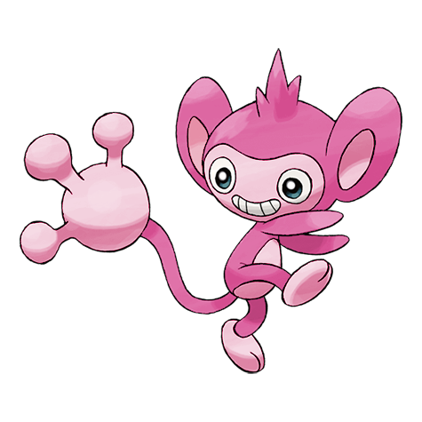

# Aipom (Long Tail Pokémon)

| Official Artwork | Shiny Artwork |
| --- | --- |
|  |  |

It lives high among the treetops. It can use its tail as freely and cleverly as its hands.

---

## Media

### Cries

No cries available.

---

## Pokédex Data

| National № | Type(s) | Height | Weight | Abilities | Local № |
|------------|---------|--------|--------|-----------|---------|
| #190 | {: width='48'} | 0.8 m | 11.5 kg | 1. Run-Away 2. Pickup 3. Skill-Link | #63 |

---

## Base Stats
|   | HP | Attack | Defense | Sp. Atk | Sp. Def | Speed |
|---|----|--------|---------|---------|---------|-------|
| **Base** | 55 | 70 | 55 | 40 | 55 | 85 |
| **Min** | 220 | 130 | 103 | 76 | 103 | 157 |
| **Max** | 314 | 262 | 229 | 196 | 229 | 295 |

The ranges shown above are for a level 100 Pokémon. Maximum values are based on a beneficial nature, 252 EVs, 31 IVs; minimum values are based on a hindering nature, 0 EVs, 0 IVs.

---

## Forms & Evolutions

!!! warning "WARNING"

    Information on evolutions may not be 100% accurate; differences between evolution methods across generations are not accounted for.

### Forms

Aipom has no alternate forms.

### Evolution Line

1. [Aipom](aipom.md/)
    1. Level Up: [Ambipom](ambipom.md/)

---

## Training

| EV Yield | Catch Rate | Base Friendship | Base Exp. | Growth Rate | Held Items |
|----------|------------|-----------------|-----------|-------------|------------|
| 1 Speed | 45 | 70 | 72 | Fast | N/A |

---

## Breeding

| Egg Groups | Egg Cycles | Gender | Dimorphic | Color | Shape |
|------------|------------|--------|-----------|-------|-------|
| 1. Ground | 20 | 50.0% Male 50.0% Female | True | Purple | Upright |

---

## Moves

!!! warning "WARNING"

    Specific move information may be incorrect. However, the general movepool should be accurate; this includes changes made in Renegade Platinum.

### Level Up Moves

| Lv. | Move | Type | Cat. | Power | Acc. | PP |
| --- | --- | --- | --- | --- | --- | --- |
| 1 | Sand Attack | {: width='48'} | {: width='36'} | — | 100 | 15 |
| 1 | Scratch | {: width='48'} | {: width='36'} | 40 | 100 | 35 |
| 1 | Tail Whip | {: width='48'} | {: width='36'} | — | 100 | 30 |
| 5 | Astonish | {: width='48'} | {: width='36'} | 30 | 100 | 15 |
| 8 | Tickle | {: width='48'} | {: width='36'} | — | 100 | 20 |
| 11 | Baton Pass | {: width='48'} | {: width='36'} | — | — | 40 |
| 14 | Pursuit | {: width='48'} | {: width='36'} | 40 | 100 | 20 |
| 17 | Fury Swipes | {: width='48'} | {: width='36'} | 18 | 80 | 15 |
| 20 | Covet | {: width='48'} | {: width='36'} | 60 | 100 | 25 |
| 23 | Swift | {: width='48'} | {: width='36'} | 60 | — | 20 |
| 26 | Screech | {: width='48'} | {: width='36'} | — | 85 | 40 |
| 29 | Agility | {: width='48'} | {: width='36'} | — | — | 30 |
| 32 | Double Hit | {: width='48'} | {: width='36'} | 35 | 90 | 10 |
| 35 | Fake Out | {: width='48'} | {: width='36'} | 40 | 100 | 10 |
| 38 | Fling | {: width='48'} | {: width='36'} | — | 100 | 10 |
| 41 | Bounce | {: width='48'} | {: width='36'} | 85 | 85 | 5 |
| 44 | Nasty Plot | {: width='48'} | {: width='36'} | — | — | 20 |
| 47 | Switcheroo | {: width='48'} | {: width='36'} | — | 100 | 10 |
| 50 | Last Resort | {: width='48'} | {: width='36'} | 140 | 100 | 5 |

### TM Moves

| TM | Move | Type | Cat. | Power | Acc. | PP |
| --- | --- | --- | --- | --- | --- | --- |
| HM01 | Cut | {: width='48'} | {: width='36'} | 60 | 100% | 25 |
| HM04 | Strength | {: width='48'} | {: width='36'} | 100 | 100 | 15 |
| HM06 | Rock Smash | {: width='48'} | {: width='36'} | 60 | 100 | 15 |
| TM01 | Focus Punch | {: width='48'} | {: width='36'} | 150 | 100 | 20 |
| TM03 | Water Pulse | {: width='48'} | {: width='36'} | 60 | 100 | 20 |
| TM06 | Toxic | {: width='48'} | {: width='36'} | — | 90 | 10 |
| TM10 | Hidden Power | {: width='48'} | {: width='36'} | 60 | 100 | 15 |
| TM11 | Sunny Day | {: width='48'} | {: width='36'} | — | — | 5 |
| TM12 | Taunt | {: width='48'} | {: width='36'} | — | 100 | 20 |
| TM17 | Protect | {: width='48'} | {: width='36'} | — | — | 10 |
| TM18 | Rain Dance | {: width='48'} | {: width='36'} | — | — | 5 |
| TM21 | Frustration | {: width='48'} | {: width='36'} | — | 100 | 20 |
| TM22 | Solar Beam | {: width='48'} | {: width='36'} | 120 | 100 | 10 |
| TM23 | Iron Tail | {: width='48'} | {: width='36'} | 100 | 75 | 15 |
| TM24 | Thunderbolt | {: width='48'} | {: width='36'} | 90 | 100 | 15 |
| TM25 | Thunder | {: width='48'} | {: width='36'} | 110 | 70 | 10 |
| TM27 | Return | {: width='48'} | {: width='36'} | — | 100 | 20 |
| TM28 | Dig | {: width='48'} | {: width='36'} | 80 | 100 | 10 |
| TM30 | Shadow Ball | {: width='48'} | {: width='36'} | 80 | 100 | 15 |
| TM31 | Brick Break | {: width='48'} | {: width='36'} | 75 | 100 | 15 |
| TM32 | Double Team | {: width='48'} | {: width='36'} | — | — | 15 |
| TM34 | Shock Wave | {: width='48'} | {: width='36'} | 60 | — | 20 |
| TM40 | Aerial Ace | {: width='48'} | {: width='36'} | 60 | — | 20 |
| TM42 | Facade | {: width='48'} | {: width='36'} | 70 | 100 | 20 |
| TM43 | Secret Power | {: width='48'} | {: width='36'} | 70 | 100 | 20 |
| TM44 | Rest | {: width='48'} | {: width='36'} | — | — | 5 |
| TM45 | Attract | {: width='48'} | {: width='36'} | — | 100 | 15 |
| TM46 | Thief | {: width='48'} | {: width='36'} | 60 | 100 | 25 |
| TM49 | Snatch | {: width='48'} | {: width='36'} | — | — | 10 |
| TM56 | Fling | {: width='48'} | {: width='36'} | — | 100 | 10 |
| TM58 | Endure | {: width='48'} | {: width='36'} | — | — | 10 |
| TM65 | Shadow Claw | {: width='48'} | {: width='36'} | 80 | 100 | 15 |
| TM66 | Payback | {: width='48'} | {: width='36'} | 50 | 100 | 10 |
| TM73 | Thunder Wave | {: width='48'} | {: width='36'} | — | 90 | 20 |
| TM78 | Captivate | {: width='48'} | {: width='36'} | — | 100 | 20 |
| TM82 | Sleep Talk | {: width='48'} | {: width='36'} | — | — | 10 |
| TM83 | Natural Gift | {: width='48'} | {: width='36'} | — | 100 | 15 |
| TM85 | Dream Eater | {: width='48'} | {: width='36'} | 100 | 100 | 15 |
| TM86 | Grass Knot | {: width='48'} | {: width='36'} | — | 100 | 20 |
| TM87 | Swagger | {: width='48'} | {: width='36'} | — | 85 | 15 |
| TM89 | U Turn | {: width='48'} | {: width='36'} | 70 | 100 | 20 |
| TM90 | Substitute | {: width='48'} | {: width='36'} | — | — | 10 |

### Egg Moves

| Move | Type | Cat. | Power | Acc. | PP |
| --- | --- | --- | --- | --- | --- |
| Double Slap | {: width='48'} | {: width='36'} | 15 | 85 | 10 |
| Slam | {: width='48'} | {: width='36'} | 80 | 75 | 20 |
| Counter | {: width='48'} | {: width='36'} | — | 100 | 20 |
| Agility | {: width='48'} | {: width='36'} | — | — | 30 |
| Screech | {: width='48'} | {: width='36'} | — | 85 | 40 |
| Spite | {: width='48'} | {: width='36'} | — | 100 | 10 |
| Pursuit | {: width='48'} | {: width='36'} | 40 | 100 | 20 |
| Beat Up | {: width='48'} | {: width='36'} | — | 100 | 10 |
| Fake Out | {: width='48'} | {: width='36'} | 40 | 100 | 10 |
| Bounce | {: width='48'} | {: width='36'} | 85 | 85 | 5 |
| Covet | {: width='48'} | {: width='36'} | 60 | 100 | 25 |

### Tutor Moves

| Move | Type | Cat. | Power | Acc. | PP |
| --- | --- | --- | --- | --- | --- |
| Fire Punch | {: width='48'} | {: width='36'} | 75 | 100 | 15 |
| Ice Punch | {: width='48'} | {: width='36'} | 75 | 100 | 15 |
| Thunder Punch | {: width='48'} | {: width='36'} | 75 | 100 | 15 |
| Swift | {: width='48'} | {: width='36'} | 60 | — | 20 |
| Snore | {: width='48'} | {: width='36'} | 50 | 100 | 15 |
| Spite | {: width='48'} | {: width='36'} | — | 100 | 10 |
| Mud Slap | {: width='48'} | {: width='36'} | 20 | 100 | 10 |
| Fury Cutter | {: width='48'} | {: width='36'} | 40 | 95 | 20 |
| Uproar | {: width='48'} | {: width='36'} | 90 | 100 | 10 |
| Knock Off | {: width='48'} | {: width='36'} | 65 | 100 | 20 |
| Bounce | {: width='48'} | {: width='36'} | 85 | 85 | 5 |
| Last Resort | {: width='48'} | {: width='36'} | 140 | 100 | 5 |
| Seed Bomb | {: width='48'} | {: width='36'} | 80 | 100 | 15 |
| Gunk Shot | {: width='48'} | {: width='36'} | 120 | 80 | 5 |

