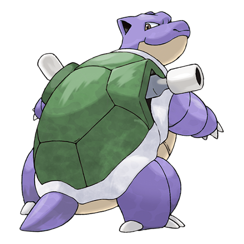

# Blastoise (Shellfish Pokémon)

| Official Artwork | Shiny Artwork |
| --- | --- |
|  |  |

The jets of water it spouts from the rocket cannons on its shell can punch through thick steel.

---

## Media

### Cries

Latest (Gen VI+):

<audio controls>
<source src='../../assets/cries/blastoise/latest.ogg' type='audio/ogg'>
  Your browser does not support the audio element.
</audio>

Legacy:

<audio controls>
<source src='../../assets/cries/blastoise/legacy.ogg' type='audio/ogg'>
  Your browser does not support the audio element.
</audio>

---

## Pokédex Data

| National № | Type(s) | Height | Weight | Abilities | Local № |
|------------|---------|--------|--------|-----------|---------|
| #9 | {: width='48'} | 1.6 m | 85.5 kg | 1. Rain-Dish 2. Torrent | N/A |

---

## Base Stats
|   | HP | Attack | Defense | Sp. Atk | Sp. Def | Speed |
|---|----|--------|---------|---------|---------|-------|
| **Base** | 79 | 83 | 100 | 90 | 105 | 78 |
| **Min** | 268 | 153 | 184 | 166 | 193 | 144 |
| **Max** | 362 | 291 | 328 | 306 | 339 | 280 |

The ranges shown above are for a level 100 Pokémon. Maximum values are based on a beneficial nature, 252 EVs, 31 IVs; minimum values are based on a hindering nature, 0 EVs, 0 IVs.

---

## Forms & Evolutions

!!! warning "WARNING"

    Information on evolutions may not be 100% accurate; differences between evolution methods across generations are not accounted for.

### Forms

Blastoise has no alternate forms.

### Evolution Line

1. [Squirtle](squirtle.md/)
    1. Level Up: [Wartortle](wartortle.md/)
        1. Level Up: [Blastoise](blastoise.md/)

---

## Training

| EV Yield | Catch Rate | Base Friendship | Base Exp. | Growth Rate | Held Items |
|----------|------------|-----------------|-----------|-------------|------------|
| 3 Special Defense | 45 | 50 | 265 | Medium-Slow | N/A |

---

## Breeding

| Egg Groups | Egg Cycles | Gender | Dimorphic | Color | Shape |
|------------|------------|--------|-----------|-------|-------|
| 1. Monster 2. Water1 | 20 | 87.5% Male 12.5% Female | False | Blue | Upright |

---

## Moves

!!! warning "WARNING"

    Specific move information may be incorrect. However, the general movepool should be accurate; this includes changes made in Renegade Platinum.

### Level Up Moves

| Lv. | Move | Type | Cat. | Power | Acc. | PP |
| --- | --- | --- | --- | --- | --- | --- |
| 1 | Dark Pulse | {: width='48'} | {: width='36'} | 80 | 100 | 15 |
| 1 | Dragon Pulse | {: width='48'} | {: width='36'} | 85 | 100 | 10 |
| 1 | Flash Cannon | {: width='48'} | {: width='36'} | 80 | 100 | 10 |
| 1 | Tackle | {: width='48'} | {: width='36'} | 40 | 100 | 35 |
| 1 | Tail Whip | {: width='48'} | {: width='36'} | — | 100 | 30 |
| 5 | Water Gun | {: width='48'} | {: width='36'} | 40 | 100 | 25 |
| 8 | Withdraw | {: width='48'} | {: width='36'} | — | — | 40 |
| 11 | Bubble | {: width='48'} | {: width='36'} | 40 | 100 | 30 |
| 14 | Bite | {: width='48'} | {: width='36'} | 60 | 100 | 25 |
| 16 | Yawn | {: width='48'} | {: width='36'} | — | — | 10 |
| 18 | Rapid Spin | {: width='48'} | {: width='36'} | 50 | 100 | 40 |
| 22 | Water Pulse | {: width='48'} | {: width='36'} | 60 | 100 | 20 |
| 26 | Protect | {: width='48'} | {: width='36'} | — | — | 10 |
| 30 | Muddy Water | {: width='48'} | {: width='36'} | 90 | 85 | 10 |
| 34 | Iron Defense | {: width='48'} | {: width='36'} | — | — | 15 |
| 36 | Aura Sphere | {: width='48'} | {: width='36'} | 80 | — | 20 |
| 39 | Skull Bash | {: width='48'} | {: width='36'} | 130 | 100 | 10 |
| 44 | Aqua Tail | {: width='48'} | {: width='36'} | 90 | 90 | 10 |
| 49 | Rain Dance | {: width='48'} | {: width='36'} | — | — | 5 |
| 54 | Hydro Pump | {: width='48'} | {: width='36'} | 110 | 80 | 5 |
| 59 | Water Spout | {: width='48'} | {: width='36'} | 150 | 100 | 5 |

### TM Moves

| TM | Move | Type | Cat. | Power | Acc. | PP |
| --- | --- | --- | --- | --- | --- | --- |
| HM03 | Surf | {: width='48'} | {: width='36'} | 90 | 100 | 15 |
| HM04 | Strength | {: width='48'} | {: width='36'} | 100 | 100 | 15 |
| HM06 | Rock Smash | {: width='48'} | {: width='36'} | 60 | 100 | 15 |
| HM07 | Waterfall | {: width='48'} | {: width='36'} | 80 | 100 | 15 |
| HM08 | Rock Climb | {: width='48'} | {: width='36'} | 80 | 95% | 10 |
| TM01 | Focus Punch | {: width='48'} | {: width='36'} | 150 | 100 | 20 |
| TM03 | Water Pulse | {: width='48'} | {: width='36'} | 60 | 100 | 20 |
| TM05 | Roar | {: width='48'} | {: width='36'} | — | — | 20 |
| TM06 | Toxic | {: width='48'} | {: width='36'} | — | 90 | 10 |
| TM07 | Hail | {: width='48'} | {: width='36'} | — | — | 10 |
| TM10 | Hidden Power | {: width='48'} | {: width='36'} | 60 | 100 | 15 |
| TM13 | Ice Beam | {: width='48'} | {: width='36'} | 90 | 100 | 10 |
| TM14 | Blizzard | {: width='48'} | {: width='36'} | 110 | 70 | 5 |
| TM15 | Hyper Beam | {: width='48'} | {: width='36'} | 150 | 90 | 5 |
| TM17 | Protect | {: width='48'} | {: width='36'} | — | — | 10 |
| TM18 | Rain Dance | {: width='48'} | {: width='36'} | — | — | 5 |
| TM21 | Frustration | {: width='48'} | {: width='36'} | — | 100 | 20 |
| TM23 | Iron Tail | {: width='48'} | {: width='36'} | 100 | 75 | 15 |
| TM26 | Earthquake | {: width='48'} | {: width='36'} | 100 | 100 | 10 |
| TM27 | Return | {: width='48'} | {: width='36'} | — | 100 | 20 |
| TM28 | Dig | {: width='48'} | {: width='36'} | 80 | 100 | 10 |
| TM31 | Brick Break | {: width='48'} | {: width='36'} | 75 | 100 | 15 |
| TM32 | Double Team | {: width='48'} | {: width='36'} | — | — | 15 |
| TM39 | Rock Tomb | {: width='48'} | {: width='36'} | 60 | 95 | 15 |
| TM42 | Facade | {: width='48'} | {: width='36'} | 70 | 100 | 20 |
| TM43 | Secret Power | {: width='48'} | {: width='36'} | 70 | 100 | 20 |
| TM44 | Rest | {: width='48'} | {: width='36'} | — | — | 5 |
| TM45 | Attract | {: width='48'} | {: width='36'} | — | 100 | 15 |
| TM52 | Focus Blast | {: width='48'} | {: width='36'} | 120 | 70 | 5 |
| TM55 | Brine | {: width='48'} | {: width='36'} | 65 | 100 | 10 |
| TM56 | Fling | {: width='48'} | {: width='36'} | — | 100 | 10 |
| TM58 | Endure | {: width='48'} | {: width='36'} | — | — | 10 |
| TM59 | Dragon Pulse | {: width='48'} | {: width='36'} | 85 | 100 | 10 |
| TM68 | Giga Impact | {: width='48'} | {: width='36'} | 150 | 90 | 5 |
| TM72 | Avalanche | {: width='48'} | {: width='36'} | 60 | 100 | 10 |
| TM74 | Gyro Ball | {: width='48'} | {: width='36'} | — | 100 | 5 |
| TM78 | Captivate | {: width='48'} | {: width='36'} | — | 100 | 20 |
| TM79 | Dark Pulse | {: width='48'} | {: width='36'} | 80 | 100 | 15 |
| TM80 | Rock Slide | {: width='48'} | {: width='36'} | 75 | 90 | 10 |
| TM82 | Sleep Talk | {: width='48'} | {: width='36'} | — | — | 10 |
| TM83 | Natural Gift | {: width='48'} | {: width='36'} | — | 100 | 15 |
| TM87 | Swagger | {: width='48'} | {: width='36'} | — | 85 | 15 |
| TM90 | Substitute | {: width='48'} | {: width='36'} | — | — | 10 |
| TM91 | Flash Cannon | {: width='48'} | {: width='36'} | 80 | 100 | 10 |

### Egg Moves

Blastoise cannot learn any moves by breeding.
### Tutor Moves

| Move | Type | Cat. | Power | Acc. | PP |
| --- | --- | --- | --- | --- | --- |
| Ice Punch | {: width='48'} | {: width='36'} | 75 | 100 | 15 |
| Snore | {: width='48'} | {: width='36'} | 50 | 100 | 15 |
| Mud Slap | {: width='48'} | {: width='36'} | 20 | 100 | 10 |
| Icy Wind | {: width='48'} | {: width='36'} | 55 | 95 | 15 |
| Outrage | {: width='48'} | {: width='36'} | 120 | 100 | 10 |
| Rollout | {: width='48'} | {: width='36'} | 30 | 90 | 20 |
| Dive | {: width='48'} | {: width='36'} | 80 | 100 | 10 |
| Hydro Cannon | {: width='48'} | {: width='36'} | 150 | 90 | 5 |
| Signal Beam | {: width='48'} | {: width='36'} | 75 | 100 | 15 |
| Iron Defense | {: width='48'} | {: width='36'} | — | — | 15 |
| Aqua Tail | {: width='48'} | {: width='36'} | 90 | 90 | 10 |
| Zen Headbutt | {: width='48'} | {: width='36'} | 80 | 90 | 15 |

