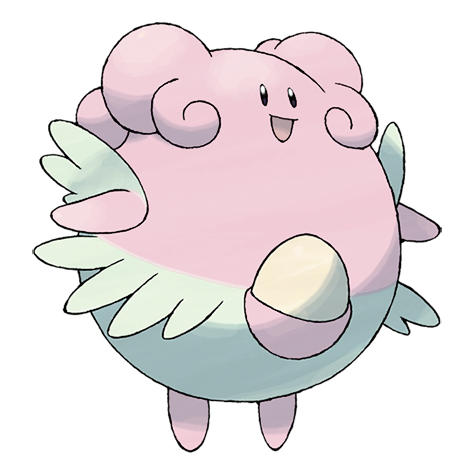

# Blissey (Happiness Pokémon)

| Official Artwork | Shiny Artwork |
| --- | --- |
|  |  |

The eggs it lays are filled with happiness. Eating even one bite will bring a smile to anyone.

---

## Media

### Cries

No cries available.

---

## Pokédex Data

| National № | Type(s) | Height | Weight | Abilities | Local № |
|------------|---------|--------|--------|-----------|---------|
| #242 | {: width='48'} | 1.5 m | 46.8 kg | 1. Serene-Grace 2. Natural-Cure | #98 |

---

## Base Stats
|   | HP | Attack | Defense | Sp. Atk | Sp. Def | Speed |
|---|----|--------|---------|---------|---------|-------|
| **Base** | 255 | 10 | 10 | 75 | 135 | 55 |
| **Min** | 620 | 22 | 22 | 139 | 247 | 103 |
| **Max** | 714 | 130 | 130 | 273 | 405 | 229 |

The ranges shown above are for a level 100 Pokémon. Maximum values are based on a beneficial nature, 252 EVs, 31 IVs; minimum values are based on a hindering nature, 0 EVs, 0 IVs.

---

## Forms & Evolutions

!!! warning "WARNING"

    Information on evolutions may not be 100% accurate; differences between evolution methods across generations are not accounted for.

### Forms

Blissey has no alternate forms.

### Evolution Line

1. [Happiny](happiny.md/)
    1. Level Up: [Chansey](chansey.md/)
        1. Level Up: [Blissey](blissey.md/)

---

## Training

| EV Yield | Catch Rate | Base Friendship | Base Exp. | Growth Rate | Held Items |
|----------|------------|-----------------|-----------|-------------|------------|
| 3 Hp | 30 | 140 | 635 | Fast | oval-stone (50%) lucky-egg (5%) |

---

## Breeding

| Egg Groups | Egg Cycles | Gender | Dimorphic | Color | Shape |
|------------|------------|--------|-----------|-------|-------|
| 1. Fairy | 40 | 0.0% Male 100.0% Female | False | Pink | Humanoid |

---

## Moves

!!! warning "WARNING"

    Specific move information may be incorrect. However, the general movepool should be accurate; this includes changes made in Renegade Platinum.

### Level Up Moves

| Lv. | Move | Type | Cat. | Power | Acc. | PP |
| --- | --- | --- | --- | --- | --- | --- |
| 1 | Aromatherapy | {: width='48'} | {: width='36'} | — | — | 5 |
| 1 | Counter | {: width='48'} | {: width='36'} | — | 100 | 20 |
| 1 | Defense Curl | {: width='48'} | {: width='36'} | — | — | 40 |
| 1 | Double Edge | {: width='48'} | {: width='36'} | 120 | 100 | 15 |
| 1 | Growl | {: width='48'} | {: width='36'} | — | 100 | 40 |
| 1 | Pound | {: width='48'} | {: width='36'} | 40 | 100 | 35 |
| 4 | Tail Whip | {: width='48'} | {: width='36'} | — | 100 | 30 |
| 7 | Refresh | {: width='48'} | {: width='36'} | — | — | 20 |
| 10 | Double Slap | {: width='48'} | {: width='36'} | 15 | 85 | 10 |
| 13 | Soft Boiled | {: width='48'} | {: width='36'} | — | — | 5 |
| 16 | Egg Bomb | {: width='48'} | {: width='36'} | 100 | 75 | 10 |
| 19 | Minimize | {: width='48'} | {: width='36'} | — | — | 10 |
| 22 | Hyper Voice | {: width='48'} | {: width='36'} | 90 | 100 | 10 |
| 25 | Sing | {: width='48'} | {: width='36'} | — | 55 | 15 |
| 28 | Fling | {: width='48'} | {: width='36'} | — | 100 | 10 |
| 31 | Seismic Toss | {: width='48'} | {: width='36'} | — | 100 | 20 |
| 34 | Take Down | {: width='48'} | {: width='36'} | 90 | 85 | 20 |
| 37 | Light Screen | {: width='48'} | {: width='36'} | — | — | 30 |
| 40 | Healing Wish | {: width='48'} | {: width='36'} | — | — | 10 |
| 43 | Counter | {: width='48'} | {: width='36'} | — | 100 | 20 |
| 46 | Double Edge | {: width='48'} | {: width='36'} | 120 | 100 | 15 |

### TM Moves

| TM | Move | Type | Cat. | Power | Acc. | PP |
| --- | --- | --- | --- | --- | --- | --- |
| HM04 | Strength | {: width='48'} | {: width='36'} | 100 | 100 | 15 |
| HM06 | Rock Smash | {: width='48'} | {: width='36'} | 60 | 100 | 15 |
| HM08 | Rock Climb | {: width='48'} | {: width='36'} | 80 | 95% | 10 |
| TM01 | Focus Punch | {: width='48'} | {: width='36'} | 150 | 100 | 20 |
| TM03 | Water Pulse | {: width='48'} | {: width='36'} | 60 | 100 | 20 |
| TM04 | Calm Mind | {: width='48'} | {: width='36'} | — | — | 20 |
| TM06 | Toxic | {: width='48'} | {: width='36'} | — | 90 | 10 |
| TM07 | Hail | {: width='48'} | {: width='36'} | — | — | 10 |
| TM10 | Hidden Power | {: width='48'} | {: width='36'} | 60 | 100 | 15 |
| TM11 | Sunny Day | {: width='48'} | {: width='36'} | — | — | 5 |
| TM13 | Ice Beam | {: width='48'} | {: width='36'} | 90 | 100 | 10 |
| TM14 | Blizzard | {: width='48'} | {: width='36'} | 110 | 70 | 5 |
| TM15 | Hyper Beam | {: width='48'} | {: width='36'} | 150 | 90 | 5 |
| TM16 | Light Screen | {: width='48'} | {: width='36'} | — | — | 30 |
| TM17 | Protect | {: width='48'} | {: width='36'} | — | — | 10 |
| TM18 | Rain Dance | {: width='48'} | {: width='36'} | — | — | 5 |
| TM20 | Safeguard | {: width='48'} | {: width='36'} | — | — | 25 |
| TM21 | Frustration | {: width='48'} | {: width='36'} | — | 100 | 20 |
| TM22 | Solar Beam | {: width='48'} | {: width='36'} | 120 | 100 | 10 |
| TM23 | Iron Tail | {: width='48'} | {: width='36'} | 100 | 75 | 15 |
| TM24 | Thunderbolt | {: width='48'} | {: width='36'} | 90 | 100 | 15 |
| TM25 | Thunder | {: width='48'} | {: width='36'} | 110 | 70 | 10 |
| TM26 | Earthquake | {: width='48'} | {: width='36'} | 100 | 100 | 10 |
| TM27 | Return | {: width='48'} | {: width='36'} | — | 100 | 20 |
| TM29 | Psychic | {: width='48'} | {: width='36'} | 90 | 100 | 10 |
| TM30 | Shadow Ball | {: width='48'} | {: width='36'} | 80 | 100 | 15 |
| TM31 | Brick Break | {: width='48'} | {: width='36'} | 75 | 100 | 15 |
| TM32 | Double Team | {: width='48'} | {: width='36'} | — | — | 15 |
| TM34 | Shock Wave | {: width='48'} | {: width='36'} | 60 | — | 20 |
| TM35 | Flamethrower | {: width='48'} | {: width='36'} | 90 | 100 | 15 |
| TM37 | Sandstorm | {: width='48'} | {: width='36'} | — | — | 10 |
| TM38 | Fire Blast | {: width='48'} | {: width='36'} | 110 | 85 | 5 |
| TM39 | Rock Tomb | {: width='48'} | {: width='36'} | 60 | 95 | 15 |
| TM42 | Facade | {: width='48'} | {: width='36'} | 70 | 100 | 20 |
| TM43 | Secret Power | {: width='48'} | {: width='36'} | 70 | 100 | 20 |
| TM44 | Rest | {: width='48'} | {: width='36'} | — | — | 5 |
| TM45 | Attract | {: width='48'} | {: width='36'} | — | 100 | 15 |
| TM48 | Skill Swap | {: width='48'} | {: width='36'} | — | — | 10 |
| TM49 | Snatch | {: width='48'} | {: width='36'} | — | — | 10 |
| TM52 | Focus Blast | {: width='48'} | {: width='36'} | 120 | 70 | 5 |
| TM56 | Fling | {: width='48'} | {: width='36'} | — | 100 | 10 |
| TM57 | Charge Beam | {: width='48'} | {: width='36'} | 50 | 90 | 10 |
| TM58 | Endure | {: width='48'} | {: width='36'} | — | — | 10 |
| TM60 | Drain Punch | {: width='48'} | {: width='36'} | 75 | 100 | 10 |
| TM67 | Recycle | {: width='48'} | {: width='36'} | — | — | 10 |
| TM68 | Giga Impact | {: width='48'} | {: width='36'} | 150 | 90 | 5 |
| TM70 | Flash | {: width='48'} | {: width='36'} | — | 100 | 20 |
| TM72 | Avalanche | {: width='48'} | {: width='36'} | 60 | 100 | 10 |
| TM73 | Thunder Wave | {: width='48'} | {: width='36'} | — | 90 | 20 |
| TM76 | Stealth Rock | {: width='48'} | {: width='36'} | — | — | 20 |
| TM77 | Psych Up | {: width='48'} | {: width='36'} | — | — | 10 |
| TM78 | Captivate | {: width='48'} | {: width='36'} | — | 100 | 20 |
| TM80 | Rock Slide | {: width='48'} | {: width='36'} | 75 | 90 | 10 |
| TM82 | Sleep Talk | {: width='48'} | {: width='36'} | — | — | 10 |
| TM83 | Natural Gift | {: width='48'} | {: width='36'} | — | 100 | 15 |
| TM85 | Dream Eater | {: width='48'} | {: width='36'} | 100 | 100 | 15 |
| TM86 | Grass Knot | {: width='48'} | {: width='36'} | — | 100 | 20 |
| TM87 | Swagger | {: width='48'} | {: width='36'} | — | 85 | 15 |
| TM90 | Substitute | {: width='48'} | {: width='36'} | — | — | 10 |

### Egg Moves

Blissey cannot learn any moves by breeding.
### Tutor Moves

| Move | Type | Cat. | Power | Acc. | PP |
| --- | --- | --- | --- | --- | --- |
| Fire Punch | {: width='48'} | {: width='36'} | 75 | 100 | 15 |
| Ice Punch | {: width='48'} | {: width='36'} | 75 | 100 | 15 |
| Thunder Punch | {: width='48'} | {: width='36'} | 75 | 100 | 15 |
| Snore | {: width='48'} | {: width='36'} | 50 | 100 | 15 |
| Mud Slap | {: width='48'} | {: width='36'} | 20 | 100 | 10 |
| Icy Wind | {: width='48'} | {: width='36'} | 55 | 95 | 15 |
| Rollout | {: width='48'} | {: width='36'} | 30 | 90 | 20 |
| Helping Hand | {: width='48'} | {: width='36'} | — | — | 20 |
| Endeavor | {: width='48'} | {: width='36'} | — | 100 | 5 |
| Last Resort | {: width='48'} | {: width='36'} | 140 | 100 | 5 |
| Zen Headbutt | {: width='48'} | {: width='36'} | 80 | 90 | 15 |

