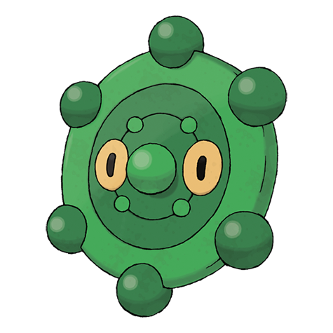

# Bronzor (Bronze Pokémon)

| Official Artwork | Shiny Artwork |
| --- | --- |
|  |  |

There are researchers who believe this Pokémon reflected like a mirror in the distant past.

---

## Media

### Cries

No cries available.

---

## Pokédex Data

| National № | Type(s) | Height | Weight | Abilities | Local № |
|------------|---------|--------|--------|-----------|---------|
| #436 | {: width='48'} {: width='48'} | 0.5 m | 60.5 kg | 1. Levitate 2. Heatproof 3. Heavy-Metal | #88 |

---

## Base Stats
|   | HP | Attack | Defense | Sp. Atk | Sp. Def | Speed |
|---|----|--------|---------|---------|---------|-------|
| **Base** | 57 | 24 | 86 | 24 | 86 | 23 |
| **Min** | 224 | 47 | 159 | 47 | 159 | 45 |
| **Max** | 318 | 161 | 298 | 161 | 298 | 159 |

The ranges shown above are for a level 100 Pokémon. Maximum values are based on a beneficial nature, 252 EVs, 31 IVs; minimum values are based on a hindering nature, 0 EVs, 0 IVs.

---

## Forms & Evolutions

!!! warning "WARNING"

    Information on evolutions may not be 100% accurate; differences between evolution methods across generations are not accounted for.

### Forms

Bronzor has no alternate forms.

### Evolution Line

1. [Bronzor](bronzor.md/)
    1. Level Up: [Bronzong](bronzong.md/)

---

## Training

| EV Yield | Catch Rate | Base Friendship | Base Exp. | Growth Rate | Held Items |
|----------|------------|-----------------|-----------|-------------|------------|
| 1 Defense | 255 | 50 | 60 | Medium | metal-coat (5%) |

---

## Breeding

| Egg Groups | Egg Cycles | Gender | Dimorphic | Color | Shape |
|------------|------------|--------|-----------|-------|-------|
| 1. Mineral | 20 | Genderless | False | Green | Ball |

---

## Moves

!!! warning "WARNING"

    Specific move information may be incorrect. However, the general movepool should be accurate; this includes changes made in Renegade Platinum.

### Level Up Moves

| Lv. | Move | Type | Cat. | Power | Acc. | PP |
| --- | --- | --- | --- | --- | --- | --- |
| 1 | Confusion | {: width='48'} | {: width='36'} | 50 | 100 | 25 |
| 1 | Tackle | {: width='48'} | {: width='36'} | 40 | 100 | 35 |
| 5 | Imprison | {: width='48'} | {: width='36'} | — | — | 10 |
| 9 | Confuse Ray | {: width='48'} | {: width='36'} | — | 100 | 10 |
| 13 | Psywave | {: width='48'} | {: width='36'} | — | 100 | 15 |
| 15 | Hypnosis | {: width='48'} | {: width='36'} | — | 60 | 20 |
| 17 | Extrasensory | {: width='48'} | {: width='36'} | 80 | 100 | 20 |
| 19 | Feint Attack | {: width='48'} | {: width='36'} | 60 | — | 20 |
| 23 | Gyro Ball | {: width='48'} | {: width='36'} | — | 100 | 5 |
| 25 | Iron Defense | {: width='48'} | {: width='36'} | — | — | 15 |
| 27 | Zen Headbutt | {: width='48'} | {: width='36'} | 80 | 90 | 15 |
| 30 | Safeguard | {: width='48'} | {: width='36'} | — | — | 25 |
| 33 | Flash Cannon | {: width='48'} | {: width='36'} | 80 | 100 | 10 |
| 36 | Future Sight | {: width='48'} | {: width='36'} | 120 | 100 | 10 |
| 39 | Metal Sound | {: width='48'} | {: width='36'} | — | 85 | 40 |
| 42 | Payback | {: width='48'} | {: width='36'} | 50 | 100 | 10 |
| 45 | Heal Block | {: width='48'} | {: width='36'} | — | 100 | 15 |

### TM Moves

| TM | Move | Type | Cat. | Power | Acc. | PP |
| --- | --- | --- | --- | --- | --- | --- |
| TM04 | Calm Mind | {: width='48'} | {: width='36'} | — | — | 20 |
| TM06 | Toxic | {: width='48'} | {: width='36'} | — | 90 | 10 |
| TM10 | Hidden Power | {: width='48'} | {: width='36'} | 60 | 100 | 15 |
| TM11 | Sunny Day | {: width='48'} | {: width='36'} | — | — | 5 |
| TM16 | Light Screen | {: width='48'} | {: width='36'} | — | — | 30 |
| TM17 | Protect | {: width='48'} | {: width='36'} | — | — | 10 |
| TM18 | Rain Dance | {: width='48'} | {: width='36'} | — | — | 5 |
| TM20 | Safeguard | {: width='48'} | {: width='36'} | — | — | 25 |
| TM21 | Frustration | {: width='48'} | {: width='36'} | — | 100 | 20 |
| TM22 | Solar Beam | {: width='48'} | {: width='36'} | 120 | 100 | 10 |
| TM26 | Earthquake | {: width='48'} | {: width='36'} | 100 | 100 | 10 |
| TM27 | Return | {: width='48'} | {: width='36'} | — | 100 | 20 |
| TM29 | Psychic | {: width='48'} | {: width='36'} | 90 | 100 | 10 |
| TM30 | Shadow Ball | {: width='48'} | {: width='36'} | 80 | 100 | 15 |
| TM32 | Double Team | {: width='48'} | {: width='36'} | — | — | 15 |
| TM33 | Reflect | {: width='48'} | {: width='36'} | — | — | 20 |
| TM37 | Sandstorm | {: width='48'} | {: width='36'} | — | — | 10 |
| TM39 | Rock Tomb | {: width='48'} | {: width='36'} | 60 | 95 | 15 |
| TM42 | Facade | {: width='48'} | {: width='36'} | 70 | 100 | 20 |
| TM43 | Secret Power | {: width='48'} | {: width='36'} | 70 | 100 | 20 |
| TM44 | Rest | {: width='48'} | {: width='36'} | — | — | 5 |
| TM48 | Skill Swap | {: width='48'} | {: width='36'} | — | — | 10 |
| TM57 | Charge Beam | {: width='48'} | {: width='36'} | 50 | 90 | 10 |
| TM58 | Endure | {: width='48'} | {: width='36'} | — | — | 10 |
| TM66 | Payback | {: width='48'} | {: width='36'} | 50 | 100 | 10 |
| TM67 | Recycle | {: width='48'} | {: width='36'} | — | — | 10 |
| TM69 | Rock Polish | {: width='48'} | {: width='36'} | — | — | 20 |
| TM70 | Flash | {: width='48'} | {: width='36'} | — | 100 | 20 |
| TM74 | Gyro Ball | {: width='48'} | {: width='36'} | — | 100 | 5 |
| TM76 | Stealth Rock | {: width='48'} | {: width='36'} | — | — | 20 |
| TM77 | Psych Up | {: width='48'} | {: width='36'} | — | — | 10 |
| TM80 | Rock Slide | {: width='48'} | {: width='36'} | 75 | 90 | 10 |
| TM82 | Sleep Talk | {: width='48'} | {: width='36'} | — | — | 10 |
| TM83 | Natural Gift | {: width='48'} | {: width='36'} | — | 100 | 15 |
| TM85 | Dream Eater | {: width='48'} | {: width='36'} | 100 | 100 | 15 |
| TM86 | Grass Knot | {: width='48'} | {: width='36'} | — | 100 | 20 |
| TM87 | Swagger | {: width='48'} | {: width='36'} | — | 85 | 15 |
| TM90 | Substitute | {: width='48'} | {: width='36'} | — | — | 10 |
| TM91 | Flash Cannon | {: width='48'} | {: width='36'} | 80 | 100 | 10 |
| TM92 | Trick Room | {: width='48'} | {: width='36'} | — | — | 5 |

### Egg Moves

Bronzor cannot learn any moves by breeding.
### Tutor Moves

| Move | Type | Cat. | Power | Acc. | PP |
| --- | --- | --- | --- | --- | --- |
| Snore | {: width='48'} | {: width='36'} | 50 | 100 | 15 |
| Rollout | {: width='48'} | {: width='36'} | 30 | 90 | 20 |
| Ancient Power | {: width='48'} | {: width='36'} | 60 | 100 | 5 |
| Trick | {: width='48'} | {: width='36'} | — | 100 | 10 |
| Signal Beam | {: width='48'} | {: width='36'} | 75 | 100 | 15 |

