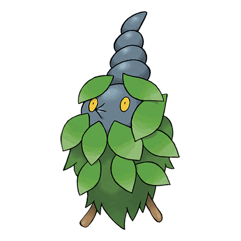

# Burmy (Bagworm Pokémon)

| Official Artwork | Shiny Artwork |
| --- | --- |
|  |  |

Even if it is born where there are no cocooning materials, it somehow always ends up with a cloak.

---

## Media

### Cries

No cries available.

---

## Pokédex Data

| National № | Type(s) | Height | Weight | Abilities | Local № |
|------------|---------|--------|--------|-----------|---------|
| #412 | {: width='48'} | 0.2 m | 3.4 kg | 1. Shed-Skin 2. Shed-Skin | #45 |

---

## Base Stats
|   | HP | Attack | Defense | Sp. Atk | Sp. Def | Speed |
|---|----|--------|---------|---------|---------|-------|
| **Base** | 40 | 20 | 45 | 45 | 45 | 30 |
| **Min** | 190 | 40 | 85 | 85 | 85 | 58 |
| **Max** | 284 | 152 | 207 | 207 | 207 | 174 |

The ranges shown above are for a level 100 Pokémon. Maximum values are based on a beneficial nature, 252 EVs, 31 IVs; minimum values are based on a hindering nature, 0 EVs, 0 IVs.

---

## Forms & Evolutions

!!! warning "WARNING"

    Information on evolutions may not be 100% accurate; differences between evolution methods across generations are not accounted for.

### Forms

Burmy has no alternate forms.

### Evolution Line

1. [Burmy](burmy.md/)
    1. Level Up: [Wormadam Plant](wormadam-plant.md/)

    1. Level Up: [Wormadam Sandy](wormadam-sandy.md/)

    1. Level Up: [Wormadam Trash](wormadam-trash.md/)

    2. Level Up: [Mothim](mothim.md/)

---

## Training

| EV Yield | Catch Rate | Base Friendship | Base Exp. | Growth Rate | Held Items |
|----------|------------|-----------------|-----------|-------------|------------|
| 1 Special Defense | 120 | 70 | 45 | Medium | N/A |

---

## Breeding

| Egg Groups | Egg Cycles | Gender | Dimorphic | Color | Shape |
|------------|------------|--------|-----------|-------|-------|
| 1. Bug | 15 | 50.0% Male 50.0% Female | False | Green | Blob |

---

## Moves

!!! warning "WARNING"

    Specific move information may be incorrect. However, the general movepool should be accurate; this includes changes made in Renegade Platinum.

### Level Up Moves

| Lv. | Move | Type | Cat. | Power | Acc. | PP |
| --- | --- | --- | --- | --- | --- | --- |
| 1 | Bug Bite | {: width='48'} | {: width='36'} | 60 | 100 | 20 |
| 1 | Hidden Power | {: width='48'} | {: width='36'} | 60 | 100 | 15 |
| 1 | Protect | {: width='48'} | {: width='36'} | — | — | 10 |
| 1 | Tackle | {: width='48'} | {: width='36'} | 40 | 100 | 35 |

### TM Moves

Burmy cannot learn any TM moves.
### Egg Moves

Burmy cannot learn any moves by breeding.
### Tutor Moves

| Move | Type | Cat. | Power | Acc. | PP |
| --- | --- | --- | --- | --- | --- |
| Snore | {: width='48'} | {: width='36'} | 50 | 100 | 15 |

