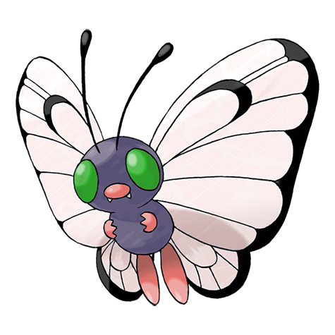

# Butterfree (Butterfly Pokémon)

| Official Artwork | Shiny Artwork |
| --- | --- |
|  |  |

It loves the honey of flowers and can locate flower patches that have even tiny amounts of pollen.

---

## Media

### Cries

Latest (Gen VI+):

<audio controls>
<source src='../../assets/cries/butterfree/latest.ogg' type='audio/ogg'>
  Your browser does not support the audio element.
</audio>

Legacy:

<audio controls>
<source src='../../assets/cries/butterfree/legacy.ogg' type='audio/ogg'>
  Your browser does not support the audio element.
</audio>

---

## Pokédex Data

| National № | Type(s) | Height | Weight | Abilities | Local № |
|------------|---------|--------|--------|-----------|---------|
| #12 | {: width='48'} {: width='48'} | 1.1 m | 32.0 kg | 1. Tinted-Lens 2. Compound-Eyes | N/A |

---

## Base Stats
|   | HP | Attack | Defense | Sp. Atk | Sp. Def | Speed |
|---|----|--------|---------|---------|---------|-------|
| **Base** | 60 | 45 | 45 | 110 | 100 | 90 |
| **Min** | 230 | 85 | 85 | 202 | 184 | 166 |
| **Max** | 324 | 207 | 207 | 350 | 328 | 306 |

The ranges shown above are for a level 100 Pokémon. Maximum values are based on a beneficial nature, 252 EVs, 31 IVs; minimum values are based on a hindering nature, 0 EVs, 0 IVs.

---

## Forms & Evolutions

!!! warning "WARNING"

    Information on evolutions may not be 100% accurate; differences between evolution methods across generations are not accounted for.

### Forms

Butterfree has no alternate forms.

### Evolution Line

1. [Caterpie](caterpie.md/)
    1. Level Up: [Metapod](metapod.md/)
        1. Level Up: [Butterfree](butterfree.md/)

---

## Training

| EV Yield | Catch Rate | Base Friendship | Base Exp. | Growth Rate | Held Items |
|----------|------------|-----------------|-----------|-------------|------------|
| 2 Special Attack 1 Special Defense | 45 | 50 | 198 | Medium | silver-powder (5%) |

---

## Breeding

| Egg Groups | Egg Cycles | Gender | Dimorphic | Color | Shape |
|------------|------------|--------|-----------|-------|-------|
| 1. Bug | 15 | 50.0% Male 50.0% Female | True | White | Bug-Wings |

---

## Moves

!!! warning "WARNING"

    Specific move information may be incorrect. However, the general movepool should be accurate; this includes changes made in Renegade Platinum.

### Level Up Moves

| Lv. | Move | Type | Cat. | Power | Acc. | PP |
| --- | --- | --- | --- | --- | --- | --- |
| 1 | Confusion | {: width='48'} | {: width='36'} | 50 | 100 | 25 |
| 10 | Gust | {: width='48'} | {: width='36'} | 40 | 100 | 35 |
| 11 | Confusion | {: width='48'} | {: width='36'} | 50 | 100 | 25 |
| 13 | Poison Powder | {: width='48'} | {: width='36'} | — | 75 | 35 |
| 13 | Sleep Powder | {: width='48'} | {: width='36'} | — | 75 | 15 |
| 13 | Stun Spore | {: width='48'} | {: width='36'} | — | 75 | 30 |
| 15 | Silver Wind | {: width='48'} | {: width='36'} | 60 | 100 | 5 |
| 17 | Air Cutter | {: width='48'} | {: width='36'} | 60 | 95 | 25 |
| 19 | Psybeam | {: width='48'} | {: width='36'} | 65 | 100 | 20 |
| 21 | Supersonic | {: width='48'} | {: width='36'} | — | 55 | 20 |
| 23 | Air Slash | {: width='48'} | {: width='36'} | 75 | 95 | 15 |
| 25 | Safeguard | {: width='48'} | {: width='36'} | — | — | 25 |
| 28 | Bug Buzz | {: width='48'} | {: width='36'} | 90 | 100 | 10 |
| 31 | Captivate | {: width='48'} | {: width='36'} | — | 100 | 20 |
| 34 | Psychic | {: width='48'} | {: width='36'} | 90 | 100 | 10 |
| 37 | Whirlwind | {: width='48'} | {: width='36'} | — | — | 20 |
| 40 | Tailwind | {: width='48'} | {: width='36'} | — | — | 15 |
| 43 | Teleport | {: width='48'} | {: width='36'} | — | — | 20 |
| 45 | Hurricane | {: width='48'} | {: width='36'} | 110 | 70 | 10 |

### TM Moves

| TM | Move | Type | Cat. | Power | Acc. | PP |
| --- | --- | --- | --- | --- | --- | --- |
| TBD | Bug Buzz | {: width='48'} | {: width='36'} | 90 | 100 | 10 |
| TBD | Hurricane | {: width='48'} | {: width='36'} | 110 | 70 | 10 |
| HM02 | Fly | {: width='48'} | {: width='36'} | 100 | 100% | 15 |
| HM05 | Defog | {: width='48'} | {: width='36'} | — | — | 15 |
| TM06 | Toxic | {: width='48'} | {: width='36'} | — | 90 | 10 |
| TM10 | Hidden Power | {: width='48'} | {: width='36'} | 60 | 100 | 15 |
| TM11 | Sunny Day | {: width='48'} | {: width='36'} | — | — | 5 |
| TM15 | Hyper Beam | {: width='48'} | {: width='36'} | 150 | 90 | 5 |
| TM17 | Protect | {: width='48'} | {: width='36'} | — | — | 10 |
| TM18 | Rain Dance | {: width='48'} | {: width='36'} | — | — | 5 |
| TM19 | Giga Drain | {: width='48'} | {: width='36'} | 75 | 100 | 10 |
| TM20 | Safeguard | {: width='48'} | {: width='36'} | — | — | 25 |
| TM21 | Frustration | {: width='48'} | {: width='36'} | — | 100 | 20 |
| TM22 | Solar Beam | {: width='48'} | {: width='36'} | 120 | 100 | 10 |
| TM27 | Return | {: width='48'} | {: width='36'} | — | 100 | 20 |
| TM29 | Psychic | {: width='48'} | {: width='36'} | 90 | 100 | 10 |
| TM30 | Shadow Ball | {: width='48'} | {: width='36'} | 80 | 100 | 15 |
| TM32 | Double Team | {: width='48'} | {: width='36'} | — | — | 15 |
| TM40 | Aerial Ace | {: width='48'} | {: width='36'} | 60 | — | 20 |
| TM42 | Facade | {: width='48'} | {: width='36'} | 70 | 100 | 20 |
| TM43 | Secret Power | {: width='48'} | {: width='36'} | 70 | 100 | 20 |
| TM44 | Rest | {: width='48'} | {: width='36'} | — | — | 5 |
| TM45 | Attract | {: width='48'} | {: width='36'} | — | 100 | 15 |
| TM46 | Thief | {: width='48'} | {: width='36'} | 60 | 100 | 25 |
| TM48 | Skill Swap | {: width='48'} | {: width='36'} | — | — | 10 |
| TM51 | Roost | {: width='48'} | {: width='36'} | — | — | 5 |
| TM53 | Energy Ball | {: width='48'} | {: width='36'} | 90 | 100 | 10 |
| TM58 | Endure | {: width='48'} | {: width='36'} | — | — | 10 |
| TM62 | Silver Wind | {: width='48'} | {: width='36'} | 60 | 100 | 5 |
| TM68 | Giga Impact | {: width='48'} | {: width='36'} | 150 | 90 | 5 |
| TM70 | Flash | {: width='48'} | {: width='36'} | — | 100 | 20 |
| TM77 | Psych Up | {: width='48'} | {: width='36'} | — | — | 10 |
| TM78 | Captivate | {: width='48'} | {: width='36'} | — | 100 | 20 |
| TM82 | Sleep Talk | {: width='48'} | {: width='36'} | — | — | 10 |
| TM83 | Natural Gift | {: width='48'} | {: width='36'} | — | 100 | 15 |
| TM85 | Dream Eater | {: width='48'} | {: width='36'} | 100 | 100 | 15 |
| TM87 | Swagger | {: width='48'} | {: width='36'} | — | 85 | 15 |
| TM89 | U Turn | {: width='48'} | {: width='36'} | 70 | 100 | 20 |
| TM90 | Substitute | {: width='48'} | {: width='36'} | — | — | 10 |

### Egg Moves

Butterfree cannot learn any moves by breeding.
### Tutor Moves

| Move | Type | Cat. | Power | Acc. | PP |
| --- | --- | --- | --- | --- | --- |
| Swift | {: width='48'} | {: width='36'} | 60 | — | 20 |
| Snore | {: width='48'} | {: width='36'} | 50 | 100 | 15 |
| Twister | {: width='48'} | {: width='36'} | 40 | 100 | 20 |
| Air Cutter | {: width='48'} | {: width='36'} | 60 | 95 | 25 |
| Signal Beam | {: width='48'} | {: width='36'} | 75 | 100 | 15 |
| Ominous Wind | {: width='48'} | {: width='36'} | 60 | 100 | 5 |

