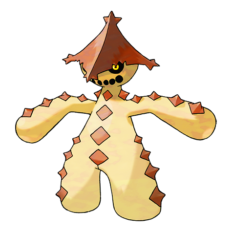

# Cacturne (Scarecrow Pokémon)

| Official Artwork | Shiny Artwork |
| --- | --- |
|  |  |

It becomes active at night, seeking prey that is exhausted from the day’s desert heat.

---

## Media

### Cries

No cries available.

---

## Pokédex Data

| National № | Type(s) | Height | Weight | Abilities | Local № |
|------------|---------|--------|--------|-----------|---------|
| #332 | {: width='48'} {: width='48'} | 1.3 m | 77.4 kg | 1. Water-Absorb 2. Sand-Veil | N/A |

---

## Base Stats
|   | HP | Attack | Defense | Sp. Atk | Sp. Def | Speed |
|---|----|--------|---------|---------|---------|-------|
| **Base** | 70 | 115 | 60 | 115 | 60 | 55 |
| **Min** | 250 | 211 | 112 | 211 | 112 | 103 |
| **Max** | 344 | 361 | 240 | 361 | 240 | 229 |

The ranges shown above are for a level 100 Pokémon. Maximum values are based on a beneficial nature, 252 EVs, 31 IVs; minimum values are based on a hindering nature, 0 EVs, 0 IVs.

---

## Forms & Evolutions

!!! warning "WARNING"

    Information on evolutions may not be 100% accurate; differences between evolution methods across generations are not accounted for.

### Forms

Cacturne has no alternate forms.

### Evolution Line

1. [Cacnea](cacnea.md/)
    1. Level Up: [Cacturne](cacturne.md/)

---

## Training

| EV Yield | Catch Rate | Base Friendship | Base Exp. | Growth Rate | Held Items |
|----------|------------|-----------------|-----------|-------------|------------|
| 1 Attack 1 Special Attack | 60 | 35 | 166 | Medium-Slow | sticky-barb (5%) |

---

## Breeding

| Egg Groups | Egg Cycles | Gender | Dimorphic | Color | Shape |
|------------|------------|--------|-----------|-------|-------|
| 1. Plant 2. Humanshape | 20 | 50.0% Male 50.0% Female | True | Green | Humanoid |

---

## Moves

!!! warning "WARNING"

    Specific move information may be incorrect. However, the general movepool should be accurate; this includes changes made in Renegade Platinum.

### Level Up Moves

| Lv. | Move | Type | Cat. | Power | Acc. | PP |
| --- | --- | --- | --- | --- | --- | --- |
| 1 | Leer | {: width='48'} | {: width='36'} | — | 100 | 30 |
| 1 | Poison Sting | {: width='48'} | {: width='36'} | 15 | 100 | 35 |
| 4 | Absorb | {: width='48'} | {: width='36'} | 20 | 100 | 25 |
| 7 | Growth | {: width='48'} | {: width='36'} | — | — | 20 |
| 10 | Leech Seed | {: width='48'} | {: width='36'} | — | 90 | 10 |
| 13 | Sand Attack | {: width='48'} | {: width='36'} | — | 100 | 15 |
| 16 | Bullet Seed | {: width='48'} | {: width='36'} | 25 | 100 | 30 |
| 19 | Feint Attack | {: width='48'} | {: width='36'} | 60 | — | 20 |
| 22 | Ingrain | {: width='48'} | {: width='36'} | — | — | 20 |
| 25 | Needle Arm | {: width='48'} | {: width='36'} | 90 | 100 | 15 |
| 28 | Payback | {: width='48'} | {: width='36'} | 50 | 100 | 10 |
| 31 | Spikes | {: width='48'} | {: width='36'} | — | — | 20 |
| 32 | Revenge | {: width='48'} | {: width='36'} | 60 | 100 | 10 |
| 35 | Sucker Punch | {: width='48'} | {: width='36'} | 70 | 100 | 5 |
| 39 | Energy Ball | {: width='48'} | {: width='36'} | 90 | 100 | 10 |
| 43 | Nasty Plot | {: width='48'} | {: width='36'} | — | — | 20 |
| 47 | Pin Missile | {: width='48'} | {: width='36'} | 25 | 95 | 20 |
| 51 | Cotton Spore | {: width='48'} | {: width='36'} | — | 100 | 40 |
| 55 | Dark Pulse | {: width='48'} | {: width='36'} | 80 | 100 | 15 |
| 59 | Sandstorm | {: width='48'} | {: width='36'} | — | — | 10 |
| 63 | Destiny Bond | {: width='48'} | {: width='36'} | — | — | 5 |

### TM Moves

| TM | Move | Type | Cat. | Power | Acc. | PP |
| --- | --- | --- | --- | --- | --- | --- |
| HM01 | Cut | {: width='48'} | {: width='36'} | 60 | 100% | 25 |
| HM04 | Strength | {: width='48'} | {: width='36'} | 100 | 100 | 15 |
| TM01 | Focus Punch | {: width='48'} | {: width='36'} | 150 | 100 | 20 |
| TM06 | Toxic | {: width='48'} | {: width='36'} | — | 90 | 10 |
| TM09 | Bullet Seed | {: width='48'} | {: width='36'} | 25 | 100 | 30 |
| TM10 | Hidden Power | {: width='48'} | {: width='36'} | 60 | 100 | 15 |
| TM11 | Sunny Day | {: width='48'} | {: width='36'} | — | — | 5 |
| TM15 | Hyper Beam | {: width='48'} | {: width='36'} | 150 | 90 | 5 |
| TM17 | Protect | {: width='48'} | {: width='36'} | — | — | 10 |
| TM19 | Giga Drain | {: width='48'} | {: width='36'} | 75 | 100 | 10 |
| TM21 | Frustration | {: width='48'} | {: width='36'} | — | 100 | 20 |
| TM22 | Solar Beam | {: width='48'} | {: width='36'} | 120 | 100 | 10 |
| TM27 | Return | {: width='48'} | {: width='36'} | — | 100 | 20 |
| TM31 | Brick Break | {: width='48'} | {: width='36'} | 75 | 100 | 15 |
| TM32 | Double Team | {: width='48'} | {: width='36'} | — | — | 15 |
| TM37 | Sandstorm | {: width='48'} | {: width='36'} | — | — | 10 |
| TM42 | Facade | {: width='48'} | {: width='36'} | 70 | 100 | 20 |
| TM43 | Secret Power | {: width='48'} | {: width='36'} | 70 | 100 | 20 |
| TM44 | Rest | {: width='48'} | {: width='36'} | — | — | 5 |
| TM45 | Attract | {: width='48'} | {: width='36'} | — | 100 | 15 |
| TM52 | Focus Blast | {: width='48'} | {: width='36'} | 120 | 70 | 5 |
| TM53 | Energy Ball | {: width='48'} | {: width='36'} | 90 | 100 | 10 |
| TM56 | Fling | {: width='48'} | {: width='36'} | — | 100 | 10 |
| TM58 | Endure | {: width='48'} | {: width='36'} | — | — | 10 |
| TM60 | Drain Punch | {: width='48'} | {: width='36'} | 75 | 100 | 10 |
| TM63 | Embargo | {: width='48'} | {: width='36'} | — | 100 | 15 |
| TM66 | Payback | {: width='48'} | {: width='36'} | 50 | 100 | 10 |
| TM68 | Giga Impact | {: width='48'} | {: width='36'} | 150 | 90 | 5 |
| TM70 | Flash | {: width='48'} | {: width='36'} | — | 100 | 20 |
| TM75 | Swords Dance | {: width='48'} | {: width='36'} | — | — | 20 |
| TM78 | Captivate | {: width='48'} | {: width='36'} | — | 100 | 20 |
| TM79 | Dark Pulse | {: width='48'} | {: width='36'} | 80 | 100 | 15 |
| TM82 | Sleep Talk | {: width='48'} | {: width='36'} | — | — | 10 |
| TM83 | Natural Gift | {: width='48'} | {: width='36'} | — | 100 | 15 |
| TM84 | Poison Jab | {: width='48'} | {: width='36'} | 80 | 100 | 20 |
| TM86 | Grass Knot | {: width='48'} | {: width='36'} | — | 100 | 20 |
| TM87 | Swagger | {: width='48'} | {: width='36'} | — | 85 | 15 |
| TM90 | Substitute | {: width='48'} | {: width='36'} | — | — | 10 |

### Egg Moves

Cacturne cannot learn any moves by breeding.
### Tutor Moves

| Move | Type | Cat. | Power | Acc. | PP |
| --- | --- | --- | --- | --- | --- |
| Thunder Punch | {: width='48'} | {: width='36'} | 75 | 100 | 15 |
| Snore | {: width='48'} | {: width='36'} | 50 | 100 | 15 |
| Spite | {: width='48'} | {: width='36'} | — | 100 | 10 |
| Mud Slap | {: width='48'} | {: width='36'} | 20 | 100 | 10 |
| Fury Cutter | {: width='48'} | {: width='36'} | 40 | 95 | 20 |
| Synthesis | {: width='48'} | {: width='36'} | — | — | 5 |
| Superpower | {: width='48'} | {: width='36'} | 120 | 100 | 5 |
| Sucker Punch | {: width='48'} | {: width='36'} | 70 | 100 | 5 |
| Seed Bomb | {: width='48'} | {: width='36'} | 80 | 100 | 15 |

