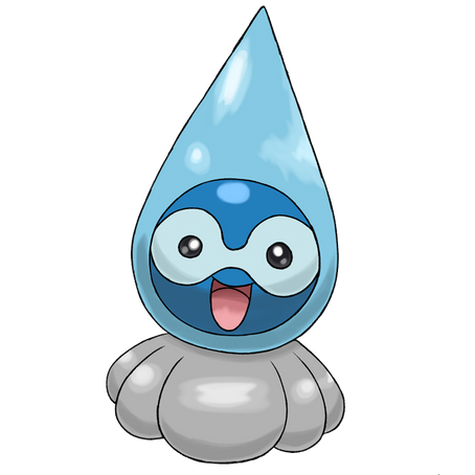

# #10014 Castform Rainy (Weather Pokémon)

| Official Artwork | Shiny Artwork |
| --- | --- |
|  |  |

Its appearance changes with the weather. Recently, its molecules were found to be just like water.

---

## Media

### Cries

No cries available.

---

## Pokédex Data

| National № | Type(s) | Height | Weight | Abilities | Local № |
|------------|---------|--------|--------|-----------|---------|
| #10014 | {: width='48'} | 0.3 m | 0.8 kg | 1. Forecast | N/A |

---

## Base Stats
|   | HP | Attack | Defense | Sp. Atk | Sp. Def | Speed |
|---|----|--------|---------|---------|---------|-------|
| **Base** | 60 | 60 | 60 | 105 | 70 | 95 |
| **Min** | 230 | 112 | 112 | 193 | 130 | 175 |
| **Max** | 324 | 240 | 240 | 339 | 262 | 317 |

The ranges shown above are for a level 100 Pokémon. Maximum values are based on a beneficial nature, 252 EVs, 31 IVs; minimum values are based on a hindering nature, 0 EVs, 0 IVs.

---

## Forms & Evolutions

!!! warning "WARNING"

    Information on evolutions may not be 100% accurate; differences between evolution methods across generations are not accounted for.

### Forms

1. [Castform](castform.md/)

2. [Castform Sunny](castform-sunny.md/)

3. [Castform Rainy](castform-rainy.md/)

4. [Castform Snowy](castform-snowy.md/)

### Evolution Line

1. [Castform](castform.md/)

---

## Training

| EV Yield | Catch Rate | Base Friendship | Base Exp. | Growth Rate | Held Items |
|----------|------------|-----------------|-----------|-------------|------------|
| 1 Hp | 45 | 70 | 147 | Medium | mystic-water (100%) |

---

## Breeding

| Egg Groups | Egg Cycles | Gender | Dimorphic | Color | Shape |
|------------|------------|--------|-----------|-------|-------|
| 1. Fairy 2. Indeterminate | 25 | 50.0% Male 50.0% Female | False | Gray | Ball |

---

## Moves

!!! warning "WARNING"

    Specific move information may be incorrect. However, the general movepool should be accurate; this includes changes made in Renegade Platinum.

### Level Up Moves

| Lv. | Move | Type | Cat. | Power | Acc. | PP |
| --- | --- | --- | --- | --- | --- | --- |
| 1 | Tackle | {: width='48'} | {: width='36'} | 40 | 100 | 35 |
| 10 | Ember | {: width='48'} | {: width='36'} | 40 | 100 | 25 |
| 10 | Powder Snow | {: width='48'} | {: width='36'} | 40 | 100 | 25 |
| 10 | Water Gun | {: width='48'} | {: width='36'} | 40 | 100 | 25 |
| 15 | Headbutt | {: width='48'} | {: width='36'} | 70 | 100 | 15 |
| 20 | Hail | {: width='48'} | {: width='36'} | — | — | 10 |
| 20 | Rain Dance | {: width='48'} | {: width='36'} | — | — | 5 |
| 20 | Sunny Day | {: width='48'} | {: width='36'} | — | — | 5 |
| 25 | Weather Ball | {: width='48'} | {: width='36'} | 50 | 100 | 10 |
| 35 | Blizzard | {: width='48'} | {: width='36'} | 110 | 70 | 5 |
| 35 | Fire Blast | {: width='48'} | {: width='36'} | 110 | 85 | 5 |
| 35 | Hydro Pump | {: width='48'} | {: width='36'} | 110 | 80 | 5 |
| 45 | Hurricane | {: width='48'} | {: width='36'} | 110 | 70 | 10 |

### TM Moves

| TM | Move | Type | Cat. | Power | Acc. | PP |
| --- | --- | --- | --- | --- | --- | --- |
| TBD | Hurricane | {: width='48'} | {: width='36'} | 110 | 70 | 10 |
| TM03 | Water Pulse | {: width='48'} | {: width='36'} | 60 | 100 | 20 |
| TM06 | Toxic | {: width='48'} | {: width='36'} | — | 90 | 10 |
| TM07 | Hail | {: width='48'} | {: width='36'} | — | — | 10 |
| TM10 | Hidden Power | {: width='48'} | {: width='36'} | 60 | 100 | 15 |
| TM11 | Sunny Day | {: width='48'} | {: width='36'} | — | — | 5 |
| TM13 | Ice Beam | {: width='48'} | {: width='36'} | 90 | 100 | 10 |
| TM14 | Blizzard | {: width='48'} | {: width='36'} | 110 | 70 | 5 |
| TM17 | Protect | {: width='48'} | {: width='36'} | — | — | 10 |
| TM18 | Rain Dance | {: width='48'} | {: width='36'} | — | — | 5 |
| TM21 | Frustration | {: width='48'} | {: width='36'} | — | 100 | 20 |
| TM22 | Solar Beam | {: width='48'} | {: width='36'} | 120 | 100 | 10 |
| TM24 | Thunderbolt | {: width='48'} | {: width='36'} | 90 | 100 | 15 |
| TM25 | Thunder | {: width='48'} | {: width='36'} | 110 | 70 | 10 |
| TM27 | Return | {: width='48'} | {: width='36'} | — | 100 | 20 |
| TM30 | Shadow Ball | {: width='48'} | {: width='36'} | 80 | 100 | 15 |
| TM32 | Double Team | {: width='48'} | {: width='36'} | — | — | 15 |
| TM34 | Shock Wave | {: width='48'} | {: width='36'} | 60 | — | 20 |
| TM35 | Flamethrower | {: width='48'} | {: width='36'} | 90 | 100 | 15 |
| TM37 | Sandstorm | {: width='48'} | {: width='36'} | — | — | 10 |
| TM38 | Fire Blast | {: width='48'} | {: width='36'} | 110 | 85 | 5 |
| TM42 | Facade | {: width='48'} | {: width='36'} | 70 | 100 | 20 |
| TM43 | Secret Power | {: width='48'} | {: width='36'} | 70 | 100 | 20 |
| TM44 | Rest | {: width='48'} | {: width='36'} | — | — | 5 |
| TM45 | Attract | {: width='48'} | {: width='36'} | — | 100 | 15 |
| TM46 | Thief | {: width='48'} | {: width='36'} | 60 | 100 | 25 |
| TM53 | Energy Ball | {: width='48'} | {: width='36'} | 90 | 100 | 10 |
| TM58 | Endure | {: width='48'} | {: width='36'} | — | — | 10 |
| TM70 | Flash | {: width='48'} | {: width='36'} | — | 100 | 20 |
| TM72 | Avalanche | {: width='48'} | {: width='36'} | 60 | 100 | 10 |
| TM73 | Thunder Wave | {: width='48'} | {: width='36'} | — | 90 | 20 |
| TM77 | Psych Up | {: width='48'} | {: width='36'} | — | — | 10 |
| TM78 | Captivate | {: width='48'} | {: width='36'} | — | 100 | 20 |
| TM82 | Sleep Talk | {: width='48'} | {: width='36'} | — | — | 10 |
| TM83 | Natural Gift | {: width='48'} | {: width='36'} | — | 100 | 15 |
| TM87 | Swagger | {: width='48'} | {: width='36'} | — | 85 | 15 |
| TM90 | Substitute | {: width='48'} | {: width='36'} | — | — | 10 |

### Egg Moves

| Move | Type | Cat. | Power | Acc. | PP |
| --- | --- | --- | --- | --- | --- |
| Disable | {: width='48'} | {: width='36'} | — | 100 | 20 |
| Amnesia | {: width='48'} | {: width='36'} | — | — | 20 |
| Psych Up | {: width='48'} | {: width='36'} | — | — | 10 |
| Future Sight | {: width='48'} | {: width='36'} | 120 | 100 | 10 |
| Lucky Chant | {: width='48'} | {: width='36'} | — | — | 30 |
| Ominous Wind | {: width='48'} | {: width='36'} | 60 | 100 | 5 |

### Tutor Moves

| Move | Type | Cat. | Power | Acc. | PP |
| --- | --- | --- | --- | --- | --- |
| Swift | {: width='48'} | {: width='36'} | 60 | — | 20 |
| Snore | {: width='48'} | {: width='36'} | 50 | 100 | 15 |
| Icy Wind | {: width='48'} | {: width='36'} | 55 | 95 | 15 |
| Last Resort | {: width='48'} | {: width='36'} | 140 | 100 | 5 |
| Ominous Wind | {: width='48'} | {: width='36'} | 60 | 100 | 5 |

