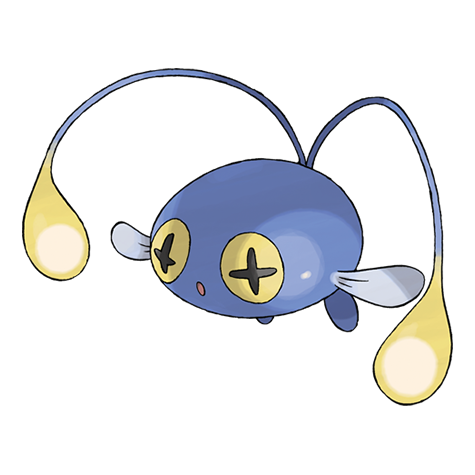

# Chinchou (Angler Pokémon)

| Official Artwork | Shiny Artwork |
| --- | --- |
|  |  |

It discharges positive and negative electricity from its antenna tips to shock its foes.

---

## Media

### Cries

No cries available.

---

## Pokédex Data

| National № | Type(s) | Height | Weight | Abilities | Local № |
|------------|---------|--------|--------|-----------|---------|
| #170 | {: width='48'} {: width='48'} | 0.5 m | 12.0 kg | 1. Volt-Absorb 2. Water-Absorb | N/A |

---

## Base Stats
|   | HP | Attack | Defense | Sp. Atk | Sp. Def | Speed |
|---|----|--------|---------|---------|---------|-------|
| **Base** | 75 | 38 | 38 | 56 | 56 | 67 |
| **Min** | 260 | 72 | 72 | 105 | 105 | 125 |
| **Max** | 354 | 192 | 192 | 232 | 232 | 256 |

The ranges shown above are for a level 100 Pokémon. Maximum values are based on a beneficial nature, 252 EVs, 31 IVs; minimum values are based on a hindering nature, 0 EVs, 0 IVs.

---

## Forms & Evolutions

!!! warning "WARNING"

    Information on evolutions may not be 100% accurate; differences between evolution methods across generations are not accounted for.

### Forms

Chinchou has no alternate forms.

### Evolution Line

1. [Chinchou](chinchou.md/)
    1. Level Up: [Lanturn](lanturn.md/)

---

## Training

| EV Yield | Catch Rate | Base Friendship | Base Exp. | Growth Rate | Held Items |
|----------|------------|-----------------|-----------|-------------|------------|
| 1 Hp | 190 | 50 | 66 | Slow | deep-sea-scale (5%) |

---

## Breeding

| Egg Groups | Egg Cycles | Gender | Dimorphic | Color | Shape |
|------------|------------|--------|-----------|-------|-------|
| 1. Water2 | 20 | 50.0% Male 50.0% Female | False | Blue | Fish |

---

## Moves

!!! warning "WARNING"

    Specific move information may be incorrect. However, the general movepool should be accurate; this includes changes made in Renegade Platinum.

### Level Up Moves

| Lv. | Move | Type | Cat. | Power | Acc. | PP |
| --- | --- | --- | --- | --- | --- | --- |
| 1 | Bubble | {: width='48'} | {: width='36'} | 40 | 100 | 30 |
| 1 | Supersonic | {: width='48'} | {: width='36'} | — | 55 | 20 |
| 1 | Thunder Wave | {: width='48'} | {: width='36'} | — | 90 | 20 |
| 6 | Shock Wave | {: width='48'} | {: width='36'} | 60 | — | 20 |
| 9 | Water Gun | {: width='48'} | {: width='36'} | 40 | 100 | 25 |
| 12 | Spark | {: width='48'} | {: width='36'} | 65 | 100 | 20 |
| 15 | Confuse Ray | {: width='48'} | {: width='36'} | — | 100 | 10 |
| 18 | Charge Beam | {: width='48'} | {: width='36'} | 50 | 90 | 10 |
| 21 | Bubble Beam | {: width='48'} | {: width='36'} | 75 | 100 | 15 |
| 24 | Signal Beam | {: width='48'} | {: width='36'} | 75 | 100 | 15 |
| 27 | Discharge | {: width='48'} | {: width='36'} | 80 | 100 | 15 |
| 30 | Flail | {: width='48'} | {: width='36'} | — | 100 | 15 |
| 33 | Thunderbolt | {: width='48'} | {: width='36'} | 90 | 100 | 15 |
| 36 | Take Down | {: width='48'} | {: width='36'} | 90 | 85 | 20 |
| 39 | Aqua Ring | {: width='48'} | {: width='36'} | — | — | 20 |
| 42 | Hydro Pump | {: width='48'} | {: width='36'} | 110 | 80 | 5 |
| 45 | Charge | {: width='48'} | {: width='36'} | — | — | 20 |

### TM Moves

| TM | Move | Type | Cat. | Power | Acc. | PP |
| --- | --- | --- | --- | --- | --- | --- |
| HM03 | Surf | {: width='48'} | {: width='36'} | 90 | 100 | 15 |
| HM07 | Waterfall | {: width='48'} | {: width='36'} | 80 | 100 | 15 |
| TM03 | Water Pulse | {: width='48'} | {: width='36'} | 60 | 100 | 20 |
| TM06 | Toxic | {: width='48'} | {: width='36'} | — | 90 | 10 |
| TM07 | Hail | {: width='48'} | {: width='36'} | — | — | 10 |
| TM10 | Hidden Power | {: width='48'} | {: width='36'} | 60 | 100 | 15 |
| TM13 | Ice Beam | {: width='48'} | {: width='36'} | 90 | 100 | 10 |
| TM14 | Blizzard | {: width='48'} | {: width='36'} | 110 | 70 | 5 |
| TM17 | Protect | {: width='48'} | {: width='36'} | — | — | 10 |
| TM18 | Rain Dance | {: width='48'} | {: width='36'} | — | — | 5 |
| TM21 | Frustration | {: width='48'} | {: width='36'} | — | 100 | 20 |
| TM24 | Thunderbolt | {: width='48'} | {: width='36'} | 90 | 100 | 15 |
| TM25 | Thunder | {: width='48'} | {: width='36'} | 110 | 70 | 10 |
| TM27 | Return | {: width='48'} | {: width='36'} | — | 100 | 20 |
| TM32 | Double Team | {: width='48'} | {: width='36'} | — | — | 15 |
| TM34 | Shock Wave | {: width='48'} | {: width='36'} | 60 | — | 20 |
| TM42 | Facade | {: width='48'} | {: width='36'} | 70 | 100 | 20 |
| TM43 | Secret Power | {: width='48'} | {: width='36'} | 70 | 100 | 20 |
| TM44 | Rest | {: width='48'} | {: width='36'} | — | — | 5 |
| TM45 | Attract | {: width='48'} | {: width='36'} | — | 100 | 15 |
| TM55 | Brine | {: width='48'} | {: width='36'} | 65 | 100 | 10 |
| TM57 | Charge Beam | {: width='48'} | {: width='36'} | 50 | 90 | 10 |
| TM58 | Endure | {: width='48'} | {: width='36'} | — | — | 10 |
| TM70 | Flash | {: width='48'} | {: width='36'} | — | 100 | 20 |
| TM73 | Thunder Wave | {: width='48'} | {: width='36'} | — | 90 | 20 |
| TM78 | Captivate | {: width='48'} | {: width='36'} | — | 100 | 20 |
| TM82 | Sleep Talk | {: width='48'} | {: width='36'} | — | — | 10 |
| TM83 | Natural Gift | {: width='48'} | {: width='36'} | — | 100 | 15 |
| TM87 | Swagger | {: width='48'} | {: width='36'} | — | 85 | 15 |
| TM90 | Substitute | {: width='48'} | {: width='36'} | — | — | 10 |

### Egg Moves

| Move | Type | Cat. | Power | Acc. | PP |
| --- | --- | --- | --- | --- | --- |
| Mist | {: width='48'} | {: width='36'} | — | — | 30 |
| Psybeam | {: width='48'} | {: width='36'} | 65 | 100 | 20 |
| Agility | {: width='48'} | {: width='36'} | — | — | 30 |
| Screech | {: width='48'} | {: width='36'} | — | 85 | 40 |
| Amnesia | {: width='48'} | {: width='36'} | — | — | 20 |
| Flail | {: width='48'} | {: width='36'} | — | 100 | 15 |
| Whirlpool | {: width='48'} | {: width='36'} | 35 | 85 | 15 |

### Tutor Moves

| Move | Type | Cat. | Power | Acc. | PP |
| --- | --- | --- | --- | --- | --- |
| Snore | {: width='48'} | {: width='36'} | 50 | 100 | 15 |
| Icy Wind | {: width='48'} | {: width='36'} | 55 | 95 | 15 |
| Dive | {: width='48'} | {: width='36'} | 80 | 100 | 10 |
| Signal Beam | {: width='48'} | {: width='36'} | 75 | 100 | 15 |
| Bounce | {: width='48'} | {: width='36'} | 85 | 85 | 5 |
| Sucker Punch | {: width='48'} | {: width='36'} | 70 | 100 | 5 |

