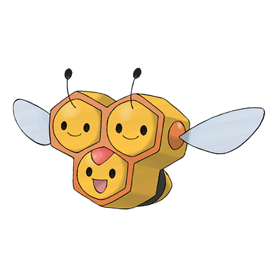

# Combee (Tiny Bee Pokémon)

| Official Artwork | Shiny Artwork |
| --- | --- |
|  |  |

The trio is together from birth. It constantly gathers honey from flowers to please VESPIQUEN.

---

## Media

### Cries

Latest (Gen VI+):

<audio controls>
<source src='../../assets/cries/combee/latest.ogg' type='audio/ogg'>
  Your browser does not support the audio element.
</audio>

Legacy:

<audio controls>
<source src='../../assets/cries/combee/legacy.ogg' type='audio/ogg'>
  Your browser does not support the audio element.
</audio>

---

## Pokédex Data

| National № | Type(s) | Height | Weight | Abilities | Local № |
|------------|---------|--------|--------|-----------|---------|
| #415 | {: width='48'} {: width='48'} | 0.3 m | 5.5 kg | 1. Hustle 2. Honey-Gather | #53 |

---

## Base Stats
|   | HP | Attack | Defense | Sp. Atk | Sp. Def | Speed |
|---|----|--------|---------|---------|---------|-------|
| **Base** | 30 | 30 | 42 | 30 | 42 | 70 |
| **Min** | 170 | 58 | 80 | 58 | 80 | 130 |
| **Max** | 264 | 174 | 201 | 174 | 201 | 262 |

The ranges shown above are for a level 100 Pokémon. Maximum values are based on a beneficial nature, 252 EVs, 31 IVs; minimum values are based on a hindering nature, 0 EVs, 0 IVs.

---

## Forms & Evolutions

!!! warning "WARNING"

    Information on evolutions may not be 100% accurate; differences between evolution methods across generations are not accounted for.

### Forms

Combee has no alternate forms.

### Evolution Line

1. [Combee](combee.md/)
    1. Level Up: [Vespiquen](vespiquen.md/)

---

## Training

| EV Yield | Catch Rate | Base Friendship | Base Exp. | Growth Rate | Held Items |
|----------|------------|-----------------|-----------|-------------|------------|
| 1 Speed | 120 | 50 | 49 | Medium-Slow | honey (100%) |

---

## Breeding

| Egg Groups | Egg Cycles | Gender | Dimorphic | Color | Shape |
|------------|------------|--------|-----------|-------|-------|
| 1. Bug | 15 | 87.5% Male 12.5% Female | True | Yellow | Heads |

---

## Moves

!!! warning "WARNING"

    Specific move information may be incorrect. However, the general movepool should be accurate; this includes changes made in Renegade Platinum.

### Level Up Moves

| Lv. | Move | Type | Cat. | Power | Acc. | PP |
| --- | --- | --- | --- | --- | --- | --- |
| 1 | Bug Bite | {: width='48'} | {: width='36'} | 60 | 100 | 20 |
| 1 | Bug Buzz | {: width='48'} | {: width='36'} | 90 | 100 | 10 |
| 1 | Gust | {: width='48'} | {: width='36'} | 40 | 100 | 35 |
| 1 | Sweet Scent | {: width='48'} | {: width='36'} | — | 100 | 20 |

### TM Moves

| TM | Move | Type | Cat. | Power | Acc. | PP |
| --- | --- | --- | --- | --- | --- | --- |
| TBD | Bug Buzz | {: width='48'} | {: width='36'} | 90 | 100 | 10 |

### Egg Moves

Combee cannot learn any moves by breeding.
### Tutor Moves

| Move | Type | Cat. | Power | Acc. | PP |
| --- | --- | --- | --- | --- | --- |
| Swift | {: width='48'} | {: width='36'} | 60 | — | 20 |
| Snore | {: width='48'} | {: width='36'} | 50 | 100 | 15 |
| Mud Slap | {: width='48'} | {: width='36'} | 20 | 100 | 10 |
| Endeavor | {: width='48'} | {: width='36'} | — | 100 | 5 |
| Air Cutter | {: width='48'} | {: width='36'} | 60 | 95 | 25 |
| Ominous Wind | {: width='48'} | {: width='36'} | 60 | 100 | 5 |

