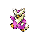

# #225 Delibird (Delivery Pokémon)

| Official Artwork | Shiny Artwork |
|------------------|---------------|
|  |  |

It carries food rolled up in its tail. It has the habit of sharing food with people lost in mountains.

---

## Media

### Default Sprites

| Front | Shiny | Back | Shiny |
|-------|-------|------|-------|
|  |  |  |  |

### Cries

Latest (Gen VI+):

<audio controls>
<source src='../../assets/cries/delibird/latest.ogg' type='audio/ogg'>
  Your browser does not support the audio element.
</audio>

Legacy:

<audio controls>
<source src='../../assets/cries/delibird/legacy.ogg' type='audio/ogg'>
  Your browser does not support the audio element.
</audio>

---

## Pokédex Data

| National № | Type(s) | Height | Weight | Abilities | Local № |
|------------|---------|--------|--------|-----------|---------|
| #225 | {: width="48"} {: width="48"} | 0.9 m / 3.0 ft | 16.0 kg / 35.3 lbs | 1. Technician 2. Hustle | N/A |

---

## Base Stats
|   | HP | Attack | Defense | Sp. Atk | Sp. Def | Speed |
|---|----|--------|---------|---------|---------|-------|
| **Base** | 45 | 85 | 50 | 110 | 50 | 110 |
| **Min** | 200 | 157 | 94 | 202 | 94 | 202 |
| **Max** | 294 | 295 | 218 | 350 | 218 | 350 |

The ranges shown above are for a level 100 Pokémon. Maximum values are based on a beneficial nature, 252 EVs, 31 IVs; minimum values are based on a hindering nature, 0 EVs, 0 IVs.

---

## Forms & Evolutions

!!! warning "WARNING"

    Information on evolutions may not be 100% accurate; differences between evolution methods across generations are not accounted for.

### Forms

Delibird has no alternate forms.

### Evolution Line

1. [Delibird](delibird.md/)

---

## Training

| EV Yield | Catch Rate | Base Friendship | Base Exp. | Growth Rate | Held Items |
|----------|------------|-----------------|-----------|-------------|------------|
| 1 Speed | 45 | 50 | 116 | Fast | N/A |

---

## Breeding

| Egg Groups | Egg Cycles | Gender | Dimorphic | Color | Shape |
|------------|------------|--------|-----------|-------|-------|
| 1. Water1 2. Ground | 20 | 50.0% Male 50.0% Female | False | Red | Wings |

---

## Moves

!!! warning "WARNING"

    Specific move information may be incorrect. However, the general movepool should be accurate; this includes changes made in Renegade Platinum.

### Level Up Moves

| Lv. | Move | Type | Cat. | Power | Acc. | PP |
| --- | --- | --- | --- | --- | --- | --- |
| 1 | Fake Out | {: width="48"} | {: width="36"} | 40 | 100 | 10 |
| 1 | Present | {: width="48"} | {: width="36"} | — | 90 | 15 |
| 1 | Rapid Spin | {: width="48"} | {: width="36"} | 50 | 100 | 40 |
| 1 | Splash | {: width="48"} | {: width="36"} | — | — | 40 |
| 6 | Icy Wind | {: width="48"} | {: width="36"} | 55 | 95 | 15 |
| 9 | Quick Attack | {: width="48"} | {: width="36"} | 40 | 100 | 30 |
| 12 | Ice Shard | {: width="48"} | {: width="36"} | 40 | 100 | 30 |
| 15 | Swift | {: width="48"} | {: width="36"} | 60 | — | 20 |
| 18 | Air Cutter | {: width="48"} | {: width="36"} | 60 | 95 | 25 |
| 21 | Aurora Beam | {: width="48"} | {: width="36"} | 75 | 100 | 15 |
| 24 | Drill Peck | {: width="48"} | {: width="36"} | 80 | 100 | 20 |
| 27 | Recycle | {: width="48"} | {: width="36"} | — | — | 10 |
| 30 | Air Slash | {: width="48"} | {: width="36"} | 75 | 95 | 15 |
| 33 | Hail | {: width="48"} | {: width="36"} | — | — | 10 |
| 36 | Ice Beam | {: width="48"} | {: width="36"} | 90 | 100 | 10 |
| 39 | Future Sight | {: width="48"} | {: width="36"} | 120 | 100 | 10 |
| 42 | Blizzard | {: width="48"} | {: width="36"} | 110 | 70 | 5 |
| 45 | Hurricane | {: width="48"} | {: width="36"} | 110 | 70 | 10 |
| 48 | Destiny Bond | {: width="48"} | {: width="36"} | — | — | 5 |

### TM Moves

| TM | Move | Type | Cat. | Power | Acc. | PP |
| --- | --- | --- | --- | --- | --- | --- |
| HM02 | Fly | {: width="48"} | {: width="36"} | 100 | 100% | 15 |
| HM05 | Defog | {: width="48"} | {: width="36"} | — | — | 15 |
| TM01 | Focus Punch | {: width="48"} | {: width="36"} | 150 | 100 | 20 |
| TM03 | Water Pulse | {: width="48"} | {: width="36"} | 60 | 100 | 20 |
| TM06 | Toxic | {: width="48"} | {: width="36"} | — | 90 | 10 |
| TM07 | Hail | {: width="48"} | {: width="36"} | — | — | 10 |
| TM10 | Hidden Power | {: width="48"} | {: width="36"} | 60 | 100 | 15 |
| TM13 | Ice Beam | {: width="48"} | {: width="36"} | 90 | 100 | 10 |
| TM14 | Blizzard | {: width="48"} | {: width="36"} | 110 | 70 | 5 |
| TM17 | Protect | {: width="48"} | {: width="36"} | — | — | 10 |
| TM18 | Rain Dance | {: width="48"} | {: width="36"} | — | — | 5 |
| TM21 | Frustration | {: width="48"} | {: width="36"} | — | 100 | 20 |
| TM27 | Return | {: width="48"} | {: width="36"} | — | 100 | 20 |
| TM31 | Brick Break | {: width="48"} | {: width="36"} | 75 | 100 | 15 |
| TM32 | Double Team | {: width="48"} | {: width="36"} | — | — | 15 |
| TM40 | Aerial Ace | {: width="48"} | {: width="36"} | 60 | — | 20 |
| TM42 | Facade | {: width="48"} | {: width="36"} | 70 | 100 | 20 |
| TM43 | Secret Power | {: width="48"} | {: width="36"} | 70 | 100 | 20 |
| TM44 | Rest | {: width="48"} | {: width="36"} | — | — | 5 |
| TM45 | Attract | {: width="48"} | {: width="36"} | — | 100 | 15 |
| TM46 | Thief | {: width="48"} | {: width="36"} | 60 | 100 | 25 |
| TM56 | Fling | {: width="48"} | {: width="36"} | — | 100 | 10 |
| TM58 | Endure | {: width="48"} | {: width="36"} | — | — | 10 |
| TM67 | Recycle | {: width="48"} | {: width="36"} | — | — | 10 |
| TM72 | Avalanche | {: width="48"} | {: width="36"} | 60 | 100 | 10 |
| TM78 | Captivate | {: width="48"} | {: width="36"} | — | 100 | 20 |
| TM82 | Sleep Talk | {: width="48"} | {: width="36"} | — | — | 10 |
| TM83 | Natural Gift | {: width="48"} | {: width="36"} | — | 100 | 15 |
| TM87 | Swagger | {: width="48"} | {: width="36"} | — | 85 | 15 |
| TM88 | Pluck | {: width="48"} | {: width="36"} | 60 | 100 | 20 |
| TM89 | U Turn | {: width="48"} | {: width="36"} | 70 | 100 | 20 |
| TM90 | Substitute | {: width="48"} | {: width="36"} | — | — | 10 |

### Egg Moves

| Move | Type | Cat. | Power | Acc. | PP |
| --- | --- | --- | --- | --- | --- |
| Ice Punch | {: width="48"} | {: width="36"} | 75 | 100 | 15 |
| Aurora Beam | {: width="48"} | {: width="36"} | 75 | 100 | 15 |
| Quick Attack | {: width="48"} | {: width="36"} | 40 | 100 | 30 |
| Splash | {: width="48"} | {: width="36"} | — | — | 40 |
| Rapid Spin | {: width="48"} | {: width="36"} | 50 | 100 | 40 |
| Future Sight | {: width="48"} | {: width="36"} | 120 | 100 | 10 |
| Ice Ball | {: width="48"} | {: width="36"} | 30 | 90 | 20 |
| Ice Shard | {: width="48"} | {: width="36"} | 40 | 100 | 30 |

### Tutor Moves

| Move | Type | Cat. | Power | Acc. | PP |
| --- | --- | --- | --- | --- | --- |
| Swift | {: width="48"} | {: width="36"} | 60 | — | 20 |
| Mud Slap | {: width="48"} | {: width="36"} | 20 | 100 | 10 |
| Icy Wind | {: width="48"} | {: width="36"} | 55 | 95 | 15 |
| Rollout | {: width="48"} | {: width="36"} | 30 | 90 | 20 |
| Signal Beam | {: width="48"} | {: width="36"} | 75 | 100 | 15 |
| Bounce | {: width="48"} | {: width="36"} | 85 | 85 | 5 |
| Seed Bomb | {: width="48"} | {: width="36"} | 80 | 100 | 15 |
| Gunk Shot | {: width="48"} | {: width="36"} | 120 | 80 | 5 |

