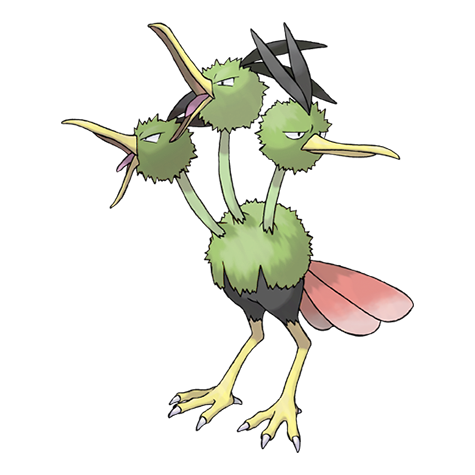

# Dodrio (Triple Bird Pokémon)

| Official Artwork | Shiny Artwork |
| --- | --- |
|  |  |

When DODUO evolves into this odd breed, one of its heads splits into two. It runs at nearly 40 mph.

---

## Media

### Cries

Latest (Gen VI+):

<audio controls>
<source src='../../assets/cries/dodrio/latest.ogg' type='audio/ogg'>
  Your browser does not support the audio element.
</audio>

Legacy:

<audio controls>
<source src='../../assets/cries/dodrio/legacy.ogg' type='audio/ogg'>
  Your browser does not support the audio element.
</audio>

---

## Pokédex Data

| National № | Type(s) | Height | Weight | Abilities | Local № |
|------------|---------|--------|--------|-----------|---------|
| #85 | {: width='48'} {: width='48'} | 1.8 m | 85.2 kg | 1. Tangled-Feet 2. Early-Bird | N/A |

---

## Base Stats
|   | HP | Attack | Defense | Sp. Atk | Sp. Def | Speed |
|---|----|--------|---------|---------|---------|-------|
| **Base** | 60 | 110 | 70 | 60 | 60 | 110 |
| **Min** | 230 | 202 | 130 | 112 | 112 | 202 |
| **Max** | 324 | 350 | 262 | 240 | 240 | 350 |

The ranges shown above are for a level 100 Pokémon. Maximum values are based on a beneficial nature, 252 EVs, 31 IVs; minimum values are based on a hindering nature, 0 EVs, 0 IVs.

---

## Forms & Evolutions

!!! warning "WARNING"

    Information on evolutions may not be 100% accurate; differences between evolution methods across generations are not accounted for.

### Forms

Dodrio has no alternate forms.

### Evolution Line

1. [Doduo](doduo.md/)
    1. Level Up: [Dodrio](dodrio.md/)

---

## Training

| EV Yield | Catch Rate | Base Friendship | Base Exp. | Growth Rate | Held Items |
|----------|------------|-----------------|-----------|-------------|------------|
| 2 Attack | 45 | 70 | 165 | Medium | sharp-beak (5%) |

---

## Breeding

| Egg Groups | Egg Cycles | Gender | Dimorphic | Color | Shape |
|------------|------------|--------|-----------|-------|-------|
| 1. Flying | 20 | 50.0% Male 50.0% Female | True | Brown | Legs |

---

## Moves

!!! warning "WARNING"

    Specific move information may be incorrect. However, the general movepool should be accurate; this includes changes made in Renegade Platinum.

### Level Up Moves

| Lv. | Move | Type | Cat. | Power | Acc. | PP |
| --- | --- | --- | --- | --- | --- | --- |
| 1 | Brave Bird | {: width='48'} | {: width='36'} | 120 | 100 | 15 |
| 1 | Growl | {: width='48'} | {: width='36'} | — | 100 | 40 |
| 1 | High Jump Kick | {: width='48'} | {: width='36'} | 130 | 90 | 10 |
| 1 | Peck | {: width='48'} | {: width='36'} | 35 | 100 | 35 |
| 1 | Quick Attack | {: width='48'} | {: width='36'} | 40 | 100 | 30 |
| 6 | Rage | {: width='48'} | {: width='36'} | 20 | 100 | 20 |
| 9 | Fury Attack | {: width='48'} | {: width='36'} | 15 | 85 | 20 |
| 12 | Pursuit | {: width='48'} | {: width='36'} | 40 | 100 | 20 |
| 15 | Pluck | {: width='48'} | {: width='36'} | 60 | 100 | 20 |
| 18 | Double Hit | {: width='48'} | {: width='36'} | 35 | 90 | 10 |
| 21 | Agility | {: width='48'} | {: width='36'} | — | — | 30 |
| 24 | Jump Kick | {: width='48'} | {: width='36'} | 100 | 95 | 10 |
| 27 | Uproar | {: width='48'} | {: width='36'} | 90 | 100 | 10 |
| 30 | Drill Peck | {: width='48'} | {: width='36'} | 80 | 100 | 20 |
| 31 | Tri Attack | {: width='48'} | {: width='36'} | 80 | 100 | 10 |
| 34 | Acupressure | {: width='48'} | {: width='36'} | — | — | 30 |
| 38 | Mirror Move | {: width='48'} | {: width='36'} | — | — | 20 |
| 42 | Swords Dance | {: width='48'} | {: width='36'} | — | — | 20 |
| 46 | Endeavor | {: width='48'} | {: width='36'} | — | 100 | 5 |
| 50 | Thrash | {: width='48'} | {: width='36'} | 120 | 100 | 10 |
| 54 | Brave Bird | {: width='48'} | {: width='36'} | 120 | 100 | 15 |

### TM Moves

| TM | Move | Type | Cat. | Power | Acc. | PP |
| --- | --- | --- | --- | --- | --- | --- |
| HM02 | Fly | {: width='48'} | {: width='36'} | 100 | 100% | 15 |
| TM06 | Toxic | {: width='48'} | {: width='36'} | — | 90 | 10 |
| TM10 | Hidden Power | {: width='48'} | {: width='36'} | 60 | 100 | 15 |
| TM11 | Sunny Day | {: width='48'} | {: width='36'} | — | — | 5 |
| TM12 | Taunt | {: width='48'} | {: width='36'} | — | 100 | 20 |
| TM15 | Hyper Beam | {: width='48'} | {: width='36'} | 150 | 90 | 5 |
| TM17 | Protect | {: width='48'} | {: width='36'} | — | — | 10 |
| TM21 | Frustration | {: width='48'} | {: width='36'} | — | 100 | 20 |
| TM27 | Return | {: width='48'} | {: width='36'} | — | 100 | 20 |
| TM32 | Double Team | {: width='48'} | {: width='36'} | — | — | 15 |
| TM40 | Aerial Ace | {: width='48'} | {: width='36'} | 60 | — | 20 |
| TM41 | Torment | {: width='48'} | {: width='36'} | — | 100 | 15 |
| TM42 | Facade | {: width='48'} | {: width='36'} | 70 | 100 | 20 |
| TM43 | Secret Power | {: width='48'} | {: width='36'} | 70 | 100 | 20 |
| TM44 | Rest | {: width='48'} | {: width='36'} | — | — | 5 |
| TM45 | Attract | {: width='48'} | {: width='36'} | — | 100 | 15 |
| TM46 | Thief | {: width='48'} | {: width='36'} | 60 | 100 | 25 |
| TM47 | Steel Wing | {: width='48'} | {: width='36'} | 70 | 90 | 25 |
| TM51 | Roost | {: width='48'} | {: width='36'} | — | — | 5 |
| TM58 | Endure | {: width='48'} | {: width='36'} | — | — | 10 |
| TM66 | Payback | {: width='48'} | {: width='36'} | 50 | 100 | 10 |
| TM68 | Giga Impact | {: width='48'} | {: width='36'} | 150 | 90 | 5 |
| TM78 | Captivate | {: width='48'} | {: width='36'} | — | 100 | 20 |
| TM82 | Sleep Talk | {: width='48'} | {: width='36'} | — | — | 10 |
| TM83 | Natural Gift | {: width='48'} | {: width='36'} | — | 100 | 15 |
| TM87 | Swagger | {: width='48'} | {: width='36'} | — | 85 | 15 |
| TM88 | Pluck | {: width='48'} | {: width='36'} | 60 | 100 | 20 |
| TM90 | Substitute | {: width='48'} | {: width='36'} | — | — | 10 |

### Egg Moves

Dodrio cannot learn any moves by breeding.
### Tutor Moves

| Move | Type | Cat. | Power | Acc. | PP |
| --- | --- | --- | --- | --- | --- |
| Swift | {: width='48'} | {: width='36'} | 60 | — | 20 |
| Snore | {: width='48'} | {: width='36'} | 50 | 100 | 15 |
| Mud Slap | {: width='48'} | {: width='36'} | 20 | 100 | 10 |
| Uproar | {: width='48'} | {: width='36'} | 90 | 100 | 10 |
| Knock Off | {: width='48'} | {: width='36'} | 65 | 100 | 20 |
| Endeavor | {: width='48'} | {: width='36'} | — | 100 | 5 |
| Air Cutter | {: width='48'} | {: width='36'} | 60 | 95 | 25 |

