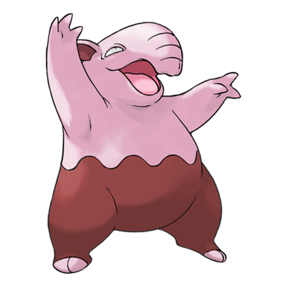

# Drowzee (Hypnosis Pokémon)

| Official Artwork | Shiny Artwork |
| --- | --- |
|  |  |

It can tell what people are dreaming by sniffing with its big nose. It loves fun dreams.

---

## Media

### Cries

Latest (Gen VI+):

<audio controls>
<source src='../../assets/cries/drowzee/latest.ogg' type='audio/ogg'>
  Your browser does not support the audio element.
</audio>

Legacy:

<audio controls>
<source src='../../assets/cries/drowzee/legacy.ogg' type='audio/ogg'>
  Your browser does not support the audio element.
</audio>

---

## Pokédex Data

| National № | Type(s) | Height | Weight | Abilities | Local № |
|------------|---------|--------|--------|-----------|---------|
| #96 | {: width='48'} | 1.0 m | 32.4 kg | 1. Insomnia 2. Forewarn 3. Inner-Focus | N/A |

---

## Base Stats
|   | HP | Attack | Defense | Sp. Atk | Sp. Def | Speed |
|---|----|--------|---------|---------|---------|-------|
| **Base** | 60 | 48 | 45 | 43 | 90 | 42 |
| **Min** | 230 | 90 | 85 | 81 | 166 | 80 |
| **Max** | 324 | 214 | 207 | 203 | 306 | 201 |

The ranges shown above are for a level 100 Pokémon. Maximum values are based on a beneficial nature, 252 EVs, 31 IVs; minimum values are based on a hindering nature, 0 EVs, 0 IVs.

---

## Forms & Evolutions

!!! warning "WARNING"

    Information on evolutions may not be 100% accurate; differences between evolution methods across generations are not accounted for.

### Forms

Drowzee has no alternate forms.

### Evolution Line

1. [Drowzee](drowzee.md/)
    1. Level Up: [Hypno](hypno.md/)

---

## Training

| EV Yield | Catch Rate | Base Friendship | Base Exp. | Growth Rate | Held Items |
|----------|------------|-----------------|-----------|-------------|------------|
| 1 Special Defense | 190 | 70 | 66 | Medium | N/A |

---

## Breeding

| Egg Groups | Egg Cycles | Gender | Dimorphic | Color | Shape |
|------------|------------|--------|-----------|-------|-------|
| 1. Humanshape | 20 | 50.0% Male 50.0% Female | False | Yellow | Humanoid |

---

## Moves

!!! warning "WARNING"

    Specific move information may be incorrect. However, the general movepool should be accurate; this includes changes made in Renegade Platinum.

### Level Up Moves

| Lv. | Move | Type | Cat. | Power | Acc. | PP |
| --- | --- | --- | --- | --- | --- | --- |
| 1 | Dream Eater | {: width='48'} | {: width='36'} | 100 | 100 | 15 |
| 1 | Hypnosis | {: width='48'} | {: width='36'} | — | 60 | 20 |
| 1 | Pound | {: width='48'} | {: width='36'} | 40 | 100 | 35 |
| 6 | Disable | {: width='48'} | {: width='36'} | — | 100 | 20 |
| 9 | Confusion | {: width='48'} | {: width='36'} | 50 | 100 | 25 |
| 12 | Headbutt | {: width='48'} | {: width='36'} | 70 | 100 | 15 |
| 15 | Poison Gas | {: width='48'} | {: width='36'} | — | 90 | 40 |
| 18 | Psybeam | {: width='48'} | {: width='36'} | 65 | 100 | 20 |
| 21 | Meditate | {: width='48'} | {: width='36'} | — | — | 40 |
| 24 | Psycho Cut | {: width='48'} | {: width='36'} | 70 | 100 | 20 |
| 27 | Wake Up Slap | {: width='48'} | {: width='36'} | 70 | 100 | 10 |
| 30 | Psych Up | {: width='48'} | {: width='36'} | — | — | 10 |
| 33 | Zen Headbutt | {: width='48'} | {: width='36'} | 80 | 90 | 15 |
| 36 | Psychic | {: width='48'} | {: width='36'} | 90 | 100 | 10 |
| 39 | Swagger | {: width='48'} | {: width='36'} | — | 85 | 15 |
| 42 | Drain Punch | {: width='48'} | {: width='36'} | 75 | 100 | 10 |
| 45 | Nasty Plot | {: width='48'} | {: width='36'} | — | — | 20 |
| 48 | Guard Swap | {: width='48'} | {: width='36'} | — | — | 10 |
| 51 | Future Sight | {: width='48'} | {: width='36'} | 120 | 100 | 10 |

### TM Moves

| TM | Move | Type | Cat. | Power | Acc. | PP |
| --- | --- | --- | --- | --- | --- | --- |
| TM01 | Focus Punch | {: width='48'} | {: width='36'} | 150 | 100 | 20 |
| TM04 | Calm Mind | {: width='48'} | {: width='36'} | — | — | 20 |
| TM06 | Toxic | {: width='48'} | {: width='36'} | — | 90 | 10 |
| TM10 | Hidden Power | {: width='48'} | {: width='36'} | 60 | 100 | 15 |
| TM11 | Sunny Day | {: width='48'} | {: width='36'} | — | — | 5 |
| TM12 | Taunt | {: width='48'} | {: width='36'} | — | 100 | 20 |
| TM16 | Light Screen | {: width='48'} | {: width='36'} | — | — | 30 |
| TM17 | Protect | {: width='48'} | {: width='36'} | — | — | 10 |
| TM18 | Rain Dance | {: width='48'} | {: width='36'} | — | — | 5 |
| TM20 | Safeguard | {: width='48'} | {: width='36'} | — | — | 25 |
| TM21 | Frustration | {: width='48'} | {: width='36'} | — | 100 | 20 |
| TM27 | Return | {: width='48'} | {: width='36'} | — | 100 | 20 |
| TM29 | Psychic | {: width='48'} | {: width='36'} | 90 | 100 | 10 |
| TM30 | Shadow Ball | {: width='48'} | {: width='36'} | 80 | 100 | 15 |
| TM31 | Brick Break | {: width='48'} | {: width='36'} | 75 | 100 | 15 |
| TM32 | Double Team | {: width='48'} | {: width='36'} | — | — | 15 |
| TM33 | Reflect | {: width='48'} | {: width='36'} | — | — | 20 |
| TM41 | Torment | {: width='48'} | {: width='36'} | — | 100 | 15 |
| TM42 | Facade | {: width='48'} | {: width='36'} | 70 | 100 | 20 |
| TM43 | Secret Power | {: width='48'} | {: width='36'} | 70 | 100 | 20 |
| TM44 | Rest | {: width='48'} | {: width='36'} | — | — | 5 |
| TM45 | Attract | {: width='48'} | {: width='36'} | — | 100 | 15 |
| TM46 | Thief | {: width='48'} | {: width='36'} | 60 | 100 | 25 |
| TM48 | Skill Swap | {: width='48'} | {: width='36'} | — | — | 10 |
| TM49 | Snatch | {: width='48'} | {: width='36'} | — | — | 10 |
| TM56 | Fling | {: width='48'} | {: width='36'} | — | 100 | 10 |
| TM58 | Endure | {: width='48'} | {: width='36'} | — | — | 10 |
| TM60 | Drain Punch | {: width='48'} | {: width='36'} | 75 | 100 | 10 |
| TM67 | Recycle | {: width='48'} | {: width='36'} | — | — | 10 |
| TM70 | Flash | {: width='48'} | {: width='36'} | — | 100 | 20 |
| TM73 | Thunder Wave | {: width='48'} | {: width='36'} | — | 90 | 20 |
| TM77 | Psych Up | {: width='48'} | {: width='36'} | — | — | 10 |
| TM78 | Captivate | {: width='48'} | {: width='36'} | — | 100 | 20 |
| TM82 | Sleep Talk | {: width='48'} | {: width='36'} | — | — | 10 |
| TM83 | Natural Gift | {: width='48'} | {: width='36'} | — | 100 | 15 |
| TM85 | Dream Eater | {: width='48'} | {: width='36'} | 100 | 100 | 15 |
| TM86 | Grass Knot | {: width='48'} | {: width='36'} | — | 100 | 20 |
| TM87 | Swagger | {: width='48'} | {: width='36'} | — | 85 | 15 |
| TM90 | Substitute | {: width='48'} | {: width='36'} | — | — | 10 |
| TM92 | Trick Room | {: width='48'} | {: width='36'} | — | — | 5 |

### Egg Moves

| Move | Type | Cat. | Power | Acc. | PP |
| --- | --- | --- | --- | --- | --- |
| Fire Punch | {: width='48'} | {: width='36'} | 75 | 100 | 15 |
| Ice Punch | {: width='48'} | {: width='36'} | 75 | 100 | 15 |
| Thunder Punch | {: width='48'} | {: width='36'} | 75 | 100 | 15 |
| Barrier | {: width='48'} | {: width='36'} | — | — | 20 |
| Flatter | {: width='48'} | {: width='36'} | — | 100 | 15 |
| Role Play | {: width='48'} | {: width='36'} | — | — | 10 |
| Assist | {: width='48'} | {: width='36'} | — | — | 20 |
| Nasty Plot | {: width='48'} | {: width='36'} | — | — | 20 |
| Psycho Cut | {: width='48'} | {: width='36'} | 70 | 100 | 20 |

### Tutor Moves

| Move | Type | Cat. | Power | Acc. | PP |
| --- | --- | --- | --- | --- | --- |
| Fire Punch | {: width='48'} | {: width='36'} | 75 | 100 | 15 |
| Ice Punch | {: width='48'} | {: width='36'} | 75 | 100 | 15 |
| Thunder Punch | {: width='48'} | {: width='36'} | 75 | 100 | 15 |
| Trick | {: width='48'} | {: width='36'} | — | 100 | 10 |
| Signal Beam | {: width='48'} | {: width='36'} | 75 | 100 | 15 |
| Zen Headbutt | {: width='48'} | {: width='36'} | 80 | 90 | 15 |

