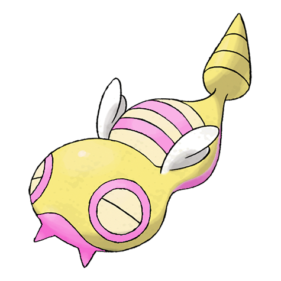

# Dunsparce (Land Snake Pokémon)

| Official Artwork | Shiny Artwork |
| --- | --- |
|  |  |

It digs into the ground with its tail and makes a mazelike nest. It can fly just a little.

---

## Media

### Cries

Latest (Gen VI+):

<audio controls>
<source src='../../assets/cries/dunsparce/latest.ogg' type='audio/ogg'>
  Your browser does not support the audio element.
</audio>

Legacy:

<audio controls>
<source src='../../assets/cries/dunsparce/legacy.ogg' type='audio/ogg'>
  Your browser does not support the audio element.
</audio>

---

## Pokédex Data

| National № | Type(s) | Height | Weight | Abilities | Local № |
|------------|---------|--------|--------|-----------|---------|
| #206 | {: width='48'} | 1.5 m | 14.0 kg | 1. Serene-Grace 2. Run-Away 3. Rattled | N/A |

---

## Base Stats
|   | HP | Attack | Defense | Sp. Atk | Sp. Def | Speed |
|---|----|--------|---------|---------|---------|-------|
| **Base** | 105 | 95 | 95 | 55 | 55 | 45 |
| **Min** | 320 | 175 | 175 | 103 | 103 | 85 |
| **Max** | 414 | 317 | 317 | 229 | 229 | 207 |

The ranges shown above are for a level 100 Pokémon. Maximum values are based on a beneficial nature, 252 EVs, 31 IVs; minimum values are based on a hindering nature, 0 EVs, 0 IVs.

---

## Forms & Evolutions

!!! warning "WARNING"

    Information on evolutions may not be 100% accurate; differences between evolution methods across generations are not accounted for.

### Forms

Dunsparce has no alternate forms.

### Evolution Line

1. [Dunsparce](dunsparce.md/)

---

## Training

| EV Yield | Catch Rate | Base Friendship | Base Exp. | Growth Rate | Held Items |
|----------|------------|-----------------|-----------|-------------|------------|
| 1 Hp | 190 | 50 | 145 | Medium | N/A |

---

## Breeding

| Egg Groups | Egg Cycles | Gender | Dimorphic | Color | Shape |
|------------|------------|--------|-----------|-------|-------|
| 1. Ground | 20 | 50.0% Male 50.0% Female | False | Yellow | Squiggle |

---

## Moves

!!! warning "WARNING"

    Specific move information may be incorrect. However, the general movepool should be accurate; this includes changes made in Renegade Platinum.

### Level Up Moves

| Lv. | Move | Type | Cat. | Power | Acc. | PP |
| --- | --- | --- | --- | --- | --- | --- |
| 1 | Defense Curl | {: width='48'} | {: width='36'} | — | — | 40 |
| 1 | Rage | {: width='48'} | {: width='36'} | 20 | 100 | 20 |
| 4 | Rollout | {: width='48'} | {: width='36'} | 30 | 90 | 20 |
| 7 | Spite | {: width='48'} | {: width='36'} | — | 100 | 10 |
| 11 | Pursuit | {: width='48'} | {: width='36'} | 40 | 100 | 20 |
| 13 | Screech | {: width='48'} | {: width='36'} | — | 85 | 40 |
| 15 | Mud Slap | {: width='48'} | {: width='36'} | 20 | 100 | 10 |
| 17 | Yawn | {: width='48'} | {: width='36'} | — | — | 10 |
| 19 | Ancient Power | {: width='48'} | {: width='36'} | 60 | 100 | 5 |
| 21 | Body Slam | {: width='48'} | {: width='36'} | 85 | 100 | 15 |
| 23 | Drill Run | {: width='48'} | {: width='36'} | 80 | 95 | 10 |
| 25 | Roost | {: width='48'} | {: width='36'} | — | — | 5 |
| 27 | Take Down | {: width='48'} | {: width='36'} | 90 | 85 | 20 |
| 29 | Dig | {: width='48'} | {: width='36'} | 80 | 100 | 10 |
| 31 | Glare | {: width='48'} | {: width='36'} | — | 100 | 30 |
| 33 | Double Edge | {: width='48'} | {: width='36'} | 120 | 100 | 15 |
| 35 | Endeavor | {: width='48'} | {: width='36'} | — | 100 | 5 |
| 37 | Air Slash | {: width='48'} | {: width='36'} | 75 | 95 | 15 |
| 39 | Dragon Rush | {: width='48'} | {: width='36'} | 100 | 75 | 10 |
| 41 | Endure | {: width='48'} | {: width='36'} | — | — | 10 |
| 43 | Flail | {: width='48'} | {: width='36'} | — | 100 | 15 |

### TM Moves

| TM | Move | Type | Cat. | Power | Acc. | PP |
| --- | --- | --- | --- | --- | --- | --- |
| HM04 | Strength | {: width='48'} | {: width='36'} | 100 | 100 | 15 |
| HM06 | Rock Smash | {: width='48'} | {: width='36'} | 60 | 100 | 15 |
| TM03 | Water Pulse | {: width='48'} | {: width='36'} | 60 | 100 | 20 |
| TM04 | Calm Mind | {: width='48'} | {: width='36'} | — | — | 20 |
| TM06 | Toxic | {: width='48'} | {: width='36'} | — | 90 | 10 |
| TM10 | Hidden Power | {: width='48'} | {: width='36'} | 60 | 100 | 15 |
| TM11 | Sunny Day | {: width='48'} | {: width='36'} | — | — | 5 |
| TM13 | Ice Beam | {: width='48'} | {: width='36'} | 90 | 100 | 10 |
| TM14 | Blizzard | {: width='48'} | {: width='36'} | 110 | 70 | 5 |
| TM17 | Protect | {: width='48'} | {: width='36'} | — | — | 10 |
| TM18 | Rain Dance | {: width='48'} | {: width='36'} | — | — | 5 |
| TM21 | Frustration | {: width='48'} | {: width='36'} | — | 100 | 20 |
| TM22 | Solar Beam | {: width='48'} | {: width='36'} | 120 | 100 | 10 |
| TM23 | Iron Tail | {: width='48'} | {: width='36'} | 100 | 75 | 15 |
| TM24 | Thunderbolt | {: width='48'} | {: width='36'} | 90 | 100 | 15 |
| TM25 | Thunder | {: width='48'} | {: width='36'} | 110 | 70 | 10 |
| TM26 | Earthquake | {: width='48'} | {: width='36'} | 100 | 100 | 10 |
| TM27 | Return | {: width='48'} | {: width='36'} | — | 100 | 20 |
| TM28 | Dig | {: width='48'} | {: width='36'} | 80 | 100 | 10 |
| TM30 | Shadow Ball | {: width='48'} | {: width='36'} | 80 | 100 | 15 |
| TM32 | Double Team | {: width='48'} | {: width='36'} | — | — | 15 |
| TM34 | Shock Wave | {: width='48'} | {: width='36'} | 60 | — | 20 |
| TM35 | Flamethrower | {: width='48'} | {: width='36'} | 90 | 100 | 15 |
| TM38 | Fire Blast | {: width='48'} | {: width='36'} | 110 | 85 | 5 |
| TM39 | Rock Tomb | {: width='48'} | {: width='36'} | 60 | 95 | 15 |
| TM42 | Facade | {: width='48'} | {: width='36'} | 70 | 100 | 20 |
| TM43 | Secret Power | {: width='48'} | {: width='36'} | 70 | 100 | 20 |
| TM44 | Rest | {: width='48'} | {: width='36'} | — | — | 5 |
| TM45 | Attract | {: width='48'} | {: width='36'} | — | 100 | 15 |
| TM46 | Thief | {: width='48'} | {: width='36'} | 60 | 100 | 25 |
| TM51 | Roost | {: width='48'} | {: width='36'} | — | — | 5 |
| TM57 | Charge Beam | {: width='48'} | {: width='36'} | 50 | 90 | 10 |
| TM58 | Endure | {: width='48'} | {: width='36'} | — | — | 10 |
| TM73 | Thunder Wave | {: width='48'} | {: width='36'} | — | 90 | 20 |
| TM74 | Gyro Ball | {: width='48'} | {: width='36'} | — | 100 | 5 |
| TM76 | Stealth Rock | {: width='48'} | {: width='36'} | — | — | 20 |
| TM77 | Psych Up | {: width='48'} | {: width='36'} | — | — | 10 |
| TM78 | Captivate | {: width='48'} | {: width='36'} | — | 100 | 20 |
| TM80 | Rock Slide | {: width='48'} | {: width='36'} | 75 | 90 | 10 |
| TM82 | Sleep Talk | {: width='48'} | {: width='36'} | — | — | 10 |
| TM83 | Natural Gift | {: width='48'} | {: width='36'} | — | 100 | 15 |
| TM84 | Poison Jab | {: width='48'} | {: width='36'} | 80 | 100 | 20 |
| TM85 | Dream Eater | {: width='48'} | {: width='36'} | 100 | 100 | 15 |
| TM87 | Swagger | {: width='48'} | {: width='36'} | — | 85 | 15 |
| TM90 | Substitute | {: width='48'} | {: width='36'} | — | — | 10 |

### Egg Moves

| Move | Type | Cat. | Power | Acc. | PP |
| --- | --- | --- | --- | --- | --- |
| Headbutt | {: width='48'} | {: width='36'} | 70 | 100 | 15 |
| Bite | {: width='48'} | {: width='36'} | 60 | 100 | 25 |
| Bide | {: width='48'} | {: width='36'} | — | — | 10 |
| Rock Slide | {: width='48'} | {: width='36'} | 75 | 90 | 10 |
| Snore | {: width='48'} | {: width='36'} | 50 | 100 | 15 |
| Curse | {: width='48'} | {: width='36'} | — | — | 10 |
| Ancient Power | {: width='48'} | {: width='36'} | 60 | 100 | 5 |
| Magic Coat | {: width='48'} | {: width='36'} | — | — | 15 |
| Astonish | {: width='48'} | {: width='36'} | 30 | 100 | 15 |
| Trump Card | {: width='48'} | {: width='36'} | — | — | 5 |

### Tutor Moves

| Move | Type | Cat. | Power | Acc. | PP |
| --- | --- | --- | --- | --- | --- |
| Snore | {: width='48'} | {: width='36'} | 50 | 100 | 15 |
| Spite | {: width='48'} | {: width='36'} | — | 100 | 10 |
| Mud Slap | {: width='48'} | {: width='36'} | 20 | 100 | 10 |
| Rollout | {: width='48'} | {: width='36'} | 30 | 90 | 20 |
| Ancient Power | {: width='48'} | {: width='36'} | 60 | 100 | 5 |
| Endeavor | {: width='48'} | {: width='36'} | — | 100 | 5 |
| Last Resort | {: width='48'} | {: width='36'} | 140 | 100 | 5 |
| Aqua Tail | {: width='48'} | {: width='36'} | 90 | 90 | 10 |
| Zen Headbutt | {: width='48'} | {: width='36'} | 80 | 90 | 15 |

