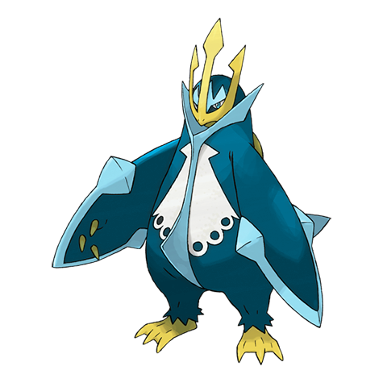

# Empoleon (Emperor Pokémon)

| Official Artwork | Shiny Artwork |
| --- | --- |
|  |  |

If anyone were to hurt its pride, it would slash them with wings that can cleave through an ice floe.

---

## Media

### Cries

Latest (Gen VI+):

<audio controls>
<source src='../../assets/cries/empoleon/latest.ogg' type='audio/ogg'>
  Your browser does not support the audio element.
</audio>

Legacy:

<audio controls>
<source src='../../assets/cries/empoleon/legacy.ogg' type='audio/ogg'>
  Your browser does not support the audio element.
</audio>

---

## Pokédex Data

| National № | Type(s) | Height | Weight | Abilities | Local № |
|------------|---------|--------|--------|-----------|---------|
| #395 | {: width='48'} {: width='48'} | 1.7 m | 84.5 kg | 1. Torrent 2. Vital-Spirit | #9 |

---

## Base Stats
|   | HP | Attack | Defense | Sp. Atk | Sp. Def | Speed |
|---|----|--------|---------|---------|---------|-------|
| **Base** | 84 | 86 | 88 | 116 | 101 | 60 |
| **Min** | 278 | 159 | 162 | 213 | 186 | 112 |
| **Max** | 372 | 298 | 302 | 364 | 331 | 240 |

The ranges shown above are for a level 100 Pokémon. Maximum values are based on a beneficial nature, 252 EVs, 31 IVs; minimum values are based on a hindering nature, 0 EVs, 0 IVs.

---

## Forms & Evolutions

!!! warning "WARNING"

    Information on evolutions may not be 100% accurate; differences between evolution methods across generations are not accounted for.

### Forms

Empoleon has no alternate forms.

### Evolution Line

1. [Piplup](piplup.md/)
    1. Level Up: [Prinplup](prinplup.md/)
        1. Level Up: [Empoleon](empoleon.md/)

---

## Training

| EV Yield | Catch Rate | Base Friendship | Base Exp. | Growth Rate | Held Items |
|----------|------------|-----------------|-----------|-------------|------------|
| 3 Special Attack | 45 | 70 | 239 | Medium-Slow | N/A |

---

## Breeding

| Egg Groups | Egg Cycles | Gender | Dimorphic | Color | Shape |
|------------|------------|--------|-----------|-------|-------|
| 1. Water1 2. Ground | 20 | 87.5% Male 12.5% Female | False | Blue | Upright |

---

## Moves

!!! warning "WARNING"

    Specific move information may be incorrect. However, the general movepool should be accurate; this includes changes made in Renegade Platinum.

### Level Up Moves

| Lv. | Move | Type | Cat. | Power | Acc. | PP |
| --- | --- | --- | --- | --- | --- | --- |
| 1 | Agility | {: width='48'} | {: width='36'} | — | — | 30 |
| 1 | Aqua Jet | {: width='48'} | {: width='36'} | 40 | 100 | 20 |
| 1 | Feather Dance | {: width='48'} | {: width='36'} | — | 100 | 15 |
| 1 | Growl | {: width='48'} | {: width='36'} | — | 100 | 40 |
| 1 | Tackle | {: width='48'} | {: width='36'} | 40 | 100 | 35 |
| 5 | Bubble | {: width='48'} | {: width='36'} | 40 | 100 | 30 |
| 8 | Swords Dance | {: width='48'} | {: width='36'} | — | — | 20 |
| 11 | Peck | {: width='48'} | {: width='36'} | 35 | 100 | 35 |
| 14 | Swagger | {: width='48'} | {: width='36'} | — | 85 | 15 |
| 16 | Metal Claw | {: width='48'} | {: width='36'} | 50 | 95 | 35 |
| 18 | Bubble Beam | {: width='48'} | {: width='36'} | 75 | 100 | 15 |
| 22 | Icy Wind | {: width='48'} | {: width='36'} | 55 | 95 | 15 |
| 26 | Scald | {: width='48'} | {: width='36'} | 80 | 100 | 15 |
| 30 | Fury Attack | {: width='48'} | {: width='36'} | 15 | 85 | 20 |
| 34 | Mist | {: width='48'} | {: width='36'} | — | — | 30 |
| 36 | Flash Cannon | {: width='48'} | {: width='36'} | 80 | 100 | 10 |
| 39 | Whirlpool | {: width='48'} | {: width='36'} | 35 | 85 | 15 |
| 44 | Yawn | {: width='48'} | {: width='36'} | — | — | 10 |
| 49 | Drill Peck | {: width='48'} | {: width='36'} | 80 | 100 | 20 |
| 54 | Hydro Pump | {: width='48'} | {: width='36'} | 110 | 80 | 5 |

### TM Moves

| TM | Move | Type | Cat. | Power | Acc. | PP |
| --- | --- | --- | --- | --- | --- | --- |
| HM01 | Cut | {: width='48'} | {: width='36'} | 60 | 100% | 25 |
| HM03 | Surf | {: width='48'} | {: width='36'} | 90 | 100 | 15 |
| HM04 | Strength | {: width='48'} | {: width='36'} | 100 | 100 | 15 |
| HM05 | Defog | {: width='48'} | {: width='36'} | — | — | 15 |
| HM06 | Rock Smash | {: width='48'} | {: width='36'} | 60 | 100 | 15 |
| HM07 | Waterfall | {: width='48'} | {: width='36'} | 80 | 100 | 15 |
| HM08 | Rock Climb | {: width='48'} | {: width='36'} | 80 | 95% | 10 |
| TM03 | Water Pulse | {: width='48'} | {: width='36'} | 60 | 100 | 20 |
| TM05 | Roar | {: width='48'} | {: width='36'} | — | — | 20 |
| TM06 | Toxic | {: width='48'} | {: width='36'} | — | 90 | 10 |
| TM07 | Hail | {: width='48'} | {: width='36'} | — | — | 10 |
| TM10 | Hidden Power | {: width='48'} | {: width='36'} | 60 | 100 | 15 |
| TM13 | Ice Beam | {: width='48'} | {: width='36'} | 90 | 100 | 10 |
| TM14 | Blizzard | {: width='48'} | {: width='36'} | 110 | 70 | 5 |
| TM15 | Hyper Beam | {: width='48'} | {: width='36'} | 150 | 90 | 5 |
| TM17 | Protect | {: width='48'} | {: width='36'} | — | — | 10 |
| TM18 | Rain Dance | {: width='48'} | {: width='36'} | — | — | 5 |
| TM21 | Frustration | {: width='48'} | {: width='36'} | — | 100 | 20 |
| TM26 | Earthquake | {: width='48'} | {: width='36'} | 100 | 100 | 10 |
| TM27 | Return | {: width='48'} | {: width='36'} | — | 100 | 20 |
| TM28 | Dig | {: width='48'} | {: width='36'} | 80 | 100 | 10 |
| TM31 | Brick Break | {: width='48'} | {: width='36'} | 75 | 100 | 15 |
| TM32 | Double Team | {: width='48'} | {: width='36'} | — | — | 15 |
| TM39 | Rock Tomb | {: width='48'} | {: width='36'} | 60 | 95 | 15 |
| TM40 | Aerial Ace | {: width='48'} | {: width='36'} | 60 | — | 20 |
| TM42 | Facade | {: width='48'} | {: width='36'} | 70 | 100 | 20 |
| TM43 | Secret Power | {: width='48'} | {: width='36'} | 70 | 100 | 20 |
| TM44 | Rest | {: width='48'} | {: width='36'} | — | — | 5 |
| TM45 | Attract | {: width='48'} | {: width='36'} | — | 100 | 15 |
| TM47 | Steel Wing | {: width='48'} | {: width='36'} | 70 | 90 | 25 |
| TM55 | Brine | {: width='48'} | {: width='36'} | 65 | 100 | 10 |
| TM56 | Fling | {: width='48'} | {: width='36'} | — | 100 | 10 |
| TM58 | Endure | {: width='48'} | {: width='36'} | — | — | 10 |
| TM65 | Shadow Claw | {: width='48'} | {: width='36'} | 80 | 100 | 15 |
| TM68 | Giga Impact | {: width='48'} | {: width='36'} | 150 | 90 | 5 |
| TM72 | Avalanche | {: width='48'} | {: width='36'} | 60 | 100 | 10 |
| TM75 | Swords Dance | {: width='48'} | {: width='36'} | — | — | 20 |
| TM76 | Stealth Rock | {: width='48'} | {: width='36'} | — | — | 20 |
| TM78 | Captivate | {: width='48'} | {: width='36'} | — | 100 | 20 |
| TM80 | Rock Slide | {: width='48'} | {: width='36'} | 75 | 90 | 10 |
| TM82 | Sleep Talk | {: width='48'} | {: width='36'} | — | — | 10 |
| TM83 | Natural Gift | {: width='48'} | {: width='36'} | — | 100 | 15 |
| TM86 | Grass Knot | {: width='48'} | {: width='36'} | — | 100 | 20 |
| TM87 | Swagger | {: width='48'} | {: width='36'} | — | 85 | 15 |
| TM88 | Pluck | {: width='48'} | {: width='36'} | 60 | 100 | 20 |
| TM90 | Substitute | {: width='48'} | {: width='36'} | — | — | 10 |
| TM91 | Flash Cannon | {: width='48'} | {: width='36'} | 80 | 100 | 10 |

### Egg Moves

Empoleon cannot learn any moves by breeding.
### Tutor Moves

| Move | Type | Cat. | Power | Acc. | PP |
| --- | --- | --- | --- | --- | --- |
| Snore | {: width='48'} | {: width='36'} | 50 | 100 | 15 |
| Mud Slap | {: width='48'} | {: width='36'} | 20 | 100 | 10 |
| Icy Wind | {: width='48'} | {: width='36'} | 55 | 95 | 15 |
| Fury Cutter | {: width='48'} | {: width='36'} | 40 | 95 | 20 |
| Knock Off | {: width='48'} | {: width='36'} | 65 | 100 | 20 |
| Dive | {: width='48'} | {: width='36'} | 80 | 100 | 10 |
| Hydro Cannon | {: width='48'} | {: width='36'} | 150 | 90 | 5 |
| Signal Beam | {: width='48'} | {: width='36'} | 75 | 100 | 15 |
| Iron Defense | {: width='48'} | {: width='36'} | — | — | 15 |

