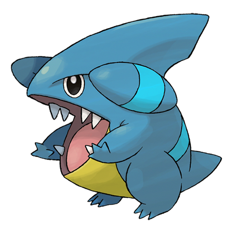

# Gible (Land Shark Pokémon)

| Official Artwork | Shiny Artwork |
| --- | --- |
|  |  |

It attacks using its huge mouth. While its attacks are powerful, it hurts itself out of clumsiness, too.

---

## Media

### Cries

Latest (Gen VI+):

<audio controls>
<source src='../../assets/cries/gible/latest.ogg' type='audio/ogg'>
  Your browser does not support the audio element.
</audio>

Legacy:

<audio controls>
<source src='../../assets/cries/gible/legacy.ogg' type='audio/ogg'>
  Your browser does not support the audio element.
</audio>

---

## Pokédex Data

| National № | Type(s) | Height | Weight | Abilities | Local № |
|------------|---------|--------|--------|-----------|---------|
| #443 | {: width='48'} {: width='48'} | 0.7 m | 20.5 kg | 1. Rough-Skin 2. Sand-Veil | #109 |

---

## Base Stats
|   | HP | Attack | Defense | Sp. Atk | Sp. Def | Speed |
|---|----|--------|---------|---------|---------|-------|
| **Base** | 58 | 70 | 45 | 40 | 45 | 42 |
| **Min** | 226 | 130 | 85 | 76 | 85 | 80 |
| **Max** | 320 | 262 | 207 | 196 | 207 | 201 |

The ranges shown above are for a level 100 Pokémon. Maximum values are based on a beneficial nature, 252 EVs, 31 IVs; minimum values are based on a hindering nature, 0 EVs, 0 IVs.

---

## Forms & Evolutions

!!! warning "WARNING"

    Information on evolutions may not be 100% accurate; differences between evolution methods across generations are not accounted for.

### Forms

Gible has no alternate forms.

### Evolution Line

1. [Gible](gible.md/)
    1. Level Up: [Gabite](gabite.md/)
        1. Level Up: [Garchomp](garchomp.md/)

---

## Training

| EV Yield | Catch Rate | Base Friendship | Base Exp. | Growth Rate | Held Items |
|----------|------------|-----------------|-----------|-------------|------------|
| 1 Attack | 45 | 50 | 60 | Slow | haban-berry (5%) |

---

## Breeding

| Egg Groups | Egg Cycles | Gender | Dimorphic | Color | Shape |
|------------|------------|--------|-----------|-------|-------|
| 1. Monster 2. Dragon | 40 | 50.0% Male 50.0% Female | True | Blue | Upright |

---

## Moves

!!! warning "WARNING"

    Specific move information may be incorrect. However, the general movepool should be accurate; this includes changes made in Renegade Platinum.

### Level Up Moves

| Lv. | Move | Type | Cat. | Power | Acc. | PP |
| --- | --- | --- | --- | --- | --- | --- |
| 1 | Dragon Breath | {: width='48'} | {: width='36'} | 60 | 100 | 20 |
| 1 | Sand Attack | {: width='48'} | {: width='36'} | — | 100 | 15 |
| 1 | Tackle | {: width='48'} | {: width='36'} | 40 | 100 | 35 |
| 7 | Dragon Breath | {: width='48'} | {: width='36'} | 60 | 100 | 20 |
| 10 | Bulldoze | {: width='48'} | {: width='36'} | 60 | 100 | 20 |
| 13 | Take Down | {: width='48'} | {: width='36'} | 90 | 85 | 20 |
| 16 | Dragon Rage | {: width='48'} | {: width='36'} | — | 100 | 10 |
| 19 | Sandstorm | {: width='48'} | {: width='36'} | — | — | 10 |
| 22 | Dig | {: width='48'} | {: width='36'} | 80 | 100 | 10 |
| 25 | Slash | {: width='48'} | {: width='36'} | 70 | 100 | 20 |
| 28 | Dragon Claw | {: width='48'} | {: width='36'} | 80 | 100 | 15 |
| 31 | Scary Face | {: width='48'} | {: width='36'} | — | 100 | 10 |
| 34 | Rock Slide | {: width='48'} | {: width='36'} | 75 | 90 | 10 |
| 37 | Earthquake | {: width='48'} | {: width='36'} | 100 | 100 | 10 |
| 40 | Dragon Rush | {: width='48'} | {: width='36'} | 100 | 75 | 10 |
| 43 | Iron Head | {: width='48'} | {: width='36'} | 80 | 100 | 15 |
| 46 | Stone Edge | {: width='48'} | {: width='36'} | 100 | 80 | 5 |
| 49 | Outrage | {: width='48'} | {: width='36'} | 120 | 100 | 10 |

### TM Moves

| TM | Move | Type | Cat. | Power | Acc. | PP |
| --- | --- | --- | --- | --- | --- | --- |
| HM01 | Cut | {: width='48'} | {: width='36'} | 60 | 100% | 25 |
| HM04 | Strength | {: width='48'} | {: width='36'} | 100 | 100 | 15 |
| HM06 | Rock Smash | {: width='48'} | {: width='36'} | 60 | 100 | 15 |
| HM08 | Rock Climb | {: width='48'} | {: width='36'} | 80 | 95% | 10 |
| TM02 | Dragon Claw | {: width='48'} | {: width='36'} | 80 | 100 | 15 |
| TM05 | Roar | {: width='48'} | {: width='36'} | — | — | 20 |
| TM06 | Toxic | {: width='48'} | {: width='36'} | — | 90 | 10 |
| TM10 | Hidden Power | {: width='48'} | {: width='36'} | 60 | 100 | 15 |
| TM11 | Sunny Day | {: width='48'} | {: width='36'} | — | — | 5 |
| TM17 | Protect | {: width='48'} | {: width='36'} | — | — | 10 |
| TM18 | Rain Dance | {: width='48'} | {: width='36'} | — | — | 5 |
| TM21 | Frustration | {: width='48'} | {: width='36'} | — | 100 | 20 |
| TM26 | Earthquake | {: width='48'} | {: width='36'} | 100 | 100 | 10 |
| TM27 | Return | {: width='48'} | {: width='36'} | — | 100 | 20 |
| TM28 | Dig | {: width='48'} | {: width='36'} | 80 | 100 | 10 |
| TM32 | Double Team | {: width='48'} | {: width='36'} | — | — | 15 |
| TM35 | Flamethrower | {: width='48'} | {: width='36'} | 90 | 100 | 15 |
| TM37 | Sandstorm | {: width='48'} | {: width='36'} | — | — | 10 |
| TM38 | Fire Blast | {: width='48'} | {: width='36'} | 110 | 85 | 5 |
| TM39 | Rock Tomb | {: width='48'} | {: width='36'} | 60 | 95 | 15 |
| TM40 | Aerial Ace | {: width='48'} | {: width='36'} | 60 | — | 20 |
| TM42 | Facade | {: width='48'} | {: width='36'} | 70 | 100 | 20 |
| TM43 | Secret Power | {: width='48'} | {: width='36'} | 70 | 100 | 20 |
| TM44 | Rest | {: width='48'} | {: width='36'} | — | — | 5 |
| TM45 | Attract | {: width='48'} | {: width='36'} | — | 100 | 15 |
| TM58 | Endure | {: width='48'} | {: width='36'} | — | — | 10 |
| TM59 | Dragon Pulse | {: width='48'} | {: width='36'} | 85 | 100 | 10 |
| TM65 | Shadow Claw | {: width='48'} | {: width='36'} | 80 | 100 | 15 |
| TM71 | Stone Edge | {: width='48'} | {: width='36'} | 100 | 80 | 5 |
| TM76 | Stealth Rock | {: width='48'} | {: width='36'} | — | — | 20 |
| TM78 | Captivate | {: width='48'} | {: width='36'} | — | 100 | 20 |
| TM80 | Rock Slide | {: width='48'} | {: width='36'} | 75 | 90 | 10 |
| TM82 | Sleep Talk | {: width='48'} | {: width='36'} | — | — | 10 |
| TM83 | Natural Gift | {: width='48'} | {: width='36'} | — | 100 | 15 |
| TM87 | Swagger | {: width='48'} | {: width='36'} | — | 85 | 15 |
| TM90 | Substitute | {: width='48'} | {: width='36'} | — | — | 10 |

### Egg Moves

| Move | Type | Cat. | Power | Acc. | PP |
| --- | --- | --- | --- | --- | --- |
| Body Slam | {: width='48'} | {: width='36'} | 85 | 100 | 15 |
| Thrash | {: width='48'} | {: width='36'} | 120 | 100 | 10 |
| Double Edge | {: width='48'} | {: width='36'} | 120 | 100 | 15 |
| Scary Face | {: width='48'} | {: width='36'} | — | 100 | 10 |
| Outrage | {: width='48'} | {: width='36'} | 120 | 100 | 10 |
| Dragon Breath | {: width='48'} | {: width='36'} | 60 | 100 | 20 |
| Metal Claw | {: width='48'} | {: width='36'} | 50 | 95 | 35 |
| Twister | {: width='48'} | {: width='36'} | 40 | 100 | 20 |
| Sand Tomb | {: width='48'} | {: width='36'} | 35 | 85 | 15 |
| Iron Head | {: width='48'} | {: width='36'} | 80 | 100 | 15 |

### Tutor Moves

| Move | Type | Cat. | Power | Acc. | PP |
| --- | --- | --- | --- | --- | --- |
| Swift | {: width='48'} | {: width='36'} | 60 | — | 20 |
| Snore | {: width='48'} | {: width='36'} | 50 | 100 | 15 |
| Mud Slap | {: width='48'} | {: width='36'} | 20 | 100 | 10 |
| Outrage | {: width='48'} | {: width='36'} | 120 | 100 | 10 |
| Fury Cutter | {: width='48'} | {: width='36'} | 40 | 95 | 20 |
| Twister | {: width='48'} | {: width='36'} | 40 | 100 | 20 |
| Earth Power | {: width='48'} | {: width='36'} | 90 | 100 | 10 |
| Draco Meteor | {: width='48'} | {: width='36'} | 130 | 90 | 5 |
| Iron Head | {: width='48'} | {: width='36'} | 80 | 100 | 15 |

