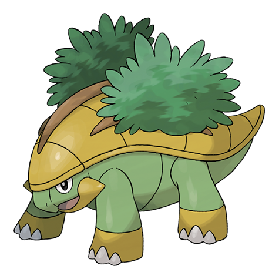
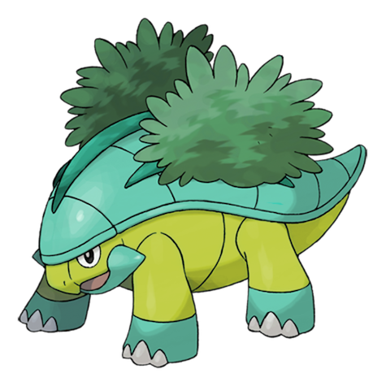

# Grotle (Grove Pokémon)

| Official Artwork | Shiny Artwork |
| --- | --- |
|  |  |

It knows where pure water wells up. It carries fellow Pokémon there on its back.

---

## Media

### Cries

No cries available.

---

## Pokédex Data

| National № | Type(s) | Height | Weight | Abilities | Local № |
|------------|---------|--------|--------|-----------|---------|
| #388 | {: width='48'} | 1.1 m | 97.0 kg | 1. Overgrow 2. Shell-Armor | #2 |

---

## Base Stats
|   | HP | Attack | Defense | Sp. Atk | Sp. Def | Speed |
|---|----|--------|---------|---------|---------|-------|
| **Base** | 75 | 89 | 85 | 55 | 65 | 36 |
| **Min** | 260 | 164 | 157 | 103 | 121 | 69 |
| **Max** | 354 | 304 | 295 | 229 | 251 | 188 |

The ranges shown above are for a level 100 Pokémon. Maximum values are based on a beneficial nature, 252 EVs, 31 IVs; minimum values are based on a hindering nature, 0 EVs, 0 IVs.

---

## Forms & Evolutions

!!! warning "WARNING"

    Information on evolutions may not be 100% accurate; differences between evolution methods across generations are not accounted for.

### Forms

Grotle has no alternate forms.

### Evolution Line

1. [Turtwig](turtwig.md/)
    1. Level Up: [Grotle](grotle.md/)
        1. Level Up: [Torterra](torterra.md/)

---

## Training

| EV Yield | Catch Rate | Base Friendship | Base Exp. | Growth Rate | Held Items |
|----------|------------|-----------------|-----------|-------------|------------|
| 1 Attack 1 Defense | 45 | 70 | 142 | Medium-Slow | N/A |

---

## Breeding

| Egg Groups | Egg Cycles | Gender | Dimorphic | Color | Shape |
|------------|------------|--------|-----------|-------|-------|
| 1. Monster 2. Plant | 20 | 87.5% Male 12.5% Female | False | Green | Quadruped |

---

## Moves

!!! warning "WARNING"

    Specific move information may be incorrect. However, the general movepool should be accurate; this includes changes made in Renegade Platinum.

### Level Up Moves

| Lv. | Move | Type | Cat. | Power | Acc. | PP |
| --- | --- | --- | --- | --- | --- | --- |
| 1 | Tackle | {: width='48'} | {: width='36'} | 40 | 100 | 35 |
| 1 | Withdraw | {: width='48'} | {: width='36'} | — | — | 40 |
| 5 | Absorb | {: width='48'} | {: width='36'} | 20 | 100 | 25 |
| 8 | Razor Leaf | {: width='48'} | {: width='36'} | 55 | 95 | 25 |
| 11 | Curse | {: width='48'} | {: width='36'} | — | — | 10 |
| 14 | Bullet Seed | {: width='48'} | {: width='36'} | 25 | 100 | 30 |
| 17 | Bite | {: width='48'} | {: width='36'} | 60 | 100 | 25 |
| 18 | Bulldoze | {: width='48'} | {: width='36'} | 60 | 100 | 20 |
| 21 | Mega Drain | {: width='48'} | {: width='36'} | 40 | 100 | 15 |
| 25 | Seed Bomb | {: width='48'} | {: width='36'} | 80 | 100 | 15 |
| 29 | Leech Seed | {: width='48'} | {: width='36'} | — | 90 | 10 |
| 33 | Crunch | {: width='48'} | {: width='36'} | 80 | 100 | 15 |
| 37 | Body Slam | {: width='48'} | {: width='36'} | 85 | 100 | 15 |
| 41 | Synthesis | {: width='48'} | {: width='36'} | — | — | 5 |
| 45 | Giga Drain | {: width='48'} | {: width='36'} | 75 | 100 | 10 |
| 49 | Leaf Storm | {: width='48'} | {: width='36'} | 130 | 90 | 5 |

### TM Moves

| TM | Move | Type | Cat. | Power | Acc. | PP |
| --- | --- | --- | --- | --- | --- | --- |
| HM01 | Cut | {: width='48'} | {: width='36'} | 60 | 100% | 25 |
| HM04 | Strength | {: width='48'} | {: width='36'} | 100 | 100 | 15 |
| HM06 | Rock Smash | {: width='48'} | {: width='36'} | 60 | 100 | 15 |
| HM08 | Rock Climb | {: width='48'} | {: width='36'} | 80 | 95% | 10 |
| TM06 | Toxic | {: width='48'} | {: width='36'} | — | 90 | 10 |
| TM09 | Bullet Seed | {: width='48'} | {: width='36'} | 25 | 100 | 30 |
| TM10 | Hidden Power | {: width='48'} | {: width='36'} | 60 | 100 | 15 |
| TM11 | Sunny Day | {: width='48'} | {: width='36'} | — | — | 5 |
| TM16 | Light Screen | {: width='48'} | {: width='36'} | — | — | 30 |
| TM17 | Protect | {: width='48'} | {: width='36'} | — | — | 10 |
| TM19 | Giga Drain | {: width='48'} | {: width='36'} | 75 | 100 | 10 |
| TM20 | Safeguard | {: width='48'} | {: width='36'} | — | — | 25 |
| TM21 | Frustration | {: width='48'} | {: width='36'} | — | 100 | 20 |
| TM22 | Solar Beam | {: width='48'} | {: width='36'} | 120 | 100 | 10 |
| TM23 | Iron Tail | {: width='48'} | {: width='36'} | 100 | 75 | 15 |
| TM27 | Return | {: width='48'} | {: width='36'} | — | 100 | 20 |
| TM32 | Double Team | {: width='48'} | {: width='36'} | — | — | 15 |
| TM33 | Reflect | {: width='48'} | {: width='36'} | — | — | 20 |
| TM42 | Facade | {: width='48'} | {: width='36'} | 70 | 100 | 20 |
| TM43 | Secret Power | {: width='48'} | {: width='36'} | 70 | 100 | 20 |
| TM44 | Rest | {: width='48'} | {: width='36'} | — | — | 5 |
| TM45 | Attract | {: width='48'} | {: width='36'} | — | 100 | 15 |
| TM53 | Energy Ball | {: width='48'} | {: width='36'} | 90 | 100 | 10 |
| TM58 | Endure | {: width='48'} | {: width='36'} | — | — | 10 |
| TM70 | Flash | {: width='48'} | {: width='36'} | — | 100 | 20 |
| TM75 | Swords Dance | {: width='48'} | {: width='36'} | — | — | 20 |
| TM76 | Stealth Rock | {: width='48'} | {: width='36'} | — | — | 20 |
| TM78 | Captivate | {: width='48'} | {: width='36'} | — | 100 | 20 |
| TM82 | Sleep Talk | {: width='48'} | {: width='36'} | — | — | 10 |
| TM83 | Natural Gift | {: width='48'} | {: width='36'} | — | 100 | 15 |
| TM86 | Grass Knot | {: width='48'} | {: width='36'} | — | 100 | 20 |
| TM87 | Swagger | {: width='48'} | {: width='36'} | — | 85 | 15 |
| TM90 | Substitute | {: width='48'} | {: width='36'} | — | — | 10 |

### Egg Moves

Grotle cannot learn any moves by breeding.
### Tutor Moves

| Move | Type | Cat. | Power | Acc. | PP |
| --- | --- | --- | --- | --- | --- |
| Snore | {: width='48'} | {: width='36'} | 50 | 100 | 15 |
| Mud Slap | {: width='48'} | {: width='36'} | 20 | 100 | 10 |
| Synthesis | {: width='48'} | {: width='36'} | — | — | 5 |
| Superpower | {: width='48'} | {: width='36'} | 120 | 100 | 5 |
| Seed Bomb | {: width='48'} | {: width='36'} | 80 | 100 | 15 |
| Earth Power | {: width='48'} | {: width='36'} | 90 | 100 | 10 |

