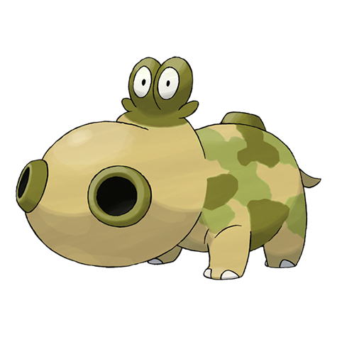

# Hippopotas (Hippo Pokémon)

| Official Artwork | Shiny Artwork |
| --- | --- |
|  |  |

It shuts its nostrils tight then travels through sand as if walking. They form colonies of around ten.

---

## Media

### Cries

Latest (Gen VI+):

<audio controls>
<source src='../../assets/cries/hippopotas/latest.ogg' type='audio/ogg'>
  Your browser does not support the audio element.
</audio>

Legacy:

<audio controls>
<source src='../../assets/cries/hippopotas/legacy.ogg' type='audio/ogg'>
  Your browser does not support the audio element.
</audio>

---

## Pokédex Data

| National № | Type(s) | Height | Weight | Abilities | Local № |
|------------|---------|--------|--------|-----------|---------|
| #449 | {: width='48'} | 0.8 m | 49.5 kg | 1. Sand-Stream 2. Sand-Force | #122 |

---

## Base Stats
|   | HP | Attack | Defense | Sp. Atk | Sp. Def | Speed |
|---|----|--------|---------|---------|---------|-------|
| **Base** | 68 | 72 | 78 | 38 | 42 | 32 |
| **Min** | 246 | 134 | 144 | 72 | 80 | 62 |
| **Max** | 340 | 267 | 280 | 192 | 201 | 179 |

The ranges shown above are for a level 100 Pokémon. Maximum values are based on a beneficial nature, 252 EVs, 31 IVs; minimum values are based on a hindering nature, 0 EVs, 0 IVs.

---

## Forms & Evolutions

!!! warning "WARNING"

    Information on evolutions may not be 100% accurate; differences between evolution methods across generations are not accounted for.

### Forms

Hippopotas has no alternate forms.

### Evolution Line

1. [Hippopotas](hippopotas.md/)
    1. Level Up: [Hippowdon](hippowdon.md/)

---

## Training

| EV Yield | Catch Rate | Base Friendship | Base Exp. | Growth Rate | Held Items |
|----------|------------|-----------------|-----------|-------------|------------|
| 1 Defense | 140 | 50 | 66 | Slow | N/A |

---

## Breeding

| Egg Groups | Egg Cycles | Gender | Dimorphic | Color | Shape |
|------------|------------|--------|-----------|-------|-------|
| 1. Ground | 30 | 50.0% Male 50.0% Female | True | Brown | Quadruped |

---

## Moves

!!! warning "WARNING"

    Specific move information may be incorrect. However, the general movepool should be accurate; this includes changes made in Renegade Platinum.

### Level Up Moves

| Lv. | Move | Type | Cat. | Power | Acc. | PP |
| --- | --- | --- | --- | --- | --- | --- |
| 1 | Curse | {: width='48'} | {: width='36'} | — | — | 10 |
| 1 | Sand Attack | {: width='48'} | {: width='36'} | — | 100 | 15 |
| 1 | Tackle | {: width='48'} | {: width='36'} | 40 | 100 | 35 |
| 7 | Bite | {: width='48'} | {: width='36'} | 60 | 100 | 25 |
| 11 | Yawn | {: width='48'} | {: width='36'} | — | — | 10 |
| 15 | Bulldoze | {: width='48'} | {: width='36'} | 60 | 100 | 20 |
| 19 | Take Down | {: width='48'} | {: width='36'} | 90 | 85 | 20 |
| 23 | Dig | {: width='48'} | {: width='36'} | 80 | 100 | 10 |
| 27 | Crunch | {: width='48'} | {: width='36'} | 80 | 100 | 15 |
| 31 | Body Slam | {: width='48'} | {: width='36'} | 85 | 100 | 15 |
| 35 | Slack Off | {: width='48'} | {: width='36'} | — | — | 5 |
| 39 | Earthquake | {: width='48'} | {: width='36'} | 100 | 100 | 10 |
| 43 | Stealth Rock | {: width='48'} | {: width='36'} | — | — | 20 |
| 47 | Double Edge | {: width='48'} | {: width='36'} | 120 | 100 | 15 |
| 51 | Fissure | {: width='48'} | {: width='36'} | — | 30 | 5 |
| 55 | Superpower | {: width='48'} | {: width='36'} | 120 | 100 | 5 |

### TM Moves

| TM | Move | Type | Cat. | Power | Acc. | PP |
| --- | --- | --- | --- | --- | --- | --- |
| HM04 | Strength | {: width='48'} | {: width='36'} | 100 | 100 | 15 |
| HM06 | Rock Smash | {: width='48'} | {: width='36'} | 60 | 100 | 15 |
| TM03 | Water Pulse | {: width='48'} | {: width='36'} | 60 | 100 | 20 |
| TM05 | Roar | {: width='48'} | {: width='36'} | — | — | 20 |
| TM06 | Toxic | {: width='48'} | {: width='36'} | — | 90 | 10 |
| TM10 | Hidden Power | {: width='48'} | {: width='36'} | 60 | 100 | 15 |
| TM11 | Sunny Day | {: width='48'} | {: width='36'} | — | — | 5 |
| TM17 | Protect | {: width='48'} | {: width='36'} | — | — | 10 |
| TM21 | Frustration | {: width='48'} | {: width='36'} | — | 100 | 20 |
| TM23 | Iron Tail | {: width='48'} | {: width='36'} | 100 | 75 | 15 |
| TM26 | Earthquake | {: width='48'} | {: width='36'} | 100 | 100 | 10 |
| TM27 | Return | {: width='48'} | {: width='36'} | — | 100 | 20 |
| TM32 | Double Team | {: width='48'} | {: width='36'} | — | — | 15 |
| TM37 | Sandstorm | {: width='48'} | {: width='36'} | — | — | 10 |
| TM39 | Rock Tomb | {: width='48'} | {: width='36'} | 60 | 95 | 15 |
| TM42 | Facade | {: width='48'} | {: width='36'} | 70 | 100 | 20 |
| TM43 | Secret Power | {: width='48'} | {: width='36'} | 70 | 100 | 20 |
| TM44 | Rest | {: width='48'} | {: width='36'} | — | — | 5 |
| TM45 | Attract | {: width='48'} | {: width='36'} | — | 100 | 15 |
| TM58 | Endure | {: width='48'} | {: width='36'} | — | — | 10 |
| TM76 | Stealth Rock | {: width='48'} | {: width='36'} | — | — | 20 |
| TM78 | Captivate | {: width='48'} | {: width='36'} | — | 100 | 20 |
| TM80 | Rock Slide | {: width='48'} | {: width='36'} | 75 | 90 | 10 |
| TM82 | Sleep Talk | {: width='48'} | {: width='36'} | — | — | 10 |
| TM83 | Natural Gift | {: width='48'} | {: width='36'} | — | 100 | 15 |
| TM87 | Swagger | {: width='48'} | {: width='36'} | — | 85 | 15 |
| TM90 | Substitute | {: width='48'} | {: width='36'} | — | — | 10 |

### Egg Moves

| Move | Type | Cat. | Power | Acc. | PP |
| --- | --- | --- | --- | --- | --- |
| Body Slam | {: width='48'} | {: width='36'} | 85 | 100 | 15 |
| Curse | {: width='48'} | {: width='36'} | — | — | 10 |
| Stockpile | {: width='48'} | {: width='36'} | — | — | 20 |
| Spit Up | {: width='48'} | {: width='36'} | — | 100 | 10 |
| Swallow | {: width='48'} | {: width='36'} | — | — | 10 |
| Slack Off | {: width='48'} | {: width='36'} | — | — | 5 |
| Sand Tomb | {: width='48'} | {: width='36'} | 35 | 85 | 15 |

### Tutor Moves

| Move | Type | Cat. | Power | Acc. | PP |
| --- | --- | --- | --- | --- | --- |
| Snore | {: width='48'} | {: width='36'} | 50 | 100 | 15 |
| Mud Slap | {: width='48'} | {: width='36'} | 20 | 100 | 10 |
| Superpower | {: width='48'} | {: width='36'} | 120 | 100 | 5 |
| Earth Power | {: width='48'} | {: width='36'} | 90 | 100 | 10 |

