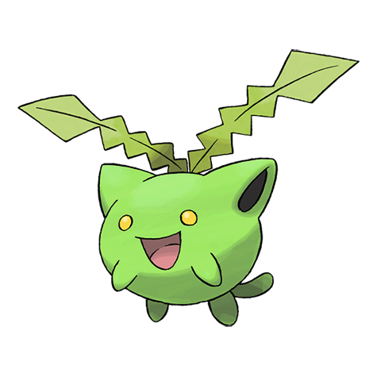

# Hoppip (Cottonweed Pokémon)

| Official Artwork | Shiny Artwork |
| --- | --- |
|  |  |

It drifts on winds. It is said that when HOPPIP gather in fields and mountains, spring is on the way.

---

## Media

### Cries

Latest (Gen VI+):

<audio controls>
<source src='../../assets/cries/hoppip/latest.ogg' type='audio/ogg'>
  Your browser does not support the audio element.
</audio>

Legacy:

<audio controls>
<source src='../../assets/cries/hoppip/legacy.ogg' type='audio/ogg'>
  Your browser does not support the audio element.
</audio>

---

## Pokédex Data

| National № | Type(s) | Height | Weight | Abilities | Local № |
|------------|---------|--------|--------|-----------|---------|
| #187 | {: width='48'} {: width='48'} | 0.4 m | 0.5 kg | 1. Chlorophyll 2. Leaf-Guard 3. Infiltrator | N/A |

---

## Base Stats
|   | HP | Attack | Defense | Sp. Atk | Sp. Def | Speed |
|---|----|--------|---------|---------|---------|-------|
| **Base** | 35 | 35 | 40 | 45 | 55 | 50 |
| **Min** | 180 | 67 | 76 | 85 | 103 | 94 |
| **Max** | 274 | 185 | 196 | 207 | 229 | 218 |

The ranges shown above are for a level 100 Pokémon. Maximum values are based on a beneficial nature, 252 EVs, 31 IVs; minimum values are based on a hindering nature, 0 EVs, 0 IVs.

---

## Forms & Evolutions

!!! warning "WARNING"

    Information on evolutions may not be 100% accurate; differences between evolution methods across generations are not accounted for.

### Forms

Hoppip has no alternate forms.

### Evolution Line

1. [Hoppip](hoppip.md/)
    1. Level Up: [Skiploom](skiploom.md/)
        1. Level Up: [Jumpluff](jumpluff.md/)

---

## Training

| EV Yield | Catch Rate | Base Friendship | Base Exp. | Growth Rate | Held Items |
|----------|------------|-----------------|-----------|-------------|------------|
| 1 Special Defense | 255 | 70 | 50 | Medium-Slow | N/A |

---

## Breeding

| Egg Groups | Egg Cycles | Gender | Dimorphic | Color | Shape |
|------------|------------|--------|-----------|-------|-------|
| 1. Fairy 2. Plant | 20 | 50.0% Male 50.0% Female | False | Pink | Upright |

---

## Moves

!!! warning "WARNING"

    Specific move information may be incorrect. However, the general movepool should be accurate; this includes changes made in Renegade Platinum.

### Level Up Moves

| Lv. | Move | Type | Cat. | Power | Acc. | PP |
| --- | --- | --- | --- | --- | --- | --- |
| 1 | Absorb | {: width='48'} | {: width='36'} | 20 | 100 | 25 |
| 1 | Splash | {: width='48'} | {: width='36'} | — | — | 40 |
| 1 | Tackle | {: width='48'} | {: width='36'} | 40 | 100 | 35 |
| 5 | Synthesis | {: width='48'} | {: width='36'} | — | — | 5 |
| 7 | Tail Whip | {: width='48'} | {: width='36'} | — | 100 | 30 |
| 9 | Bullet Seed | {: width='48'} | {: width='36'} | 25 | 100 | 30 |
| 11 | Air Cutter | {: width='48'} | {: width='36'} | 60 | 95 | 25 |
| 13 | Mega Drain | {: width='48'} | {: width='36'} | 40 | 100 | 15 |
| 15 | Poison Powder | {: width='48'} | {: width='36'} | — | 75 | 35 |
| 15 | Sleep Powder | {: width='48'} | {: width='36'} | — | 75 | 15 |
| 15 | Stun Spore | {: width='48'} | {: width='36'} | — | 75 | 30 |
| 17 | Leech Seed | {: width='48'} | {: width='36'} | — | 90 | 10 |
| 19 | Cotton Spore | {: width='48'} | {: width='36'} | — | 100 | 40 |
| 21 | Worry Seed | {: width='48'} | {: width='36'} | — | 100 | 10 |
| 23 | Giga Drain | {: width='48'} | {: width='36'} | 75 | 100 | 10 |
| 25 | Air Slash | {: width='48'} | {: width='36'} | 75 | 95 | 15 |
| 27 | U Turn | {: width='48'} | {: width='36'} | 70 | 100 | 20 |
| 29 | Worry Seed | {: width='48'} | {: width='36'} | — | 100 | 10 |
| 31 | Energy Ball | {: width='48'} | {: width='36'} | 90 | 100 | 10 |
| 33 | Aromatherapy | {: width='48'} | {: width='36'} | — | — | 5 |
| 35 | Memento | {: width='48'} | {: width='36'} | — | 100 | 10 |

### TM Moves

| TM | Move | Type | Cat. | Power | Acc. | PP |
| --- | --- | --- | --- | --- | --- | --- |
| TM06 | Toxic | {: width='48'} | {: width='36'} | — | 90 | 10 |
| TM09 | Bullet Seed | {: width='48'} | {: width='36'} | 25 | 100 | 30 |
| TM10 | Hidden Power | {: width='48'} | {: width='36'} | 60 | 100 | 15 |
| TM11 | Sunny Day | {: width='48'} | {: width='36'} | — | — | 5 |
| TM17 | Protect | {: width='48'} | {: width='36'} | — | — | 10 |
| TM19 | Giga Drain | {: width='48'} | {: width='36'} | 75 | 100 | 10 |
| TM21 | Frustration | {: width='48'} | {: width='36'} | — | 100 | 20 |
| TM22 | Solar Beam | {: width='48'} | {: width='36'} | 120 | 100 | 10 |
| TM27 | Return | {: width='48'} | {: width='36'} | — | 100 | 20 |
| TM32 | Double Team | {: width='48'} | {: width='36'} | — | — | 15 |
| TM40 | Aerial Ace | {: width='48'} | {: width='36'} | 60 | — | 20 |
| TM42 | Facade | {: width='48'} | {: width='36'} | 70 | 100 | 20 |
| TM43 | Secret Power | {: width='48'} | {: width='36'} | 70 | 100 | 20 |
| TM44 | Rest | {: width='48'} | {: width='36'} | — | — | 5 |
| TM45 | Attract | {: width='48'} | {: width='36'} | — | 100 | 15 |
| TM53 | Energy Ball | {: width='48'} | {: width='36'} | 90 | 100 | 10 |
| TM58 | Endure | {: width='48'} | {: width='36'} | — | — | 10 |
| TM62 | Silver Wind | {: width='48'} | {: width='36'} | 60 | 100 | 5 |
| TM70 | Flash | {: width='48'} | {: width='36'} | — | 100 | 20 |
| TM75 | Swords Dance | {: width='48'} | {: width='36'} | — | — | 20 |
| TM78 | Captivate | {: width='48'} | {: width='36'} | — | 100 | 20 |
| TM82 | Sleep Talk | {: width='48'} | {: width='36'} | — | — | 10 |
| TM83 | Natural Gift | {: width='48'} | {: width='36'} | — | 100 | 15 |
| TM86 | Grass Knot | {: width='48'} | {: width='36'} | — | 100 | 20 |
| TM87 | Swagger | {: width='48'} | {: width='36'} | — | 85 | 15 |
| TM89 | U Turn | {: width='48'} | {: width='36'} | 70 | 100 | 20 |
| TM90 | Substitute | {: width='48'} | {: width='36'} | — | — | 10 |

### Egg Moves

| Move | Type | Cat. | Power | Acc. | PP |
| --- | --- | --- | --- | --- | --- |
| Double Edge | {: width='48'} | {: width='36'} | 120 | 100 | 15 |
| Confusion | {: width='48'} | {: width='36'} | 50 | 100 | 25 |
| Reflect | {: width='48'} | {: width='36'} | — | — | 20 |
| Amnesia | {: width='48'} | {: width='36'} | — | — | 20 |
| Encore | {: width='48'} | {: width='36'} | — | 100 | 5 |
| Psych Up | {: width='48'} | {: width='36'} | — | — | 10 |
| Helping Hand | {: width='48'} | {: width='36'} | — | — | 20 |
| Aromatherapy | {: width='48'} | {: width='36'} | — | — | 5 |
| Worry Seed | {: width='48'} | {: width='36'} | — | 100 | 10 |

### Tutor Moves

| Move | Type | Cat. | Power | Acc. | PP |
| --- | --- | --- | --- | --- | --- |
| Snore | {: width='48'} | {: width='36'} | 50 | 100 | 15 |
| Synthesis | {: width='48'} | {: width='36'} | — | — | 5 |
| Helping Hand | {: width='48'} | {: width='36'} | — | — | 20 |
| Bounce | {: width='48'} | {: width='36'} | 85 | 85 | 5 |
| Seed Bomb | {: width='48'} | {: width='36'} | 80 | 100 | 15 |

