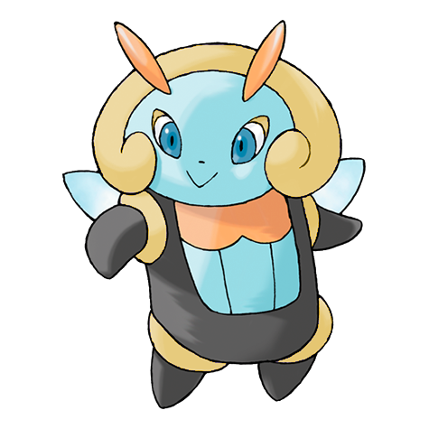

# Illumise (Firefly Pokémon)

| Official Artwork | Shiny Artwork |
| --- | --- |
|  |  |

With its sweet aroma, it guides VOLBEAT to draw signs with light in the night sky.

---

## Media

### Cries

No cries available.

---

## Pokédex Data

| National № | Type(s) | Height | Weight | Abilities | Local № |
|------------|---------|--------|--------|-----------|---------|
| #314 | {: width='48'} {: width='48'} | 0.6 m | 17.7 kg | 1. Tinted-Lens 2. Oblivious | N/A |

---

## Base Stats
|   | HP | Attack | Defense | Sp. Atk | Sp. Def | Speed |
|---|----|--------|---------|---------|---------|-------|
| **Base** | 65 | 33 | 85 | 97 | 85 | 100 |
| **Min** | 240 | 63 | 157 | 179 | 157 | 184 |
| **Max** | 334 | 181 | 295 | 322 | 295 | 328 |

The ranges shown above are for a level 100 Pokémon. Maximum values are based on a beneficial nature, 252 EVs, 31 IVs; minimum values are based on a hindering nature, 0 EVs, 0 IVs.

---

## Forms & Evolutions

!!! warning "WARNING"

    Information on evolutions may not be 100% accurate; differences between evolution methods across generations are not accounted for.

### Forms

Illumise has no alternate forms.

### Evolution Line

1. [Illumise](illumise.md/)

---

## Training

| EV Yield | Catch Rate | Base Friendship | Base Exp. | Growth Rate | Held Items |
|----------|------------|-----------------|-----------|-------------|------------|
| 1 Speed | 150 | 70 | 151 | Fast-Then-Very-Slow |  |

---

## Breeding

| Egg Groups | Egg Cycles | Gender | Dimorphic | Color | Shape |
|------------|------------|--------|-----------|-------|-------|
| 1. Bug 2. Humanshape | 15 | 0.0% Male 100.0% Female | False | Purple | Humanoid |

---

## Moves

!!! warning "WARNING"

    Specific move information may be incorrect. However, the general movepool should be accurate; this includes changes made in Renegade Platinum.

### Level Up Moves

| Lv. | Move | Type | Cat. | Power | Acc. | PP |
| --- | --- | --- | --- | --- | --- | --- |
| 1 | Tackle | {: width='48'} | {: width='36'} | 40 | 100 | 35 |
| 1 | Trick | {: width='48'} | {: width='36'} | — | 100 | 10 |
| 6 | Sweet Scent | {: width='48'} | {: width='36'} | — | 100 | 20 |
| 9 | Charm | {: width='48'} | {: width='36'} | — | 100 | 20 |
| 12 | Quick Attack | {: width='48'} | {: width='36'} | 40 | 100 | 30 |
| 15 | Silver Wind | {: width='48'} | {: width='36'} | 60 | 100 | 5 |
| 18 | Draining Kiss | {: width='48'} | {: width='36'} | 75 | 100 | 10 |
| 21 | Moonlight | {: width='48'} | {: width='36'} | — | — | 5 |
| 24 | Encore | {: width='48'} | {: width='36'} | — | 100 | 5 |
| 27 | Wish | {: width='48'} | {: width='36'} | — | — | 10 |
| 30 | Flatter | {: width='48'} | {: width='36'} | — | 100 | 15 |
| 33 | Moonblast | {: width='48'} | {: width='36'} | 95 | 100 | 15 |
| 36 | Bug Buzz | {: width='48'} | {: width='36'} | 90 | 100 | 10 |
| 39 | Zen Headbutt | {: width='48'} | {: width='36'} | 80 | 90 | 15 |
| 42 | Play Rough | {: width='48'} | {: width='36'} | 90 | 90 | 10 |
| 45 | Helping Hand | {: width='48'} | {: width='36'} | — | — | 20 |
| 48 | Covet | {: width='48'} | {: width='36'} | 60 | 100 | 25 |
| 51 | Baton Pass | {: width='48'} | {: width='36'} | — | — | 40 |
| 54 | Thunder | {: width='48'} | {: width='36'} | 110 | 70 | 10 |

### TM Moves

| TM | Move | Type | Cat. | Power | Acc. | PP |
| --- | --- | --- | --- | --- | --- | --- |
| TBD | Bug Buzz | {: width='48'} | {: width='36'} | 90 | 100 | 10 |
| TM01 | Focus Punch | {: width='48'} | {: width='36'} | 150 | 100 | 20 |
| TM03 | Water Pulse | {: width='48'} | {: width='36'} | 60 | 100 | 20 |
| TM06 | Toxic | {: width='48'} | {: width='36'} | — | 90 | 10 |
| TM10 | Hidden Power | {: width='48'} | {: width='36'} | 60 | 100 | 15 |
| TM11 | Sunny Day | {: width='48'} | {: width='36'} | — | — | 5 |
| TM16 | Light Screen | {: width='48'} | {: width='36'} | — | — | 30 |
| TM17 | Protect | {: width='48'} | {: width='36'} | — | — | 10 |
| TM18 | Rain Dance | {: width='48'} | {: width='36'} | — | — | 5 |
| TM19 | Giga Drain | {: width='48'} | {: width='36'} | 75 | 100 | 10 |
| TM21 | Frustration | {: width='48'} | {: width='36'} | — | 100 | 20 |
| TM22 | Solar Beam | {: width='48'} | {: width='36'} | 120 | 100 | 10 |
| TM24 | Thunderbolt | {: width='48'} | {: width='36'} | 90 | 100 | 15 |
| TM25 | Thunder | {: width='48'} | {: width='36'} | 110 | 70 | 10 |
| TM27 | Return | {: width='48'} | {: width='36'} | — | 100 | 20 |
| TM30 | Shadow Ball | {: width='48'} | {: width='36'} | 80 | 100 | 15 |
| TM31 | Brick Break | {: width='48'} | {: width='36'} | 75 | 100 | 15 |
| TM32 | Double Team | {: width='48'} | {: width='36'} | — | — | 15 |
| TM34 | Shock Wave | {: width='48'} | {: width='36'} | 60 | — | 20 |
| TM40 | Aerial Ace | {: width='48'} | {: width='36'} | 60 | — | 20 |
| TM42 | Facade | {: width='48'} | {: width='36'} | 70 | 100 | 20 |
| TM43 | Secret Power | {: width='48'} | {: width='36'} | 70 | 100 | 20 |
| TM44 | Rest | {: width='48'} | {: width='36'} | — | — | 5 |
| TM45 | Attract | {: width='48'} | {: width='36'} | — | 100 | 15 |
| TM46 | Thief | {: width='48'} | {: width='36'} | 60 | 100 | 25 |
| TM51 | Roost | {: width='48'} | {: width='36'} | — | — | 5 |
| TM56 | Fling | {: width='48'} | {: width='36'} | — | 100 | 10 |
| TM57 | Charge Beam | {: width='48'} | {: width='36'} | 50 | 90 | 10 |
| TM58 | Endure | {: width='48'} | {: width='36'} | — | — | 10 |
| TM62 | Silver Wind | {: width='48'} | {: width='36'} | 60 | 100 | 5 |
| TM70 | Flash | {: width='48'} | {: width='36'} | — | 100 | 20 |
| TM73 | Thunder Wave | {: width='48'} | {: width='36'} | — | 90 | 20 |
| TM77 | Psych Up | {: width='48'} | {: width='36'} | — | — | 10 |
| TM78 | Captivate | {: width='48'} | {: width='36'} | — | 100 | 20 |
| TM82 | Sleep Talk | {: width='48'} | {: width='36'} | — | — | 10 |
| TM83 | Natural Gift | {: width='48'} | {: width='36'} | — | 100 | 15 |
| TM87 | Swagger | {: width='48'} | {: width='36'} | — | 85 | 15 |
| TM89 | U Turn | {: width='48'} | {: width='36'} | 70 | 100 | 20 |
| TM90 | Substitute | {: width='48'} | {: width='36'} | — | — | 10 |

### Egg Moves

| Move | Type | Cat. | Power | Acc. | PP |
| --- | --- | --- | --- | --- | --- |
| Growth | {: width='48'} | {: width='36'} | — | — | 20 |
| Baton Pass | {: width='48'} | {: width='36'} | — | — | 40 |
| Encore | {: width='48'} | {: width='36'} | — | 100 | 5 |
| Silver Wind | {: width='48'} | {: width='36'} | 60 | 100 | 5 |
| Bug Buzz | {: width='48'} | {: width='36'} | 90 | 100 | 10 |

### Tutor Moves

| Move | Type | Cat. | Power | Acc. | PP |
| --- | --- | --- | --- | --- | --- |
| Ice Punch | {: width='48'} | {: width='36'} | 75 | 100 | 15 |
| Thunder Punch | {: width='48'} | {: width='36'} | 75 | 100 | 15 |
| Swift | {: width='48'} | {: width='36'} | 60 | — | 20 |
| Snore | {: width='48'} | {: width='36'} | 50 | 100 | 15 |
| Mud Slap | {: width='48'} | {: width='36'} | 20 | 100 | 10 |
| Helping Hand | {: width='48'} | {: width='36'} | — | — | 20 |
| Air Cutter | {: width='48'} | {: width='36'} | 60 | 95 | 25 |
| Zen Headbutt | {: width='48'} | {: width='36'} | 80 | 90 | 15 |
| Ominous Wind | {: width='48'} | {: width='36'} | 60 | 100 | 5 |

