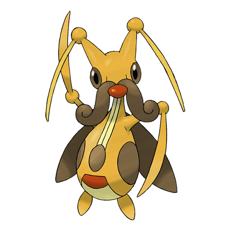

# Kricketune (Cricket Pokémon)

| Official Artwork | Shiny Artwork |
| --- | --- |
|  |  |

There is a village that hosts a contest based on the amazingly variable cries of this Pokémon.

---

## Media

### Cries

No cries available.

---

## Pokédex Data

| National № | Type(s) | Height | Weight | Abilities | Local № |
|------------|---------|--------|--------|-----------|---------|
| #402 | {: width='48'} | 1.0 m | 25.5 kg | 1. Technician 2. Swarm | #16 |

---

## Base Stats
|   | HP | Attack | Defense | Sp. Atk | Sp. Def | Speed |
|---|----|--------|---------|---------|---------|-------|
| **Base** | 80 | 115 | 70 | 50 | 70 | 65 |
| **Min** | 270 | 211 | 130 | 94 | 130 | 121 |
| **Max** | 364 | 361 | 262 | 218 | 262 | 251 |

The ranges shown above are for a level 100 Pokémon. Maximum values are based on a beneficial nature, 252 EVs, 31 IVs; minimum values are based on a hindering nature, 0 EVs, 0 IVs.

---

## Forms & Evolutions

!!! warning "WARNING"

    Information on evolutions may not be 100% accurate; differences between evolution methods across generations are not accounted for.

### Forms

Kricketune has no alternate forms.

### Evolution Line

1. [Kricketot](kricketot.md/)
    1. Level Up: [Kricketune](kricketune.md/)

---

## Training

| EV Yield | Catch Rate | Base Friendship | Base Exp. | Growth Rate | Held Items |
|----------|------------|-----------------|-----------|-------------|------------|
| 2 Attack | 45 | 70 | 134 | Medium-Slow | metronome (5%) |

---

## Breeding

| Egg Groups | Egg Cycles | Gender | Dimorphic | Color | Shape |
|------------|------------|--------|-----------|-------|-------|
| 1. Bug | 15 | 50.0% Male 50.0% Female | True | Red | Bug-Wings |

---

## Moves

!!! warning "WARNING"

    Specific move information may be incorrect. However, the general movepool should be accurate; this includes changes made in Renegade Platinum.

### Level Up Moves

| Lv. | Move | Type | Cat. | Power | Acc. | PP |
| --- | --- | --- | --- | --- | --- | --- |
| 1 | Bide | {: width='48'} | {: width='36'} | — | — | 10 |
| 1 | Bug Bite | {: width='48'} | {: width='36'} | 60 | 100 | 20 |
| 1 | Fury Cutter | {: width='48'} | {: width='36'} | 40 | 95 | 20 |
| 1 | Growl | {: width='48'} | {: width='36'} | — | 100 | 40 |
| 1 | Perish Song | {: width='48'} | {: width='36'} | — | — | 5 |
| 1 | String Shot | {: width='48'} | {: width='36'} | — | 95 | 40 |
| 10 | Fury Cutter | {: width='48'} | {: width='36'} | 40 | 95 | 20 |
| 13 | Absorb | {: width='48'} | {: width='36'} | 20 | 100 | 25 |
| 16 | Sing | {: width='48'} | {: width='36'} | — | 55 | 15 |
| 19 | Leech Life | {: width='48'} | {: width='36'} | 80 | 100 | 10 |
| 22 | Focus Energy | {: width='48'} | {: width='36'} | — | — | 30 |
| 25 | Night Slash | {: width='48'} | {: width='36'} | 70 | 100 | 15 |
| 25 | Slash | {: width='48'} | {: width='36'} | 70 | 100 | 20 |
| 28 | X Scissor | {: width='48'} | {: width='36'} | 80 | 100 | 15 |
| 31 | Screech | {: width='48'} | {: width='36'} | — | 85 | 40 |
| 34 | Knock Off | {: width='48'} | {: width='36'} | 65 | 100 | 20 |
| 37 | Taunt | {: width='48'} | {: width='36'} | — | 100 | 20 |
| 40 | Heal Bell | {: width='48'} | {: width='36'} | — | — | 5 |
| 43 | Bug Buzz | {: width='48'} | {: width='36'} | 90 | 100 | 10 |
| 46 | Hyper Voice | {: width='48'} | {: width='36'} | 90 | 100 | 10 |
| 49 | Perish Song | {: width='48'} | {: width='36'} | — | — | 5 |

### TM Moves

| TM | Move | Type | Cat. | Power | Acc. | PP |
| --- | --- | --- | --- | --- | --- | --- |
| TBD | Bug Buzz | {: width='48'} | {: width='36'} | 90 | 100 | 10 |
| HM01 | Cut | {: width='48'} | {: width='36'} | 60 | 100% | 25 |
| HM04 | Strength | {: width='48'} | {: width='36'} | 100 | 100 | 15 |
| HM06 | Rock Smash | {: width='48'} | {: width='36'} | 60 | 100 | 15 |
| TM06 | Toxic | {: width='48'} | {: width='36'} | — | 90 | 10 |
| TM10 | Hidden Power | {: width='48'} | {: width='36'} | 60 | 100 | 15 |
| TM11 | Sunny Day | {: width='48'} | {: width='36'} | — | — | 5 |
| TM15 | Hyper Beam | {: width='48'} | {: width='36'} | 150 | 90 | 5 |
| TM17 | Protect | {: width='48'} | {: width='36'} | — | — | 10 |
| TM18 | Rain Dance | {: width='48'} | {: width='36'} | — | — | 5 |
| TM21 | Frustration | {: width='48'} | {: width='36'} | — | 100 | 20 |
| TM27 | Return | {: width='48'} | {: width='36'} | — | 100 | 20 |
| TM31 | Brick Break | {: width='48'} | {: width='36'} | 75 | 100 | 15 |
| TM32 | Double Team | {: width='48'} | {: width='36'} | — | — | 15 |
| TM40 | Aerial Ace | {: width='48'} | {: width='36'} | 60 | — | 20 |
| TM42 | Facade | {: width='48'} | {: width='36'} | 70 | 100 | 20 |
| TM43 | Secret Power | {: width='48'} | {: width='36'} | 70 | 100 | 20 |
| TM44 | Rest | {: width='48'} | {: width='36'} | — | — | 5 |
| TM45 | Attract | {: width='48'} | {: width='36'} | — | 100 | 15 |
| TM54 | False Swipe | {: width='48'} | {: width='36'} | 40 | 100 | 40 |
| TM58 | Endure | {: width='48'} | {: width='36'} | — | — | 10 |
| TM62 | Silver Wind | {: width='48'} | {: width='36'} | 60 | 100 | 5 |
| TM68 | Giga Impact | {: width='48'} | {: width='36'} | 150 | 90 | 5 |
| TM70 | Flash | {: width='48'} | {: width='36'} | — | 100 | 20 |
| TM75 | Swords Dance | {: width='48'} | {: width='36'} | — | — | 20 |
| TM78 | Captivate | {: width='48'} | {: width='36'} | — | 100 | 20 |
| TM81 | X Scissor | {: width='48'} | {: width='36'} | 80 | 100 | 15 |
| TM82 | Sleep Talk | {: width='48'} | {: width='36'} | — | — | 10 |
| TM83 | Natural Gift | {: width='48'} | {: width='36'} | — | 100 | 15 |
| TM87 | Swagger | {: width='48'} | {: width='36'} | — | 85 | 15 |
| TM90 | Substitute | {: width='48'} | {: width='36'} | — | — | 10 |

### Egg Moves

Kricketune cannot learn any moves by breeding.
### Tutor Moves

| Move | Type | Cat. | Power | Acc. | PP |
| --- | --- | --- | --- | --- | --- |
| Snore | {: width='48'} | {: width='36'} | 50 | 100 | 15 |
| Mud Slap | {: width='48'} | {: width='36'} | 20 | 100 | 10 |
| Fury Cutter | {: width='48'} | {: width='36'} | 40 | 95 | 20 |
| Uproar | {: width='48'} | {: width='36'} | 90 | 100 | 10 |
| Knock Off | {: width='48'} | {: width='36'} | 65 | 100 | 20 |
| Endeavor | {: width='48'} | {: width='36'} | — | 100 | 5 |

