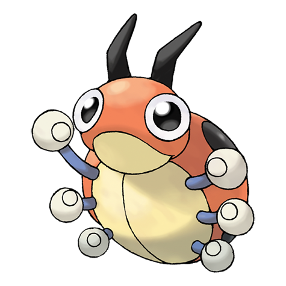
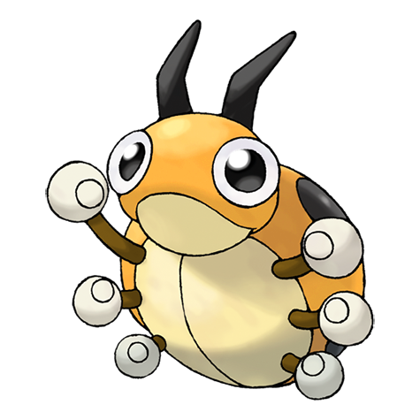

# Ledyba (Five Star Pokémon)

| Official Artwork | Shiny Artwork |
| --- | --- |
|  |  |

It is so timid, it can’t move if it isn’t with a swarm of others. It conveys its feelings with scent.

---

## Media

### Cries

No cries available.

---

## Pokédex Data

| National № | Type(s) | Height | Weight | Abilities | Local № |
|------------|---------|--------|--------|-----------|---------|
| #165 | {: width='48'} {: width='48'} | 1.0 m | 10.8 kg | 1. Technician 2. Iron-Fist | N/A |

---

## Base Stats
|   | HP | Attack | Defense | Sp. Atk | Sp. Def | Speed |
|---|----|--------|---------|---------|---------|-------|
| **Base** | 40 | 50 | 30 | 20 | 80 | 55 |
| **Min** | 190 | 94 | 58 | 40 | 148 | 103 |
| **Max** | 284 | 218 | 174 | 152 | 284 | 229 |

The ranges shown above are for a level 100 Pokémon. Maximum values are based on a beneficial nature, 252 EVs, 31 IVs; minimum values are based on a hindering nature, 0 EVs, 0 IVs.

---

## Forms & Evolutions

!!! warning "WARNING"

    Information on evolutions may not be 100% accurate; differences between evolution methods across generations are not accounted for.

### Forms

Ledyba has no alternate forms.

### Evolution Line

1. [Ledyba](ledyba.md/)
    1. Level Up: [Ledian](ledian.md/)

---

## Training

| EV Yield | Catch Rate | Base Friendship | Base Exp. | Growth Rate | Held Items |
|----------|------------|-----------------|-----------|-------------|------------|
| 1 Special Defense | 255 | 70 | 53 | Fast | N/A |

---

## Breeding

| Egg Groups | Egg Cycles | Gender | Dimorphic | Color | Shape |
|------------|------------|--------|-----------|-------|-------|
| 1. Bug | 15 | 50.0% Male 50.0% Female | True | Red | Wings |

---

## Moves

!!! warning "WARNING"

    Specific move information may be incorrect. However, the general movepool should be accurate; this includes changes made in Renegade Platinum.

### Level Up Moves

| Lv. | Move | Type | Cat. | Power | Acc. | PP |
| --- | --- | --- | --- | --- | --- | --- |
| 1 | Comet Punch | {: width='48'} | {: width='36'} | 18 | 85 | 15 |
| 1 | Supersonic | {: width='48'} | {: width='36'} | — | 55 | 20 |
| 1 | Tackle | {: width='48'} | {: width='36'} | 40 | 100 | 35 |
| 7 | Swift | {: width='48'} | {: width='36'} | 60 | — | 20 |
| 9 | Bug Bite | {: width='48'} | {: width='36'} | 60 | 100 | 20 |
| 11 | Light Screen | {: width='48'} | {: width='36'} | — | — | 30 |
| 11 | Reflect | {: width='48'} | {: width='36'} | — | — | 20 |
| 11 | Safeguard | {: width='48'} | {: width='36'} | — | — | 25 |
| 13 | Mach Punch | {: width='48'} | {: width='36'} | 40 | 100 | 30 |
| 15 | Aerial Ace | {: width='48'} | {: width='36'} | 60 | — | 20 |
| 18 | Silver Wind | {: width='48'} | {: width='36'} | 60 | 100 | 5 |
| 21 | U Turn | {: width='48'} | {: width='36'} | 70 | 100 | 20 |
| 24 | Baton Pass | {: width='48'} | {: width='36'} | — | — | 40 |
| 27 | Knock Off | {: width='48'} | {: width='36'} | 65 | 100 | 20 |
| 30 | Agility | {: width='48'} | {: width='36'} | — | — | 30 |
| 33 | Air Slash | {: width='48'} | {: width='36'} | 75 | 95 | 15 |
| 36 | Bug Buzz | {: width='48'} | {: width='36'} | 90 | 100 | 10 |
| 39 | Double Edge | {: width='48'} | {: width='36'} | 120 | 100 | 15 |
| 42 | Meteor Mash | {: width='48'} | {: width='36'} | 90 | 90 | 10 |

### TM Moves

| TM | Move | Type | Cat. | Power | Acc. | PP |
| --- | --- | --- | --- | --- | --- | --- |
| TBD | Bug Buzz | {: width='48'} | {: width='36'} | 90 | 100 | 10 |
| TM01 | Focus Punch | {: width='48'} | {: width='36'} | 150 | 100 | 20 |
| TM06 | Toxic | {: width='48'} | {: width='36'} | — | 90 | 10 |
| TM10 | Hidden Power | {: width='48'} | {: width='36'} | 60 | 100 | 15 |
| TM11 | Sunny Day | {: width='48'} | {: width='36'} | — | — | 5 |
| TM16 | Light Screen | {: width='48'} | {: width='36'} | — | — | 30 |
| TM17 | Protect | {: width='48'} | {: width='36'} | — | — | 10 |
| TM19 | Giga Drain | {: width='48'} | {: width='36'} | 75 | 100 | 10 |
| TM20 | Safeguard | {: width='48'} | {: width='36'} | — | — | 25 |
| TM21 | Frustration | {: width='48'} | {: width='36'} | — | 100 | 20 |
| TM22 | Solar Beam | {: width='48'} | {: width='36'} | 120 | 100 | 10 |
| TM27 | Return | {: width='48'} | {: width='36'} | — | 100 | 20 |
| TM28 | Dig | {: width='48'} | {: width='36'} | 80 | 100 | 10 |
| TM31 | Brick Break | {: width='48'} | {: width='36'} | 75 | 100 | 15 |
| TM32 | Double Team | {: width='48'} | {: width='36'} | — | — | 15 |
| TM33 | Reflect | {: width='48'} | {: width='36'} | — | — | 20 |
| TM40 | Aerial Ace | {: width='48'} | {: width='36'} | 60 | — | 20 |
| TM42 | Facade | {: width='48'} | {: width='36'} | 70 | 100 | 20 |
| TM43 | Secret Power | {: width='48'} | {: width='36'} | 70 | 100 | 20 |
| TM44 | Rest | {: width='48'} | {: width='36'} | — | — | 5 |
| TM45 | Attract | {: width='48'} | {: width='36'} | — | 100 | 15 |
| TM46 | Thief | {: width='48'} | {: width='36'} | 60 | 100 | 25 |
| TM51 | Roost | {: width='48'} | {: width='36'} | — | — | 5 |
| TM56 | Fling | {: width='48'} | {: width='36'} | — | 100 | 10 |
| TM58 | Endure | {: width='48'} | {: width='36'} | — | — | 10 |
| TM60 | Drain Punch | {: width='48'} | {: width='36'} | 75 | 100 | 10 |
| TM62 | Silver Wind | {: width='48'} | {: width='36'} | 60 | 100 | 5 |
| TM70 | Flash | {: width='48'} | {: width='36'} | — | 100 | 20 |
| TM75 | Swords Dance | {: width='48'} | {: width='36'} | — | — | 20 |
| TM78 | Captivate | {: width='48'} | {: width='36'} | — | 100 | 20 |
| TM82 | Sleep Talk | {: width='48'} | {: width='36'} | — | — | 10 |
| TM83 | Natural Gift | {: width='48'} | {: width='36'} | — | 100 | 15 |
| TM87 | Swagger | {: width='48'} | {: width='36'} | — | 85 | 15 |
| TM89 | U Turn | {: width='48'} | {: width='36'} | 70 | 100 | 20 |
| TM90 | Substitute | {: width='48'} | {: width='36'} | — | — | 10 |

### Egg Moves

| Move | Type | Cat. | Power | Acc. | PP |
| --- | --- | --- | --- | --- | --- |
| Psybeam | {: width='48'} | {: width='36'} | 65 | 100 | 20 |
| Screech | {: width='48'} | {: width='36'} | — | 85 | 40 |
| Bide | {: width='48'} | {: width='36'} | — | — | 10 |
| Encore | {: width='48'} | {: width='36'} | — | 100 | 5 |
| Knock Off | {: width='48'} | {: width='36'} | 65 | 100 | 20 |
| Silver Wind | {: width='48'} | {: width='36'} | 60 | 100 | 5 |
| Bug Buzz | {: width='48'} | {: width='36'} | 90 | 100 | 10 |
| Bug Bite | {: width='48'} | {: width='36'} | 60 | 100 | 20 |

### Tutor Moves

| Move | Type | Cat. | Power | Acc. | PP |
| --- | --- | --- | --- | --- | --- |
| Ice Punch | {: width='48'} | {: width='36'} | 75 | 100 | 15 |
| Thunder Punch | {: width='48'} | {: width='36'} | 75 | 100 | 15 |
| Swift | {: width='48'} | {: width='36'} | 60 | — | 20 |
| Snore | {: width='48'} | {: width='36'} | 50 | 100 | 15 |
| Rollout | {: width='48'} | {: width='36'} | 30 | 90 | 20 |
| Uproar | {: width='48'} | {: width='36'} | 90 | 100 | 10 |
| Knock Off | {: width='48'} | {: width='36'} | 65 | 100 | 20 |
| Air Cutter | {: width='48'} | {: width='36'} | 60 | 95 | 25 |
| Ominous Wind | {: width='48'} | {: width='36'} | 60 | 100 | 5 |

