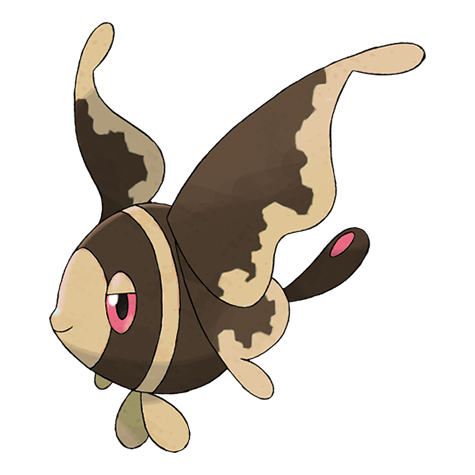

# Lumineon (Neon Pokémon)

| Official Artwork | Shiny Artwork |
| --- | --- |
|  |  |

It crawls along the seafloor using its long front fins like legs. It competes for food with LANTURN.

---

## Media

### Cries

Latest (Gen VI+):

<audio controls>
<source src='../../assets/cries/lumineon/latest.ogg' type='audio/ogg'>
  Your browser does not support the audio element.
</audio>

Legacy:

<audio controls>
<source src='../../assets/cries/lumineon/legacy.ogg' type='audio/ogg'>
  Your browser does not support the audio element.
</audio>

---

## Pokédex Data

| National № | Type(s) | Height | Weight | Abilities | Local № |
|------------|---------|--------|--------|-----------|---------|
| #457 | {: width='48'} | 1.2 m | 24.0 kg | 1. Swift-Swim 2. Storm-Drain 3. Water-Veil | #135 |

---

## Base Stats
|   | HP | Attack | Defense | Sp. Atk | Sp. Def | Speed |
|---|----|--------|---------|---------|---------|-------|
| **Base** | 70 | 40 | 75 | 105 | 90 | 105 |
| **Min** | 250 | 76 | 139 | 193 | 166 | 193 |
| **Max** | 344 | 196 | 273 | 339 | 306 | 339 |

The ranges shown above are for a level 100 Pokémon. Maximum values are based on a beneficial nature, 252 EVs, 31 IVs; minimum values are based on a hindering nature, 0 EVs, 0 IVs.

---

## Forms & Evolutions

!!! warning "WARNING"

    Information on evolutions may not be 100% accurate; differences between evolution methods across generations are not accounted for.

### Forms

Lumineon has no alternate forms.

### Evolution Line

1. [Finneon](finneon.md/)
    1. Level Up: [Lumineon](lumineon.md/)

---

## Training

| EV Yield | Catch Rate | Base Friendship | Base Exp. | Growth Rate | Held Items |
|----------|------------|-----------------|-----------|-------------|------------|
| 2 Speed | 75 | 70 | 161 | Slow-Then-Very-Fast | rindo-berry (5%) |

---

## Breeding

| Egg Groups | Egg Cycles | Gender | Dimorphic | Color | Shape |
|------------|------------|--------|-----------|-------|-------|
| 1. Water2 | 20 | 50.0% Male 50.0% Female | True | Blue | Fish |

---

## Moves

!!! warning "WARNING"

    Specific move information may be incorrect. However, the general movepool should be accurate; this includes changes made in Renegade Platinum.

### Level Up Moves

| Lv. | Move | Type | Cat. | Power | Acc. | PP |
| --- | --- | --- | --- | --- | --- | --- |
| 1 | Charm | {: width='48'} | {: width='36'} | — | 100 | 20 |
| 1 | Hydro Pump | {: width='48'} | {: width='36'} | 110 | 80 | 5 |
| 1 | Icy Wind | {: width='48'} | {: width='36'} | 55 | 95 | 15 |
| 1 | Ominous Wind | {: width='48'} | {: width='36'} | 60 | 100 | 5 |
| 1 | Pound | {: width='48'} | {: width='36'} | 40 | 100 | 35 |
| 6 | Water Gun | {: width='48'} | {: width='36'} | 40 | 100 | 25 |
| 9 | Attract | {: width='48'} | {: width='36'} | — | 100 | 15 |
| 12 | Rain Dance | {: width='48'} | {: width='36'} | — | — | 5 |
| 15 | Gust | {: width='48'} | {: width='36'} | 40 | 100 | 35 |
| 18 | Water Pulse | {: width='48'} | {: width='36'} | 60 | 100 | 20 |
| 21 | Psybeam | {: width='48'} | {: width='36'} | 65 | 100 | 20 |
| 24 | Captivate | {: width='48'} | {: width='36'} | — | 100 | 20 |
| 27 | Safeguard | {: width='48'} | {: width='36'} | — | — | 25 |
| 30 | Aqua Tail | {: width='48'} | {: width='36'} | 90 | 90 | 10 |
| 34 | Silver Wind | {: width='48'} | {: width='36'} | 60 | 100 | 5 |
| 38 | Aqua Ring | {: width='48'} | {: width='36'} | — | — | 20 |
| 42 | Whirlpool | {: width='48'} | {: width='36'} | 35 | 85 | 15 |
| 46 | U Turn | {: width='48'} | {: width='36'} | 70 | 100 | 20 |
| 50 | Bounce | {: width='48'} | {: width='36'} | 85 | 85 | 5 |
| 54 | Hydro Pump | {: width='48'} | {: width='36'} | 110 | 80 | 5 |

### TM Moves

| TM | Move | Type | Cat. | Power | Acc. | PP |
| --- | --- | --- | --- | --- | --- | --- |
| TBD | Hurricane | {: width='48'} | {: width='36'} | 110 | 70 | 10 |
| HM03 | Surf | {: width='48'} | {: width='36'} | 90 | 100 | 15 |
| HM05 | Defog | {: width='48'} | {: width='36'} | — | — | 15 |
| HM07 | Waterfall | {: width='48'} | {: width='36'} | 80 | 100 | 15 |
| TM03 | Water Pulse | {: width='48'} | {: width='36'} | 60 | 100 | 20 |
| TM06 | Toxic | {: width='48'} | {: width='36'} | — | 90 | 10 |
| TM07 | Hail | {: width='48'} | {: width='36'} | — | — | 10 |
| TM10 | Hidden Power | {: width='48'} | {: width='36'} | 60 | 100 | 15 |
| TM13 | Ice Beam | {: width='48'} | {: width='36'} | 90 | 100 | 10 |
| TM14 | Blizzard | {: width='48'} | {: width='36'} | 110 | 70 | 5 |
| TM15 | Hyper Beam | {: width='48'} | {: width='36'} | 150 | 90 | 5 |
| TM17 | Protect | {: width='48'} | {: width='36'} | — | — | 10 |
| TM18 | Rain Dance | {: width='48'} | {: width='36'} | — | — | 5 |
| TM20 | Safeguard | {: width='48'} | {: width='36'} | — | — | 25 |
| TM21 | Frustration | {: width='48'} | {: width='36'} | — | 100 | 20 |
| TM27 | Return | {: width='48'} | {: width='36'} | — | 100 | 20 |
| TM32 | Double Team | {: width='48'} | {: width='36'} | — | — | 15 |
| TM42 | Facade | {: width='48'} | {: width='36'} | 70 | 100 | 20 |
| TM43 | Secret Power | {: width='48'} | {: width='36'} | 70 | 100 | 20 |
| TM44 | Rest | {: width='48'} | {: width='36'} | — | — | 5 |
| TM45 | Attract | {: width='48'} | {: width='36'} | — | 100 | 15 |
| TM55 | Brine | {: width='48'} | {: width='36'} | 65 | 100 | 10 |
| TM58 | Endure | {: width='48'} | {: width='36'} | — | — | 10 |
| TM62 | Silver Wind | {: width='48'} | {: width='36'} | 60 | 100 | 5 |
| TM66 | Payback | {: width='48'} | {: width='36'} | 50 | 100 | 10 |
| TM68 | Giga Impact | {: width='48'} | {: width='36'} | 150 | 90 | 5 |
| TM70 | Flash | {: width='48'} | {: width='36'} | — | 100 | 20 |
| TM77 | Psych Up | {: width='48'} | {: width='36'} | — | — | 10 |
| TM78 | Captivate | {: width='48'} | {: width='36'} | — | 100 | 20 |
| TM82 | Sleep Talk | {: width='48'} | {: width='36'} | — | — | 10 |
| TM83 | Natural Gift | {: width='48'} | {: width='36'} | — | 100 | 15 |
| TM87 | Swagger | {: width='48'} | {: width='36'} | — | 85 | 15 |
| TM89 | U Turn | {: width='48'} | {: width='36'} | 70 | 100 | 20 |
| TM90 | Substitute | {: width='48'} | {: width='36'} | — | — | 10 |

### Egg Moves

Lumineon cannot learn any moves by breeding.
### Tutor Moves

| Move | Type | Cat. | Power | Acc. | PP |
| --- | --- | --- | --- | --- | --- |
| Swift | {: width='48'} | {: width='36'} | 60 | — | 20 |
| Snore | {: width='48'} | {: width='36'} | 50 | 100 | 15 |
| Icy Wind | {: width='48'} | {: width='36'} | 55 | 95 | 15 |
| Twister | {: width='48'} | {: width='36'} | 40 | 100 | 20 |
| Dive | {: width='48'} | {: width='36'} | 80 | 100 | 10 |
| Air Cutter | {: width='48'} | {: width='36'} | 60 | 95 | 25 |
| Bounce | {: width='48'} | {: width='36'} | 85 | 85 | 5 |
| Aqua Tail | {: width='48'} | {: width='36'} | 90 | 90 | 10 |
| Ominous Wind | {: width='48'} | {: width='36'} | 60 | 100 | 5 |

