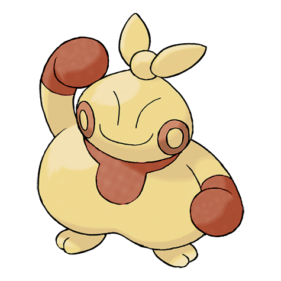

# Makuhita (Guts Pokémon)

| Official Artwork | Shiny Artwork |
| --- | --- |
|  |  |

It toughens its body by slamming into thick trees. Many snapped trees can be found near its nest.

---

## Media

### Cries

Latest (Gen VI+):

<audio controls>
<source src='../../assets/cries/makuhita/latest.ogg' type='audio/ogg'>
  Your browser does not support the audio element.
</audio>

Legacy:

<audio controls>
<source src='../../assets/cries/makuhita/legacy.ogg' type='audio/ogg'>
  Your browser does not support the audio element.
</audio>

---

## Pokédex Data

| National № | Type(s) | Height | Weight | Abilities | Local № |
|------------|---------|--------|--------|-----------|---------|
| #296 | {: width='48'} | 1.0 m | 86.4 kg | 1. Thick-Fat 2. Guts 3. Sheer-Force | N/A |

---

## Base Stats
|   | HP | Attack | Defense | Sp. Atk | Sp. Def | Speed |
|---|----|--------|---------|---------|---------|-------|
| **Base** | 72 | 60 | 30 | 20 | 30 | 25 |
| **Min** | 254 | 112 | 58 | 40 | 58 | 49 |
| **Max** | 348 | 240 | 174 | 152 | 174 | 163 |

The ranges shown above are for a level 100 Pokémon. Maximum values are based on a beneficial nature, 252 EVs, 31 IVs; minimum values are based on a hindering nature, 0 EVs, 0 IVs.

---

## Forms & Evolutions

!!! warning "WARNING"

    Information on evolutions may not be 100% accurate; differences between evolution methods across generations are not accounted for.

### Forms

Makuhita has no alternate forms.

### Evolution Line

1. [Makuhita](makuhita.md/)
    1. Level Up: [Hariyama](hariyama.md/)

---

## Training

| EV Yield | Catch Rate | Base Friendship | Base Exp. | Growth Rate | Held Items |
|----------|------------|-----------------|-----------|-------------|------------|
| 1 Hp | 180 | 70 | 47 | Fast-Then-Very-Slow |  |

---

## Breeding

| Egg Groups | Egg Cycles | Gender | Dimorphic | Color | Shape |
|------------|------------|--------|-----------|-------|-------|
| 1. Humanshape | 20 | 75.0% Male 25.0% Female | False | Yellow | Humanoid |

---

## Moves

!!! warning "WARNING"

    Specific move information may be incorrect. However, the general movepool should be accurate; this includes changes made in Renegade Platinum.

### Level Up Moves

| Lv. | Move | Type | Cat. | Power | Acc. | PP |
| --- | --- | --- | --- | --- | --- | --- |
| 1 | Focus Energy | {: width='48'} | {: width='36'} | — | — | 30 |
| 1 | Tackle | {: width='48'} | {: width='36'} | 40 | 100 | 35 |
| 4 | Sand Attack | {: width='48'} | {: width='36'} | — | 100 | 15 |
| 7 | Arm Thrust | {: width='48'} | {: width='36'} | 15 | 100 | 20 |
| 9 | Fake Out | {: width='48'} | {: width='36'} | 40 | 100 | 10 |
| 11 | Force Palm | {: width='48'} | {: width='36'} | 60 | 100 | 10 |
| 13 | Whirlwind | {: width='48'} | {: width='36'} | — | — | 20 |
| 15 | Knock Off | {: width='48'} | {: width='36'} | 65 | 100 | 20 |
| 17 | Vital Throw | {: width='48'} | {: width='36'} | 70 | — | 10 |
| 19 | Smelling Salts | {: width='48'} | {: width='36'} | 70 | 100 | 10 |
| 21 | Belly Drum | {: width='48'} | {: width='36'} | — | — | 10 |
| 24 | Wake Up Slap | {: width='48'} | {: width='36'} | 70 | 100 | 10 |
| 27 | Revenge | {: width='48'} | {: width='36'} | 60 | 100 | 10 |
| 30 | Seismic Toss | {: width='48'} | {: width='36'} | — | 100 | 20 |
| 33 | Cross Chop | {: width='48'} | {: width='36'} | 100 | 80 | 5 |
| 36 | Endure | {: width='48'} | {: width='36'} | — | — | 10 |
| 39 | Close Combat | {: width='48'} | {: width='36'} | 120 | 100 | 5 |
| 42 | Reversal | {: width='48'} | {: width='36'} | — | 100 | 15 |
| 45 | Counter | {: width='48'} | {: width='36'} | — | 100 | 20 |

### TM Moves

| TM | Move | Type | Cat. | Power | Acc. | PP |
| --- | --- | --- | --- | --- | --- | --- |
| HM03 | Surf | {: width='48'} | {: width='36'} | 90 | 100 | 15 |
| HM04 | Strength | {: width='48'} | {: width='36'} | 100 | 100 | 15 |
| HM06 | Rock Smash | {: width='48'} | {: width='36'} | 60 | 100 | 15 |
| HM08 | Rock Climb | {: width='48'} | {: width='36'} | 80 | 95% | 10 |
| TM01 | Focus Punch | {: width='48'} | {: width='36'} | 150 | 100 | 20 |
| TM06 | Toxic | {: width='48'} | {: width='36'} | — | 90 | 10 |
| TM08 | Bulk Up | {: width='48'} | {: width='36'} | — | — | 20 |
| TM10 | Hidden Power | {: width='48'} | {: width='36'} | 60 | 100 | 15 |
| TM11 | Sunny Day | {: width='48'} | {: width='36'} | — | — | 5 |
| TM17 | Protect | {: width='48'} | {: width='36'} | — | — | 10 |
| TM18 | Rain Dance | {: width='48'} | {: width='36'} | — | — | 5 |
| TM21 | Frustration | {: width='48'} | {: width='36'} | — | 100 | 20 |
| TM26 | Earthquake | {: width='48'} | {: width='36'} | 100 | 100 | 10 |
| TM27 | Return | {: width='48'} | {: width='36'} | — | 100 | 20 |
| TM28 | Dig | {: width='48'} | {: width='36'} | 80 | 100 | 10 |
| TM31 | Brick Break | {: width='48'} | {: width='36'} | 75 | 100 | 15 |
| TM32 | Double Team | {: width='48'} | {: width='36'} | — | — | 15 |
| TM39 | Rock Tomb | {: width='48'} | {: width='36'} | 60 | 95 | 15 |
| TM42 | Facade | {: width='48'} | {: width='36'} | 70 | 100 | 20 |
| TM43 | Secret Power | {: width='48'} | {: width='36'} | 70 | 100 | 20 |
| TM44 | Rest | {: width='48'} | {: width='36'} | — | — | 5 |
| TM45 | Attract | {: width='48'} | {: width='36'} | — | 100 | 15 |
| TM52 | Focus Blast | {: width='48'} | {: width='36'} | 120 | 70 | 5 |
| TM56 | Fling | {: width='48'} | {: width='36'} | — | 100 | 10 |
| TM58 | Endure | {: width='48'} | {: width='36'} | — | — | 10 |
| TM78 | Captivate | {: width='48'} | {: width='36'} | — | 100 | 20 |
| TM80 | Rock Slide | {: width='48'} | {: width='36'} | 75 | 90 | 10 |
| TM82 | Sleep Talk | {: width='48'} | {: width='36'} | — | — | 10 |
| TM83 | Natural Gift | {: width='48'} | {: width='36'} | — | 100 | 15 |
| TM84 | Poison Jab | {: width='48'} | {: width='36'} | 80 | 100 | 20 |
| TM87 | Swagger | {: width='48'} | {: width='36'} | — | 85 | 15 |
| TM90 | Substitute | {: width='48'} | {: width='36'} | — | — | 10 |

### Egg Moves

| Move | Type | Cat. | Power | Acc. | PP |
| --- | --- | --- | --- | --- | --- |
| Counter | {: width='48'} | {: width='36'} | — | 100 | 20 |
| Feint Attack | {: width='48'} | {: width='36'} | 60 | — | 20 |
| Foresight | {: width='48'} | {: width='36'} | — | — | 40 |
| Detect | {: width='48'} | {: width='36'} | — | — | 5 |
| Dynamic Punch | {: width='48'} | {: width='36'} | 100 | 50 | 5 |
| Cross Chop | {: width='48'} | {: width='36'} | 100 | 80 | 5 |
| Helping Hand | {: width='48'} | {: width='36'} | — | — | 20 |
| Revenge | {: width='48'} | {: width='36'} | 60 | 100 | 10 |
| Wake Up Slap | {: width='48'} | {: width='36'} | 70 | 100 | 10 |
| Bullet Punch | {: width='48'} | {: width='36'} | 40 | 100 | 30 |

### Tutor Moves

| Move | Type | Cat. | Power | Acc. | PP |
| --- | --- | --- | --- | --- | --- |
| Fire Punch | {: width='48'} | {: width='36'} | 75 | 100 | 15 |
| Ice Punch | {: width='48'} | {: width='36'} | 75 | 100 | 15 |
| Thunder Punch | {: width='48'} | {: width='36'} | 75 | 100 | 15 |
| Snore | {: width='48'} | {: width='36'} | 50 | 100 | 15 |
| Mud Slap | {: width='48'} | {: width='36'} | 20 | 100 | 10 |
| Helping Hand | {: width='48'} | {: width='36'} | — | — | 20 |
| Superpower | {: width='48'} | {: width='36'} | 120 | 100 | 5 |
| Knock Off | {: width='48'} | {: width='36'} | 65 | 100 | 20 |
| Vacuum Wave | {: width='48'} | {: width='36'} | 40 | 100 | 30 |

