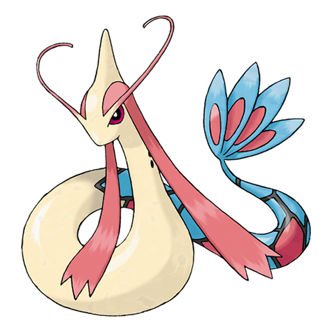

# Milotic (Tender Pokémon)

| Official Artwork | Shiny Artwork |
| --- | --- |
|  |  |

Its lovely scales are described as rainbow colored. They change color depending on the viewing angle.

---

## Media

### Cries

Latest (Gen VI+):

<audio controls>
<source src='../../assets/cries/milotic/latest.ogg' type='audio/ogg'>
  Your browser does not support the audio element.
</audio>

Legacy:

<audio controls>
<source src='../../assets/cries/milotic/legacy.ogg' type='audio/ogg'>
  Your browser does not support the audio element.
</audio>

---

## Pokédex Data

| National № | Type(s) | Height | Weight | Abilities | Local № |
|------------|---------|--------|--------|-----------|---------|
| #350 | {: width='48'} {: width='48'} | 6.2 m | 162.0 kg | 1. Marvel-Scale 2. Cute-Charm | #139 |

---

## Base Stats
|   | HP | Attack | Defense | Sp. Atk | Sp. Def | Speed |
|---|----|--------|---------|---------|---------|-------|
| **Base** | 95 | 60 | 79 | 100 | 125 | 81 |
| **Min** | 300 | 112 | 146 | 184 | 229 | 150 |
| **Max** | 394 | 240 | 282 | 328 | 383 | 287 |

The ranges shown above are for a level 100 Pokémon. Maximum values are based on a beneficial nature, 252 EVs, 31 IVs; minimum values are based on a hindering nature, 0 EVs, 0 IVs.

---

## Forms & Evolutions

!!! warning "WARNING"

    Information on evolutions may not be 100% accurate; differences between evolution methods across generations are not accounted for.

### Forms

Milotic has no alternate forms.

### Evolution Line

1. [Feebas](feebas.md/)
    1. Level Up: [Milotic](milotic.md/)

---

## Training

| EV Yield | Catch Rate | Base Friendship | Base Exp. | Growth Rate | Held Items |
|----------|------------|-----------------|-----------|-------------|------------|
| 2 Special Defense | 60 | 50 | 189 | Slow-Then-Very-Fast | N/A |

---

## Breeding

| Egg Groups | Egg Cycles | Gender | Dimorphic | Color | Shape |
|------------|------------|--------|-----------|-------|-------|
| 1. Water1 2. Dragon | 20 | 50.0% Male 50.0% Female | True | Pink | Squiggle |

---

## Moves

!!! warning "WARNING"

    Specific move information may be incorrect. However, the general movepool should be accurate; this includes changes made in Renegade Platinum.

### Level Up Moves

| Lv. | Move | Type | Cat. | Power | Acc. | PP |
| --- | --- | --- | --- | --- | --- | --- |
| 1 | Water Gun | {: width='48'} | {: width='36'} | 40 | 100 | 25 |
| 1 | Water Sport | {: width='48'} | {: width='36'} | — | — | 15 |
| 1 | Wrap | {: width='48'} | {: width='36'} | 15 | 90 | 20 |
| 5 | Refresh | {: width='48'} | {: width='36'} | — | — | 20 |
| 7 | Tickle | {: width='48'} | {: width='36'} | — | 100 | 20 |
| 9 | Disarming Voice | {: width='48'} | {: width='36'} | 50 | — | 15 |
| 11 | Captivate | {: width='48'} | {: width='36'} | — | 100 | 20 |
| 13 | Water Pulse | {: width='48'} | {: width='36'} | 60 | 100 | 20 |
| 15 | Aqua Ring | {: width='48'} | {: width='36'} | — | — | 20 |
| 18 | Confuse Ray | {: width='48'} | {: width='36'} | — | 100 | 10 |
| 21 | Dragon Breath | {: width='48'} | {: width='36'} | 60 | 100 | 20 |
| 24 | Aqua Tail | {: width='48'} | {: width='36'} | 90 | 90 | 10 |
| 27 | Recover | {: width='48'} | {: width='36'} | — | — | 5 |
| 30 | Hypnosis | {: width='48'} | {: width='36'} | — | 60 | 20 |
| 33 | Attract | {: width='48'} | {: width='36'} | — | 100 | 15 |
| 36 | Moonblast | {: width='48'} | {: width='36'} | 95 | 100 | 15 |
| 39 | Dragon Pulse | {: width='48'} | {: width='36'} | 85 | 100 | 10 |
| 42 | Rain Dance | {: width='48'} | {: width='36'} | — | — | 5 |
| 45 | Safeguard | {: width='48'} | {: width='36'} | — | — | 25 |
| 48 | Mirror Coat | {: width='48'} | {: width='36'} | — | 100 | 20 |
| 51 | Hydro Pump | {: width='48'} | {: width='36'} | 110 | 80 | 5 |

### TM Moves

| TM | Move | Type | Cat. | Power | Acc. | PP |
| --- | --- | --- | --- | --- | --- | --- |
| TBD | Dazzling Gleam | {: width='48'} | {: width='36'} | 80 | 100 | 10 |
| HM03 | Surf | {: width='48'} | {: width='36'} | 90 | 100 | 15 |
| HM07 | Waterfall | {: width='48'} | {: width='36'} | 80 | 100 | 15 |
| TM03 | Water Pulse | {: width='48'} | {: width='36'} | 60 | 100 | 20 |
| TM06 | Toxic | {: width='48'} | {: width='36'} | — | 90 | 10 |
| TM07 | Hail | {: width='48'} | {: width='36'} | — | — | 10 |
| TM10 | Hidden Power | {: width='48'} | {: width='36'} | 60 | 100 | 15 |
| TM13 | Ice Beam | {: width='48'} | {: width='36'} | 90 | 100 | 10 |
| TM14 | Blizzard | {: width='48'} | {: width='36'} | 110 | 70 | 5 |
| TM15 | Hyper Beam | {: width='48'} | {: width='36'} | 150 | 90 | 5 |
| TM17 | Protect | {: width='48'} | {: width='36'} | — | — | 10 |
| TM18 | Rain Dance | {: width='48'} | {: width='36'} | — | — | 5 |
| TM20 | Safeguard | {: width='48'} | {: width='36'} | — | — | 25 |
| TM21 | Frustration | {: width='48'} | {: width='36'} | — | 100 | 20 |
| TM23 | Iron Tail | {: width='48'} | {: width='36'} | 100 | 75 | 15 |
| TM27 | Return | {: width='48'} | {: width='36'} | — | 100 | 20 |
| TM32 | Double Team | {: width='48'} | {: width='36'} | — | — | 15 |
| TM42 | Facade | {: width='48'} | {: width='36'} | 70 | 100 | 20 |
| TM43 | Secret Power | {: width='48'} | {: width='36'} | 70 | 100 | 20 |
| TM44 | Rest | {: width='48'} | {: width='36'} | — | — | 5 |
| TM45 | Attract | {: width='48'} | {: width='36'} | — | 100 | 15 |
| TM58 | Endure | {: width='48'} | {: width='36'} | — | — | 10 |
| TM59 | Dragon Pulse | {: width='48'} | {: width='36'} | 85 | 100 | 10 |
| TM68 | Giga Impact | {: width='48'} | {: width='36'} | 150 | 90 | 5 |
| TM72 | Avalanche | {: width='48'} | {: width='36'} | 60 | 100 | 10 |
| TM77 | Psych Up | {: width='48'} | {: width='36'} | — | — | 10 |
| TM78 | Captivate | {: width='48'} | {: width='36'} | — | 100 | 20 |
| TM82 | Sleep Talk | {: width='48'} | {: width='36'} | — | — | 10 |
| TM83 | Natural Gift | {: width='48'} | {: width='36'} | — | 100 | 15 |
| TM87 | Swagger | {: width='48'} | {: width='36'} | — | 85 | 15 |
| TM90 | Substitute | {: width='48'} | {: width='36'} | — | — | 10 |

### Egg Moves

Milotic cannot learn any moves by breeding.
### Tutor Moves

| Move | Type | Cat. | Power | Acc. | PP |
| --- | --- | --- | --- | --- | --- |
| Swift | {: width='48'} | {: width='36'} | 60 | — | 20 |
| Snore | {: width='48'} | {: width='36'} | 50 | 100 | 15 |
| Mud Slap | {: width='48'} | {: width='36'} | 20 | 100 | 10 |
| Icy Wind | {: width='48'} | {: width='36'} | 55 | 95 | 15 |
| Twister | {: width='48'} | {: width='36'} | 40 | 100 | 20 |
| Dive | {: width='48'} | {: width='36'} | 80 | 100 | 10 |
| Aqua Tail | {: width='48'} | {: width='36'} | 90 | 90 | 10 |
| Iron Head | {: width='48'} | {: width='36'} | 80 | 100 | 15 |

