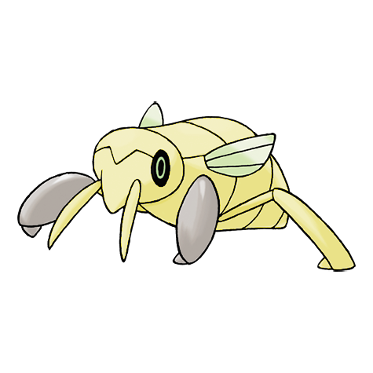

# Nincada (Trainee Pokémon)

| Official Artwork | Shiny Artwork |
| --- | --- |
|  |  |

It grows underground, sensing its surroundings using antennae instead of its virtually blind eyes.

---

## Media

### Cries

No cries available.

---

## Pokédex Data

| National № | Type(s) | Height | Weight | Abilities | Local № |
|------------|---------|--------|--------|-----------|---------|
| #290 | {: width='48'} {: width='48'} | 0.5 m | 5.5 kg | 1. Compound-Eyes 2. Run-Away | N/A |

---

## Base Stats
|   | HP | Attack | Defense | Sp. Atk | Sp. Def | Speed |
|---|----|--------|---------|---------|---------|-------|
| **Base** | 31 | 45 | 90 | 30 | 30 | 40 |
| **Min** | 172 | 85 | 166 | 58 | 58 | 76 |
| **Max** | 266 | 207 | 306 | 174 | 174 | 196 |

The ranges shown above are for a level 100 Pokémon. Maximum values are based on a beneficial nature, 252 EVs, 31 IVs; minimum values are based on a hindering nature, 0 EVs, 0 IVs.

---

## Forms & Evolutions

!!! warning "WARNING"

    Information on evolutions may not be 100% accurate; differences between evolution methods across generations are not accounted for.

### Forms

Nincada has no alternate forms.

### Evolution Line

1. [Nincada](nincada.md/)
    1. Level Up: [Ninjask](ninjask.md/)

    2. Shed: [Shedinja](shedinja.md/)

---

## Training

| EV Yield | Catch Rate | Base Friendship | Base Exp. | Growth Rate | Held Items |
|----------|------------|-----------------|-----------|-------------|------------|
| 1 Defense | 255 | 50 | 53 | Slow-Then-Very-Fast |  |

---

## Breeding

| Egg Groups | Egg Cycles | Gender | Dimorphic | Color | Shape |
|------------|------------|--------|-----------|-------|-------|
| 1. Bug | 15 | 50.0% Male 50.0% Female | False | Gray | Armor |

---

## Moves

!!! warning "WARNING"

    Specific move information may be incorrect. However, the general movepool should be accurate; this includes changes made in Renegade Platinum.

### Level Up Moves

| Lv. | Move | Type | Cat. | Power | Acc. | PP |
| --- | --- | --- | --- | --- | --- | --- |
| 1 | Absorb | {: width='48'} | {: width='36'} | 20 | 100 | 25 |
| 1 | Bug Bite | {: width='48'} | {: width='36'} | 60 | 100 | 20 |
| 1 | Harden | {: width='48'} | {: width='36'} | — | — | 30 |
| 1 | Scratch | {: width='48'} | {: width='36'} | 40 | 100 | 35 |
| 4 | Sand Attack | {: width='48'} | {: width='36'} | — | 100 | 15 |
| 7 | Fury Swipes | {: width='48'} | {: width='36'} | 18 | 80 | 15 |
| 11 | Mud Slap | {: width='48'} | {: width='36'} | 20 | 100 | 10 |
| 15 | Leech Life | {: width='48'} | {: width='36'} | 80 | 100 | 10 |
| 19 | Mind Reader | {: width='48'} | {: width='36'} | — | — | 5 |
| 23 | Metal Claw | {: width='48'} | {: width='36'} | 50 | 95 | 35 |
| 27 | Dig | {: width='48'} | {: width='36'} | 80 | 100 | 10 |
| 31 | X Scissor | {: width='48'} | {: width='36'} | 80 | 100 | 15 |
| 35 | Bide | {: width='48'} | {: width='36'} | — | — | 10 |
| 39 | False Swipe | {: width='48'} | {: width='36'} | 40 | 100 | 40 |

### TM Moves

| TM | Move | Type | Cat. | Power | Acc. | PP |
| --- | --- | --- | --- | --- | --- | --- |
| TBD | Bug Buzz | {: width='48'} | {: width='36'} | 90 | 100 | 10 |
| HM01 | Cut | {: width='48'} | {: width='36'} | 60 | 100% | 25 |
| TM06 | Toxic | {: width='48'} | {: width='36'} | — | 90 | 10 |
| TM10 | Hidden Power | {: width='48'} | {: width='36'} | 60 | 100 | 15 |
| TM11 | Sunny Day | {: width='48'} | {: width='36'} | — | — | 5 |
| TM17 | Protect | {: width='48'} | {: width='36'} | — | — | 10 |
| TM19 | Giga Drain | {: width='48'} | {: width='36'} | 75 | 100 | 10 |
| TM21 | Frustration | {: width='48'} | {: width='36'} | — | 100 | 20 |
| TM22 | Solar Beam | {: width='48'} | {: width='36'} | 120 | 100 | 10 |
| TM27 | Return | {: width='48'} | {: width='36'} | — | 100 | 20 |
| TM28 | Dig | {: width='48'} | {: width='36'} | 80 | 100 | 10 |
| TM30 | Shadow Ball | {: width='48'} | {: width='36'} | 80 | 100 | 15 |
| TM32 | Double Team | {: width='48'} | {: width='36'} | — | — | 15 |
| TM37 | Sandstorm | {: width='48'} | {: width='36'} | — | — | 10 |
| TM40 | Aerial Ace | {: width='48'} | {: width='36'} | 60 | — | 20 |
| TM42 | Facade | {: width='48'} | {: width='36'} | 70 | 100 | 20 |
| TM43 | Secret Power | {: width='48'} | {: width='36'} | 70 | 100 | 20 |
| TM44 | Rest | {: width='48'} | {: width='36'} | — | — | 5 |
| TM54 | False Swipe | {: width='48'} | {: width='36'} | 40 | 100 | 40 |
| TM58 | Endure | {: width='48'} | {: width='36'} | — | — | 10 |
| TM70 | Flash | {: width='48'} | {: width='36'} | — | 100 | 20 |
| TM81 | X Scissor | {: width='48'} | {: width='36'} | 80 | 100 | 15 |
| TM82 | Sleep Talk | {: width='48'} | {: width='36'} | — | — | 10 |
| TM83 | Natural Gift | {: width='48'} | {: width='36'} | — | 100 | 15 |
| TM87 | Swagger | {: width='48'} | {: width='36'} | — | 85 | 15 |
| TM90 | Substitute | {: width='48'} | {: width='36'} | — | — | 10 |

### Egg Moves

| Move | Type | Cat. | Power | Acc. | PP |
| --- | --- | --- | --- | --- | --- |
| Gust | {: width='48'} | {: width='36'} | 40 | 100 | 35 |
| Feint Attack | {: width='48'} | {: width='36'} | 60 | — | 20 |
| Endure | {: width='48'} | {: width='36'} | — | — | 10 |
| Silver Wind | {: width='48'} | {: width='36'} | 60 | 100 | 5 |
| Night Slash | {: width='48'} | {: width='36'} | 70 | 100 | 15 |
| Bug Buzz | {: width='48'} | {: width='36'} | 90 | 100 | 10 |
| Bug Bite | {: width='48'} | {: width='36'} | 60 | 100 | 20 |

### Tutor Moves

| Move | Type | Cat. | Power | Acc. | PP |
| --- | --- | --- | --- | --- | --- |
| Snore | {: width='48'} | {: width='36'} | 50 | 100 | 15 |
| Spite | {: width='48'} | {: width='36'} | — | 100 | 10 |
| Mud Slap | {: width='48'} | {: width='36'} | 20 | 100 | 10 |
| Fury Cutter | {: width='48'} | {: width='36'} | 40 | 95 | 20 |

