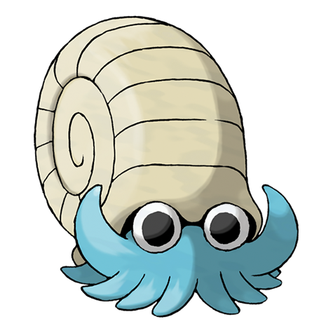
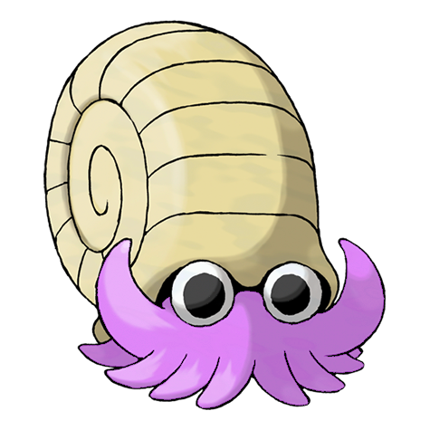

# Omanyte (Spiral Pokémon)

| Official Artwork | Shiny Artwork |
| --- | --- |
|  |  |

A Pokémon that was resurrected from a fossil using modern science. It swam in ancient seas.

---

## Media

### Cries

Latest (Gen VI+):

<audio controls>
<source src='../../assets/cries/omanyte/latest.ogg' type='audio/ogg'>
  Your browser does not support the audio element.
</audio>

Legacy:

<audio controls>
<source src='../../assets/cries/omanyte/legacy.ogg' type='audio/ogg'>
  Your browser does not support the audio element.
</audio>

---

## Pokédex Data

| National № | Type(s) | Height | Weight | Abilities | Local № |
|------------|---------|--------|--------|-----------|---------|
| #138 | {: width='48'} {: width='48'} | 0.4 m | 7.5 kg | 1. Swift-Swim 2. Shell-Armor 3. Weak-Armor | N/A |

---

## Base Stats
|   | HP | Attack | Defense | Sp. Atk | Sp. Def | Speed |
|---|----|--------|---------|---------|---------|-------|
| **Base** | 35 | 40 | 100 | 90 | 55 | 35 |
| **Min** | 180 | 76 | 184 | 166 | 103 | 67 |
| **Max** | 274 | 196 | 328 | 306 | 229 | 185 |

The ranges shown above are for a level 100 Pokémon. Maximum values are based on a beneficial nature, 252 EVs, 31 IVs; minimum values are based on a hindering nature, 0 EVs, 0 IVs.

---

## Forms & Evolutions

!!! warning "WARNING"

    Information on evolutions may not be 100% accurate; differences between evolution methods across generations are not accounted for.

### Forms

Omanyte has no alternate forms.

### Evolution Line

1. [Omanyte](omanyte.md/)
    1. Level Up: [Omastar](omastar.md/)

---

## Training

| EV Yield | Catch Rate | Base Friendship | Base Exp. | Growth Rate | Held Items |
|----------|------------|-----------------|-----------|-------------|------------|
| 1 Defense | 45 | 50 | 71 | Medium | N/A |

---

## Breeding

| Egg Groups | Egg Cycles | Gender | Dimorphic | Color | Shape |
|------------|------------|--------|-----------|-------|-------|
| 1. Water1 2. Water3 | 30 | 87.5% Male 12.5% Female | False | Blue | Tentacles |

---

## Moves

!!! warning "WARNING"

    Specific move information may be incorrect. However, the general movepool should be accurate; this includes changes made in Renegade Platinum.

### Level Up Moves

| Lv. | Move | Type | Cat. | Power | Acc. | PP |
| --- | --- | --- | --- | --- | --- | --- |
| 1 | Water Gun | {: width='48'} | {: width='36'} | 40 | 100 | 25 |
| 4 | Withdraw | {: width='48'} | {: width='36'} | — | — | 40 |
| 7 | Leer | {: width='48'} | {: width='36'} | — | 100 | 30 |
| 10 | Bite | {: width='48'} | {: width='36'} | 60 | 100 | 25 |
| 13 | Rollout | {: width='48'} | {: width='36'} | 30 | 90 | 20 |
| 16 | Mud Shot | {: width='48'} | {: width='36'} | 55 | 95 | 15 |
| 19 | Aurora Beam | {: width='48'} | {: width='36'} | 75 | 100 | 15 |
| 22 | Bubble Beam | {: width='48'} | {: width='36'} | 75 | 100 | 15 |
| 25 | Ancient Power | {: width='48'} | {: width='36'} | 60 | 100 | 5 |
| 28 | Protect | {: width='48'} | {: width='36'} | — | — | 10 |
| 31 | Muddy Water | {: width='48'} | {: width='36'} | 90 | 85 | 10 |
| 34 | Earth Power | {: width='48'} | {: width='36'} | 90 | 100 | 10 |
| 37 | Tickle | {: width='48'} | {: width='36'} | — | 100 | 20 |
| 40 | Power Gem | {: width='48'} | {: width='36'} | 80 | 100 | 20 |
| 43 | Rock Blast | {: width='48'} | {: width='36'} | 25 | 90 | 10 |
| 46 | Hydro Pump | {: width='48'} | {: width='36'} | 110 | 80 | 5 |
| 49 | Wring Out | {: width='48'} | {: width='36'} | — | 100 | 5 |

### TM Moves

| TM | Move | Type | Cat. | Power | Acc. | PP |
| --- | --- | --- | --- | --- | --- | --- |
| HM03 | Surf | {: width='48'} | {: width='36'} | 90 | 100 | 15 |
| HM06 | Rock Smash | {: width='48'} | {: width='36'} | 60 | 100 | 15 |
| HM07 | Waterfall | {: width='48'} | {: width='36'} | 80 | 100 | 15 |
| TM03 | Water Pulse | {: width='48'} | {: width='36'} | 60 | 100 | 20 |
| TM06 | Toxic | {: width='48'} | {: width='36'} | — | 90 | 10 |
| TM07 | Hail | {: width='48'} | {: width='36'} | — | — | 10 |
| TM10 | Hidden Power | {: width='48'} | {: width='36'} | 60 | 100 | 15 |
| TM13 | Ice Beam | {: width='48'} | {: width='36'} | 90 | 100 | 10 |
| TM14 | Blizzard | {: width='48'} | {: width='36'} | 110 | 70 | 5 |
| TM17 | Protect | {: width='48'} | {: width='36'} | — | — | 10 |
| TM18 | Rain Dance | {: width='48'} | {: width='36'} | — | — | 5 |
| TM21 | Frustration | {: width='48'} | {: width='36'} | — | 100 | 20 |
| TM27 | Return | {: width='48'} | {: width='36'} | — | 100 | 20 |
| TM32 | Double Team | {: width='48'} | {: width='36'} | — | — | 15 |
| TM37 | Sandstorm | {: width='48'} | {: width='36'} | — | — | 10 |
| TM39 | Rock Tomb | {: width='48'} | {: width='36'} | 60 | 95 | 15 |
| TM42 | Facade | {: width='48'} | {: width='36'} | 70 | 100 | 20 |
| TM43 | Secret Power | {: width='48'} | {: width='36'} | 70 | 100 | 20 |
| TM44 | Rest | {: width='48'} | {: width='36'} | — | — | 5 |
| TM45 | Attract | {: width='48'} | {: width='36'} | — | 100 | 15 |
| TM46 | Thief | {: width='48'} | {: width='36'} | 60 | 100 | 25 |
| TM55 | Brine | {: width='48'} | {: width='36'} | 65 | 100 | 10 |
| TM58 | Endure | {: width='48'} | {: width='36'} | — | — | 10 |
| TM69 | Rock Polish | {: width='48'} | {: width='36'} | — | — | 20 |
| TM74 | Gyro Ball | {: width='48'} | {: width='36'} | — | 100 | 5 |
| TM76 | Stealth Rock | {: width='48'} | {: width='36'} | — | — | 20 |
| TM78 | Captivate | {: width='48'} | {: width='36'} | — | 100 | 20 |
| TM80 | Rock Slide | {: width='48'} | {: width='36'} | 75 | 90 | 10 |
| TM82 | Sleep Talk | {: width='48'} | {: width='36'} | — | — | 10 |
| TM83 | Natural Gift | {: width='48'} | {: width='36'} | — | 100 | 15 |
| TM87 | Swagger | {: width='48'} | {: width='36'} | — | 85 | 15 |
| TM90 | Substitute | {: width='48'} | {: width='36'} | — | — | 10 |

### Egg Moves

| Move | Type | Cat. | Power | Acc. | PP |
| --- | --- | --- | --- | --- | --- |
| Slam | {: width='48'} | {: width='36'} | 80 | 75 | 20 |
| Supersonic | {: width='48'} | {: width='36'} | — | 55 | 20 |
| Bubble Beam | {: width='48'} | {: width='36'} | 75 | 100 | 15 |
| Aurora Beam | {: width='48'} | {: width='36'} | 75 | 100 | 15 |
| Haze | {: width='48'} | {: width='36'} | — | — | 30 |
| Rock Slide | {: width='48'} | {: width='36'} | 75 | 90 | 10 |
| Spikes | {: width='48'} | {: width='36'} | — | — | 20 |
| Knock Off | {: width='48'} | {: width='36'} | 65 | 100 | 20 |
| Wring Out | {: width='48'} | {: width='36'} | — | 100 | 5 |
| Toxic Spikes | {: width='48'} | {: width='36'} | — | — | 20 |

### Tutor Moves

| Move | Type | Cat. | Power | Acc. | PP |
| --- | --- | --- | --- | --- | --- |
| Snore | {: width='48'} | {: width='36'} | 50 | 100 | 15 |
| Icy Wind | {: width='48'} | {: width='36'} | 55 | 95 | 15 |
| Rollout | {: width='48'} | {: width='36'} | 30 | 90 | 20 |
| Ancient Power | {: width='48'} | {: width='36'} | 60 | 100 | 5 |
| Knock Off | {: width='48'} | {: width='36'} | 65 | 100 | 20 |
| Dive | {: width='48'} | {: width='36'} | 80 | 100 | 10 |
| Iron Defense | {: width='48'} | {: width='36'} | — | — | 15 |
| Earth Power | {: width='48'} | {: width='36'} | 90 | 100 | 10 |

