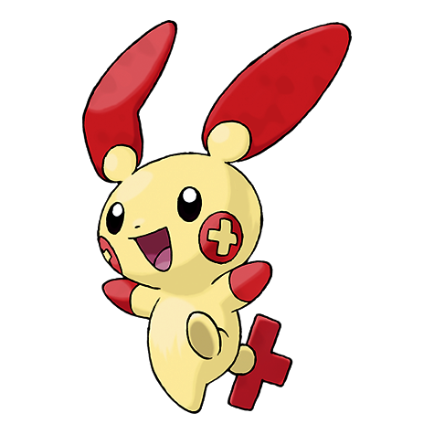

# Plusle (Cheering Pokémon)

| Official Artwork | Shiny Artwork |
| --- | --- |
|  |  |

It cheers on friends with pom-poms made of sparks. It drains power from telephone poles.

---

## Media

### Cries

No cries available.

---

## Pokédex Data

| National № | Type(s) | Height | Weight | Abilities | Local № |
|------------|---------|--------|--------|-----------|---------|
| #311 | {: width='48'} | 0.4 m | 4.2 kg | 1. Plus 2. Lightning-Rod | N/A |

---

## Base Stats
|   | HP | Attack | Defense | Sp. Atk | Sp. Def | Speed |
|---|----|--------|---------|---------|---------|-------|
| **Base** | 60 | 50 | 50 | 95 | 85 | 110 |
| **Min** | 230 | 94 | 94 | 175 | 157 | 202 |
| **Max** | 324 | 218 | 218 | 317 | 295 | 350 |

The ranges shown above are for a level 100 Pokémon. Maximum values are based on a beneficial nature, 252 EVs, 31 IVs; minimum values are based on a hindering nature, 0 EVs, 0 IVs.

---

## Forms & Evolutions

!!! warning "WARNING"

    Information on evolutions may not be 100% accurate; differences between evolution methods across generations are not accounted for.

### Forms

Plusle has no alternate forms.

### Evolution Line

1. [Plusle](plusle.md/)

---

## Training

| EV Yield | Catch Rate | Base Friendship | Base Exp. | Growth Rate | Held Items |
|----------|------------|-----------------|-----------|-------------|------------|
| 1 Speed | 200 | 70 | 142 | Medium |  |

---

## Breeding

| Egg Groups | Egg Cycles | Gender | Dimorphic | Color | Shape |
|------------|------------|--------|-----------|-------|-------|
| 1. Fairy | 20 | 50.0% Male 50.0% Female | False | Yellow | Upright |

---

## Moves

!!! warning "WARNING"

    Specific move information may be incorrect. However, the general movepool should be accurate; this includes changes made in Renegade Platinum.

### Level Up Moves

| Lv. | Move | Type | Cat. | Power | Acc. | PP |
| --- | --- | --- | --- | --- | --- | --- |
| 1 | Growl | {: width='48'} | {: width='36'} | — | 100 | 40 |
| 1 | Quick Attack | {: width='48'} | {: width='36'} | 40 | 100 | 30 |
| 1 | Thunder Wave | {: width='48'} | {: width='36'} | — | 90 | 20 |
| 4 | Helping Hand | {: width='48'} | {: width='36'} | — | — | 20 |
| 7 | Spark | {: width='48'} | {: width='36'} | 65 | 100 | 20 |
| 10 | Encore | {: width='48'} | {: width='36'} | — | 100 | 5 |
| 13 | Charge Beam | {: width='48'} | {: width='36'} | 50 | 90 | 10 |
| 16 | Wish | {: width='48'} | {: width='36'} | — | — | 10 |
| 19 | Swift | {: width='48'} | {: width='36'} | 60 | — | 20 |
| 22 | Charge | {: width='48'} | {: width='36'} | — | — | 20 |
| 25 | Discharge | {: width='48'} | {: width='36'} | 80 | 100 | 15 |
| 28 | Copycat | {: width='48'} | {: width='36'} | — | — | 20 |
| 31 | Charm | {: width='48'} | {: width='36'} | — | 100 | 20 |
| 34 | Thunderbolt | {: width='48'} | {: width='36'} | 90 | 100 | 15 |
| 37 | Baton Pass | {: width='48'} | {: width='36'} | — | — | 40 |
| 40 | Agility | {: width='48'} | {: width='36'} | — | — | 30 |
| 43 | Last Resort | {: width='48'} | {: width='36'} | 140 | 100 | 5 |
| 46 | Thunder | {: width='48'} | {: width='36'} | 110 | 70 | 10 |
| 49 | Nasty Plot | {: width='48'} | {: width='36'} | — | — | 20 |

### TM Moves

| TM | Move | Type | Cat. | Power | Acc. | PP |
| --- | --- | --- | --- | --- | --- | --- |
| TM06 | Toxic | {: width='48'} | {: width='36'} | — | 90 | 10 |
| TM10 | Hidden Power | {: width='48'} | {: width='36'} | 60 | 100 | 15 |
| TM16 | Light Screen | {: width='48'} | {: width='36'} | — | — | 30 |
| TM17 | Protect | {: width='48'} | {: width='36'} | — | — | 10 |
| TM18 | Rain Dance | {: width='48'} | {: width='36'} | — | — | 5 |
| TM21 | Frustration | {: width='48'} | {: width='36'} | — | 100 | 20 |
| TM23 | Iron Tail | {: width='48'} | {: width='36'} | 100 | 75 | 15 |
| TM24 | Thunderbolt | {: width='48'} | {: width='36'} | 90 | 100 | 15 |
| TM25 | Thunder | {: width='48'} | {: width='36'} | 110 | 70 | 10 |
| TM27 | Return | {: width='48'} | {: width='36'} | — | 100 | 20 |
| TM32 | Double Team | {: width='48'} | {: width='36'} | — | — | 15 |
| TM34 | Shock Wave | {: width='48'} | {: width='36'} | 60 | — | 20 |
| TM42 | Facade | {: width='48'} | {: width='36'} | 70 | 100 | 20 |
| TM43 | Secret Power | {: width='48'} | {: width='36'} | 70 | 100 | 20 |
| TM44 | Rest | {: width='48'} | {: width='36'} | — | — | 5 |
| TM45 | Attract | {: width='48'} | {: width='36'} | — | 100 | 15 |
| TM56 | Fling | {: width='48'} | {: width='36'} | — | 100 | 10 |
| TM57 | Charge Beam | {: width='48'} | {: width='36'} | 50 | 90 | 10 |
| TM58 | Endure | {: width='48'} | {: width='36'} | — | — | 10 |
| TM70 | Flash | {: width='48'} | {: width='36'} | — | 100 | 20 |
| TM73 | Thunder Wave | {: width='48'} | {: width='36'} | — | 90 | 20 |
| TM78 | Captivate | {: width='48'} | {: width='36'} | — | 100 | 20 |
| TM82 | Sleep Talk | {: width='48'} | {: width='36'} | — | — | 10 |
| TM83 | Natural Gift | {: width='48'} | {: width='36'} | — | 100 | 15 |
| TM86 | Grass Knot | {: width='48'} | {: width='36'} | — | 100 | 20 |
| TM87 | Swagger | {: width='48'} | {: width='36'} | — | 85 | 15 |
| TM90 | Substitute | {: width='48'} | {: width='36'} | — | — | 10 |

### Egg Moves

| Move | Type | Cat. | Power | Acc. | PP |
| --- | --- | --- | --- | --- | --- |
| Sing | {: width='48'} | {: width='36'} | — | 55 | 15 |
| Substitute | {: width='48'} | {: width='36'} | — | — | 10 |
| Sweet Kiss | {: width='48'} | {: width='36'} | — | 75 | 10 |
| Wish | {: width='48'} | {: width='36'} | — | — | 10 |

### Tutor Moves

| Move | Type | Cat. | Power | Acc. | PP |
| --- | --- | --- | --- | --- | --- |
| Thunder Punch | {: width='48'} | {: width='36'} | 75 | 100 | 15 |
| Swift | {: width='48'} | {: width='36'} | 60 | — | 20 |
| Snore | {: width='48'} | {: width='36'} | 50 | 100 | 15 |
| Mud Slap | {: width='48'} | {: width='36'} | 20 | 100 | 10 |
| Rollout | {: width='48'} | {: width='36'} | 30 | 90 | 20 |
| Uproar | {: width='48'} | {: width='36'} | 90 | 100 | 10 |
| Helping Hand | {: width='48'} | {: width='36'} | — | — | 20 |
| Signal Beam | {: width='48'} | {: width='36'} | 75 | 100 | 15 |
| Last Resort | {: width='48'} | {: width='36'} | 140 | 100 | 5 |
| Magnet Rise | {: width='48'} | {: width='36'} | — | — | 10 |

