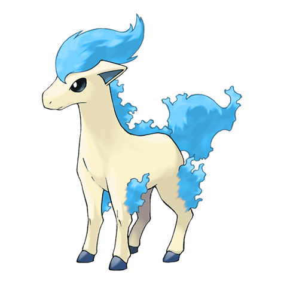

# Ponyta (Fire Horse Pokémon)

| Official Artwork | Shiny Artwork |
| --- | --- |
|  |  |

As a newborn, it can barely stand. However, through galloping, its legs are made tougher and faster.

---

## Media

### Cries

No cries available.

---

## Pokédex Data

| National № | Type(s) | Height | Weight | Abilities | Local № |
|------------|---------|--------|--------|-----------|---------|
| #77 | {: width='48'} | 1.0 m | 30.0 kg | 1. Flame-Body 2. Flash-Fire | #90 |

---

## Base Stats
|   | HP | Attack | Defense | Sp. Atk | Sp. Def | Speed |
|---|----|--------|---------|---------|---------|-------|
| **Base** | 50 | 85 | 55 | 65 | 65 | 90 |
| **Min** | 210 | 157 | 103 | 121 | 121 | 166 |
| **Max** | 304 | 295 | 229 | 251 | 251 | 306 |

The ranges shown above are for a level 100 Pokémon. Maximum values are based on a beneficial nature, 252 EVs, 31 IVs; minimum values are based on a hindering nature, 0 EVs, 0 IVs.

---

## Forms & Evolutions

!!! warning "WARNING"

    Information on evolutions may not be 100% accurate; differences between evolution methods across generations are not accounted for.

### Forms

Ponyta has no alternate forms.

### Evolution Line

1. [Ponyta](ponyta.md/)
    1. Level Up: [Rapidash](rapidash.md/)

---

## Training

| EV Yield | Catch Rate | Base Friendship | Base Exp. | Growth Rate | Held Items |
|----------|------------|-----------------|-----------|-------------|------------|
| 1 Speed | 190 | 50 | 82 | Medium | shuca-berry (5%) |

---

## Breeding

| Egg Groups | Egg Cycles | Gender | Dimorphic | Color | Shape |
|------------|------------|--------|-----------|-------|-------|
| 1. Ground | 20 | 50.0% Male 50.0% Female | False | Yellow | Quadruped |

---

## Moves

!!! warning "WARNING"

    Specific move information may be incorrect. However, the general movepool should be accurate; this includes changes made in Renegade Platinum.

### Level Up Moves

| Lv. | Move | Type | Cat. | Power | Acc. | PP |
| --- | --- | --- | --- | --- | --- | --- |
| 1 | Growl | {: width='48'} | {: width='36'} | — | 100 | 40 |
| 1 | Tackle | {: width='48'} | {: width='36'} | 40 | 100 | 35 |
| 1 | Tail Whip | {: width='48'} | {: width='36'} | — | 100 | 30 |
| 7 | Ember | {: width='48'} | {: width='36'} | 40 | 100 | 25 |
| 10 | Stomp | {: width='48'} | {: width='36'} | 65 | 100 | 20 |
| 13 | Double Kick | {: width='48'} | {: width='36'} | 30 | 100 | 30 |
| 16 | Flame Wheel | {: width='48'} | {: width='36'} | 75 | 100 | 15 |
| 19 | Take Down | {: width='48'} | {: width='36'} | 90 | 85 | 20 |
| 22 | Fire Spin | {: width='48'} | {: width='36'} | 35 | 85 | 15 |
| 25 | Agility | {: width='48'} | {: width='36'} | — | — | 30 |
| 28 | Hypnosis | {: width='48'} | {: width='36'} | — | 60 | 20 |
| 31 | Low Kick | {: width='48'} | {: width='36'} | — | 100 | 20 |
| 34 | Flare Blitz | {: width='48'} | {: width='36'} | 120 | 100 | 15 |
| 37 | Double Edge | {: width='48'} | {: width='36'} | 120 | 100 | 15 |
| 40 | Bounce | {: width='48'} | {: width='36'} | 85 | 85 | 5 |
| 43 | Jump Kick | {: width='48'} | {: width='36'} | 100 | 95 | 10 |
| 46 | Fire Blast | {: width='48'} | {: width='36'} | 110 | 85 | 5 |

### TM Moves

| TM | Move | Type | Cat. | Power | Acc. | PP |
| --- | --- | --- | --- | --- | --- | --- |
| HM04 | Strength | {: width='48'} | {: width='36'} | 100 | 100 | 15 |
| TM06 | Toxic | {: width='48'} | {: width='36'} | — | 90 | 10 |
| TM10 | Hidden Power | {: width='48'} | {: width='36'} | 60 | 100 | 15 |
| TM11 | Sunny Day | {: width='48'} | {: width='36'} | — | — | 5 |
| TM17 | Protect | {: width='48'} | {: width='36'} | — | — | 10 |
| TM21 | Frustration | {: width='48'} | {: width='36'} | — | 100 | 20 |
| TM22 | Solar Beam | {: width='48'} | {: width='36'} | 120 | 100 | 10 |
| TM23 | Iron Tail | {: width='48'} | {: width='36'} | 100 | 75 | 15 |
| TM27 | Return | {: width='48'} | {: width='36'} | — | 100 | 20 |
| TM32 | Double Team | {: width='48'} | {: width='36'} | — | — | 15 |
| TM35 | Flamethrower | {: width='48'} | {: width='36'} | 90 | 100 | 15 |
| TM38 | Fire Blast | {: width='48'} | {: width='36'} | 110 | 85 | 5 |
| TM42 | Facade | {: width='48'} | {: width='36'} | 70 | 100 | 20 |
| TM43 | Secret Power | {: width='48'} | {: width='36'} | 70 | 100 | 20 |
| TM44 | Rest | {: width='48'} | {: width='36'} | — | — | 5 |
| TM45 | Attract | {: width='48'} | {: width='36'} | — | 100 | 15 |
| TM50 | Overheat | {: width='48'} | {: width='36'} | 130 | 90 | 5 |
| TM58 | Endure | {: width='48'} | {: width='36'} | — | — | 10 |
| TM61 | Will O Wisp | {: width='48'} | {: width='36'} | — | 85 | 15 |
| TM78 | Captivate | {: width='48'} | {: width='36'} | — | 100 | 20 |
| TM82 | Sleep Talk | {: width='48'} | {: width='36'} | — | — | 10 |
| TM83 | Natural Gift | {: width='48'} | {: width='36'} | — | 100 | 15 |
| TM87 | Swagger | {: width='48'} | {: width='36'} | — | 85 | 15 |
| TM90 | Substitute | {: width='48'} | {: width='36'} | — | — | 10 |

### Egg Moves

| Move | Type | Cat. | Power | Acc. | PP |
| --- | --- | --- | --- | --- | --- |
| Double Kick | {: width='48'} | {: width='36'} | 30 | 100 | 30 |
| Horn Drill | {: width='48'} | {: width='36'} | — | 30 | 5 |
| Thrash | {: width='48'} | {: width='36'} | 120 | 100 | 10 |
| Double Edge | {: width='48'} | {: width='36'} | 120 | 100 | 15 |
| Hypnosis | {: width='48'} | {: width='36'} | — | 60 | 20 |
| Flame Wheel | {: width='48'} | {: width='36'} | 75 | 100 | 15 |
| Charm | {: width='48'} | {: width='36'} | — | 100 | 20 |

### Tutor Moves

| Move | Type | Cat. | Power | Acc. | PP |
| --- | --- | --- | --- | --- | --- |
| Swift | {: width='48'} | {: width='36'} | 60 | — | 20 |
| Snore | {: width='48'} | {: width='36'} | 50 | 100 | 15 |
| Heat Wave | {: width='48'} | {: width='36'} | 95 | 90 | 10 |
| Bounce | {: width='48'} | {: width='36'} | 85 | 85 | 5 |

