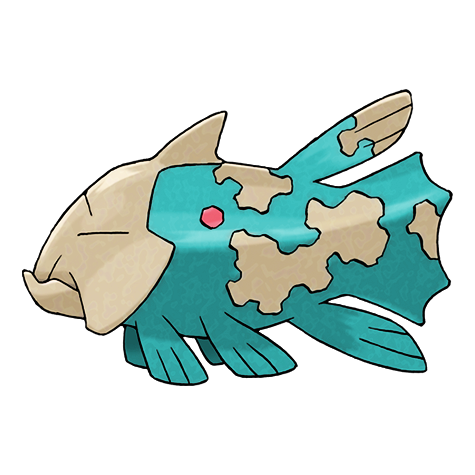

# Relicanth (Longevity Pokémon)

| Official Artwork | Shiny Artwork |
| --- | --- |
|  |  |

A rare Pokémon discovered during a deep-sea exploration. It has not changed in over 100 million years.

---

## Media

### Cries

Latest (Gen VI+):

<audio controls>
<source src='../../assets/cries/relicanth/latest.ogg' type='audio/ogg'>
  Your browser does not support the audio element.
</audio>

Legacy:

<audio controls>
<source src='../../assets/cries/relicanth/legacy.ogg' type='audio/ogg'>
  Your browser does not support the audio element.
</audio>

---

## Pokédex Data

| National № | Type(s) | Height | Weight | Abilities | Local № |
|------------|---------|--------|--------|-----------|---------|
| #369 | {: width='48'} {: width='48'} | 1.0 m | 23.4 kg | 1. Rock-Head 2. Swift-Swim | N/A |

---

## Base Stats
|   | HP | Attack | Defense | Sp. Atk | Sp. Def | Speed |
|---|----|--------|---------|---------|---------|-------|
| **Base** | 100 | 90 | 130 | 45 | 65 | 55 |
| **Min** | 310 | 166 | 238 | 85 | 121 | 103 |
| **Max** | 404 | 306 | 394 | 207 | 251 | 229 |

The ranges shown above are for a level 100 Pokémon. Maximum values are based on a beneficial nature, 252 EVs, 31 IVs; minimum values are based on a hindering nature, 0 EVs, 0 IVs.

---

## Forms & Evolutions

!!! warning "WARNING"

    Information on evolutions may not be 100% accurate; differences between evolution methods across generations are not accounted for.

### Forms

Relicanth has no alternate forms.

### Evolution Line

1. [Relicanth](relicanth.md/)

---

## Training

| EV Yield | Catch Rate | Base Friendship | Base Exp. | Growth Rate | Held Items |
|----------|------------|-----------------|-----------|-------------|------------|
| 1 Hp 1 Defense | 25 | 50 | 170 | Slow | deep-sea-scale (5%) |

---

## Breeding

| Egg Groups | Egg Cycles | Gender | Dimorphic | Color | Shape |
|------------|------------|--------|-----------|-------|-------|
| 1. Water1 2. Water2 | 40 | 87.5% Male 12.5% Female | True | Gray | Fish |

---

## Moves

!!! warning "WARNING"

    Specific move information may be incorrect. However, the general movepool should be accurate; this includes changes made in Renegade Platinum.

### Level Up Moves

| Lv. | Move | Type | Cat. | Power | Acc. | PP |
| --- | --- | --- | --- | --- | --- | --- |
| 1 | Harden | {: width='48'} | {: width='36'} | — | — | 30 |
| 1 | Mud Sport | {: width='48'} | {: width='36'} | — | — | 15 |
| 1 | Tackle | {: width='48'} | {: width='36'} | 40 | 100 | 35 |
| 1 | Water Gun | {: width='48'} | {: width='36'} | 40 | 100 | 25 |
| 7 | Rock Tomb | {: width='48'} | {: width='36'} | 60 | 95 | 15 |
| 10 | Ancient Power | {: width='48'} | {: width='36'} | 60 | 100 | 5 |
| 13 | Dive | {: width='48'} | {: width='36'} | 80 | 100 | 10 |
| 16 | Take Down | {: width='48'} | {: width='36'} | 90 | 85 | 20 |
| 19 | Yawn | {: width='48'} | {: width='36'} | — | — | 10 |
| 22 | Rock Slide | {: width='48'} | {: width='36'} | 75 | 90 | 10 |
| 25 | Magnitude | {: width='48'} | {: width='36'} | — | 100 | 30 |
| 28 | Aqua Tail | {: width='48'} | {: width='36'} | 90 | 90 | 10 |
| 31 | Rest | {: width='48'} | {: width='36'} | — | — | 5 |
| 34 | Zen Headbutt | {: width='48'} | {: width='36'} | 80 | 90 | 15 |
| 37 | Flail | {: width='48'} | {: width='36'} | — | 100 | 15 |
| 40 | Stone Edge | {: width='48'} | {: width='36'} | 100 | 80 | 5 |
| 43 | Amnesia | {: width='48'} | {: width='36'} | — | — | 20 |
| 46 | Earthquake | {: width='48'} | {: width='36'} | 100 | 100 | 10 |
| 49 | Double Edge | {: width='48'} | {: width='36'} | 120 | 100 | 15 |
| 52 | Hydro Pump | {: width='48'} | {: width='36'} | 110 | 80 | 5 |
| 55 | Head Smash | {: width='48'} | {: width='36'} | 150 | 80 | 5 |

### TM Moves

| TM | Move | Type | Cat. | Power | Acc. | PP |
| --- | --- | --- | --- | --- | --- | --- |
| HM03 | Surf | {: width='48'} | {: width='36'} | 90 | 100 | 15 |
| HM06 | Rock Smash | {: width='48'} | {: width='36'} | 60 | 100 | 15 |
| HM07 | Waterfall | {: width='48'} | {: width='36'} | 80 | 100 | 15 |
| TM03 | Water Pulse | {: width='48'} | {: width='36'} | 60 | 100 | 20 |
| TM04 | Calm Mind | {: width='48'} | {: width='36'} | — | — | 20 |
| TM06 | Toxic | {: width='48'} | {: width='36'} | — | 90 | 10 |
| TM07 | Hail | {: width='48'} | {: width='36'} | — | — | 10 |
| TM10 | Hidden Power | {: width='48'} | {: width='36'} | 60 | 100 | 15 |
| TM13 | Ice Beam | {: width='48'} | {: width='36'} | 90 | 100 | 10 |
| TM14 | Blizzard | {: width='48'} | {: width='36'} | 110 | 70 | 5 |
| TM15 | Hyper Beam | {: width='48'} | {: width='36'} | 150 | 90 | 5 |
| TM17 | Protect | {: width='48'} | {: width='36'} | — | — | 10 |
| TM18 | Rain Dance | {: width='48'} | {: width='36'} | — | — | 5 |
| TM20 | Safeguard | {: width='48'} | {: width='36'} | — | — | 25 |
| TM21 | Frustration | {: width='48'} | {: width='36'} | — | 100 | 20 |
| TM26 | Earthquake | {: width='48'} | {: width='36'} | 100 | 100 | 10 |
| TM27 | Return | {: width='48'} | {: width='36'} | — | 100 | 20 |
| TM32 | Double Team | {: width='48'} | {: width='36'} | — | — | 15 |
| TM37 | Sandstorm | {: width='48'} | {: width='36'} | — | — | 10 |
| TM39 | Rock Tomb | {: width='48'} | {: width='36'} | 60 | 95 | 15 |
| TM42 | Facade | {: width='48'} | {: width='36'} | 70 | 100 | 20 |
| TM43 | Secret Power | {: width='48'} | {: width='36'} | 70 | 100 | 20 |
| TM44 | Rest | {: width='48'} | {: width='36'} | — | — | 5 |
| TM45 | Attract | {: width='48'} | {: width='36'} | — | 100 | 15 |
| TM55 | Brine | {: width='48'} | {: width='36'} | 65 | 100 | 10 |
| TM58 | Endure | {: width='48'} | {: width='36'} | — | — | 10 |
| TM68 | Giga Impact | {: width='48'} | {: width='36'} | 150 | 90 | 5 |
| TM69 | Rock Polish | {: width='48'} | {: width='36'} | — | — | 20 |
| TM71 | Stone Edge | {: width='48'} | {: width='36'} | 100 | 80 | 5 |
| TM76 | Stealth Rock | {: width='48'} | {: width='36'} | — | — | 20 |
| TM77 | Psych Up | {: width='48'} | {: width='36'} | — | — | 10 |
| TM78 | Captivate | {: width='48'} | {: width='36'} | — | 100 | 20 |
| TM80 | Rock Slide | {: width='48'} | {: width='36'} | 75 | 90 | 10 |
| TM82 | Sleep Talk | {: width='48'} | {: width='36'} | — | — | 10 |
| TM83 | Natural Gift | {: width='48'} | {: width='36'} | — | 100 | 15 |
| TM87 | Swagger | {: width='48'} | {: width='36'} | — | 85 | 15 |
| TM90 | Substitute | {: width='48'} | {: width='36'} | — | — | 10 |

### Egg Moves

| Move | Type | Cat. | Power | Acc. | PP |
| --- | --- | --- | --- | --- | --- |
| Skull Bash | {: width='48'} | {: width='36'} | 130 | 100 | 10 |
| Amnesia | {: width='48'} | {: width='36'} | — | — | 20 |
| Rock Slide | {: width='48'} | {: width='36'} | 75 | 90 | 10 |
| Snore | {: width='48'} | {: width='36'} | 50 | 100 | 15 |
| Mud Slap | {: width='48'} | {: width='36'} | 20 | 100 | 10 |
| Sleep Talk | {: width='48'} | {: width='36'} | — | — | 10 |
| Magnitude | {: width='48'} | {: width='36'} | — | 100 | 30 |
| Water Sport | {: width='48'} | {: width='36'} | — | — | 15 |
| Aqua Tail | {: width='48'} | {: width='36'} | 90 | 90 | 10 |

### Tutor Moves

| Move | Type | Cat. | Power | Acc. | PP |
| --- | --- | --- | --- | --- | --- |
| Snore | {: width='48'} | {: width='36'} | 50 | 100 | 15 |
| Mud Slap | {: width='48'} | {: width='36'} | 20 | 100 | 10 |
| Icy Wind | {: width='48'} | {: width='36'} | 55 | 95 | 15 |
| Ancient Power | {: width='48'} | {: width='36'} | 60 | 100 | 5 |
| Dive | {: width='48'} | {: width='36'} | 80 | 100 | 10 |
| Bounce | {: width='48'} | {: width='36'} | 85 | 85 | 5 |
| Aqua Tail | {: width='48'} | {: width='36'} | 90 | 90 | 10 |
| Earth Power | {: width='48'} | {: width='36'} | 90 | 100 | 10 |

