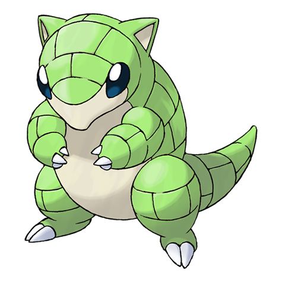

# Sandshrew (Mouse Pokémon)

| Official Artwork | Shiny Artwork |
| --- | --- |
|  |  |

To protect itself from attackers, it curls up into a ball. It lives in arid regions with minimal rainfall.

---

## Media

### Cries

Latest (Gen VI+):

<audio controls>
<source src='../../assets/cries/sandshrew/latest.ogg' type='audio/ogg'>
  Your browser does not support the audio element.
</audio>

Legacy:

<audio controls>
<source src='../../assets/cries/sandshrew/legacy.ogg' type='audio/ogg'>
  Your browser does not support the audio element.
</audio>

---

## Pokédex Data

| National № | Type(s) | Height | Weight | Abilities | Local № |
|------------|---------|--------|--------|-----------|---------|
| #27 | {: width='48'} | 0.6 m | 12.0 kg | 1. Sand-Veil 2. Sand-Rush | N/A |

---

## Base Stats
|   | HP | Attack | Defense | Sp. Atk | Sp. Def | Speed |
|---|----|--------|---------|---------|---------|-------|
| **Base** | 50 | 75 | 85 | 20 | 30 | 40 |
| **Min** | 210 | 139 | 157 | 40 | 58 | 76 |
| **Max** | 304 | 273 | 295 | 152 | 174 | 196 |

The ranges shown above are for a level 100 Pokémon. Maximum values are based on a beneficial nature, 252 EVs, 31 IVs; minimum values are based on a hindering nature, 0 EVs, 0 IVs.

---

## Forms & Evolutions

!!! warning "WARNING"

    Information on evolutions may not be 100% accurate; differences between evolution methods across generations are not accounted for.

### Forms

Sandshrew has no alternate forms.

### Evolution Line

1. [Sandshrew](sandshrew.md/)
    1. Use Item: [Sandslash](sandslash.md/)

---

## Training

| EV Yield | Catch Rate | Base Friendship | Base Exp. | Growth Rate | Held Items |
|----------|------------|-----------------|-----------|-------------|------------|
| 1 Defense | 255 | 50 | 60 | Medium | quick-claw (5%) |

---

## Breeding

| Egg Groups | Egg Cycles | Gender | Dimorphic | Color | Shape |
|------------|------------|--------|-----------|-------|-------|
| 1. Ground | 20 | 50.0% Male 50.0% Female | False | Yellow | Upright |

---

## Moves

!!! warning "WARNING"

    Specific move information may be incorrect. However, the general movepool should be accurate; this includes changes made in Renegade Platinum.

### Level Up Moves

| Lv. | Move | Type | Cat. | Power | Acc. | PP |
| --- | --- | --- | --- | --- | --- | --- |
| 1 | Defense Curl | {: width='48'} | {: width='36'} | — | — | 40 |
| 1 | Poison Sting | {: width='48'} | {: width='36'} | 15 | 100 | 35 |
| 1 | Sand Attack | {: width='48'} | {: width='36'} | — | 100 | 15 |
| 1 | Scratch | {: width='48'} | {: width='36'} | 40 | 100 | 35 |
| 7 | Rollout | {: width='48'} | {: width='36'} | 30 | 90 | 20 |
| 9 | Bulldoze | {: width='48'} | {: width='36'} | 60 | 100 | 20 |
| 11 | Rapid Spin | {: width='48'} | {: width='36'} | 50 | 100 | 40 |
| 13 | Fury Cutter | {: width='48'} | {: width='36'} | 40 | 95 | 20 |
| 15 | Swift | {: width='48'} | {: width='36'} | 60 | — | 20 |
| 18 | Magnitude | {: width='48'} | {: width='36'} | — | 100 | 30 |
| 21 | Fury Swipes | {: width='48'} | {: width='36'} | 18 | 80 | 15 |
| 24 | Night Slash | {: width='48'} | {: width='36'} | 70 | 100 | 15 |
| 24 | Slash | {: width='48'} | {: width='36'} | 70 | 100 | 20 |
| 27 | Dig | {: width='48'} | {: width='36'} | 80 | 100 | 10 |
| 30 | Gyro Ball | {: width='48'} | {: width='36'} | — | 100 | 5 |
| 33 | Poison Jab | {: width='48'} | {: width='36'} | 80 | 100 | 20 |
| 36 | Earthquake | {: width='48'} | {: width='36'} | 100 | 100 | 10 |
| 39 | Swords Dance | {: width='48'} | {: width='36'} | — | — | 20 |
| 42 | Sandstorm | {: width='48'} | {: width='36'} | — | — | 10 |
| 45 | Fissure | {: width='48'} | {: width='36'} | — | 30 | 5 |

### TM Moves

| TM | Move | Type | Cat. | Power | Acc. | PP |
| --- | --- | --- | --- | --- | --- | --- |
| HM01 | Cut | {: width='48'} | {: width='36'} | 60 | 100% | 25 |
| HM04 | Strength | {: width='48'} | {: width='36'} | 100 | 100 | 15 |
| HM06 | Rock Smash | {: width='48'} | {: width='36'} | 60 | 100 | 15 |
| HM08 | Rock Climb | {: width='48'} | {: width='36'} | 80 | 95% | 10 |
| TM01 | Focus Punch | {: width='48'} | {: width='36'} | 150 | 100 | 20 |
| TM06 | Toxic | {: width='48'} | {: width='36'} | — | 90 | 10 |
| TM10 | Hidden Power | {: width='48'} | {: width='36'} | 60 | 100 | 15 |
| TM11 | Sunny Day | {: width='48'} | {: width='36'} | — | — | 5 |
| TM17 | Protect | {: width='48'} | {: width='36'} | — | — | 10 |
| TM21 | Frustration | {: width='48'} | {: width='36'} | — | 100 | 20 |
| TM23 | Iron Tail | {: width='48'} | {: width='36'} | 100 | 75 | 15 |
| TM26 | Earthquake | {: width='48'} | {: width='36'} | 100 | 100 | 10 |
| TM27 | Return | {: width='48'} | {: width='36'} | — | 100 | 20 |
| TM28 | Dig | {: width='48'} | {: width='36'} | 80 | 100 | 10 |
| TM31 | Brick Break | {: width='48'} | {: width='36'} | 75 | 100 | 15 |
| TM32 | Double Team | {: width='48'} | {: width='36'} | — | — | 15 |
| TM37 | Sandstorm | {: width='48'} | {: width='36'} | — | — | 10 |
| TM39 | Rock Tomb | {: width='48'} | {: width='36'} | 60 | 95 | 15 |
| TM40 | Aerial Ace | {: width='48'} | {: width='36'} | 60 | — | 20 |
| TM42 | Facade | {: width='48'} | {: width='36'} | 70 | 100 | 20 |
| TM43 | Secret Power | {: width='48'} | {: width='36'} | 70 | 100 | 20 |
| TM44 | Rest | {: width='48'} | {: width='36'} | — | — | 5 |
| TM45 | Attract | {: width='48'} | {: width='36'} | — | 100 | 15 |
| TM46 | Thief | {: width='48'} | {: width='36'} | 60 | 100 | 25 |
| TM56 | Fling | {: width='48'} | {: width='36'} | — | 100 | 10 |
| TM58 | Endure | {: width='48'} | {: width='36'} | — | — | 10 |
| TM65 | Shadow Claw | {: width='48'} | {: width='36'} | 80 | 100 | 15 |
| TM74 | Gyro Ball | {: width='48'} | {: width='36'} | — | 100 | 5 |
| TM75 | Swords Dance | {: width='48'} | {: width='36'} | — | — | 20 |
| TM76 | Stealth Rock | {: width='48'} | {: width='36'} | — | — | 20 |
| TM78 | Captivate | {: width='48'} | {: width='36'} | — | 100 | 20 |
| TM80 | Rock Slide | {: width='48'} | {: width='36'} | 75 | 90 | 10 |
| TM81 | X Scissor | {: width='48'} | {: width='36'} | 80 | 100 | 15 |
| TM82 | Sleep Talk | {: width='48'} | {: width='36'} | — | — | 10 |
| TM83 | Natural Gift | {: width='48'} | {: width='36'} | — | 100 | 15 |
| TM84 | Poison Jab | {: width='48'} | {: width='36'} | 80 | 100 | 20 |
| TM87 | Swagger | {: width='48'} | {: width='36'} | — | 85 | 15 |
| TM90 | Substitute | {: width='48'} | {: width='36'} | — | — | 10 |

### Egg Moves

| Move | Type | Cat. | Power | Acc. | PP |
| --- | --- | --- | --- | --- | --- |
| Swords Dance | {: width='48'} | {: width='36'} | — | — | 20 |
| Counter | {: width='48'} | {: width='36'} | — | 100 | 20 |
| Rock Slide | {: width='48'} | {: width='36'} | 75 | 90 | 10 |
| Flail | {: width='48'} | {: width='36'} | — | 100 | 15 |
| Safeguard | {: width='48'} | {: width='36'} | — | — | 25 |
| Rapid Spin | {: width='48'} | {: width='36'} | 50 | 100 | 40 |
| Metal Claw | {: width='48'} | {: width='36'} | 50 | 95 | 35 |
| Crush Claw | {: width='48'} | {: width='36'} | 75 | 95 | 10 |
| Night Slash | {: width='48'} | {: width='36'} | 70 | 100 | 15 |

### Tutor Moves

| Move | Type | Cat. | Power | Acc. | PP |
| --- | --- | --- | --- | --- | --- |
| Swift | {: width='48'} | {: width='36'} | 60 | — | 20 |
| Snore | {: width='48'} | {: width='36'} | 50 | 100 | 15 |
| Mud Slap | {: width='48'} | {: width='36'} | 20 | 100 | 10 |
| Rollout | {: width='48'} | {: width='36'} | 30 | 90 | 20 |
| Fury Cutter | {: width='48'} | {: width='36'} | 40 | 95 | 20 |
| Knock Off | {: width='48'} | {: width='36'} | 65 | 100 | 20 |
| Earth Power | {: width='48'} | {: width='36'} | 90 | 100 | 10 |

