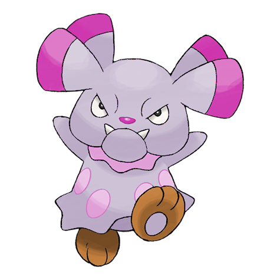

# Snubbull (Fairy Pokémon)

| Official Artwork | Shiny Artwork |
| --- | --- |
|  |  |

Small Pokémon flee from its scary face. It is, however, considered by women to be cute.

---

## Media

### Cries

No cries available.

---

## Pokédex Data

| National № | Type(s) | Height | Weight | Abilities | Local № |
|------------|---------|--------|--------|-----------|---------|
| #209 | {: width='48'} | 0.6 m | 7.8 kg | 1. Intimidate 2. Run-Away 3. Rattled | N/A |

---

## Base Stats
|   | HP | Attack | Defense | Sp. Atk | Sp. Def | Speed |
|---|----|--------|---------|---------|---------|-------|
| **Base** | 60 | 80 | 50 | 40 | 40 | 30 |
| **Min** | 230 | 148 | 94 | 76 | 76 | 58 |
| **Max** | 324 | 284 | 218 | 196 | 196 | 174 |

The ranges shown above are for a level 100 Pokémon. Maximum values are based on a beneficial nature, 252 EVs, 31 IVs; minimum values are based on a hindering nature, 0 EVs, 0 IVs.

---

## Forms & Evolutions

!!! warning "WARNING"

    Information on evolutions may not be 100% accurate; differences between evolution methods across generations are not accounted for.

### Forms

Snubbull has no alternate forms.

### Evolution Line

1. [Snubbull](snubbull.md/)
    1. Level Up: [Granbull](granbull.md/)

---

## Training

| EV Yield | Catch Rate | Base Friendship | Base Exp. | Growth Rate | Held Items |
|----------|------------|-----------------|-----------|-------------|------------|
| 1 Attack | 190 | 70 | 60 | Fast | N/A |

---

## Breeding

| Egg Groups | Egg Cycles | Gender | Dimorphic | Color | Shape |
|------------|------------|--------|-----------|-------|-------|
| 1. Ground 2. Fairy | 20 | 25.0% Male 75.0% Female | False | Pink | Humanoid |

---

## Moves

!!! warning "WARNING"

    Specific move information may be incorrect. However, the general movepool should be accurate; this includes changes made in Renegade Platinum.

### Level Up Moves

| Lv. | Move | Type | Cat. | Power | Acc. | PP |
| --- | --- | --- | --- | --- | --- | --- |
| 1 | Fire Fang | {: width='48'} | {: width='36'} | 65 | 95 | 15 |
| 1 | Ice Fang | {: width='48'} | {: width='36'} | 65 | 95 | 15 |
| 1 | Lovely Kiss | {: width='48'} | {: width='36'} | — | 75 | 10 |
| 1 | Scary Face | {: width='48'} | {: width='36'} | — | 100 | 10 |
| 1 | Tackle | {: width='48'} | {: width='36'} | 40 | 100 | 35 |
| 1 | Thunder Fang | {: width='48'} | {: width='36'} | 65 | 95 | 15 |
| 4 | Tail Whip | {: width='48'} | {: width='36'} | — | 100 | 30 |
| 7 | Charm | {: width='48'} | {: width='36'} | — | 100 | 20 |
| 10 | Lick | {: width='48'} | {: width='36'} | 30 | 100 | 30 |
| 13 | Bite | {: width='48'} | {: width='36'} | 60 | 100 | 25 |
| 16 | Headbutt | {: width='48'} | {: width='36'} | 70 | 100 | 15 |
| 19 | Roar | {: width='48'} | {: width='36'} | — | — | 20 |
| 22 | Rage | {: width='48'} | {: width='36'} | 20 | 100 | 20 |
| 25 | Play Rough | {: width='48'} | {: width='36'} | 90 | 90 | 10 |
| 28 | Crunch | {: width='48'} | {: width='36'} | 80 | 100 | 15 |
| 31 | Super Fang | {: width='48'} | {: width='36'} | — | 90 | 10 |
| 34 | Payback | {: width='48'} | {: width='36'} | 50 | 100 | 10 |
| 37 | Close Combat | {: width='48'} | {: width='36'} | 120 | 100 | 5 |
| 40 | Heal Bell | {: width='48'} | {: width='36'} | — | — | 5 |
| 43 | Double Edge | {: width='48'} | {: width='36'} | 120 | 100 | 15 |

### TM Moves

| TM | Move | Type | Cat. | Power | Acc. | PP |
| --- | --- | --- | --- | --- | --- | --- |
| HM04 | Strength | {: width='48'} | {: width='36'} | 100 | 100 | 15 |
| HM06 | Rock Smash | {: width='48'} | {: width='36'} | 60 | 100 | 15 |
| TM01 | Focus Punch | {: width='48'} | {: width='36'} | 150 | 100 | 20 |
| TM03 | Water Pulse | {: width='48'} | {: width='36'} | 60 | 100 | 20 |
| TM05 | Roar | {: width='48'} | {: width='36'} | — | — | 20 |
| TM06 | Toxic | {: width='48'} | {: width='36'} | — | 90 | 10 |
| TM08 | Bulk Up | {: width='48'} | {: width='36'} | — | — | 20 |
| TM10 | Hidden Power | {: width='48'} | {: width='36'} | 60 | 100 | 15 |
| TM11 | Sunny Day | {: width='48'} | {: width='36'} | — | — | 5 |
| TM12 | Taunt | {: width='48'} | {: width='36'} | — | 100 | 20 |
| TM17 | Protect | {: width='48'} | {: width='36'} | — | — | 10 |
| TM18 | Rain Dance | {: width='48'} | {: width='36'} | — | — | 5 |
| TM21 | Frustration | {: width='48'} | {: width='36'} | — | 100 | 20 |
| TM22 | Solar Beam | {: width='48'} | {: width='36'} | 120 | 100 | 10 |
| TM24 | Thunderbolt | {: width='48'} | {: width='36'} | 90 | 100 | 15 |
| TM25 | Thunder | {: width='48'} | {: width='36'} | 110 | 70 | 10 |
| TM26 | Earthquake | {: width='48'} | {: width='36'} | 100 | 100 | 10 |
| TM27 | Return | {: width='48'} | {: width='36'} | — | 100 | 20 |
| TM28 | Dig | {: width='48'} | {: width='36'} | 80 | 100 | 10 |
| TM30 | Shadow Ball | {: width='48'} | {: width='36'} | 80 | 100 | 15 |
| TM31 | Brick Break | {: width='48'} | {: width='36'} | 75 | 100 | 15 |
| TM32 | Double Team | {: width='48'} | {: width='36'} | — | — | 15 |
| TM34 | Shock Wave | {: width='48'} | {: width='36'} | 60 | — | 20 |
| TM35 | Flamethrower | {: width='48'} | {: width='36'} | 90 | 100 | 15 |
| TM36 | Sludge Bomb | {: width='48'} | {: width='36'} | 90 | 100 | 10 |
| TM38 | Fire Blast | {: width='48'} | {: width='36'} | 110 | 85 | 5 |
| TM41 | Torment | {: width='48'} | {: width='36'} | — | 100 | 15 |
| TM42 | Facade | {: width='48'} | {: width='36'} | 70 | 100 | 20 |
| TM43 | Secret Power | {: width='48'} | {: width='36'} | 70 | 100 | 20 |
| TM44 | Rest | {: width='48'} | {: width='36'} | — | — | 5 |
| TM45 | Attract | {: width='48'} | {: width='36'} | — | 100 | 15 |
| TM46 | Thief | {: width='48'} | {: width='36'} | 60 | 100 | 25 |
| TM50 | Overheat | {: width='48'} | {: width='36'} | 130 | 90 | 5 |
| TM56 | Fling | {: width='48'} | {: width='36'} | — | 100 | 10 |
| TM58 | Endure | {: width='48'} | {: width='36'} | — | — | 10 |
| TM66 | Payback | {: width='48'} | {: width='36'} | 50 | 100 | 10 |
| TM73 | Thunder Wave | {: width='48'} | {: width='36'} | — | 90 | 20 |
| TM78 | Captivate | {: width='48'} | {: width='36'} | — | 100 | 20 |
| TM82 | Sleep Talk | {: width='48'} | {: width='36'} | — | — | 10 |
| TM83 | Natural Gift | {: width='48'} | {: width='36'} | — | 100 | 15 |
| TM87 | Swagger | {: width='48'} | {: width='36'} | — | 85 | 15 |
| TM90 | Substitute | {: width='48'} | {: width='36'} | — | — | 10 |

### Egg Moves

| Move | Type | Cat. | Power | Acc. | PP |
| --- | --- | --- | --- | --- | --- |
| Reflect | {: width='48'} | {: width='36'} | — | — | 20 |
| Metronome | {: width='48'} | {: width='36'} | — | — | 10 |
| Snore | {: width='48'} | {: width='36'} | 50 | 100 | 15 |
| Feint Attack | {: width='48'} | {: width='36'} | 60 | — | 20 |
| Heal Bell | {: width='48'} | {: width='36'} | — | — | 5 |
| Present | {: width='48'} | {: width='36'} | — | 90 | 15 |
| Crunch | {: width='48'} | {: width='36'} | 80 | 100 | 15 |
| Smelling Salts | {: width='48'} | {: width='36'} | 70 | 100 | 10 |
| Close Combat | {: width='48'} | {: width='36'} | 120 | 100 | 5 |
| Thunder Fang | {: width='48'} | {: width='36'} | 65 | 95 | 15 |
| Ice Fang | {: width='48'} | {: width='36'} | 65 | 95 | 15 |
| Fire Fang | {: width='48'} | {: width='36'} | 65 | 95 | 15 |

### Tutor Moves

| Move | Type | Cat. | Power | Acc. | PP |
| --- | --- | --- | --- | --- | --- |
| Fire Punch | {: width='48'} | {: width='36'} | 75 | 100 | 15 |
| Ice Punch | {: width='48'} | {: width='36'} | 75 | 100 | 15 |
| Thunder Punch | {: width='48'} | {: width='36'} | 75 | 100 | 15 |
| Snore | {: width='48'} | {: width='36'} | 50 | 100 | 15 |
| Mud Slap | {: width='48'} | {: width='36'} | 20 | 100 | 10 |
| Superpower | {: width='48'} | {: width='36'} | 120 | 100 | 5 |
| Last Resort | {: width='48'} | {: width='36'} | 140 | 100 | 5 |

