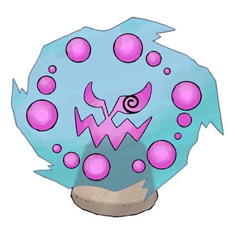

# Spiritomb (Forbidden Pokémon)

| Official Artwork | Shiny Artwork |
| --- | --- |
|  |  |

Its constant mischief and misdeeds resulted in it being bound to an Odd Keystone by a mysterious spell.

---

## Media

### Cries

Latest (Gen VI+):

<audio controls>
<source src='../../assets/cries/spiritomb/latest.ogg' type='audio/ogg'>
  Your browser does not support the audio element.
</audio>

Legacy:

<audio controls>
<source src='../../assets/cries/spiritomb/legacy.ogg' type='audio/ogg'>
  Your browser does not support the audio element.
</audio>

---

## Pokédex Data

| National № | Type(s) | Height | Weight | Abilities | Local № |
|------------|---------|--------|--------|-----------|---------|
| #442 | {: width='48'} {: width='48'} | 1.0 m | 108.0 kg | 1. Pressure 2. Infiltrator | #108 |

---

## Base Stats
|   | HP | Attack | Defense | Sp. Atk | Sp. Def | Speed |
|---|----|--------|---------|---------|---------|-------|
| **Base** | 50 | 92 | 108 | 92 | 108 | 35 |
| **Min** | 210 | 170 | 198 | 170 | 198 | 67 |
| **Max** | 304 | 311 | 346 | 311 | 346 | 185 |

The ranges shown above are for a level 100 Pokémon. Maximum values are based on a beneficial nature, 252 EVs, 31 IVs; minimum values are based on a hindering nature, 0 EVs, 0 IVs.

---

## Forms & Evolutions

!!! warning "WARNING"

    Information on evolutions may not be 100% accurate; differences between evolution methods across generations are not accounted for.

### Forms

Spiritomb has no alternate forms.

### Evolution Line

1. [Spiritomb](spiritomb.md/)

---

## Training

| EV Yield | Catch Rate | Base Friendship | Base Exp. | Growth Rate | Held Items |
|----------|------------|-----------------|-----------|-------------|------------|
| 1 Defense 1 Special Defense | 100 | 50 | 170 | Medium | N/A |

---

## Breeding

| Egg Groups | Egg Cycles | Gender | Dimorphic | Color | Shape |
|------------|------------|--------|-----------|-------|-------|
| 1. Indeterminate | 30 | 50.0% Male 50.0% Female | False | Purple | Blob |

---

## Moves

!!! warning "WARNING"

    Specific move information may be incorrect. However, the general movepool should be accurate; this includes changes made in Renegade Platinum.

### Level Up Moves

| Lv. | Move | Type | Cat. | Power | Acc. | PP |
| --- | --- | --- | --- | --- | --- | --- |
| 1 | Confuse Ray | {: width='48'} | {: width='36'} | — | 100 | 10 |
| 1 | Pursuit | {: width='48'} | {: width='36'} | 40 | 100 | 20 |
| 1 | Shadow Sneak | {: width='48'} | {: width='36'} | 40 | 100 | 30 |
| 1 | Spite | {: width='48'} | {: width='36'} | — | 100 | 10 |
| 7 | Feint Attack | {: width='48'} | {: width='36'} | 60 | — | 20 |
| 10 | Hypnosis | {: width='48'} | {: width='36'} | — | 60 | 20 |
| 13 | Dream Eater | {: width='48'} | {: width='36'} | 100 | 100 | 15 |
| 16 | Will O Wisp | {: width='48'} | {: width='36'} | — | 85 | 15 |
| 19 | Ominous Wind | {: width='48'} | {: width='36'} | 60 | 100 | 5 |
| 22 | Disable | {: width='48'} | {: width='36'} | — | 100 | 20 |
| 25 | Curse | {: width='48'} | {: width='36'} | — | — | 10 |
| 28 | Shadow Ball | {: width='48'} | {: width='36'} | 80 | 100 | 15 |
| 31 | Dark Pulse | {: width='48'} | {: width='36'} | 80 | 100 | 15 |
| 34 | Sucker Punch | {: width='48'} | {: width='36'} | 70 | 100 | 5 |
| 37 | Nasty Plot | {: width='48'} | {: width='36'} | — | — | 20 |
| 40 | Memento | {: width='48'} | {: width='36'} | — | 100 | 10 |
| 43 | Pain Split | {: width='48'} | {: width='36'} | — | — | 20 |
| 46 | Destiny Bond | {: width='48'} | {: width='36'} | — | — | 5 |

### TM Moves

| TM | Move | Type | Cat. | Power | Acc. | PP |
| --- | --- | --- | --- | --- | --- | --- |
| TM03 | Water Pulse | {: width='48'} | {: width='36'} | 60 | 100 | 20 |
| TM04 | Calm Mind | {: width='48'} | {: width='36'} | — | — | 20 |
| TM06 | Toxic | {: width='48'} | {: width='36'} | — | 90 | 10 |
| TM10 | Hidden Power | {: width='48'} | {: width='36'} | 60 | 100 | 15 |
| TM11 | Sunny Day | {: width='48'} | {: width='36'} | — | — | 5 |
| TM12 | Taunt | {: width='48'} | {: width='36'} | — | 100 | 20 |
| TM15 | Hyper Beam | {: width='48'} | {: width='36'} | 150 | 90 | 5 |
| TM17 | Protect | {: width='48'} | {: width='36'} | — | — | 10 |
| TM18 | Rain Dance | {: width='48'} | {: width='36'} | — | — | 5 |
| TM21 | Frustration | {: width='48'} | {: width='36'} | — | 100 | 20 |
| TM27 | Return | {: width='48'} | {: width='36'} | — | 100 | 20 |
| TM29 | Psychic | {: width='48'} | {: width='36'} | 90 | 100 | 10 |
| TM30 | Shadow Ball | {: width='48'} | {: width='36'} | 80 | 100 | 15 |
| TM32 | Double Team | {: width='48'} | {: width='36'} | — | — | 15 |
| TM34 | Shock Wave | {: width='48'} | {: width='36'} | 60 | — | 20 |
| TM39 | Rock Tomb | {: width='48'} | {: width='36'} | 60 | 95 | 15 |
| TM41 | Torment | {: width='48'} | {: width='36'} | — | 100 | 15 |
| TM42 | Facade | {: width='48'} | {: width='36'} | 70 | 100 | 20 |
| TM43 | Secret Power | {: width='48'} | {: width='36'} | 70 | 100 | 20 |
| TM44 | Rest | {: width='48'} | {: width='36'} | — | — | 5 |
| TM45 | Attract | {: width='48'} | {: width='36'} | — | 100 | 15 |
| TM46 | Thief | {: width='48'} | {: width='36'} | 60 | 100 | 25 |
| TM49 | Snatch | {: width='48'} | {: width='36'} | — | — | 10 |
| TM58 | Endure | {: width='48'} | {: width='36'} | — | — | 10 |
| TM61 | Will O Wisp | {: width='48'} | {: width='36'} | — | 85 | 15 |
| TM62 | Silver Wind | {: width='48'} | {: width='36'} | 60 | 100 | 5 |
| TM63 | Embargo | {: width='48'} | {: width='36'} | — | 100 | 15 |
| TM68 | Giga Impact | {: width='48'} | {: width='36'} | 150 | 90 | 5 |
| TM70 | Flash | {: width='48'} | {: width='36'} | — | 100 | 20 |
| TM77 | Psych Up | {: width='48'} | {: width='36'} | — | — | 10 |
| TM78 | Captivate | {: width='48'} | {: width='36'} | — | 100 | 20 |
| TM79 | Dark Pulse | {: width='48'} | {: width='36'} | 80 | 100 | 15 |
| TM82 | Sleep Talk | {: width='48'} | {: width='36'} | — | — | 10 |
| TM83 | Natural Gift | {: width='48'} | {: width='36'} | — | 100 | 15 |
| TM85 | Dream Eater | {: width='48'} | {: width='36'} | 100 | 100 | 15 |
| TM87 | Swagger | {: width='48'} | {: width='36'} | — | 85 | 15 |
| TM90 | Substitute | {: width='48'} | {: width='36'} | — | — | 10 |

### Egg Moves

| Move | Type | Cat. | Power | Acc. | PP |
| --- | --- | --- | --- | --- | --- |
| Smokescreen | {: width='48'} | {: width='36'} | — | 100 | 20 |
| Destiny Bond | {: width='48'} | {: width='36'} | — | — | 5 |
| Pain Split | {: width='48'} | {: width='36'} | — | — | 20 |
| Imprison | {: width='48'} | {: width='36'} | — | — | 10 |
| Grudge | {: width='48'} | {: width='36'} | — | — | 5 |
| Shadow Sneak | {: width='48'} | {: width='36'} | 40 | 100 | 30 |

### Tutor Moves

| Move | Type | Cat. | Power | Acc. | PP |
| --- | --- | --- | --- | --- | --- |
| Snore | {: width='48'} | {: width='36'} | 50 | 100 | 15 |
| Spite | {: width='48'} | {: width='36'} | — | 100 | 10 |
| Icy Wind | {: width='48'} | {: width='36'} | 55 | 95 | 15 |
| Uproar | {: width='48'} | {: width='36'} | 90 | 100 | 10 |
| Trick | {: width='48'} | {: width='36'} | — | 100 | 10 |
| Sucker Punch | {: width='48'} | {: width='36'} | 70 | 100 | 5 |
| Ominous Wind | {: width='48'} | {: width='36'} | 60 | 100 | 5 |

