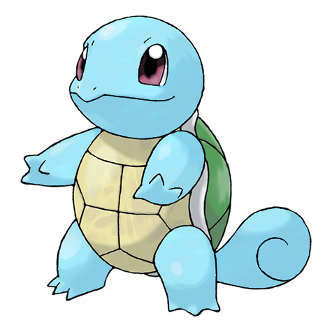

# Squirtle (Tiny Turtle Pokémon)

| Official Artwork | Shiny Artwork |
| --- | --- |
|  |  |

It shelters itself in its shell, then strikes back with spouts of water at every opportunity.

---

## Media

### Cries

No cries available.

---

## Pokédex Data

| National № | Type(s) | Height | Weight | Abilities | Local № |
|------------|---------|--------|--------|-----------|---------|
| #7 | {: width='48'} | 0.5 m | 9.0 kg | 1. Rain-Dish 2. Torrent | N/A |

---

## Base Stats
|   | HP | Attack | Defense | Sp. Atk | Sp. Def | Speed |
|---|----|--------|---------|---------|---------|-------|
| **Base** | 44 | 48 | 65 | 50 | 64 | 43 |
| **Min** | 198 | 90 | 121 | 94 | 119 | 81 |
| **Max** | 292 | 214 | 251 | 218 | 249 | 203 |

The ranges shown above are for a level 100 Pokémon. Maximum values are based on a beneficial nature, 252 EVs, 31 IVs; minimum values are based on a hindering nature, 0 EVs, 0 IVs.

---

## Forms & Evolutions

!!! warning "WARNING"

    Information on evolutions may not be 100% accurate; differences between evolution methods across generations are not accounted for.

### Forms

Squirtle has no alternate forms.

### Evolution Line

1. [Squirtle](squirtle.md/)
    1. Level Up: [Wartortle](wartortle.md/)
        1. Level Up: [Blastoise](blastoise.md/)

---

## Training

| EV Yield | Catch Rate | Base Friendship | Base Exp. | Growth Rate | Held Items |
|----------|------------|-----------------|-----------|-------------|------------|
| 1 Defense | 45 | 50 | 63 | Medium-Slow | N/A |

---

## Breeding

| Egg Groups | Egg Cycles | Gender | Dimorphic | Color | Shape |
|------------|------------|--------|-----------|-------|-------|
| 1. Monster 2. Water1 | 20 | 87.5% Male 12.5% Female | False | Blue | Upright |

---

## Moves

!!! warning "WARNING"

    Specific move information may be incorrect. However, the general movepool should be accurate; this includes changes made in Renegade Platinum.

### Level Up Moves

| Lv. | Move | Type | Cat. | Power | Acc. | PP |
| --- | --- | --- | --- | --- | --- | --- |
| 1 | Tackle | {: width='48'} | {: width='36'} | 40 | 100 | 35 |
| 1 | Tail Whip | {: width='48'} | {: width='36'} | — | 100 | 30 |
| 5 | Water Gun | {: width='48'} | {: width='36'} | 40 | 100 | 25 |
| 8 | Withdraw | {: width='48'} | {: width='36'} | — | — | 40 |
| 11 | Bubble | {: width='48'} | {: width='36'} | 40 | 100 | 30 |
| 14 | Bite | {: width='48'} | {: width='36'} | 60 | 100 | 25 |
| 17 | Rapid Spin | {: width='48'} | {: width='36'} | 50 | 100 | 40 |
| 20 | Water Pulse | {: width='48'} | {: width='36'} | 60 | 100 | 20 |
| 23 | Protect | {: width='48'} | {: width='36'} | — | — | 10 |
| 26 | Muddy Water | {: width='48'} | {: width='36'} | 90 | 85 | 10 |
| 29 | Iron Defense | {: width='48'} | {: width='36'} | — | — | 15 |
| 32 | Skull Bash | {: width='48'} | {: width='36'} | 130 | 100 | 10 |
| 35 | Aqua Tail | {: width='48'} | {: width='36'} | 90 | 90 | 10 |
| 38 | Rain Dance | {: width='48'} | {: width='36'} | — | — | 5 |
| 41 | Hydro Pump | {: width='48'} | {: width='36'} | 110 | 80 | 5 |
| 44 | Water Spout | {: width='48'} | {: width='36'} | 150 | 100 | 5 |

### TM Moves

| TM | Move | Type | Cat. | Power | Acc. | PP |
| --- | --- | --- | --- | --- | --- | --- |
| HM03 | Surf | {: width='48'} | {: width='36'} | 90 | 100 | 15 |
| HM04 | Strength | {: width='48'} | {: width='36'} | 100 | 100 | 15 |
| HM06 | Rock Smash | {: width='48'} | {: width='36'} | 60 | 100 | 15 |
| HM07 | Waterfall | {: width='48'} | {: width='36'} | 80 | 100 | 15 |
| TM01 | Focus Punch | {: width='48'} | {: width='36'} | 150 | 100 | 20 |
| TM03 | Water Pulse | {: width='48'} | {: width='36'} | 60 | 100 | 20 |
| TM06 | Toxic | {: width='48'} | {: width='36'} | — | 90 | 10 |
| TM07 | Hail | {: width='48'} | {: width='36'} | — | — | 10 |
| TM10 | Hidden Power | {: width='48'} | {: width='36'} | 60 | 100 | 15 |
| TM13 | Ice Beam | {: width='48'} | {: width='36'} | 90 | 100 | 10 |
| TM14 | Blizzard | {: width='48'} | {: width='36'} | 110 | 70 | 5 |
| TM17 | Protect | {: width='48'} | {: width='36'} | — | — | 10 |
| TM18 | Rain Dance | {: width='48'} | {: width='36'} | — | — | 5 |
| TM21 | Frustration | {: width='48'} | {: width='36'} | — | 100 | 20 |
| TM23 | Iron Tail | {: width='48'} | {: width='36'} | 100 | 75 | 15 |
| TM27 | Return | {: width='48'} | {: width='36'} | — | 100 | 20 |
| TM28 | Dig | {: width='48'} | {: width='36'} | 80 | 100 | 10 |
| TM31 | Brick Break | {: width='48'} | {: width='36'} | 75 | 100 | 15 |
| TM32 | Double Team | {: width='48'} | {: width='36'} | — | — | 15 |
| TM39 | Rock Tomb | {: width='48'} | {: width='36'} | 60 | 95 | 15 |
| TM42 | Facade | {: width='48'} | {: width='36'} | 70 | 100 | 20 |
| TM43 | Secret Power | {: width='48'} | {: width='36'} | 70 | 100 | 20 |
| TM44 | Rest | {: width='48'} | {: width='36'} | — | — | 5 |
| TM45 | Attract | {: width='48'} | {: width='36'} | — | 100 | 15 |
| TM55 | Brine | {: width='48'} | {: width='36'} | 65 | 100 | 10 |
| TM56 | Fling | {: width='48'} | {: width='36'} | — | 100 | 10 |
| TM58 | Endure | {: width='48'} | {: width='36'} | — | — | 10 |
| TM74 | Gyro Ball | {: width='48'} | {: width='36'} | — | 100 | 5 |
| TM78 | Captivate | {: width='48'} | {: width='36'} | — | 100 | 20 |
| TM82 | Sleep Talk | {: width='48'} | {: width='36'} | — | — | 10 |
| TM83 | Natural Gift | {: width='48'} | {: width='36'} | — | 100 | 15 |
| TM87 | Swagger | {: width='48'} | {: width='36'} | — | 85 | 15 |
| TM90 | Substitute | {: width='48'} | {: width='36'} | — | — | 10 |

### Egg Moves

| Move | Type | Cat. | Power | Acc. | PP |
| --- | --- | --- | --- | --- | --- |
| Mist | {: width='48'} | {: width='36'} | — | — | 30 |
| Haze | {: width='48'} | {: width='36'} | — | — | 30 |
| Flail | {: width='48'} | {: width='36'} | — | 100 | 15 |
| Foresight | {: width='48'} | {: width='36'} | — | — | 40 |
| Mirror Coat | {: width='48'} | {: width='36'} | — | 100 | 20 |
| Fake Out | {: width='48'} | {: width='36'} | 40 | 100 | 10 |
| Yawn | {: width='48'} | {: width='36'} | — | — | 10 |
| Refresh | {: width='48'} | {: width='36'} | — | — | 20 |
| Mud Sport | {: width='48'} | {: width='36'} | — | — | 15 |
| Muddy Water | {: width='48'} | {: width='36'} | 90 | 85 | 10 |
| Aqua Ring | {: width='48'} | {: width='36'} | — | — | 20 |
| Aqua Jet | {: width='48'} | {: width='36'} | 40 | 100 | 20 |

### Tutor Moves

| Move | Type | Cat. | Power | Acc. | PP |
| --- | --- | --- | --- | --- | --- |
| Ice Punch | {: width='48'} | {: width='36'} | 75 | 100 | 15 |
| Snore | {: width='48'} | {: width='36'} | 50 | 100 | 15 |
| Mud Slap | {: width='48'} | {: width='36'} | 20 | 100 | 10 |
| Icy Wind | {: width='48'} | {: width='36'} | 55 | 95 | 15 |
| Rollout | {: width='48'} | {: width='36'} | 30 | 90 | 20 |
| Dive | {: width='48'} | {: width='36'} | 80 | 100 | 10 |
| Iron Defense | {: width='48'} | {: width='36'} | — | — | 15 |
| Aqua Tail | {: width='48'} | {: width='36'} | 90 | 90 | 10 |
| Zen Headbutt | {: width='48'} | {: width='36'} | 80 | 90 | 15 |

