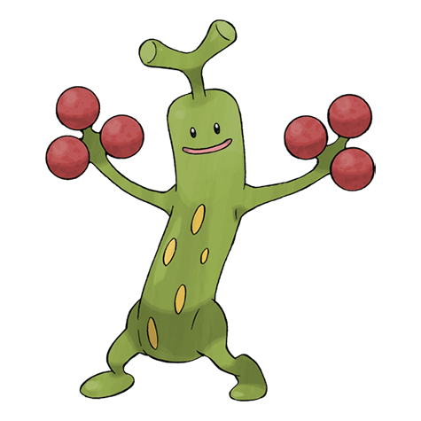
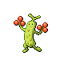
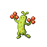

# #185 Sudowoodo (Imitation Pokémon)

| Official Artwork | Shiny Artwork |
|------------------|---------------|
|  |  |

To avoid being attacked, it does nothing but mimic a tree. It hates water and flees from rain.

---

## Media

### Default Sprites

| Front | Shiny | Back | Shiny |
|-------|-------|------|-------|
|  |  |  |  |

### Female Sprites

| Front | Shiny | Back | Shiny |
|-------|-------|------|-------|
|  |  |  |  |

### Cries

Latest (Gen VI+):

<audio controls>
<source src='../../assets/cries/sudowoodo/latest.ogg' type='audio/ogg'>
  Your browser does not support the audio element.
</audio>

Legacy:

<audio controls>
<source src='../../assets/cries/sudowoodo/legacy.ogg' type='audio/ogg'>
  Your browser does not support the audio element.
</audio>

---

## Pokédex Data

| National № | Type(s) | Height | Weight | Abilities | Local № |
|------------|---------|--------|--------|-----------|---------|
| #185 | {: width="48"} | 1.2 m / 3.9 ft | 38.0 kg / 83.8 lbs | 1. Rock Head 2. Sturdy | #93 |

---

## Base Stats
|   | HP | Attack | Defense | Sp. Atk | Sp. Def | Speed |
|---|----|--------|---------|---------|---------|-------|
| **Base** | 90 | 115 | 125 | 30 | 75 | 30 |
| **Min** | 290 | 211 | 229 | 58 | 139 | 58 |
| **Max** | 384 | 361 | 383 | 174 | 273 | 174 |

The ranges shown above are for a level 100 Pokémon. Maximum values are based on a beneficial nature, 252 EVs, 31 IVs; minimum values are based on a hindering nature, 0 EVs, 0 IVs.

---

## Forms & Evolutions

!!! warning "WARNING"

    Information on evolutions may not be 100% accurate; differences between evolution methods across generations are not accounted for.

### Forms

Sudowoodo has no alternate forms.

### Evolution Line

1. [Bonsly](bonsly.md/)
    1. Level Up: [Sudowoodo](sudowoodo.md/)

---

## Training

| EV Yield | Catch Rate | Base Friendship | Base Exp. | Growth Rate | Held Items |
|----------|------------|-----------------|-----------|-------------|------------|
| 2 Defense | 65 | 50 | 144 | Medium | N/A |

---

## Breeding

| Egg Groups | Egg Cycles | Gender | Dimorphic | Color | Shape |
|------------|------------|--------|-----------|-------|-------|
| 1. Mineral | 20 | 50.0% Male 50.0% Female | True | Brown | Humanoid |

---

## Moves

!!! warning "WARNING"

    Specific move information may be incorrect. However, the general movepool should be accurate; this includes changes made in Renegade Platinum.

### Level Up Moves

| Lv. | Move | Type | Cat. | Power | Acc. | PP |
| --- | --- | --- | --- | --- | --- | --- |
| 1 | Copycat | {: width="48"} | {: width="36"} | — | — | 20 |
| 1 | Defense Curl | {: width="48"} | {: width="36"} | — | — | 40 |
| 1 | Rock Throw | {: width="48"} | {: width="36"} | 50 | 90 | 15 |
| 1 | Wood Hammer | {: width="48"} | {: width="36"} | 120 | 100 | 15 |
| 6 | Flail | {: width="48"} | {: width="36"} | — | 100 | 15 |
| 9 | Covet | {: width="48"} | {: width="36"} | 60 | 100 | 25 |
| 12 | Low Kick | {: width="48"} | {: width="36"} | — | 100 | 20 |
| 15 | Rock Tomb | {: width="48"} | {: width="36"} | 60 | 95 | 15 |
| 18 | Mimic | {: width="48"} | {: width="36"} | — | — | 10 |
| 18 | Slam | {: width="48"} | {: width="36"} | 80 | 75 | 20 |
| 21 | Feint Attack | {: width="48"} | {: width="36"} | 60 | — | 20 |
| 24 | Rollout | {: width="48"} | {: width="36"} | 30 | 90 | 20 |
| 27 | Rock Slide | {: width="48"} | {: width="36"} | 75 | 90 | 10 |
| 30 | Block | {: width="48"} | {: width="36"} | — | — | 5 |
| 33 | Counter | {: width="48"} | {: width="36"} | — | 100 | 20 |
| 36 | Sucker Punch | {: width="48"} | {: width="36"} | 70 | 100 | 5 |
| 39 | Double Edge | {: width="48"} | {: width="36"} | 120 | 100 | 15 |
| 42 | Stone Edge | {: width="48"} | {: width="36"} | 100 | 80 | 5 |
| 45 | Hammer Arm | {: width="48"} | {: width="36"} | 100 | 90 | 10 |
| 48 | Head Smash | {: width="48"} | {: width="36"} | 150 | 80 | 5 |

### TM Moves

| TM | Move | Type | Cat. | Power | Acc. | PP |
| --- | --- | --- | --- | --- | --- | --- |
| HM04 | Strength | {: width="48"} | {: width="36"} | 100 | 100 | 15 |
| HM06 | Rock Smash | {: width="48"} | {: width="36"} | 60 | 100 | 15 |
| TM01 | Focus Punch | {: width="48"} | {: width="36"} | 150 | 100 | 20 |
| TM04 | Calm Mind | {: width="48"} | {: width="36"} | — | — | 20 |
| TM06 | Toxic | {: width="48"} | {: width="36"} | — | 90 | 10 |
| TM10 | Hidden Power | {: width="48"} | {: width="36"} | 60 | 100 | 15 |
| TM11 | Sunny Day | {: width="48"} | {: width="36"} | — | — | 5 |
| TM12 | Taunt | {: width="48"} | {: width="36"} | — | 100 | 20 |
| TM17 | Protect | {: width="48"} | {: width="36"} | — | — | 10 |
| TM21 | Frustration | {: width="48"} | {: width="36"} | — | 100 | 20 |
| TM26 | Earthquake | {: width="48"} | {: width="36"} | 100 | 100 | 10 |
| TM27 | Return | {: width="48"} | {: width="36"} | — | 100 | 20 |
| TM28 | Dig | {: width="48"} | {: width="36"} | 80 | 100 | 10 |
| TM31 | Brick Break | {: width="48"} | {: width="36"} | 75 | 100 | 15 |
| TM32 | Double Team | {: width="48"} | {: width="36"} | — | — | 15 |
| TM37 | Sandstorm | {: width="48"} | {: width="36"} | — | — | 10 |
| TM39 | Rock Tomb | {: width="48"} | {: width="36"} | 60 | 95 | 15 |
| TM41 | Torment | {: width="48"} | {: width="36"} | — | 100 | 15 |
| TM42 | Facade | {: width="48"} | {: width="36"} | 70 | 100 | 20 |
| TM43 | Secret Power | {: width="48"} | {: width="36"} | 70 | 100 | 20 |
| TM44 | Rest | {: width="48"} | {: width="36"} | — | — | 5 |
| TM45 | Attract | {: width="48"} | {: width="36"} | — | 100 | 15 |
| TM46 | Thief | {: width="48"} | {: width="36"} | 60 | 100 | 25 |
| TM56 | Fling | {: width="48"} | {: width="36"} | — | 100 | 10 |
| TM58 | Endure | {: width="48"} | {: width="36"} | — | — | 10 |
| TM64 | Explosion | {: width="48"} | {: width="36"} | 250 | 100 | 5 |
| TM69 | Rock Polish | {: width="48"} | {: width="36"} | — | — | 20 |
| TM71 | Stone Edge | {: width="48"} | {: width="36"} | 100 | 80 | 5 |
| TM76 | Stealth Rock | {: width="48"} | {: width="36"} | — | — | 20 |
| TM77 | Psych Up | {: width="48"} | {: width="36"} | — | — | 10 |
| TM78 | Captivate | {: width="48"} | {: width="36"} | — | 100 | 20 |
| TM80 | Rock Slide | {: width="48"} | {: width="36"} | 75 | 90 | 10 |
| TM82 | Sleep Talk | {: width="48"} | {: width="36"} | — | — | 10 |
| TM83 | Natural Gift | {: width="48"} | {: width="36"} | — | 100 | 15 |
| TM87 | Swagger | {: width="48"} | {: width="36"} | — | 85 | 15 |
| TM90 | Substitute | {: width="48"} | {: width="36"} | — | — | 10 |

### Egg Moves

| Move | Type | Cat. | Power | Acc. | PP |
| --- | --- | --- | --- | --- | --- |
| Headbutt | {: width="48"} | {: width="36"} | 70 | 100 | 15 |
| Harden | {: width="48"} | {: width="36"} | — | — | 30 |
| Defense Curl | {: width="48"} | {: width="36"} | — | — | 40 |
| Self Destruct | {: width="48"} | {: width="36"} | 200 | 100 | 5 |
| Rollout | {: width="48"} | {: width="36"} | 30 | 90 | 20 |
| Sand Tomb | {: width="48"} | {: width="36"} | 35 | 85 | 15 |

### Tutor Moves

| Move | Type | Cat. | Power | Acc. | PP |
| --- | --- | --- | --- | --- | --- |
| Fire Punch | {: width="48"} | {: width="36"} | 75 | 100 | 15 |
| Ice Punch | {: width="48"} | {: width="36"} | 75 | 100 | 15 |
| Thunder Punch | {: width="48"} | {: width="36"} | 75 | 100 | 15 |
| Snore | {: width="48"} | {: width="36"} | 50 | 100 | 15 |
| Mud Slap | {: width="48"} | {: width="36"} | 20 | 100 | 10 |
| Rollout | {: width="48"} | {: width="36"} | 30 | 90 | 20 |
| Helping Hand | {: width="48"} | {: width="36"} | — | — | 20 |
| Sucker Punch | {: width="48"} | {: width="36"} | 70 | 100 | 5 |
| Earth Power | {: width="48"} | {: width="36"} | 90 | 100 | 10 |

