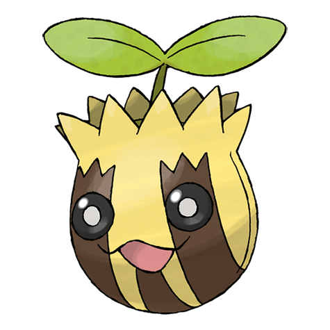

# Sunkern (Seed Pokémon)

| Official Artwork | Shiny Artwork |
| --- | --- |
|  |  |

It suddenly falls out of the sky in the morning. A year after a cold summer, their population explodes.

---

## Media

### Cries

No cries available.

---

## Pokédex Data

| National № | Type(s) | Height | Weight | Abilities | Local № |
|------------|---------|--------|--------|-----------|---------|
| #191 | {: width='48'} | 0.3 m | 1.8 kg | 1. Chlorophyll 2. Solar-Power 3. Early-Bird | N/A |

---

## Base Stats
|   | HP | Attack | Defense | Sp. Atk | Sp. Def | Speed |
|---|----|--------|---------|---------|---------|-------|
| **Base** | 30 | 30 | 30 | 30 | 30 | 30 |
| **Min** | 170 | 58 | 58 | 58 | 58 | 58 |
| **Max** | 264 | 174 | 174 | 174 | 174 | 174 |

The ranges shown above are for a level 100 Pokémon. Maximum values are based on a beneficial nature, 252 EVs, 31 IVs; minimum values are based on a hindering nature, 0 EVs, 0 IVs.

---

## Forms & Evolutions

!!! warning "WARNING"

    Information on evolutions may not be 100% accurate; differences between evolution methods across generations are not accounted for.

### Forms

Sunkern has no alternate forms.

### Evolution Line

1. [Sunkern](sunkern.md/)
    1. Use Item: [Sunflora](sunflora.md/)

---

## Training

| EV Yield | Catch Rate | Base Friendship | Base Exp. | Growth Rate | Held Items |
|----------|------------|-----------------|-----------|-------------|------------|
| 1 Special Attack | 235 | 70 | 36 | Medium-Slow | coba-berry (5%) |

---

## Breeding

| Egg Groups | Egg Cycles | Gender | Dimorphic | Color | Shape |
|------------|------------|--------|-----------|-------|-------|
| 1. Plant | 20 | 50.0% Male 50.0% Female | False | Yellow | Ball |

---

## Moves

!!! warning "WARNING"

    Specific move information may be incorrect. However, the general movepool should be accurate; this includes changes made in Renegade Platinum.

### Level Up Moves

| Lv. | Move | Type | Cat. | Power | Acc. | PP |
| --- | --- | --- | --- | --- | --- | --- |
| 1 | Absorb | {: width='48'} | {: width='36'} | 20 | 100 | 25 |
| 1 | Growth | {: width='48'} | {: width='36'} | — | — | 20 |
| 4 | Ingrain | {: width='48'} | {: width='36'} | — | — | 20 |
| 7 | Grass Whistle | {: width='48'} | {: width='36'} | — | 55 | 15 |
| 9 | Mega Drain | {: width='48'} | {: width='36'} | 40 | 100 | 15 |
| 11 | Leech Seed | {: width='48'} | {: width='36'} | — | 90 | 10 |
| 13 | Razor Leaf | {: width='48'} | {: width='36'} | 55 | 95 | 25 |
| 15 | Worry Seed | {: width='48'} | {: width='36'} | — | 100 | 10 |
| 18 | Nature Power | {: width='48'} | {: width='36'} | — | — | 20 |
| 21 | Giga Drain | {: width='48'} | {: width='36'} | 75 | 100 | 10 |
| 23 | Endeavor | {: width='48'} | {: width='36'} | — | 100 | 5 |
| 25 | Morning Sun | {: width='48'} | {: width='36'} | — | — | 5 |
| 28 | Energy Ball | {: width='48'} | {: width='36'} | 90 | 100 | 10 |
| 30 | Natural Gift | {: width='48'} | {: width='36'} | — | 100 | 15 |
| 32 | Synthesis | {: width='48'} | {: width='36'} | — | — | 5 |
| 35 | Earth Power | {: width='48'} | {: width='36'} | 90 | 100 | 10 |
| 38 | Double Edge | {: width='48'} | {: width='36'} | 120 | 100 | 15 |
| 41 | Sunny Day | {: width='48'} | {: width='36'} | — | — | 5 |
| 43 | Solar Beam | {: width='48'} | {: width='36'} | 120 | 100 | 10 |
| 45 | Seed Bomb | {: width='48'} | {: width='36'} | 80 | 100 | 15 |

### TM Moves

| TM | Move | Type | Cat. | Power | Acc. | PP |
| --- | --- | --- | --- | --- | --- | --- |
| HM01 | Cut | {: width='48'} | {: width='36'} | 60 | 100% | 25 |
| TM06 | Toxic | {: width='48'} | {: width='36'} | — | 90 | 10 |
| TM09 | Bullet Seed | {: width='48'} | {: width='36'} | 25 | 100 | 30 |
| TM10 | Hidden Power | {: width='48'} | {: width='36'} | 60 | 100 | 15 |
| TM11 | Sunny Day | {: width='48'} | {: width='36'} | — | — | 5 |
| TM16 | Light Screen | {: width='48'} | {: width='36'} | — | — | 30 |
| TM17 | Protect | {: width='48'} | {: width='36'} | — | — | 10 |
| TM19 | Giga Drain | {: width='48'} | {: width='36'} | 75 | 100 | 10 |
| TM20 | Safeguard | {: width='48'} | {: width='36'} | — | — | 25 |
| TM21 | Frustration | {: width='48'} | {: width='36'} | — | 100 | 20 |
| TM22 | Solar Beam | {: width='48'} | {: width='36'} | 120 | 100 | 10 |
| TM27 | Return | {: width='48'} | {: width='36'} | — | 100 | 20 |
| TM32 | Double Team | {: width='48'} | {: width='36'} | — | — | 15 |
| TM36 | Sludge Bomb | {: width='48'} | {: width='36'} | 90 | 100 | 10 |
| TM42 | Facade | {: width='48'} | {: width='36'} | 70 | 100 | 20 |
| TM43 | Secret Power | {: width='48'} | {: width='36'} | 70 | 100 | 20 |
| TM44 | Rest | {: width='48'} | {: width='36'} | — | — | 5 |
| TM45 | Attract | {: width='48'} | {: width='36'} | — | 100 | 15 |
| TM53 | Energy Ball | {: width='48'} | {: width='36'} | 90 | 100 | 10 |
| TM58 | Endure | {: width='48'} | {: width='36'} | — | — | 10 |
| TM70 | Flash | {: width='48'} | {: width='36'} | — | 100 | 20 |
| TM75 | Swords Dance | {: width='48'} | {: width='36'} | — | — | 20 |
| TM78 | Captivate | {: width='48'} | {: width='36'} | — | 100 | 20 |
| TM82 | Sleep Talk | {: width='48'} | {: width='36'} | — | — | 10 |
| TM83 | Natural Gift | {: width='48'} | {: width='36'} | — | 100 | 15 |
| TM86 | Grass Knot | {: width='48'} | {: width='36'} | — | 100 | 20 |
| TM87 | Swagger | {: width='48'} | {: width='36'} | — | 85 | 15 |
| TM90 | Substitute | {: width='48'} | {: width='36'} | — | — | 10 |

### Egg Moves

| Move | Type | Cat. | Power | Acc. | PP |
| --- | --- | --- | --- | --- | --- |
| Leech Seed | {: width='48'} | {: width='36'} | — | 90 | 10 |
| Curse | {: width='48'} | {: width='36'} | — | — | 10 |
| Encore | {: width='48'} | {: width='36'} | — | 100 | 5 |
| Sweet Scent | {: width='48'} | {: width='36'} | — | 100 | 20 |
| Nature Power | {: width='48'} | {: width='36'} | — | — | 20 |
| Helping Hand | {: width='48'} | {: width='36'} | — | — | 20 |
| Ingrain | {: width='48'} | {: width='36'} | — | — | 20 |
| Grass Whistle | {: width='48'} | {: width='36'} | — | 55 | 15 |

### Tutor Moves

| Move | Type | Cat. | Power | Acc. | PP |
| --- | --- | --- | --- | --- | --- |
| Snore | {: width='48'} | {: width='36'} | 50 | 100 | 15 |
| Synthesis | {: width='48'} | {: width='36'} | — | — | 5 |
| Uproar | {: width='48'} | {: width='36'} | 90 | 100 | 10 |
| Helping Hand | {: width='48'} | {: width='36'} | — | — | 20 |
| Endeavor | {: width='48'} | {: width='36'} | — | 100 | 5 |
| Seed Bomb | {: width='48'} | {: width='36'} | 80 | 100 | 15 |

