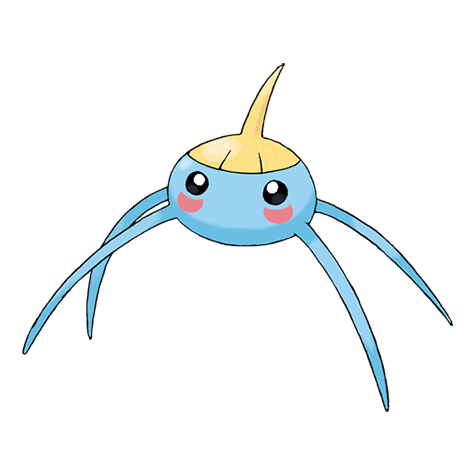
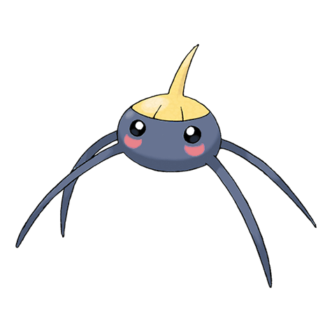

# Surskit (Pond Skater Pokémon)

| Official Artwork | Shiny Artwork |
| --- | --- |
|  |  |

It appears as if it is skating on water. It draws prey with a sweet scent from the tip of its head.

---

## Media

### Cries

No cries available.

---

## Pokédex Data

| National № | Type(s) | Height | Weight | Abilities | Local № |
|------------|---------|--------|--------|-----------|---------|
| #283 | {: width='48'} {: width='48'} | 0.5 m | 1.7 kg | 1. Swift-Swim 2. Rain-Dish | N/A |

---

## Base Stats
|   | HP | Attack | Defense | Sp. Atk | Sp. Def | Speed |
|---|----|--------|---------|---------|---------|-------|
| **Base** | 40 | 30 | 30 | 55 | 55 | 65 |
| **Min** | 190 | 58 | 58 | 103 | 103 | 121 |
| **Max** | 284 | 174 | 174 | 229 | 229 | 251 |

The ranges shown above are for a level 100 Pokémon. Maximum values are based on a beneficial nature, 252 EVs, 31 IVs; minimum values are based on a hindering nature, 0 EVs, 0 IVs.

---

## Forms & Evolutions

!!! warning "WARNING"

    Information on evolutions may not be 100% accurate; differences between evolution methods across generations are not accounted for.

### Forms

Surskit has no alternate forms.

### Evolution Line

1. [Surskit](surskit.md/)
    1. Level Up: [Masquerain](masquerain.md/)

---

## Training

| EV Yield | Catch Rate | Base Friendship | Base Exp. | Growth Rate | Held Items |
|----------|------------|-----------------|-----------|-------------|------------|
| 1 Speed | 200 | 70 | 54 | Medium |  |

---

## Breeding

| Egg Groups | Egg Cycles | Gender | Dimorphic | Color | Shape |
|------------|------------|--------|-----------|-------|-------|
| 1. Water1 2. Bug | 15 | 50.0% Male 50.0% Female | False | Blue | Armor |

---

## Moves

!!! warning "WARNING"

    Specific move information may be incorrect. However, the general movepool should be accurate; this includes changes made in Renegade Platinum.

### Level Up Moves

| Lv. | Move | Type | Cat. | Power | Acc. | PP |
| --- | --- | --- | --- | --- | --- | --- |
| 1 | Bubble | {: width='48'} | {: width='36'} | 40 | 100 | 30 |
| 1 | Quick Attack | {: width='48'} | {: width='36'} | 40 | 100 | 30 |
| 1 | Sweet Scent | {: width='48'} | {: width='36'} | — | 100 | 20 |
| 6 | Bug Bite | {: width='48'} | {: width='36'} | 60 | 100 | 20 |
| 9 | Water Sport | {: width='48'} | {: width='36'} | — | — | 15 |
| 12 | Mud Shot | {: width='48'} | {: width='36'} | 55 | 95 | 15 |
| 15 | Bubble Beam | {: width='48'} | {: width='36'} | 75 | 100 | 15 |
| 18 | Agility | {: width='48'} | {: width='36'} | — | — | 30 |
| 21 | Signal Beam | {: width='48'} | {: width='36'} | 75 | 100 | 15 |
| 24 | Psybeam | {: width='48'} | {: width='36'} | 65 | 100 | 20 |
| 27 | Aqua Jet | {: width='48'} | {: width='36'} | 40 | 100 | 20 |
| 30 | Haze | {: width='48'} | {: width='36'} | — | — | 30 |
| 30 | Mist | {: width='48'} | {: width='36'} | — | — | 30 |
| 33 | Baton Pass | {: width='48'} | {: width='36'} | — | — | 40 |
| 36 | Hydro Pump | {: width='48'} | {: width='36'} | 110 | 80 | 5 |

### TM Moves

| TM | Move | Type | Cat. | Power | Acc. | PP |
| --- | --- | --- | --- | --- | --- | --- |
| TBD | Bug Buzz | {: width='48'} | {: width='36'} | 90 | 100 | 10 |
| HM03 | Surf | {: width='48'} | {: width='36'} | 90 | 100 | 15 |
| HM07 | Waterfall | {: width='48'} | {: width='36'} | 80 | 100 | 15 |
| TM03 | Water Pulse | {: width='48'} | {: width='36'} | 60 | 100 | 20 |
| TM06 | Toxic | {: width='48'} | {: width='36'} | — | 90 | 10 |
| TM10 | Hidden Power | {: width='48'} | {: width='36'} | 60 | 100 | 15 |
| TM11 | Sunny Day | {: width='48'} | {: width='36'} | — | — | 5 |
| TM13 | Ice Beam | {: width='48'} | {: width='36'} | 90 | 100 | 10 |
| TM14 | Blizzard | {: width='48'} | {: width='36'} | 110 | 70 | 5 |
| TM17 | Protect | {: width='48'} | {: width='36'} | — | — | 10 |
| TM18 | Rain Dance | {: width='48'} | {: width='36'} | — | — | 5 |
| TM19 | Giga Drain | {: width='48'} | {: width='36'} | 75 | 100 | 10 |
| TM21 | Frustration | {: width='48'} | {: width='36'} | — | 100 | 20 |
| TM22 | Solar Beam | {: width='48'} | {: width='36'} | 120 | 100 | 10 |
| TM27 | Return | {: width='48'} | {: width='36'} | — | 100 | 20 |
| TM30 | Shadow Ball | {: width='48'} | {: width='36'} | 80 | 100 | 15 |
| TM32 | Double Team | {: width='48'} | {: width='36'} | — | — | 15 |
| TM42 | Facade | {: width='48'} | {: width='36'} | 70 | 100 | 20 |
| TM43 | Secret Power | {: width='48'} | {: width='36'} | 70 | 100 | 20 |
| TM44 | Rest | {: width='48'} | {: width='36'} | — | — | 5 |
| TM45 | Attract | {: width='48'} | {: width='36'} | — | 100 | 15 |
| TM46 | Thief | {: width='48'} | {: width='36'} | 60 | 100 | 25 |
| TM58 | Endure | {: width='48'} | {: width='36'} | — | — | 10 |
| TM70 | Flash | {: width='48'} | {: width='36'} | — | 100 | 20 |
| TM77 | Psych Up | {: width='48'} | {: width='36'} | — | — | 10 |
| TM78 | Captivate | {: width='48'} | {: width='36'} | — | 100 | 20 |
| TM82 | Sleep Talk | {: width='48'} | {: width='36'} | — | — | 10 |
| TM83 | Natural Gift | {: width='48'} | {: width='36'} | — | 100 | 15 |
| TM87 | Swagger | {: width='48'} | {: width='36'} | — | 85 | 15 |
| TM90 | Substitute | {: width='48'} | {: width='36'} | — | — | 10 |

### Egg Moves

| Move | Type | Cat. | Power | Acc. | PP |
| --- | --- | --- | --- | --- | --- |
| Hydro Pump | {: width='48'} | {: width='36'} | 110 | 80 | 5 |
| Psybeam | {: width='48'} | {: width='36'} | 65 | 100 | 20 |
| Mind Reader | {: width='48'} | {: width='36'} | — | — | 5 |
| Foresight | {: width='48'} | {: width='36'} | — | — | 40 |
| Signal Beam | {: width='48'} | {: width='36'} | 75 | 100 | 15 |
| Mud Shot | {: width='48'} | {: width='36'} | 55 | 95 | 15 |
| Bug Bite | {: width='48'} | {: width='36'} | 60 | 100 | 20 |

### Tutor Moves

| Move | Type | Cat. | Power | Acc. | PP |
| --- | --- | --- | --- | --- | --- |
| Swift | {: width='48'} | {: width='36'} | 60 | — | 20 |
| Snore | {: width='48'} | {: width='36'} | 50 | 100 | 15 |
| Mud Slap | {: width='48'} | {: width='36'} | 20 | 100 | 10 |
| Icy Wind | {: width='48'} | {: width='36'} | 55 | 95 | 15 |
| Signal Beam | {: width='48'} | {: width='36'} | 75 | 100 | 15 |

