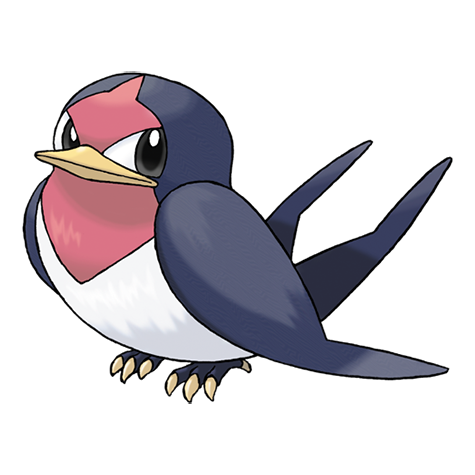

# Taillow (Tiny Swallow Pokémon)

| Official Artwork | Shiny Artwork |
| --- | --- |
|  |  |

It has a gutsy spirit that makes it bravely take on tough foes. It flies in search of warm climates.

---

## Media

### Cries

Latest (Gen VI+):

<audio controls>
<source src='../../assets/cries/taillow/latest.ogg' type='audio/ogg'>
  Your browser does not support the audio element.
</audio>

Legacy:

<audio controls>
<source src='../../assets/cries/taillow/legacy.ogg' type='audio/ogg'>
  Your browser does not support the audio element.
</audio>

---

## Pokédex Data

| National № | Type(s) | Height | Weight | Abilities | Local № |
|------------|---------|--------|--------|-----------|---------|
| #276 | {: width='48'} {: width='48'} | 0.3 m | 2.3 kg | 1. Guts 2. Scrappy | N/A |

---

## Base Stats
|   | HP | Attack | Defense | Sp. Atk | Sp. Def | Speed |
|---|----|--------|---------|---------|---------|-------|
| **Base** | 40 | 55 | 30 | 30 | 30 | 85 |
| **Min** | 190 | 103 | 58 | 58 | 58 | 157 |
| **Max** | 284 | 229 | 174 | 174 | 174 | 295 |

The ranges shown above are for a level 100 Pokémon. Maximum values are based on a beneficial nature, 252 EVs, 31 IVs; minimum values are based on a hindering nature, 0 EVs, 0 IVs.

---

## Forms & Evolutions

!!! warning "WARNING"

    Information on evolutions may not be 100% accurate; differences between evolution methods across generations are not accounted for.

### Forms

Taillow has no alternate forms.

### Evolution Line

1. [Taillow](taillow.md/)
    1. Level Up: [Swellow](swellow.md/)

---

## Training

| EV Yield | Catch Rate | Base Friendship | Base Exp. | Growth Rate | Held Items |
|----------|------------|-----------------|-----------|-------------|------------|
| 1 Speed | 200 | 70 | 54 | Medium-Slow | charti-berry (5%) |

---

## Breeding

| Egg Groups | Egg Cycles | Gender | Dimorphic | Color | Shape |
|------------|------------|--------|-----------|-------|-------|
| 1. Flying | 15 | 50.0% Male 50.0% Female | False | Blue | Wings |

---

## Moves

!!! warning "WARNING"

    Specific move information may be incorrect. However, the general movepool should be accurate; this includes changes made in Renegade Platinum.

### Level Up Moves

| Lv. | Move | Type | Cat. | Power | Acc. | PP |
| --- | --- | --- | --- | --- | --- | --- |
| 1 | Growl | {: width='48'} | {: width='36'} | — | 100 | 40 |
| 1 | Peck | {: width='48'} | {: width='36'} | 35 | 100 | 35 |
| 7 | Focus Energy | {: width='48'} | {: width='36'} | — | — | 30 |
| 10 | Quick Attack | {: width='48'} | {: width='36'} | 40 | 100 | 30 |
| 13 | Wing Attack | {: width='48'} | {: width='36'} | 60 | 100 | 35 |
| 16 | Double Team | {: width='48'} | {: width='36'} | — | — | 15 |
| 19 | Aerial Ace | {: width='48'} | {: width='36'} | 60 | — | 20 |
| 22 | Reversal | {: width='48'} | {: width='36'} | — | 100 | 15 |
| 25 | Agility | {: width='48'} | {: width='36'} | — | — | 30 |
| 28 | U Turn | {: width='48'} | {: width='36'} | 70 | 100 | 20 |
| 31 | Air Slash | {: width='48'} | {: width='36'} | 75 | 95 | 15 |
| 34 | Endeavor | {: width='48'} | {: width='36'} | — | 100 | 5 |
| 37 | Brave Bird | {: width='48'} | {: width='36'} | 120 | 100 | 15 |
| 40 | Hurricane | {: width='48'} | {: width='36'} | 110 | 70 | 10 |

### TM Moves

| TM | Move | Type | Cat. | Power | Acc. | PP |
| --- | --- | --- | --- | --- | --- | --- |
| TBD | Hurricane | {: width='48'} | {: width='36'} | 110 | 70 | 10 |
| HM02 | Fly | {: width='48'} | {: width='36'} | 100 | 100% | 15 |
| HM05 | Defog | {: width='48'} | {: width='36'} | — | — | 15 |
| TM06 | Toxic | {: width='48'} | {: width='36'} | — | 90 | 10 |
| TM10 | Hidden Power | {: width='48'} | {: width='36'} | 60 | 100 | 15 |
| TM11 | Sunny Day | {: width='48'} | {: width='36'} | — | — | 5 |
| TM17 | Protect | {: width='48'} | {: width='36'} | — | — | 10 |
| TM18 | Rain Dance | {: width='48'} | {: width='36'} | — | — | 5 |
| TM21 | Frustration | {: width='48'} | {: width='36'} | — | 100 | 20 |
| TM27 | Return | {: width='48'} | {: width='36'} | — | 100 | 20 |
| TM32 | Double Team | {: width='48'} | {: width='36'} | — | — | 15 |
| TM40 | Aerial Ace | {: width='48'} | {: width='36'} | 60 | — | 20 |
| TM42 | Facade | {: width='48'} | {: width='36'} | 70 | 100 | 20 |
| TM43 | Secret Power | {: width='48'} | {: width='36'} | 70 | 100 | 20 |
| TM44 | Rest | {: width='48'} | {: width='36'} | — | — | 5 |
| TM45 | Attract | {: width='48'} | {: width='36'} | — | 100 | 15 |
| TM46 | Thief | {: width='48'} | {: width='36'} | 60 | 100 | 25 |
| TM47 | Steel Wing | {: width='48'} | {: width='36'} | 70 | 90 | 25 |
| TM51 | Roost | {: width='48'} | {: width='36'} | — | — | 5 |
| TM58 | Endure | {: width='48'} | {: width='36'} | — | — | 10 |
| TM78 | Captivate | {: width='48'} | {: width='36'} | — | 100 | 20 |
| TM82 | Sleep Talk | {: width='48'} | {: width='36'} | — | — | 10 |
| TM83 | Natural Gift | {: width='48'} | {: width='36'} | — | 100 | 15 |
| TM87 | Swagger | {: width='48'} | {: width='36'} | — | 85 | 15 |
| TM88 | Pluck | {: width='48'} | {: width='36'} | 60 | 100 | 20 |
| TM89 | U Turn | {: width='48'} | {: width='36'} | 70 | 100 | 20 |
| TM90 | Substitute | {: width='48'} | {: width='36'} | — | — | 10 |

### Egg Moves

| Move | Type | Cat. | Power | Acc. | PP |
| --- | --- | --- | --- | --- | --- |
| Whirlwind | {: width='48'} | {: width='36'} | — | — | 20 |
| Supersonic | {: width='48'} | {: width='36'} | — | 55 | 20 |
| Rage | {: width='48'} | {: width='36'} | 20 | 100 | 20 |
| Mirror Move | {: width='48'} | {: width='36'} | — | — | 20 |
| Sky Attack | {: width='48'} | {: width='36'} | 140 | 90 | 5 |
| Pursuit | {: width='48'} | {: width='36'} | 40 | 100 | 20 |
| Refresh | {: width='48'} | {: width='36'} | — | — | 20 |
| Brave Bird | {: width='48'} | {: width='36'} | 120 | 100 | 15 |

### Tutor Moves

| Move | Type | Cat. | Power | Acc. | PP |
| --- | --- | --- | --- | --- | --- |
| Swift | {: width='48'} | {: width='36'} | 60 | — | 20 |
| Snore | {: width='48'} | {: width='36'} | 50 | 100 | 15 |
| Mud Slap | {: width='48'} | {: width='36'} | 20 | 100 | 10 |
| Twister | {: width='48'} | {: width='36'} | 40 | 100 | 20 |
| Heat Wave | {: width='48'} | {: width='36'} | 95 | 90 | 10 |
| Endeavor | {: width='48'} | {: width='36'} | — | 100 | 5 |
| Air Cutter | {: width='48'} | {: width='36'} | 60 | 95 | 25 |
| Ominous Wind | {: width='48'} | {: width='36'} | 60 | 100 | 5 |

