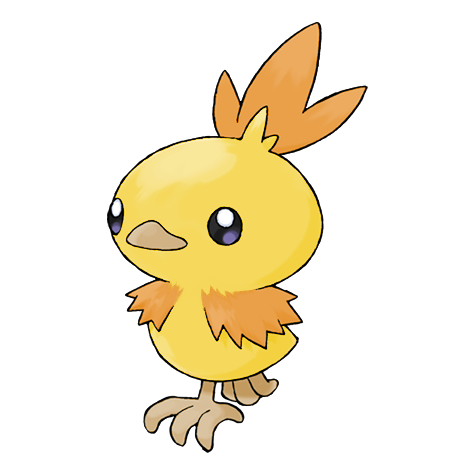

# Torchic (Chick Pokémon)

| Official Artwork | Shiny Artwork |
| --- | --- |
|  |  |

A fire burns inside, so it feels very warm to hug. It launches fireballs of 1,800 degrees F.

---

## Media

### Cries

No cries available.

---

## Pokédex Data

| National № | Type(s) | Height | Weight | Abilities | Local № |
|------------|---------|--------|--------|-----------|---------|
| #255 | {: width='48'} | 0.4 m | 2.5 kg | 1. Speed-Boost 2. Blaze | N/A |

---

## Base Stats
|   | HP | Attack | Defense | Sp. Atk | Sp. Def | Speed |
|---|----|--------|---------|---------|---------|-------|
| **Base** | 45 | 60 | 40 | 70 | 50 | 45 |
| **Min** | 200 | 112 | 76 | 130 | 94 | 85 |
| **Max** | 294 | 240 | 196 | 262 | 218 | 207 |

The ranges shown above are for a level 100 Pokémon. Maximum values are based on a beneficial nature, 252 EVs, 31 IVs; minimum values are based on a hindering nature, 0 EVs, 0 IVs.

---

## Forms & Evolutions

!!! warning "WARNING"

    Information on evolutions may not be 100% accurate; differences between evolution methods across generations are not accounted for.

### Forms

Torchic has no alternate forms.

### Evolution Line

1. [Torchic](torchic.md/)
    1. Level Up: [Combusken](combusken.md/)
        1. Level Up: [Blaziken](blaziken.md/)

---

## Training

| EV Yield | Catch Rate | Base Friendship | Base Exp. | Growth Rate | Held Items |
|----------|------------|-----------------|-----------|-------------|------------|
| 1 Special Attack | 45 | 50 | 62 | Medium-Slow | N/A |

---

## Breeding

| Egg Groups | Egg Cycles | Gender | Dimorphic | Color | Shape |
|------------|------------|--------|-----------|-------|-------|
| 1. Ground | 20 | 87.5% Male 12.5% Female | True | Red | Legs |

---

## Moves

!!! warning "WARNING"

    Specific move information may be incorrect. However, the general movepool should be accurate; this includes changes made in Renegade Platinum.

### Level Up Moves

| Lv. | Move | Type | Cat. | Power | Acc. | PP |
| --- | --- | --- | --- | --- | --- | --- |
| 1 | Growl | {: width='48'} | {: width='36'} | — | 100 | 40 |
| 1 | Scratch | {: width='48'} | {: width='36'} | 40 | 100 | 35 |
| 5 | Ember | {: width='48'} | {: width='36'} | 40 | 100 | 25 |
| 8 | Sand Attack | {: width='48'} | {: width='36'} | — | 100 | 15 |
| 11 | Peck | {: width='48'} | {: width='36'} | 35 | 100 | 35 |
| 14 | Fire Spin | {: width='48'} | {: width='36'} | 35 | 85 | 15 |
| 17 | Quick Attack | {: width='48'} | {: width='36'} | 40 | 100 | 30 |
| 20 | Baton Pass | {: width='48'} | {: width='36'} | — | — | 40 |
| 23 | Focus Energy | {: width='48'} | {: width='36'} | — | — | 30 |
| 26 | Feather Dance | {: width='48'} | {: width='36'} | — | 100 | 15 |
| 29 | Flamethrower | {: width='48'} | {: width='36'} | 90 | 100 | 15 |
| 32 | Night Slash | {: width='48'} | {: width='36'} | 70 | 100 | 15 |
| 32 | Slash | {: width='48'} | {: width='36'} | 70 | 100 | 20 |
| 35 | Bounce | {: width='48'} | {: width='36'} | 85 | 85 | 5 |
| 38 | Last Resort | {: width='48'} | {: width='36'} | 140 | 100 | 5 |
| 41 | Mirror Move | {: width='48'} | {: width='36'} | — | — | 20 |
| 44 | Fire Blast | {: width='48'} | {: width='36'} | 110 | 85 | 5 |

### TM Moves

| TM | Move | Type | Cat. | Power | Acc. | PP |
| --- | --- | --- | --- | --- | --- | --- |
| HM01 | Cut | {: width='48'} | {: width='36'} | 60 | 100% | 25 |
| HM04 | Strength | {: width='48'} | {: width='36'} | 100 | 100 | 15 |
| HM06 | Rock Smash | {: width='48'} | {: width='36'} | 60 | 100 | 15 |
| TM06 | Toxic | {: width='48'} | {: width='36'} | — | 90 | 10 |
| TM10 | Hidden Power | {: width='48'} | {: width='36'} | 60 | 100 | 15 |
| TM11 | Sunny Day | {: width='48'} | {: width='36'} | — | — | 5 |
| TM17 | Protect | {: width='48'} | {: width='36'} | — | — | 10 |
| TM21 | Frustration | {: width='48'} | {: width='36'} | — | 100 | 20 |
| TM27 | Return | {: width='48'} | {: width='36'} | — | 100 | 20 |
| TM28 | Dig | {: width='48'} | {: width='36'} | 80 | 100 | 10 |
| TM32 | Double Team | {: width='48'} | {: width='36'} | — | — | 15 |
| TM35 | Flamethrower | {: width='48'} | {: width='36'} | 90 | 100 | 15 |
| TM38 | Fire Blast | {: width='48'} | {: width='36'} | 110 | 85 | 5 |
| TM39 | Rock Tomb | {: width='48'} | {: width='36'} | 60 | 95 | 15 |
| TM40 | Aerial Ace | {: width='48'} | {: width='36'} | 60 | — | 20 |
| TM42 | Facade | {: width='48'} | {: width='36'} | 70 | 100 | 20 |
| TM43 | Secret Power | {: width='48'} | {: width='36'} | 70 | 100 | 20 |
| TM44 | Rest | {: width='48'} | {: width='36'} | — | — | 5 |
| TM45 | Attract | {: width='48'} | {: width='36'} | — | 100 | 15 |
| TM50 | Overheat | {: width='48'} | {: width='36'} | 130 | 90 | 5 |
| TM58 | Endure | {: width='48'} | {: width='36'} | — | — | 10 |
| TM61 | Will O Wisp | {: width='48'} | {: width='36'} | — | 85 | 15 |
| TM65 | Shadow Claw | {: width='48'} | {: width='36'} | 80 | 100 | 15 |
| TM75 | Swords Dance | {: width='48'} | {: width='36'} | — | — | 20 |
| TM78 | Captivate | {: width='48'} | {: width='36'} | — | 100 | 20 |
| TM80 | Rock Slide | {: width='48'} | {: width='36'} | 75 | 90 | 10 |
| TM82 | Sleep Talk | {: width='48'} | {: width='36'} | — | — | 10 |
| TM83 | Natural Gift | {: width='48'} | {: width='36'} | — | 100 | 15 |
| TM87 | Swagger | {: width='48'} | {: width='36'} | — | 85 | 15 |
| TM90 | Substitute | {: width='48'} | {: width='36'} | — | — | 10 |

### Egg Moves

| Move | Type | Cat. | Power | Acc. | PP |
| --- | --- | --- | --- | --- | --- |
| Counter | {: width='48'} | {: width='36'} | — | 100 | 20 |
| Agility | {: width='48'} | {: width='36'} | — | — | 30 |
| Rock Slide | {: width='48'} | {: width='36'} | 75 | 90 | 10 |
| Reversal | {: width='48'} | {: width='36'} | — | 100 | 15 |
| Endure | {: width='48'} | {: width='36'} | — | — | 10 |
| Swagger | {: width='48'} | {: width='36'} | — | 85 | 15 |
| Baton Pass | {: width='48'} | {: width='36'} | — | — | 40 |
| Smelling Salts | {: width='48'} | {: width='36'} | 70 | 100 | 10 |
| Crush Claw | {: width='48'} | {: width='36'} | 75 | 95 | 10 |
| Feint | {: width='48'} | {: width='36'} | 30 | 100 | 10 |
| Last Resort | {: width='48'} | {: width='36'} | 140 | 100 | 5 |
| Night Slash | {: width='48'} | {: width='36'} | 70 | 100 | 15 |

### Tutor Moves

| Move | Type | Cat. | Power | Acc. | PP |
| --- | --- | --- | --- | --- | --- |
| Swift | {: width='48'} | {: width='36'} | 60 | — | 20 |
| Snore | {: width='48'} | {: width='36'} | 50 | 100 | 15 |
| Mud Slap | {: width='48'} | {: width='36'} | 20 | 100 | 10 |
| Heat Wave | {: width='48'} | {: width='36'} | 95 | 90 | 10 |
| Helping Hand | {: width='48'} | {: width='36'} | — | — | 20 |
| Bounce | {: width='48'} | {: width='36'} | 85 | 85 | 5 |
| Last Resort | {: width='48'} | {: width='36'} | 140 | 100 | 5 |

