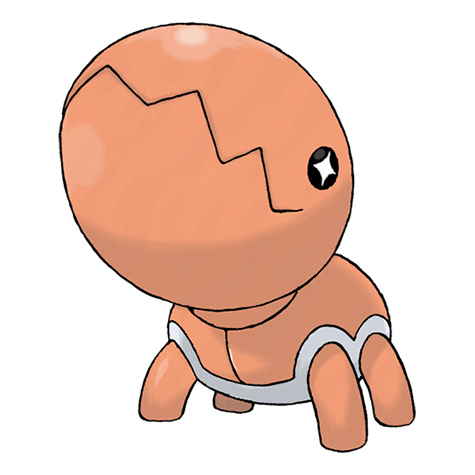

# Trapinch (Ant Pit Pokémon)

| Official Artwork | Shiny Artwork |
| --- | --- |
|  |  |

It makes a conical pit in desert sand and lies in wait at the bottom for prey to come tumbling down.

---

## Media

### Cries

No cries available.

---

## Pokédex Data

| National № | Type(s) | Height | Weight | Abilities | Local № |
|------------|---------|--------|--------|-----------|---------|
| #328 | {: width='48'} {: width='48'} | 0.7 m | 15.0 kg | 1. Hyper-Cutter 2. Arena-Trap | N/A |

---

## Base Stats
|   | HP | Attack | Defense | Sp. Atk | Sp. Def | Speed |
|---|----|--------|---------|---------|---------|-------|
| **Base** | 55 | 100 | 45 | 45 | 45 | 10 |
| **Min** | 220 | 184 | 85 | 85 | 85 | 22 |
| **Max** | 314 | 328 | 207 | 207 | 207 | 130 |

The ranges shown above are for a level 100 Pokémon. Maximum values are based on a beneficial nature, 252 EVs, 31 IVs; minimum values are based on a hindering nature, 0 EVs, 0 IVs.

---

## Forms & Evolutions

!!! warning "WARNING"

    Information on evolutions may not be 100% accurate; differences between evolution methods across generations are not accounted for.

### Forms

Trapinch has no alternate forms.

### Evolution Line

1. [Trapinch](trapinch.md/)
    1. Level Up: [Vibrava](vibrava.md/)
        1. Level Up: [Flygon](flygon.md/)

---

## Training

| EV Yield | Catch Rate | Base Friendship | Base Exp. | Growth Rate | Held Items |
|----------|------------|-----------------|-----------|-------------|------------|
| 1 Attack | 255 | 50 | 58 | Medium-Slow | soft-sand (5%) |

---

## Breeding

| Egg Groups | Egg Cycles | Gender | Dimorphic | Color | Shape |
|------------|------------|--------|-----------|-------|-------|
| 1. Bug 2. Dragon | 20 | 50.0% Male 50.0% Female | False | Brown | Armor |

---

## Moves

!!! warning "WARNING"

    Specific move information may be incorrect. However, the general movepool should be accurate; this includes changes made in Renegade Platinum.

### Level Up Moves

| Lv. | Move | Type | Cat. | Power | Acc. | PP |
| --- | --- | --- | --- | --- | --- | --- |
| 1 | Bide | {: width='48'} | {: width='36'} | — | — | 10 |
| 1 | Bite | {: width='48'} | {: width='36'} | 60 | 100 | 25 |
| 1 | Bug Bite | {: width='48'} | {: width='36'} | 60 | 100 | 20 |
| 1 | Feint Attack | {: width='48'} | {: width='36'} | 60 | — | 20 |
| 1 | Sand Attack | {: width='48'} | {: width='36'} | — | 100 | 15 |
| 7 | Mud Slap | {: width='48'} | {: width='36'} | 20 | 100 | 10 |
| 11 | Bulldoze | {: width='48'} | {: width='36'} | 60 | 100 | 20 |
| 15 | Rock Slide | {: width='48'} | {: width='36'} | 75 | 90 | 10 |
| 19 | Dig | {: width='48'} | {: width='36'} | 80 | 100 | 10 |
| 23 | Crunch | {: width='48'} | {: width='36'} | 80 | 100 | 15 |
| 27 | Signal Beam | {: width='48'} | {: width='36'} | 75 | 100 | 15 |
| 31 | Earth Power | {: width='48'} | {: width='36'} | 90 | 100 | 10 |
| 35 | Sandstorm | {: width='48'} | {: width='36'} | — | — | 10 |
| 39 | Earthquake | {: width='48'} | {: width='36'} | 100 | 100 | 10 |
| 43 | Feint | {: width='48'} | {: width='36'} | 30 | 100 | 10 |
| 47 | Superpower | {: width='48'} | {: width='36'} | 120 | 100 | 5 |
| 51 | Fissure | {: width='48'} | {: width='36'} | — | 30 | 5 |
| 55 | Hyper Beam | {: width='48'} | {: width='36'} | 150 | 90 | 5 |

### TM Moves

| TM | Move | Type | Cat. | Power | Acc. | PP |
| --- | --- | --- | --- | --- | --- | --- |
| HM04 | Strength | {: width='48'} | {: width='36'} | 100 | 100 | 15 |
| HM06 | Rock Smash | {: width='48'} | {: width='36'} | 60 | 100 | 15 |
| TM06 | Toxic | {: width='48'} | {: width='36'} | — | 90 | 10 |
| TM10 | Hidden Power | {: width='48'} | {: width='36'} | 60 | 100 | 15 |
| TM11 | Sunny Day | {: width='48'} | {: width='36'} | — | — | 5 |
| TM15 | Hyper Beam | {: width='48'} | {: width='36'} | 150 | 90 | 5 |
| TM17 | Protect | {: width='48'} | {: width='36'} | — | — | 10 |
| TM19 | Giga Drain | {: width='48'} | {: width='36'} | 75 | 100 | 10 |
| TM21 | Frustration | {: width='48'} | {: width='36'} | — | 100 | 20 |
| TM22 | Solar Beam | {: width='48'} | {: width='36'} | 120 | 100 | 10 |
| TM26 | Earthquake | {: width='48'} | {: width='36'} | 100 | 100 | 10 |
| TM27 | Return | {: width='48'} | {: width='36'} | — | 100 | 20 |
| TM28 | Dig | {: width='48'} | {: width='36'} | 80 | 100 | 10 |
| TM32 | Double Team | {: width='48'} | {: width='36'} | — | — | 15 |
| TM37 | Sandstorm | {: width='48'} | {: width='36'} | — | — | 10 |
| TM39 | Rock Tomb | {: width='48'} | {: width='36'} | 60 | 95 | 15 |
| TM42 | Facade | {: width='48'} | {: width='36'} | 70 | 100 | 20 |
| TM43 | Secret Power | {: width='48'} | {: width='36'} | 70 | 100 | 20 |
| TM44 | Rest | {: width='48'} | {: width='36'} | — | — | 5 |
| TM45 | Attract | {: width='48'} | {: width='36'} | — | 100 | 15 |
| TM58 | Endure | {: width='48'} | {: width='36'} | — | — | 10 |
| TM78 | Captivate | {: width='48'} | {: width='36'} | — | 100 | 20 |
| TM80 | Rock Slide | {: width='48'} | {: width='36'} | 75 | 90 | 10 |
| TM82 | Sleep Talk | {: width='48'} | {: width='36'} | — | — | 10 |
| TM83 | Natural Gift | {: width='48'} | {: width='36'} | — | 100 | 15 |
| TM87 | Swagger | {: width='48'} | {: width='36'} | — | 85 | 15 |
| TM90 | Substitute | {: width='48'} | {: width='36'} | — | — | 10 |

### Egg Moves

| Move | Type | Cat. | Power | Acc. | PP |
| --- | --- | --- | --- | --- | --- |
| Gust | {: width='48'} | {: width='36'} | 40 | 100 | 35 |
| Quick Attack | {: width='48'} | {: width='36'} | 40 | 100 | 30 |
| Focus Energy | {: width='48'} | {: width='36'} | — | — | 30 |
| Flail | {: width='48'} | {: width='36'} | — | 100 | 15 |
| Fury Cutter | {: width='48'} | {: width='36'} | 40 | 95 | 20 |

### Tutor Moves

| Move | Type | Cat. | Power | Acc. | PP |
| --- | --- | --- | --- | --- | --- |
| Snore | {: width='48'} | {: width='36'} | 50 | 100 | 15 |
| Mud Slap | {: width='48'} | {: width='36'} | 20 | 100 | 10 |
| Fury Cutter | {: width='48'} | {: width='36'} | 40 | 95 | 20 |
| Earth Power | {: width='48'} | {: width='36'} | 90 | 100 | 10 |

