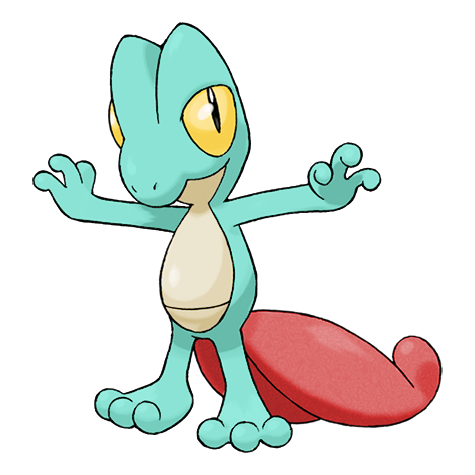

# Treecko (Wood Gecko Pokémon)

| Official Artwork | Shiny Artwork |
| --- | --- |
|  |  |

The soles of its feet are covered by countless tiny spikes, enabling it to walk on walls and ceilings.

---

## Media

### Cries

Latest (Gen VI+):

<audio controls>
<source src='../../assets/cries/treecko/latest.ogg' type='audio/ogg'>
  Your browser does not support the audio element.
</audio>

Legacy:

<audio controls>
<source src='../../assets/cries/treecko/legacy.ogg' type='audio/ogg'>
  Your browser does not support the audio element.
</audio>

---

## Pokédex Data

| National № | Type(s) | Height | Weight | Abilities | Local № |
|------------|---------|--------|--------|-----------|---------|
| #252 | {: width='48'} | 0.5 m | 5.0 kg | 1. Unburden 2. Overgrow | N/A |

---

## Base Stats
|   | HP | Attack | Defense | Sp. Atk | Sp. Def | Speed |
|---|----|--------|---------|---------|---------|-------|
| **Base** | 40 | 45 | 35 | 65 | 55 | 70 |
| **Min** | 190 | 85 | 67 | 121 | 103 | 130 |
| **Max** | 284 | 207 | 185 | 251 | 229 | 262 |

The ranges shown above are for a level 100 Pokémon. Maximum values are based on a beneficial nature, 252 EVs, 31 IVs; minimum values are based on a hindering nature, 0 EVs, 0 IVs.

---

## Forms & Evolutions

!!! warning "WARNING"

    Information on evolutions may not be 100% accurate; differences between evolution methods across generations are not accounted for.

### Forms

Treecko has no alternate forms.

### Evolution Line

1. [Treecko](treecko.md/)
    1. Level Up: [Grovyle](grovyle.md/)
        1. Level Up: [Sceptile](sceptile.md/)

---

## Training

| EV Yield | Catch Rate | Base Friendship | Base Exp. | Growth Rate | Held Items |
|----------|------------|-----------------|-----------|-------------|------------|
| 1 Speed | 45 | 50 | 62 | Medium-Slow | N/A |

---

## Breeding

| Egg Groups | Egg Cycles | Gender | Dimorphic | Color | Shape |
|------------|------------|--------|-----------|-------|-------|
| 1. Monster 2. Dragon | 20 | 87.5% Male 12.5% Female | False | Green | Upright |

---

## Moves

!!! warning "WARNING"

    Specific move information may be incorrect. However, the general movepool should be accurate; this includes changes made in Renegade Platinum.

### Level Up Moves

| Lv. | Move | Type | Cat. | Power | Acc. | PP |
| --- | --- | --- | --- | --- | --- | --- |
| 1 | Leer | {: width='48'} | {: width='36'} | — | 100 | 30 |
| 1 | Pound | {: width='48'} | {: width='36'} | 40 | 100 | 35 |
| 5 | Absorb | {: width='48'} | {: width='36'} | 20 | 100 | 25 |
| 8 | Quick Attack | {: width='48'} | {: width='36'} | 40 | 100 | 30 |
| 11 | Mega Drain | {: width='48'} | {: width='36'} | 40 | 100 | 15 |
| 14 | Pursuit | {: width='48'} | {: width='36'} | 40 | 100 | 20 |
| 17 | Agility | {: width='48'} | {: width='36'} | — | — | 30 |
| 20 | Giga Drain | {: width='48'} | {: width='36'} | 75 | 100 | 10 |
| 23 | Slam | {: width='48'} | {: width='36'} | 80 | 75 | 20 |
| 26 | Grass Whistle | {: width='48'} | {: width='36'} | — | 55 | 15 |
| 29 | Detect | {: width='48'} | {: width='36'} | — | — | 5 |
| 32 | Energy Ball | {: width='48'} | {: width='36'} | 90 | 100 | 10 |
| 35 | Crunch | {: width='48'} | {: width='36'} | 80 | 100 | 15 |
| 38 | Screech | {: width='48'} | {: width='36'} | — | 85 | 40 |
| 41 | Endeavor | {: width='48'} | {: width='36'} | — | 100 | 5 |
| 44 | Leaf Storm | {: width='48'} | {: width='36'} | 130 | 90 | 5 |

### TM Moves

| TM | Move | Type | Cat. | Power | Acc. | PP |
| --- | --- | --- | --- | --- | --- | --- |
| HM01 | Cut | {: width='48'} | {: width='36'} | 60 | 100% | 25 |
| HM04 | Strength | {: width='48'} | {: width='36'} | 100 | 100 | 15 |
| HM06 | Rock Smash | {: width='48'} | {: width='36'} | 60 | 100 | 15 |
| TM01 | Focus Punch | {: width='48'} | {: width='36'} | 150 | 100 | 20 |
| TM06 | Toxic | {: width='48'} | {: width='36'} | — | 90 | 10 |
| TM09 | Bullet Seed | {: width='48'} | {: width='36'} | 25 | 100 | 30 |
| TM10 | Hidden Power | {: width='48'} | {: width='36'} | 60 | 100 | 15 |
| TM11 | Sunny Day | {: width='48'} | {: width='36'} | — | — | 5 |
| TM17 | Protect | {: width='48'} | {: width='36'} | — | — | 10 |
| TM19 | Giga Drain | {: width='48'} | {: width='36'} | 75 | 100 | 10 |
| TM20 | Safeguard | {: width='48'} | {: width='36'} | — | — | 25 |
| TM21 | Frustration | {: width='48'} | {: width='36'} | — | 100 | 20 |
| TM22 | Solar Beam | {: width='48'} | {: width='36'} | 120 | 100 | 10 |
| TM23 | Iron Tail | {: width='48'} | {: width='36'} | 100 | 75 | 15 |
| TM27 | Return | {: width='48'} | {: width='36'} | — | 100 | 20 |
| TM28 | Dig | {: width='48'} | {: width='36'} | 80 | 100 | 10 |
| TM31 | Brick Break | {: width='48'} | {: width='36'} | 75 | 100 | 15 |
| TM32 | Double Team | {: width='48'} | {: width='36'} | — | — | 15 |
| TM39 | Rock Tomb | {: width='48'} | {: width='36'} | 60 | 95 | 15 |
| TM40 | Aerial Ace | {: width='48'} | {: width='36'} | 60 | — | 20 |
| TM42 | Facade | {: width='48'} | {: width='36'} | 70 | 100 | 20 |
| TM43 | Secret Power | {: width='48'} | {: width='36'} | 70 | 100 | 20 |
| TM44 | Rest | {: width='48'} | {: width='36'} | — | — | 5 |
| TM45 | Attract | {: width='48'} | {: width='36'} | — | 100 | 15 |
| TM53 | Energy Ball | {: width='48'} | {: width='36'} | 90 | 100 | 10 |
| TM56 | Fling | {: width='48'} | {: width='36'} | — | 100 | 10 |
| TM58 | Endure | {: width='48'} | {: width='36'} | — | — | 10 |
| TM60 | Drain Punch | {: width='48'} | {: width='36'} | 75 | 100 | 10 |
| TM70 | Flash | {: width='48'} | {: width='36'} | — | 100 | 20 |
| TM75 | Swords Dance | {: width='48'} | {: width='36'} | — | — | 20 |
| TM78 | Captivate | {: width='48'} | {: width='36'} | — | 100 | 20 |
| TM80 | Rock Slide | {: width='48'} | {: width='36'} | 75 | 90 | 10 |
| TM82 | Sleep Talk | {: width='48'} | {: width='36'} | — | — | 10 |
| TM83 | Natural Gift | {: width='48'} | {: width='36'} | — | 100 | 15 |
| TM86 | Grass Knot | {: width='48'} | {: width='36'} | — | 100 | 20 |
| TM87 | Swagger | {: width='48'} | {: width='36'} | — | 85 | 15 |
| TM90 | Substitute | {: width='48'} | {: width='36'} | — | — | 10 |

### Egg Moves

| Move | Type | Cat. | Power | Acc. | PP |
| --- | --- | --- | --- | --- | --- |
| Double Kick | {: width='48'} | {: width='36'} | 30 | 100 | 30 |
| Leech Seed | {: width='48'} | {: width='36'} | — | 90 | 10 |
| Dragon Breath | {: width='48'} | {: width='36'} | 60 | 100 | 20 |
| Synthesis | {: width='48'} | {: width='36'} | — | — | 5 |
| Crunch | {: width='48'} | {: width='36'} | 80 | 100 | 15 |
| Endeavor | {: width='48'} | {: width='36'} | — | 100 | 5 |
| Mud Sport | {: width='48'} | {: width='36'} | — | — | 15 |
| Crush Claw | {: width='48'} | {: width='36'} | 75 | 95 | 10 |
| Grass Whistle | {: width='48'} | {: width='36'} | — | 55 | 15 |
| Magical Leaf | {: width='48'} | {: width='36'} | 60 | — | 20 |
| Worry Seed | {: width='48'} | {: width='36'} | — | 100 | 10 |
| Leaf Storm | {: width='48'} | {: width='36'} | 130 | 90 | 5 |

### Tutor Moves

| Move | Type | Cat. | Power | Acc. | PP |
| --- | --- | --- | --- | --- | --- |
| Thunder Punch | {: width='48'} | {: width='36'} | 75 | 100 | 15 |
| Swift | {: width='48'} | {: width='36'} | 60 | — | 20 |
| Snore | {: width='48'} | {: width='36'} | 50 | 100 | 15 |
| Mud Slap | {: width='48'} | {: width='36'} | 20 | 100 | 10 |
| Fury Cutter | {: width='48'} | {: width='36'} | 40 | 95 | 20 |
| Synthesis | {: width='48'} | {: width='36'} | — | — | 5 |
| Endeavor | {: width='48'} | {: width='36'} | — | 100 | 5 |
| Seed Bomb | {: width='48'} | {: width='36'} | 80 | 100 | 15 |

