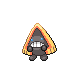
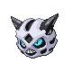

### Walking

| Sprite | Pokémon | Encounter Type | Level | Chance |
|:------:|---------|:--------------:|-------|--------|
|  | [Piloswine](../../pokemon/piloswine.md/) | {: style='max-width: 24px;' } | 45 - 49 | 30% |
|  | [Snorunt](../../pokemon/snorunt.md/) | {: style='max-width: 24px;' } | 45 - 49 | 20% |
|  | [Sneasel](../../pokemon/sneasel.md/) | {: style='max-width: 24px;' } | 45 - 49 | 10% |
|  | [Jynx](../../pokemon/jynx.md/) | {: style='max-width: 24px;' } | 45 - 49 | 10% |
|  | [Abomasnow](../../pokemon/abomasnow.md/) | {: style='max-width: 24px;' } | 45 - 49 | 10% |
|  | [Glalie](../../pokemon/glalie.md/) | {: style='max-width: 24px;' } | 45 - 49 | 10% |
|  | [Delibird](../../pokemon/delibird.md/) | {: style='max-width: 24px;' } | 45 - 49 | 10% |
|  | [Piloswine](../../pokemon/piloswine.md/) | {: style='max-width: 24px;' } | 45 - 49 | 30% |
|  | [Snorunt](../../pokemon/snorunt.md/) | {: style='max-width: 24px;' } | 45 - 49 | 20% |
|  | [Sneasel](../../pokemon/sneasel.md/) | {: style='max-width: 24px;' } | 45 - 49 | 10% |
|  | [Jynx](../../pokemon/jynx.md/) | {: style='max-width: 24px;' } | 45 - 49 | 10% |
|  | [Abomasnow](../../pokemon/abomasnow.md/) | {: style='max-width: 24px;' } | 45 - 49 | 10% |
|  | [Glalie](../../pokemon/glalie.md/) | {: style='max-width: 24px;' } | 45 - 49 | 10% |
|  | [Delibird](../../pokemon/delibird.md/) | {: style='max-width: 24px;' } | 45 - 49 | 10% |
|  | [Piloswine](../../pokemon/piloswine.md/) | {: style='max-width: 24px;' } | 45 - 49 | 30% |
|  | [Snorunt](../../pokemon/snorunt.md/) | {: style='max-width: 24px;' } | 45 - 49 | 20% |
|  | [Sneasel](../../pokemon/sneasel.md/) | {: style='max-width: 24px;' } | 45 - 49 | 10% |
|  | [Jynx](../../pokemon/jynx.md/) | {: style='max-width: 24px;' } | 45 - 49 | 10% |
|  | [Abomasnow](../../pokemon/abomasnow.md/) | {: style='max-width: 24px;' } | 45 - 49 | 10% |
|  | [Glalie](../../pokemon/glalie.md/) | {: style='max-width: 24px;' } | 45 - 49 | 10% |
|  | [Delibird](../../pokemon/delibird.md/) | {: style='max-width: 24px;' } | 45 - 49 | 10% |
|  | [Froslass](../../pokemon/froslass.md/) | {: style='max-width: 24px;' } | 45 - 49 | 22% |

