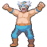
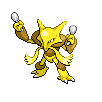
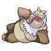

# Trainer Rosters

### Generic Trainers

| Trainer | P1 | P2 | P3 | P4 | P5 | P6 |
|:-------:|:--:|:--:|:--:|:--:|:--:|:--:|
|  Leader Roark |  [Sudowoodo](../../pokemon/sudowoodo.md/) Lv. 81 |  [Probopass](../../pokemon/probopass.md/) Lv. 81 |  [Golem](../../pokemon/golem.md/) Lv. 81 |  [Aerodactyl](../../pokemon/aerodactyl.md/) Lv. 81 |  [Tyranitar](../../pokemon/tyranitar.md/) Lv. 81 |  [Rampardos](../../pokemon/rampardos.md/) Lv. 82 |
|  Leader Gardenia |  [Cherrim](../../pokemon/cherrim.md/) Lv. 81 |  [Tangrowth](../../pokemon/tangrowth.md/) Lv. 81 |  [Bellossom](../../pokemon/bellossom.md/) Lv. 81 |  [Torterra](../../pokemon/torterra.md/) Lv. 81 |  [Breloom](../../pokemon/breloom.md/) Lv. 81 |  [Roserade](../../pokemon/roserade.md/) Lv. 82 |
|  Leader Fantina |  [Drifblim](../../pokemon/drifblim.md/) Lv. 81 |  [Dusknoir](../../pokemon/dusknoir.md/) Lv. 81 |  [Banette](../../pokemon/banette.md/) Lv. 81 |  [Spiritomb](../../pokemon/spiritomb.md/) Lv. 81 |  [Gengar](../../pokemon/gengar.md/) Lv. 81 |  [Mismagius](../../pokemon/mismagius.md/) Lv. 82 |
|  Leader Maylene |  [Medicham](../../pokemon/medicham.md/) Lv. 82 |  [Machamp](../../pokemon/machamp.md/) Lv. 82 |  [Infernape](../../pokemon/infernape.md/) Lv. 82 |  [Toxicroak](../../pokemon/toxicroak.md/) Lv. 82 |  [Gallade](../../pokemon/gallade.md/) Lv. 82 |  [Lucario](../../pokemon/lucario.md/) Lv. 83 |
|  Leader Wake |  [Quagsire](../../pokemon/quagsire.md/) Lv. 81 |  [Gyarados](../../pokemon/gyarados.md/) Lv. 81 |  [Poliwrath](../../pokemon/poliwrath.md/) Lv. 81 |  [Ludicolo](../../pokemon/ludicolo.md/) Lv. 81 |  [Sharpedo](../../pokemon/sharpedo.md/) Lv. 81 |  [Floatzel](../../pokemon/floatzel.md/) Lv. 82 |
|  Leader Byron |  [Bronzong](../../pokemon/bronzong.md/) Lv. 81 |  [Magnezone](../../pokemon/magnezone.md/) Lv. 81 |  [Steelix](../../pokemon/steelix.md/) Lv. 81 |  [Forretress](../../pokemon/forretress.md/) Lv. 81 |  [Aggron](../../pokemon/aggron.md/) Lv. 81 |  [Bastiodon](../../pokemon/bastiodon.md/) Lv. 82 |
|  Leader Candice |  [Abomasnow](../../pokemon/abomasnow.md/) Lv. 81 |  [Weavile](../../pokemon/weavile.md/) Lv. 81 |  [Glaceon](../../pokemon/glaceon.md/) Lv. 81 |  [Walrein](../../pokemon/walrein.md/) Lv. 81 |  [Mamoswine](../../pokemon/mamoswine.md/) Lv. 81 |  [Froslass](../../pokemon/froslass.md/) Lv. 82 |
|  Leader Volkner |  [Jolteon](../../pokemon/jolteon.md/) Lv. 81 |  [Raichu](../../pokemon/raichu.md/) Lv. 81 |  [Rotom](../../pokemon/rotom.md/) Lv. 81 |  [Rotom](../../pokemon/rotom.md/) Lv. 81 |  [Luxray](../../pokemon/luxray.md/) Lv. 81 |  [Electivire](../../pokemon/electivire.md/) Lv. 82 |
|  PKMN Trainer Cheryl |  [Wobbuffet](../../pokemon/wobbuffet.md/) Lv. 81 |  [Snorlax](../../pokemon/snorlax.md/) Lv. 81 |  [Drifblim](../../pokemon/drifblim.md/) Lv. 81 |  [Hariyama](../../pokemon/hariyama.md/) Lv. 81 |  [Wailord](../../pokemon/wailord.md/) Lv. 81 |  [Blissey](../../pokemon/blissey.md/) Lv. 82 |
|  PKMN Trainer Mira |  [Togekiss](../../pokemon/togekiss.md/) Lv. 81 |  [Gengar](../../pokemon/gengar.md/) Lv. 81 |  [Exeggutor](../../pokemon/exeggutor.md/) Lv. 81 |  [Magnezone](../../pokemon/magnezone.md/) Lv. 81 |  [Porygon-Z](../../pokemon/porygon-z.md/) Lv. 81 |  [Alakazam](../../pokemon/alakazam.md/) Lv. 82 |
|  PKMN Trainer Riley |  [Absol](../../pokemon/absol.md/) Lv. 81 |  [Ursaring](../../pokemon/ursaring.md/) Lv. 81 |  [Metagross](../../pokemon/metagross.md/) Lv. 81 |  [Salamence](../../pokemon/salamence.md/) Lv. 81 |  [Slaking](../../pokemon/slaking.md/) Lv. 81 |  [Lucario](../../pokemon/lucario.md/) Lv. 82 |
|  PKMN Trainer Marley |  [Starmie](../../pokemon/starmie.md/) Lv. 81 |  [Electrode](../../pokemon/electrode.md/) Lv. 81 |  [Sceptile](../../pokemon/sceptile.md/) Lv. 81 |  [Crobat](../../pokemon/crobat.md/) Lv. 81 |  [Weavile](../../pokemon/weavile.md/) Lv. 81 |  [Arcanine](../../pokemon/arcanine.md/) Lv. 82 |
|  PKMN Trainer Buck |  [Torkoal](../../pokemon/torkoal.md/) Lv. 81 |  [Shuckle](../../pokemon/shuckle.md/) Lv. 81 |  [Umbreon](../../pokemon/umbreon.md/) Lv. 81 |  [Dusknoir](../../pokemon/dusknoir.md/) Lv. 81 |  [Cloyster](../../pokemon/cloyster.md/) Lv. 81 |  [Claydol](../../pokemon/claydol.md/) Lv. 82 |
|  PKMN Trainer Barry |  [Staraptor](../../pokemon/staraptor.md/) Lv. 84 |  [Heracross](../../pokemon/heracross.md/) Lv. 84 |  [Snorlax](../../pokemon/snorlax.md/) Lv. 84 |  [Azumarill](../../pokemon/azumarill.md/) Lv. 84 |  [Arcanine](../../pokemon/arcanine.md/) Lv. 84 |  [Torterra](../../pokemon/torterra.md/) Lv. 85 |
|  PKMN Trainer Barry |  [Staraptor](../../pokemon/staraptor.md/) Lv. 84 |  [Heracross](../../pokemon/heracross.md/) Lv. 84 |  [Snorlax](../../pokemon/snorlax.md/) Lv. 84 |  [Azumarill](../../pokemon/azumarill.md/) Lv. 84 |  [Breloom](../../pokemon/breloom.md/) Lv. 84 |  [Infernape](../../pokemon/infernape.md/) Lv. 85 |
|  PKMN Trainer Barry |  [Staraptor](../../pokemon/staraptor.md/) Lv. 84 |  [Heracross](../../pokemon/heracross.md/) Lv. 84 |  [Snorlax](../../pokemon/snorlax.md/) Lv. 84 |  [Breloom](../../pokemon/breloom.md/) Lv. 84 |  [Arcanine](../../pokemon/arcanine.md/) Lv. 84 |  [Empoleon](../../pokemon/empoleon.md/) Lv. 85 |
|  PKMN Trainer Dawn |  [Alakazam](../../pokemon/alakazam.md/) Lv. 83 |  [Mamoswine](../../pokemon/mamoswine.md/) Lv. 83 |  [Clefable](../../pokemon/clefable.md/) Lv. 83 |  [Lopunny](../../pokemon/lopunny.md/) Lv. 83 |  [Vaporeon](../../pokemon/vaporeon.md/) Lv. 83 |  [Torterra](../../pokemon/torterra.md/) Lv. 84 |
|  PKMN Trainer Dawn |  [Alakazam](../../pokemon/alakazam.md/) Lv. 83 |  [Mamoswine](../../pokemon/mamoswine.md/) Lv. 83 |  [Clefable](../../pokemon/clefable.md/) Lv. 83 |  [Lopunny](../../pokemon/lopunny.md/) Lv. 83 |  [Jolteon](../../pokemon/jolteon.md/) Lv. 83 |  [Infernape](../../pokemon/infernape.md/) Lv. 84 |
|  PKMN Trainer Dawn |  [Alakazam](../../pokemon/alakazam.md/) Lv. 83 |  [Mamoswine](../../pokemon/mamoswine.md/) Lv. 83 |  [Clefable](../../pokemon/clefable.md/) Lv. 83 |  [Lopunny](../../pokemon/lopunny.md/) Lv. 83 |  [Flareon](../../pokemon/flareon.md/) Lv. 83 |  [Empoleon](../../pokemon/empoleon.md/) Lv. 84 |
|  PKMN Trainer Lucas |  [Alakazam](../../pokemon/alakazam.md/) Lv. 83 |  [Mamoswine](../../pokemon/mamoswine.md/) Lv. 83 |  [Granbull](../../pokemon/granbull.md/) Lv. 83 |  [Lickilicky](../../pokemon/lickilicky.md/) Lv. 83 |  [Vaporeon](../../pokemon/vaporeon.md/) Lv. 83 |  [Torterra](../../pokemon/torterra.md/) Lv. 84 |
|  PKMN Trainer Lucas |  [Alakazam](../../pokemon/alakazam.md/) Lv. 83 |  [Mamoswine](../../pokemon/mamoswine.md/) Lv. 83 |  [Granbull](../../pokemon/granbull.md/) Lv. 83 |  [Lickilicky](../../pokemon/lickilicky.md/) Lv. 83 |  [Jolteon](../../pokemon/jolteon.md/) Lv. 83 |  [Infernape](../../pokemon/infernape.md/) Lv. 84 |
|  PKMN Trainer Lucas |  [Alakazam](../../pokemon/alakazam.md/) Lv. 83 |  [Mamoswine](../../pokemon/mamoswine.md/) Lv. 83 |  [Granbull](../../pokemon/granbull.md/) Lv. 83 |  [Lickilicky](../../pokemon/lickilicky.md/) Lv. 83 |  [Flareon](../../pokemon/flareon.md/) Lv. 83 |  [Empoleon](../../pokemon/empoleon.md/) Lv. 84 |
|  Commander Mars |  [Crobat](../../pokemon/crobat.md/) Lv. 81 |  [Yanmega](../../pokemon/yanmega.md/) Lv. 81 |  [Bronzong](../../pokemon/bronzong.md/) Lv. 81 |  [Electivire](../../pokemon/electivire.md/) Lv. 81 |  [Kangaskhan](../../pokemon/kangaskhan.md/) Lv. 81 |  [Purugly](../../pokemon/purugly.md/) Lv. 82 |
|  Commander Jupiter |  [Bronzong](../../pokemon/bronzong.md/) Lv. 81 |  [Sableye](../../pokemon/sableye.md/) Lv. 81 |  [Crobat](../../pokemon/crobat.md/) Lv. 81 |  [Tangrowth](../../pokemon/tangrowth.md/) Lv. 81 |  [Gastrodon](../../pokemon/gastrodon.md/) Lv. 81 |  [Skuntank](../../pokemon/skuntank.md/) Lv. 82 |
|  Commander Saturn |  [Bronzong](../../pokemon/bronzong.md/) Lv. 81 |  [Octillery](../../pokemon/octillery.md/) Lv. 81 |  [Alakazam](../../pokemon/alakazam.md/) Lv. 81 |  [Rhyperior](../../pokemon/rhyperior.md/) Lv. 81 |  [Magmortar](../../pokemon/magmortar.md/) Lv. 81 |  [Toxicroak](../../pokemon/toxicroak.md/) Lv. 82 |
|  Galactic Boss Cyrus |  [Crobat](../../pokemon/crobat.md/) Lv. 83 |  [Honchkrow](../../pokemon/honchkrow.md/) Lv. 83 |  [Houndoom](../../pokemon/houndoom.md/) Lv. 83 |  [Gyarados](../../pokemon/gyarados.md/) Lv. 83 |  [Magnezone](../../pokemon/magnezone.md/) Lv. 83 |  [Weavile](../../pokemon/weavile.md/) Lv. 84 |

